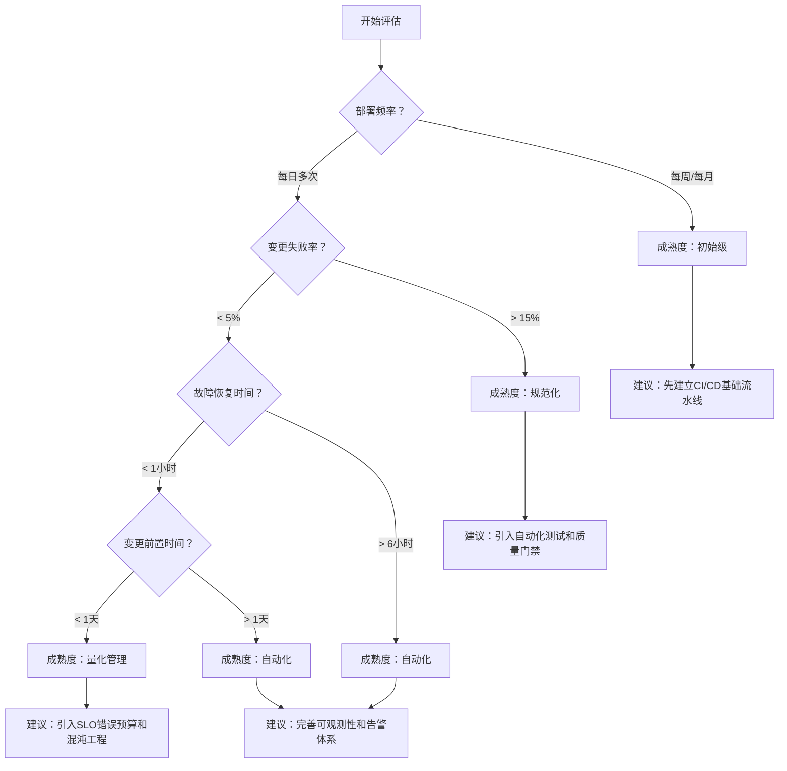

# 第1章：DevOps 理念与价值

## 本章学习目标

- 理解 DevOps 的定义、起源与核心价值
- 掌握 CALMS 五大支柱的内涵
- 了解从瀑布到 DevOps 的工程文化演进
- ✅ **进阶目标**：能够依据团队现状制定 DevOps 成熟度评估和转型路线图

## 先行思考

> 在阅读本章之前，不妨先问问自己：
> - 你的团队上一次无痛发布是什么时候？
> - 从代码提交到功能上线，需要经过多少人的手？
> - 线上出了问题，第一反应是修 Bug 还是追责任？

这些问题的答案，直接决定你离真正意义上的 DevOps 有多远。

## 生产案例：某中型支付公司的 DevOps 转型之路

### 背景

**某中型支付公司，200 人技术团队（开发 150 人，运维 20 人，测试 30 人）**。当时面临典型的"职能竖井"困境：

- **发布周期**：每两周一个 release 分支，手动打包，手动部署。从代码冻结到上线需要 3 天
- **变更前置时间**：从 PR 合并到代码上线平均 72 小时，最长 2 周
- **变更失败率**：约 25% 的线上变更导致不同程度的降级
- **故障恢复**：平均 MTTR 6 小时，经常需要凌晨全员 On-Call
- **团队关系**：开发和运维互相甩锅——"代码没问题，是环境有问题" vs "你们乱改配置，我怎么知道"

**核心瓶颈**：不是工具不够，而是信任不够。

### 转型路径

**第一阶段（第 1-3 个月）：文化建设 + 单条流水线实验**

1. 选择一个**非核心**的服务（内部工单系统），建立第一条 CI/CD 流水线
2. 引入 DORA 指标的采集：部署频率、变更前置时间、变更失败率、恢复时间
3. 每周五下午的"DevOps 分享会"——运维教开发写 CI 配置，开发教运维写单元测试
4. 建立"谁提交谁 On-Call"制度：开发者提交到主线后，需要自己观察 30 分钟的线上指标

**第二阶段（第 4-8 个月）：规模化推广**

1. 所有核心服务完成容器化（Docker）和 K8s 部署
2. 建立统一 CI/CD 平台，不再允许手动部署
3. 引入蓝绿部署 + 金丝雀发布（先 1% 流量验证 15 分钟）
4. 建立 On-Call 轮值 + 自动化告警升级机制

**第三阶段（第 9-12 个月）：量化管理和持续优化**

1. 建立 SLO/SLI 体系：核心支付接口 P99 延迟 < 200ms，可用性 > 99.99%
2. 引入错误预算概念：SLO 达标→可以发布；错误预算耗尽→冻结发布
3. 月度故障复盘（Blameless Postmortem）：关注根因和改进，不追责个人

### 关键指标前后对比

| 指标 | 转型前 | 转型后 | 关键驱动因素 |
|------|--------|--------|------------|
| 部署频率 | 每 2 周 1 次 | 每天 5~15 次 | CI/CD 流水线 + 自动化测试 |
| 变更前置时间 | 72 小时 | 45 分钟 | PR 并行化 + 环境即服务 |
| 变更失败率 | 25% | 3.5% | 金丝雀发布 + 自动化回滚 |
| 故障恢复时间 | 6 小时 | 23 分钟 | 可观测性体系 + 自动化恢复流程 |

### 经验教训

1. **人比工具重要**：先解决信任问题，再买工具。没有信任的 DevOps 是"DevOnlyOps"
2. **不要大爆炸迁移**：从一个小服务开始，证明 ROI 后再推广
3. **度量要公开透明**：DORA 仪表盘对全员开放，用数据而不是感觉做决策
4. **领导者参与**：CTO 和 VP 需要亲自参与 On-Call，才能理解一线痛点

## 什么是 DevOps

**DevOps** 是 **Development（开发）** 与 **Operations（运维）** 两个词的合成词。它不仅仅是一套工具或流程，更是一种**文化运动**、一种**工程实践**，旨在打破传统开发团队与运维团队之间的壁垒，实现更快速、更可靠的软件交付。

### 核心定义

> DevOps 是一种文化、理念和实践的组合，它通过增强开发与运维之间的协作、自动化和度量，帮助组织更快地交付高质量的软件。——《The DevOps Handbook》

### DevOps 的本质

| 传统模式 | DevOps 模式 |
|---------|------------|
| 开发写代码 → 运维部署 | 开发和运维共同负责交付 |
| 研发效率 vs 系统稳定性互斥 | 效率与稳定性可以兼得 |
| 手动操作、文档传递 | 自动化流水线、可重复 |
| 运维是成本中心 | 运维是能力平台 |
| 大型发布、高风险 | 小步快跑、低风险 |

### ❓ 选型思考：什么时候应该 DevOps，什么时候不该

**适合 DevOps 的场景**：
- 频繁更新的互联网产品（SaaS、电商、金融科技）
- 需要快速响应市场变化的产品
- 团队有持续改进的文化意愿

**不一定适合 DevOps 的场景**：
- 嵌入式系统 / 航天 / 医疗器械（变更频率极低但单次变更风险极高）
- 超小型团队（3 人以下，严格的 DevOps 流程反而是负担）
- 外包项目（交付即结束，不需要长期运维）

## DevOps 的起源

### 时间线概览

```
2009 → 比利时根特 DevOpsDays 首办，DevOps 术语正式提出
  ↓
2010 → 《持续交付》出版，奠定技术基础
  ↓
2012 → Puppet Labs 发布首个 DevOps 状态报告
  ↓
2014 → 《凤凰项目》小说出版，文化层面出圈
  ↓
2016 → 《DevOps Handbook》系统化方法论
  ↓
2018 → DORA 报告发布《加速》研究，发现高绩效组织特征
  ↓
2020+ → DevSecOps / GitOps / Platform Engineering 持续演进
```

### 推动因素

1. **互联网规模的增长**：用户量级从万级到亿级，传统运维模式无法支撑
2. **敏捷开发的普及**：开发迭代变快，但部署停滞——"开发在 Agile，运维在 Waterfall"
3. **云的兴起**：AWS 2006 年发布，基础设施从物理机变为 API
4. **虚拟化与容器**：VM → Docker → K8s，环境一致性大幅提升

## CALMS：DevOps 五大支柱

### C — Culture（文化）

DevOps 首先是文化问题，其次才是工具问题。

- **共享责任**：开发对线上稳定性负责，运维对交付效率负责
- **信任与协作**：消除"我写代码你部署"的对立关系
- **失败是学习机会**：从"追责文化"转向"学习文化"
- **跨职能团队**：以产品为中心，而非以职能为中心

### A — Automation（自动化）

自动化是 DevOps 的发动机。

| 环节 | 自动化对象 | 价值 |
|------|-----------|------|
| 代码提交 | 静态检查、单元测试 | 即时反馈 |
| 构建打包 | 编译、镜像构建、制品管理 | 一致性 |
| 测试 | 集成测试、端到端测试 | 质量保障 |
| 部署 | 灰度、滚动、蓝绿 | 降低风险 |
| 基础设施 | 环境创建、配置管理 | 消除漂移 |
| 监控告警 | 指标采集、告警触发 | 快速发现 |

### L — Lean（精益）

借鉴丰田精益生产理念，消除软件交付中的**浪费**：

| 浪费类型 | 软件开发中的表现 |
|---------|-----------------|
| 等待 | 等待审批、等待环境、等待测试 |
| 返工 | Bug 修复、需求理解偏差 |
| 不必要的功能 | 没人用的特性 |
| 交接 | 开发 → 测试 → 运维的手递手 |
| 手工操作 | 手动部署、手动配置服务器 |

核心原则：**小批量、快速流动、持续改进**。

### M — Measurement（度量）

你无法改进你无法度量的事情。

**DORA 四大核心指标**（源自 Google 的 DevOps Research & Assessment）：

| 指标 | 定义 | 高效能组织 | 低效能组织 |
|------|------|-----------|-----------|
| **部署频率** | 多久部署一次 | 每天多次（按需） | 每周到每月一次 |
| **变更前置时间** | 从代码提交到上线的时间 | < 1 小时 | 1 周到 1 个月 |
| **变更失败率** | 部署导致服务降级的比例 | < 5% | 30% ~ 60% |
| **故障恢复时间** | 从故障到恢复的时间 | < 1 小时 | > 24 小时 |

> 注意：DORA 指标之间存在联动——部署频率高并不意味着变更失败率更高。

**其他重要指标**：

- 平均故障间隔时间（MTBF）
- 平均恢复时间（MTTR）
- 吞吐量（Story Points / Sprint）
- 系统可用性百分比

### ❓ 决策框架：如何评估你团队的 DevOps 成熟度



### S — Sharing（共享）

- **知识共享**：文档、复盘、Pair Programming
- **工具共享**：统一构建、统一监控、统一告警
- **责任共享**：全体 On-Call（开发也要值班）
- **成功共享**：部署是团队的胜利，而非个人的功劳

## DevOps 成熟度模型

### 第一阶段：初始级

> 特征：手动构建、手动部署、环境不一致、发布提心吊胆

- 部署频率：月/季度
- 平均恢复时间：天级
- **标志性动作**：开始用版本控制管理代码

### 第二阶段：规范化

> 特征：有标准化流程但仍有大量手工操作，有 CI 但无 CD

- 部署频率：周级
- 平均恢复时间：小时级
- **标志性动作**：引入 CI 服务器、建立自动化测试

### 第三阶段：自动化

> 特征：CI/CD 流水线完善，环境一致性强，自动化部署

- 部署频率：天级/按需
- 平均恢复时间：分钟级
- **标志性动作**：基础设施即代码、容器化

### 第四阶段：量化管理

> 特征：全流程可观测，用数据驱动决策，部署已成为日常

- 部署频率：每天多次
- 平均恢复时间：分钟级
- **标志性动作**：SLO/SLI 体系、混沌工程

### 第五阶段：持续优化

> 特征：DevOps 文化已融入基因，团队自主优化，自助式平台

- 部署频率：每天多次（安全且常态化）
- 平均恢复时间：秒级（自动恢复）
- **标志性动作**：平台工程、开发者门户

## 常见误区澄清

| 误区 | 澄清 |
|------|------|
| DevOps 是一个岗位 | DevOps 是文化实践，不是"招一个 DevOps 工程师"就能解决问题 |
| DevOps 就是 CI/CD | CI/CD 是工具实践，DevOps 的核心是文化和协作 |
| DevOps 运维失业 | 运维角色从"手动操作"转向"平台建设与自动化" |
| DevOps 需要全部推翻重来 | 可以从一个项目、一条流水线开始渐进式改进 |
| DevOps 是开发的事 | 没有运维参与的 DevOps 是 DevOnly |

## 转型路线图参考

| 阶段 | 时间 | 关键行动 | 衡量指标 |
|------|------|---------|---------|
| **试点** | 1~3 月 | 选一个非核心服务建 CI/CD 流水线 | 单条流水线运行稳定 |
| **推广** | 4~6 月 | 容器化、IaC、自动部署覆盖 80% 服务 | 部署频率提升 10x |
| **量化** | 7~9 月 | SLO 体系、可观测性、告警降噪 | 变更失败率 < 10% |
| **文化** | 10~12 月 | 全员 On-Call、Blameless Postmortem | MTTR < 1h |
| **持续** | 第 2 年+ | 混沌工程、平台工程、开发者门户 | 四项 DORA 指标全面达标 |

## 本章小结

| 要点 | 说明 |
|------|------|
| DevOps 定义 | 开发与运维融合的文化与实践，目标是快速可靠交付 |
| 核心模型 | CALMS：文化、自动化、精益、度量、共享 |
| 关键价值 | 小批量、快交付、低风险、持续学习 |
| 成熟度五阶段 | 初始 → 规范化 → 自动化 → 量化 → 持续优化 |
| 核心指标 | DORA 四大指标：部署频率、前置时间、变更失败率、恢复时间 |
| 转型启示 | 案例证明：12 个月可以从月部署到日部署 ×15、失败率从 25% 降至 3.5% |

