# TCP/IP 网络模型有哪几层？

为什么要有 TCP/IP 网络模型？

对于不同设备上的进程间通信，需要网络通信，而设备是多样性的，所以要兼容多种多样的设备，就协商出了一套**通用的网络协议**。

这个网络协议是分层的，每一层都有各自的作用和职责，接下来就根据「TCP/IP 网络模型」分别对每一层进行介绍。

TCP/IP 网络通常是由上到下分成 4 层：

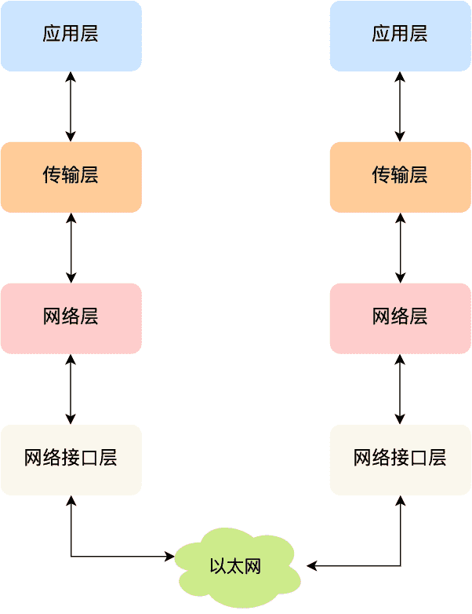

## 应用层

最上层的，也是我们能直接接触到的就是**应用层**（Application Layer），我们电脑或手机使用的应用软件都是在应用层实现。那么，当两个不同设备的应用需要通信的时候，应用就把应用数据传给下一层，也就是传输层。

所以，应用层只需要专注于为用户提供应用功能，比如 HTTP、FTP、Telnet、DNS、SMTP 等。

应用层是不用去关心数据是如何传输的，而且应用层是工作在操作系统中的用户态，传输层及以下则工作在内核态。

## 传输层

应用层的数据包会传给传输层，**传输层**（Transport Layer）是为应用层提供网络支持的。

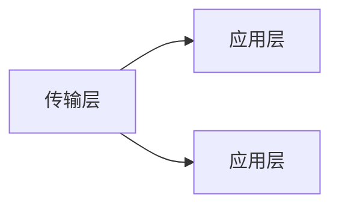

在传输层会有两个传输协议，分别是 TCP 和 UDP。

### TCP

TCP 的全称叫传输控制协议（Transmission Control Protocol），大部分应用使用的正是 TCP 传输层协议，比如 HTTP 应用层协议。TCP 相比 UDP 多了很多特性，比如流量控制、超时重传、拥塞控制等，这些都是为了保证数据包能可靠地传输给对方。

应用需要传输的数据可能会非常大，如果直接传输就不好控制，因此当传输层的数据包大小超过 MSS（TCP 最大报文段长度），就要将数据包分块，这样即使中途有一个分块丢失或损坏了，只需要重新发送这一个分块，而不用重新发送整个数据包。在 TCP 协议中，我们把每个分块称为一个 **TCP 段**（TCP Segment）。

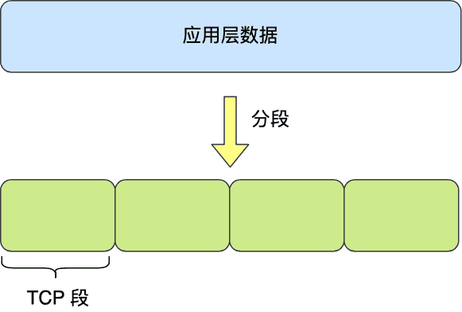

当设备作为接收方时，传输层则要负责把数据包传给应用，但是一台设备上可能会有很多应用在接收或者传输数据，因此需要用一个编号将应用区分开来，这个编号就是**端口**。

比如 80 端口通常是 Web 服务器用的，22 端口通常是远程登录服务器用的。而对于浏览器（客户端）中的每个标签栏都是一个独立的进程，操作系统会为这些进程分配临时的端口号。

由于传输层的报文中会携带端口号，因此接收方可以识别出该报文是发送给哪个应用。

TCP报文详解如下：

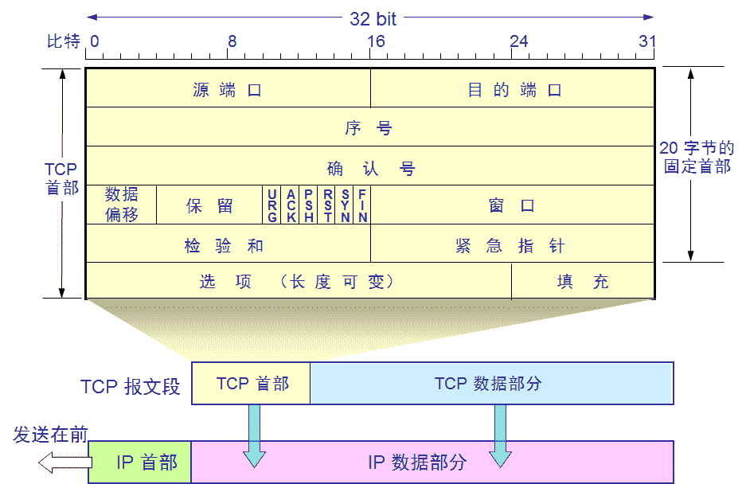

- 源端口号：16bit 一般是大于1023，自己定义的；64911后为扩展端口号
- 目的端口号：16bit 一般是小于1024，具体要去访问某个服务，就要对应相应的端口号，端口对应服务；
- 序号：32bit，占4个字节，是本报文段所发送的数据项目组第一个字节的序号。在TCP传送的数据流中，每一个字节都有一个序号。例如，一报文段的序号为300，而数据大小100字节，则下一个报文段的序号就是400；
- 确认号：32bit，占4字节，是期望收到对方下次发送的数据的第一个字节的序号，也就是期望收到的下一个报文段的首部中的序号；
    因为序号字段有32比特长，可以对4GB的数据进行编号，当序号反复应用时，旧序号的数据早已在收集中消散了；
- 数据偏移：占4比特，默示数据开端的处所离TCP报文段的肇端处有多远。这实际上就是TCP报文段首部的长度。因为首部长度不固定，是以数据偏移字段是须要的。
- 保存字段：6比特，供往后应用，今朝置为0。
- 6个比特的把握字段
    - 紧急比特URGent：当URG=1时，注解此报文应尽快传送，而不要按本来的列队次序来传送。与“紧急指针”字段共同应用，紧急指针指出在本报文段中的紧急数据的最后一个字节的序号，使接管方可以知道紧急数据共有多长；
    - 确认比特ACK：只有当ACK=1时，确认序号字段才有意义；
    - 急迫比特PSH：当PSH=1时，注解恳求远地TCP将本报文段立即传送给其应用层，而不要等全部缓存都填满了之后再向上交付。
    - 复位比特ReSeT：当RST=1时，注解呈现严重错误，必须断开连接，然后再重建传输连接。复位比特还用来拒绝一个不合法的报文段或拒绝打开一个连接；
    - 同步比特SYN：在建立连接时应用，当SYN=1而ACK=0时，注解这是一个连接恳求报文段。对方若同意建立连接，在返回的报文段中使SYN=1和ACK=1。SYN=1默示这是一个连接恳求或确认报文，而ACK的值用来区分这是哪一种报文；
    - 终止比特FINal：用来断开一个连接，当FIN=1时，发送方字节串结束，请求断开传输连接；

- 窗口字段
  -  窗口Window：占2字节，默示报文段发送方的接管窗口，单位为字节。此窗口告诉对方，“在未收到我的确认时，你可以发送的数据的字节数至多是此窗口的大小。”

### UDP

UDP 相对来说就很简单，简单到只负责发送数据包，不保证数据包是否能抵达对方，但它实时性相对更好，传输效率也高。当然，UDP 也可以实现可靠传输，把 TCP 的特性在应用层上实现就可以。

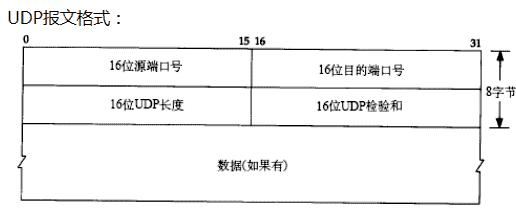

## 网络层

传输层可能大家刚接触的时候，会认为它负责将数据从一个设备传输到另一个设备，事实上它并不负责。

实际场景中的网络环节是错综复杂的，中间有各种各样的线路和分叉路口，如果一个设备的数据要传输给另一个设备，就需要在各种各样的路径和节点进行选择，而传输层的设计理念是简单、高效、专注，如果传输层还负责这一块功能就有点违背设计原则了。

也就是说，我们不希望传输层协议处理太多的事情，只需要服务好应用即可，让其作为应用间数据传输的媒介，帮助实现应用到应用的通信，而实际的传输功能就交给下一层，也就是**网络层**（Internet Layer）。

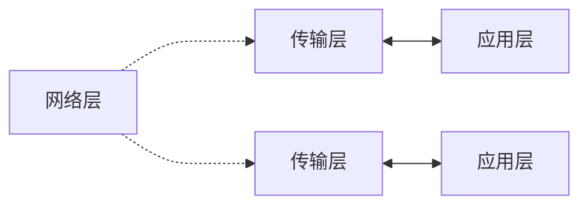

网络层最常使用的是 IP 协议（Internet Protocol），IP 协议会将传输层的报文作为数据部分，再加上 IP 报头组装成 IP 报文，如果 IP 报文大小超过 MTU（以太网中一般为 1500 字节）就会**再次进行分片**，得到一个即将发送到网络的 IP 报文。

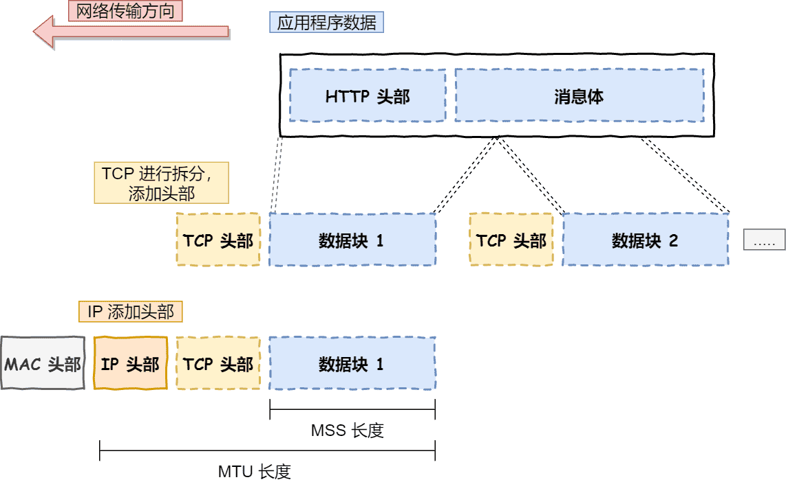

网络层负责将数据从一个设备传输到另一个设备，世界上那么多设备，又该如何找到对方呢？因此，网络层需要有区分设备的编号。

我们一般用 IP 地址给设备进行编号，对于 IPv4 协议，IP 地址共 32 位，分成了四段（比如，192.168.100.1），每段是 8 位。只有一个单纯的 IP 地址虽然做到了区分设备，但是寻址起来就特别麻烦，全世界那么多台设备，难道一个一个去匹配？这显然不科学。

因此，需要将 IP 地址分成两种意义：

- 一个是**网络号**，负责标识该 IP 地址是属于哪个「子网」的；
- 一个是**主机号**，负责标识同一「子网」下的不同主机；

怎么分的呢？这需要配合**子网掩码**才能算出 IP 地址 的网络号和主机号。

举个例子，比如 10.100.122.0/24，后面的`/24`表示就是 `255.255.255.0` 子网掩码，255.255.255.0 二进制是「11111111-11111111-11111111-00000000」，大家数数一共多少个 1？不用数了，是 24 个 1，为了简化子网掩码的表示，用/24代替 255.255.255.0。

知道了子网掩码，该怎么计算出网络地址和主机地址呢？

将 10.100.122.2 和 255.255.255.0 进行**按位与运算**，就可以得到网络号，如下图：

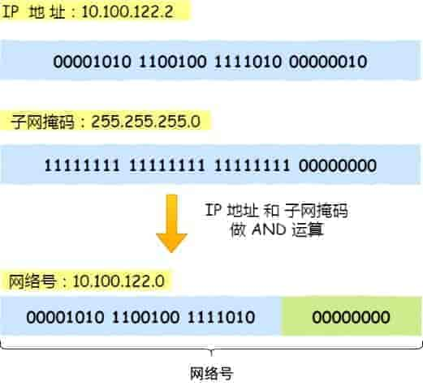

将 255.255.255.0 取反后与 IP 地址进行进行**按位与运算**，就可以得到主机号。

大家可以去搜索下子网掩码计算器，自己改变下「掩码位」的数值，就能体会到子网掩码的作用了。

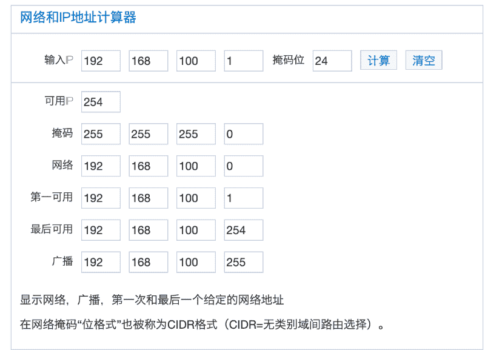

那么在寻址的过程中，先匹配到相同的网络号（表示要找到同一个子网），才会去找对应的主机。

除了寻址能力，IP 协议还有另一个重要的能力就是**路由**。实际场景中，两台设备并不是用一条网线连接起来的，而是通过很多网关、路由器、交换机等众多网络设备连接起来的，那么就会形成很多条网络的路径，因此当数据包到达一个网络节点，就需要通过路由算法决定下一步走哪条路径。

路由器寻址工作中，就是要找到目标地址的子网，找到后进而把数据包转发给对应的网络内。

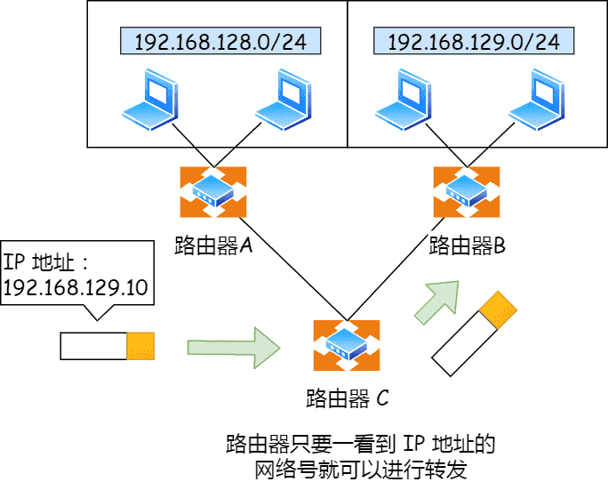

所以，IP 协议的寻址作用是告诉我们去往下一个目的地该朝哪个方向走，路由则是根据「下一个目的地」选择路径。寻址更像在导航，路由更像在操作方向盘。

## 网络接口层

生成了 IP 头部之后，接下来要交给**网络接口层**（Link Layer）在 IP 头部的前面加上 MAC 头部，并封装成数据帧（Data frame）发送到网络上。

IP 头部中的接收方 IP 地址表示网络包的目的地，通过这个地址我们就可以判断要将包发到哪里，但在以太网的世界中，这个思路是行不通的。

什么是以太网呢？电脑上的以太网接口，Wi-Fi 接口，以太网交换机、路由器上的千兆，万兆以太网口，还有网线，它们都是以太网的组成部分。以太网就是一种在「局域网」内，把附近的设备连接起来，使它们之间可以进行通讯的技术。

以太网在判断网络包目的地时和 IP 的方式不同，因此必须采用相匹配的方式才能在以太网中将包发往目的地，而 MAC 头部就是干这个用的，所以，在以太网进行通讯要用到 MAC 地址。

MAC 头部是以太网使用的头部，它包含了接收方和发送方的 MAC 地址等信息，我们可以通过 ARP 协议获取对方的 MAC 地址。

所以说，网络接口层主要为网络层提供「链路级别」传输的服务，负责在以太网、WiFi 这样的底层网络上发送原始数据包，工作在网卡这个层次，使用 MAC 地址来标识网络上的设备。

**MAC头部详解**：

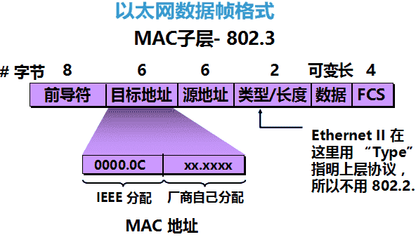

- 协议：S-HDLC/PPP；E/F/G-802.3，以太网II；
- 前导符：8字节，接口根据前导符来确定对端的介质信号是否有携带数据（即是数据电流还是探测电流）；
- 目的MAC：6字节；
- 源MAC：6字节；
- 长度类型字段：2字节；
  - 如果长度类型字段的值大于1500，表示为类型，这个二层协议就叫做以太网II，该字段表示网络层使用什么协议：（0X0800=ip 0x0806=arp)，然后置于数据流的长度就将其定义为固定长度1500，是现在最常见的二层协议；
  - 如果长度类型字段的值小于1500，表示为长度，这个二层协议就叫做802.3，就能表示出这个数据流具体的长度，但是这就无法得知上层的协议，无法继续向后去读取，这时通过新加中间报头LLC，然后在LLC层报头指明上层协议；
- FCS校验，防止高低电平的错位；

802.1Q报头：

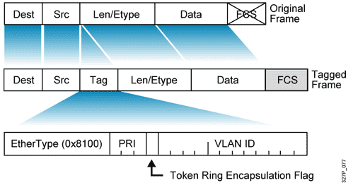

- 802.1QTag的长度是4bytes，它位于以太网帧中源MAC地址和长度/类型之间。802.1QTag包含4个字节
- Type：长度为2bytes，表示帧类型，802.1Qtag帧中type字段取固定值0x8100，如果不支持802.1Q的设备收到802.1Q帧，则将其丢弃。
- PRI：priority字段，长度为3bit，表示以太网帧的优先级，取值范围是0~7，数值越大，优先级越高。当交换机/路由器发生传输用色时，优先发送优先级高的数据帧。
- CFI：Canonical FormatIndicator，长度为1bit，表示MAC地址是否是经典格式。CFI为0说明是经典格式，CFI为1表示为非经典格式。该字段用于区分以太网帧、FDDI帧和令牌环网帧，在以太网帧中，CFI取值为0。
- VID：VLAN ID，长度为12bit，取值范围是0~4095，其中0和4095是保留值，不能给用户使用。

