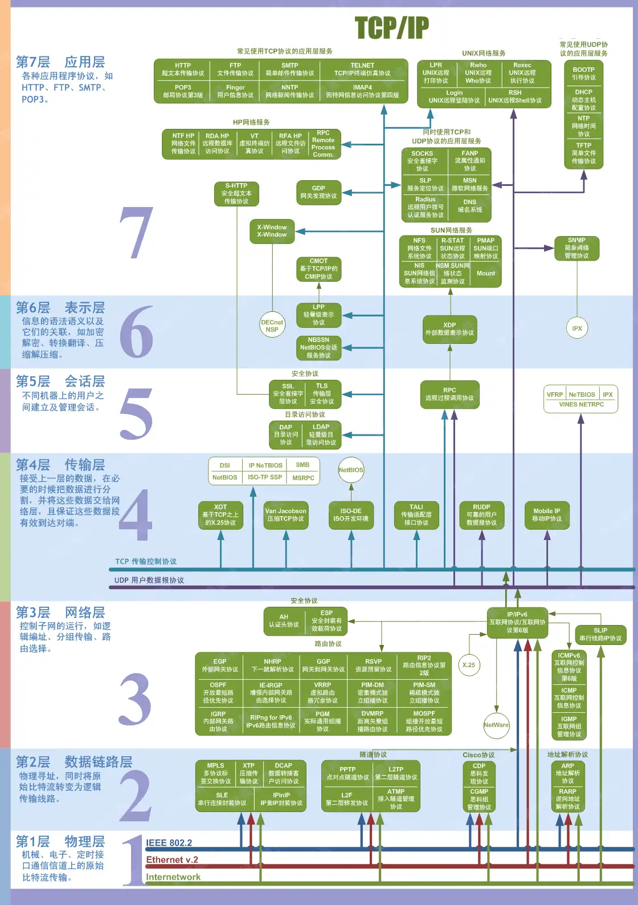

# 网络模型

## 概览

OSI七层模型 vs. TCP/IP四层模型对比表

| 层级           | OSI七层模型                   | TCP/IP四层模型           | 核心功能                                                   | 典型协议/技术                                                |
| -------------- | ----------------------------- | ------------------------ | ---------------------------------------------------------- | ------------------------------------------------------------ |
| **应用层**     | 应用层（Application Layer）   | 应用层                   | 提供用户接口和网络服务（如网页浏览、邮件收发）             | HTTP/HTTPS、FTP、SMTP、DNS、SSH、MQTT                        |
| **表示层**     | 表示层（Presentation Layer）  | （合并至应用层）         | 数据格式转换、加密解密、压缩解压                           | SSL/TLS                                                      |
| **会话层**     | 会话层（Session Layer）       | （合并至应用层）         | 建立、管理和终止会话（如断点续传、对话控制）               | NetBIOS、RPC、SSH会话                                        |
| **传输层**     | 传输层（Transport Layer）     | 传输层                   | 端到端可靠传输（TCP）或高效传输（UDP），流量控制、错误校验 | TCP、UDP                                                     |
| **网络层**     | 网络层（Network Layer）       | 网络层（Internet Layer） | 逻辑寻址（IP地址）、路由选择、分组转发                     | IP（IPv4/IPv6）、ICMP（Ping）、ARP（IP→MAC映射）、RARP、OSPF/BGP |
| **数据链路层** | 数据链路层（Data Link Layer） | 网络接口层               | 帧封装、MAC地址寻址、差错控制（CRC）                       | Ethernet（IEEE 802.3）、Wi-Fi（802.11）、PPP（拨号）、HDLC、VLAN、STP |
| **物理层**     | 物理层（Physical Layer）      | （合并至网络接口层）     | 比特流传输，定义电气/机械特性（电压、光信号）              | 双绞线（Cat6）、光纤、Wi-Fi射频、中继器/集线器、USB          |

## OSI 7 层模型

为了使得多种设备能通过网络相互通信，和为了解决各种不同设备在网络互联中的兼容性问题，国际标准化组织制定了开放式系统互联通信参考模型（Open System Interconnection Reference Model），也就是 OSI 网络模型。

OSI 网络模型主要有 7 层，每一层负责的职能都不同，从下到上依次为：

| 模型对比                            | 核心作用                                               | 功能描述                                                     | 主要协议/标准                                                |
| :---------------------------------- | :----------------------------------------------------- | :----------------------------------------------------------- | :----------------------------------------------------------- |
| **应用层** (Application Layer)   | **为应用程序提供网络服务**(提供用户接口)               | 提供用户与应用程序之间的网络服务，如文件传输、电子邮件、网页浏览。确定通信对象的可用性和同步。 | **HTTP**, HTTPS, **FTP**, SMTP, POP3/IMAP, **DNS**, DHCP, Telnet, SNMP |
| **表示层** (Presentation Layer)  | **数据翻译、加密与压缩**(确保应用层能读取数据)         | 将应用层的数据“表示”成网络通用的格式。负责数据编码解码、加密解密、压缩解压缩。 | SSL/TLS, JPEG, MPEG, GIF, MP3, ASCII                         |
| **会话层** (Session Layer)       | **建立、管理和终止会话**(控制会话和连接)               | 负责建立、管理和终止两个应用层实体之间的对话（会话）。提供对话控制和同步功能。 | NetBIOS, RPC, PPTP                                           |
| **传输层** (Transport Layer)     | **提供端到端的连接和可靠性** (保证数据传输的可靠性) | 负责两个主机进程之间的通信。提供可靠(TCP)或不可靠(UDP)的数据传输服务。进行流量控制、差错控制和数据重传。 | **TCP** (传输控制协议), **UDP** (用户数据报协议)             |
| **网络层** (Network Layer)       | **路径选择与逻辑寻址** (决定数据的路径)             | 负责将数据包从源主机经过多个网络路由到目的主机。进行逻辑寻址（IP地址）和路由选择。 | **IP** (网际协议), **ICMP**, **ARP**, **RIP**, OSPF, **路由器** |
| **数据链路层** (Data Link Layer) | **介质访问与物理寻址** (在节点间可靠传输数据)       | 负责在同一个局域网内，通过物理地址（MAC地址）在两个直接相连的节点之间可靠地传输数据帧。提供差错检测。 | **Ethernet**, **PPP**, **Switch**, **Bridge**, MAC地址       |
| **物理层** (Physical Layer)      | **传输比特流** (定义电气和物理规格)                 | 负责在物理介质上透明地传输原始的比特流。定义电气、机械、过程和功能规范，如电压、线速、针脚、电缆、接口等。 | **RJ45**, **光纤**, 同轴电缆, 集线器(Hub), 中继器(Repeater)  |

**（1）物理层**

功能：负责在物理网络中传输数据帧；在设备之间传输的比特流。

设备：集线器、中继器等。

**（2）数据链路层**

功能：将物理层接收到的信号转换为数据帧，实现相邻节点间的数据传输，进行差错检测和纠正，以及 MAC 寻址、流量控制。将数据包组合为字节，字节组为帧，使用MAC地址提供介质的访问，执行差错检测，但不纠正。

设备：常见的有交换机、网桥。

数据链路层主要负责在**相邻节点**之间建立可靠的数据传输通道，并进行**物理地址寻址、成帧、差错检测**等操作。

**主要功能**：

-   **成帧（Framing）**：将来自网络层的数据包封装为**帧（Frame）**，帧不仅包含数据，还包括发送方和接收方的**MAC地址**、检错码（CRC）、控制信息等。
-   **物理地址寻址**：使用**MAC地址**在局域网内唯一标识设备，确保数据能送达正确的物理设备。
-   **差错检测与重发**
    -   能够检测传输过程中的比特错误（如通过 CRC 循环冗余校验），并在发现错误时请求发送方**重发帧**。
    -   只能发现错误，不能自动纠正错误。
-   **流量控制**：调节发送速度，避免接收方缓存溢出。
-   **链路控制**：在物理层提供的比特流基础上，建立稳定的**点到点连接**，管理数据发送、接收及确认等动作。

**工作原理**：

-   从网络层接收到数据包后，数据链路层将其切分为适合物理层传输的帧，并添加必要的控制信息。
-   帧在信道中传输时，接收端会校验其正确性，若发现错误会通知发送端重发该帧，确保在不可靠的物理介质上实现相对可靠的传输。

数据链路层的典型设备包括**交换机（Switch）**、网桥（Bridge）等，它们都依赖 MAC 地址进行数据转发。

**（3）网络层**

功能：负责在不同网络之间进行路由选择和数据包转发；提供逻辑寻址，以使路由选择。根据网络地址（如IP地址）将数据包从源节点发送到目标节点。

设备：路由器是主要设备。

常见的网络层协议：

-   **IP（Internet Protocol）**：提供逻辑地址（IP地址），并负责数据包的路由与转发。
-   **ICMP（Internet Control Message Protocol）**：用于网络诊断和错误报告（如 ping 命令）。
-   **IGMP（Internet Group Management Protocol）**：用于多播组管理。
-   **ARP（Address Resolution Protocol）**：将 IP 地址解析为 MAC 地址。
-   **RARP（Reverse ARP）**：将 MAC 地址解析为 IP 地址。

主要功能：

-   **逻辑寻址**：为网络中每台设备分配唯一的 IP 地址。
-   **路由选择**：根据网络拓扑、链路状态、服务质量（QoS）、网络拥塞程度等因素，选择最佳传输路径。
-   **封装与解封装**：将来自传输层的数据段封装成**数据包（Packet）**，并在接收端解封装交给传输层。
-   **跨网通信**：通过路由器等网络层设备连接不同物理网络，实现跨地域通信。

网络层是 OSI 模型的第三层，它使数据可以穿越多个不同的网络到达目标设备。常见的路由协议包括 IP、Novell 的 IPX、AppleTalk 等。

**（4）传输层**

功能：为应用程序提供端到端的通信服务，如TCP协议提供可靠的面向连接服务，UDP协议提供不可靠的无连接服务，实现数据的分段、重组、流量控制、错误纠正等。

协议：有`TCP`、`UDP`等。

**（5）会话层**

功能：建立、维护和管理会话，如会话的建立、拆除以及会话期间的同步等。

协议：有`NetBEUI`等。

**（6）表示层**

功能：对数据进行处理，包括加密解密、压缩解压缩、格式转换等，确保不同系统间的数据能够正确表示和理解。

>  负责把数据转换成兼容另一个系统能识别的格式；处理数据、数据加密、压缩、转换。

标准：如JPEG图像压缩标准等。

**（7）应用层**

功能：负责给应用程序提供统一的接口，如HTTP用于网页访问、SMTP用于邮件发送、FTP用于文件传输等。

协议：有`HTTP`、`SMTP`、`FTP`等。

>   两个PC间的远程控制：
>
>   - 传输层：TCP、UDP，如果是TELNET那么传输层为TCP协议
>   - 源端口为大于1023的任意，小于49151，目的端口号：23
>   - 网络层：已知源目IP地址
>
>   数据链路层：
>
>   - 知道源MAC，未知目的MAC，发送数据包前要先查看ARP表，如果有的话直接根据ARP表项转发，如果没有就去发送ARP。
>   - 二层也有自己的优先级标识，802.1p，封装在802.1Q里。
>   - 物理层：电口网线-比特流，无线-无线电波，光纤-光；
>   - 物理层协议：CSMA/CD，CSMA/CA；
>

## TCP/IP 四层网络模型

由于 OSI 模型实在太复杂，提出的也只是概念理论上的分层，并没有提供具体的实现方案。

事实上，比较常见、实用的是四层模型，即 TCP/IP 网络模型，Linux 系统正是按照这套网络模型来实现网络协议栈的。

TCP/IP 网络模型相比 OSI 网络模型简化了不少，也更加易记，它们之间的关系如下图：

| 模型对比                                    | 核心作用                               | 功能描述                                                     | 主要协议/标准                                             |
| :------------------------------------------ | :------------------------------------- | :----------------------------------------------------------- | :-------------------------------------------------------- |
| **应用层** (Application Layer)           | **处理高级别的用户服务和应用程序逻辑** | 对应OSI的应用层、表示层和会话层的结合。所有基于网络的应用和服务都在这一层运作。 | **HTTP**, **FTP**, **DNS**, **DHCP**, SMTP, SNMP, TLS/SSL |
| **传输层** (Transport Layer)             | **提供端到端的数据传输服务**           | 与OSI传输层功能完全相同。负责主机间进程到进程的通信，确保数据可靠传输或高效传输。 | **TCP**, **UDP**                                          |
| **网络层** (Internet Layer)              | **负责数据包的路由和寻址**             | 与OSI网络层功能基本相同。将数据包从源主机路由到目标主机，无论它们是否在同一网络上。 | **IP** (IPv4/IPv6), **ICMP**, **ARP**, **IGMP**           |
| **网络接口层** (Network Interface Layer) | **负责在物理网络上发送和接收数据**     | 对应OSI的数据链路层和物理层的结合。处理与硬件的所有交互，包括设备驱动程序和网络接口卡。 | **Ethernet**, **Wi-Fi** (802.11), **PPP**, MAC地址, 光纤  |

TCP/IP 网络模型共有 4 层，分别是应用层、传输层、网络层和网络接口层，每一层负责的职能如下：

- 应用层，负责向用户提供一组应用程序，比如 HTTP、DNS、FTP 等；
- 传输层，负责端到端的通信，比如 TCP、UDP 等；
- 网络层，负责网络包的封装、分片、路由、转发，比如 IP、ICMP 等；
- 网络接口层，负责网络包在物理网络中的传输，比如网络包的封帧、MAC 寻址、差错检测，以及通过网卡传输网络帧等；

不过，我们常说的七层和四层负载均衡，是用 OSI 网络模型来描述的，七层对应的是应用层，四层对应的是传输层。

### 四层模型详解

>  ⑴网络接口层（Link Layer）

功能：也被称为链路层，这是 TCP/IP 模型的最底层。它主要负责处理物理介质（如网线、光纤等）上的信号传输，以及与物理网络接口（如网卡）相关的功能。包括将二进制流转换为物理信号在物理介质上发送，同时也接收物理信号并转换为二进制数据。此层定义了网络的物理和电气特性，如以太网标准中的 MAC（Media Access Control）地址就在此层发挥作用。MAC 地址是每个网络设备（如网卡）独一无二的标识符，用于在局域网（LAN）内识别设备。

举例：当你的计算机通过网线连接到局域网交换机时，网络接口层负责将计算机中的数字信号转换为电信号（在以太网中）通过网线发送出去，同时也接收来自网线的电信号并转换为计算机能够理解的数字信号。

>  ⑵网络层（Internet Layer）

功能：主要负责将数据包从源主机发送到目标主机，通过 IP（Internet Protocol）地址来进行寻址和路由选择。IP 地址就像是网络世界中的 “门牌号码”，用于在全球互联网范围内定位设备。网络层会根据 IP 地址和路由表来确定数据包的传输路径，当数据包从源主机发出后，可能会经过多个路由器的转发，才能最终到达目标主机。此层还负责处理数据包的分片和重组，因为不同网络的最大传输单元（MTU）可能不同。

举例：在互联网上，当你从自己的电脑访问一个位于国外的网站时，网络层会根据你的电脑和目标网站服务器的 IP 地址，通过一系列的路由器将请求数据包发送到目标服务器。如果数据包过大，网络层会将其分割成较小的片段，并在到达目标服务器后进行重组。

>  ⑶传输层（Transport Layer）

功能：主要提供端到端的通信服务，确保数据能够准确无误地从源端口传输到目标端口。这一层有两个重要的协议：TCP（Transmission Control Protocol）和 UDP（User Datagram Protocol）。

>  ⑷应用层（Application Layer）

功能：是最接近用户的一层，为各种应用程序提供网络服务接口。它包含了众多的应用协议，如 HTTP（Hypertext Transfer Protocol，用于网页浏览）、FTP（File Transfer Protocol，用于文件传输）、SMTP（Simple Mail Transfer Protocol，用于电子邮件发送）等。这些协议规定了应用程序如何与网络进行交互，以实现特定的功能。例如，当你在浏览器中输入一个网址时，浏览器就会使用 HTTP 协议向服务器请求网页内容。

举例：在日常使用中，当你使用手机上的购物应用购买商品时，应用层的相关协议会处理你的订单信息、商品信息的传输，与服务器进行交互，完成从商品浏览、下单到支付等一系列操作。这些操作都是通过应用层协议在网络上进行通信实现的。

## 为什么现实中不用OSI，而是TCP/IP？

现实中使用的通信模型是TCP/IP四层而不是OSI七层，后者便于理解和学习

1. OSI模型功能和服务定义复杂，很难产品化；
2. 很多功能在多个层次重复，功能冗余
3. 各层任务分配不均匀；
