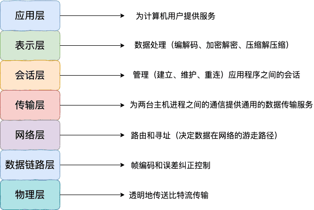
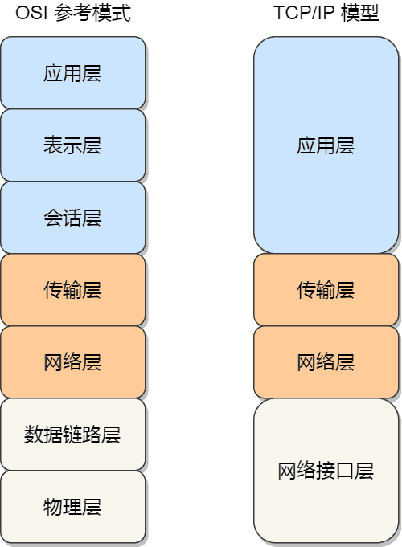

# 网络模型

## OSI 7 层模型

为了使得多种设备能通过网络相互通信，和为了解决各种不同设备在网络互联中的兼容性问题，国际标准化组织制定了开放式系统互联通信参考模型（Open System Interconnection Reference Model），也就是 OSI 网络模型。

OSI 网络模型主要有 7 层，每一层负责的职能都不同，从下到上依次为：

**（1）物理层**

功能：负责在物理网络中传输数据帧；在设备之间传输的比特流。

设备：集线器、中继器等。

**（2）数据链路层**

功能：将物理层接收到的信号转换为数据帧，实现相邻节点间的数据传输，进行差错检测和纠正，以及 MAC 寻址、流量控制。将数据包组合为字节，字节组为帧，使用MAC地址提供介质的访问，执行差错检测，但不纠正。

设备：常见的有交换机、网桥。

**（3）网络层**

功能：负责在不同网络之间进行路由选择和数据包转发；提供逻辑寻址，以使路由选择。根据网络地址（如IP地址）将数据包从源节点发送到目标节点。

设备：路由器是主要设备。

**（4）传输层**

功能：为应用程序提供端到端的通信服务，如TCP协议提供可靠的面向连接服务，UDP协议提供不可靠的无连接服务，实现数据的分段、重组、流量控制、错误纠正等。

协议：有`TCP`、`UDP`等。

**（5）会话层**

功能：建立、维护和管理会话，如会话的建立、拆除以及会话期间的同步等。

协议：有`NetBEUI`等。

**（6）表示层**

功能：对数据进行处理，包括加密解密、压缩解压缩、格式转换等，确保不同系统间的数据能够正确表示和理解。

>  负责把数据转换成兼容另一个系统能识别的格式；处理数据、数据加密、压缩、转换。

标准：如JPEG图像压缩标准等。

**（7）应用层**

功能：负责给应用程序提供统一的接口，如HTTP用于网页访问、SMTP用于邮件发送、FTP用于文件传输等。

协议：有`HTTP`、`SMTP`、`FTP`等。

>   两个PC间的远程控制：
>
>   - 传输层：TCP、UDP，如果是TELNET那么传输层为TCP协议
>   - 源端口为大于1023的任意，小于49151，目的端口号：23
>   - 网络层：已知源目IP地址
>
>   数据链路层：
>
>   - 知道源MAC，未知目的MAC，发送数据包前要先查看ARP表，如果有的话直接根据ARP表项转发，如果没有就去发送ARP。
>   - 二层也有自己的优先级标识，802.1p，封装在802.1Q里。
>   - 物理层：电口网线-比特流，无线-无线电波，光纤-光；
>   - 物理层协议：CSMA/CD，CSMA/CA；
>

## TCP/IP 网络模型

由于 OSI 模型实在太复杂，提出的也只是概念理论上的分层，并没有提供具体的实现方案。

事实上，比较常见、实用的是四层模型，即 TCP/IP 网络模型，Linux 系统正是按照这套网络模型来实现网络协议栈的。

TCP/IP 网络模型相比 OSI 网络模型简化了不少，也更加易记，它们之间的关系如下图：

TCP/IP 网络模型共有 4 层，分别是应用层、传输层、网络层和网络接口层，每一层负责的职能如下：

- 应用层，负责向用户提供一组应用程序，比如 HTTP、DNS、FTP 等；
- 传输层，负责端到端的通信，比如 TCP、UDP 等；
- 网络层，负责网络包的封装、分片、路由、转发，比如 IP、ICMP 等；
- 网络接口层，负责网络包在物理网络中的传输，比如网络包的封帧、MAC 寻址、差错检测，以及通过网卡传输网络帧等；

不过，我们常说的七层和四层负载均衡，是用 OSI 网络模型来描述的，七层对应的是应用层，四层对应的是传输层。

>   为什么现实中不用OSI，而是TCP/IP？

现实中使用的通信模型是TCP/IP四层而不是OSI七层，后者便于理解和学习

1. OSI模型功能和服务定义复杂，很难产品化；
2. 很多功能在多个层次重复，功能冗余
3. 各层任务分配不均匀；
