# HTTP 常见面试题

## HTTP 基本概念

### HTTP 是什么？

HTTP 是超文本传输协议，也就是**H**yper**T**ext **T**ransfer **P**rotocol。

> 能否详细解释「超文本传输协议」？

HTTP 的名字「超文本协议传输」，它可以拆成三个部分：

- 超文本
- 传输
- 协议

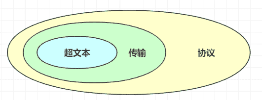

1、「协议」

协议的特点：

- 「**协**」字，代表的意思是必须有**两个以上的参与者**。例如三方协议里的参与者有三个：你、公司、学校三个；租房协议里的参与者有两个：你和房东。
- 「**议**」字，代表的意思是对参与者的一种**行为约定和规范**。例如三方协议里规定试用期期限、毁约金等；租房协议里规定租期期限、每月租金金额、违约如何处理等。

针对 HTTP **协议**，我们可以这么理解。

HTTP 是一个用在计算机世界里的**协议**。它使用计算机能够理解的语言确立了一种计算机之间交流通信的规范（**两个以上的参与者**），以及相关的各种控制和错误处理方式（**行为约定和规范**）。

2、「传输」

所谓的「传输」，很好理解，就是把一堆东西从 A 点搬到 B 点，或者从 B 点 搬到 A 点。

别轻视了这个简单的动作，它至少包含两项重要的信息。

HTTP 协议是一个**双向协议**。

我们在上网冲浪时，浏览器是请求方 A，百度网站就是应答方 B。双方约定用 HTTP 协议来通信，于是浏览器把请求数据发送给网站，网站再把一些数据返回给浏览器，最后由浏览器渲染在屏幕，就可以看到图片、视频了。

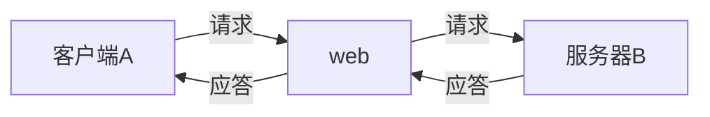
```mermaid
flowchart LR
    客户端A--请求-->web
    web--应答-->客户端A
    web--请求-->服务器B
    服务器B--应答-->web
```

数据虽然是在 A 和 B 之间传输，但允许中间有**中转或接力**。

就好像第一排的同学想传递纸条给最后一排的同学，那么传递的过程中就需要经过好多个同学（中间人），这样的传输方式就从「A < > B」，变成了「A <-> N <-> M <-> B」。

而在 HTTP 里，需要中间人遵从 HTTP 协议，只要不打扰基本的数据传输，就可以添加任意额外的东西。

针对**传输**，我们可以进一步理解了 HTTP。

HTTP 是一个在计算机世界里专门用来在**两点之间传输数据**的约定和规范。

3、「超文本」

HTTP 传输的内容是「超文本」。

我们先来理解「文本」，在互联网早期的时候只是简单的字符文字，但现在「文本」的涵义已经可以扩展为图片、视频、压缩包等，在 HTTP 眼里这些都算作「文本」。

再来理解「超文本」，它就是**超越了普通文本的文本**，它是文字、图片、视频等的混合体，最关键有超链接，能从一个超文本跳转到另外一个超文本。

HTML 就是最常见的超文本了，它本身只是纯文字文件，但内部用很多标签定义了图片、视频等的链接，再经过浏览器的解释，呈现给我们的就是一个文字、有画面的网页了。

OK，经过了对 HTTP 里这三个名词的详细解释，就可以给出比「超文本传输协议」这七个字更准确更有技术含量的答案：

**HTTP 是一个在计算机世界里专门在「两点」之间「传输」文字、图片、音频、视频等「超文本」数据的「约定和规范」。**

> 那「HTTP 是用于从互联网服务器传输超文本到本地浏览器的协议」，这种说法正确吗？

这种说法是**不正确**的。因为也可以是「服务器< -- >服务器」，所以采用**两点之间**的描述会更准确。

### HTTP报文组成

HTTP报文是简单的格式化数据块，每条报文都包含一条来自客户端的请求，或者一条来自服务器的响应。它们由三个部分组成：对报文进行描述的起始行、包含属性的首部块、以及可选的、包含数据的主题部分。

起始行和首部就是由行分隔的ASCII文本。每行都以一个由2个字符组成的行终止序列作为结束，包括一个回车符（ASCII码13）和一个换行符（ASCII码10）即"\r\n"，这个行终止序列可以写为CRLF。（稳健的应用程序也应该接受单个换行符作为行的终止）

实体的主体和报文的主体是一个可选的数据块。与起始行和首部不同的是，主体中可包含文本或二进制数据，也可以为空。

#### 请求报文

客户端发送一个HTTP请求到服务器的请求消息包括以下格式：请求行（request line）、请求头部（header）、空行和请求数据四个部分组成

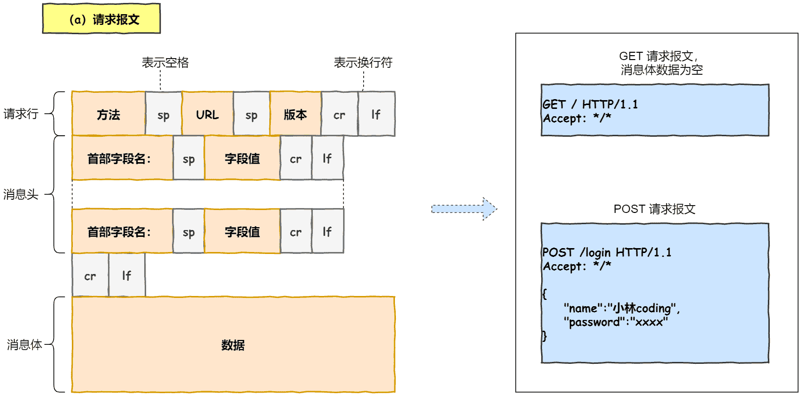

- **请求行**（Request Line）：

    - **方法**：如 GET、POST、PUT、DELETE等，指定要执行的操作。
    - **请求 URI**（统一资源标识符）：请求的资源路径，通常包括主机名、端口号（如果非默认）、路径和查询字符串。
    - **HTTP 版本**：如 HTTP/1.1 或 HTTP/2。

    请求行的格式示例：`GET /index.html HTTP/1.1`

- **请求头**（Request Headers）：

    - 包含了客户端环境信息、请求体的大小（如果有）、客户端支持的压缩类型等。
    - 常见的请求头包括`Host`、`User-Agent`、`Accept`、`Accept-Encoding`、`Content-Length`等。

- **空行**：

    - 请求头和请求体之间的分隔符，表示请求头的结束。

- **请求体**（可选）：

    - 在某些类型的HTTP请求（如 POST 和 PUT）中，请求体包含要发送给服务器的数据。

#### 响应报文

HTTP 响应也由四个部分组成，分别是：状态行、消息报头、空行和响应正文。

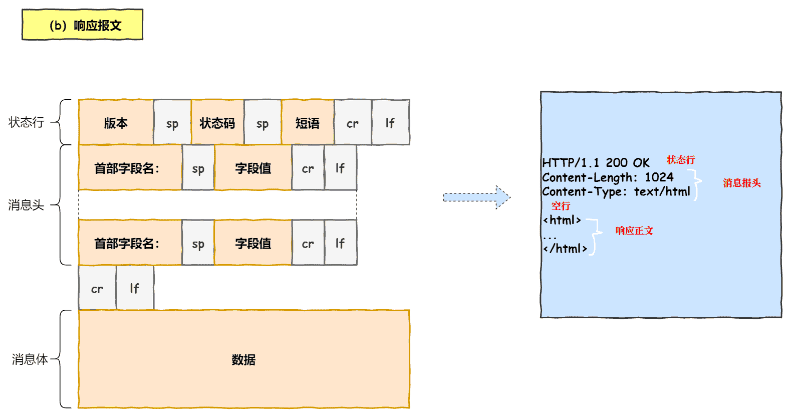

- **状态行**（Status Line）：

    - **HTTP 版本**：与请求消息中的版本相匹配。
    - **状态码**：表示请求的处理结果，如 200 表示成功，404 表示未找到资源。
    - **状态信息**：状态码的简短描述。
    - 状态行的格式示例：`HTTP/1.1 200 OK`

- **响应头**（Response Headers）：

    - 包含了服务器环境信息、响应体的大小、服务器支持的压缩类型等。
    - 常见的响应头包括`Content-Type`、`Content-Length`、`Server`、`Set-Cookie`等。

- **空行**：响应头和响应体之间的分隔符，表示响应头的结束。

- **响应体**（可选）：包含服务器返回的数据，如请求的网页内容、图片、JSON数据等。

### HTTP 常见的状态码有哪些？

五大类 HTTP 状态码：

| 状态码 | 具体含义                                                   | 常见的状态码       |
| ------ | ---------------------------------------------------------- | ------------------ |
| 1xx    | 提示信息，表示目前是协议处理的中间状态，还需要后续的操作； | 101                |
| 2xx    | 成功，报文已经收到并被正确处理；                           | 200、204、206      |
| 3xx    | 重定向，资源位置发生变动，需要客户端重新发送请求；         | 301、302、304      |
| 4xx    | 客户端错误，请求报文有误，服务器无法处理；                 | 400、403、404      |
| 5xx    | 服务器错误，服务器在处理请求时内部发生了错误。             | 500、501、502、503 |

`1xx` 类状态码属于**提示信息**，是协议处理中的一种中间状态，实际用到的比较少。

-   「**101 Switching Protocols**」协议切换，服务器已经理解了客户端的请求，并将通过 Upgrade 消息头通知客户端采用不同的协议来完成这个请求。比如切换到一个实时且同步的协议（如 WebSocket）以传送利用此类特性的资源。

`2xx` 类状态码表示服务器**成功**处理了客户端的请求，也是我们最愿意看到的状态。

-   「**200 OK**」是最常见的成功状态码，表示一切正常。如果是非 `HEAD` 请求，服务器返回的响应头都会有 body 数据。
-   「**204 No Content**」也是常见的成功状态码，与 200 OK 基本相同，但响应头没有 body 数据。
-   「**206 Partial Content**」是应用于 HTTP 分块下载或断点续传，表示响应返回的 body 数据并不是资源的全部，而是其中的一部分，也是服务器处理成功的状态。

`3xx` 类状态码表示客户端请求的资源发生了变动，需要客户端用新的 URL 重新发送请求获取资源，也就是**重定向**。

-   「**301 Moved Permanently**」表示永久重定向，说明请求的资源已经不存在了，需改用新的 URL 再次访问。
-   「**302 Found**」表示临时重定向，说明请求的资源还在，但暂时需要用另一个 URL 来访问。301 和 302 都会在响应头里使用字段 `Location`，指明后续要跳转的 URL，浏览器会自动重定向新的 URL。
-   「**304 Not Modified**」不具有跳转的含义，表示资源未修改，重定向已存在的缓冲文件，也称缓存重定向，也就是告诉客户端可以继续使用缓存资源，用于缓存控制。

`4xx` 类状态码表示客户端发送的**报文有误**，服务器无法处理，也就是错误码的含义。

-   「**400 Bad Request**」表示客户端请求的报文有错误，但只是个笼统的错误。

-   「**403 Forbidden**」表示服务器禁止访问资源，并不是客户端的请求出错。

-   「**404 Not Found**」表示请求的资源在服务器上不存在或未找到，所以无法提供给客户端。

`5xx` 类状态码表示客户端请求报文正确，但是**服务器处理时内部发生了错误**，属于服务器端的错误码。

-   「**500 Internal Server Error**」与 400 类似，是个笼统通用的错误码，服务器发生了什么错误，我们并不知道。

-   「**501 Not Implemented**」表示客户端请求的功能还不支持，类似“即将开业，敬请期待”的意思。

-   「**502 Bad Gateway**」通常是服务器作为网关或代理时返回的错误码，表示服务器自身工作正常，访问后端服务器发生了错误。

-   「**503 Service Unavailable**」表示服务器当前很忙，暂时无法响应客户端，类似“网络服务正忙，请稍后重试”的意思。

### HTTP 常见字段有哪些？

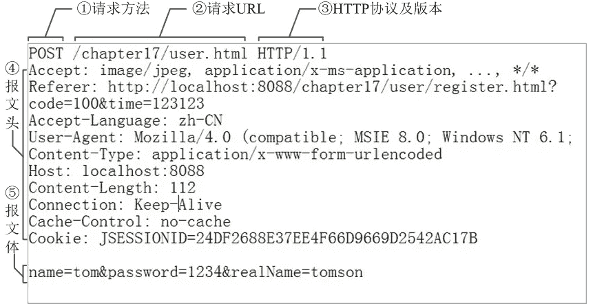

#### Host 字段

客户端发送请求时，用来指定服务器的域名。

有了 `Host` 字段，就可以将请求发往「同一台」服务器上的不同网站。

#### Content-Length 字段

服务器在返回数据时，会有 Content-Length 字段，表明本次回应的数据长度。

比如Content-Length: 1000 就是告诉浏览器，本次服务器回应的数据长度是 1000 个字节，后面的字节就属于下一个回应了。

HTTP 是基于 TCP 传输协议进行通信的，而使用了 TCP 传输协议，就会存在一个“粘包”的问题，HTTP 协议通过设置回车符、换行符作为 HTTP header 的边界，通过 Content-Length 字段作为 HTTP body 的边界，这两个方式都是为了解决“粘包”的问题。

#### Connection 字段

`Connection` 字段最常用于客户端要求服务器使用「HTTP 长连接」机制，以便其他请求复用。

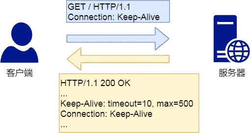

HTTP 长连接的特点是，只要任意一端没有明确提出断开连接，则保持 TCP 连接状态。

HTTP/1.1 版本的默认连接都是长连接，但为了兼容老版本的 HTTP，需要指定 `Connection` 首部字段的值为 `Keep-Alive`。

```v
Connection: Keep-Alive
```

开启了 HTTP Keep-Alive 机制后，连接就不会中断，而是保持连接。当客户端发送另一个请求时，它会使用同一个连接，一直持续到客户端或服务器端提出断开连接。

PS：大家不要把 HTTP Keep-Alive 和 TCP Keepalive 搞混了，这两个虽然长的像，但是不是一个东西。

#### Content-Type 字段

`Content-Type` 字段用于服务器回应时，告诉客户端，本次数据是什么格式。

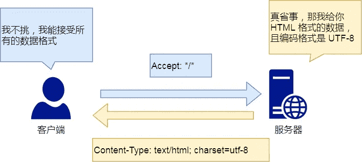

```v
Content-Type: text/html; Charset=utf-8
```

上面的类型表明，发送的是网页，而且编码是 UTF-8。

客户端请求的时候，可以使用 `Accept` 字段声明自己可以接受哪些数据格式。

```v
Accept: */*
```

上面代码中，客户端声明自己可以接受任何格式的数据。

#### Accept: */*

客户端请求的时候，可以使用 Accept 字段声明自己可以接受哪些数据格式。

*/*  就表示客户端声明自己可以接受任何格式的数据。

#### Content-Encoding 字段

`Content-Encoding` 字段说明数据的压缩方法。表示服务器返回的数据使用了什么压缩格式

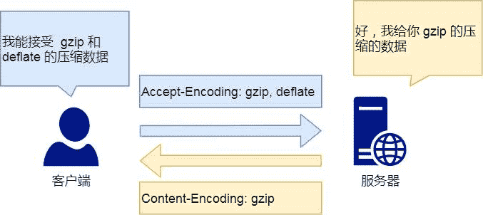

上面`Content-Encoding: gzip`表示服务器返回的数据采用了 gzip 方式压缩，告知客户端需要用此方式解压。

客户端在请求时，用 `Accept-Encoding` 字段说明自己可以接受哪些压缩方法。

```v
Accept-Encoding: gzip, deflate
```

#### 其他字段介绍

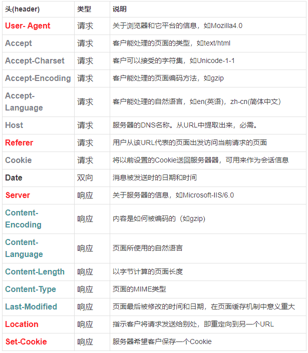

### HTTP常见方法

根据 HTTP 标准，HTTP 请求可以使用多种请求方法。

HTTP1.0 定义了三种请求方法：GET、POST 和 HEAD 方法。

HTTP1.1 新增了六种请求方法：OPTIONS、PUT、PATCH、DELETE、TRACE 和 CONNECT 方法。

| 方法    | 描述                                                         |
| :------ | :----------------------------------------------------------- |
| GET     | 用于请求服务器发送某个资源。GET 请求不应该对服务器上的资源做出任何更改，并且应该是幂等的（即多次重复的请求应该产生相同的结果）。例如，当你在浏览器中输入 URL 地址时，浏览器会发送一个 GET 请求来获取该 URL 对应的网页。 |
| HEAD    | 类似于 GET 请求，但服务器不返回请求的资源主体，只返回响应头。HEAD 请求通常用于获取资源的元信息，如资源的大小、类型等，而不需要获取资源的实际内容。 |
| POST    | 用于向服务器提交数据，通常用于提交表单或上传文件。POST 请求可能会导致服务器上的状态更改，并且不一定是幂等的。例如，在提交注册表单时，浏览器通常会发送一个 POST 请求，将用户提供的信息发送到服务器进行处理。 |
| PUT     | 用于向服务器上传资源，通常用于更新已存在的资源或创建新的资源。PUT 请求应该是幂等的，即多次执行相同的 PUT 请求应该产生相同的结果。 |
| DELETE  | 用于请求服务器删除指定的资源。DELETE 请求应该是幂等的，即多次执行相同的 DELETE 请求应该产生相同的结果。 |
| CONNECT | 用于建立到服务器上指定端口的隧道，通常用于代理服务器。       |
| OPTIONS | 用于请求服务器返回支持的 HTTP 方法和其他选项。例如，客户端可以发送 OPTIONS 请求来确定服务器支持哪些 CORS（跨域资源共享）策略。 |
| TRACE   | 回显服务器收到的请求，主要用于测试或诊断。                   |
| PATCH   | 用于在请求-响应链上的每个节点获取传输路径。TRACE 请求通常用于调试和测试，以查看请求在经过各种代理服务器和中间件时如何被修改。 |

## GET 与 POST

### GET 和 POST 有什么区别？

根据 RFC 规范，**GET 的语义是从服务器获取指定的资源**，这个资源可以是静态的文本、页面、图片视频等。GET 请求的参数位置一般是写在 URL 中，URL 规定只能支持 ASCII，所以 GET 请求的参数只允许 ASCII 字符，而且浏览器会对 URL 的长度有限制（HTTP 协议本身对 URL 长度并没有做任何规定）。

比如，你打开我的文章，浏览器就会发送 GET 请求给服务器，服务器就会返回文章的所有文字及资源。

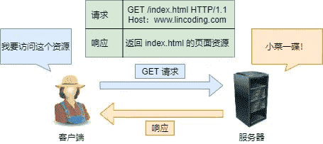

根据 RFC 规范，**POST 的语义是根据请求负荷（报文 body）对指定的资源做出处理**，具体的处理方式视资源类型而不同。POST 请求携带数据的位置一般是写在报文 body 中，body 中的数据可以是任意格式的数据，只要客户端与服务端协商好即可，而且浏览器不会对 body 大小做限制。

功能不同：

- get是从服务器上获取数据。
- post是向服务器传送数据。

过程不同：

- get是把参数数据队列加到提交表单的ACTION属性所指的URL中，值和表单内各个字段一一对应，在**URL中**可以看到。
- post请求携带数据的位置一般是写在报文 body 中，body 中的数据可以是任意格式的数据，只要客户端与服务端协商好即可

传送数据量不同：

- get传送的数据量较小，不能大于2KB。
- post传送的数据量较大，一般被默认为不受限制。但理论上，IIS4中最大量为80KB，IIS5中为100KB。

安全性：

- get安全性非常低。
- post安全性相对较高。

### GET 和 POST 方法都是安全和幂等的吗？

先说明下安全和幂等的概念：

- 在 HTTP 协议里，所谓的「安全」是指请求方法不会「破坏」服务器上的资源。
- 所谓的「幂等」，意思是多次执行相同的操作，结果都是「相同」的。

如果从 RFC 规范定义的语义来看：

- **GET 方法就是安全且幂等的**，因为它是「只读」操作，无论操作多少次，服务器上的数据都是安全的，且每次的结果都是相同的。所以，可以对 GET 请求的数据做缓存，这个缓存可以做到浏览器本身上（彻底避免浏览器发请求），也可以做到代理上（如 nginx），而且在浏览器中 GET 请求可以保存为书签。
- **POST** 因为是「新增或提交数据」的操作，会修改服务器上的资源，所以是**不安全**的，且多次提交数据就会创建多个资源，所以**不是幂等**的。所以，**浏览器一般不会缓存 POST 请求，也不能把 POST 请求保存为书签**。

做个简要的小结。

-   GET 的语义是请求获取指定的资源。GET 方法是安全、幂等、可被缓存的。

-   POST 的语义是根据请求负荷（报文主体）对指定的资源做出处理，具体的处理方式视资源类型而不同。POST 不安全，不幂等，（大部分实现）不可缓存。

注意，上面是从 RFC 规范定义的语义来分析的。

但是实际过程中，开发者不一定会按照 RFC 规范定义的语义来实现 GET 和 POST 方法。比如：

- 可以用 GET 方法实现新增或删除数据的请求，这样实现的 GET 方法自然就不是安全和幂等。
- 可以用 POST 方法实现查询数据的请求，这样实现的  POST 方法自然就是安全和幂等。

如果「安全」放入概念是指信息是否会被泄漏的话，虽然 POST 用 body 传输数据，而 GET 用 URL 传输，这样数据会在浏览器地址栏容易看到，但是并不能说 GET 不如 POST 安全的。

因为 HTTP 传输的内容都是明文的，虽然在浏览器地址栏看不到 POST 提交的 body 数据，但是只要抓个包就都能看到了。

所以，要避免传输过程中数据被窃取，就要使用 HTTPS 协议，这样所有 HTTP 的数据都会被加密传输。

> GET 请求可以带 body 吗？

RFC 规范并没有规定 GET 请求不能带 body 的。理论上，任何请求都可以带 body 的。只是因为 RFC 规范定义的 GET 请求是获取资源，所以根据这个语义不需要用到 body。

另外，URL 中的查询参数也不是 GET 所独有的，POST 请求的 URL 中也可以有参数的。

## HTTP的连接方式和无状态性

### 短连接

即浏览器每请求一个Web文档，就创建一个新的连接，当文档传输完毕后，连接就立刻被释放。

> HTTP1.0、HTTP0.9采用此连接方式。

对于请求的Web页中包含多个其他文档对象（如图像、声音、视频等）的链接的情况，由于请求每个链接对应的文档都要创建新连接，效率低下。

### 长连接

即在一个连接中，可以进行多次文档的请求和响应。服务器在发送完响应后，并不立即释放连接，浏览器可以使用该连接继续请求其他文档。连接保持的时间可以由双方进行协商。

HTTP/1.1 版本的默认连接都是长连接，但为了兼容老版本的 HTTP，需要指定Connection: Keep-Alive

### 无状态性

是指同一个客户端(浏览器)第二次访问同一个Web服务器上的页面时，服务器无法知道这个客户曾经访问过。HTTP的无状态性简化了服务器的设计，使其更容易支持大量并发的HTTP请求。

对于无状态的问题，比较简单的方式用 Cookie 技术。

#### Cookie的安全问题

跨站脚本攻击（XSS）：攻击者会利用XSS来窃取Cookie

会话管理不当：会话退出后没有注销、会话有效时间过长、重置或修改密码后未清除旧会话和会话能够被异地重放

#### Cookie的跨域问题

当一个请求url的协议、域名、端口三者之间任意一个与当前页面url不同即为跨域

-   Nginx反向代理：在一个服务器上配置多个前缀来转发http/https请求到多个真实的服务器即可
-   Java代码添加注解：`@CrossOrigin(origins = "http://www.example.com")`

## HTTP 缓存技术

### HTTP 缓存有哪些实现方式？

对于一些具有重复性的 HTTP 请求，比如每次请求得到的数据都一样的，我们可以把这对「请求 - 响应」的数据都**缓存在本地**，那么下次就直接读取本地的数据，不必在通过网络获取服务器的响应了，这样的话 HTTP/1.1 的性能肯定肉眼可见的提升。

所以，避免发送 HTTP 请求的方法就是通过**缓存技术**，HTTP 设计者早在之前就考虑到了这点，因此 HTTP 协议的头部有不少是针对缓存的字段。

HTTP 缓存有两种实现方式，分别是**强制缓存和协商缓存**。

### 什么是强制缓存？

强缓存指的是只要浏览器判断缓存没有过期，则直接使用浏览器的本地缓存，决定是否使用缓存的主动性在于浏览器这边。

如下图中，返回的是 200 状态码，但在 size 项中标识的是 from disk cache，就是使用了强制缓存。

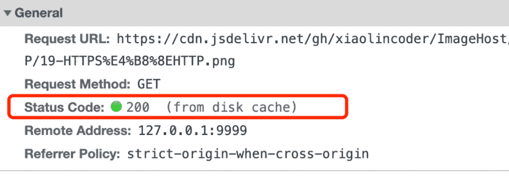

强缓存是利用下面这两个 HTTP 响应头部（Response Header）字段实现的，它们都用来表示资源在客户端缓存的有效期：

- `Cache-Control`是一个相对时间；
- `Expires`是一个绝对时间；

如果 HTTP 响应头部同时有 Cache-Control 和 Expires 字段的话，**Cache-Control 的优先级高于 Expires** 。

Cache-control 选项更多一些，设置更加精细，所以建议使用 Cache-Control 来实现强缓存。具体的实现流程如下：

- 当浏览器第一次请求访问服务器资源时，服务器会在返回这个资源的同时，在 Response 头部加上 Cache-Control；
- 浏览器再次请求访问服务器中的该资源时，会先**通过请求资源的时间与 Cache-Control 中设置的过期时间大小**，来计算出该资源是否过期，如果没有，则使用该缓存，否则重新请求服务器；
- 服务器再次收到请求后，会再次更新 Response 头部的 Cache-Control。

### 什么是协商缓存？

当我们在浏览器使用开发者工具的时候，你可能会看到过某些请求的响应码是 `304`，这个是告诉浏览器可以使用本地缓存的资源，通常这种通过服务端告知客户端是否可以使用缓存的方式被称为协商缓存。

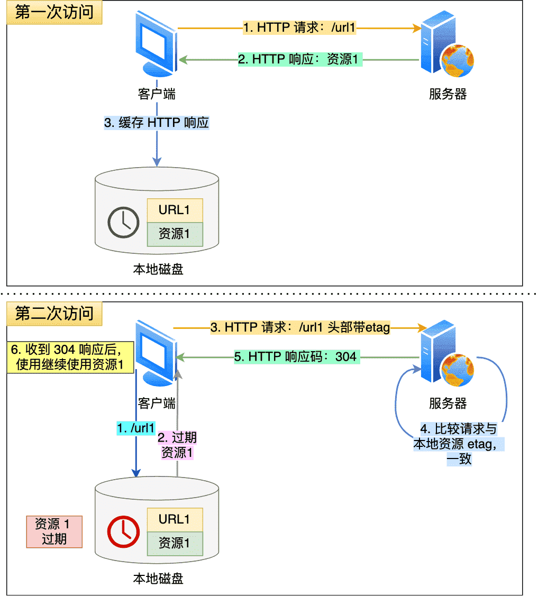

上图就是一个协商缓存的过程，所以**协商缓存就是与服务端协商之后，通过协商结果来判断是否使用本地缓存**。

协商缓存可以基于两种头部来实现。

第一种：请求头部中的 `If-Modified-Since` 字段与响应头部中的 `Last-Modified` 字段实现，这两个字段的意思是：

- 响应头部中的 `Last-Modified`：表示这个响应资源的最后修改时间；
- 请求头部中的 `If-Modified-Since`：当资源过期了，发现响应头中具有 Last-Modified 声明，则再次发起请求的时候带上 Last-Modified 的时间，服务器收到请求后发现有 If-Modified-Since 则与被请求资源的最后修改时间进行对比（Last-Modified），如果最后修改时间较新（大），说明资源又被改过，则返回最新资源，HTTP 200 OK；如果最后修改时间较旧（小），说明资源无新修改，响应 HTTP 304 走缓存。

第二种：请求头部中的 `If-None-Match` 字段与响应头部中的 `ETag` 字段，这两个字段的意思是：
  - 响应头部中 `Etag`：唯一标识响应资源；
  - 请求头部中的 `If-None-Match`：当资源过期时，浏览器发现响应头里有 Etag，则再次向服务器发起请求时，会将请求头 If-None-Match 值设置为 Etag 的值。服务器收到请求后进行比对，如果资源没有变化返回 304，如果资源变化了返回 200。

第一种实现方式是基于时间实现的，第二种实现方式是基于一个唯一标识实现的，相对来说后者可以更加准确地判断文件内容是否被修改，避免由于时间篡改导致的不可靠问题。

如果在第一次请求资源的时候，服务端返回的 HTTP 响应头部同时有 Etag 和 Last-Modified 字段，那么客户端再下一次请求的时候，如果带上了 ETag 和 Last-Modified 字段信息给服务端，**这时 Etag 的优先级更高**，也就是服务端先会判断 Etag 是否变化了，如果 Etag 有变化就不用在判断 Last-Modified 了，如果 Etag 没有变化，然后再看  Last-Modified。

**为什么 ETag 的优先级更高？** 这是因为 ETag 主要能解决 Last-Modified 几个比较难以解决的问题：

1. 在没有修改文件内容情况下文件的最后修改时间可能也会改变，这会导致客户端认为这文件被改动了，从而重新请求；
2. 可能有些文件是在秒级以内修改的，`If-Modified-Since` 能检查到的粒度是秒级的，使用 Etag 就能够保证这种需求下客户端在 1 秒内能刷新多次；
3. 有些服务器不能精确获取文件的最后修改时间。

注意，协商缓存这两个字段都**需要配合强制缓存中 Cache-Control 字段来使用**，只有在未能命中强制缓存的时候，才能发起带有协商缓存字段的请求。

下图是强制缓存和协商缓存的工作流程：

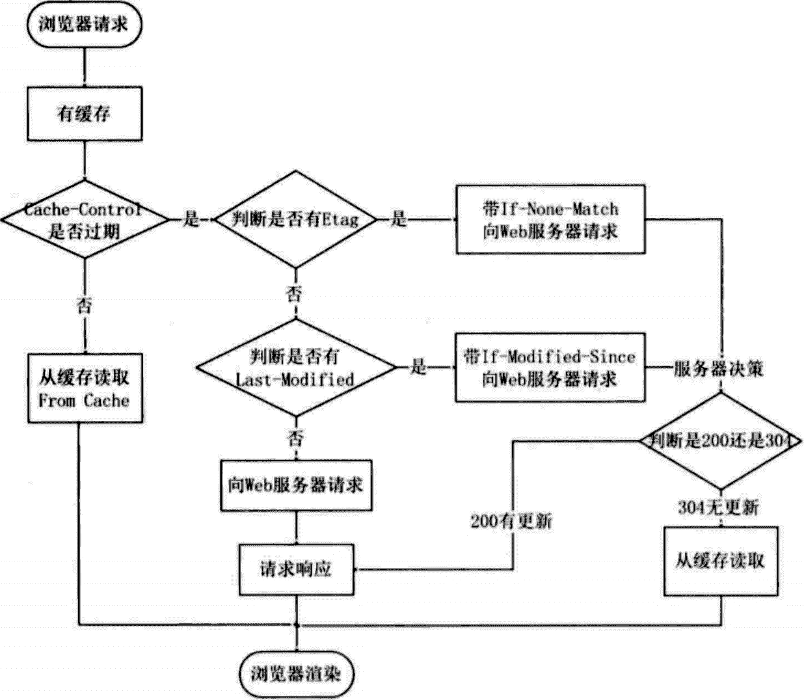

当使用 ETag 字段实现的协商缓存的过程：

- 当浏览器第一次请求访问服务器资源时，服务器会在返回这个资源的同时，在 Response 头部加上 ETag 唯一标识，这个唯一标识的值是根据当前请求的资源生成的；
- 当浏览器再次请求访问服务器中的该资源时，首先会先检查强制缓存是否过期：
  - 如果没有过期，则直接使用本地缓存；
  - 如果缓存过期了，会在 Request 头部加上 If-None-Match 字段，该字段的值就是 ETag 唯一标识；
- 服务器再次收到请求后，**会根据请求中的 If-None-Match 值与当前请求的资源生成的唯一标识进行比较**：
  - **如果值相等，则返回 304 Not Modified，不会返回资源**；
  - 如果不相等，则返回 200 状态码和返回资源，并在 Response 头部加上新的 ETag 唯一标识；
- 如果浏览器收到 304 的请求响应状态码，则会从本地缓存中加载资源，否则更新资源。

## HTTP 特性

到目前为止，HTTP 常见到版本有 HTTP/1.1，HTTP/2.0，HTTP/3.0，不同版本的 HTTP 特性是不一样的。

### HTTP/1.1 的优点有哪些？

HTTP 最突出的优点是「简单、灵活和易于扩展、应用广泛和跨平台」。

1. 简单

HTTP 基本的报文格式就是 `header + body`，头部信息也是 `key-value` 简单文本的形式，**易于理解**，降低了学习和使用的门槛。

2. 灵活和易于扩展

HTTP 协议里的各类请求方法、URI/URL、状态码、头字段等每个组成要求都没有被固定死，都允许开发人员**自定义和扩充**。

同时 HTTP 由于是工作在应用层（ `OSI` 第七层），则它**下层可以随意变化**，比如：

- HTTPS 就是在 HTTP 与 TCP 层之间增加了 SSL/TLS 安全传输层；
- HTTP/1.1 和 HTTP/2.0 传输协议使用的是 TCP 协议，而到了 HTTP/3.0 传输协议改用了 UDP 协议。

3. 应用广泛和跨平台

### HTTP/1.1 的缺点有哪些？

HTTP 协议里有优缺点一体的**双刃剑**，分别是「无状态、明文传输」，同时还有一大缺点「不安全」。

1. 无状态双刃剑

无状态的**好处**，因为服务器不会去记忆 HTTP 的状态，所以不需要额外的资源来记录状态信息，这能减轻服务器的负担，能够把更多的 CPU 和内存用来对外提供服务。

无状态的**坏处**，既然服务器没有记忆能力，它在完成有关联性的操作时会非常麻烦。

- 例如登录->添加购物车->下单->结算->支付，这系列操作都要知道用户的身份才行。但服务器不知道这些请求是有关联的，每次都要问一遍身份信息。
- 这样每操作一次，都要验证信息。

对于无状态的问题，解法方案有很多种，其中比较简单的方式用 **Cookie** 技术。

`Cookie`通过在请求和响应报文中写入 Cookie 信息来控制客户端的状态。

相当于，在客户端第一次请求后，服务器会下发一个装有客户信息的「小贴纸」，后续客户端请求服务器的时候，带上「小贴纸」，服务器就能识别了。

2. 明文传输双刃剑

明文意味着在传输过程中的信息，是可方便阅读的，比如 Wireshark 抓包都可以直接肉眼查看，为调试工作带了极大的便利性。

但是这正是这样，HTTP 的所有信息都暴露在了光天化日下，相当于**信息裸奔**。在传输的漫长的过程中，信息的内容都毫无隐私可言，很容易就能被窃取。

3. 不安全

HTTP 比较严重的缺点就是不安全：

- 通信使用明文（不加密），内容可能会被窃听。比如，**账号信息容易泄漏，那你号没了。**
- 不验证通信方的身份，因此有可能遭遇伪装。比如，**访问假的淘宝、拼多多，那你钱没了。**
- 无法证明报文的完整性，所以有可能已遭篡改。比如，**网页上植入垃圾广告，视觉污染，眼没了。**

HTTP 的安全问题，可以用 HTTPS 的方式解决，也就是通过引入 SSL/TLS 层，使得在安全上达到了极致。

### HTTP/1.1 的性能如何？

HTTP 协议是基于 **TCP/IP**，并且使用了「**请求 - 应答**」的通信模式，所以性能的关键就在这**两点**里。

*1. 长连接*

早期 HTTP/1.0 性能上的一个很大的问题，那就是每发起一个请求，都要新建一次 TCP 连接（三次握手），而且是串行请求，做了无谓的 TCP 连接建立和断开，增加了通信开销。

为了解决上述 TCP 连接问题，HTTP/1.1 提出了**长连接**的通信方式，也叫持久连接。这种方式的好处在于减少了 TCP 连接的重复建立和断开所造成的额外开销，减轻了服务器端的负载。

持久连接的特点是，只要任意一端没有明确提出断开连接，则保持 TCP 连接状态。

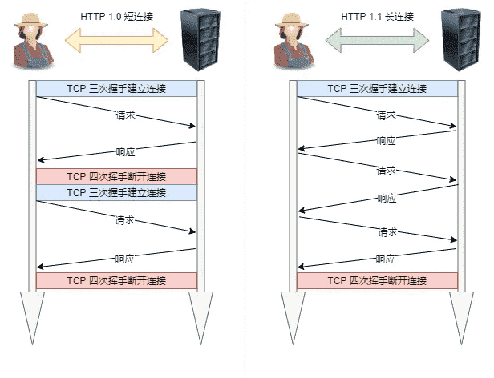

当然，如果某个 HTTP 长连接超过一定时间没有任何数据交互，服务端就会主动断开这个连接。

*2. 管道网络传输*

HTTP/1.1 采用了长连接的方式，这使得管道（pipeline）网络传输成为了可能。

即可在同一个 TCP 连接里面，客户端可以发起多个请求，只要第一个请求发出去了，不必等其回来，就可以发第二个请求出去，可以**减少整体的响应时间。**

举例来说，客户端需要请求两个资源。以前的做法是，在同一个 TCP 连接里面，先发送 A 请求，然后等待服务器做出回应，收到后再发出 B 请求。那么，管道机制则是允许浏览器同时发出 A 请求和 B 请求，如下图：

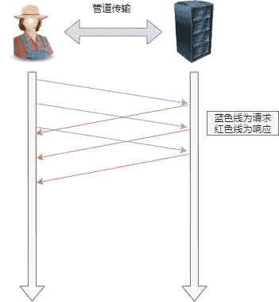

但是**服务器必须按照接收请求的顺序发送对这些管道化请求的响应**。

如果服务端在处理 A 请求时耗时比较长，那么后续的请求的处理都会被阻塞住，这称为「队头堵塞」。

所以，**HTTP/1.1 管道解决了请求的队头阻塞，但是没有解决响应的队头阻塞**。

>  实际上 HTTP/1.1 管道化技术不是默认开启，而且浏览器基本都没有支持，所以后面所有文章讨论 HTTP/1.1 都是**建立在没有使用管道化的前提**。大家知道有这个功能，但是没有被使用就行了。

*3. 队头阻塞*

「请求 - 应答」的模式加剧了 HTTP 的性能问题。

因为当顺序发送的请求序列中的一个请求因为某种原因被阻塞时，在后面排队的所有请求也一同被阻塞了，会招致客户端一直请求不到数据，这也就是「**队头阻塞**」，好比上班的路上塞车。

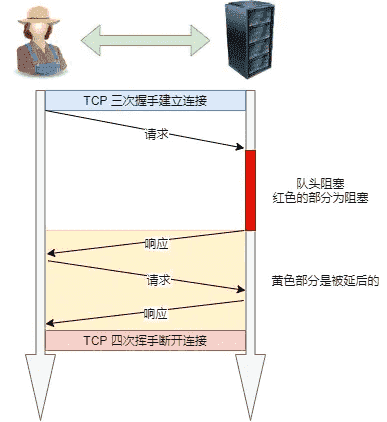

总之 HTTP/1.1 的性能一般般，后续的 HTTP/2 和 HTTP/3 就是在优化 HTTP 的性能。

## HTTP 与 HTTPS

### HTTP 与 HTTPS 有哪些区别？

- HTTP 是超文本传输协议，信息是明文传输，存在安全风险的问题。HTTPS 则解决 HTTP 不安全的缺陷，在 TCP 和 HTTP 网络层之间加入了 SSL/TLS 安全协议，使得报文能够加密传输。

- HTTP 连接建立相对简单，TCP 三次握手之后便可进行 HTTP 的报文传输。而 HTTPS 在 TCP 三次握手之后，还需进行 SSL/TLS 的握手过程，才可进入加密报文传输。

- 两者的默认端口不一样，HTTP 默认端口号是 80，HTTPS 默认端口号是 443。

- HTTPS 协议需要向 CA（证书权威机构）申请数字证书，来保证服务器的身份是可信的。

### HTTPS 解决了 HTTP 的哪些问题？

HTTP 由于是明文传输，所以安全上存在以下三个风险：

- **窃听风险**，比如通信链路上可以获取通信内容，用户号容易没。
- **篡改风险**，比如强制植入垃圾广告，视觉污染，用户眼容易瞎。
- **冒充风险**，比如冒充淘宝网站，用户钱容易没。

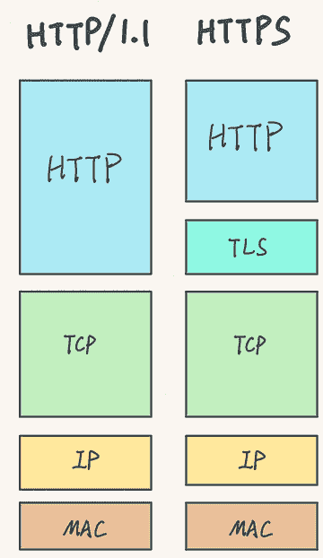

HTTP**S** 在 HTTP 与 TCP 层之间加入了 `SSL/TLS` 协议，可以很好的解决了上述的风险：

- **信息加密**：交互信息无法被窃取，但你的号会因为「自身忘记」账号而没。
- **校验机制**：无法篡改通信内容，篡改了就不能正常显示，但百度「竞价排名」依然可以搜索垃圾广告。
- **身份证书**：证明淘宝是真的淘宝网，但你的钱还是会因为「剁手」而没。

可见，只要自身不做「恶」，SSL/TLS 协议是能保证通信是安全的。

> HTTPS 是如何解决上面的三个风险的？

- **混合加密**的方式实现信息的**机密性**，解决了窃听的风险。
- **摘要算法**的方式来实现**完整性**，它能够为数据生成独一无二的「指纹」，指纹用于校验数据的完整性，解决了篡改的风险。
- 将服务器公钥放入到**数字证书**中，解决了冒充的风险。

*1. 混合加密*

通过**混合加密**的方式可以保证信息的**机密性**，解决了窃听的风险。

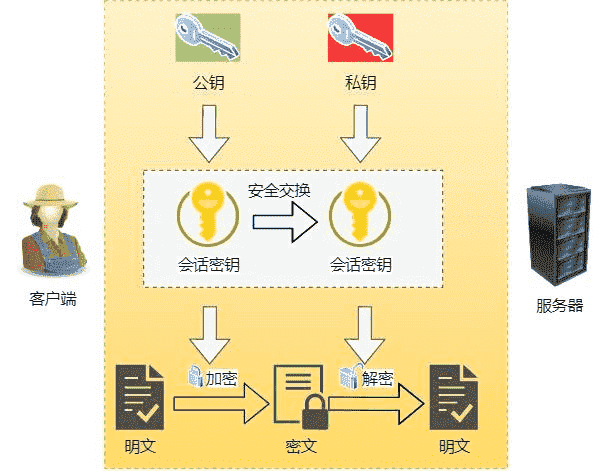

HTTPS 采用的是**对称加密**和**非对称加密**结合的「混合加密」方式：

- 在通信建立前采用**非对称加密**的方式交换「会话秘钥」，后续就不再使用非对称加密。
- 在通信过程中全部使用**对称加密**的「会话秘钥」的方式加密明文数据。

采用「混合加密」的方式的原因：

- **对称加密**只使用一个密钥，运算速度快，密钥必须保密，无法做到安全的密钥交换。
- **非对称加密**使用两个密钥：公钥和私钥，公钥可以任意分发而私钥保密，解决了密钥交换问题但速度慢。

*2. 摘要算法 + 数字签名*

为了保证传输的内容不被篡改，我们需要对内容计算出一个「指纹」，然后同内容一起传输给对方。

对方收到后，先是对内容也计算出一个「指纹」，然后跟发送方发送的「指纹」做一个比较，如果「指纹」相同，说明内容没有被篡改，否则就可以判断出内容被篡改了。

那么，在计算机里会**用摘要算法（哈希函数）来计算出内容的哈希值**，也就是内容的「指纹」，这个**哈希值是唯一的，且无法通过哈希值推导出内容**。

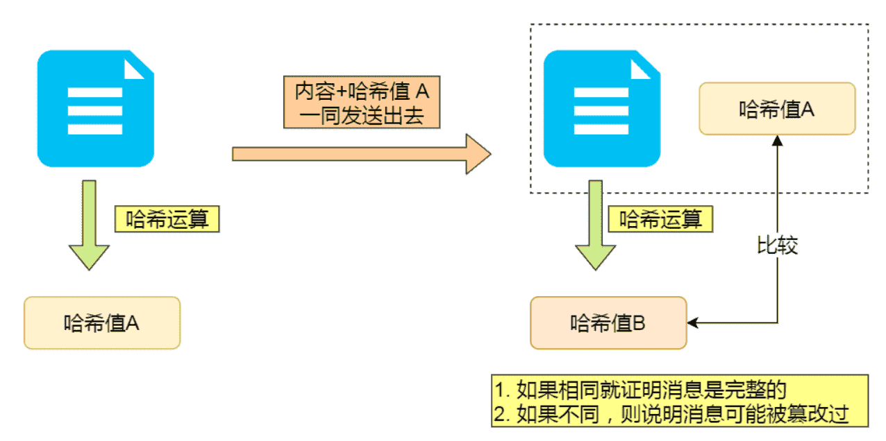

通过哈希算法可以确保内容不会被篡改，**但是并不能保证「内容 + 哈希值」不会被中间人替换，因为这里缺少对客户端收到的消息是否来源于服务端的证明**。为了避免这种情况，计算机里会用**非对称加密算法**来解决，共有两个密钥：

- 一个是公钥，这个是可以公开给所有人的；
- 一个是私钥，这个必须由本人管理，不可泄露。

这两个密钥可以**双向加解密**的，比如可以用公钥加密内容，然后用私钥解密，也可以用私钥加密内容，公钥解密内容。

流程的不同，意味着目的也不相同：

- **公钥加密，私钥解密**。这个目的是为了**保证内容传输的安全**，因为被公钥加密的内容，其他人是无法解密的，只有持有私钥的人，才能解密出实际的内容；
- **私钥加密，公钥解密**。这个目的是为了**保证消息不会被冒充**，因为私钥是不可泄露的，如果公钥能正常解密出私钥加密的内容，就能证明这个消息是来源于持有私钥身份的人发送的。

一般我们不会用非对称加密来加密实际的传输内容，因为非对称加密的计算比较耗费性能的。

所以非对称加密的用途主要在于**通过「私钥加密，公钥解密」的方式，来确认消息的身份**，我们常说的**数字签名算法**，就是用的是这种方式，不过私钥加密内容不是内容本身，而是**对内容的哈希值加密**。

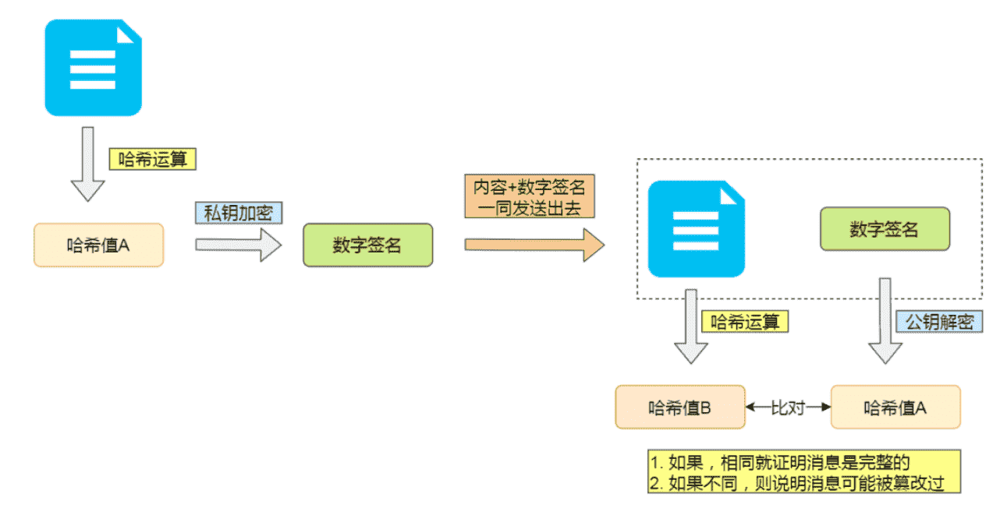

私钥是由服务端保管，然后服务端会向客户端颁发对应的公钥。如果客户端收到的信息，能被公钥解密，就说明该消息是由服务器发送的。

*3. 数字证书*

前面我们知道：

- 可以通过哈希算法来保证消息的完整性；
- 可以通过数字签名来保证消息的来源可靠性（能确认消息是由持有私钥的一方发送的）；

虽然服务器持有私钥，客户端能通过服务器的公钥解密来确认这个hash消息是不是来源于服务器。但如果有黑客同时伪造公私钥，并将公钥发送给客户端，之后的会话密钥协商也用这个公钥来协商，那之后的消息发送黑客都能解密。因此需要保证公钥是来自于服务器的。

在计算机里，这个权威的机构就是 CA（数字证书认证机构），将服务器公钥放在数字证书（由数字证书认证机构颁发）中，只要证书是可信的，公钥就是可信的。

数字证书的工作流程，我也画了一张图，方便大家理解：

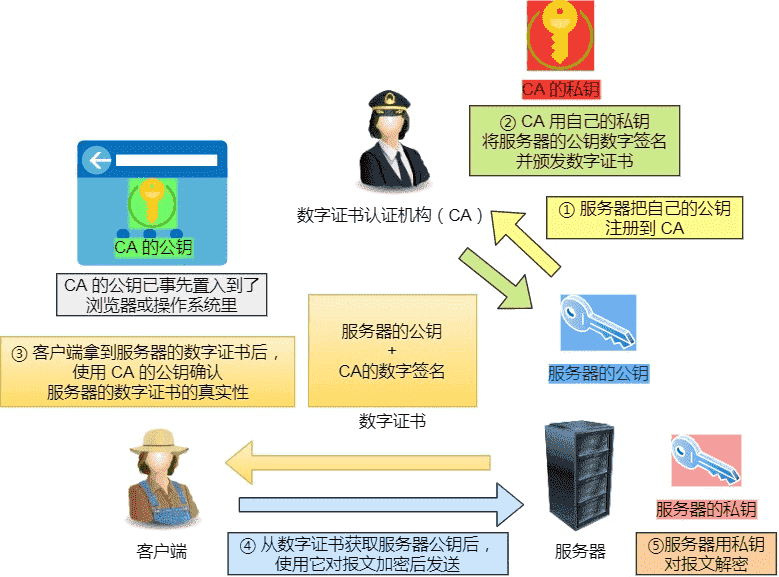

通过数字证书的方式保证服务器公钥的身份，解决冒充的风险。

### HTTPS 是如何建立连接的？其间交互了什么？

SSL/TLS 协议基本流程：

- 客户端向服务器索要并验证服务器的公钥。
- 双方协商生产「会话秘钥」。
- 双方采用「会话秘钥」进行加密通信。

前两步也就是 SSL/TLS 的建立过程，也就是 TLS 握手阶段。

TLS 的「握手阶段」涉及**四次**通信，使用不同的密钥交换算法，TLS 握手流程也会不一样的，现在常用的密钥交换算法有两种：RSA 算法 (opens new window)和 ECDHE 算法 (opens new window)。

#### RSA算法

基于 RSA 算法的 TLS 握手过程比较容易理解，所以这里先用这个给大家展示 TLS 握手过程，如下图：

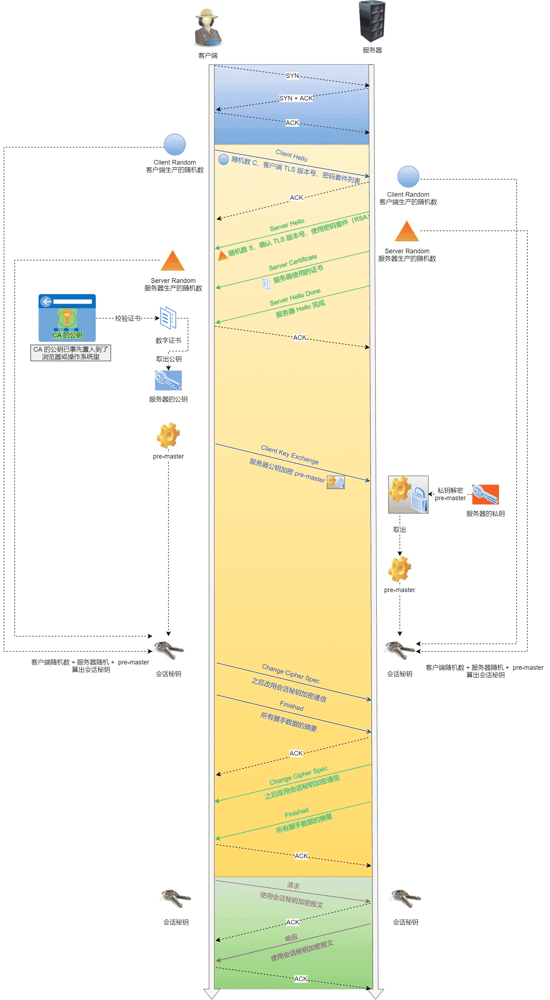

TLS 协议建立的详细流程：

*1. ClientHello*

首先，由客户端向服务器发起加密通信请求，也就是 `ClientHello` 请求。

在这一步，客户端主要向服务器发送以下信息：

（1）客户端支持的 TLS 协议版本，如 TLS 1.2 版本。

（2）客户端生产的随机数（`Client Random`），后面用于生成「会话秘钥」条件之一。

（3）客户端支持的密码套件列表，如 RSA 加密算法。

*2. SeverHello*

服务器收到客户端请求后，向客户端发出响应，也就是 `ServerHello`。服务器回应的内容有如下内容：

（1）确认 TLS 协议版本，如果浏览器不支持，则关闭加密通信。

（2）服务器生产的随机数（`Server Random`），也是后面用于生产「会话秘钥」条件之一。

（3）确认的密码套件列表，如 RSA 加密算法。

（4）服务器的数字证书。

*3.客户端回应*

客户端收到服务器的回应之后，首先通过浏览器或者操作系统中的 CA 公钥，确认服务器的数字证书的真实性。

如果证书没有问题，客户端会**从数字证书中取出服务器的公钥**，然后使用它加密报文，向服务器发送如下信息：

（1）一个随机数（`pre-master key`）。该随机数会被服务器公钥加密。

- 上面的随机数pre-master key是整个握手阶段的第三个随机数，会发给服务端，所以这个随机数客户端和服务端都是一样的。
- 客户端有了这三个随机数（Client Random、Server Random、pre-master key），接着就用双方协商的加密算法，各自生成本次通信的「会话秘钥」。

（2）加密通信算法改变通知，表示随后的信息都将用「会话秘钥」加密通信。

（3）客户端握手结束通知，表示客户端的握手阶段已经结束。这一项同时把之前所有内容的发生的数据做个摘要，用来供服务端校验。

上面第一项的随机数是整个握手阶段的第三个随机数，会发给服务端，所以这个随机数客户端和服务端都是一样的。

服务器和客户端有了这三个随机数（Client Random、Server Random、pre-master key），接着就用双方协商的加密算法，各自生成本次通信的「会话秘钥」。

*4. 服务器的最后回应*

服务器收到客户端的第三个随机数（`pre-master key`）之后，通过协商的加密算法，计算出本次通信的「会话秘钥」。

然后，向客户端发送最后的信息：

（1）加密通信算法改变通知，表示随后的信息都将用「会话秘钥」加密通信。

（2）服务器握手结束通知，表示服务器的握手阶段已经结束。这一项同时把之前所有内容的发生的数据做个摘要，用来供客户端校验。

至此，整个 TLS 的握手阶段全部结束。接下来，客户端与服务器进入加密通信，就完全是使用普通的 HTTP 协议，只不过用「会话秘钥」加密内容。

#### RSA算法的不足

使用 RSA 密钥协商算法的最大问题是不支持前向安全性。

因为客户端传递随机数（用于生成对称加密密钥的条件之一）给服务端时使用的是公钥加密的，服务端收到后，会用私钥解密得到随机数。所以一旦服务端的私钥泄漏了，过去被第三方截获的所有 TLS 通讯密文都会被破解。

> 前向安全和后向安全：
>
> -   前向安全Forward Security：前向安全能保证了当前密钥被攻击者获取后，历史的密钥仍然是安全的，也就是说，历史的通讯密文都是安全的。
> -   后向安全Backward Security：后向安全性是指能保证当前密钥被攻击者获取后，未来的密钥仍然是安全的，也就是说，以后的通讯密文都是安全的

### ECDHE 算法

为了解决**前向安全**问题，后面就出现了 ECDHE 密钥协商算法，我们现在大多数网站使用的正是 ECDHE 密钥协商算法。

ECDHE 密钥协商算法是由 DH 算法演进来的。

#### DH算法

DH算法解决了密钥在双方不直接传递密钥的情况下完成密钥交换

算法步骤如下：

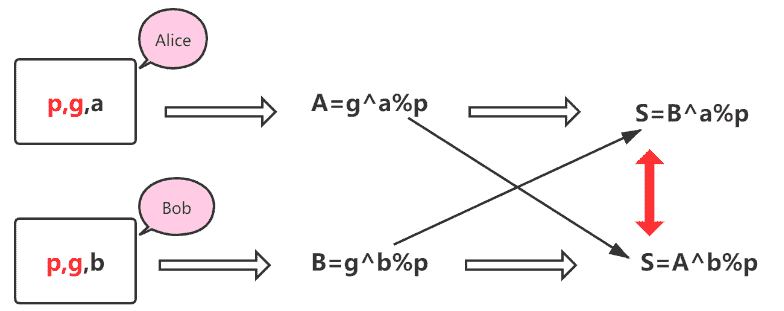

1. Alice计算A
    - 选择1个素数p，比如509，底数g 比如5，选择一个随机数a = 123；
    - 然后计算 A = g^a (mod p)= 5^a (mod 509) = 215
     - Alice现在有[p=509, g=5, a=123, A=215], 把p，g，A发送给Bob，随机数a私有
2. Bob计算B和密钥s
    - 收到 p = 509，g = 5 后，选择一个随机数b = 456
     - 计算 B = g^b (mod p) = 5^456 (mod 509) = 181
     - 计算密钥 S = A^b (mod p)= 215^456 (mod 509) = 121
     - Bob现在有[p=509, g=5, b=456, B=181, s=121, A=125]，把B=181发送给Alice，随机数b私有
3. Alice计算密钥s
    - Alice现在有[p,g,a,A,B]
    - Alice计算 S = B^a (mod p) = 181^123 (mod 509)=121

最终双方协商出的密钥S是121。注意到这个密钥s并没有在网络上传输。而通过网络传输的p，g，A和B是无法推算出s的，因为根据离散对数的原理，从真数（A 和 B）反向计算对数 a 和 b 是非常困难的，并且实际算法选择的素数是非常大的。

#### DHE 算法

根据私钥生成的方式，DH 算法分为两种实现：

- static DH 算法（废弃）
- DHE 算法

static DH 算法里有一方的私钥是静态的，也就说每次密钥协商的时候有一方的私钥都是一样的，一般是服务器方固定，即 随机数a 不变，客户端的私钥则是随机生成的。

假设Alice是服务器端，Bob是客户端，那么DH 交换密钥时就只有客户端的公钥（即B）在变化，而服务端公钥（即A）是不变的，那么随着时间延长，黑客就会截获海量的密钥协商过程的数据，因为密钥协商的过程有些数据是公开的，黑客就可以依据这些数据暴力破解出服务器的私钥（即a），然后就可以计算出会话密钥了，于是之前截获的加密数据会被破解，所以 static DH 算法不具备前向安全性。

DHE 算法，E 全称是 ephemeral（临时性的）。即让双方的私钥(即a、b)在每次密钥交换通信时，都进行随机生成。

#### ECDHE 算法

ECDHE 算法是在 DHE 算法的基础上利用了 ECC 椭圆曲线特性，可以用更少的计算量计算出公钥，以及最终的会话密钥。

ECDHE 密钥交换算法的过程：

1. 双方事先确定好使用哪种椭圆曲线，和曲线上的基点 G，这两个参数都是公开的；
2. 双方各自随机生成一个随机数作为私钥d，并与基点 G相乘得到公钥Q（Q = dG），此时Alice的公私钥为 Q1 和 d1，Bob的公私钥为 Q2 和 d2；
3. 双方交换各自的公钥，最后Alice计算点（x1，y1） = d1Q2，Bob计算点（x2，y2） = d2Q1，由于椭圆曲线上是可以满足乘法交换和结合律，所以 d1Q2 = d1d2G = d2d1G = d2Q1，因此双方的 x 坐标是一样的，所以它是共享密钥，也就是会话密钥。

这个过程中，双方的私钥d都是随机、临时生成的，都是不公开的，即使根据公开的信息（椭圆曲线、公钥、基点 G）也是很难计算出椭圆曲线上的离散对数（私钥）

#### ECDHE 握手过程

基于ECDHE算法的握手流程图如下：

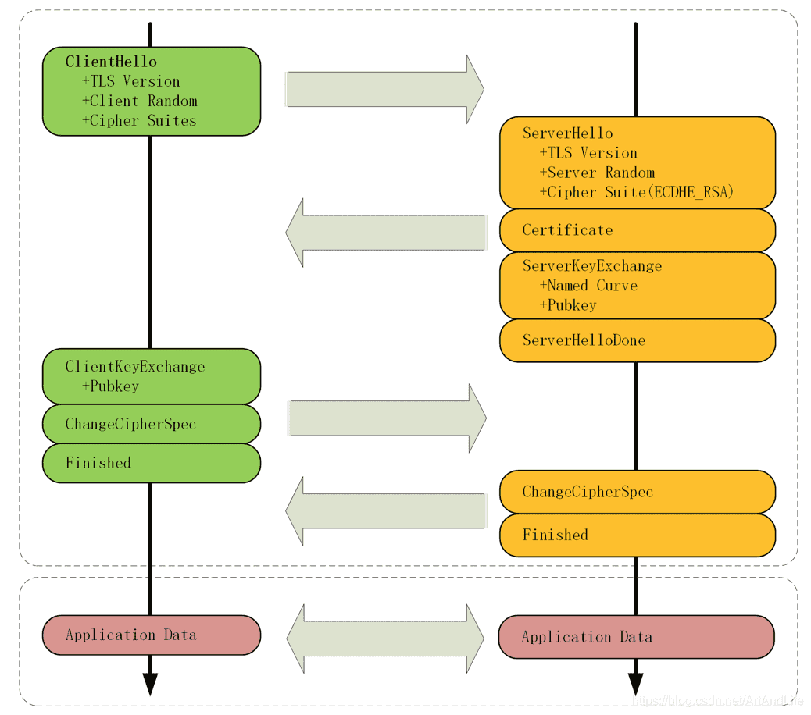

1、第一次握手`ClientHello`：首先，由客户端向服务器发起加密通信请求，也就是 ClientHello 请求。在这一步，客户端主要向服务器发送以下信息：

- 客户端支持的 TLS 协议版本（Version），如 TLS 1.2 版本。
- 客户端生产的随机数（Client Random），后面用于生成「会话秘钥」条件之一。
- 客户端支持的密码套件列表。

2、第二次握手`SeverHello`：服务器收到客户端请求后，向客户端发出响应，也就是 SeverHello。服务器回应的内容有如下内容：

- 确认 TLS 协议版本（Version），如果浏览器不支持，则关闭加密通信。
- 服务器生产的随机数（Server Random），也是后面用于生产「会话秘钥」条件之一。
- 确认的密码套件列表，如 TLS_ECDHE_RSA_WITH_AES_256_GCM_SHA384。

- Certificate：服务器为了证明身份，会给客户端发送数字证书，包括CA机构为服务器颁发的公钥、CA机构签名等信息
- Server Key Exchange：这步是ECDHE算法与RSA算法的**不同之处**，服务器会在发送证书后，再发送 Server Key Exchange 消息给客户端，包括：
    - 椭圆曲线公钥 Server Params，用来实现密钥交换（密钥协商）
    - 再加上自己的私钥签名认证（签名算法为RSA）
- Server Hello Done :通知客户端所有消息已经发送完毕

3、第三次握手

- 客户端收到服务器的 Certificate 消息后，使用操作系统内置的CA机构的公钥对证书解密，如果解密成功，得到 数据原文 及 摘要值 H1，然后客户端使用与CA机构相同的摘要算法（散列算法，SHA或MD5）对数据原文进行计算得到 摘要值 H2，比较 H1 与 H2，若完全相同则说明证书合法且未被其他人篡改，从而拿到服务器的RSA公钥。随后，客户端将自身的椭圆曲线公钥（Pubkey）使用服务器RSA公钥加密后，通过 Client Key Exchange 消息发给服务器
- Change Cipher Spec：客户端 首先根据 服务器的椭圆曲线公钥Server Params 及自身的椭圆曲线私钥计算出第三个随机数 Pre-Master，然后再使用 Client Random、Server Random、Pre-Master 这三个随机数计算出 主密钥 Master Secret，并使用 Change Cipher Spec 消息将主密钥使用服务器的RSA私钥加密后发给服务器，通知服务器开始使用对称加密的方式进行通信。
    - Sever Params ^ 客户端椭圆曲线私钥 % P = pre-master
    - client random + server random + pre-master = master secret
- Encrypted Handshake Message：
    - 客户端发送 Encrypted Handshake Message 消息，使用主密钥Master Secret 将之前的握手消息加密后发给服务器，一来验证新生成的对称密钥是否正确，二来让服务器验证之前的握手数据是否被篡改过

4、第四次握手：

- Change Cipher Spec：服务器收到客户端的 Client Key Exchange 消息后，使用私钥解密得到客户端的椭圆曲线公钥 Client Params，至此服务器也可以计算出pre-master
    - Client Params ^ 服务器椭圆曲线私钥 % P = pre-master
    - client random + server random + pre-master = master secret
        Encrypted Handshake Message：使用生成的主密钥 Master Secret 对之前的握手数据进行对称加密，然后通过 Encrypted Handshake Message 消息发送给客户端进行验证。

### HTTPS 的应用数据是如何保证完整性的？

TLS 在实现上分为**握手协议**和**记录协议**两层：

- TLS 握手协议就是我们前面说的 TLS 四次握手的过程，负责协商加密算法和生成对称密钥，后续用此密钥来保护应用程序数据（即 HTTP 数据）；
- TLS 记录协议负责保护应用程序数据并验证其完整性和来源，所以对 HTTP 数据加密是使用记录协议；

TLS 记录协议主要负责消息（HTTP 数据）的压缩，加密及数据的认证，过程如下图：

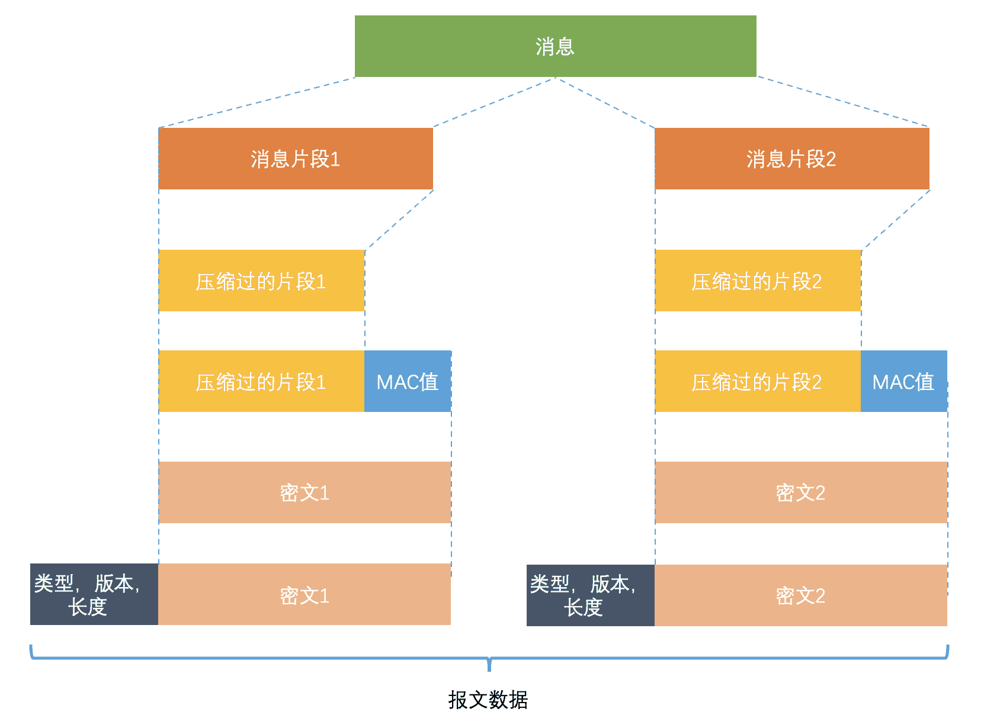

具体过程如下：

- 首先，消息被分割成多个较短的片段，然后分别对每个片段进行压缩。

- 接下来，经过压缩的片段会被**加上消息认证码（MAC 值，这个是通过哈希算法生成的），这是为了保证完整性，并进行数据的认证**。通过附加消息认证码的 MAC 值，可以识别出篡改。与此同时，为了防止重放攻击，在计算消息认证码时，还加上了片段的编码。

- 再接下来，经过压缩的片段再加上消息认证码会一起通过对称密码进行加密。

- 最后，上述经过加密的数据再加上由数据类型、版本号、压缩后的长度组成的报头就是最终的报文数据。

记录协议完成后，最终的报文数据将传递到传输控制协议 (TCP) 层进行传输。

### HTTPS 一定安全可靠吗？

这个问题的场景是这样的：客户端通过浏览器向服务端发起 HTTPS 请求时，被「假基站」转发到了一个「中间人服务器」，于是客户端是和「中间人服务器」完成了 TLS 握手，然后这个「中间人服务器」再与真正的服务端完成 TLS 握手。

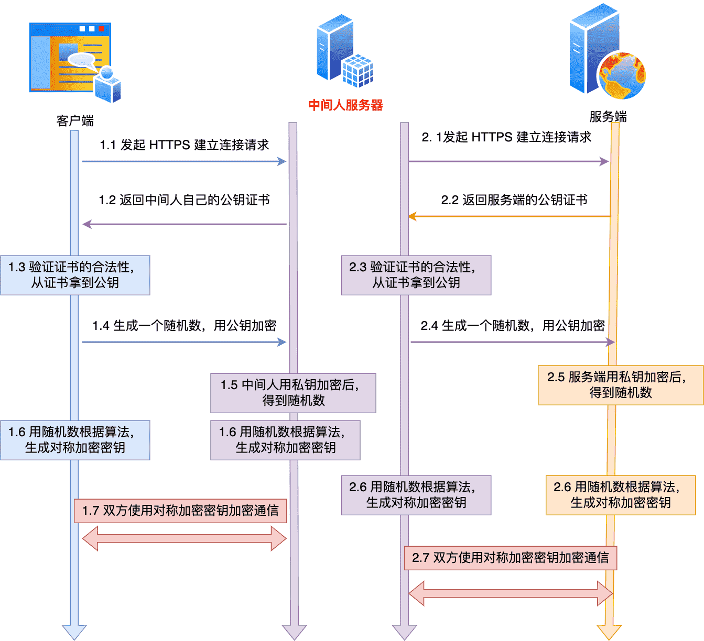

具体过程如下：

- 客户端向服务端发起 HTTPS 建立连接请求时，然后被「假基站」转发到了一个「中间人服务器」，接着中间人向服务端发起 HTTPS 建立连接请求，此时客户端与中间人进行 TLS 握手，中间人与服务端进行 TLS 握手；
- 在客户端与中间人进行 TLS 握手过程中，中间人会发送自己的公钥证书给客户端，**客户端验证证书的真伪**，然后从证书拿到公钥，并生成一个随机数，用公钥加密随机数发送给中间人，中间人使用私钥解密，得到随机数，此时双方都有随机数，然后通过算法生成对称加密密钥（A），后续客户端与中间人通信就用这个对称加密密钥来加密数据了。
- 在中间人与服务端进行 TLS 握手过程中，服务端会发送从 CA 机构签发的公钥证书给中间人，从证书拿到公钥，并生成一个随机数，用公钥加密随机数发送给服务端，服务端使用私钥解密，得到随机数，此时双方都有随机数，然后通过算法生成对称加密密钥（B），后续中间人与服务端通信就用这个对称加密密钥来加密数据了。
- 后续的通信过程中，中间人用对称加密密钥（A）解密客户端的 HTTPS 请求的数据，然后用对称加密密钥（B）加密 HTTPS 请求后，转发给服务端，接着服务端发送 HTTPS 响应数据给中间人，中间人用对称加密密钥（B）解密 HTTPS 响应数据，然后再用对称加密密钥（A）加密后，转发给客户端。

从客户端的角度看，其实并不知道网络中存在中间人服务器这个角色。那么中间人就可以解开浏览器发起的 HTTPS 请求里的数据，也可以解开服务端响应给浏览器的 HTTPS 响应数据。相当于，中间人能够“偷看”浏览器与服务端之间的 HTTPS 请求和响应的数据。

但是要发生这种场景是有前提的，前提是用户点击接受了中间人服务器的证书。

中间人服务器与客户端在 TLS 握手过程中，实际上发送了自己伪造的证书给浏览器，而这个伪造的证书是能被浏览器（客户端）识别出是非法的，于是就会提醒用户该证书存在问题。

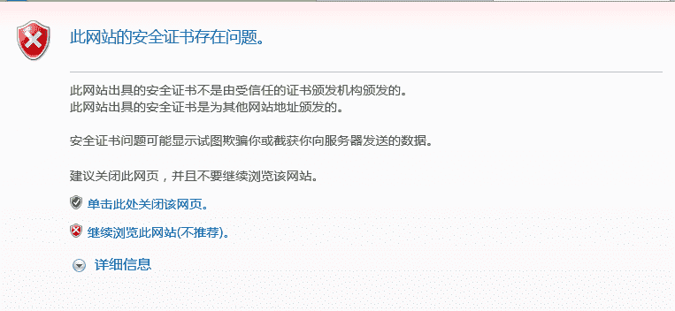

如果用户执意点击「继续浏览此网站」，相当于用户接受了中间人伪造的证书，那么后续整个 HTTPS 通信都能被中间人监听了。

所以，这其实并不能说 HTTPS 不够安全，毕竟浏览器都已经提示证书有问题了，如果用户坚决要访问，那不能怪 HTTPS。

另外，如果你的电脑中毒了，被恶意导入了中间人的根证书，那么在验证中间人的证书的时候，由于你操作系统信任了中间人的根证书，那么等同于中间人的证书是合法的，这种情况下，浏览器是不会弹出证书存在问题的风险提醒的。

这其实也不关 HTTPS 的事情，是你电脑中毒了才导致 HTTPS 数据被中间人劫持的。

所以，HTTPS 协议本身到目前为止还是没有任何漏洞的，即使你成功进行中间人攻击，本质上是利用了客户端的漏洞（用户点击继续访问或者被恶意导入伪造的根证书），并不是 HTTPS 不够安全。

> 为什么抓包工具能截取 HTTPS 数据？

很多抓包工具之所以可以明文看到 HTTPS 数据，工作原理与中间人一致的。

对于 HTTPS 连接来说，中间人要满足以下两点，才能实现真正的明文代理：

1. 中间人，作为客户端与真实服务端建立连接这一步不会有问题，因为服务端不会校验客户端的身份；
2. 中间人，作为服务端与真实客户端建立连接，这里会有客户端信任服务端的问题，也就是服务端必须有对应域名的私钥；

中间人要拿到私钥只能通过如下方式：

1. 去网站服务端拿到私钥；
2. 去 CA 处拿域名签发私钥；
3. 自己签发受浏览器信任的证书；

不用解释，抓包工具只能使用第三种方式取得中间人的身份。

因此使用抓包工具进行 HTTPS 抓包的时候，抓包工具会生成根证书，导入到客户端系统的**受信任的根证书列表**中，这里的根证书实际上起认证中心（CA）的作用。

随后抓包工具使用该根证书签发域名的证书，因为根证书受信任，域名的证书同样会被浏览器信任。也就是抓包工具给自己创建了一个认证中心 CA，客户端拿着中间人（抓包工具）签发的证书去中间人（抓包工具）自己的 CA 做认证，这个证书当然被认为是有效的。

> 如何避免被中间人抓取数据？

我们要保证自己电脑的安全，不要被病毒乘虚而入，而且也不要点击任何证书非法的网站，这样 HTTPS 数据就不会被中间人截取到了。

当然，我们还可以通过 **HTTPS 双向认证**来避免这种问题。

一般我们的 HTTPS 是单向认证，客户端只会验证了服务端的身份，但是服务端并不会验证客户端的身份。

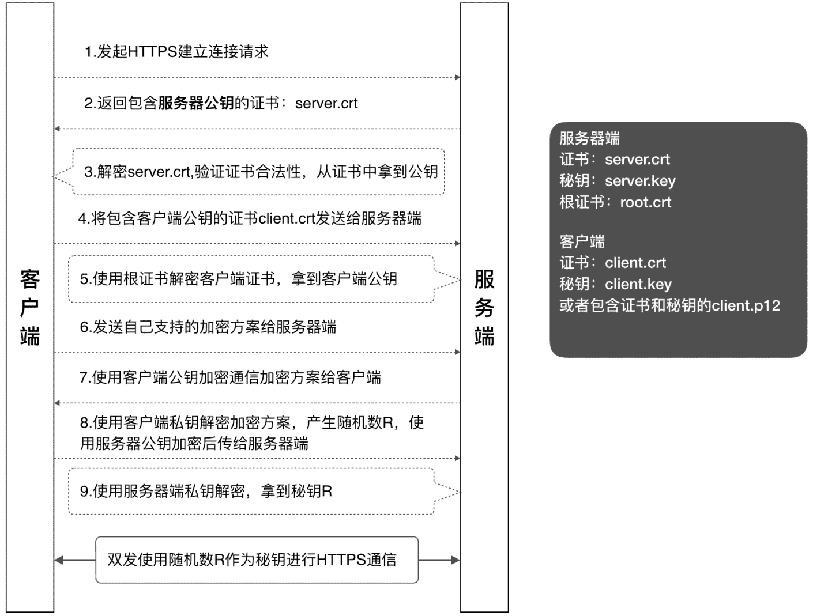

如果用了双向认证方式，不仅客户端会验证服务端的身份，而且服务端也会验证客户端的身份。服务端一旦验证到请求自己的客户端为不可信任的，服务端就拒绝继续通信，客户端如果发现服务端为不可信任的，那么也中止通信。

### 小结

HTTPS是如何保证安全性的：

1. 无法保证内容是安全的，因此通过对称加密算法加密传输内容
2. 无法保证整个传输内容不会被篡改，因此hash内容，来保证内容的完整性
3. 无法保证 内容+hash值 不会被同时替换，因此使用数字签名算法，使用服务端私钥加密hash值，保证hash来自私钥方
4. 无法保证公钥私钥的分发来自服务器，因此引入数字证书，引入CA确保可信

## 正向代理和反向代理的区别

正向代理和反向代理在网络通信中扮演着不同的角色，它们之间有许多显著的区别：

正向代理：

1. 定义：正向代理是为了帮助客户端访问无法直接访问的服务器资源而设置的代理服务器。
2. 作用对象：正向代理的对象是**客户端**，代理服务器帮助客户端与目标服务器进行通信和数据交换。
3. 安全性：在正向代理中，客户端知道目标服务器的IP地址和端口号等敏感信息，而目标服务器不知道真正的客户端身份，存在一定的安全风险。
4. 典型应用：**正向代理常用于为内部局域网客户端提供访问互联网的途径，以及实现缓存和权限验证等功能**。

反向代理：

1. 定义：反向代理是位于服务器端的代理服务器，接收客户端的请求，并将请求转发给内部的目标服务器/网站。
2. 作用对象：反向代理的对象是**服务器/网站**，为服务器提供负载均衡、安全防护等功能。
3. 隐藏信息：在反向代理中，客户端只知道代理服务器的地址，不知道真实的服务器是谁，从而保护了服务器的IP地址和其他敏感信息。
4. 典型应用：**反向代理常用于隐藏真实服务器的结构和部署信息，提高系统的安全性，并用于实现多服务器间的负载均衡**。

## HTTP/1.1 的性能

HTTP 协议是基于 TCP/IP，并且使用了「请求 - 应答」的通信模式，所以性能的关键就在这两点里。

1、长连接

-   早期 HTTP/1.0 性能上的一个很大的问题，那就是每发起一个请求，都要新建一次 TCP 连接（三次握手），而且是串行请求，做了无谓的 TCP 连接建立和断开，增加了通信开销。
-   为了解决上述 TCP 连接问题，HTTP/1.1 提出了长连接的通信方式，也叫持久连接。这种方式的好处在于减少了 TCP 连接的重复建立和断开所造成的额外开销，减轻了服务器端的负载。
-   持久连接的特点是，只要任意一端没有明确提出断开连接，则保持 TCP 连接状态。如果某个 HTTP 长连接超过一定时间没有任何数据交互，服务端也会主动断开这个连接。


2、管道网络传输（默认不使用）

HTTP/1.1 采用了长连接的方式，这使得管道（pipeline）网络传输成为了可能。

即可在同一个 TCP 连接里面，客户端可以发起多个请求，只要第一个请求发出去了，不必等其回来，就可以发第二个请求出去，可以减少整体的响应时间。

举例来说，客户端需要请求两个资源。以前的做法是，在同一个 TCP 连接里面，先发送 A 请求，然后等待服务器做出回应，收到后再发出 B 请求。那么，管道机制则是允许浏览器同时发出 A 请求和 B 请求，如下图：


但是服务器必须按照接收请求的顺序发送对这些管道化请求的响应。

如果服务端在处理 A 请求时耗时比较长，那么后续的请求的处理都会被阻塞住，这称为「队头堵塞」。所以，HTTP/1.1 管道解决了请求的队头阻塞，但是没有解决响应的队头阻塞。

3、队头阻塞

当顺序发送的请求序列中的一个请求因为某种原因被阻塞时，在后面排队的所有请求也一同被阻塞了，会招致客户端一直请求不到数据，这也就是「队头阻塞」。


## 读者问答

> “https 和 http 相比，就是传输的内容多了对称加密，可以这么理解吗？”

1. 建立连接时候：https 比 http 多了 TLS 的握手过程；

2. 传输内容的时候：https 会把数据进行加密，通常是对称加密数据；

> “我看文中 TLS 和 SSL 没有做区分，这两个需要区分吗？”

这俩实际上是一个东西。

SSL 是“Secure Sockets Layer”的缩写，中文叫做「安全套接层」。它是在上世纪 90 年代中期，由网景公司设计的。

到了 1999 年，SSL 因为应用广泛，已经成为互联网上的事实标准。IETF 就把 SSL 标准化，标准化之后的名称改为 TLS（是“Transport Layer Security”的缩写），中文叫做「传输层安全协议」。

很多相关的文章都把这两者并列称呼（SSL/TLS），因为这两者可以视作同一个东西的不同阶段。

> “为啥 SSL 的握手是 4 次？”

SSL/TLS 1.2 需要 4 握手，需要 2 个 RTT 的时延，我文中的图是把每个交互分开画了，实际上把他们合在一起发送，就是 4 次握手：

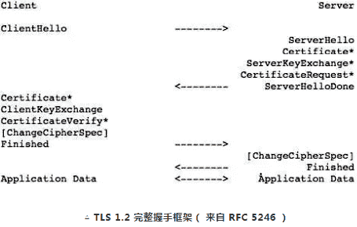

另外，SSL/TLS 1.3 优化了过程，只需要 1 个 RTT 往返时延，也就是只需要 3 次握手：

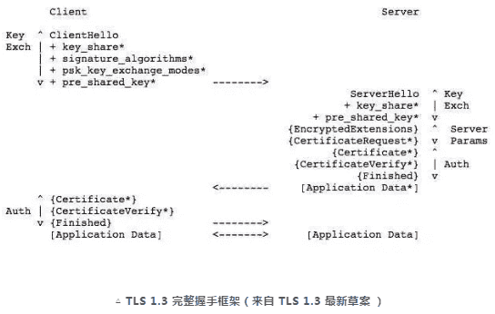
