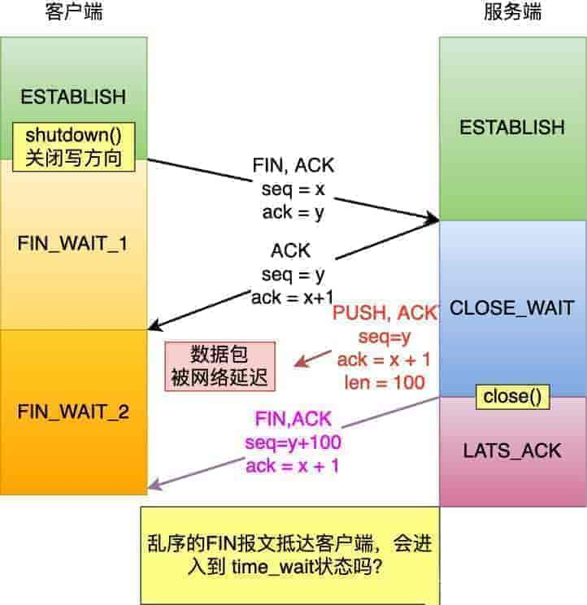
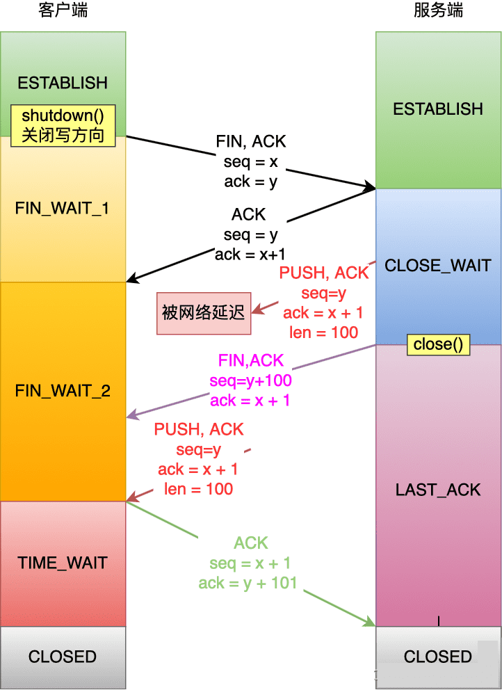

# 四次挥手中收到乱序的 FIN 包会如何处理？

收到个读者的问题，他在面试鹅厂的时候，被搞懵了，因为面试官问了他这么一个网络问题：

>   TCP里面shutdown函数主动方调用只关闭写端情况下，假如服务端在二三次挥手之间发的数据，或者是四次挥手之
>   前的数据包，因为网络阻塞导致第三次挥手的FIN包比数据包先到主动关闭方，那么主动关闭方收到FIN就会进入timewait状态，这时候那个延迟的数据包到了还能正常接收并处理么？

不过这道鹅厂的网络题可能是提问的读者表述有问题：==因为如果 FIN 报文比数据包先抵达客户端，此时 FIN 报文其实是一个乱序的报文，此时客户端的 TCP 连接并不会从 FIN_WAIT_2 状态转换到 TIME_WAIT 状态==。



因此，我们要关注到点是看「**在 FIN_WAIT_2 状态下，是如何处理收到的乱序到 FIN 报文，然后 TCP 连接又是什么时候才进入到 TIME_WAIT 状态？**」。

我这里先直接说结论：

**在 FIN_WAIT_2 状态时，如果收到乱序的 FIN 报文，那么就被会加入到「乱序队列」，并不会进入到 TIME_WAIT 状态。**

**等再次收到前面被网络延迟的数据包时，会判断乱序队列有没有数据，然后会检测乱序队列中是否有可用的数据，如果能在乱序队列中找到与当前报文的序列号保持的顺序的报文，就会看该报文是否有 FIN 标志，如果发现有 FIN 标志，这时才会进入 TIME_WAIT 状态。**

我也画了一张图，大家可以结合着图来理解。


## TCP 源码分析
这次我们重点分析的是，在 FIN_WAIT_2 状态下，收到 FIN 报文是如何处理的。

在 Linux 内核里，当 IP 层处理完消息后，会通过回调 tcp_v4_rcv 函数将消息转给 TCP 层，所以这个函数就是 TCP 层收到消息的入口。

```c
// tcp层总入口
// net/ipv4/tcp_ipv4.c
int tcp_v4_rcv(struct sk_buff *skb)
{
    ...
	const struct tcphdr *th;
	struct sock *sk = NULL;

    ...

    // 取tcp头
	th = (const struct tcphdr *)skb->data;

	// 根据四元组查找相应连接的sock结构
	sk = __inet_lookup_skb(net->ipv4.tcp_death_row.hashinfo,
			       skb, __tcp_hdrlen(th), th->source,
			       th->dest, sdif, &refcounted);

    // 判断 socket 是否被 user 占用，如果数据包到的时候 User没有占用，则将数据包传入tcp_v4_do_rcv
	if (!sock_owned_by_user(sk)) {
		ret = tcp_v4_do_rcv(sk, skb);
	}
    //如果被占用了，说明User正在读socket的数据
    else {
         // 为了避免并发操作Socket，此时将数据包放入backlog队列中，
         // 如果没有成功放入backlog队列比如backlog队列已经满了，则会丢弃数据包。
		if (tcp_add_backlog(sk, skb, &drop_reason))
			goto discard_and_relse;
	}
    ...
}
```

处于 FIN_WAIT_2 状态下的客户端，在收到服务端的报文后，最终会调用 tcp_v4_do_rcv 函数。

```c
int tcp_v4_do_rcv(struct sock *sk, struct sk_buff *skb)
{
	...
	reason = tcp_rcv_state_process(sk, skb);
	// 根据TCP 状态做对应的处理
	if (reason) {
		...
		goto reset;
	}
    ...
}
```

接下来，tcp_v4_do_rcv 方法会调用 tcp_rcv_state_process，在这里会根据 TCP 状态做对应的处理，这里我们只关注 FIN_WAIT_2 状态。

```c
tcp_rcv_state_process(struct sock *sk, struct sk_buff *skb)
{
	...
	switch (sk->sk_state) {
	case TCP_CLOSE_WAIT:
	case TCP_CLOSING:
	case TCP_LAST_ACK:
		...
	case TCP_FIN_WAIT1:
	case TCP_FIN_WAIT2:
		/* RFC 793 says to queue data in these states,
		 * RFC 1122 says we MUST send a reset.
		 * BSD 4.4 also does reset.
		 */
		if (sk->sk_shutdown & RCV_SHUTDOWN) {
			if (TCP_SKB_CB(skb)->end_seq != TCP_SKB_CB(skb)->seq &&
			    after(TCP_SKB_CB(skb)->end_seq - th->fin, tp->rcv_nxt)) {
				NET_INC_STATS(sock_net(sk), LINUX_MIB_TCPABORTONDATA);
				tcp_reset(sk, skb);
				return SKB_DROP_REASON_TCP_ABORT_ON_DATA;
			}
		}
		fallthrough;
	case TCP_ESTABLISHED:
		tcp_data_queue(sk, skb);
		queued = 1;
		break;
	}
    ...
}
```

在上面这个代码里，可以看到如果 shutdown 关闭了读方向，那么在收到对方发来的数据包，则会回复 RST 报文。

而我们这次的题目里，shutdown 只关闭了写方向，所以会继续往下调用 tcp_data_queue 函数（因为 case TCP_FIN_WAIT2 代码块里并没有 break 语句，所以会走到该函数）。

```c
static void tcp_data_queue(struct sock *sk, struct sk_buff *skb)
{
	...

	/*  Queue data for delivery to the user.
	 *  Packets in sequence go to the receive queue.
	 *  Out of sequence packets to the out_of_order_queue.
	 */
     // 如果报文的序列号是有序的
	if (TCP_SKB_CB(skb)->seq == tp->rcv_nxt) {
		...
         // 如果报文里有FIN标志，则会调用tcp_fin进行状态转换
		if (TCP_SKB_CB(skb)->tcp_flags & TCPHDR_FIN)
			tcp_fin(sk);
		...
         // 检查乱序队列有没有数据
		if (!RB_EMPTY_ROOT(&tp->out_of_order_queue)) {
             // 检查乱序队列中是否有数据包可用，
             // 即能不能在乱序队列找到与当前数据包保持序列号连续的数据包
			tcp_ofo_queue(sk);

             ...
		}
		...
	}
	// 如果报文是乱序的，就会通过tcp_data_queue_ofo函数加入到乱序队列
	tcp_data_queue_ofo(sk, skb);
}
```

在上面的 tcp_data_queue 函数里，如果收到的报文的序列号是我们预期的，也就是有序的话：

- 会判断该报文有没有 FIN 标志，如果有的话就会调用 tcp_fin 函数，这个函数负责将 FIN_WAIT_2 状态转换为 TIME_WAIT。
- 接着还会看乱序队列有没有数据，如果有的话会调用 tcp_ofo_queue 函数，这个函数负责检查乱序队列中是否有数据包可用，即能不能在乱序队列找到与当前数据包保持序列号连续的数据包。

而当收到的报文的序列号不是我们预期的，也就是乱序的话，则调用 tcp_data_queue_ofo 函数，将报文加入到乱序队列，这个队列的数据结构是红黑树。

我们的题目里，客户端收到的 FIN 报文实际上是一个乱序的报文，因此此时并不会调用 tcp_fin 函数进行状态转换，而是将报文通过 tcp_data_queue_ofo 函数加入到乱序队列。

然后当客户端收到被网络延迟的数据包后，此时因为该数据包的序列号是期望的，然后又因为上一次收到的乱序 FIN 报文被加入到了乱序队列，表明乱序队列是有数据的，于是就会调用 tcp_ofo_queue 函数。

我们来看看 tcp_ofo_queue 函数。

```c
/* This one checks to see if we can put data from the
 * out_of_order queue into the receive_queue.
 */
static void tcp_ofo_queue(struct sock *sk)
{
	struct tcp_sock *tp = tcp_sk(sk);
	__u32 dsack_high = tp->rcv_nxt;
	bool fin, fragstolen, eaten;
	struct sk_buff *skb, *tail;
	struct rb_node *p;

	p = rb_first(&tp->out_of_order_queue);
	while (p) {
		skb = rb_to_skb(p);
        // 首先如果第一个树节点的数据开始序号在套接口的下一个要接收的序号之后，
        // 表明两者之间还有缺口，跳出循环。
		if (after(TCP_SKB_CB(skb)->seq, tp->rcv_nxt))
			break;

        // 如果节点数据包的结束序号位于套接口的下一个要接收序号之前，
        // 表明此数据包的数据也被正确接收到，释放此节点数据包。
		if (before(TCP_SKB_CB(skb)->seq, dsack_high)) {
			__u32 dsack = dsack_high;
			if (before(TCP_SKB_CB(skb)->end_seq, dsack_high))
				dsack_high = TCP_SKB_CB(skb)->end_seq;
			tcp_dsack_extend(sk, TCP_SKB_CB(skb)->seq, dsack);
		}
		p = rb_next(p);
		rb_erase(&skb->rbnode, &tp->out_of_order_queue);

		if (unlikely(!after(TCP_SKB_CB(skb)->end_seq, tp->rcv_nxt))) {
			tcp_drop_reason(sk, skb, SKB_DROP_REASON_TCP_OFO_DROP);
			continue;
		}

		//将接收队列的最后一个数据包tail与节点数据包skb进行合并tcp_try_coalesce。
		//如果合并成功，调用kfree_skb_partial释放skb;
		//如果合并失败，将节点的skb添加到sk_receive_queue队列的末尾。
		tail = skb_peek_tail(&sk->sk_receive_queue);
		eaten = tail && tcp_try_coalesce(sk, tail, skb, &fragstolen);
		tcp_rcv_nxt_update(tp, TCP_SKB_CB(skb)->end_seq);
		fin = TCP_SKB_CB(skb)->tcp_flags & TCPHDR_FIN;
		if (!eaten)
			tcp_add_receive_queue(sk, skb);
		else
			kfree_skb_partial(skb, fragstolen);

		// 如果节点数据包带有TCP的FIN标志，调用tcp_fin函数处理，
		// 在其中将清空out_of_order_queue队列。
		if (unlikely(fin)) {
			tcp_fin(sk);
			/* tcp_fin() purges tp->out_of_order_queue,
			 * so we must end this loop right now.
			 */
			break;
		}
	}
}
```

在上面的 tcp_ofo_queue 函数里，在乱序队列中找到能与当前报文的序列号保持的顺序的报文后，会看该报文是否有 FIN 标志，如果有的话，就会调用 tcp_fin() 函数。

最后，我们来看看 tcp_fin 函数的处理。

```c
void tcp_fin(struct sock *sk)
{
	struct tcp_sock *tp = tcp_sk(sk);

	inet_csk_schedule_ack(sk);
	...
	switch (sk->sk_state) {
	case TCP_SYN_RECV:
	case TCP_ESTABLISHED:
		/* Move to CLOSE_WAIT */
		tcp_set_state(sk, TCP_CLOSE_WAIT);
		inet_csk_enter_pingpong_mode(sk);
		break;

	case TCP_CLOSE_WAIT:
	case TCP_CLOSING:
		/* Received a retransmission of the FIN, do
		 * nothing.
		 */
		break;
	case TCP_LAST_ACK:
		/* RFC793: Remain in the LAST-ACK state. */
		break;

	case TCP_FIN_WAIT1:
		/* This case occurs when a simultaneous close
		 * happens, we must ack the received FIN and
		 * enter the CLOSING state.
		 */
		tcp_send_ack(sk);
		tcp_set_state(sk, TCP_CLOSING);
		break;
	case TCP_FIN_WAIT2:
		/* Received a FIN -- send ACK and enter TIME_WAIT. */
		// 发送第四次挥手ack
		tcp_send_ack(sk);
		// 将TCP状态变更为TIMEWAIT，并启动TIME_WAIT的定时器
		tcp_time_wait(sk, TCP_TIME_WAIT, 0);
		break;
	...
	}
	...
}
```

可以看到，如果当前的 TCP 状态为 TCP_FIN_WAIT2，就会发送第四次挥手 ack，然后调用 tcp_time_wait 函数，这个函数里会将 TCP 状态变更为 TIME_WAIT，并启动 TIME_WAIT 的定时器。

