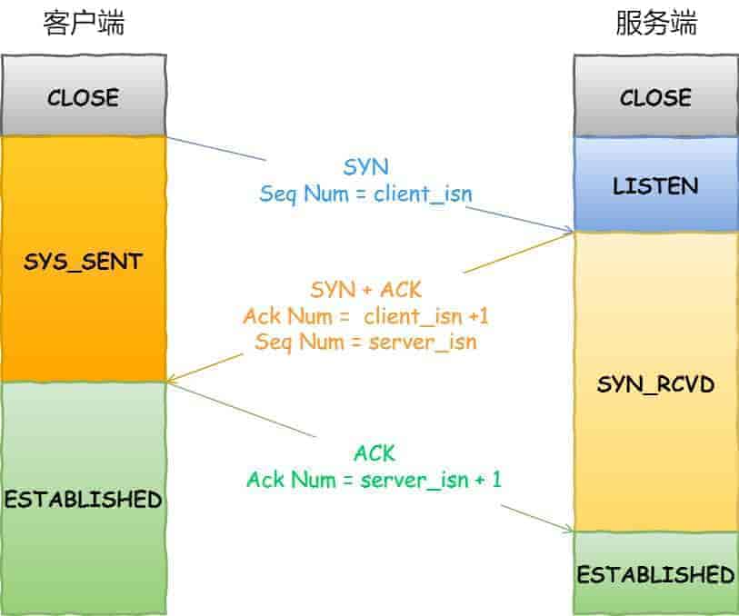
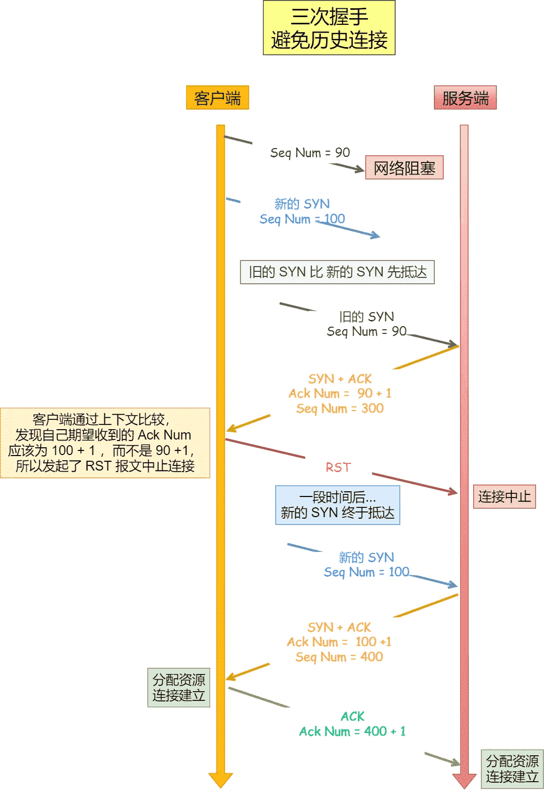
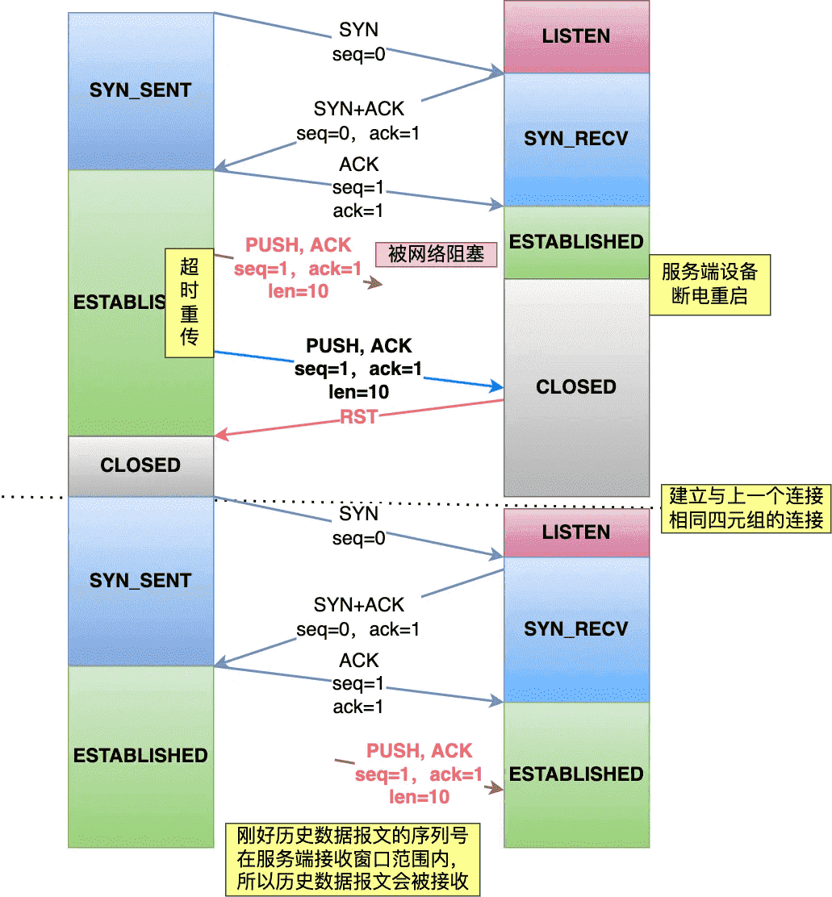
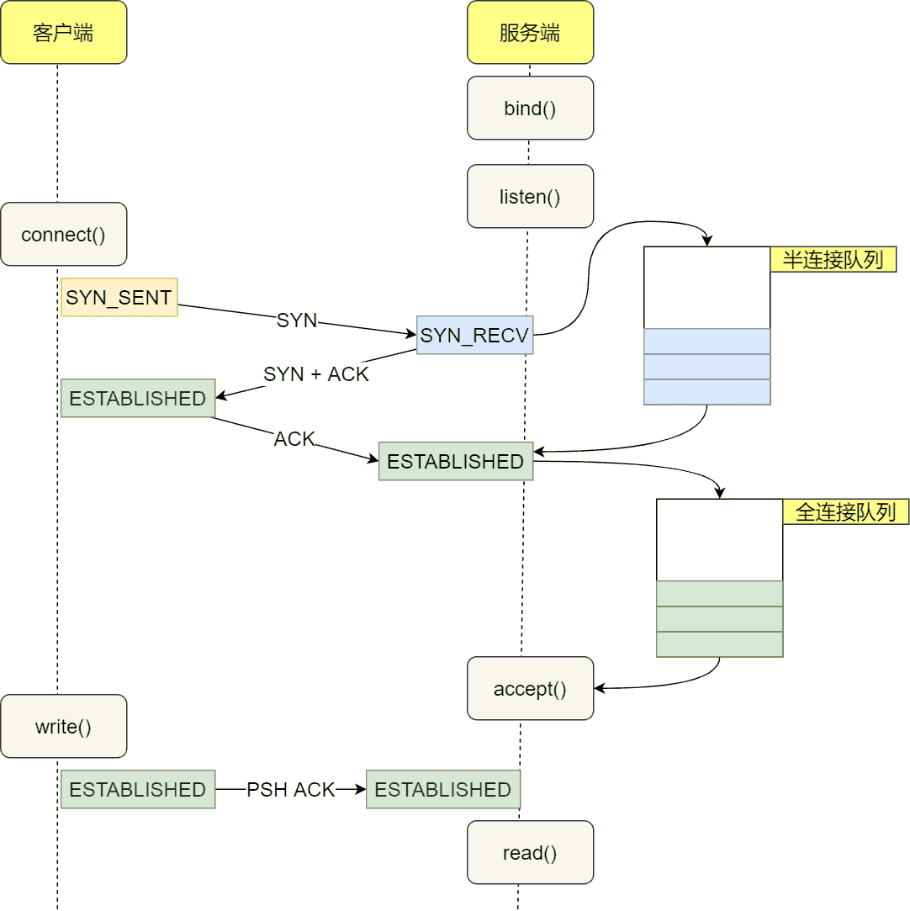
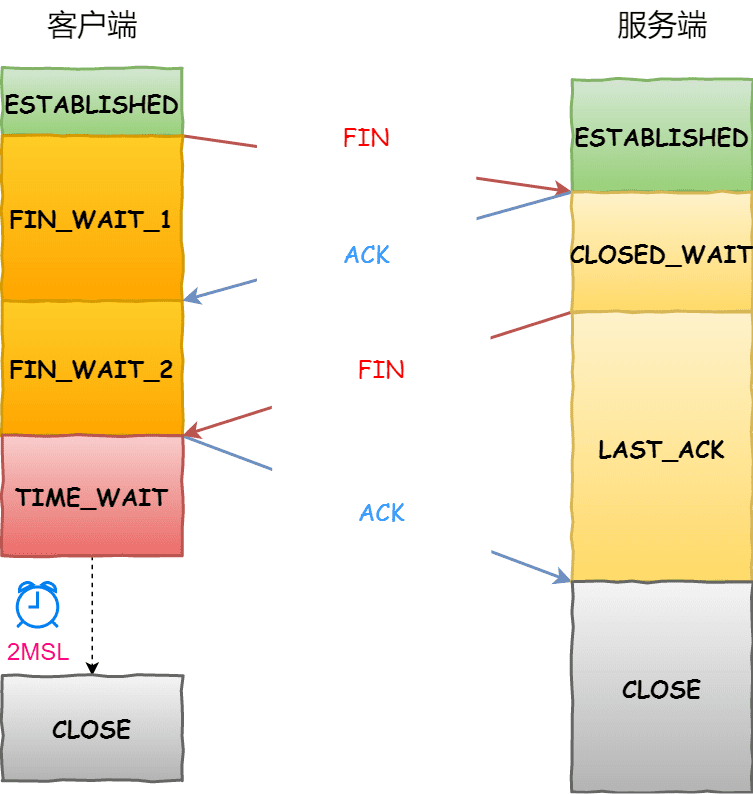

# TCP三次握手四次挥手

## 通俗解释

用生活中的例子来比喻TCP的三次握手和四次挥手，会更容易理解：

### 三次握手（建立连接）

**场景**：就像两个人打电话确认对方能听到自己说话。

1. **客户端**：“喂，你能听到我吗？” （发送`SYN`信号，表示想建立连接）
2. **服务端**：“我能听到你！你能听到我吗？” （回复`SYN-ACK`，表示收到并同意连接）
3. **客户端**：“我也能听到你！” （发送`ACK`，确认服务端的回应）

**结果**：连接建立成功，可以开始传数据了。

**核心**：双方确认彼此的收发能力正常，避免无效连接。

>  为什么挥手多一次？

因为握手时服务端的`SYN`和`ACK`可以合并发送，但挥手时服务端可能还有数据要传，不能立刻发`FIN`，所以需要多一步。

### 四次挥手（断开连接）

**场景**：像两个人在礼貌地道别，确保双方都说完话了。

1. **客户端**：“我说完了，要挂电话了” （发送`FIN`，表示想断开）
2. **服务端**：“好的，等我确认下…” （回复`ACK`，但可能还有数据没发完）
3. **服务端**：“我也说完了，可以挂了” （发送`FIN`，确认断开）
4. **客户端**：“好的，再见！” （回复`ACK`，最终确认）

**结果**：连接安全关闭。

**核心**：确保双方数据都传输完毕，避免突然断开丢失数据。

## 三次握手

### 建立过程

1. 第一次握手：建立连接。客户端发送连接请求报文段，将SYN位置为1，Sequence Number为client_isn；然后，客户端进入SYN_SEND状态，等待服务器的确认；
2. 第二次握手：服务器收到客户端的SYN报文段，需要对这个SYN报文段进行确认，设置Acknowledgment Number为client_isn+1(Sequence Number+1)；同时，自己还要发送SYN请求信息，将SYN位置为1，Sequence Number为server_isn；服务器端将上述所有信息放到一个报文段（即SYN+ACK报文段）中，一并发送给客户端，此时服务器进入SYN_RECV状态；
3. 第三次握手：客户端收到服务器的SYN+ACK报文段。然后将Acknowledgment Number设置为server_isn+1，向服务器发送ACK报文段，这个报文段发送完毕以后，客户端和服务器端都进入ESTABLISHED状态，完成TCP三次握手。

**第三次握手是可以携带数据的，前两次握手是不可以携带数据的**

### 为什么是3次握手

因为三次握手才能保证双方具有接收和发送的能力。两次是不够，会出现问题，四次是太多了，没必要

以三个方面分析三次握手的原因：

- 阻止重复历史连接的初始化（主要原因）
- 同步双方的初始序列号
- 避免资源浪费

#### 避免历史连接(为什么不能2次)

如上，客户端先发送了 SYN（seq = 90）报文，然后客户端宕机了，而且这个 SYN 报文还被网络阻塞了，服务端并没有收到，接着客户端重启后，又重新向服务端建立连接，发送了 SYN（seq = 100）报文（注意！不是重传 SYN，重传的 SYN 的序列号是一样的)。

1. 一个「旧 SYN 报文」比「最新的 SYN」 报文早到达了服务端，那么此时服务端就会回一个 SYN + ACK 报文给客户端，此报文中的确认号是 91（90+1）。
2. 客户端收到后，发现自己期望收到的确认号应该是 100 + 1，而不是 90 + 1，于是就会回 RST 报文。
3. 服务端收到 RST 报文后，就会释放连接。
4. 后续最新的 SYN 抵达了服务端后，客户端与服务端就可以正常的完成三次握手了。

以上是正常的三次握手过程。而如果是两次握手连接，就无法阻止历史连接。因为在两次握手的情况下，服务端没有中间状态给客户端来阻止历史连接，导致服务端可能建立了一个历史连接。

比如说，**在两次握手的情况下**，服务端在收到 SYN 报文后，就进入 ESTABLISHED 状态，意味着这时可以给对方发送数据，但是客户端此时还没有进入 ESTABLISHED 状态，假设这次是历史连接，客户端判断到此次连接为历史连接，那么就会回 RST 报文来断开连接，而服务端在第一次握手的时候就进入 ESTABLISHED 状态，所以它可以发送数据的，但是它并不知道这个是历史连接，它只有在收到 RST 报文后，才会断开连接。这自然就出现了问题。

因此不能两次握手，需要三次握手

#### 同步双方初始序列号

当客户端发送携带「初始序列号」的 SYN 报文的时候，需要服务端回一个 ACK 应答报文，表示客户端的 SYN 报文已被服务端成功接收，那当服务端发送「初始序列号」给客户端的时候，依然也要得到客户端的应答回应，这样一来一回，才能确保双方的初始序列号能被可靠的同步。

四次握手其实也能够可靠的同步双方的初始化序号，但由于第二步和第三步可以优化成一步，所以就成了「三次握手」。

而两次握手只保证了一方的初始序列号能被对方成功接收，没办法保证双方的初始序列号都能被确认接收。

#### 避免资源浪费

如果只有「两次握手」，当客户端发出的 SYN 报文在网络中阻塞，客户端没有接收到 ACK 报文，就会重新发送 SYN，由于没有第三次握手，服务端就不清楚客户端是否收到了自己回复的 ACK 报文，所以服务端每收到一个 SYN 就会建立一个连接，造成不必要的资源浪费。

### 每次建立 TCP 连接时，初始化的序列号都要求不一样

主要原因有两个方面：

- 为了防止历史报文被下一个相同四元组的连接接收（主要方面）；
- 为了安全性，防止黑客伪造的相同序列号的 TCP 报文被对方接收；

假设每次建立连接，客户端和服务端的初始化序列号都是从 0 开始：

1. 客户端和服务端建立一个 TCP 连接，在客户端发送数据包被网络阻塞了，然后超时重传了这个数据包，而此时服务端设备断电重启了，之前与客户端建立的连接就消失了，于是在收到客户端的数据包的时候就会发送 RST 报文。
2. 紧接着，客户端又与服务端建立了与上一个连接相同四元组的连接；
3. 在新连接建立完成后，上一个连接中被网络阻塞的数据包正好抵达了服务端，刚好该数据包的序列号正好是在服务端的接收窗口内，所以该数据包会被服务端正常接收，就会造成数据错乱。

如果每次建立连接，客户端和服务端的初始化序列号都是一样的话，很容易出现历史报文被下一个相同四元组的连接接收的问题。

那么TCP连接中的初始序列号 ISN 是如何随机产生的？每个连接都会选择一个初始序列号，初始序列号（视为一个 32 位计数器），会随时间而改变（每 4 微秒加 1）

### 握手丢失会发生什么？

#### 第一次握手丢失

客户端发送第一次握手后，第一次握手丢失了，那么客户端就收不到服务端的 SYN-ACK 报文（第二次握手），就会触发「超时重传」机制，重传 SYN 报文，而且重传的 SYN 报文的序列号都是一样的。

通常，第一次超时重传是在 1 秒后，第二次超时重传是在 2 秒，第三次超时重传是在 4 秒后，第四次超时重传是在 8 秒后，第五次是在超时重传 16 秒后。每次超时的时间是上一次的 2 倍。当第五次超时重传后，会继续等待 32 秒，如果服务端仍然没有回应 ACK，客户端就不再发送 SYN 包，就会断开 TCP 连接。

#### 第二次握手丢失

第二次握手是服务端收到客户端的第一次握手后，回复 SYN-ACK 报文给客户端

第二次握手丢失

1. **客户端**就觉得可能自己的 SYN 报文（第一次握手）丢失了，于是客户端就会触发超时重传机制，重传 SYN 报文。
2. **服务端**就收不到第三次握手，于是服务端这边会触发超时重传机制，重传 SYN-ACK 报文。

#### 第三次握手丢失

第三次握手丢失了，服务端就收不到这个确认报文，那么服务端就会认为自己的第二次握手丢失了，就会触发超时重传机制，重传 SYN-ACK 报文，直到收到第三次握手，或者达到最大重传次数

**ACK 报文是不会有重传的，当 ACK 丢失了，就由对方重传对应的报文**。

### SYN攻击

SYN Flood是一种网络攻击方式，利用TCP协议中的三次握手过程中的漏洞进行攻击。攻击者发送大量伪造的TCP连接请求（SYN包）给目标主机，在收到请求后，目标主机会分配资源并等待客户端发送ACK包进行确认。然而，攻击者并不发送ACK包，而是故意丢弃或忽略这些响应。

假设攻击者短时间伪造不同 IP 地址的 SYN 报文，服务端每接收到一个 SYN 报文，就进入SYN_RCVD 状态，短时间内把 TCP 半连接队列打满，这样后续再在收到 SYN 报文就会丢弃，导致客户端无法和服务端建立连接。

由于目标主机在等待确认响应时保持资源开销，当恶意的SYN请求超过其处理能力时，目标主机将无法建立新的合法连接，并导致服务不可用。此外，由于TCP协议默认会重试建立连接的尝试，攻击可能导致网络拥塞、资源耗尽和系统崩溃。

避免 SYN 攻击方式，可以有以下方法：

1. 调大 netdev_max_backlog：网卡接收数据包的速度大于内核处理的速度时，会有一个队列保存这些数据包
2. 增大 TCP 半连接队列；
3. 开启 tcp_syncookies：开启 syncookies 功能就可以在不使用 SYN 半连接队列的情况下成功建立连接，相当于绕过了 SYN 半连接来建立连接。
4. 减少 SYN+ACK 重传次数。当服务端受到 SYN 攻击时，就会有大量处于 SYN_REVC 状态的 TCP 连接，处于这个状态的 TCP 会重传 SYN+ACK，当重传超过次数达到上限后，就会断开连接。
5. 使用防火墙过滤异常流量、限制并发连接数

## TCP四次挥手

四次挥手中，前两次主要用于断开一个方向的连接，后两次则用于断开另一方向的连接。

### 挥手过程

1.  第一次挥手：主机1（可以是客户端，也可以是服务器端）发送一个 TCP 首部 FIN 标志位被置为 1 的报文，也即 FIN 报文，之后主机1进入FIN_WAIT_1状态；这表示主机1没有数据要发送给主机2了；
2.  第二次挥手：主机2收到了主机1发送的FIN报文段，向主机1回一个ACK报文段；主机2进入 CLOSE_WAIT 状态。主机1收到主机2发送的ACK 应答报文后，进入FIN_WAIT_2状态；
3.  第三次挥手：主机2**处理完数据之后**，向主机1发送FIN报文段，请求关闭连接，同时主机2进入LAST_ACK状态；
4.  第四次挥手：主机1收到主机2发送的FIN报文段，向主机2发送ACK报文段，然后主机1进入TIME_WAIT状态；主机2收到主机1的ACK报文段以后，就关闭连接；此时，主机1等待2MSL后没有收到新的FIN重传包，则证明Server端已正常关闭，那好，主机1也可以关闭连接了。

**主动关闭连接的，才有 TIME_WAIT 状态**

### 为什么挥手要4次

- 关闭连接时，主机1向主机2发送 FIN 时，仅仅表示主机1不再发送数据了但是还能接收数据。
- 主机2收到主机1的 FIN 报文时，先回一个 ACK 应答报文，而主机2可能还有数据需要处理和发送，等主机2不再发送数据时，才发送 FIN 报文给主机1来表示同意现在关闭连接。

当然了，在特定情况下，四次挥手是可以变成三次挥手的。「当主机2 **没有数据要发送** 并且**开启了 TCP 延迟确认机制**，那么第二和第三次挥手就会合并传输，这样就出现了三次挥手。

#### TCP延迟确认机制

当发送没有携带数据的 ACK，因为它也有 40 个字节的 IP 头 和 TCP 头，但却没有携带数据报文。为了解决 ACK 传输效率低问题，所以就衍生出了 TCP 延迟确认。

 TCP 延迟确认的策略：

- 当有响应数据要发送时，ACK 会随着响应数据一起立刻发送给对方
- 当没有响应数据要发送时，ACK 将会延迟一段时间，以等待是否有响应数据可以一起发送
- 如果在延迟等待发送 ACK 期间，对方的第二个数据报文又到达了，这时就会立刻发送 ACK

### 挥手丢失

#### 第一次挥手丢失

正常情况下，如果能及时收到主机2（被动关闭方）的 ACK，则主机1会很快变为 FIN_WAIT2状态。

如果第一次挥手丢失了，那么主机1迟迟收不到主机2的 ACK 的话，就会触发超时重传机制，重传 FIN 报文，重发次数由 tcp_orphan_retries 参数控制。

#### 第二次挥手丢失

当主机2收到主机1的第一次挥手后，就会先回一个 ACK 确认报文，此时主机2的连接进入到 CLOSE_WAIT 状态。

**ACK 报文是不会重传的**，所以如果主机2的第二次挥手丢失了，主机1就会触发超时重传机制，重传 FIN 报文，直到收到主机2的第二次挥手，或者达到最大的重传次数。

#### 第三次挥手丢失

这与第一次挥手丢失是一样的，只不过是主机2会重发 FIN 报文

#### 第四次挥手丢失

第四次挥手丢失由主机1发送，如果第四次挥手的 ACK 报文没有到达主机2，主机2就会认为第三次挥手的丢失了，就会重发 FIN 报文。

1. 而主机2重传第三次挥手达到了最大重传次数时，再等待一段时间（时间为上一次超时时间的 2 倍），如果还是没能收到主机1的第四次挥手（ACK 报文），那么主机2就会断开连接。
2. 主机1在收到第三次挥手后，就会进入 TIME_WAIT 状态，开启时长为 2MSL 的定时器，如果途中再次收到第三次挥手（FIN 报文）后，就会重置定时器，当等待 2MSL 时长后，主机1就会断开连接。

### TIME_WAIT状态

这是主动关闭方在发送第四次挥手后的状态，主机1等待2MSL后没有收到新的FIN重传包，则证明被动关闭端已正常关闭，主动端就可以关闭连接了。

#### TIME_WAIT状态为什么等待时间是2MSL

MSL 是 Maximum Segment Lifetime，**报文最大生存时间**，它是任何报文在网络上存在的最长时间，超过这个时间报文将被丢弃。

> MSL 与 TTL 的区别：MSL 的单位是时间，而 TTL 是经过路由跳数。所以 MSL 应该要大于等于 TTL 消耗为 0 的时间，以确保报文已被自然消亡。TTL 的值一般是 64，Linux 将 MSL 设置为 30 秒，意味着 Linux 认为数据报文经过 64 个路由器的时间不会超过 30 秒，如果超过了，就认为报文已经消失在网络中了。

TIME_WAIT 等待 2 倍的 MSL，比较合理的解释是：网络中可能存在来自发送方的数据包，当这些发送方的数据包被接收方处理后又会向对方发送响应，所以一来一回需要等待 2 倍的时间。

#### 为什么要 TIME_WAIT 状态

需要 TIME-WAIT 状态，主要是两个原因：

- 防止历史连接中的数据，被后面相同四元组的连接错误的接收；
- 保证「被动关闭连接」的一方，能被正确的关闭；

##### 防止历史连接中的数据

序列号是一个 32 位的无符号数，因此在到达 4G 之后再循环回到 0。序列号和初始化序列号并不是无限递增的，会发生回绕为初始值的情况，这意味着无法根据序列号来判断新老数据

假设 TIME-WAIT 没有等待时间或时间过短：

1. 假设服务端在关闭连接之前发送了一个报文 SEQ = 301 报文，被网络延迟了。
2. 接着，服务端以相同的四元组重新打开了新连接，前面被延迟的 SEQ = 301 这时抵达了客户端，而且该数据报文的序列号刚好在客户端接收窗口内，因此客户端会正常接收这个数据报文，但是这个数据报文是上一个连接残留下来的，这样就产生数据错乱等严重的问题。

因此 TCP 设计了 TIME_WAIT 状态，状态会持续 2MSL 时长，**这个时间足以让两个方向上的数据包都被丢弃**，使得原来连接的数据包在网络中都自然消失，再出现的数据包一定都是新建立连接所产生的。

##### 保证 被动关闭连接 方被正确的关闭

TIME-WAIT 作用是等待足够的时间以确保最后的 ACK 能让被动关闭方接收，从而帮助其正常关闭。

如果主机1（主动关闭方）最后一次 ACK 报文（第四次挥手）在网络中丢失了，那么按照 TCP 可靠性原则，主机2（被动关闭方）会重发 FIN 报文。

假设主机1没有 TIME_WAIT 状态，而是在发完最后一次回 ACK 报文就直接进入 CLOSE 状态，如果该 ACK 报文丢失了，主机2则重传的 FIN 报文，而这时主机1已经进入到关闭状态了，在收到主机2重传的 FIN 报文后，就会回 RST 报文。这不是优雅的关闭方式

为了防止这种情况出现，客户端必须等待足够长的时间，确保服务端能够收到 ACK，如果服务端没有收到 ACK，那么就会触发 TCP 重传机制，服务端会重新发送一个 FIN，这样一去一来刚好两个 MSL 的时间。

#### TIME_WAIT 过多有什么危害

如果主动发起关闭连接方是客户端，TIME_WAIT 状态过多，占满了所有端口资源，那么就无法对「目的 IP+ 目的 PORT」都一样的服务端发起连接了。不过对于不同的服务端IP，端口是可以复用的

如果主动发起关闭连接方是服务端，不会影响其它连接，但是 TCP 连接过多，会占用系统资源，比如文件描述符、内存资源、CPU 资源、线程资源等

### 如果双方同时发起断开，会发生什么

当客户端和服务端同时发起断开连接的FIN包，**就会出现双方同时处于主动关闭方的情况**，这也被称为"simultaneous close"（同时关闭）。

如果客户端和服务端同时发送了FIN包，那么双方都会收到对方的FIN包，然后都会向对方发送一个ACK确认。这样，两个ACK会交叉传输，但因为双方都知道对方要关闭连接，所以只要收到对方的ACK，它们都会理解连接即将关闭。这意味着连接将会被正常地关闭，没有问题会发生。

在"simultaneous close"情况下，四次挥手过程可能会变得更快，因为双方都准备好关闭连接，并且不需要等待对方的ACK确认。这样的情况下，双方都能够及时地释放资源并彻底关闭连接。

总结起来，如果客户端和服务端同时发起断开连接的FIN包，TCP协议的四次挥手过程仍然会顺利完成，连接会被正常关闭。

### 服务器出现大量 TIME_WAIT 状态的原因

TIME_WAIT 状态是主动关闭连接方才会出现的状态，所以如果服务器出现大量的 TIME_WAIT 状态的 TCP 连接，就是说明服务器主动断开了很多 TCP 连接。

什么场景下服务端会主动断开连接呢？

- HTTP 没有使用长连接
- HTTP 长连接超时
- HTTP 长连接的请求数量达到上限

#### HTTP 没有使用长连接

根据大多数 Web 服务的实现，不管哪一方禁用了 HTTP Keep-Alive，都是由服务端主动关闭连接，那么此时服务端上就会出现 TIME_WAIT 状态的连接。

解决方式：让客户端和服务端都开启 HTTP Keep-Alive 机制。

#### HTTP 长连接超时

HTTP 长连接的特点是，只要任意一端没有明确提出断开连接，则保持 TCP 连接状态。

如果现象是有大量的客户端建立完 TCP 连接后，很长一段时间没有发送数据，那么大概率就是因为 HTTP 长连接超时，导致服务端主动关闭连接，产生大量处于 TIME_WAIT 状态的连接。

可以往网络问题的方向排查，比如是否是因为网络问题，导致客户端发送的数据一直没有被服务端接收到，以至于 HTTP 长连接超时。

#### HTTP 长连接的请求数量达到上限

Web 服务端通常会有个参数，来定义一条 HTTP 长连接上最大能处理的请求数量，当超过最大限制时，就会主动关闭连接。

keepalive_requests 参数的默认值是 100，意味着每个 HTTP 长连接最多只能跑 100 次请求，这个参数往往被大多数人忽略，因为当 QPS (每秒请求数) 不是很高时，默认值 100 凑合够用。

但是，对于一些 QPS 比较高的场景，比如超过 10000 QPS，甚至达到 30000，50000 甚至更高，如果 keepalive_requests 参数值是 100，这时候就 nginx 就会很频繁地关闭连接，那么此时服务端上就会出大量的 TIME_WAIT 状态。

解决方式：调大 nginx 的 keepalive_requests 参数

### 服务器出现大量 CLOSE_WAIT 状态的原因

CLOSE_WAIT 状态是「被动关闭方」才会有的状态，而且如果「被动关闭方」没有调用 close 函数关闭连接，那么就无法发出 FIN 报文，从而无法使得 CLOSE_WAIT 状态的连接转变为 LAST_ACK 状态。所以当服务端出现大量 CLOSE_WAIT 状态的连接的时候，说明服务端的程序没有调用 close 函数关闭连接。

当服务端出现大量 CLOSE_WAIT 状态的连接的时候，通常都是代码的问题

## TCP连接中发送RST的五种情况

1.  客户端尝试与服务器未对外提供服务的端口建立TCP连接，服务器将会直接向客户端发送reset报文。
2.  客户端和服务器的某一方在交互的过程中发生异常（如程序崩溃等），该方系统将向对端发送TCP reset报文，告之对方释放相关的TCP连接。
3.  接收端收到TCP报文，但是发现该TCP的报文，并不在其已建立的TCP连接列表内，则其直接向对端发送reset报文。
4.  在交互的双方中的某一方长期未收到来自对方的确认报文，则其在超出一定的重传次数或时间后，会主动向对端发送reset报文释放该TCP连接。
5.  有些应用开发者在设计应用系统时，会利用reset报文快速释放已经完成数据交互的TCP连接，以提高业务交互的效率。
