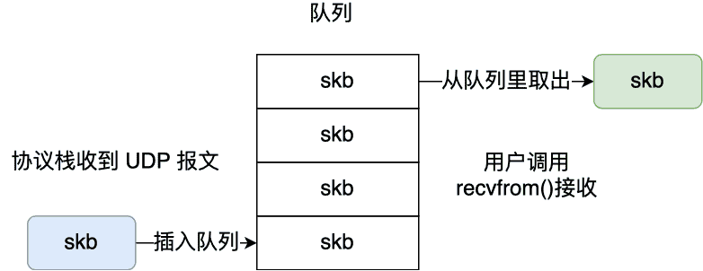
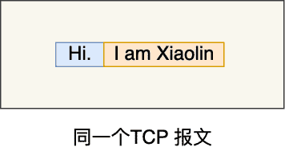
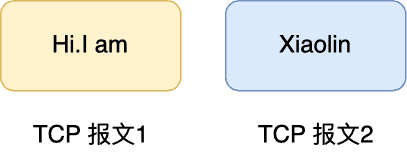
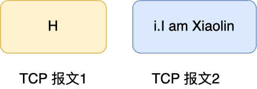
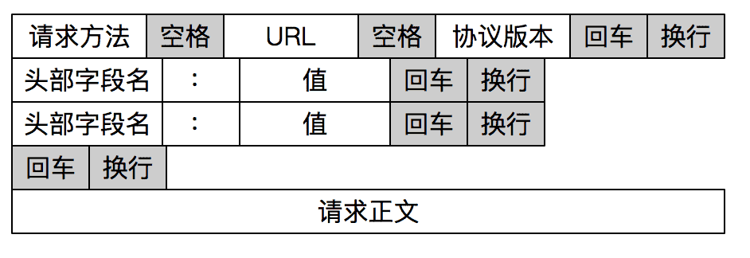

# 如何理解是 TCP 面向字节流协议？

TCP和UDP的区别：

-   TCP是面向字节流、可靠、面向连接；
-   UDP是面向数据报文段、不可靠、无连接；
-   可靠和不可靠：TCP通过一系列机制保证可靠性，而UDP是不可靠的

-   面向连接和无连接：TCP是面向连接的，通过连接管理机制，也就是三次握手和四次挥手实现。

> TCP 是面向字节流的协议，UDP 是面向报文的协议？这里的「面向字节流」和「面向报文」该如何理解。

## 如何理解字节流？

之所以会说 TCP 是面向字节流的协议，UDP 是面向报文的协议，是因为操作系统对 TCP 和 UDP 协议的**发送方的机制不同**，也就是问题原因在发送方。

### UDP是面向数据包的

> 先来说说为什么 UDP 是面向报文的协议？

当用户消息通过 UDP 协议传输时，**操作系统不会对消息进行拆分**，在组装好 UDP 头部后就交给网络层来处理，所以发出去的 UDP 报文中的数据部分就是完整的用户消息，也就是**每个 UDP 报文就是一个用户消息的边界**，这样接收方在接收到 UDP 报文后，读一个 UDP 报文就能读取到完整的用户消息。

你可能会问，如果收到了两个 UDP 报文，操作系统是怎么区分开的？

操作系统在收到 UDP 报文后，会将其插入到队列里，**队列里的每一个元素就是一个 UDP 报文**，这样当用户调用 recvfrom() 系统调用读数据的时候，就会从队列里取出一个数据，然后从内核里拷贝给用户缓冲区。



### TCP是面向字节流

> 再来说说为什么 TCP 是面向字节流的协议？

当用户消息通过 TCP 协议传输时，因为发送窗口，拥塞控制等的原因，**消息可能会被操作系统分组成多个的 TCP 报文**，也就是一个完整的用户消息被拆分成多个 TCP 报文进行传输。

这时，接收方的程序如果不知道发送方发送的消息的长度，也就是不知道消息的边界时，是无法读出一个有效的用户消息的，因为用户消息被拆分成多个 TCP 报文后，并不能像 UDP 那样，一个 UDP 报文就能代表一个完整的用户消息。

>   举个实际的例子来说明。
>

发送方准备发送「Hi.」和「I am Xiaolin」这两个消息。

在发送端，当我们调用 send 函数完成数据“发送”以后，数据并没有被真正从网络上发送出去，只是从应用程序拷贝到了操作系统内核协议栈中。

至于什么时候真正被发送，**取决于发送窗口、拥塞窗口以及当前发送缓冲区的大小等条件**。也就是说，我们不能认为每次 send 调用发送的数据，都会作为一个整体完整地消息被发送出去。

如果我们考虑实际网络传输过程中的各种影响，假设发送端陆续调用 send 函数先后发送「Hi.」和「I am Xiaolin」报文，那么实际的发送很有可能是这几种情况。

第一种情况，这两个消息被分到同一个 TCP 报文，像这样：



第二种情况，「I am Xiaolin」的部分随「Hi」在一个 TCP 报文中发送出去，像这样：



第三种情况，「Hi.」的一部分随 TCP 报文被发送出去，另一部分和「I am Xiaolin」一起随另一个 TCP 报文发送出去，像这样。



类似的情况还能举例很多种，这里主要是想说明，我们不知道「Hi.」和「I am Xiaolin」这两个用户消息是如何进行 TCP 分组传输的。

因此，**我们不能认为一个用户消息对应一个 TCP 报文，正因为这样，所以 TCP 是面向字节流的协议**。

当两个消息的某个部分内容被分到同一个 TCP 报文时，就是我们常说的 TCP 粘包问题，这时接收方不知道消息的边界的话，是无法读出有效的消息。

要解决这个问题，要交给**应用程序**。

## 如何解决粘包？

粘包的问题出现是因为不知道一个用户消息的边界在哪，如果知道了边界在哪，接收方就可以通过边界来划分出有效的用户消息。

一般有三种方式分包的方式：

- 固定长度的消息；
- 特殊字符作为边界；
- 自定义消息结构。

#### 固定长度的消息

这种是最简单方法，即每个用户消息都是固定长度的，比如规定一个消息的长度是 64 个字节，当接收方接满 64 个字节，就认为这个内容是一个完整且有效的消息。

但是这种方式灵活性不高，实际中很少用。

### 特殊字符作为边界

我们可以在两个用户消息之间插入一个特殊的字符串，这样接收方在接收数据时，读到了这个特殊字符，就把认为已经读完一个完整的消息。

HTTP 是一个非常好的例子。



HTTP 通过设置回车符、换行符作为 HTTP 报文协议的边界。

有一点要注意，这个作为边界点的特殊字符，如果刚好消息内容里有这个特殊字符，我们要对这个字符转义，避免被接收方当作消息的边界点而解析到无效的数据。

### 自定义消息结构

自定义消息结构，如TLV 格式，即 Type 类型、Length 长度、Value 数据，类型和长度已知的情况下，就可以方便获取消息大小，分配合适的 buffer，缺点是 buffer 需要提前分配，如果内容过大，则影响 server 吞吐量

* Http 1.1 是 TLV 格式
* Http 2.0 是 LTV 格式

我们可以自定义一个消息结构，由包头和数据组成，其中包头包是固定大小的，而且包头里有一个字段来说明紧随其后的数据有多大。

比如这个消息结构体，首先 4 个字节大小的变量来表示数据长度，真正的数据则在后面。

```c
struct {
	u_int32_t message_length;
    char message_data[];
} message;
```

当接收方接收到包头的大小（比如 4 个字节）后，就解析包头的内容，于是就可以知道数据的长度，然后接下来就继续读取数据，直到读满数据的长度，就可以组装成一个完整的用户消息来处理了。

## TCP如何保证可靠性

1. 校验和：TCP 保证首部和数据的检验和。这是一个端到端的检验和，目的是**检测数据在传输过程中的任何变化**。如果收到段的检验和有差错，TCP 将丢弃这个报文段和不确认收到此报文段。
2. 序列号：TCP 传输时将每个字节的数据都进行了编号，这就是序列号。序列号的作用不仅仅是**应答的作用**，有了序列号能够将接收到的**数据按序接收**，并且**去掉重复序列号的数据**。
3. 确认应答机制：TCP 传输的过程中，每次接收方收到数据后，都会对传输方进行确认应答，也就是发送 ACK 报文。这个 ACK 报文当中带有对应的确认序列号，告诉发送方，接收到了哪些数据，下一次的数据从哪里发。
4. 重传机制：简单理解就是发送方在发送完数据后等待一个时间，时间到达没有接收到 ACK 报文，那么对刚才发送的数据进行重新发送。
5. 连接管理：说白了就是三次握手四次挥手。
6. 流量控制：当接收方来不及处理发送方的数据，能提示发送方降低发送的速率，防止包丢失。通过滑动窗口实现
7. 拥塞控制：拥塞控制是 TCP 在传输时尽可能快的将数据传输，并且避免拥塞造成的一系列问题。是可靠性的保证，同时也是维护了传输的高效性。
