# IP协议解析

## 简介

IP协议位于 TCP/IP 模型的网络层，是整个 TCP/IP 协议族的核心，也是构成互联网的基础。

IP协议用于屏蔽下层物理网络的差异，为上层提供统一的IP数据报。

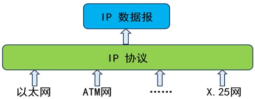

IP协议提供了无连接的、不可靠的、尽力的数据报投递服务：

（1）无连接的投递服务

发送端可于任何时候自由发送数据，而接收端永远不知道自己会在何时从哪里接收到数据。每个IP数据报独立处理和传输，一台主机发出的数据报序列，可能会走不同的路径，甚至有可能其中一部分数据报会在传输过程中丢失。

（2）不可靠的投递服务

IP协议本身不保证IP数据报投递的结果。在传输过程中，IP数据报可能会丢失、重复、延迟和乱序等，IP协议不对内容作任何检测，也不将这些结果通知收发双方。IP数据报的丢失将通过路由器发ICMP报文告知。要想保证数据可靠，需要上层应用处理，例如TCP协议利用IP协议传输数据，但是丢包、超时等情况还是要靠 TCP 自己解决。

（3）尽力的投递服务

每个数据链路上会规定一个最大传输单元MTU，如果IP数据报的长度超过MTU，那么网络层就会把这些报文分割成一个一个的小组（分组）进行传送，以适应具体的传输网络。

## IP地址

IP协议中一个非常重要的内容就是给互联网上每台计算机或其它设备都规定了一个唯一地址，叫做“IP地址”。这种唯一地址保证了用户在连网的计算机上操作时，能够高效而且方便地从千千万万台计算机中选出自己所需的对象来。

IP地址就像是我们的家庭住址，如果你要写信给一个人，就要知道对方的地址，这样邮递员才能把信送到。计算机发送信息就好比是邮递员，它必须知道唯一的“家庭地址”才能不至于把信送错人家。只不过寄信地址是用文字来表示，计算机地址是用二进制数字表示。

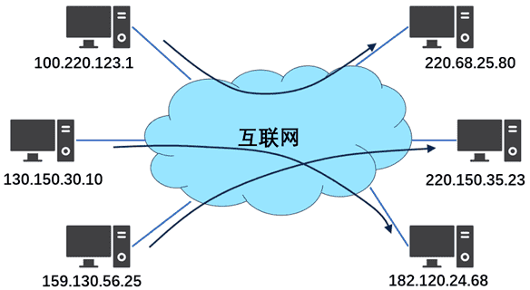

### IPv4地址

IPv4是Internet Protocol version 4的缩写，即IP协议版本4，又称互联网通信协议第四版，是IP协议开发过程中的第四个修订版本，也是此协议第一个被广泛部署的版本。

按照协议规定，IP 地址用二进制来表示，每个 IPv4 地址长 32 位，也就是4个字节，因此，IPv4地址的数量是2^32 = 4294967296，也就是说：最多可以给大约 43 亿台接入互联网的设备配置其独一无二的IPv4地址。

一个采用二进制形式的IP地址是一串很长的数字，难以处理。为了方便使用，IP地址习惯性地被写成十进制形式，使用 “.” 分开不同的字节。这种表示法叫做点分十进制表示法，这显然比一连串二进制 1 和 0 容易记忆得多，如下图所示。

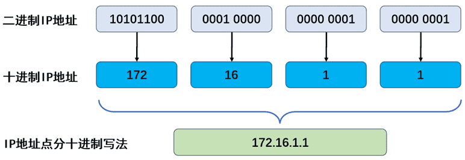

为了便于寻址以及层次化构造网络，每个IP地址包括两个标识码（ID），即网络ID和主机ID。同一个物理网络上的所有主机都使用同一个网络ID，网络上的一个主机（包括网络上工作站，服务器等）有一个主机ID与其对应。Internet委员会定义了5种IP地址类型以适合不同容量的网络，即A类~E类。

其中A、B、C这3类地址由国际互联网络信息中心（InternetNIC）在全球范围内统一分配，D类是广播地址，E类是保留地址（未启用）。

-  A、B、C 类地址分为网络地址和主机地址，网络地址表示一个网络，主机地址分给具体的主机；
-  主机地址全为 0 和全为 1 的IP 有特殊用途，主机地址全为 0，表示网络号，代表这个网络本身；主机地址全为1，表示广播地址，代表这个网络中的所有主机；
-  每个类别中（除了 D、E类），都有一些地址有特殊的用户，留作私有地址或者回环地址，例如192.168.*.*、127.0.0.1；
-  子网掩码全为1的位数就是网络地址的位数。

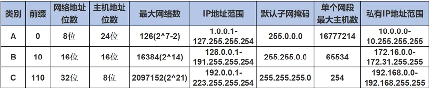

（1） `A`类地址

A类地址是指在IP地址的四段号码中，第一段号码为网络号码，剩下的三段号码为本地计算机的号码。如果用二进制表示IP地址，A类地址就由1字节网络地址和3字节主机地址组成，即网络标识长度为8位，主机标识的长度为24位。

A类地址中第一位固定为“0”，有从0~127共128个网络，每个网络可容纳2^7-2 = 16,777,214台主机。但其中网络地址全0和全1的为特殊地址，不能使用，所以 A 类地址可用的网络数是 126个，可用IP 地址从 [1.0.0.0]~[126.255.255.255]。

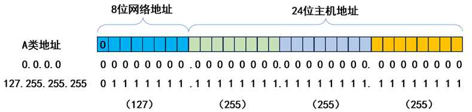

一些特殊网址如下：

-  127.0.0.1是本地地址（localhost）或称为“回环地址”（Loopback Address），可以理解为一个虚拟网卡，这个网卡只接收来自本机的数据包，一般用于测试使用，例如：ping 127.0.0.1 来测试本机TCP/IP是否正常。
-  网络地址 10 开头用作内网地址，从 10.0.0.0~10.255.255.255。很多公司内网 IP 都是10网段。
-  每一个网络，主机地址全 0 和全 1 的都是保留地址，所以每一个网络的主机数都是2^n-2，n是主机地址的位数。

（2） `B`类地址

B类地址是指在IP地址的四段号码中，前两段号码为网络号码。如果用二进制表示IP地址，B类地址就由2字节网络地址和2字节主机地址组成。B类地址中前两位固定为“10”，网络标识长度为16位，主机标识长度为16位，子网掩码为255.255.0.0，有2^14=16384个网络，每个网络所能容纳的计算机数为2^16-2=65534台主机。B类网络地址适用于中等规模的网络，地址全 0 和 全 1 的都是保留地址，地址范围[128.0.0.1]-[191.255.255.254]。

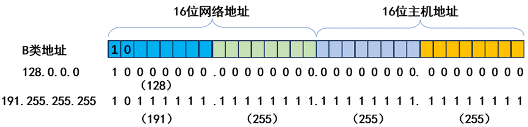

一些特殊网址如下：

-  172.16.0.0~172.31.255.255是私有地址。
-  169.254.0.0~169.254.255.255是保留地址。

（3） `C`类地址

C类地址是指在IP地址的四段号码中，前三段号码为网络号码，剩下一段号码为本地计算机号码。如果用二进制表示IP地址，C类地址就由3字节网络地址和1字节主机地址组成，网络地址中前三位固定为“110”。C类地址中网络标识长度为24位，主机标识长度为8位，C类网络地址数量较多，有2^21=2097152个网络。每个网络最多只能包含2^8-2=254台计算机，适用于小规模局域网络。C类地址全 0 和全 1 的都是保留地址，范围`192.0.0.1-223.255.255.254`。C类特殊地址是192.168.0.0～192.168.255.255，留作私有地址使用。

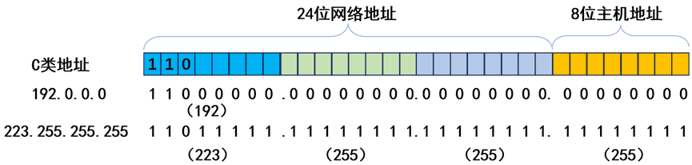

（4） D类地址

D类地址被称作多播地址或组播地址(Multicast Address)。在以太网中，D类地址命名了一组应该在这个网络中应用接收到一个分组的站点。D类地址最高位必须是“1110”，范围从224.0.0.0到239.255.255.255。

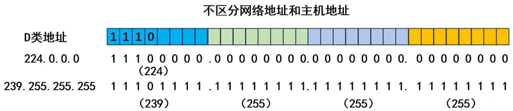

（5） E类地址

E类地址以“1111”开始，保留地址，还未启用。

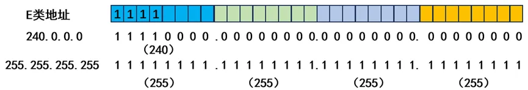

### IPv6地址

IPv6是Internet Protocol version 6（互联网通信协议第六版）的缩写，是互联网工程任务组（Internet Engineering Task Force, IETF）设计的用于替代IPv4的下一代IP协议。由于IPv4最大的问题在于网络地址资源不足，严重制约了互联网的应用和发展。IPv6的使用，不仅能解决网络地址资源数量的问题，也解决了多种设备连入互联网的障碍。

IPv6地址由128位构成，是IPv4地址长度的4倍，采用冒号十六进制表示法, 其所包含的 IP个数为2^128。IPv6地址的分配通常以地址前缀为单位进行，其中前缀表示地址的网络部分。主机将接口标识符与网络前缀组合，形成完整的IPv6地址。例如，在前缀2001:0db8:85a3::/64和接口标识符0123:4567:89ab:cdef的情况下，生成的IPv6地址为2001:0db8:85a3:0123:4567:89ab:cdef:0000。

IPv6有3种表示方法。

>  （1）冒分十六进制表示法

格式为X:X:X:X:X:X:X:X，其中每个X表示地址中的16位字段，由4个十六进制数构成，例如：

ABCD:EF01:2345:6789:ABCD:EF01:2345:6789

这种表示法中，每个X的前导0是可以省略的，例如：

2001:0DB8:0000:0023:0008:0800:200C:417A→ 2001:DB8:0:23:8:800:200C:417A

>  （2）0位压缩表示法

在某些情况下，一个IPv6地址中间可能包含很长的一段0，可以把连续的一段0压缩为“::”。但为保证地址解析的唯一性，地址中”::”只能出现一次，例如：

FF01:0:0:0:0:0:0:1101 → FF01::1101

0:0:0:0:0:0:0:1 → ::1

0:0:0:0:0:0:0:0 → ::

>  （3）内嵌IPv4地址表示法

为了实现IPv4-IPv6互通，IPv4地址会嵌入IPv6地址中，此时地址常表示为：X:X:X:X:X:X:d.d.d.d，前96位采用冒分十六进制表示，而最后32位地址则使用IPv4的点分十进制表示，例如::192.168.0.1与::FFFF:192.168.0.1就是两个典型的例子，注意在前96位中，压缩0位的方法依旧适用。

IPv6定义了一些保留地址和特殊用途地址，用于特定的目的，如环回地址（::1）、链路本地地址（fe80::/10）、多播地址范围（ff00::/8）等。这些地址有特殊的用途，不用于常规的主机和网络分配。

## IP数据报格式

在IP协议中，数据被分割为一系列的IP数据报（IP Datagram，IP数据报、IP包或IP分组），每个数据报都有一个报头（Header）部分（即首部）和一个有效数据（Payload）部分。其中，数据是上层需要传输的数据，报头是为了正确传输上层数据而增加的控制信息，包含了必要的字段和信息来完成IP数据报的传输和路由。

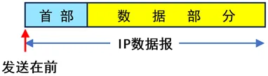

### IPv4数据报

IPv4报头的前一部分长度固定，共20字节，是所有IP数据报必须具有。在报头固定部分的后面是可选字段，长度可变。数据报结构如下图所示。

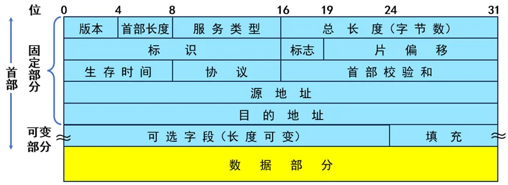

-  版本号（Version）：长度为4位。指定IP协议的版本（IPv4/IPv6），对于IPv4来说，该值为4。
-  首部长度（IP Header Length，IHL）：长度为4位。表示 IP 报头的长度，单位是 4字节(32bit)。IP 头部的长度也就是 length * 4 的字节数. 当没有可选项时，length 是 5，也就是20字节。
-  服务类型（Type Of Service，TOS）：长度为8位，包括3位优先权字段（已经弃用），4位TOS字段，和1位保留字段（必须置为0）。4位TOS分别表示：最小延时，最大吞吐量，最高可靠性，最小成本。这四者相互冲突，只能选择一个。比如对于SSH/Telnet这样的应用程序，最小延时比较重要，而对于FTP这样的程序，最大吞吐量比较重要。
-  总长度（Total Length）：长度为16位。IP报文（IP报头+有效载荷）的总长度，最大长度是 65535 字节，用于将各个IP报文进行分离。
-  标识（Identification）：长度为16位。唯一的标识主机发送的报文，如果数据在IP层进行了分片，那么每一个分片对应的id都是相同的。
-  标志（Flags）：长度为3位。第一位保留，现在必须是0，没有规定该字段的意义。第二位指示包是否进行分片，如果位0表示可以分片；如果为1表示不能分片（Don't Fragment），在不能分片的情况下，如果报文长度超过网络的最大传输单位MTU，IP模块就会丢弃该报文。第三位表示“更多分片”（More Fragments），如果报文没有进行分片，则该字段设置为0；如果报文进行了分片，则除了最后一个分片报文设置为0以外，其余分片报文均设置为1。
-  片偏移（Fragment Offset）：长度为13位。当一个IP数据报的大小超过网络的最大传输单位（MTU），需要进行分片以适应网络传输。每个分片都是一个独立的IP数据报，具有自己的报头和有效数据。片偏移字段指示了每个分片在原始IP数据报中的位置，以字节为单位。它指示了该分片的有效数据相对于原始IP数据报的起始位置的偏移量。偏移量为0表示该分片是原始IP数据报的第一个分片，后续分片的偏移量根据分片的顺序递增。具体来说，片偏移字段占13个比特，可以表示0到8191（2^13 - 1）之间的值。这个值是以8个字节为单位的偏移量。也就是说，偏移量乘以8就是以字节为单位的实际偏移量。在进行IP数据报重组时，接收方使用片偏移字段来确定每个分片在原始IP数据报中的位置，并将它们按照正确的顺序进行重组，以还原原始IP数据报。片偏移字段与标志位字段（Flags）和标识符字段（Identification）一起使用，用于识别和重组分片。
-  生存时间（Time To Live，TTL）：长度为8位。数据报到达目的地的最大报文跳数，一般是64，每经过一个路由，TTL -= 1，一直减到0还没到达，数据报就被丢弃，这个字段主要是用来防止数据报在网络中无限循环。
-  协议（Protocol）：长度为8位。指示IP数据报中封装的上层协议，如TCP、UDP或ICMP。
-  首部检验和（Header Checksum）：长度为16位。使用CRC进行校验，来鉴别数据报是否损坏。该字段只会校验数据报的首部，不会去校验数据部分。这个字段主要目的是用来确保 IP 数据报不被破坏。
-  源IP地址（Source Address）和目的IP地址（Destination Address）：长度各为32位。表示发送端和接收端所对应的IP地址。
-  选项字段（Option）：用于实现某些特定的功能或提供额外的信息。选项字段是一个变长字段，最多40字节，可以包含多个选项。
-  填充字段（Padding）：用于对报头进行填充，以使报头长度能够被32位的倍数整除。
-  数据（Payload）：用来存入实际要传输的数据，同时将 IP 上层协议的首部也作为数据进行处理。

### IPv6 数据报

IPv6报文由IPv6基本报头、IPv6扩展报头以及上层协议数据单元三部分组成。上层协议数据单元一般由上层协议报头和它的有效载荷构成，有效载荷可以是一个ICMPv6报文、一个TCP报文或一个UDP报文。IPv6 相比 IPv4 已经发生了巨大变化。IPv6 中为了减轻路由器的负担，省略了首部校验和字段。提高了包转发的效率。

IPv6数据报结构如下图所示。

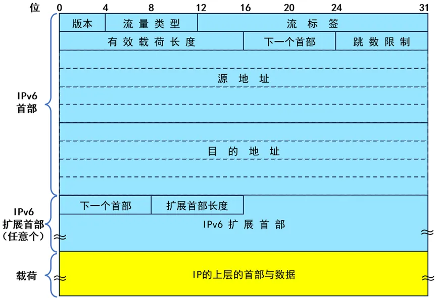

-  版本号（Version）：长度为4位。指定IP协议的版本（IPv4/IPv6），对于IPv6来说，该值为6。
-  流量类型（Traffic Class）：长度为8位。等同于IPv4中的TOS字段，表示IPv6数据报的类或优先级，主要应用于QoS。
-  流标签（Flow Label）：长度为20位。IPv6中的新增字段，用于区分实时流量，不同的流标签+源地址可以唯一确定一条数据流，中间网络设备可以根据这些信息更加高效率的区分数据流。
-  有效载荷长度（Payload Length）：长度为16位。有效载荷是指紧跟IPv6报头的数据报的其它部分（即扩展报头和上层协议数据单元）。该字段只能表示最大长度为65535字节的有效载荷。如果有效载荷的长度超过这个值，该字段会置0，而有效载荷的长度用逐跳选项扩展报头中的超大有效载荷选项来表示。
-  下一个报头（Next Header）：长度为8位。该字段定义紧跟在IPv6报头后面的第一个扩展报头（如果存在）的类型，或者上层协议数据单元中的协议类型，相当于 IPv4 的协议字段，通常表示 IP 的上一层协议是 TCP 或 UDP。
-  跳数限制（Hop Limit）：长度为8位。该字段类似于IPv4中的Time to Live字段，它定义了IP数据报所能经过的最大跳数。每经过一个设备，该数值减去1，当该字段的值为0时，数据报将被丢弃。
-  源地址（Source Address）：长度为128位。表示发送端的地址。
-  目的地址（Destination Address）：长度为128位。表示接收端的地址。
-  扩展首部（Extensions）：IPv6的首部长度是固定的，共40字节。IPv4中的可选项就没地方放了，而 IPv6 增加了扩展首部的概念，通过扩展首部来实现IPv4中的可选项。在IPv4中可选项长度固定为40字节，但是在IPv6中没有这样的限制。也就是说，IPv6的扩展首部可以是任意长度。扩展首部当中还可以包含扩展首部协议以及下一个扩展首部字段。
-  数据（Payload）：用来存入实际要传输的数据，同时将 IP 上层协议的首部也作为数据进行处理，例如UDP头、TCP头。

IPv6和IPv4相比，去除了IHL、Identifiers、Flags、Fragment Offset、Header Checksum、Options、Padding域，只增了流标签域，因此IPv6报文头的处理较IPv4大大简化，提高了处理效率。另外，IPv6为了更好支持各种选项处理，提出了扩展头的概念，新增选项时不必修改现有结构就能做到，理论上可以无限扩展，体现了优异的灵活性。

## 数据转发和路由

IP协议有一个特别重要的特质就是路由选择，决定一个IP数据报从哪条路走，最终能不能成功的到达目的端。

IP协议通过以下步骤实现数据在网络中的转发和路由：

（1）数据包封装：当源主机要发送数据时，IP协议将数据分割为适当大小的数据包（即IP分组或数据报）。

（2）目的地址解析：源主机根据目标主机的IP地址确定数据包的目的地。如果目标主机在同一子网内，源主机可以直接将数据包发送到目标主机。否则，它将数据包发送到默认网关（通常是本地路由器）。

（3）路由选择：路由器（包括可转发数据的主机）中维护着一张路由表，主要存放网络、主机与下一跳的对应关系。默认网关（路由器）接收到数据包后，它会检查数据包的目的IP地址，并查找自己的路由表。路由器根据路由表中的条目选择下一跳路径。选择下一跳路径的依据可能包括最长前缀匹配、最短路径、策略路由等。

（4）数据包转发：路由器根据路由表中的下一跳信息，将数据包转发到适当的出口接口。该接口连接到下一个路由器或目标子网。

（5）路由器间的转发：数据包经过一系列的路由器转发，每个路由器根据自己的路由表将数据包转发到下一个路由器，直到到达目标主机所在的网络。

（6）到达目的主机：当数据包到达目的网络后，目标主机的默认网关或目标主机本身将根据目的IP地址将数据包交付给目标主机上的相应协议栈（如TCP或UDP）进行处理。

通过上述步骤，IP协议实现了数据在网络中的转发和路由。每个路由器根据自己的路由表和路由选择算法，将数据包转发到最终的目标主机。这样，数据包能够通过多个网络节点的转发，跨越不同的子网和网络，最终到达目的地。
