# CPU 缓存一致性

## CPU的缓存

>   对于每个CPU的cache：
>
>   -   cache中包含了很多的cache line，每个cache line中有state、tag、data等，tag一般是数据的地址，data中是对应的值；
>   -   每个cache有个专门的硬件叫cache controller，cache控制器同时和CPU以及总线打交道。
>
>   关于缓存控制器(cache controller)，它是一个硬件，在CPU和共享总线之间协作：
>
>   -   将主存中的code指令或者数据读到cache中；
>   -   处理CPU的load和store指令，发送和处理总线消息（缓存命中、不命中）。
>
>   缓存控制器是负责管理缓存的硬件块，以一种对程序不可见的方式。它自动将代码或数据从主存写入缓存。它接受来自核心的读写内存请求，并对缓存或外部内存执行必要的操作。
>
>   当它接收到来自核心的请求时，它必须检查请求的地址是否在缓存中找到。这就是所谓的“缓存查找”。它通过比较请求的地址位子集与与缓存中的行相关联的标记值来实现这一点。如果存在匹配（称为命中），并且该行被标记为有效，则使用缓存内存进行读或写操作。
>
>   当核心请求来自特定地址的指令或数据，但与缓存标签不匹配，或者标签无效时，缓存失败，请求必须传递到内存层次结构的下一层，L2缓存或外部内存。它还可能导致缓存线填充。缓存线路填充导致将一块主内存的内容复制到缓存中。同时，请求的数据或指令被流式传输到核心。这个过程是透明的，软件开发人员并不直接看到它。内核在使用数据之前不需要等待line填充完成。缓存控制器通常首先访问缓存行的“关键字”。例如，如果您执行的加载指令在缓存中丢失，并触发缓存线路填充，则核心首先检索缓存线路中包含所请求数据的那部分。这些关键数据被提供给核心管道，而缓存硬件和外部总线接口则在后台读取缓存线路的其余部分。

随着时间的推移，CPU 和内存的访问性能相差越来越大，于是就在 CPU 内部嵌入了 CPU Cache（高速缓存），CPU Cache 离 CPU 核心相当近，因此它的访问速度是很快的，于是它充当了 CPU 与内存之间的缓存角色。

CPU Cache 通常分为三级缓存：L1 Cache、L2 Cache、L3 Cache，级别越低的离 CPU 核心越近，访问速度也快，但是存储容量相对就会越小。其中，在多核心的 CPU 里，每个核心都有各自的 L1/L2 Cache，而 L3 Cache 是所有核心共享使用的。

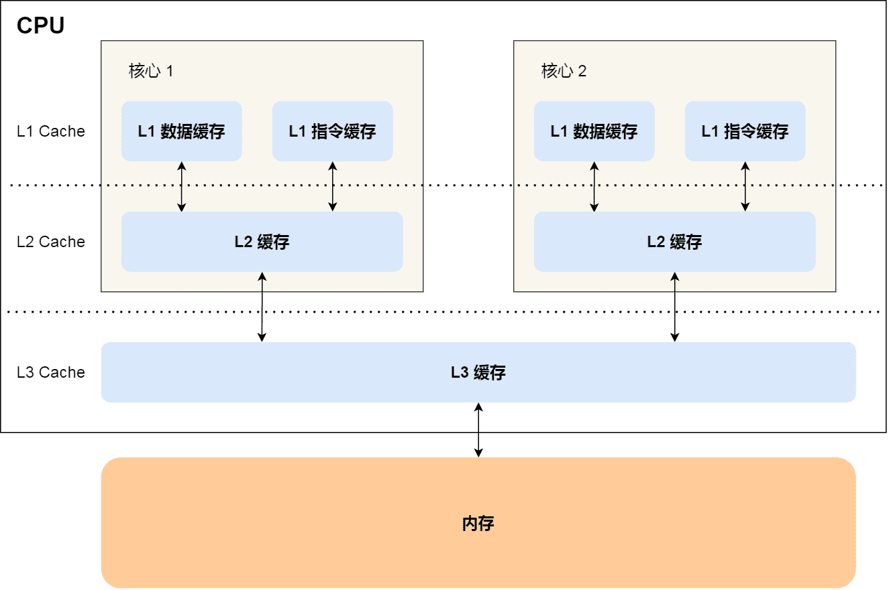

我们先简单了解下 CPU Cache 的结构，CPU Cache 是由很多个 Cache Line 组成的，CPU Line 是 CPU 从内存读取数据的基本单位，而 CPU Line 是由各种标志（Tag）+ 数据块（Data Block）组成，你可以在下图清晰的看到：

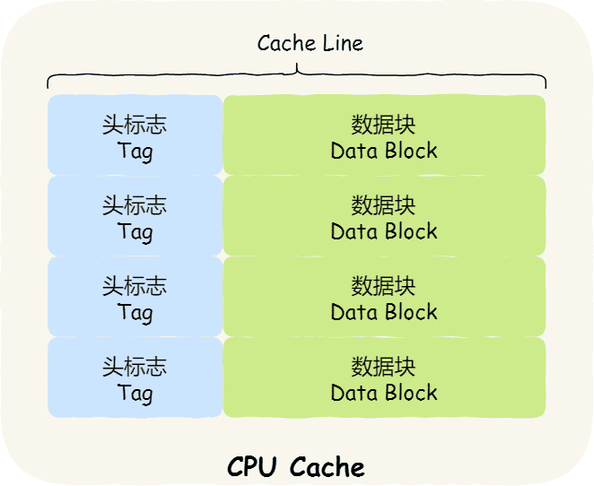

## CPU Cache 的数据写入

带有高速缓存的CPU执行计算的流程：

1.  程序以及数据被加载到主内存；

2.  指令和数据被加载到CPU的高速缓存；

3.  CPU执行指令，把结果写到高速缓存；

4.  高速缓存中的数据写回主内存。

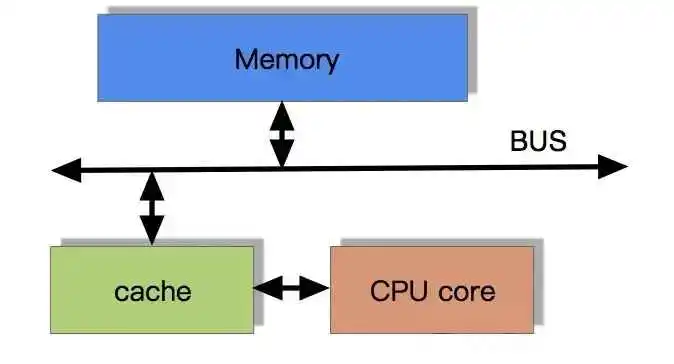

我们当然期望 CPU 读取数据的时候，都是尽可能地从 CPU Cache 中读取，而不是每一次都要从内存中获取数据。所以，身为程序员，我们要尽可能写出缓存命中率高的代码，这样就有效提高程序的性能。

数据不光是只有读操作，还有写操作，那么如果数据写入 Cache 之后，内存与 Cache 相对应的数据将会不同，这种情况下 Cache 和内存数据都不一致了，于是我们肯定是要把 Cache 中的数据同步到内存里的。

问题来了，那在什么时机才把 Cache 中的数据写回到内存呢？为了应对这个问题，下面介绍两种针对写入数据的方法：

- 写直达（`Write Through`）：直写法，CPU在写cache的同时也会立即去写主存；
- 写回（`Write Back`）：只写cache，在延后的**合适的时间**再去写主存。

Write through每次都要把数据更新到主存中，在有些场景下是不需要的(例如单线程程序或者多线程的私有数据)，影响效率。

### 写直达

保持内存与 Cache 一致性最简单的方式是，**把数据同时写入内存和 Cache 中**，这种方法称为**写直达（*Write Through*）**。

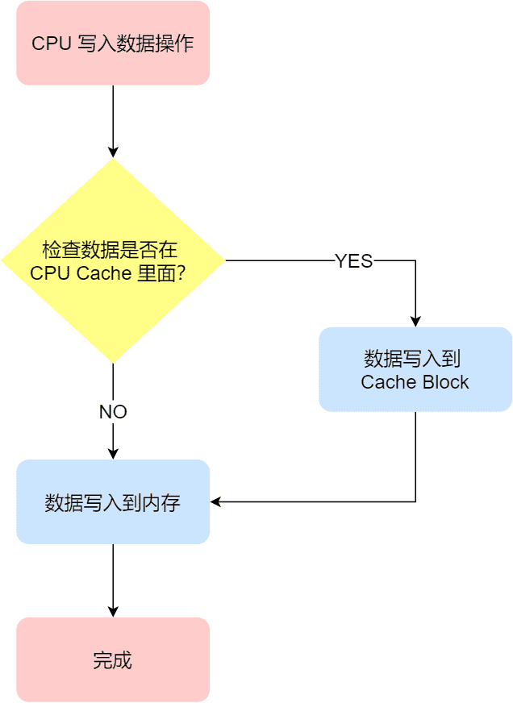

在这个方法里，写入前会先判断数据是否已经在 CPU Cache 里面了：

- 如果数据已经在 Cache 里面，先将数据更新到 Cache 里面，再写入到内存里面；
- 如果数据没有在 Cache 里面，就直接把数据更新到内存里面。

写直达法很直观，也很简单，但是问题明显，无论数据在不在 Cache 里面，每次写操作都会写回到内存，这样写操作将会花费大量的时间，无疑性能会受到很大的影响。

### 写回

既然写直达由于每次写操作都会把数据写回到内存，而导致影响性能，于是为了要减少数据写回内存的频率，就出现了**写回（Write Back）的方法**。

在写回机制中，当发生写操作时，新的数据仅仅被写入 Cache Block 里，只有当修改过的 Cache Block「被替换」时才需要写到内存中，减少了数据写回内存的频率，这样便可以提高系统的性能。

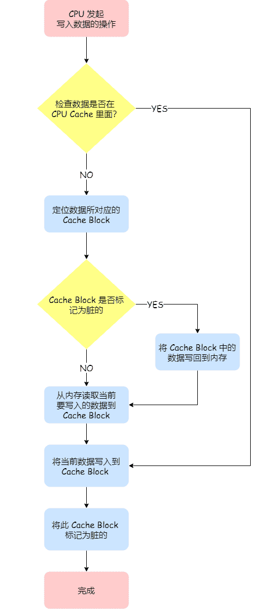

那具体如何做到的呢：

- 如果当发生写操作时，数据已经在 CPU Cache 里的话，则把数据更新到 CPU Cache 里，同时标记 CPU Cache 里的这个 Cache Block 为脏（Dirty）的，这个脏的标记代表这个时候，我们 CPU Cache 里面的这个 Cache Block 的数据和内存是不一致的，这种情况是不用把数据写到内存里的；
- 如果当发生写操作时，数据所对应的 Cache Block 里存放的是「别的内存地址的数据」的话，就要检查这个 Cache Block 里的数据有没有被标记为脏的：
  - 如果是脏的话，我们就要把这个 Cache Block 里的数据写回到内存，然后再把当前要写入的数据，先从内存读入到 Cache Block 里（注意，这一步不是没用的，具体为什么要这一步，可以看这个「[回答](https://stackoverflow.com/questions/26672661/for-write-back-cache-policy-why-data-should-first-be-read-from-memory-before-w)」），然后再把当前要写入的数据写入到  Cache Block，最后也把它标记为脏的；
  - 如果不是脏的话，把当前要写入的数据先从内存读入到 Cache Block 里，接着将数据写入到这个 Cache Block 里，然后再把这个 Cache Block 标记为脏的。

可以发现写回这个方法，在把数据写入到 Cache 的时候，只有在缓存不命中，同时数据对应的 Cache 中的 Cache Block 为脏标记的情况下，才会将数据写到内存中，而在缓存命中的情况下，则在写入后 Cache 后，只需把该数据对应的 Cache Block 标记为脏即可，而不用写到内存里。

这样的好处是，如果我们大量的操作都能够命中缓存，那么大部分时间里 CPU 都不需要读写内存，自然性能相比写直达会高很多。

为什么缓存没命中时，还要定位 Cache Block？这是因为此时是要判断数据即将写入到 cache block 里的位置，是否被「其他数据」占用了此位置，如果这个「其他数据」是脏数据，那么就要帮忙把它写回到内存。

CPU 缓存与内存使用「写回」机制的流程图如下，左半部分就是读操作的流程，右半部分就是写操作的流程，也就是我们上面讲的内容。

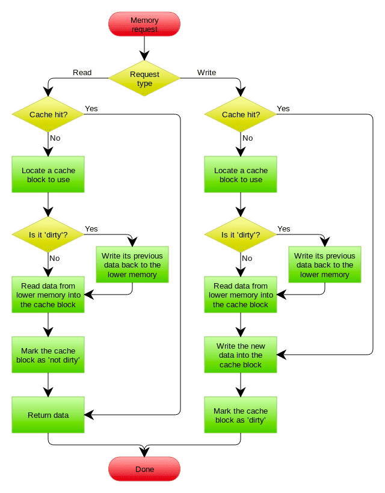

### 对比

对主存进行**透写**的好处是它**简化了计算机系统的设计**。使用透写，主内存总是有该行的最新副本。因此，当读取完成时，主存总是可以用请求的数据进行响应。

如果使用**回写**，有时最新的数据在处理器缓存中，有时在主内存中。如果数据在处理器缓存中，那么该处理器必须阻止主存响应读请求，因为主存可能有数据的过期副本。这比write-through更复杂。

此外，透写可以简化缓存一致性协议，因为它不需要`Modify`状态。`Modify`状态记录缓存必须在使缓存行无效或退出该行之前写回缓存行。在write-through中，缓存行总是可以在不回写的情况下失效，因为内存中已经有该行的最新副本。

还有一件事——在回写体系结构上，向内存映射的I/O寄存器写操作的软件必须采取额外的步骤，以确保写操作立即从缓存中发送出去。否则，写入操作在内核外是不可见的，直到该行被另一个处理器读取或该行被驱逐。

总而言之，Write through效率低，但是系统设计起来会更简单一些。而Write back是为了提升CPU的效率而做的一些优化，使得系统会更复杂。

从上面我们可以看出，在多核CPU上的多线程编程，在牵扯到多线程之间有共享变量时，这个变量的最新值可能在主存中，可能在某个CPU的cache中，此时缓存的“一致性”就变的非常重要，因为如果不一致，我们可能就读取了错误的值。

要达到缓存一致性的目的，学术上有2个必须的要求：

1.  Write Propagation，写传播，某个CPU核心里的cache数据更新时，必须要传播到其他核心的cache；
2.  Transaction Serialization，事务串行化，对单个内存位置的读/写必须被所有处理器以相同的顺序看到，对一个内存地址的读/写，对所有的CPU，其执行顺序是一致的。假如有个4核的CPU，在每个核心的cache上都缓存了i，当CPU0和CPU1同时对自己缓存中的i执行写操作时(store，这个“同时”指的是同一个时间点，这对多核CPU理论上是存在可能的，CPU0写入i=1，CPU1写入i=2)，对CPU2和CPU3缓存中的i的值应该如何去更新，是1-2还是2-1？Transaction Serialization就是对这点做了约束，必须保证这种情况下，缓存的一致性。不同的缓存一致性协议，例如MESI等，通过自己的协议机制，规定了如何将事务串行化，此时，我理解，就不存在真正并行的对变量i的写操作。

目前有2种主流的处理缓存一致性的机制：

1、Snooping，基于总线嗅探，其核心是cache控制器随时关注自己和其他CPU对自己缓存中的数据的操作，然后做出对应的反应。

>   snooping是在1983年首次引入的，它是一个过程，在这个过程中，各个缓存监视地址行，以便访问它们所缓存的内存位置。write-invalidate协议和write-update协议利用了这种机制。

2、Directory-based，基于目录

>   在基于目录Directory-based的系统中，被共享的数据放在一个公共目录中，以保持缓存之间的一致性。该目录充当过滤器，处理器必须通过它请求许可才能将条目从主内存加载到其缓存中。当一个条目被更改时，目录要么更新该条目的其他缓存，要么使该条目无效。

## 缓存一致性问题

现在 CPU 都是多核的，由于 L1/L2 Cache 是多个核心各自独有的，那么会带来多核心的**缓存一致性（*Cache Coherence*）** 的问题，如果不能保证缓存一致性的问题，就可能造成结果错误。

那缓存一致性的问题具体是怎么发生的呢？我们以一个含有两个核心的 CPU  作为例子看一看。

假设 A 号核心和 B 号核心同时运行两个线程，都操作共同的变量 i（初始值为 0）。

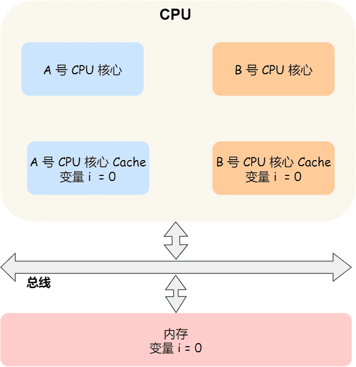

这时如果 A 号核心执行了 `i++` 语句的时候，为了考虑性能，使用了我们前面所说的写回策略，先把值为 `1` 的执行结果写入到 L1/L2 Cache 中，然后把 L1/L2 Cache 中对应的 Block 标记为脏的，这个时候数据其实没有被同步到内存中的，因为写回策略，只有在 A 号核心中的这个 Cache Block 要被替换的时候，数据才会写入到内存里。

如果这时旁边的 B 号核心尝试从内存读取 i 变量的值，则读到的将会是错误的值，因为刚才 A 号核心更新 i 值还没写入到内存中，内存中的值还依然是 0。**这个就是所谓的缓存一致性问题，A 号核心和 B 号核心的缓存，在这个时候是不一致，从而会导致执行结果的错误。**

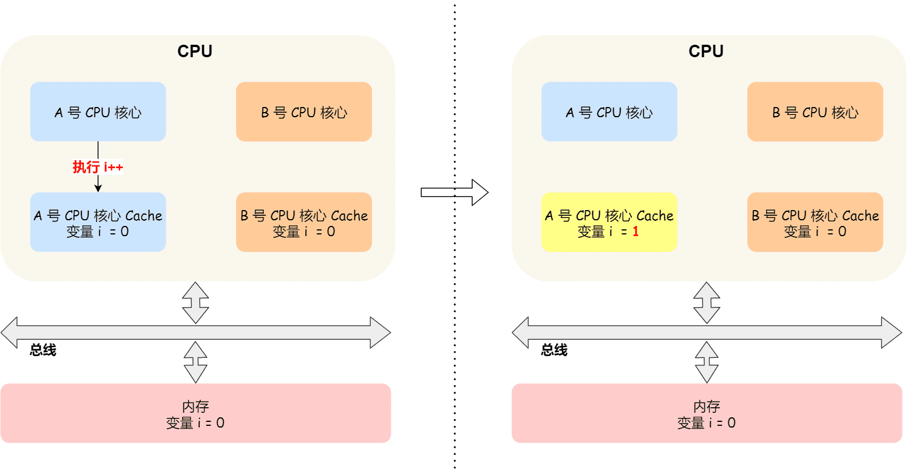

那么，要解决这一问题，就需要一种机制，来同步两个不同核心里面的缓存数据。要实现的这个机制的话，要保证做到下面这 2 点：

- 第一点，某个 CPU 核心里的 Cache 数据更新时，必须要传播到其他核心的 Cache，这个称为**写传播（*Write Propagation*）**；
- 第二点，某个 CPU 核心里对数据的操作顺序，必须在其他核心看起来顺序是一样的，这个称为**事务的串行化（*Transaction Serialization*）**。

第一点写传播很容易就理解，当某个核心在 Cache 更新了数据，就需要同步到其他核心的 Cache 里。而对于第二点事务的串行化，我们举个例子来理解它。

假设我们有一个含有 4 个核心的 CPU，这 4 个核心都操作共同的变量 i（初始值为 0）。A 号核心先把 i 值变为 100，而此时同一时间，B 号核心先把 i 值变为 200，这里两个修改，都会「传播」到 C 和 D 号核心。

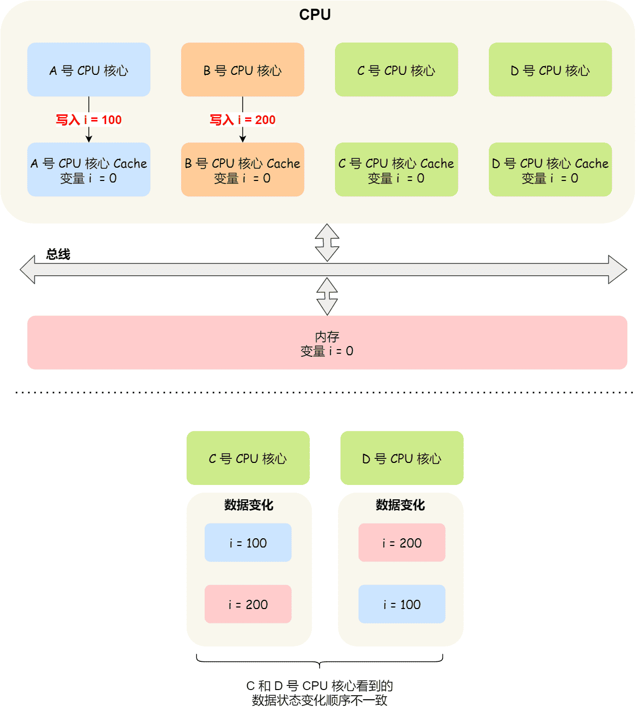

那么问题就来了，C 号核心先收到了 A 号核心更新数据的事件，再收到 B 号核心更新数据的事件，因此 C 号核心看到的变量 i 是先变成 100，后变成 200。

而如果 D 号核心收到的事件是反过来的，则 D 号核心看到的是变量 i 先变成 200，再变成 100，虽然是做到了写传播，但是各个 Cache 里面的数据还是不一致的。

所以，我们要保证 C 号核心和 D 号核心都能看到**相同顺序的数据变化**，比如变量 i 都是先变成 100，再变成 200，这样的过程就是事务的串行化。

要实现事务串行化，要做到 2 点：

- CPU 核心对于 Cache 中数据的操作，需要同步给其他 CPU 核心；
- 要引入「锁」的概念，如果两个 CPU 核心里有相同数据的 Cache，那么对于这个 Cache 数据的更新，只有拿到了「锁」，才能进行对应的数据更新。

那接下来我们看看，写传播和事务串行化具体是用什么技术实现的。

## 总线嗅探

写传播的原则就是当某个 CPU 核心更新了 Cache 中的数据，要把该事件广播通知到其他核心。最常见实现的方式是**总线嗅探（*Bus Snooping*）**。

还是以前面的 i 变量例子来说明总线嗅探的工作机制，当 A 号 CPU 核心修改了 L1 Cache 中 i 变量的值，通过总线把这个事件广播通知给其他所有的核心，然后每个 CPU 核心都会监听总线上的广播事件，并检查是否有相同的数据在自己的 L1 Cache 里面，如果 B 号 CPU 核心的 L1 Cache 中有该数据，那么也需要把该数据更新到自己的 L1 Cache。

可以发现，总线嗅探方法很简单，CPU 需要每时每刻监听总线上的一切活动，但是不管别的核心的 Cache 是否缓存相同的数据，都需要发出一个广播事件，这无疑会加重总线的负载。

另外，总线嗅探只是保证了某个 CPU 核心的 Cache 更新数据这个事件能被其他 CPU 核心知道，但是并不能保证事务串行化。

于是，有一个协议基于总线嗅探机制实现了事务串行化，也用状态机机制降低了总线带宽压力，这个协议就是 MESI 协议，这个协议就做到了 CPU 缓存一致性。

## 缓存一致性协议

>   协议必须实现一致性的基本要求。它可以为目标系统或应用程序量身定制。
>
>   为了保持一致性，已经设计了各种模型和协议，如MSI、MESI（又名Illinois）、MOSI、MOESI、MERSI、MESIF、write-once、Synapse、Berkeley、Firefly和Dragon协议。2011年，ARM公司提出了用于处理soc一致性的amba4 ACE。ARM公司的AMBA CHI （Coherent Hub Interface，相干集线器接口）规范，属于AMBA5规范组，定义了连接全相干处理器的接口。

协议的作用就是制定标准，缓存一致性协议有很多，例如MSI、MESI、MOESI等，各有优缺点，其核心目的是保证缓存的一致性，在某些方面做了一定的优化(当然，这些优化可能带来新的问题)。

接下来，将从最简单的协议开始，然后逐步分析其优缺点，直到MESI协议的产生，以下的协议都是基于Bus Snooping：

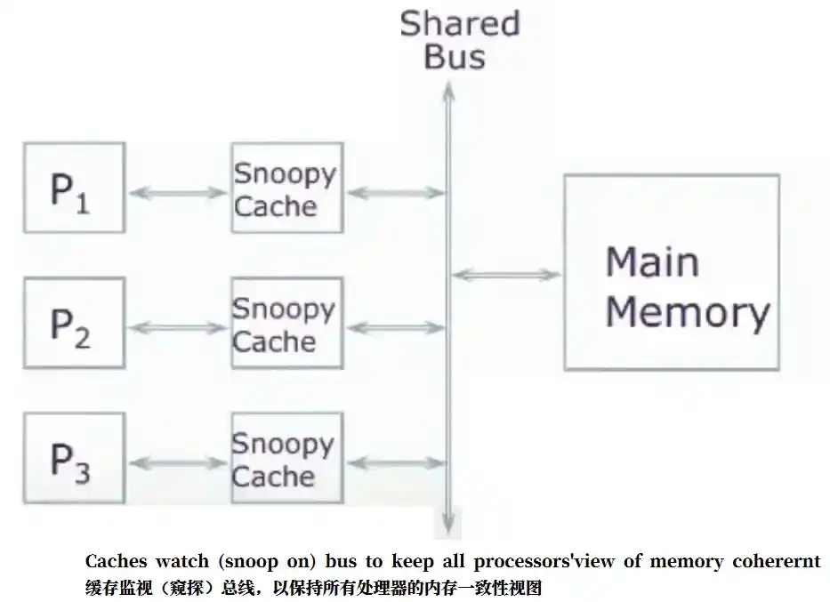

共享总线，shared Bus，所有的内存请求通过广播发送到总线上，这些消息在总线上是排好队的(in order，Transaction Serialization)，这样就保证了所有的CPU看到的load和store操作的顺序都是一模一样的。

### Valid/Invalid协议

接下来首先介绍一个最简单的协议，Valid/Invalid(VI)，假设**写缓存是write-through**的，写缓存的同时写主存。

-   本文中的协议都是以有限状态机来描述(fsm)；
-   CPU侧的操作都是以Pr开头，有读和写，PrRd，PrWr；
-   总线上的消息(bus transaction)以Bus开头，有BusRd，BusWr，BusRdX等。为了简化，有些消息在图中并没有标注，例如BusInv、BusReply等等。例如，当缓存控制器收到BusRd消息时，其实是会回复BusReply消息，当收到BusInv消息，将自己对应的cache line状态置为invalid后，也会回复对应的invalid ack消息；
-   图中实线部分是CPU主动发起的操作，而虚线部分是cache line处在某个状态时收到对应的总线消息后状态的转换。

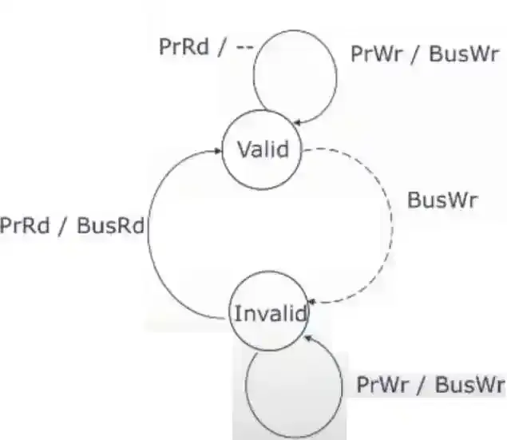

1.  初始Invalid状态，cpu load，PrRd，产生BusRd消息，从主存中读取到值后，放在cache中，状态变为Valid；
2.  在Valid状态下，CPU load，PrRd，不会产生bus消息，直接读缓存；
3.  在Valid状态下，CPU store，PrWr，会产生BusWr消息，当前cache的状态依然是Valid；
4.  其他cache控制器收到BusWr的消息后，发现有人正在写自己cache line中的值，则将cache line的对应状态置为Invalid；
5.  在Invalid状态下，CPU store，PrWr，产生BusWr，状态依然是Invalid。因为是write-through cache，所以直接写主存；

举个实际的例子，双核CPU，CPU0，CPU1，初始状态，0xA地址处变量的值为2，

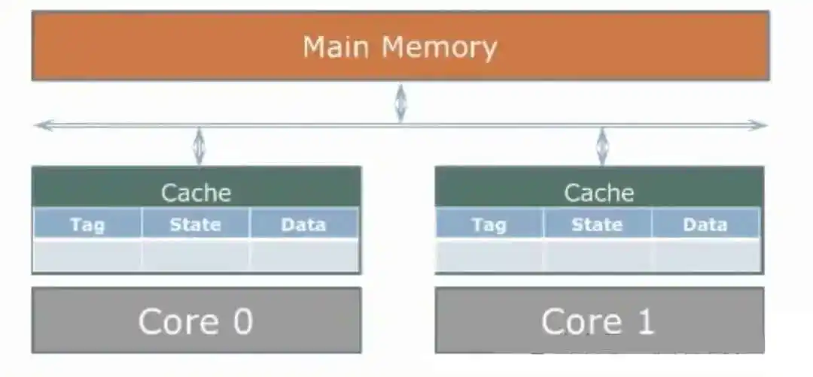

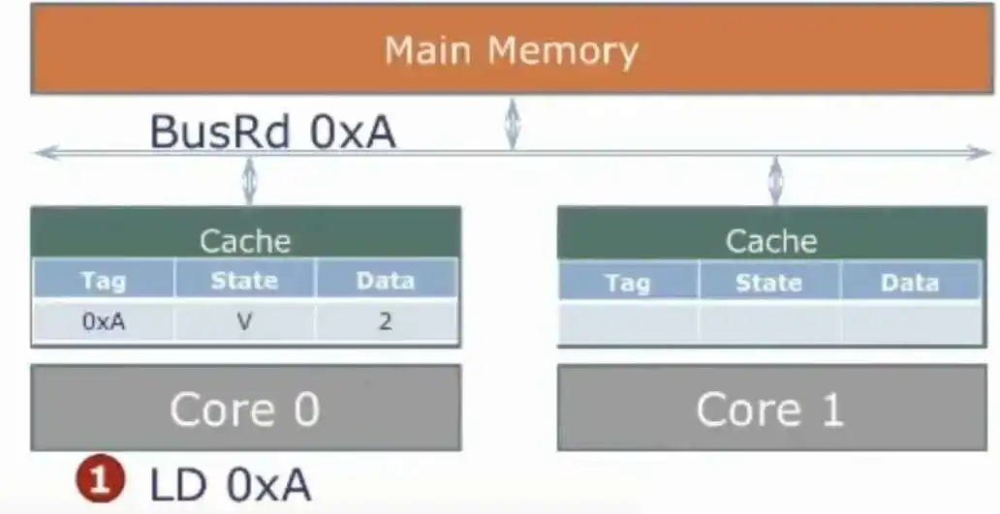

①CPU0 load 0xA地址的值，发送BusRd 0xA，状态改为V，缓存的值设置为2；

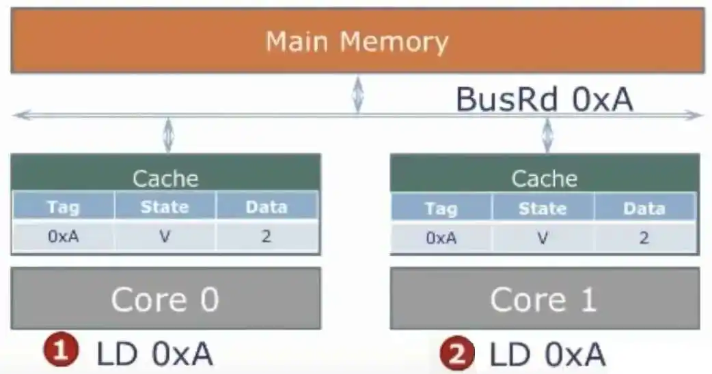

②CPU1 load 0xA地址的值，发送BusRd 0xA，状态改为V，缓存的值设置为2。此时，如果CPU0 和CPU1要继续读取0xA的值，直接从cache中读取，不会产生总线消息；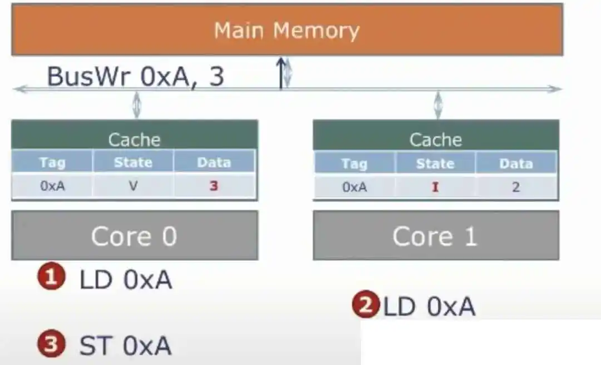③CPU 0写0xA的值为3，发送BusWr，write-through，直接写缓存和主存。CPU 1收到BusWr，将自己的状态置为I。

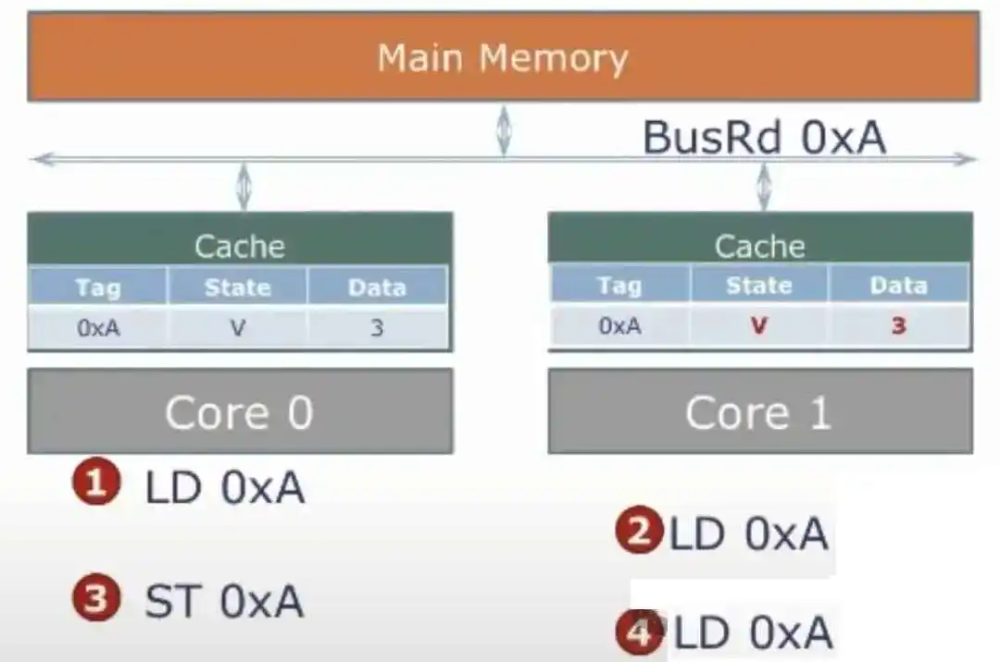

④CPU1 load，发送BusRd，状态改为V，读取到最新的值3。

从以上的例子，我们可以看到，VI协议非常简单，但是其保证了缓存的一致性。但是它的缺点也比较明显，

1.  每次写操作(PrWr)都会去写主存，效率低；
2.  每次写操作(PrWr)都会发送总线消息(BusWr)，浪费总线的带宽。

### MSI协议

MSI是Modified，Shared，Invalid三个首字母的缩写，

-   I，cache does not contain the address
-   S，cache has the address but so many other caches, hence it can only be read
-   M only this cache has the address hence it can be read and written;any other cache that had this address got invalidated

I指的是无效状态。S指多个缓存都有该地址的值，且都是一样的，只能读。M指该cache line中的值是最新被修改过的，其他CPU中对应cache line的状态已经被置为I。

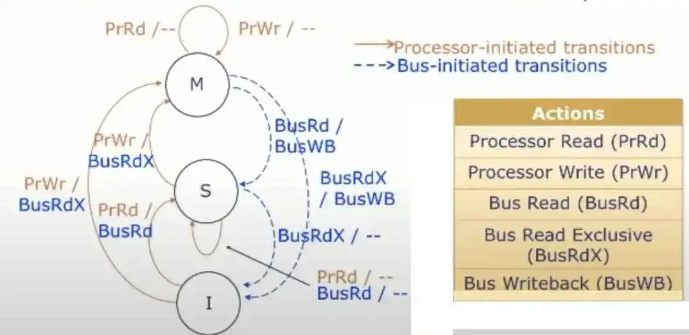

其中，

-   BusRdx，总线读取独占，我将此位置的独占副本放入缓存，告诉其他的缓存我要独占这个cache line中对应的数据了(写)，发送BusRdx，其他当前在M和S状态的cache line，都会转移到I状态。
-   在M状态下收到BusRd消息(其他CPU有读操作)，当前cache line的数据是最新的，因此会触发BUSWB(Bus WriteBack)，将最新的数据写入到主存中。
-   在M状态下的PrWr可以直接写，不会产生总线消息，比VI协议效率高一些。

依然以上面的例子举例，双核CPU，CPU0，CPU1，假设写缓存是write-back的。初始状态，0xA地址处变量的值为2，

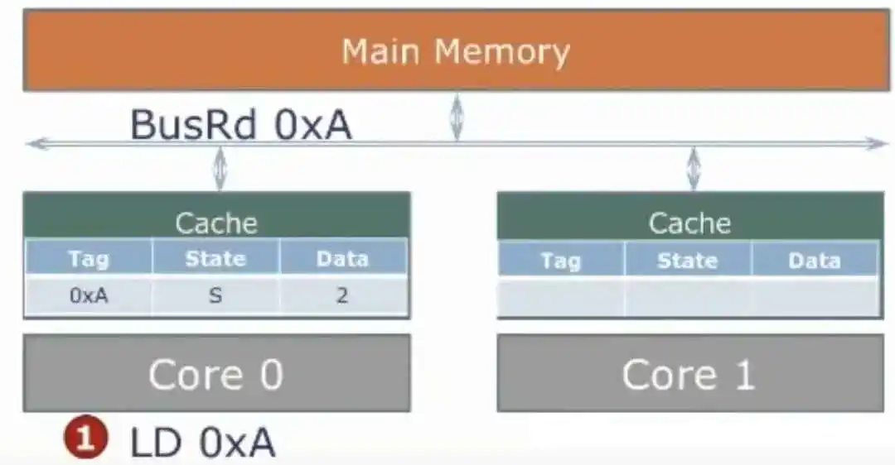

① CPU0 load,  触发BusRd，状态从I变为S，数据为2。

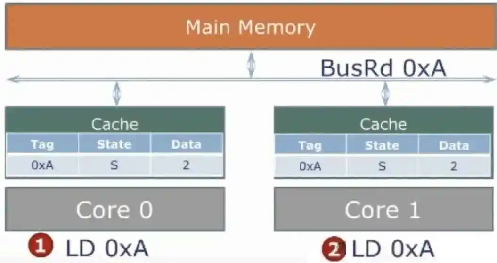

②CPU1 load,  触发BusRd，状态从I变为S，数据为2。当缓存中已经有值了以后，其他的load都从缓存中直接读数据，不会触发bus transcation。

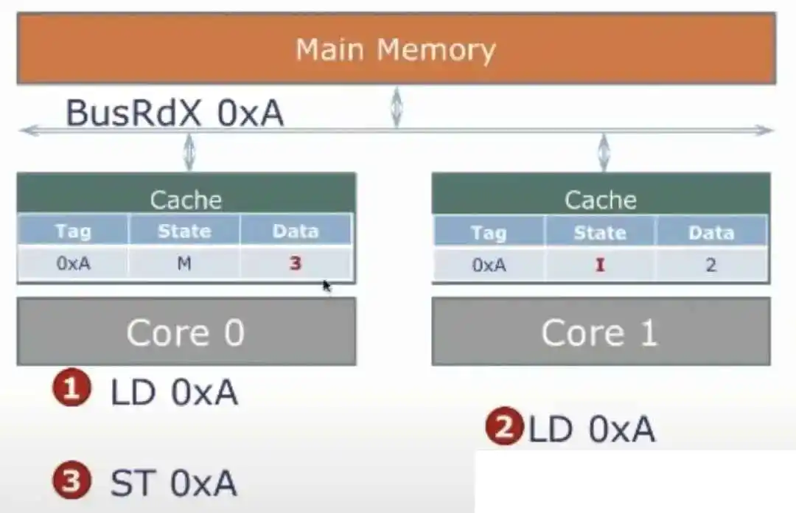

③CPU0 store，PrWr，触发BusRdX，CPU1的缓存控制器收到BusRdX后，将对应cache line的状态置为I，CPU0的缓存控制器将对应的cache line状态置为M。这个时候，并没有更新主存中的数据(write back cache)。此时，CPU0对0xA的读写都是locally的，不会触发bus transcation(不像VI协议)。

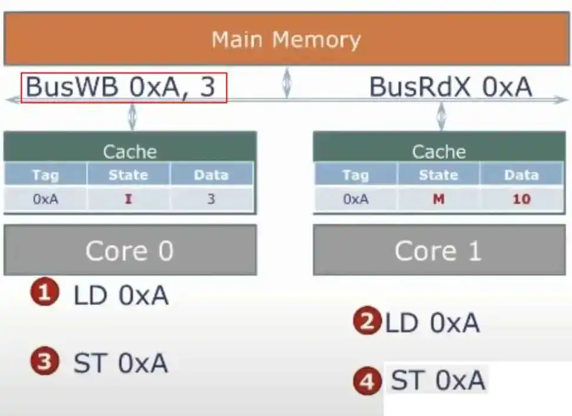

④CPU1 store，PrWr，触发BusRdX；CPU0当前在M状态，收到BusRdX后，会触发BusWB，将自己缓存中的值写回到主存中，此时主存中的值已经更新为3，同时CPU0中对应的cache line的状态更新为I。CPU1将cache line的值更新为最新的10，然后状态更新为M。

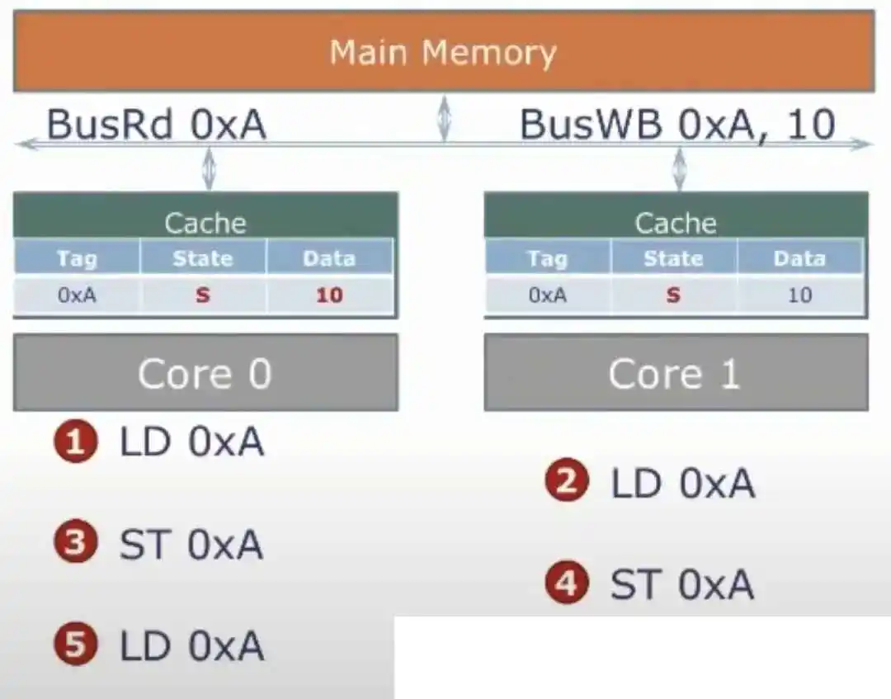

⑤CPU0 load，PrRd，触发BusRd。CPU1当前状态为M，收到BusRd后，会触发BusWB，将对应的cache line的值write back到主存，更新自己的状态为S。

CPU0 读取到最新的值10，状态从I转为S。

### MESI协议

对于MSI协议，考虑一种情况，单线程或者多线程的私有数据，即多个CPU的cache中没有共享数据，此时执行read-modify-write操作，此时也会触发2次bus transcation，即BusRd和BusRdX。MESI协议在MSI的基础上添加了E状态(exclusive,clean)，该cache line中的数据和主存中的数据是一样的，且只有这个cache line中有这个数据。所以叫“独占”。

>   Exclusive：缓存行只存在于当前缓存中，但是是“干净的”——它与主存匹配。它可以在任何时候更改为共享状态，以响应读请求。或者，在写入时将其更改为Modified状态。

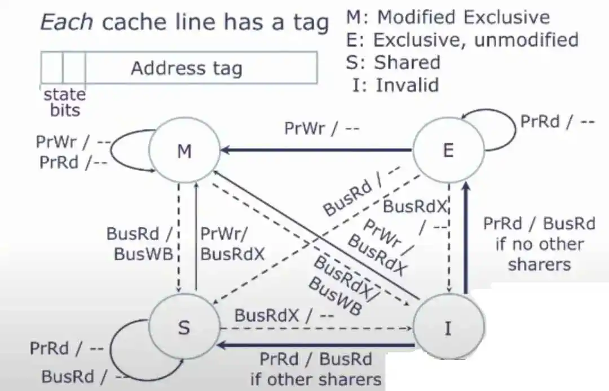

从MESI协议的状态转移图我们可以看出，

-   在I状态，PrRd，如果没有其他的sharer，则进入E状态，否则进入S状态。
-   当没有其他sharer时，读，进入E状态，写PrWr，进入M状态，没有触发其他的bus transcation。对于单线程或者多线程的私有数据的读写，减少了一条bus transcation(因为图中有些总线消息没有都标出来，所以实际减少的总线消息不止一条)，效率较MSI协议有了提升。

在论文《Memory Barriers: a Hardware View for Software Hackers》 中介绍了几种MESI协议对应的总线消息，包括：

>   Read：“Read”消息包含要读取的缓存线的物理地址。
>
>   Read Response：“Read Response”消息包含先前的“Read”消息所请求的数据。这个“读取响应”消息可以由内存提供，也可以由其他缓存提供。例如，如果其中一个缓存的所需数据处于“已修改”状态，则该缓存必须提供“读取响应”消息。

对应上文中的BusRd，BusReply，只不过本文对BusReply的消息都未显示。

>   Invalidate: Invalidate消息包含要失效的缓存行的物理地址。所有其他缓存必须从它们的缓存中删除相应的数据并进行响应。
>
>   Invalidate Acknowledge: CPU收到“Invalidate”消息后，必须在从缓存中删除指定的数据后响应“Invalidate Acknowledge”消息。

Invalidate，BusInv消息，Invalidate Ack消息是对BusInv消息的回复，可以统一囊括进BusReply中。

>   Read Invalidate：“Read Invalidate”消息包含要读取的缓存行的物理地址，同时指示其他缓存删除该数据。因此，正如其名称所示，它是“read”和“invalidate”的组合。“read invalidate”消息需要“read response”和一组“invalidate acknowledge”消息作为回复。

对应BusRdX消息，相当于是Read和Invalidate的结合。

>   回写：“回写”消息包含地址和要写回内存的数据（可能在此过程中“窥探”到其他cpu的缓存）。此消息允许缓存根据需要弹出处于“modified”状态的行，以便为其他数据腾出空间。

对应BusWB消息。

下文中会对Read、Read Response、Invalidate、Invalidate Acknowledge、Read Invalidate以及BusRd、BusReply、BusRdX等混用，其实都是一样的意思，只不过下文主要是基于论文中的内容进行描述，会使用论文中的术语。

#### 进一步说明

MESI 协议其实是 4 个状态单词的开头字母缩写，分别是：

- *Modified*，已修改
- *Exclusive*，独占
- *Shared*，共享
- *Invalidated*，已失效

这四个状态来标记 Cache Line 四个不同的状态。

「已修改」状态就是我们前面提到的脏标记，代表该 Cache Block 上的数据已经被更新过，但是还没有写到内存里。而「已失效」状态，表示的是这个 Cache Block 里的数据已经失效了，不可以读取该状态的数据。

「独占」和「共享」状态都代表 Cache Block 里的数据是干净的，也就是说，这个时候 Cache Block 里的数据和内存里面的数据是一致性的。

「独占」和「共享」的差别在于，独占状态的时候，数据只存储在一个 CPU 核心的 Cache 里，而其他 CPU 核心的 Cache 没有该数据。这个时候，如果要向独占的 Cache 写数据，就可以直接自由地写入，而不需要通知其他 CPU 核心，因为只有你这有这个数据，就不存在缓存一致性的问题了，于是就可以随便操作该数据。

另外，在「独占」状态下的数据，如果有其他核心从内存读取了相同的数据到各自的 Cache，那么这个时候，独占状态下的数据就会变成共享状态。

那么，「共享」状态代表着相同的数据在多个 CPU 核心的 Cache 里都有，所以当我们要更新 Cache 里面的数据的时候，不能直接修改，而是要先向所有的其他 CPU 核心广播一个请求，要求先把其他核心的 Cache 中对应的 Cache Line 标记为「无效」状态，然后再更新当前 Cache 里面的数据。

我们举个具体的例子来看看这四个状态的转换：

1. 当 A 号 CPU 核心从内存读取变量 i 的值，数据被缓存在 A 的 Cache 里面，此时其他 CPU 核心的 Cache 没有缓存该数据，于是标记 Cache Line 状态为「独占」，此时其 Cache 中的数据与内存是一致的；
2. 然后 B 号 CPU 核心也从内存读取了变量 i 的值，此时会发送消息给其他 CPU 核心，由于 A 号 CPU 核心已经缓存了该数据，所以会把数据返回给 B 号 CPU 核心。在这个时候，A 和 B 核心缓存了相同的数据，Cache Line 的状态就会变成「共享」，并且其 Cache 中的数据与内存也是一致的；
3. 当 A 号 CPU 核心要修改 Cache 中 i 变量的值，发现数据对应的 Cache Line 的状态是共享状态，则要向所有的其他 CPU 核心广播一个请求，要求先把其他核心的 Cache 中对应的 Cache Line 标记为「无效」状态，然后 A 号 CPU 核心才更新 Cache 里面的数据，同时标记 Cache Line 为「已修改」状态，此时 Cache 中的数据就与内存不一致了。
4. 如果 A 号 CPU 核心「继续」修改 Cache 中 i 变量的值，由于此时的 Cache Line 是「已修改」状态，因此不需要给其他 CPU 核心发送消息，直接更新数据即可。
5. 如果 A 号 CPU 核心的 Cache 里的 i 变量对应的  Cache Line 要被「替换」，发现  Cache Line 状态是「已修改」状态，就会在替换前先把数据同步到内存。

所以，可以发现当 Cache Line 状态是「已修改」或者「独占」状态时，修改更新其数据不需要发送广播给其他 CPU 核心，这在一定程度上减少了总线带宽压力。

事实上，整个 MESI 的状态可以用一个有限状态机来表示它的状态流转。还有一点，对于不同状态触发的事件操作，可能是来自本地 CPU 核心发出的广播事件，也可以是来自其他 CPU 核心通过总线发出的广播事件。

下图即是 MESI 协议的状态图：

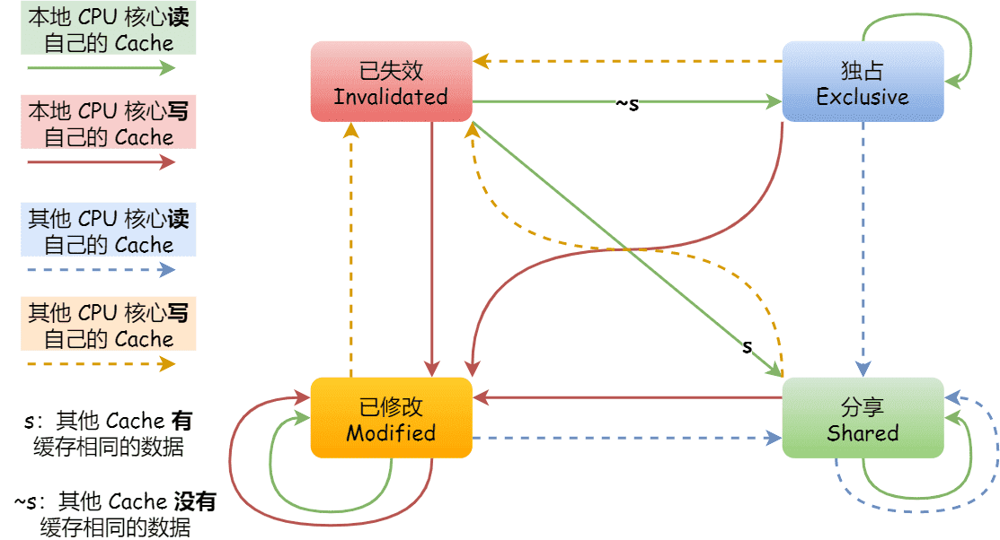

 MESI 协议的四种状态之间的流转过程如下表所示：

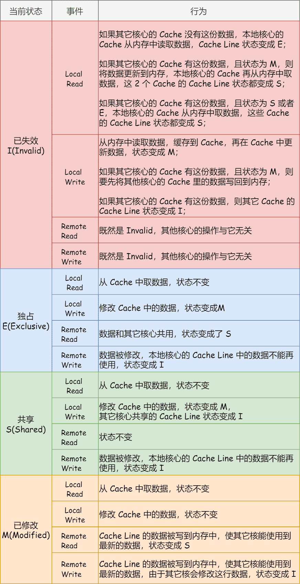

## 对MESI协议的进一步优化

对于MESI协议，假如cache line处于S状态，当CPU执行写(store)操作时，PrWr，会触发总线发送BusRdX，其他缓存控制器收到该消息后将自己对应的cache line的状态置为I后，然后会回复BusReply(Invalidate Ack)消息，当前缓存的控制器只有在收到BusReply(Invalidate Ack)消息后才会去执行写操作。这一段时间对于CPU而言，时间很长，效率很低，称为"write stall"。

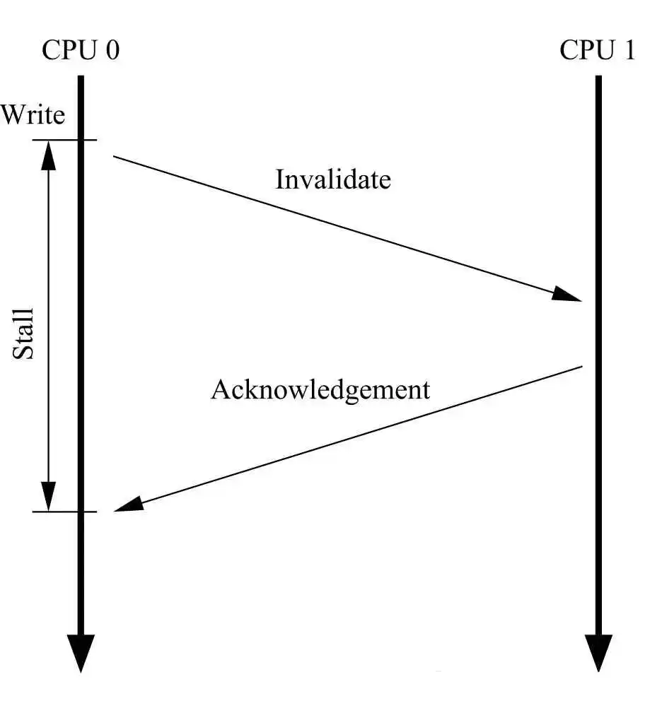

此外，对于CPU1而言，将cache line置为I状态有时也是比较耗时的。因为CPU1可能正在对该缓存进行密集的读写操作，这个时间可能比较长。如果CPU1同时收到了很多的Invalidate消息的时候(CPU1有多个cache line)，它对这些消息的处理必然有个先后顺序，而对应的cache line可能处理的会比较晚。

>   invalidate确认消息需要很长时间的一个原因是，它们必须确保相应的缓存行实际上是无效的，如果缓存很忙，例如，如果CPU正在密集地加载和存储数据，那么这种无效可能会延迟，所有这些数据都驻留在缓存中。此外，如果在短时间内到达大量的invalidate消息，则给定的CPU可能会在处理它们时落后，从而可能使所有其他CPU停止工作。

为了解决上面提到的2个问题，因此有了Store Buffer和Invalidate Queue。在有Store Buffer和Invalidate Queue之前，无论是VI/MSI/MESI协议本身，都可以保证缓存的一致性，只是在某些场景下效率的高低不同。

### Store Buffer和Store Forwarding

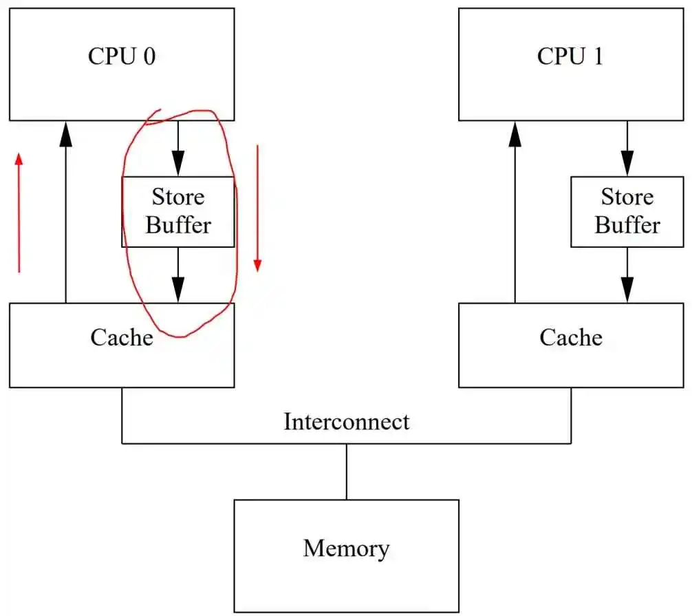

>   防止这种不必要的写延迟的一种方法是在每个CPU和它的缓存之间添加“存储缓冲区”，如图5所示。通过添加这些存储缓冲区，CPU 0可以简单地在其存储缓冲区中记录写操作并继续执行。当缓存行最终从CPU 1移动到CPU 0时，数据将从存储缓冲区移动到缓存行。

如上图所示，在CPU和缓存之间加一个中间的小的缓存"store buffer"(该图中store buffer的数据流向是单向的，CPU只能向其中写数据，无法读数据)。当CPU0需要去store的时候，先将x写入到"store buffer"中，然后继续执行其他的事情，等到需要的时候再将对应的数据写入到缓存中(收到CPU1对应x的Invalidate ack消息后)。

一个实际的例子，a和b初始都为0，a在CPU1的缓存中(E)，b在CPU0的缓存中(E)，

```
a = 1;
b = a + 1;
assert(b == 2);
```

假设上面的代码在CPU0中运行，会有下面可能的执行顺序，

1.  CPU0 开始执行 a = 1;
2.  CPU0 在自己的缓存中找a，未找到。因为要执行写(Store)操作，此时CPU0发送“Read Invalidate”消息；
3.  CPU0将 a=1放到CPU 0 的store buffer中；
4.  CPU1收到“Read Invalidate”消息，回复Read Response消息(a=0)，并将对应的a相关的cache line的状态置为I；
5.  CPU0收到CPU1发的Read Response消息，将自己缓存中a的值置为0。
6.  CPU0开始执行 b = a + 1，从缓存中读出来a的值为0，算术运算后，b = 1。因为b在CPU0的缓存中，状态为E，直接修改缓存中的值为1；
7.  假设这时候，CPU0才收到CPU1回复的Invalidate ack消息，这时候CPU0才从"store buffer"中将a的值拿出来写入到CPU0的缓存中。
8.  CPU0执行assert，因为缓存中b的值为1，assert失败。

上面代码失败的原因是在CPU 0中有2份a的值，一份在"store buffer"中，一份在缓存中。为了解决这个问题，就有了"store forwarding"，从硬件上解决这个问题。"store forwarding"保证CPU在执行读(load)操作时同时兼顾"store buffer"和cache，保证读的正确性，系统结构图变成如下，注意数据流向的箭头。

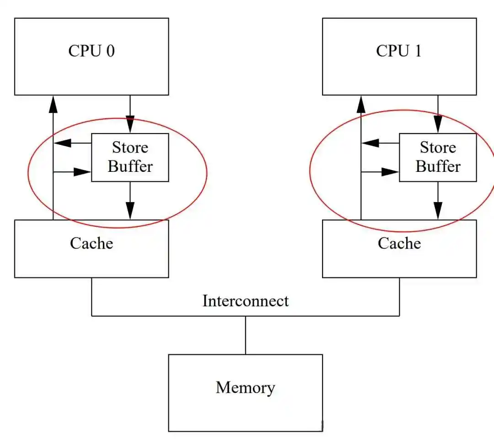

>   写入无效缓存行时使用存储缓冲区。当写操作继续进行时，CPU发出一条读无效消息（因此有问题的缓存行和存储该内存地址的所有其他CPU的缓存行都是无效的），然后将写操作推入存储缓冲区，当缓存行最终到达缓存时执行。
>
>   存储缓冲区存在的直接后果是，当CPU提交写操作时，该写操作不会立即写入缓存中。因此，每当CPU需要读取缓存行时，它首先扫描自己的存储缓冲区中是否存在同一行，因为有可能同一行之前由同一CPU写入，但尚未写入缓存（之前的写入仍然在存储缓冲区中等待）。请注意，虽然一个CPU可以在其存储缓冲区中读取自己之前的写操作，但其他CPU *无法看到这些写操作*，直到它们被刷新到缓存中- CPU不能扫描其他CPU的存储缓冲区。

CPU从cache line中读数据时，首先会去其store buffer中查询有没有对应项，因为有可能之前的写操作没完成，缓存中的值是旧值。

### Invalidate Queue

考虑下面的一个场景，假设a在CPU1的cache中，b在CPU0的cache中，初始值都为0，CPU0执行foo()，CPU1执行bar()。

```
void foo(void)
{
    a = 1;
    b = 1;
}

void bar(void)
{
    while(b == 0) continue;
    assert(a == 1);
}
```

1.  CPU 0执行a = 1，cache未命中，发送read invalidate消息，将a = 1放置在store buffer中；
2.  CPU 1执行while(b == 0)，读b，发现cache未命中，发送read消息；
3.  CPU 0执行 b = 1，因为缓存中已经有了b，状态肯定是E或者M，直接修改缓存 b = 1；
4.  CPU 0收到读b的read消息，回复Read Response消息(b = 1)，状态置为S；
5.  CPU 1收到Read Response消息(b = 1)，将其缓存中b的值修改为1。，此时读到的b值为1，因此while(b == 0)，退出；
6.  CPU 1执行assert(a == 1)，此时CPU 1中的缓存中a的值还是0，assert失败；
7.  到了这个时候，CPU 1才收到CPU 0发送的read invalidate消息，把缓存中的a =0 发送过去(Read Response)，然后把CPU 1中的a对应的cache line状态置为I，同时当然还会发送Invalidate ack消息；
8.  CPU 0收到a = 0的消息，写缓存。同时收到Invalidate ack，将store buffer中a = 1写入到缓存中。

上面的问题，可以利用内存屏障(memory-barrier)的指令来进行纠正，下面是linux中的一些barrier API，

```
smp_mb(),All memory accesses before the smp_mb() will be visible to all cores within the SMP system before any accesses after the smp_mb().
smp_rmb(),Like smp_mb(), but only guarantees ordering between read accesses.
smp_wmb(),Like smp_mb(), but only guarantees ordering between write accesses.
```

在smp_mb()前执行的读写操作，在smp_mb()后都是可见的，smp_rmb和smp_wmb分别对应读、写相关的操作。而smp_mb将导致CPU对store buffer的“清空”，即等着把之前缓存在store buffer中的数据先处理完。具体实现有2种方式：一直等着，直到store buffer缓存的数据处理完；把smp_mb()后的写操作(store)继续放到store buffer中排队(前面的数据先处理，最后处理后加入的)。

将上述CPU 0执行的代码加上读写barrier后(假设是后一种处理方式)，

```
void foo(void)
{
    a = 1;
    smp_mb();
    b = 1;
}
```

其可能执行的流程如下，

1.  CPU 0执行a = 1，cache未命中，发送read invalidate消息，将a = 1放置在store buffer中；
2.  CPU 1执行while(b == 0)，读b，发现cache未命中，发送read消息；
3.  CPU 0执行 smp_mb()，会将store buffer中的a = 1做上标记；
4.  CPU 0执行 b =1，因为b初始在CPU 0的cache中，本来应该直接可以写cache的，但是因为在store buffer中有标记的项，此时将b = 1也放在store buffer中的最后位置，但是不加标记；
5.  CPU 0收到CPU 1发送的read消息(读b)，发送Read Response消息(b = 0)，将对应cache line中的状态置为S；
6.  CPU 1收到Read Response消息(b = 0)，写缓存b = 0，将对应cache line中的状态置为S，导致while循环继续；
7.  CPU 1收到Read invalidate消息，将缓存中a = 0发送给CPU 0(Read Response消息(a = 0))，同时将缓存中a相关的cache line 状态置为I；
8.  CPU 0收到 Read Response消息(a = 0)，结合store buffer中a = 1，将对应a的cache line的状态置为E，同时修改缓存中a的值为1。因为store buffer中已经处理完a相关的，可以继续处理b=1相关的，但是因为此时缓存中b的cache line的状态为S，先不能直接写(CPU1中有b对应的cache line，状态为S)，在写之前需要先发送Invalidate 消息，让CPU1中的b对应的cache line失效；
9.  CPU 1收到Invalidate 消息，回复Invalidate ack消息，将b对应的cache line状态置为I；
10.  CPU 1执行while(b == 0)，读b，发现cache未命中，发送read消息；
11.  CPU 0收到Invalidate ack消息后，将b对应的cache line的状态置为E，这时候处理store buffer中b=1的，将b=1写入缓存；
12.  CPU 0收到read消息，回复Read Response消息(b = 1)，将b对应的cache line状态置为S，值依然为1；
13.  CPU 1收到Read Response消息(b = 1)，while退出；
14.  CPU 1执行assert(a ==1)，发现其a对应的缓存未命中(7中置为I)，接着将会发送read消息，从CPU 0中拿到最新的缓存的数据a=1，assert成功。

通过上面的例子，我们发现添加smp_mb后，当线程1读取到b = 1时(while退出)，此时一定能保证a = 1在CPU 1中能看到，完成了同步的效果(换而言之，smp_mb保证了前面的执行的代码一定先于其后执行的代码，如果smp_mb之后的代码执行了，之前的代码一定也执行了)。

但是，使用store buffer也有一个问题，它的容量是十分有限的，如果其容量满了以后，我们就不得不等待其先执行其中的一些数据，给后面的数据留空间。这种情况在使用了类似smp_mb的内存屏障后会发生的越明显，因为这种情况下smp_mb后的store操作也都要放到store buffer中，而store操作必须等收到Invalidate ack消息后才能进行(无论在当前的缓存中是否已经有store buffer对应项，是否缓存命中，如果对应的缓存是S状态还必须先把其他CPU中的cache line的状态置为I才能继续写)，如果其他CPU的Invalidate ack消息回复的慢，则对CPU的执行效率将会大大影响。

解决上述问题的一个思路就是如何提高Invalidate ack消息的回复效率，而其解决思路就是Invalidate Queue。

>   在发送确认之前，CPU实际上不需要使缓存行无效。它可以将invalidate消息排队，并理解在CPU发送有关该缓存行的任何进一步消息之前将处理该消息。

CPU在收到invalidate消息后，将其放入到其Invalidate Queue队列中，然后马上回复invalidate ack消息。CPU自己非常清楚：在发送Invalidate Queue队列中数据的cache line相关的消息之前，把对应数据的cache line使其失效即可(I)。提高了双方CPU的执行效率。

>   存储屏障将刷新存储缓冲区，确保所有写操作都被应用到该CPU的缓存中。读屏障将刷新无效队列，从而确保其他CPU的所有写操作对正在刷新的CPU可见。

store barrier指令将会对store buffer进行刷新，保证其内的数据写进CPU的cache line中。read barrier会刷新invalidate queue,保证了其他CPU对队列中对应项的写操作对当前CPU可见。

CPU的缓存架构图变成了如下图所示


继续上面的例子，假设a在CPU1的cache中，b在CPU0的cache中，初始值都为0，CPU0执行foo()，CPU1执行bar()，同时拥有store buffer和invalidate queue的CPU可能的执行情况如下，

```
void foo(void)
{
    a = 1;
    b = 1;
}

void bar(void)
{
    while(b == 0) continue;
    assert(a == 1);
}
```

1.  CPU 0执行a = 1，cache未命中，发送read invalidate消息，将a = 1放置在store buffer中；
2.  CPU 1执行while(b == 0)，读b，发现cache未命中，发送read消息；
3.  CPU 0执行b = 1，因为b在CPU 0的cache中(M或者E)，直接修改b对应的缓存为1；
4.  CPU 0收到read消息，发送Read Response消息(b = 1)，并将b对应的cache line的状态置为S；
5.  CPU 1收到read invalidate消息，将a放到invalidate queue中，马上回复invalidate ack。此时CPU1中对应的a的值还为0(还没有被置为I)；
6.  CPU 1收到Read Response消息(b = 1)，将其放置到缓存中；
7.  CPU 1之前执行的while(b == 0)，从while循环中退出了，因为读上来的b=1；
8.  CPU 1执行 assert(a == 1)，因为此时CPU1中对应的a的值还为0，所以assert失败；

上述情景assert失败的原因是invalidate queue导致CPU 1中读到的a值是旧值，可以用内存屏障指令解决上面的问题，

```
void foo(void)
{
    a = 1;
    smp_mb();
    b = 1;
}

void bar(void)
{
    while(b == 0) continue;
    smp_mb();
    assert(a == 1);
}
```

-   在foo中，smp_mb()的作用保证如果读到b=1了，此时a=1一定对当前线程(当前CPU)是可见的，即a=1先于b=1生效；
-   在bar中，smp_mb()的作用是将invalidate queue中的数据进行标记，如果在smp_mb()之后有其他的读操作(load)，必须保证先把invalidate queue中的数据处理完，因此如果CPU 1读到b=1后，assert(a==1)才会去读a的最新的值，而foo中smp_mb()又保证了此时a一定为1，因此assert成功。

此外，在foo中只牵扯写操作(store)，在bar中只牵扯读操作(load)，因此上面的代码可以将smp_mb()替换为相当“更轻量化”的smp_wmb()和smp_rmb()，

```
void foo(void)
{
    a = 1;
    smp_wmb();
    b = 1;
}

void bar(void)
{
    while(b == 0) continue;
    smp_rmb();
    assert(a == 1);
}
```

>   1.  smp_rmb() 保证在barrier之前指定的所有LOAD操作将在barrier之后指定的所有LOAD操作之前发生（相对于系统的其他组件）。
>   2.  smp_wmb() 保证，相对于系统的其他组件，在屏障之前指定的所有STORE操作似乎都发生在屏障之后指定的所有STORE操作之前。

通过以上的分析，为了提高CPU的执行效率，在有Store Buffer和Invalidate Queue之后，即使有MESI协议，缓存的一致性也遭到了破坏。我们不得不通过一些其他的手段，例如内存屏障相关的指令或者函数让程序员在软件层面去做同步。

## 总结

CPU 在读写数据的时候，都是在 CPU Cache 读写数据的，原因是 Cache 离 CPU 很近，读写性能相比内存高出很多。对于 Cache 里没有缓存 CPU 所需要读取的数据的这种情况，CPU 则会从内存读取数据，并将数据缓存到 Cache 里面，最后 CPU 再从 Cache 读取数据。

而对于数据的写入，CPU 都会先写入到 Cache 里面，然后再在找个合适的时机写入到内存，那就有「写直达」和「写回」这两种策略来保证 Cache 与内存的数据一致性：

- 写直达，只要有数据写入，都会直接把数据写入到内存里面，这种方式简单直观，但是性能就会受限于内存的访问速度；
- 写回，对于已经缓存在 Cache 的数据的写入，只需要更新其数据就可以，不用写入到内存，只有在需要把缓存里面的脏数据交换出去的时候，才把数据同步到内存里，这种方式在缓存命中率高的情况，性能会更好；

当今 CPU 都是多核的，每个核心都有各自独立的 L1/L2 Cache，只有 L3 Cache 是多个核心之间共享的。所以，我们要确保多核缓存是一致性的，否则会出现错误的结果。

要想实现缓存一致性，关键是要满足 2 点：

- 第一点是写传播，也就是当某个 CPU 核心发生写入操作时，需要把该事件广播通知给其他核心；
- 第二点是事务的串行化，这个很重要，只有保证了这个，才能保障我们的数据是真正一致的，我们的程序在各个不同的核心上运行的结果也是一致的；

基于总线嗅探机制的 MESI 协议，就满足上面了这两点，因此它是保障缓存一致性的协议。

MESI 协议，是已修改、独占、共享、已失效这四个状态的英文缩写的组合。整个 MESI 状态的变更，则是根据来自本地 CPU 核心的请求，或者来自其他 CPU 核心通过总线传输过来的请求，从而构成一个流动的状态机。另外，对于在「已修改」或者「独占」状态的 Cache Line，修改更新其数据不需要发送广播给其他 CPU 核心。

## 相关阅读

-   [缓存一致性协议MESI](https://mp.weixin.qq.com/s/FckDZY77ZSGkK1dV5SSENw)
