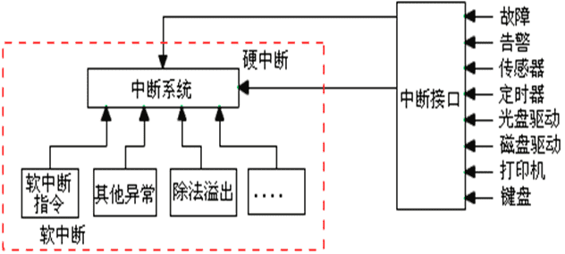
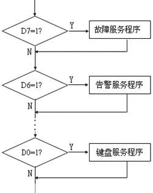
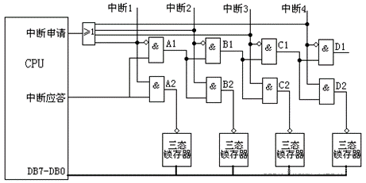
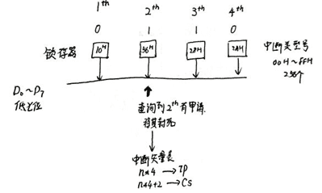
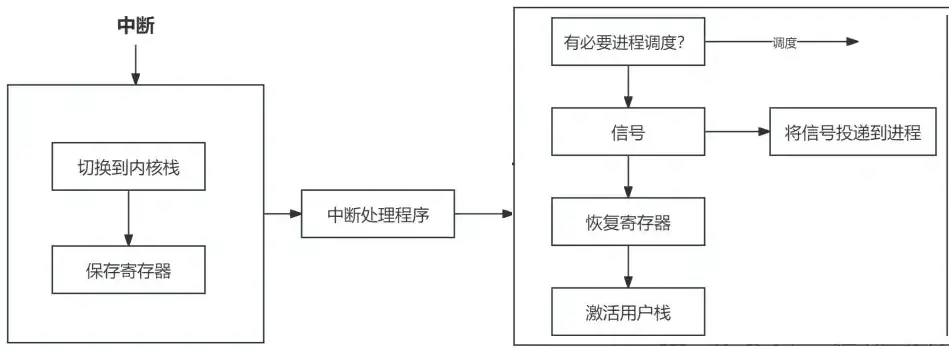

# 中断入门

## 什么是中断

中断是指在CPU正常运行期间，由于内外部事件或由程序预先安排的事件引起的CPU暂时停止正在运行的程序，转而为该内部或外部事件或预先安排的事件服务的程序中去，服务完毕后再返回去继续运行被暂时中断的程序。

-   硬件中断（hardware interrupt）：由系统自身和与之连接的外设自动产生。它们用于支持更高效地实现设备驱动程序，也用于引起处理器自身对异常或错误的关注，这些是需要与内核代码进行交互的。
-   软中断（SoftIRQ）：用于有效实现内核中的延期操作。

如果用一句话来概括操作系统的原理，整个操作系统就是一个中断驱动的死循环。可以用以下的代码解释。

```c
while(true) {
	doNothing();
}
```

其他所有的事情都是由操作系统提前注册的中断机制和其对应的中断处理函数完成的。

比如双击鼠标，敲击键盘等等外设终端的操作行为，都是用中断的方式来通知操作系统帮我们处理这些事情。

在Intel CPU开发手册的卷1中6.4节对中断和异常做了标识说明。

>   The processor provides two mechanisms for interrupting program execution, interrupts, and exceptions:
>
>   -   An interrupt is an asynchronous event that is typically triggered by an I/O device.
>   -   An exception is a synchronous event that is generated when the processor detects one or more predefined conditions while executing an instruction. The IA-32 architecture specifies three classes of exceptions: faults, traps, and aborts.

翻译：

>   处理器提供了中断程序执行的两种机制，中断和异常：
>
>   -   中断：是一种异步事件，通常由I/O设备触发。比如点击一下鼠标，敲击一下键盘等。
>   -   异常：是处理器在执行指令时检测到一个或多个预定义条件时产生的同步事件。IA-32体系结构指定了三类异常：故障、陷阱和中止。异常是CPU在执行指令时检测的反常条件，比如除法异常、错误指令异常、缺页异常等。

中断包含中断和异常两种，而异常又分为故障、陷阱和终止三种类型。

| 类型 | 类别类型 | 原因              | 异步/同步 | 返回行为             |
| ---- | -------- | ----------------- | --------- | -------------------- |
| 中断 | 中断     | 来自I/O设备的信号 | 异步      | 总是返回到下一条指令 |
| 异常 | 故障     | 有意的异常        | 同步      | 总是返回到下一条指令 |
| 异常 | 陷阱     | 有意的异常        | 同步      | 总是返回到下一条指令 |
| 异常 | 终止     | 不可恢复的错误    | 同步      | 不会返回             |

## 中断的基本概念

在计算机中，中断是系统用来响应硬件设备请求的一种机制，操作系统收到硬件的中断请求，会打断正在执行的进程，然后调用内核中的中断处理程序来响应请求。中断可以提高CPU与外设交换数据的效率。

中断是一种异步的事件处理机制，可以提高系统的并发处理能力。操作系统收到了中断请求，会打断其他进程的运行，所以**中断请求的响应程序，也就是中断处理程序，要尽可能快的执行完，这样可以减少对正常进程运行调度地影响。**

而且，中断处理程序在响应中断时，可能还会「临时关闭中断」，这意味着，如果当前中断处理程序没有执行完之前，系统中其他的中断请求都无法被响应，也就说中断有可能会**丢失**，所以中断处理程序要短且快。

### 中断源

能够导致CPU产生中断的来源就是中断源。

中断源分类：

-   硬中断源——硬中断：外部电路在CPU引脚上产生的中断。

-   软中断源——软中断：CPU执行程序的过程中产生的中断请求。



硬中断源可以不止一个，这取决于CPU有多少个可以接收硬中断请求的引脚。

软中断可以只是一条软中断指令，在8086CPU系统当中，经常使用`INT 21H`指令，这将中止执行当前程序，转而去执行相应的DOS功能调用程序。

### 开中断和关中断

中断分为条件中断和无条件中断，中断源也可以分为条件中断源和无条件中断源。

通过对中断标志IF的置位来切换开中断和关中断的状态，IF=1为开中状态，IF=0为关中状态。

### 中断优先权

中断优先级：当多个中断源同时向CPU申请中断时，为了能够有序的处理多个中断申请，给每个中断源确定一个中断级别。

中断嵌套：如果CPU在执行中断服务程序时，又接受了新的中断申请，就会打断正在执行的中断服务程序，为新的中断源服务。

中断嵌套是有规则的：只有高优先级的中断可以打断低优先级中断服务，低优先级中断或者同优先级中断一般不允许实现中断嵌套。

1、软件查询实现中断优先级排队



CPU响应中断之后，从数据总线读入锁存器的内容，并按照中断源的优先级从高到低进行查询，这样就可以实现高优先级的申请首先得到响应。

方法：移位法（循环移位类指令）、屏蔽法（逻辑类指令）。

优缺点：

-   优点：简单、应用面广；
-   缺点：不够灵活，需要变动时需对整个服务程序进行修改。

2、硬件电路实现中断优先级排队





从图中可以看出，中断源从左向右，等级由高到低，离CPU越近，优先级越高。

工作过程：

1.  外部向CPU请求中断。

2.  CPU给出中断应答信号，高电平有效。

3.  排队电路选择最高级别的中断，三态锁存器选通，将其锁存的中断源标识传送到CPU的数据总线上。

4.  CPU读入中断源标识，调用相应的中断服务子程序。

优缺点：

-   硬件电路实现中断优先权排队的优点是中断响应快，使用灵活。每个中断源都有自己的中断服务子程序，不会相互影响，增加或者减少中断源都很方便。
-   缺点是接口电路比较复杂。特别是每个中断源需要有自己的标识，在8086CPU系统中这个标识称为中断类型号，还必须建立这个中断类型号和中断服务子程序的一一对应关系。

## 如何触发中断

CPU有三种触发中断的方式：

-   IO设备触发
-   CPU自行触发：异常是CPU自己执行指令时发现特殊情况触发的，自己给自己的中断号，执行到无效指令，给自己一个0x06中断号。
-   通过INT n指令发送给CPU触发：Linux触发系统调用，即执行INT 0x80指令，CPU收到0x80中断号，陷入系统调用。

## 中断两个阶段

为了避免由于中断处理程序**执行过长**和**中断丢失**的问题，而影响正常进程的调度，Linux 将中断过程分成了两个阶段，分别是「上半部和下半部分」：

- 上半部，对应硬中断，由硬件触发中断，用来快速处理中断；一般会暂时关闭中断请求，主要负责处理跟硬件紧密相关或者时间敏感的事情。
- 下半部，对应软中断，由内核触发中断，用来异步处理上半部未完成的工作；一般以「内核线程」的方式运行。

举一个计算机中的例子，常见的网卡接收网络包的例子。

网卡收到网络包后，通过 DMA 方式将接收到的数据写入内存，接着会通过**硬件中断**通知内核有新的数据到了，于是内核就会调用对应的中断处理程序来处理该事件，这个事件的处理也是会分成上半部和下半部。

上部分要做的事情很少，会先禁止网卡中断，避免频繁硬中断，而降低内核的工作效率。接着，内核会触发一个**软中断**，把一些处理比较耗时且复杂的事情，交给「软中断处理程序」去做，也就是中断的下半部，其主要是需要从内存中找到网络数据，再按照网络协议栈，对网络数据进行逐层解析和处理，最后把数据送给应用程序。

所以，中断处理程序的上部分和下半部可以理解为：

- **上半部直接处理硬件请求，也就是硬中断**，主要是负责耗时短的工作，特点是快速执行；
- **下半部是由内核触发，也就说软中断**，主要是负责上半部未完成的工作，通常都是耗时比较长的事情，特点是延迟执行；

还有一个区别，硬中断（上半部）是会打断 CPU 正在执行的任务，然后立即执行中断处理程序，而软中断（下半部）是以内核线程的方式执行，并且每一个 CPU 都对应一个软中断内核线程，名字通常为「ksoftirqd/CPU 编号」，比如 0 号 CPU 对应的软中断内核线程的名字是 `ksoftirqd/0`

不过，软中断不只是包括硬件设备中断处理程序的下半部，一些内核自定义事件也属于软中断，比如内核调度等、RCU 锁（内核里常用的一种锁）等。

### 硬中断和软中断

硬中断

1.   硬中断是由硬件产生的，比如，像磁盘、网卡、键盘、时钟等。每个设备或设备集都有它自己的IRQ（中断请求）。基于IRQ，CPU可以将相应的请求分发到对应的硬件驱动上（注：硬件驱动通常是内核中的一个子程序，而不是一个独立的进程）。
2.   处理中断的驱动是需要运行在CPU上的，因此，当中断产生的时候，CPU会中断当前正在运行的任务，来处理中断。在有多核心的系统上，一个中断通常只能中断一颗CPU（也有一种特殊的情况，就是在大型主机上是有硬件通道的，它可以在没有主CPU的支持下，可以同时处理多个中断）。
3.   硬中断可以直接中断CPU，它会引起内核中相关的代码被触发。对于那些需要花费一些时间去处理的进程，中断代码本身也可以被其他的硬中断中断。
4.   对于时钟中断，内核调度代码会将当前正在运行的进程挂起，从而让其他的进程来运行。它的存在是为了让调度代码（或称为调度器）可以调度多任务。

软中断

1.   软中断的处理非常像硬中断。然而，它们仅仅是由当前正在运行的进程所产生的。
2.   通常，软中断是一些对I/O的请求。这些请求会调用内核中可以调度I/O发生的程序。对于某些设备，I/O请求需要被立即处理，而磁盘I/O请求通常可以排队并且可以稍后处理。根据I/O模型的不同，进程或许会被挂起直到I/O完成，此时内核调度器就会选择另一个进程去运行。I/O可以在进程之间产生并且调度过程通常和磁盘I/O的方式是相同。
3.   软中断仅与内核相联系。而内核主要负责对需要运行的任何其他的进程进行调度。一些内核允许设备驱动的一些部分存在于用户空间，并且当需要的时候内核也会调度这个进程去运行。
4.   软中断并不会直接中断CPU，也只有当前正在运行的代码（或进程）才会产生软中断。这种中断是一种需要内核为正在运行的进程去做一些事情（通常为I/O）的请求。有一个特殊的软中断是Yield调用，它的作用是请求内核调度器去查看是否有一些其他的进程可以运行。

硬中断、软中断和信号的区别：硬中断是外部设备对CPU的中断，软中断是中断底半部的一种处理机制，而信号则是由内核（或其他进程）对某个进程的中断。

在涉及系统调用的场合，人们也常说通过软中断（例如ARM为swi）陷入内核，此时软中断的概念是指由软件指令引发的中断，和我们这个地方说的softirq是两个完全不同的概念，一个是software，一个是soft。需要特别说明的是，软中断以及基于软中断的tasklet如果在某段时间内大量出现的话，内核会把后续软中断放入ksoftirqd内核线程中执行。

总的来说，中断优先级高于软中断，软中断又高于任何一个线程。软中断适度线程化，可以缓解高负载情况下系统的响应。

## 中断处理

### 中断处理过程

无论外部中断还是内部中断，中断处理过程都要经历以下步骤：请求中断-->响应中断-->关闭中断-->保留断点-->中断源识别-->保护现场-->中断服务子程序-->恢复现场-->中断返回

### 处理中断

在CPU得知发生中断后，它将进一步的处理委托给一个软件例程，该例程可能会修改故障、提供专门的处理或将外部事件通知用户进程。由于每个中断和异常都有一个唯一的编号，内核使用一个数组，数组项是指向处理程序函数的指针。



进入和退出任务还负责确保处理器从用户态切换到核心态。

退出路径，内核会检查：调度器是否应该选择一个新的进程代替旧的进程；是否有信号必须投递到原进程。

## CPU如何执行中断操作

简单描述：CPU收到中断号后，根据中断描述符表中寻找中断号对应的中断描述符，从中断描述符中找到中断处理程序的地址，然后跳过去执行对应程序。

复杂描述：CPU收到中断号后，根据中断描述符表中寻找中断号对应的中断描述符，在中断描述符中找到段选择子和段内偏移地址。通过段选择子去全局描述符表(GDT)中寻找段描述符，从中取出段基址。段基址+段内偏移地址是最终处理程序的逻辑地址入口。最后通过分页机制转换拿到对应物理地址，进行访问。

### 中断描述符表

中断描述符表(IDT，Interrupture Descriptor Table), 本质是一个在内存中的数组。其定义如下

```c
struct desc_struct idt_table[256] = {{0,0},};
```

### 中断描述符

中断描述符是中断描述符表IDT数组中的数据结构，结构定义：

```c
struct desc_struct {
	unsigned long a,b;
};
```

中断描述符可以分为三类

-   Task Gate任务门描述符：
-   Linux几乎不用
-   Interrupt Gate中断门描述符：

CPU收到中断号，如果对应的是中断门描述符，就修改IF标志位，修改后屏蔽中断，防止了中断嵌套。

Trap Gate陷阱门描述符：允许中断嵌套

### 中断相关函数数据结构

irq_desc用于描述IRQ线的属性与状态，被称为中断描述符。

```c
# 5.0>include>linux>irgdesc.h>irq_desc>core_internal_state__do_not_mess_with_it
struct irq_desc {
    struct irq_common_data irq_common_data;
    struct irq_data irq_data;
    unsigned int __percpu *kstat_irqs;
    irq_flow_handler_t handle_irq;
#ifdef CONFIG_IRQ_PREFLOW_FASTEOI
    irq_preflow_handler_t preflow_handler;
#endif
};
```

irq_chip用于描述不同类型的中断控制器

```c
# 5.0>include>linux>irq.h>irq_chip>irq_startup

struct irq_chip {
    struct device *parent_device;
    const char *name;

    unsigned int (*irq_startup)(struct irq_data *data); //启动中断
    void (*irq_shutdown)(struct irq_data *data);//关闭中断
    void (*irq_enable)(struct irq_data *data);//使能中断
    void (*irq_disable)(struct irq_data *data);//禁止中断
    void (*irq_ack)(structirq_data *data);//响应中断，清除当前中断，使得可以再接收
    void (*irq_mask)(struct irq_data *data);//屏蔽中断源
    void (*irq_mask_ack)(struct irq_data *data);//屏蔽和响应中断源
    void (*irq_unmask)(struct irq_data *data);//开启中断源

    void (*irq_eoi)(struct irq_data *data);
};
```

irqaction描述特定设备所产生的中断描述符。

```c
struct irqaction {
    irq_handler_t hand1er; //等待用户注册中断处理团数，中断发生时运行这个中断处理图数
    void *dev_id;
    void __percpu *percpu_dev_id;
    struct irqaction *next; //指向下一个成员
    irq_handler_t thread_fn;
    struct task_struct *thread;
    struct irqaction *secondary;
    unsigned int irq: // 中断号
    unsigned int flags;//中断标志，注册时设置，比如上升沿中断，下降沿中断等。
    unsigned long thread_flags;
    unsigned long thread_mask;
    const char *name; //中断名称，产生中断的硬件的名称
    struct proc_dir_entry *dir; //指向IRQn相关的/proc/irg/
} __cacheline_internodealigned_in_smp;
```

### CPU如何找到中断描述符表

CPU中有一个寄存器叫做IDTR寄存器，存放中断描述符表的起始地址以及中断描述符表的大小。

操作系统使用LIDT指令将idt_table的内存地址放入到IDTR寄存器，IDTR寄存器一共48位，前16位是中断描述符表大小（字节数），后32位是中断描述符表的起始内存地址。

中断描述符表的起始位置从IDTR寄存器中可以知道，每个中断描述符都是64位（8字节）

### CPU找到中断描述符后干什么

简单描述：CPU收到一个中断号后，通过中断描述符表找到对应中断描述符，直接将中断描述符里的中断程序地址取出来，放入CS:IP寄存器，到下一个周期就会去执行该地址。

复杂描述：

-   压栈操作
-   如果发生了特权级转移，压入之前的栈段寄存器SS及栈顶指针ESP被保存到栈中，并将栈切换为TSS中的栈
-   压入标志寄存器EFLAGS
-   压入之前的代码段寄存器CS和指令寄存器EIP，相当于压入返回地址
-   如果此中断有错误码，则压入错误码ERRORCODE
-   结束，之后跳转到中断程序
