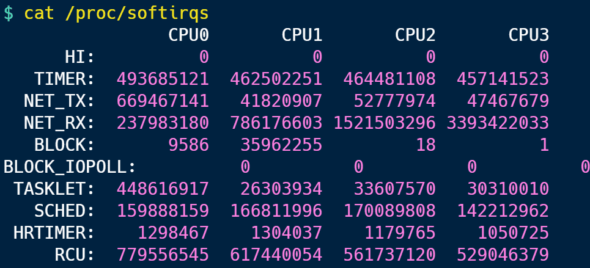
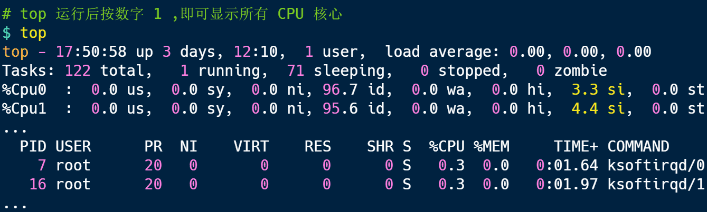
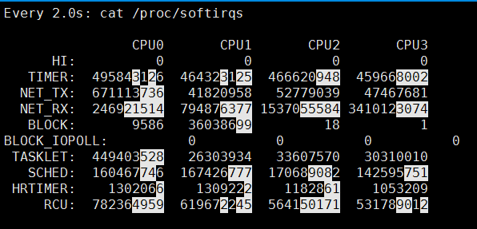
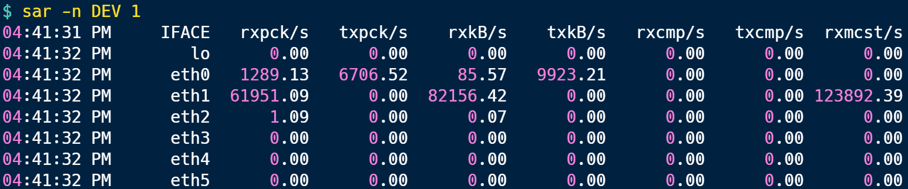

# 什么是软中断？

## 系统里有哪些软中断？

在 Linux 系统里，我们可以通过查看 `/proc/softirqs` 的 内容来知晓「软中断」的运行情况，以及 `/proc/interrupts` 的 内容来知晓「硬中断」的运行情况。

接下来，就来简单的解析下 `/proc/softirqs`文件的内容，我服务器上查看到的文件内容如下：



你可以看到，每一个 CPU 都有自己对应的不同类型软中断的**累计运行次数**，有 3 点需要注意下。

第一点，要注意第一列的内容，它是代表着软中断的类型，在当前的系统里，软中断包括了 10 个类型，分别对应不同的工作类型，比如 `NET_RX` 表示网络接收中断，`NET_TX` 表示网络发送中断、`TIMER` 表示定时中断、`RCU` 表示 RCU 锁中断、`SCHED` 表示内核调度中断。

第二点，要注意同一种类型的软中断在不同 CPU 的分布情况，正常情况下，同一种中断在不同 CPU 上的累计次数相差不多，比如我的系统里，`NET_RX` 在 CPU0、CPU1、CPU2、CPU3 上的中断次数基本是同一个数量级，相差不多。

第三点，这些数值是系统运行以来的累计中断次数，数值的大小没什么参考意义，但是系统的**中断次数的变化速率**才是我们要关注的，我们可以使用 `watch -d cat /proc/softirqs` 命令查看中断次数的变化速率。

前面提到过，软中断是以内核线程的方式执行的，我们可以用 `ps` 命令可以查看到，下面这个就是在我的服务器上查到软中断内核线程的结果：

```apl
$ ps aux | grep softirq
root          16  0.0  0.0      0     0 ?        S    20:18   0:00 [ksoftirqd/0]
root          27  0.0  0.0      0     0 ?        S    20:18   0:00 [ksoftirqd/1]
root          33  0.0  0.0      0     0 ?        S    20:18   0:00 [ksoftirqd/2]
root          39  0.0  0.0      0     0 ?        S    20:18   0:00 [ksoftirqd/3]
root        2949  0.0  0.1   3876  1920 pts/0    S+   20:21   0:00 grep --color=auto softirq
```

可以发现，内核线程的名字外面都有有中括号，这说明 ps 无法获取它们的命令行参数，所以一般来说，名字在中括号里的都可以认为是内核线程。

而且，你可以看到有 4 个 `ksoftirqd` 内核线程，这是因为我这台服务器的 CPU 是 4 核心的，每个 CPU 核心都对应着一个内核线程。

## 如何查看软中断 CPU 使用率过高的问题？

要想知道当前的系统的软中断情况，我们可以使用 `top` 命令查看，下面是一台服务器上的 top 的数据：



上图中的黄色部分 `si`，就是 CPU 在软中断上的使用率，而且可以发现，每个 CPU 使用率都不高，两个 CPU 的使用率虽然只有 3% 和 4% 左右，但是都是用在软中断上了。

另外，也可以看到 CPU 使用率最高的进程也是软中断 `ksoftirqd`，因此可以认为此时系统的开销主要来源于软中断。

如果要知道是哪种软中断类型导致的，我们可以使用 `watch -d cat /proc/softirqs` 命令查看每个软中断类型的中断次数的变化速率。



一般对于网络 I/O 比较高的 Web 服务器，`NET_RX` 网络接收中断的变化速率相比其他中断类型快很多。

如果发现 `NET_RX` 网络接收中断次数的变化速率过快，接下来就可以使用 `sar -n DEV` 查看网卡的网络包接收速率情况，然后分析是哪个网卡有大量的网络包进来。



接着，再通过 `tcpdump` 抓包，分析这些包的来源，如果是非法的地址，可以考虑加防火墙，如果是正常流量，则要考虑硬件升级等。

## 总结

Linux 中的软中断包括网络收发、定时、调度、RCU 锁等各种类型，可以通过查看 /proc/softirqs 来观察软中断的累计中断次数情况，如果要实时查看中断次数的变化率，可以使用 watch -d cat /proc/softirqs 命令。

每一个 CPU 都有各自的软中断内核线程，我们还可以用 ps 命令来查看内核线程，一般名字在中括号里面到，都认为是内核线程。

如果在 top 命令发现，CPU 在软中断上的使用率比较高，而且 CPU 使用率最高的进程也是软中断 ksoftirqd 的时候，这种一般可以认为系统的开销被软中断占据了。

这时我们就可以分析是哪种软中断类型导致的，一般来说都是因为网络接收软中断导致的，如果是的话，可以用 sar 命令查看是哪个网卡的有大量的网络包接收，再用 tcpdump 抓网络包，做进一步分析该网络包的源头是不是非法地址，如果是就需要考虑防火墙增加规则，如果不是，则考虑硬件升级等。
