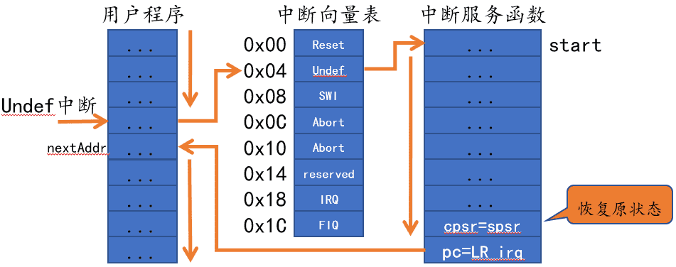
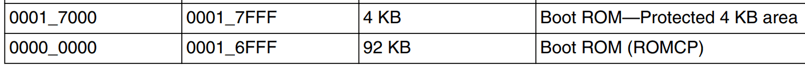
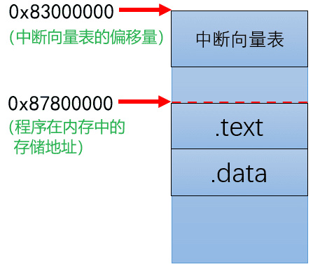
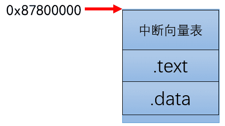

# 认识中断向量表

一个中断系统包含了哪些内容。

-   中断向量表：描述中断对应的中断服务函数，保存在程序开始运行的地方，默认是0x00000000

-   中断控制器（NVIC、GIC）：中断系统的管理机构

-   中断使能：某个外设的中断使能（要使用某个外设的中断，要先使能这个外设的中断）

-   中断服务函数：当中断产生时，中断服务函数就会被调用（中断处理逻辑都在中断服务函数中）

## 中断向量表

### 什么是中断向量表？

中断向量表的作用是描述中断对应的中断服务函数。保存在程序开始运行的地方，默认是0x00000000，可以通过设置中断向量偏移，来改变中断向量表的位置。

Cortex-M 的中断向量表中列举出了所有的中断，每一个中断对应一个中断服务函数；而 Cortex-A 的中断向量表则是将中断分为了 7 类

-   某个中断发生时，先判断属于哪一类

-   然后，去中断向量表找对应类的中断服务函数
-   随后，执行对应的中断服务函数
-   最后，回到程序暂停的下一个位置



中断向量表所写的就是不同中断类型所对应的中断服务函数地址

### 中断类型

中断大致可以分为七种类型，不同的中断类型对应着一种 CPU 工作模式，当中断产生时，CPU 会先切换到对应的模式，然后再处理中断。其中我们最常用的是 Reset 和 IRQ 中断。

-   Reset：CPU 复位以后就会进入复位中断，我们可以在复位中断服务函数里面做一些初始化工作，比如初始化 SP 指针、DDR 等

-   Undefined Instruction：如果指令不能识别的话就会产生此中断
-   SWI：Linux 的系统调用会用 SWI 指令来引起软中断，通过软中断来陷入到内核空间
-   Prefetch Abort：预取指令的出错的时候会产生此中断
-   Data Abort：访问数据出错的时候会产生此中断
-   IRQ：外设中断都会引起此中断的发生
-   FIQ：快速中断，如果需要快速处理中断的话就可以使用此中断

| 偏移地址 | 中断类型                              | 中断模式 |
| -------- | ------------------------------------- | -------- |
| 0x00     | 复位中断(Reset)                       | SVC      |
| 0x04     | 未定义指令中断(Undefined Instruction) | Undef    |
| 0x08     | 软中断(Software Interrupt,SWI)        | SVC      |
| 0x0C     | 指令预取中止中断(Prefetch Abort)      | Abort    |
| 0x10     | 数据访问中止中断(Data Abort)          | Abort    |
| 0x14     | 保留(Reserved)                        | -        |
| 0x18     | IRQ 中断(IRQ Interrupt)               | IRQ      |
| 0x1C     | FIQ 中断(FIQ Interrupt)               | FIQ      |

注意：因为中断向量表是放在程序运行的起始位置，所以这里的偏移位置是相对于起始位置而言的

## 为什么要设置中断向量表偏移

### 原因分析

中断向量表保存在程序运行的起始位置，默认是 0x00000000。根据参考手册中的内存映射表我们发现，0x00000000 的位置保存了 boot rom，也就是设备上电启动的相关内容，为了不占用其他部分的内容，我们决定对中断向量表施加一个偏移。



中断控制器（GIC）可以配置中断向量表的偏移位置。裸机开发的环境下，我一般在Reset 中断服务函数中手动指定中断向量表的位置；在有 OS 的环境下，OS 会初始化中断控制器，并将中断向量表放置在一个没有被保留的地址空间中。

### 如何确定偏移量

考虑到 RAM 和 DDR 的范围，我们一般将程序保存在 DDR 中。

-   RAM：CPU内部的一段可用内存，imx6ull内部RAM的大小为128K（0X900000~0X91FFFF）
-   DDR：CPU外的存储器，封装在SOC 中，DDR的大小为 256M 或者 512M（虽然看着有2048，但是受到总线约束，CPU可访问的大小是256M）


DDR 的范围较广，考虑到后续的系统移植，所以使用的是DDR。假设中断向量表设为 0x83000000，其实就是在告诉CPU，中断发生时，到 0x83000000 的位置去找对应的中断服务函数。



其实我们也可以将中断向量表和存储地址都设置成 0x87800000



### 如何设置

>   通过汇编设置

如果是汇编形式，建议放在 Reset 中断服务函数中，因为设备上电就会触发 Reset 中断，然后去执行 Reset 中断服务函数。

```c
/* 复位中断服务函数 */
Reset_Handler:
    /* ... */

    ldr r0, =0x87800000         /* 设置中断向量表的偏移 */
	dsb
	isb
	mcr p15, 0, r0, c12, c0, 0
	dsb
	isb

    /* ... */
```

>   调用 C 函数

我们可以直接调用 C 函数来设置中断向量表，只要在中断发生之前设置即可。一般放在中断初始化的函数中。

```c
/* 设置中断向量表偏移 */
__set_VBAR((uint32_t)0x87800000);
```

## 汇编编写中断向量表框架

### 局部流程

中断向量表保存在程序运行的起始位置，默认是 0x00000000。其实就是在告诉内核，每一个中断对应的中断服务函数位置在哪。假设我们要设置 Reset 中断的服务函数地址。

```c
.global _start

_start:
    /* 把 Reset_Handler 的地址保存到 pc 指向的位置 */
    ldr pc, =Reset_Handler


/* 复位中断服务函数 */
Reset_Handler:
    b Reset_Handler      @ 暂时先死循环，后面再修改
```

pc 是程序计数器，用于保存下一次要执行的指令地址。默认情况下，程序从 0x00000000 开始执行，即 pc 最开始拿到的地址就是 0x00000000，这里其实就把 Reset_Handler 的地址保存到了 0x00000000 的位置。

随后，pc 会指向下一个地址，即 0x00000004。

### 整体框架

其他中断也是类似的，我们借助pc寄存器的地址自动递增的特性，逐个设置各个中断服务函数的地址。至于具体实现，这里有 Reset 中断 和 IRQ 中断的汇编部分。

-   ① Reset中断：仅包含汇编部分，因为一般只有在复位或者刚上电的时候才会触发，没有需要特意实现的逻辑。Reset 中断服务函数（汇编部分）

-   ② IRQ 中断：包含汇编部分和 C代码部分。
    -   汇编部分用于初始化环境
    -   C 代码部分用于逻辑实现

```c
_start:
    ldr pc, =Reset_Handler          /* 复位中断 */
    ldr pc, =Undefined_Handler      /* 未定义指令中断 */
    ldr pc, =SVC_Handler            /* SVC(Supervisor)中断*/
    ldr pc, =PrefAbort_Handler      /* 预取终止中断 */
    ldr pc, =DataAbort_Handler      /* 数据终止中断 */
    ldr pc, =NotUsed_Handler        /* 保留中断 */
    ldr pc, =IRQ_Handler            /* IRQ 中断 */
    ldr pc, =FIQ_Handler            /* FIQ(快速中断) */

/* 复位中断 */
Reset_Handler:
    b Reset_Handler

/* 未定义指令中断 */
Undefined_Handler:
    b Undefined_Handler

/* SVC */
SVC_Handler:
    b SVC_Handler

/* 预取终止中断 */
PrefAbort_Handler:
    b PrefAbort_Handler

/* 数据终止中断 */
DataAbort_Handler:
    b DataAbort_Handler

/* 保留中断 */
NotUsed_Handler:
    b NotUsed_Handler

/* IRQ 中断 */
IRQ_Handler:
    b IRQ_Handler

/* FIQ(快速中断) */
FIQ_Handler:
    b FIQ_Handler
```

