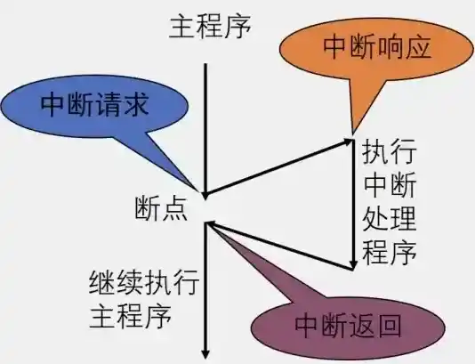

# 中断相关问题

## 如果中断超时了怎么办？

中断超时是嵌入式系统和实时系统中常见的故障，通常由中断服务程序（ISR）执行时间过长、硬件配置错误或资源竞争导致。以下是针对中断超时的处理方法和解决方案，结合搜索结果中的关键信息进行说明：

### 中断超时的原因分析

**中断服务程序（ISR）执行时间过长**

-   ISR中包含复杂计算、阻塞操作（如循环等待）或未优化的代码，导致无法在规定时间内完成。
-   例如：DMA传输未完成时卡住中断，或未正确处理外设事件。

**硬件配置错误**

-   DMA缓冲区地址未正确初始化、总线冲突或外设驱动不兼容。
-   中断优先级设置不合理，高优先级中断阻塞低优先级中断。

**资源竞争与死锁**

-   中断嵌套过深导致栈溢出，或临界区未正确保护共享资源（如全局变量）。
-   任务看门狗（Watchdog）未及时喂狗，尤其在ISR中未处理。

**系统负载过高**

-   高频率中断或并发任务过多，CPU无法及时响应所有中断。

### 中断超时的解决方案

#### 优化中断服务程序（ISR）

缩短ISR执行时间：

-   仅保留关键操作（如标志位设置、DMA触发），将耗时逻辑移至主循环或任务（Bottom Half处理）。
-   避免浮点运算、动态内存分配和非可重入函数调用。

使用硬件加速：

-   通过DMA完成数据传输，减少CPU干预。
-   利用硬件FIFO或事件系统（如ARM Cortex-M的NVIC）降低中断频率。

#### 调整中断配置

合理设置中断优先级：

-   确保关键中断（如定时器、通信）优先级高于非关键中断。
-   避免中断嵌套过深（如限制嵌套层数为3层）。

启用中断看门狗（Interrupt WDT）：

-   设置超时阈值，超时后触发系统复位或错误处理例程。

#### 检查硬件与驱动

验证DMA配置：确保DMA缓冲区地址正确，传输模式匹配外设需求（如双缓冲模式）。

更新驱动与固件：修复已知的硬件驱动Bug（如ESP-IDF版本兼容性问题）。

#### 系统级优化

动态调整中断策略：

-   根据负载动态启用/禁用非关键中断，或调整中断频率。
-   在多核系统中，将中断绑定到专用核心。

日志与调试工具：

-   分析中断堆栈，定位超时代码。
-   记录中断响应时间（如通过GPIO翻转测量）。

#### 超时后的补救措施

-   强制中断退出：若ISR超时，通过硬件复位或软件中断（如NVIC_SystemReset()）恢复系统。
-   状态回滚与错误恢复：保存关键状态至备份寄存器，超时后回滚至安全状态。

### 预防中断超时的最佳实践

**设计阶段**

-   采用分层中断处理模型：ISR仅标记事件，任务处理逻辑。
-   使用静态分析工具验证ISR执行路径的安全性。

**测试阶段**

-   模拟高负载场景，测试中断响应时间的稳定性。
-   注入错误（如DMA传输失败），验证系统容错能力。

**运行时监控**

-   启用实时性能计数器（如ARM DWT模块）监控中断延迟。
-   定期检查看门狗喂狗状态。

### 总结

中断超时的处理需结合硬件配置、代码优化和系统设计。核心原则是**最小化ISR负载**、**确保硬件正确性**，并通过**分层处理**和**动态监控**提升系统鲁棒性。对于实时性要求高的场景（如自动驾驶），还需引入冗余机制（如双核热备份）。

## 软中断和硬中断的区别？



触发方式

-   软件中断：由程序中的指令主动触发，是程序员在编写程序时根据需要设置的，例如在操作系统中，应用程序通过系统调用指令触发软件中断来请求操作系统提供服务。
-   硬件中断：由硬件设备产生，通常是由于外部事件发生，如键盘按键按下、鼠标移动、定时器溢出等，硬件会向CPU发送中断信号。

中断源

-   软件中断：由软件指令引发，是程序在执行过程中主动通过特定指令触发的，如系统调用或调试程序时设置的断点等。
-   硬件中断：由硬件设备引发，如外部设备（键盘、鼠标、网卡等）完成数据传输、发生故障，或内部硬件（如定时器）达到设定时间等情况，是外部或硬件内部事件触发的。

中断响应机制

-   硬件中断：CPU需通过中断控制器接收中断信号，根据中断向量表找到对应中断处理程序入口地址来响应。
-   软件中断：执行到软件中断指令时，CPU根据指令中提供的信息直接跳转到相应中断处理程序。

响应速度

-   软件中断：通常响应速度相对较慢，因为它需要通过程序中的指令来触发，涉及到指令的执行和系统的调度等过程。
-   硬件中断：响应速度较快，硬件中断信号直接发送给CPU，CPU可以立即响应并暂停当前正在执行的程序，转而处理中断事件。

中断目的

-   硬中断：主要用于通知CPU外部设备状态变化或请求服务，让CPU及时处理设备数据传输、响应外部事件，确保系统与外部设备高效协同工作。
-   软中断：用于实现系统功能调用、程序调试、异常处理等，使程序能获取操作系统服务或处理特定软件事件。

优先级

-   软件中断：
    -   优先级一般由软件设计决定，可根据具体需求进行调整，通常与触发中断的程序或事件重要性相关，系统调用类软件中断一般有固定优先级。
    -   通常相对较低，因为它是程序内部主动触发的，不会像硬件中断那样紧急。
-   硬件中断：
    -   优先级通常是固定的，并且根据硬件设备的重要性和紧急程度进行设置。例如，一些关键的硬件设备如电源故障检测设备的中断优先级会很高，以确保系统能够及时响应并采取措施。
    -   不同硬件设备的中断有不同优先级，以确保重要设备中断能优先被处理，如硬盘数据传输中断优先级可能高于键盘输入中断。

## 中断时可否睡眠

在处理器中，中断和睡眠是两个不同的概念，通常它们之间是相互独立的。以下是关于在处理中断时是否可以进行睡眠的一些关键点：

### 中断处理

中断（Interrupt） 是由硬件或软件事件触发的信号，用于暂停当前执行的程序，以便处理某些紧急任务（如输入输出操作、定时器到期等）。中断服务例程（ISR）是在发生中断后执行的特殊代码，必须迅速完成以恢复主程序的执行。

### 睡眠状态

睡眠通常意味着让当前线程或进程暂停一段时间，不再占用 CPU 资源。

在某些编程环境和操作系统中，可以调用 `sleep` 或 `delay` 函数来实现这一点。

### 在中断上下文中的睡眠

通常情况下，在处理中断服务例程（ISR）时是不应当调用任何可能导致线程睡眠的函数。这是因为：

-   如果 ISR 被中断并进入休眠状态，会造成系统不响应其他重要的事件，从而引发延迟或丢失数据。
-   大多数操作系统会禁止在 ISR 中使用阻塞操作，以确保实时性和响应速度。

### 合适的位置

一般来说，如果需要在某个条件下进行睡眠，你应该在非中断上下文中执行。你可以设置一个标志位或信号量，由主循环监测该标志位，当条件满足时再进行适当的休眠。

【示例】假设我们有一个简单的设备驱动程序，其中使用了 ISR 和主循环来控制行为：

```c
volatile bool condition = false;

void interrupt_handler() {
    // 中断服务例程
    // 设置某个条件
    condition = true;
}

int main() {
    while (true) {
        if (condition) {
            // 执行一些操作
            // 重置条件
            condition = false;
        } else {
            // 可以安全地调用 sleep，而不是在 ISR 中调用
            sleep(1); // 或 delay(1000);
        }
    }
}
```

## 如何高效处理中断

### 硬件层面的优化

1、合理设置中断优先级

许多微控制器和处理器都支持中断优先级机制。通过对不同中断源设置合理的优先级，可以确保关键的中断能够及时得到处理。例如，在一个同时包含定时器中断和外部通信中断的系统中，如果通信中断对于实时性的要求更高，如接收紧急的控制指令，那么应该将通信中断的优先级设置得高于定时器中断。这样，当通信中断发生时，能够优先处理通信数据，避免因定时器中断的干扰而导致通信数据丢失或延迟。

了解硬件的中断嵌套功能。一些高级的硬件平台允许高优先级中断打断低优先级中断的处理过程。在设计系统时，需要谨慎使用中断嵌套，因为过度的嵌套可能会导致栈溢出或系统复杂性增加。但在某些对实时性要求极高的场景下，合理的中断嵌套可以有效地提高系统的响应速度。

2、优化中断控制器设置

正确配置中断控制器的触发方式（如边沿触发或电平触发）。边沿触发适合于只需要检测信号变化瞬间的情况，例如按键按下的瞬间产生的中断；电平触发则适用于需要在信号保持特定电平期间持续响应的情况，如检测外部设备的就绪信号。选择合适的触发方式可以避免不必要的中断产生。

对于具有中断屏蔽功能的中断控制器，合理地屏蔽和解除屏蔽中断。在进入关键代码段（如对共享资源进行操作的代码）时，可以暂时屏蔽一些可能会干扰当前操作的中断，待操作完成后再解除屏蔽。但要注意，过长时间地屏蔽中断可能会导致系统对外部事件的响应延迟，因此需要谨慎权衡。

### 软件层面的优化

⑴采用中断上半部和下半部机制

中断上半部用于处理紧急的、对时间要求极高的操作。例如，在网络设备接收数据的中断中，上半部可以快速读取接收到的数据寄存器中的数据，将数据存储到一个临时缓冲区中，并设置一个标志位表示数据已接收。这个过程应该尽可能地快速，以减少中断响应时间。

中断下半部用于处理那些相对不紧急、可以延迟处理的操作。比如，对接收的数据进行复杂的协议解析、数据处理等操作可以放在下半部。常见的实现下半部的方式有软中断、tasklet（在 Linux 内核中有广泛应用）等。这样可以避免在中断处理程序中执行过多耗时的操作，从而减少对系统实时性的影响。

⑵优化中断服务程序（ISR）代码

保持中断服务程序的代码简洁高效。避免在 ISR 中进行复杂的计算、大量的循环或函数调用。例如，尽量减少乘法、除法等耗时的算术运算。如果必须进行一些复杂的操作，可以考虑将其分解为多个简单的步骤，将一部分步骤移到中断下半部或者其他合适的地方处理。

减少中断服务程序中的内存分配和释放操作。内存分配操作通常涉及到复杂的内存管理算法，可能会导致中断处理时间变长。如果需要使用缓冲区来存储数据，可以在系统初始化时预先分配好，或者采用静态分配的方式。

⑶使用合适的并发控制机制：

当多个中断可能会访问共享资源（如全局变量、硬件寄存器等）时，需要使用合适的并发控制机制。例如，在多中断环境下，可以使用自旋锁或互斥锁来保护共享资源。自旋锁适用于锁被占用时间较短的情况，因为它会让等待锁的线程（在中断处理程序中可以看作是等待锁的中断处理过程）一直循环等待，直到锁被释放；互斥锁则适用于锁可能被长时间占用的情况，当锁不可用时，等待的线程会进入睡眠状态，避免浪费 CPU 资源。

对于中断与主程序（进程或线程）之间共享资源的情况，也需要进行有效的同步。可以通过信号量、条件变量等机制来实现。例如，当主程序需要访问一个可能会被中断修改的变量时，先获取相应的信号量，确保在访问期间不会被中断修改，访问完成后再释放信号量。

### 系统层面的优化

⑴负载均衡考虑

在多核处理器系统中，考虑将中断处理任务均衡地分配到不同的核心上。有些硬件平台支持中断亲和性设置，即可以指定某个中断由特定的核心来处理。通过合理地分配中断，可以避免某个核心负载过重，而其他核心闲置的情况，从而提高系统的整体性能。

对于一些高负载的中断源，可以采用分布式处理的方式。例如，在一个大型的数据采集系统中，如果有多个相同类型的传感器产生中断，可以将这些中断分配到不同的处理单元（可以是不同的处理器核心或者不同的微控制器）进行预处理，然后再将处理后的结果汇总，这样可以有效地减轻单个处理单元的负担。

⑵性能测试与调优

利用性能测试工具来监测中断处理的性能。例如，在嵌入式系统中，可以使用示波器来测量中断响应时间，通过在中断引脚触发中断的同时，在另一个引脚输出一个时间标记信号，然后观察这两个信号之间的时间差来确定中断响应时间。在操作系统环境下，可以使用系统自带的性能监测工具或者第三方工具来监测中断处理过程中的 CPU 使用率、中断延迟等指标。

根据性能测试的结果，针对性地进行调优。如果发现某个中断的响应时间过长，可以检查该中断的服务程序代码、优先级设置、硬件连接等方面是否存在问题，并进行相应的优化。同时，还可以通过调整系统参数（如中断队列长度、定时器周期等）来改善中断处理的性能。

## 中断会打断原子操作吗

中断是否会打断原子操作，取决于**原子操作的具体实现方式**和**处理器的架构特性**。以下是关键分析：

### 原子操作的定义与中断的关系

原子操作是指**不可分割的操作**，即在执行过程中不会被中断或其他线程干扰。其核心特性包括：

-   **不可分割性**：操作要么完整执行，要么完全不执行，不存在中间状态。
-   **线程安全**：在多线程或多核环境中，原子操作能避免数据竞争。

**中断的本质**是临时打断当前执行流，转去处理更高优先级的事件。因此，若原子操作未采取保护措施，中断可能破坏其不可分割性。

### 中断对原子操作的影响场景

>   （1）单处理器系统

单指令原子操作：若原子操作由单条CPU指令完成（如x86的INC指令），由于中断只能发生在指令之间，此类操作不会被中断打断。

-   示例：8位MCU对uint8_t变量的读写通常只需一条指令，天然具备原子性。

多指令操作：若原子操作需多条指令（如i++包含“读取→修改→写入”三步），中断可能插入中间步骤，导致数据不一致。

-   风险场景：主程序更新32位时间戳时被中断打断，可能读到“半旧半新”的值（如2024年与2025年混合的日期）。

>   （2）多处理器系统

缓存一致性问题：即使单指令操作在单核中原子，多核环境下可能因缓存同步延迟导致其他核读到旧值。
-   解决方案：需硬件支持（如x86的LOCK前缀、ARM的LDREX/STREX指令）或内存屏障。

### 如何确保原子操作不被中断打断

>   （1）硬件支持

原子指令：现代处理器提供专用指令（如x86的LOCK CMPXCHG、ARM的LDREX/STREX），通过总线锁定或独占监控器保证原子性。

关中断：在单处理器系统中，禁用中断可临时阻止打断，但会牺牲实时性。

```
__disable_irq();  // 关闭中断
u8TimerTick++;    // 原子操作
__enable_irq();   // 恢复中断
```

>   （2）软件设计

-   使用原子类型：如C的sig_atomic_t或C++的std::atomic，编译器自动生成安全代码。
-   临界区保护：通过锁或自旋锁隔离共享资源，但需注意死锁风险。

### 典型错误与解决方案

问题：中断嵌套时，低优先级中断的中间结果被高优先级中断覆盖。

案例：定时器中断更新计数器时被更高优先级中断抢占，导致计数错误。

解决：

-   使用被调用者保存寄存器（如ARM的R4-R11）避免寄存器冲突。

-   拆分操作为顶半部（快速响应）和底半部（延迟处理）。

### 总结

-   单指令原子操作：通常不会被中断打断（依赖硬件支持）。
-   多指令操作：需通过关中断、原子指令或锁机制保护。
-   多核系统：需结合缓存一致性协议和原子指令（如LOCK或LL/SC）。

**关键原则**：原子性需硬件与软件协同保障，中断安全设计需结合具体场景（如实时性要求、架构特性）。

## 中断对多核处理器的影响是什么

中断对多核处理器的影响主要体现在**性能、负载均衡、实时性**和**资源竞争**等方面。多核架构虽然提升了并行处理能力，但中断机制的设计与优化直接决定了系统的整体效率。以下是具体分析：

### 中断对CPU核心的局部化影响

**单核中断集中**：硬中断（如磁盘、网卡中断）通常由特定CPU核心处理（如通过IRQ亲和性绑定）。若某个核心频繁处理中断，可能导致其负载过高，而其他核心闲置，形成负载不均。例如，单队列网卡的中断集中在一个核心时，会成为网络吞吐量的瓶颈。

优化策略：

-   使用多队列网卡（如MSI-X），将中断分散到多个核心。
-   动态调整中断亲和性（如Linux的irqbalance）。

**软中断的核间竞争**：软中断（如I/O请求）由当前运行进程触发，可能在不同核心上产生。若多个核心同时处理软中断，可能因共享资源（如内存总线）导致竞争。

优化策略：

-   限制软中断的并发处理数量（如Linux的softirqd线程绑定）。

### 中断对多核并行性的影响

**中断嵌套与优先级冲突**：多核环境下，高优先级中断可能抢占低优先级中断的处理，若不同核心上的中断处理程序访问共享资源（如锁），可能导致**死锁或数据竞争**。例如，核心A处理低优先级中断时持有锁，核心B的高优先级中断尝试获取同一锁时被阻塞。

优化策略：

-   采用中断优先级分层，确保高优先级中断不依赖低优先级资源。
-   使用无锁数据结构或细粒度锁减少冲突。

**核间通信开销**：中断处理可能触发核间通信（如缓存同步、信号量操作），增加延迟。例如，一个核心处理完网卡中断后需通知另一核心处理数据包，导致额外的同步成本。

优化策略：

-   利用NUMA架构的本地化中断分配（如绑定中断到数据所在的NUMA节点）。

### 中断对系统性能的全局影响

**中断延迟与实时性**
 多核系统中，中断延迟受核心负载影响。若高优先级中断被分配到繁忙核心，可能导致实时任务响应超时。

优化策略：

-   实时系统（如RTOS）需将关键中断绑定到专用核心，并禁用抢占。
-   使用中断线程化（如Linux的threaded IRQ），将中断处理转为用户线程，减少内核态阻塞。

**中断风暴与稳定性风险**：高频中断（如网络小包洪水）可能导致多个核心同时陷入中断处理，耗尽CPU资源。

优化策略：

-   合并中断（如NAPI机制）或启用中断 coalescing（延迟处理）。
-   限制中断频率（如硬件速率限制）。

### 中断与多核资源管理的协同优化

1.  **负载均衡策略**：动态中断分配（如基于CPU利用率调整亲和性）可提升多核利用率。例如，Linux的irqbalance根据负载实时迁移中断。

    挑战：频繁迁移可能降低缓存命中率。

2.  **能效与功耗**：中断处理可能唤醒空闲核心，增加功耗。通过**中断聚合**或**低功耗核心绑定**可优化能效

### 总结与建议

| **影响维度** | **关键问题**   | **优化方案**              | **适用场景**       |
| ------------ | -------------- | ------------------------- | ------------------ |
| 负载均衡     | 单核过载       | 多队列网卡、动态IRQ亲和性 | 高吞吐网络服务     |
| 实时性       | 中断延迟不可控 | 核心隔离、中断线程化      | 工业控制、自动驾驶 |
| 资源竞争     | 锁冲突/死锁    | 无锁编程、优先级分层      | 多核数据库         |
| 能效         | 频繁核心唤醒   | 中断聚合、低功耗核心绑定  | 移动设备、边缘计算 |

未来多核中断处理的趋势包括**硬件辅助中断虚拟化**（如Intel VT-d）和**AI驱动的动态调度**，以进一步平衡性能与复杂度。

## 基于中断的实时编程结构的实时性取决于什么？

（1）硬件性能

-   CPU处理能力：强大的CPU能快速响应中断，处理中断服务程序和其他任务，减少中断处理的延迟和任务切换的时间。
-   中断控制器性能：高效的中断控制器可管理多个中断源，快速仲裁中断优先级，确保重要中断能及时得到响应。

（2）系统软件开销

-   操作系统内核开销：精简高效的操作系统内核可减少任务调度、内存管理等操作的时间，使中断处理和实时任务能更快获得资源。
-   驱动程序效率：设备驱动程序负责与硬件交互，高效的驱动程序能快速处理中断请求，减少数据传输和处理的延迟。

（3）外部干扰与不确定性

-   硬件故障：硬件设备故障可能导致中断异常或数据传输错误，影响系统实时性。
-   电磁干扰：外部电磁干扰可能影响硬件信号传输，导致中断信号丢失或错误，干扰系统的正常运行。

## 中断下半部的三种方式？有什么区别？

软中断、tasklet、工作队列

tasklet基于软中断，动态注册，而软中断是静态注册。

工作队列运行在进程上下文，可休眠，而tasklet/softirq是中断上下文，不可休眠

### 三种中断下半部机制

#### 软中断（Softirq）

定义：软中断是内核静态定义的底层机制，通过softirq_action结构表示，编译时注册，不可动态创建。

特点：

-   执行在中断上下文，不可睡眠，且同一类型软中断可在不同CPU上并行执行。
-   优先级高，通常用于网络、定时器等对实时性要求高的场景。

使用示例：

```
#include <linux/interrupt.h>
DECLARE_SOFTIRQ(MY_SOFTIRQ, my_handler);  // 静态注册
open_softirq(MY_SOFTIRQ, my_handler);     // 注册处理函数
raise_softirq(MY_SOFTIRQ);                // 触发软中断
```

#### Tasklet

定义：基于软中断实现的上层抽象，通过tasklet_struct结构表示，可动态创建。

特点：

-   同样在中断上下文执行，不可睡眠，但同一Tasklet不会在多个CPU上并行执行（保证原子性）。
-   接口简单，适合大多数驱动场景（如按键中断后的数据处理）。

使用示例：

```
DECLARE_TASKLET(my_tasklet, my_tasklet_func, data); // 静态声明
tasklet_schedule(&my_tasklet);                     // 调度执行
```

#### 工作队列（Workqueue）

定义：将任务推迟到进程上下文执行，由内核线程（如events/n）处理。

特点：

-   可睡眠，适合耗时操作（如I/O、内存分配）。
-   灵活性高，但延迟较大（因涉及进程调度）。

使用示例：

```
DECLARE_WORK(my_work, my_work_handler);  // 静态声明
schedule_work(&my_work);                 // 调度执行
```

### 三种机制的区别

| **特性**       | **软中断（Softirq）**    | **Tasklet**      | **工作队列（Workqueue）** |
| -------------- | ------------------------ | ---------------- | ------------------------- |
| **执行上下文** | 中断上下文               | 中断上下文       | 进程上下文                |
| **是否可睡眠** | ❌ 不可                   | ❌ 不可           | ✅ 可                      |
| **并行性**     | 同类型可跨CPU并行        | 同一Tasklet串行  | 任务可跨CPU调度           |
| **注册方式**   | 静态编译时注册           | 动态或静态注册   | 动态注册                  |
| **适用场景**   | 高频、实时任务（如网络） | 轻量级非紧急任务 | 耗时、可能阻塞的任务      |
| **优先级**     | 最高（如`HI_SOFTIRQ`）   | 低于软中断       | 最低（进程调度延迟）      |

### 选择建议

1.  需要极低延迟：优先选择软中断（如网络包处理），但需注意并发安全。
2.  简单异步任务：使用Tasklet（如中断后更新数据结构），避免软中断的复杂性。
3.  复杂或阻塞操作：必须用工作队列（如文件I/O或信号量操作）。

### 典型问题与优化

-   软中断负载过高：可通过ksoftirqd内核线程分担压力。
-   Tasklet调度冲突：确保同一Tasklet不会被重复调度。
-   工作队列延迟：创建专用内核线程（如create_workqueue）提升优先级。

### 总结

三种机制的核心差异在于**执行上下文**和**并发模型**：

-   **软中断**和**Tasklet**适用于中断上下文，前者适合高性能并行，后者简化同步；

-   工作队列通过进程上下文支持阻塞操作，牺牲实时性换取灵活性。

实际开发中，Tasklet和工作队列最常用，软中断通常由内核核心模块使用。

## 中断的优先级一定会比高优先级的线程先调度吗？

### 中断优先级与线程优先级的基本关系

>   中断优先级普遍高于线程优先级

 在大多数实时系统（如FreeRTOS、ThreadX）中，**中断的优先级始终高于任何用户线程的优先级**。这意味着当中断触发时，无论当前运行的线程优先级多高，CPU都会立即暂停该线程，转去执行中断服务程序（ISR）。

示例：FreeRTOS中，中断优先级数值越小优先级越高，而任务优先级数值越小优先级越低。即使最高优先级的任务也会被任何中断打断。

>   中断嵌套与抢占机制

-   如果系统支持中断嵌套，更高优先级的中断可以抢占正在执行的低优先级中断，但线程无法抢占任何中断。
-   关键区别：中断是硬件触发的异步事件，线程是软件调度的任务，前者对实时性要求更高。

### 二、例外情况与特殊配置

**中断屏蔽与临界区保护**

-   线程可以通过提升中断请求级别（如将中断优先级设为不可屏蔽）临时禁止中断响应。例如，在单核系统中，线程进入临界区时可能提升中断优先级到`DISPATCH_LEVEL`，此时即使高优先级中断也无法打断。
-   风险：过度屏蔽中断可能导致实时性下降，需谨慎使用。

**实时系统的动态调整**

-   某些系统允许动态调整中断优先级。
-   实践建议：通常仅对非关键中断（如日志打印）降级，关键中断（如硬件故障）仍需保持最高优先级。

### 总结

默认情况下：中断优先级必然高于线程优先级，确保实时性。

例外情况：通过临界区或动态配置可临时调整优先级，但需权衡实时性与安全性。

设计原则：

1.  关键中断保持最高优先级；
2.  避免在ISR中执行耗时操作；
3.  合理划分线程与中断的职责边界。

## Tasklet、workqueue 和内核线程区别？

Tasklet 基于软中断实现，运行在中断上下文，不可睡眠，适合短时不可中断任务；

workqueue 通过内核线程（kworker）实现，运行在进程上下文，允许睡眠和阻塞，适合耗时操作；

而内核线程是独立调度实体，运行在进程上下文，用于通用后台任务，可自由调度和休眠

## 如果中断过程中不关中断会发生什么？

在中断处理过程中如果不关闭中断（即保持中断使能状态），可能会导致以下问题：

>   中断嵌套失控

高优先级中断频繁抢占：如果不关中断，更高优先级的中断可以随时打断当前中断服务程序（ISR），导致嵌套深度增加。这会引发以下问题：
-   堆栈溢出：每次嵌套都需要保存现场（如寄存器、返回地址），频繁嵌套可能导致内核栈耗尽。
-   实时性下降：低优先级中断可能因高优先级中断的持续抢占而无法及时执行，影响系统响应。

优先级反转：低优先级中断可能因嵌套在高优先级中断中执行，实际获得更高执行权，导致调度混乱。

>   中断丢失或重复触发

中断标志未及时清除：若中断处理中未关闭中断，且未及时清除硬件中断标志位，同一中断可能被重复触发，导致ISR多次执行。

中断风暴：高频中断（如网络小包）可能因未屏蔽而持续抢占CPU，导致系统负载激增甚至崩溃。

>   数据一致性问题

共享资源竞争：中断上下文中访问共享资源（如全局变量）时，若未关中断，其他中断可能同时修改该资源，引发数据竞争或死锁。

原子性破坏：关键操作（如任务切换、内存分配）可能因中断打断而无法完成，导致系统状态不一致。

>   系统稳定性风险

中断上下文阻塞：Linux等系统禁止在中断上下文中睡眠或调用可能阻塞的函数。若不关中断，嵌套中断可能意外触发阻塞操作（如调用schedule()），直接引发内核崩溃。

不可预测行为：未受控的中断嵌套可能导致寄存器状态混乱、返回地址错误等，最终引发硬件异常或系统复位。

>   性能开销增加

频繁上下文切换：每次中断嵌套都需要保存/恢复现场，增加CPU开销，降低整体吞吐量。

缓存抖动：中断处理中频繁切换执行流可能导致CPU缓存效率下降，进一步拖慢性能。

### 解决方案与最佳实践

1.  合理关中断：在ISR关键路径（如操作共享资源、清除中断标志）中短暂关闭中断，完成后立即恢复。
2.  分层处理：采用Linux的“上半部（快速关中断处理硬件操作）+下半部（开中断延迟处理）”机制，平衡响应速度与安全性。
3.  优先级管理：通过NVIC（嵌套向量中断控制器）合理配置中断优先级，避免非必要嵌套。
4.  标志位及时清除：在ISR中优先清除硬件中断标志，防止重复触发。

### 总结

不关中断可能导致嵌套失控、数据竞争、系统崩溃等问题。**关键是要在“快速响应”与“稳定性”之间权衡**：短暂关中断保护关键操作，同时通过分层设计（如上半部/下半部）减少关中断时间。在实时性要求高的场景（如嵌入式系统），需结合硬件特性（如Cortex-M的自动嵌套支持）优化中断管理。

## 什么是中断线程化吗？

中断线程化（Interrupt Threading）是一种将中断处理程序（ISR）从传统的直接执行模式转移到内核线程中执行的机制，旨在提高系统的实时性、可维护性和响应效率。以下是其核心要点：

>   基本概念

中断线程化将中断处理分为两部分：

-   上半部（Top Half）：在关中断状态下快速执行，仅处理与硬件相关的紧急任务（如中断确认），耗时极短。
-   下半部（Bottom Half）：通过内核线程异步执行耗时操作（如数据处理），避免长时间阻塞中断上下文。

>   与传统中断处理的区别

-   传统方式：中断直接抢占当前任务，且不支持嵌套，可能导致高延迟和中断丢失。
-   线程化方式：中断处理线程（如irq/xx）以实时线程（如SCHED_FIFO优先级50）运行，可被调度器管理，减少对进程的干扰。

>   实现机制

-   主动线程化：驱动调用request_threaded_irq()注册thread_fn，上半部返回IRQ_WAKE_THREAD唤醒线程。
-   强制线程化：通过内核配置CONFIG_IRQ_FORCED_THREADING和启动参数threadirqs，将未显式线程化的中断强制转为线程处理（除非标记IRQF_NO_THREAD）。

>   总结

中断线程化通过将中断处理移至内核线程，平衡了实时性与系统稳定性，尤其适合现代多任务和高并发场景。其核心思想是**最小化关中断时间，最大化可调度性**，是Linux实时化（如PREEMPT-RT补丁）的关键技术之一。

## 如果中断中printk输出一万个字符会怎么样？

在中断上下文中使用 `printk` 输出大量字符（如一万个字符）可能导致以下问题，需结合中断上下文和 `printk` 的设计特性综合分析：

### 系统响应延迟与中断丢失

-   **中断处理时间过长**：`printk` 在中断上下文中执行时，会阻塞当前中断的退出。若输出一万个字符（尤其是通过慢速设备如串口），耗时可能达数百毫秒（假设115200波特率下，单个字符约70μs，一万字符约700ms）。这会导致：
    -   **中断嵌套被抑制**：高优先级中断无法及时响应，可能丢失关键硬件事件（如定时器中断）。
    -   **实时性破坏**：对实时系统（如工业控制）可能引发任务调度超时或设备故障。
-   **中断风暴风险**：若中断频繁触发且每次调用 `printk`，可能形成“打印-中断-打印”的死循环，导致系统卡死。

### 内核日志缓冲区溢出

-   环形缓冲区容量限制：printk使用固定大小的环形缓冲区（如 __LOG_BUF_LEN，通常为几KB到几MB）。若短时间内写入一万字符，可能覆盖未读取的旧日志，导致关键调试信息丢失。
-   控制台阻塞：若日志通过串口输出，慢速设备会进一步加剧缓冲区积压，可能触发内核的速率限制机制（如 printk_ratelimit）自动丢弃消息。

### 性能与稳定性问题

-   CPU资源占用：printk 在中断中执行会占用大量CPU时间，可能导致：
    -   调度延迟：抢占式内核中，高负载打印会延迟进程调度，影响多任务性能。
    -   锁竞争加剧：若多个中断并发调用 printk，可能引发缓冲区访问的锁竞争，增加系统不确定性。
-   硬件依赖性问题：某些架构（如嵌入式设备）的 early_printk 或串口驱动可能无法处理高频大数据量输出，导致硬件挂起或数据损坏。

### 调试与生产环境差异

-   开发阶段的误判：调试时可能因 printk的延时掩盖了竞态条件（如某些I2C中断依赖 printk 的延迟才能正常工作），导致生产环境移除 printk 后出现故障。
-   生产环境禁止滥用：正式代码中应避免中断内大量打印，推荐使用速率限制（printk_ratelimit）或标记一次性错误（如设置“已报错”标志位）。

### 解决方案与替代方案

1.  限制输出量：
    -   使用 printk_ratelimit() 控制频率，避免洪水式输出。
    -   仅输出关键摘要信息（如错误码或状态标志）。
2.  异步记录日志：
    -   将日志数据暂存至临时缓冲区，通过工作队列（workqueue）或任务延迟处理。
3.  替代调试工具：
    -   使用 `ftrace` 或 `perf` 进行非侵入式跟踪。
    -   通过 netconsole 将日志输出到网络，避免本地设备阻塞。

### 总结

在中断中输出一万字符的 `printk` 会导致**实时性丧失、日志丢失、系统不稳定**，尤其在资源受限或实时性要求高的场景中危害显著。正确做法是遵循“中断处理最短化”原则，将耗时操作移至中断外，并合理使用内核提供的调试工具替代暴力打印。

## 单核操作系统在中断中处理共享变量需不需要加锁？

在单核操作系统中，中断处理程序访问共享变量时是否需要加锁取决于**中断与进程上下文的并发关系**以及**操作系统的调度特性**。以下是具体分析：

### 单核环境下的并发场景

-   中断抢占性：单核系统中，中断会抢占当前执行的进程或线程，但同一时间只能有一个执行流（中断或进程）在CPU上运行。
-   共享变量风险：若进程上下文正在修改共享变量时被中断打断，且中断处理程序也访问该变量，则可能导致数据不一致（如i++操作被拆分为多步，中断插入导致覆盖）。

### 是否需要加锁？

#### 需要加锁的情况

进程与中断共享变量：若进程上下文和中断处理程序会并发访问同一变量（如全局数据结构），必须通过锁或中断屏蔽保护。

**示例**：进程修改链表时被中断打断，中断也尝试修改链表，可能引发链表断裂。

锁机制选择：

-   自旋锁+中断屏蔽：在单核中，自旋锁配合spin_lock_irqsave()可屏蔽中断，确保临界区原子性。
-   原子操作：对简单变量（如计数器），使用原子指令（如atomic_inc）避免锁开销。

#### 无需加锁的情况

-   仅中断上下文访问：若共享变量仅由同一类型的中断处理程序访问（单核下同类型中断不会嵌套执行），则无需加锁。
-   非抢占式内核：若内核不支持抢占，且进程上下文不会主动让出CPU（如调用schedule()），则进程与中断不会真正并发。

### 单核加锁的实现原理

-   中断屏蔽：单核中通过关闭中断（local_irq_disable()）可阻止线程切换和中断抢占，实现原子性。
    -   局限性：长时间屏蔽中断会导致系统响应延迟，仅适用于极短临界区。
-   锁的硬件支持：单核的锁本质是内存标记（如0/1），通过关闭中断保证锁操作的原子性（避免线程切换干扰）。

### 总结与建议

-   必须加锁的场景：进程与中断共享变量，或支持抢占的单核内核。
-   替代方案：优先使用原子操作或无锁数据结构（如RCU）减少开销。
-   性能权衡：锁会引入延迟，需确保临界区尽可能短，避免屏蔽中断时间过长。

**关键结论**：单核系统中中断处理共享变量是否需要加锁，取决于**并发访问的代码路径**。若存在进程与中断的竞争，则必须同步；若仅中断内部访问且无嵌套，可省略锁。

## 中断过程为什么要压栈出栈？

中断过程中的压栈（保存现场）和出栈（恢复现场）是确保系统在响应中断后能正确恢复执行的关键机制，其核心原因和具体流程如下：

### 保存被中断任务的上下文

中断会抢占当前正在执行的进程或线程，为了在中断结束后能继续执行原任务，必须保存其执行状态。这包括：

-   关键寄存器：程序计数器（EIP/PC）、标志寄存器（EFLAGS/xPSR）、通用寄存器（如EAX、EBX等）。
-   特权级信息：若中断涉及特权级切换（如用户态到内核态），还需保存栈段寄存器（SS）和栈指针（ESP）。
-   错误码：某些异常（如页错误）会附带错误码，需压栈供中断处理程序使用。

**作用**：避免寄存器值被中断服务程序覆盖，确保任务恢复时能精确回到中断点。

### 切换至中断处理上下文

中断处理程序（ISR）需要独立的内核栈空间执行，压栈操作实现了上下文的切换：

-   自动压栈：硬件在中断触发时自动保存部分寄存器（如x86架构的CS、EIP、EFLAGS），软件（如ISR入口代码）进一步保存其他寄存器（如段寄存器、通用寄存器）。
-   栈指针切换：若涉及特权级变化，CPU会从任务状态段（TSS）加载新的内核栈指针（ESP_new），并将旧栈指针（SS_old、ESP_old）压入新栈。

**作用**：隔离中断与任务栈，防止栈溢出或数据混乱。

### 支持嵌套中断与多任务

-   嵌套中断处理：高优先级中断可抢占低优先级中断，压栈机制保证每层中断的上下文独立保存。例如，ARM Cortex-M3在中断嵌套时通过主堆栈（MSP）保存多组寄存器。
-   多任务恢复：出栈时通过IRET指令恢复寄存器，结合特权级检查（如x86的CPL与DPL对比）确保正确返回到原任务或切换至新任务。

**作用**：实现中断的优先级管理和多任务调度。

### 硬件与软件的协同设计

-   硬件自动压栈：CPU根据中断类型自动保存部分寄存器（如PC、EFLAGS），减少软件开销。
-   软件补充保存：ISR需手动保存剩余寄存器（如pushad指令），确保上下文完整性。
-   优化性能：通过分层压栈（如仅保存必要寄存器）减少上下文切换时间。

**作用**：平衡响应速度与可靠性，避免遗漏关键状态。

### 总结

压栈和出栈的本质是**保护现场与恢复现场**，其必要性体现在：

1.  原子性：确保中断处理不破坏原任务状态。
2.  隔离性：隔离中断与任务执行环境。
3.  可嵌套性：支持中断优先级和抢占。
4.  兼容性：适应不同特权级和架构（如x86/ARM）的上下文切换需求。

若省略压栈出栈，将导致系统无法正确返回被中断任务，引发数据损坏或死机。

## 极端情况下从中断机制的角度来说怎么提高上半部的响应时间？

在极端情况下优化中断上半部的响应时间，需从硬件、软件和系统设计三个层面协同优化。以下是具体策略及实现方法：

### 最小化中断上半部代码

-   仅保留关键操作：上半部仅处理硬件相关的紧急事务，如读取寄存器状态、清除中断标志或快速数据搬运。例如，网络设备中断中，上半部仅将数据从硬件缓冲区复制到临时内存，并标记数据就绪状态。
-   避免耗时操作：禁止在上半部进行内存分配、复杂计算或循环处理。若必须处理数据，可将其移至下半部（如软中断或tasklet）。

### 硬件加速与中断控制器优化

-   优先级动态调整：通过中断控制器（如ARM Cortex-M的NVIC）设置抢占式优先级，确保高优先级中断可立即抢占低优先级中断。例如，STM32中配置抢占优先级高于当前执行中断时，可触发嵌套中断。
-   中断合并与批处理：对高频中断（如网络数据包），合并多个中断为一次处理。例如，设置时间或计数阈值，积累到阈值后统一触发上半部。

### 中断屏蔽与嵌套控制

-   精准屏蔽非关键中断：在上半部开始时屏蔽同级或低优先级中断，减少嵌套带来的上下文切换开销

    。例如，使用local_irq_disable()临时关闭本地中断。

-   限制嵌套深度：通过优先级分组（如Cortex-M的优先级位划分）避免过多嵌套，降低堆栈压力和恢复时间。

### 预分配资源与静态缓冲

-   静态内存池：提前分配中断所需的缓冲区（如DMA描述符、数据缓存），避免上半部动态分配内存的延迟。
-   寄存器缓存：对频繁访问的硬件寄存器，可在初始化时映射到内存，减少上半部访问外设的耗时。

### 架构级优化

-   中断线程化：将上半部与线程化下半部结合，上半部仅标记事件，由专属内核线程处理后续任务。Linux中的IRQF_ONESHOT标志可实现此机制。
-   低延迟中断路由：在支持定向中断的架构（如x86的APIC）中，将关键中断绑定至特定CPU核心，避免调度干扰。

## 为什么workqueue可以使用互斥锁？

Linux内核中的工作队列（workqueue）能够安全使用互斥锁（mutex），而不会违反内核编程的基本原则（如“中断上下文不能睡眠”），主要基于以下原因：

### workqueue的执行上下文特性

workqueue的工作函数（`work_struct->func`）是在**内核线程的进程上下文**中执行的，而非原子上下文或中断上下文。这一关键特性决定了其锁使用的安全性：

-   可调度性：进程上下文允许线程被调度（睡眠/唤醒），而互斥锁的机制正是通过睡眠等待实现的。
-   非原子性：workqueue的任务执行过程可以被中断，且不要求执行时间极短，这与中断上下文必须快速返回的要求截然不同。

对比中断上下文与workqueue上下文的差异：

| **特性**     | **中断上下文**       | **workqueue上下文**    |
| ------------ | -------------------- | ---------------------- |
| 执行环境     | 原子性，不可调度     | 进程性，可调度         |
| 允许睡眠     | 绝对禁止             | 完全允许               |
| 锁类型限制   | 仅自旋锁（spinlock） | 任何锁（包括mutex）    |
| 执行时间要求 | 必须极短（微秒级）   | 可以较长（毫秒级以上） |

### 互斥锁与workqueue的机制契合

互斥锁的睡眠等待机制与workqueue的进程上下文完美匹配：

-   睡眠等待：当互斥锁被占用时，竞争线程会进入睡眠状态，释放CPU资源，直到锁可用后被唤醒。这一过程依赖进程上下文的调度能力。
-   无死锁风险：workqueue不会在原子上下文中持锁，因此不会出现“持锁后无法调度”导致的死锁问题。

内核源码中，`mutex_lock`会通过`might_sleep()`检查当前是否处于可睡眠的上下文（如workqueue），若在原子上下文中调用则会触发警告。

## 进程上下文和中断上下文有什么区别？

### 定义与触发方式

**进程上下文**

-   定义：进程上下文是进程在内核态执行时的运行环境，包括寄存器状态、堆栈、内存映射等资源，用于描述进程的完整状态。
-   触发方式：由同步事件触发，如系统调用（如read()）、异常（如缺页错误）或进程调度。
-   示例：用户进程通过系统调用进入内核态，内核代表该进程执行代码（如文件读写）。

**中断上下文**

-   定义：中断上下文是CPU响应硬件中断时的执行状态，包括寄存器值、程序计数器等，用于快速处理硬件事件。
-   触发方式：由异步事件触发，如硬件中断（如键盘输入）或软中断。
-   示例：网卡接收到数据包时触发中断，CPU暂停当前进程，执行中断服务程序（ISR）。

### 核心区别

| 特性           | 进程上下文                                  | 中断上下文                                 |
| -------------- | ------------------------------------------- | ------------------------------------------ |
| **资源绑定**   | 绑定特定进程，可访问进程内存、文件描述符等  | 不绑定进程，无法访问用户空间资源           |
| **阻塞与调度** | 可调用阻塞函数（如`sleep()`），允许进程调度 | **不可阻塞**，禁止调用可能睡眠的函数       |
| **执行时间**   | 可长时间执行，适合复杂任务（如I/O操作）     | 必须快速完成，避免影响系统响应             |
| **优先级**     | 受进程调度策略影响（如优先级、时间片）      | 优先级通常更高，实时性要求严格             |
| **锁机制**     | 可使用互斥锁（Mutex）等进程锁               | 仅能用自旋锁（Spinlock），且需关闭本地中断 |
| **上下文切换** | 涉及完整寄存器、内存映射切换                | 仅保存必要寄存器，快速切换                 |

### 关键机制与限制

**进程上下文**

-   可调度性：内核可主动让出CPU（如调用schedule()），切换到其他进程。
-   资源访问：可操作进程的用户空间数据（如通过copy_from_user()）。
-   典型场景：系统调用处理、内核线程执行。

**中断上下文**

-   原子性要求：中断处理程序必须原子化执行，禁止嵌套中断（除非显式启用）。
-   限制：
    -   不能持有可能导致睡眠的锁（如信号量）。
    -   不能调用耗时操作（如动态内存分配）。
-   下半部机制：复杂任务需推迟到进程上下文（如Tasklet、Workqueue）。

### 典型问题与设计考量

1.  **死锁风险**
    -   中断上下文中若错误使用进程锁（如Mutex），会导致系统崩溃。
    -   解决方案：严格区分锁类型（中断用自旋锁，进程用互斥锁）。
2.  **性能优化**
    -   中断处理应尽量简短，耗时任务通过Workqueue转移到进程上下文。
    -   进程上下文切换开销较大，需减少频繁切换。

### 总结

进程上下文和中断上下文的核心差异在于**执行环境的目标**：

-   进程上下文：服务于进程的完整生命周期，支持复杂任务和资源访问，但牺牲实时性。
-   中断上下文：专注快速响应硬件事件，强制原子化执行，但功能受限。

## 中断里数据往一个 buffer 去放，这个 buffer 要谁去申请

在中断上下文中，用于存放数据的 **buffer** 的申请方需根据场景和设计需求确定，通常有以下几种情况：

### 由内核或驱动预先静态分配

**适用场景**：实时性要求高、内存需求固定的场景（如网络设备驱动、DMA传输）。

实现方式：

-   在系统初始化时通过kmalloc()或alloc_pages()（使用GFP_KERNEL标志）预先分配缓冲区。
-   示例：网络驱动中的sk_buff结构体缓冲区，通常在驱动初始化阶段分配。

优点：避免中断上下文中动态分配的开销和风险（如内存碎片化或死锁）。

**缺点**：内存利用率低，需预估最大需求。

### 由中断处理程序动态申请（需谨慎）

**适用场景**：无法预知缓冲区大小的场景，且中断频率较低。

实现方式：

-   在中断处理程序中使用GFP_ATOMIC标志（如kmalloc(GFP_ATOMIC)），禁止睡眠以保证原子性。
-   示例：临时存储硬件事件的短生命周期数据。

**优点**：灵活性高。

缺点：可能因内存不足导致分配失败，且GFP_ATOMIC优先级高，可能耗尽紧急内存池。

### 由用户空间或任务上下文申请

**适用场景**：中断仅触发通知，实际数据处理由用户态或内核线程完成。

实现方式：

-   用户态通过mmap()或ioctl()预先分配缓冲区，驱动在中断中直接写入。
-   示例：视频采集框架中，用户态申请帧缓冲区，硬件中断填充数据。

**优点**：避免内核内存压力，适合大数据传输（如视频流）。

缺点：需额外的同步机制（如信号量）保护共享缓冲区。

### 硬件或芯片内置Buffer

**适用场景**：硬件支持片上内存管理（如网络芯片、DMA控制器）。

实现方式：

-   硬件提供专用Buffer（如DM9000网卡的8K缓冲区），驱动通过寄存器指令管理。
-   示例：网卡接收数据时，DMA自动将数据存入芯片Buffer，再触发中断通知内核读取。

**优点**：零拷贝，高效且实时性强。

缺点：容量受限，需与软件协作（如sk_buff二次封装）。

### 选择建议

-   实时性优先：选择静态分配或硬件Buffer。
-   灵活性优先：结合动态分配（GFP_ATOMIC）和下半部机制（如Workqueue）。
-   大数据传输：用户态申请+中断填充，减少内核开销。

### 注意事项

-   中断安全性：动态分配需禁用中断或使用自旋锁保护全局内存池。
-   内存碎片：避免频繁分配释放，可预分配池化内存。
-   调试：通过日志监控Buffer状态（如FREE/USED队列）定位问题。

如需具体实现细节，可参考相关驱动代码（如DM9000或Zephyr串口驱动）。
