# 内存管理概述

## 内存管理硬件结构

常见的内存分配函数有malloc，mmap等，但大家有没有想过，这些函数在内核中是怎么实现的？换句话说，Linux内核的内存管理是怎么实现的？

内存管理的目的是管理系统中的内存，俗称内存桥，换成专业属于叫DDR。我们有必要先了解下计算机对内存管理的硬件结构。我们先看下关于地址的一些概念。

### 早期内存的使用方法

在计算机早期的发展阶段，要运行一个程序，要把计算机程序，全部装载在内存中，程序访问的内存地址就是实际的物理地址。所以，当运行多个程序时，必须保证运行程序的使用的总的内存量要小于总的内存大小。那这种方式存在什么问题呢？

一个问题是进程地址空间不合理，任意的进程可以随意修改其他进程的地址数据；二是内存使用效率很低，内存紧张时需要把整个进程交换到交换分区中，导致程序的使用效率很低。

### 分段

为了解决这两个问题，当时的人们提出了分段的机制。它的核心思想是建立一个**虚拟地址空间**，将一个程序分成代码段，数据段，堆栈段什么的，每个段各自管理不同的数据。在虚拟地址空间和物理地址空间之间做映射，实现进程的隔离。

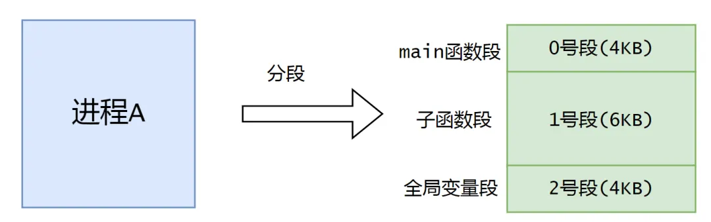

### 分页

在分段机制中，程序也是全部装载在内存中的，效率也很低。这个时候就提出了分页机制：分页仍然是一种虚拟地址空间到物理地址空间映射的机制。但是，粒度更加的小了。单位不是整个程序，而是某个“页”，一段虚拟地址空间组成的某一页映射到一段物理地址空间组成的某一页。

程序在运行的时候，需要哪个页面，我再把相关页面交换进来。经常不用的页面会交换到swap分区。分页机制也是按需分配，这是操作系统的核心思想。

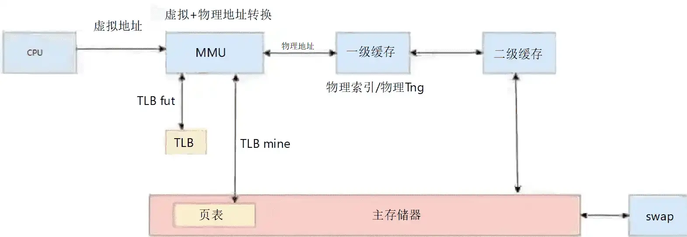

### 逻辑地址，线性地址（intel架构）

逻辑地址和线性地址是intel架构的概念，逻辑地址是程序产生的和段相关的那个部分，线性地址是逻辑地址转换为物理地址的一个中间层。

在分段的方式中，逻辑地址是段的偏移地址，再加上基地址就是线性地址了。如果是做arm架构的，可以不用关注这部分。

### 虚拟地址

简单的说就是可以寻址的一片空间。如果这个空间是虚拟的，我们就叫做虚拟地址空间；如果这个空间是真实存在的，我们就叫做物理地址空间。虚拟地址空间是可以任意的大的，因为是虚拟的。而物理地址空间是真实存在的，所以是有限的

### 物理地址

物理地址是CPU通过外部总线直接访问的外部内存地址。如果系统启动了分页机制，系统启动后必须通过查页表的方式去获取物理地址。

如果没有启动分页机制，系统启动后就通过直接变为了物理地址。

### 结构图

在启动MMU后，CPU访问的是虚拟地址，虚拟地址经过MMU后转换为物理地址，这种转换通过查询存储在主存储器的页表完成。频繁访问主存储器比较耗时，因此引入了TLB的概念。

TLB缓存了上一次虚拟地址到物理地址的转换，TLB不存储具体的数据，存储的是页表的表项。如果能在TLB中找到本次访问的页表项，就不需要再访问主存了。我们把这个过程叫做TLB命中。如果没有找到页表项，这个时候只能去查询页表，我们叫做TLB Miss。如何查询页表的后面我们会详细介绍。

假设，现在虚拟地址已经转换为了物理地址。这个时候就会去找一级缓存。看一级缓存有没有需要的数据。我们这里采用的是物理索引（PI），物理标签（PT）的方式。现在的大部分cache都采用组相联的方式，访问cache地址会被分为偏移域，索引域，标记域三部分。如果一级缓存没有相应的数据，就要访问二级缓存了，如果二级缓存没有数据，就要访问主存储器了。

还有一种情况，当系统物理内存短缺的时候，Linux内核中，有页面回收的机制，会把不常用的页面交换到swap分区中，这个动作叫做swap。这张图就从硬件结构的角度解释了内存管理的基本构成。

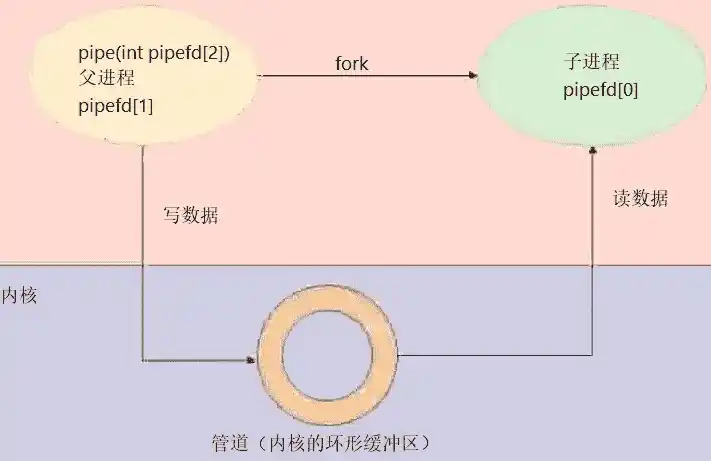

## 虚拟地址到物理地址的转换

虚拟地址的32个bit位可以分为3个域，最高12bit位20~31位称为L1索引，叫做PGD，页面目录。中间的8个bit位叫做L2索引，在Linux内核中叫做PT，页表。最低的12位叫做页索引。

在ARM处理器中，TTBRx寄存器存放着页表基地址，我们这里的一级页表有4096个页表项。每个表项中存放着二级表项的基地址。我们可以通过虚拟地址的L1索引访问一级页表，访问一级页表相当于数组访问。

二级页表通常是动态分配的，可以通过虚拟地址的中间8bit位L2索引访问二级页表，在L2索引中存放着最终物理地址的高20bit位，然后和虚拟地址的低12bit位就组成了最终的物理地址。以上就是虚拟地址转换为物理地址的过程。

MMU访问页表是硬件实现的，但页表的创建和填充需要Linux内核来填充。通常，一级页表和二级页表存放在主存储器中。

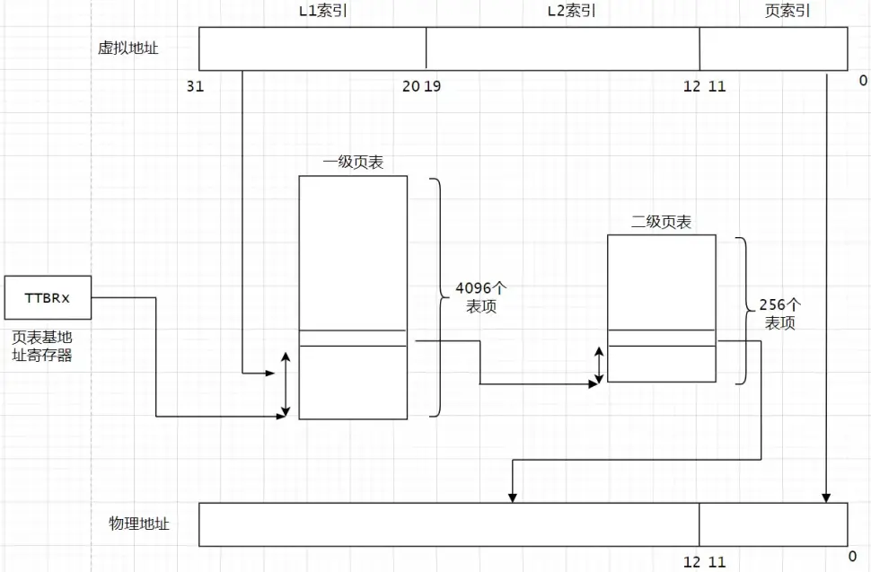

## 内存管理总览

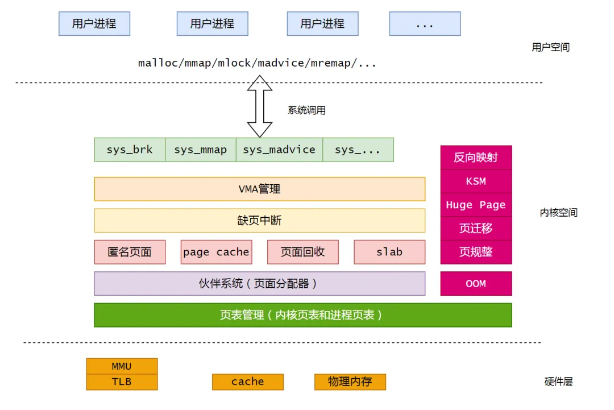

### 系统调用

Linux内核把用户空间分为两部分：用户空间和内核空间。用户进程运行在用户空间，如果需要内存的话通过C库提供的`malloc`，`mmap`，`mlock`，`madvice`，`mremap`函数。C库的这些函数最终都会调用到内核的`sys_xxx`接口分配内存空间。如`malloc`函数是依赖内核的`sys_brk`接口分配内存空间的。mmap对应接口为`sys_mmap`。

我们以`malloc`函数为例，假设现在用户态的内存短缺，就会通过`sys_brk`调用去堆上分配内存。在用户空间分配的是虚拟内存，因此，在堆上分配的也是虚拟内存。

### vm_area_struct

Linux内核把这些地址称为进程地址空间。内核使用`struct vm_area_struct` 来管理这些进程地址空间。`VMA`主要管理内存的创建，插入，删除，合并等操作。

由于每个不同质的虚拟内存区域功能和内部机制都不同，因此一个进程使用多个`vm_area_struct`结构来分别表示不同类型的虚拟内存区域。各个`vm_area_struct`结构使用链表或者树形结构链接，方便进程快速访问，如下图所示：

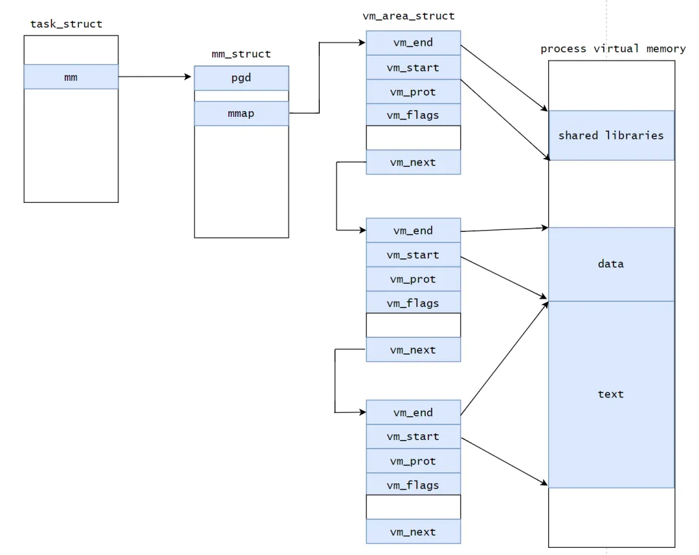

`vm_area_struct`结构中包含区域起始和终止地址以及其他相关信息，同时也包含一个`vm_ops`指针，其内部可引出所有针对这个区域可以使用的系统调用函数。这样，进程对某一虚拟内存区域的任何操作需要用要的信息，都可以从`vm_area_struct`中获得。`mmap`函数就是要创建一个新的`vm_area_struct`结构，并将其与文件的物理磁盘地址相连。

### 缺页中断

缺页中断是实现了按需分配的思想。站在用户角度，缺页中断后可分配的页面有**匿名页面**和`page cache`。匿名页面指的是没有关联任何文件的页面，比如进程通过`mlock`从堆上分配的内存。`page cache`是关联了具体缓存的页面。匿名页面和`page cache`的产生需要页面分配器完成。

### 伙伴系统

内存被分成含有很多页面的大块, 每一块都是2个页面大小的方幂。如果找不到想要的块, 一个大块会被分成两部分, 这两部分彼此就成为伙伴。其中一半被用来分配，而另一半则空闲。这些块在以后分配的过程中会继续被二分直至产生一个所需大小的块。当一个块被最终释放时，其伙伴将被检测出来，如果伙伴也空闲则合并两者。

虽然伙伴算法实现不复杂，但页面分配器是内核实现最复杂的系统之一。如果内存充足时，你需要多少内存，页面分配器会给你分配多少。但如果内存紧张时，页面分配器会做很多尝试，比如开启异步模式的页面回收，`memory compaction`（内存规整）。如果经过尝试后内存仍然不够，这个时候会拿出重型武器oom kill会杀死一些进程。

### slab分配器

刚刚我们讲的都是以页为单位分配的内存。但有时候我们需要几个字节的内存怎么办。这个时候就需要slab分配器。slab可以管理特定大小的内存，对于固定大小的内存就不需要VMA去管理了。页面分配器是中央财政，slab是地方财政。如果地方需要种棵树就不要劳烦中央财政了。

### 页面回收

页面回收实现了页面换出的理念。当系统内存短缺的时候，系统需要换出一部分内存。这部分内存通常是page cache或者匿名页面。内核里面有个swap守护线程，当系统内存低于某个水位时，会被唤醒去扫描LRU（最近最少使用）链表，一般匿名页面和page cache会添加到链表中。实际上，在内核中又将LRU链表做了细分，又细分为活跃链表，不活跃链表，匿名页面链表，page cache链表。

内核相对比较喜欢回收`page cache`，干净的`page cache` 直接合并就好了。对于脏的`page cache`需要写回磁盘的一个动作。对于匿名页面是不能直接合并的，匿名页面一般都是进程的私有数据。一般这些匿名页面数据需要回收时会swap out 到swap分区腾出空间，当这些进程再次需要这些数据时，才会从swap分区swap in。页面回收我们会在后面详细讲解。

如果分配好了页面，这个时候就要涉及到页表的管理了。页表分为内核页表和进程页表。内核提供了很多和内核页表相关的函数，后续我们再分析。

再往下分析就是硬件层，比如MMU，TLB，cache，物理内存等，对于这部分我们不做深入分析。

### 反向映射

当进程分配内存并发生写操作时，会分配虚拟地址并产生缺页，进而分配物理内存并建立虚拟地址到物理地址的映射关系，这个叫正向映射。

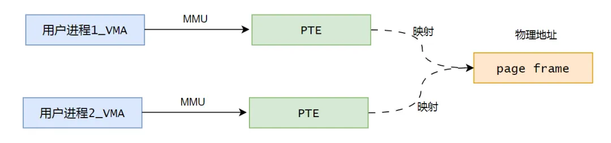

反过来，通过物理页面找到映射它的所有虚拟页面叫反向映射（reverse-mapping, RMAP），它可以从page数据结构中找到映射这个page的虚拟地址空间，也就是我们讲过的VMA这个东西，ramp系统是为页面回收服务的，如果要回收一个匿名页面或者page cache的时候，需要把映射这个页面的用户PTE断开映射关系才可以去回收。

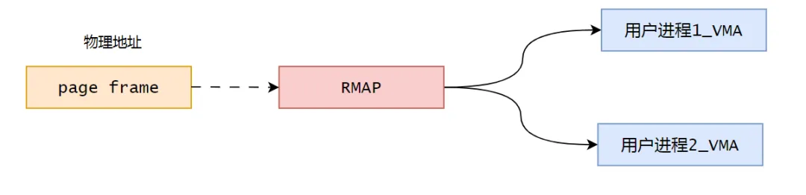

### KSM

KSM，Kernel Samepage Merging，最早是用来优化KVM虚拟机来发明的一种机制。现在用来合并内容相同的匿名页面。

### huge page

`huge page`，通常用来分配2M或者1G大小的页，目前在服务器系统中用的比较多。使用`huge page`可以减少TLB miss的次数，假如现在需要2M的页面，一个page是4K，最坏的情况下需要`TLB miss` 5次，如果使用2M的页面，只需要`TLB miss` 1次。每次`TLB miss` 对系统的损耗很大。

### 页迁移

页迁移，内核中有些页面是可以迁移的，比如匿名页面。页迁移在内核很多模块都被广泛使用，比如`memory compaction`（内存规整）。

### 内存规整

`memory compaction`，内存规整模块是为了缓解内存碎片化的，系统运行的时间越长，就越容易产生内存碎片，系统此时想分配连续的大块内存就变得越来越难。

大块连续的内存一般是内核所请求的，因为对于用户空间来讲，大块缺页内存都是通过缺页中断一块一块来分配的。

内存规整的实现原理也不复杂，在一个zoom中有两个扫描器，分别从头到尾和从尾到头扫描，一个去查找zoom中有那些页面可以迁移的，另外一个去扫描有那些空闲的页，两个扫描器在zoom中相遇的时候，扫描就停止了。这个时候内存规整模块就知道zoom中有那些页面可以迁移到空闲页面。经过这么一折腾，就可以腾出一个大的连续的物理空间了。

### OOM

在经过内存规整，页面迁移等操作后，如果系统还不能分配出系统需要的页面，Linux就要使用最后一招了，杀敌一千，自损八百，OOM killer会找一些占用内存比较多的进程杀掉来释放内存。

之所以会发生这种情况，是因为Linux内核在给某个进程分配内存时，会比进程申请的内存多分配一些。这是为了保证进程在真正使用的时候有足够的内存，因为进程在申请内存后并不一定立即使用，当真正使用的时候，可能部分内存已经被回收了。

比如 当一个进程申请2G内存时，内核可能会分配2.5G的内存给它。通常这不会导致什么问题。然而一旦系统内大量的进程在使用内存时，就会出现内存供不应求，很快就会导致内存耗尽。这时就会触发这个oom killer，它会选择性的杀掉某个进程以保证系统能够正常运行。

## 内存管理的一些数据结构

### 线性映射

我们以32位系统为例，我们知道进程最大的地址访问空间是4G，0~3GB是用户空间，3 ~ 4GB是内核空间。

如果物理空间是大于1GB，内核空间如何访问大于1GB的空间呢？站在内核的角度，低地址段是线性映射，高地址段是高端映射。

那线性映射和高端映射是如何划分的呢？不同的体系结构有不同的划分方法。在ARM32中是线性映射大小为760M。线性映射就是直接把物理地址空间映射到3G ~ 4G的地址空间，这段映射关系就变得比较简单了，内核访问时直接使用虚拟地址减去偏移量（page offset）就得到物理地址了。

如果要访问高端内存就麻烦一点，1G的物理内存空间有限，不能把所有地址都映射到线性地址空间。如果要访问高端内存就要通过动态映射的方式访问了。

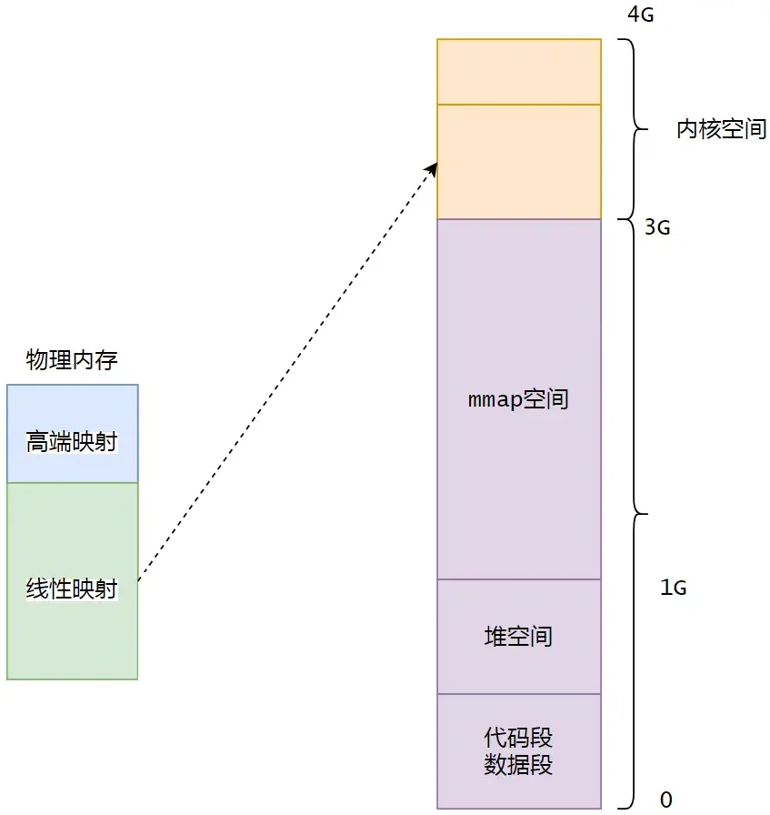

### struct page

`struct page`数据结构是用来抽象物理页面的。这个数据结构很重要，很多内核代码都是围绕这个`struct page` 展开的。

此外还有个很重要的`mem_map[]`数组，是用来存放每一个`struct page`数据结构的。通过数组，我们可以很方便的通过page找到页帧号，页帧号全称叫`page frame number`，pfm。

### zone

除了page结构，还有个很重要的数据结构叫zone。前面讲到了物理内存划分为两部分，线性映射和高端内存。zone也是根据这个来划分的。线性映射部分叫zone normal，高端内存区域叫zone high。

页面分配器和页面回收都是基于zone来管理的。zone 也是一个很重要的管理物理内存的数据结构。

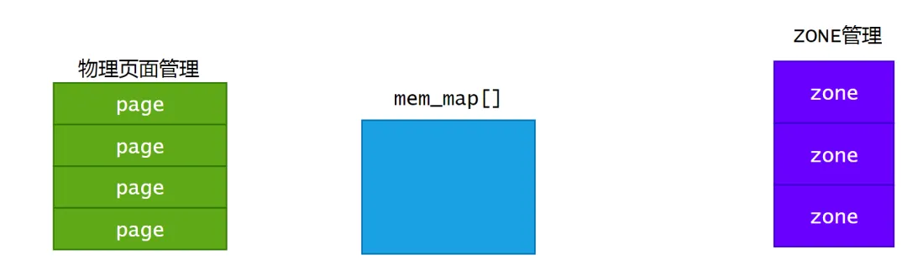

## 进程角度看内存管理

看完物理内存的管理结构，接下来从进程的角度看下虚拟内存是怎么管理的。

用户空间有3G的大小，这3GB的大小也做了划分，0 ~ 1GB 属于代码段，数据段，堆空间。1G ~ 3G 属于mmap空间。

每个进程都有一个管理进程的数据结构，操作系统中叫做PCB，进程控制块，linux内核中就用`task_struct`描述进程控制块。

mm成员会指向`mm_struct`描述进程管理的内存资源，我们这里只关注mmap，pgd。mmap指向该进程的VMA的链表。我们知道进程地址空间使用VMA来管理，VMA是离散的，所以内核使用两种方式来管理VMA：链表和红黑树。

pgd指向进程所在的页表，这里指的是进程的页表，进程的一级页表在fork的时候创建，进程的二级页表在实际使用的时候动态创建，

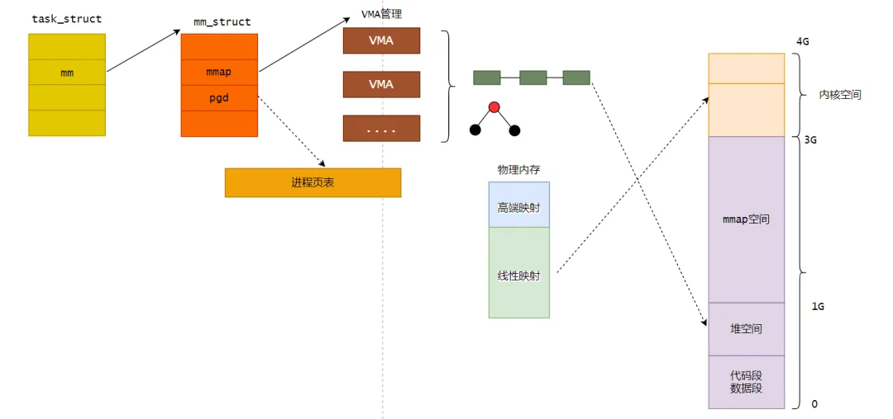
