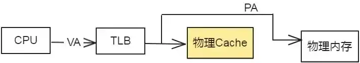
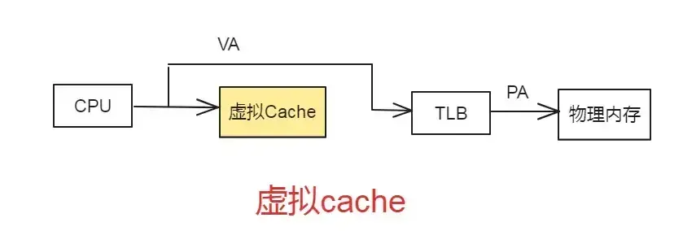

# MMU简介

## MMU

MMU：memory management unit，称为内存管理单元，或者是存储器管理单元。

MMU提供了以下功能和特征：

-   虚拟内存管理：MMU将程序使用的虚拟地址转换为物理地址，实现了对虚拟内存空间的管理。它允许每个程序有自己独立的地址空间，并且可以在不同程序之间共享物理内存。
-   地址映射：MMU通过页表或段表来实现虚拟地址到物理地址的映射。它根据页表或段表中的映射规则，将虚拟地址转换为对应的物理地址。
-   内存保护：MMU可以设置页面级别或段级别的权限控制，以保护操作系统和应用程序不被非法访问。例如，可以限制某些页面只读、只执行或禁止访问。
-   虚拟化支持：在虚拟化环境中，MMU可以实现虚拟机与物理机之间的隔离和映射。
-   缓存控制：MMU可以进行缓存一致性控制，确保数据在主存与缓存之间的一致性。
-   TLB（Translation Lookaside Buffer）：MMU通常会包含一个TLB，用于缓存最近的地址映射结果，以加速地址转换过程。

CPU通过地址来访问内存中的单元，如果CPU没有MMU，或者有MMU但没有启动，那么CPU内核在取指令或者访问内存时发出的地址(此时必须是物理地址，假如是虚拟地址，那么当前的动作无效)将直接传到CPU芯片的外部地址引脚上，直接被内存芯片(物理内存)接收，这时候的地址就是物理地址。如果CPU启用了MMU(一般是在bootloader中的eboot阶段的进入main()函数的时候启用)，CPU内核发出的地址将被MMU截获，这时候从CPU到MMU的地址称为虚拟地址，而MMU将这个VA翻译成为PA发到CPU芯片的外部地址引脚上，也就是将VA映射到PA中。

### VA和PA

VA（Virtual Address）是程序在运行时使用的虚拟地址。它由MMU（Memory Management Unit，内存管理单元）根据页表或段表的映射规则进行转换，将其映射为对应的PA。

PA（Physical Address）是实际存在于物理内存中的物理地址。它指向计算机硬件中实际存储单元的位置。

通过使用虚拟内存管理技术，操作系统将程序使用的虚拟地址空间与物理内存进行映射。这样，每个程序都有自己独立的虚拟地址空间，而不需要关心真正分配给它们的物理内存位置。

当程序访问某个虚拟地址时，MMU会将其转换为对应的物理地址，并且确保访问权限合法。这样，程序可以以统一的方式访问内存，并且操作系统可以更好地管理和保护整个系统中的内存资源。

MMU将VA映射到PA是以页(page)为单位的，对于32位的CPU，通常一页为4k，物理内存中的一个物理页面称页为一个页框(page frame)。虚拟地址空间划分成称为页（page）的单位,而相应的物理地址空间也被进行划分，单位是页框(frame).页和页框的大小必须相同。

### VA到PA的映射过程

首先将CPU内核发送过来的32位VA[31:0]分成三段，前两段VA[31:20]和VA[19:12]作为两次查表的索引，第三段VA[11:0]作为页内的偏移，查表的步骤如下：

1.  从协处理器CP15的寄存器2（TTB寄存器，translation table base register）中取出保存在其中的第一级页表(translation table)的基地址，这个基地址指的是PA，也就是说页表是直接按照这个地址保存在物理内存中的。

2.  以TTB中的内容为基地址，以VA[31:20]为索引值在一级页表中查找出一项（2^12=4096项），这个页表项（也称为一个描述符，descriptor）保存着第二级页表(coarse page table)的基地址，这同样是物理地址，也就是说第二级页表也是直接按这个地址存储在物理内存中的。

3.  以VA[19:12]为索引值在第二级页表中查出一项(2^8=256)，这个表项中就保存着物理页面的基地址，我们知道虚拟内存管理是以页为单位的，一个虚拟内存的页映射到一个物理内存的页框，从这里就可以得到印证，因为查表是以页为单位来查的。

4.  有了物理页面的基地址之后，加上VA[11:0]这个偏移量(2^12=4KB)就可以取出相应地址上的数据了。

这个过程称为Translation Table Walk，Walk这个词用得非常形象。从TTB走到一级页表，又走到二级页表，又走到物理页面，一次寻址其实是三次访问物理内存。注意这个“走”的过程完全是硬件做的，每次CPU寻址时MMU就自动完成以上四步，不需要编写指令指示MMU去做，前提是操作系统要维护页表项的正确性，每次分配内存时填写相应的页表项，每次释放内存时清除相应的页表项，在必要的时候分配或释放整个页表。

### CPU访问内存时的硬件操作顺序

CPU访问内存时的硬件操作顺序，各步骤在图中有对应的标号：

1.  CPU内核发出VA请求读数据，TLB(translation lookaside buffer)接收到该地址，那为什么是TLB先接收到该地址呢？因为TLB是MMU中的一块高速缓存(也是一种cache，是CPU内核和物理内存之间的cache)，它缓存最近查找过的VA对应的页表项，如果TLB里缓存了当前VA的页表项就不必做translation table walk了，否则就去物理内存中读出页表项保存在TLB中，TLB缓存可以减少访问物理内存的次数。
2.  页表项中不仅保存着物理页面的基地址，还保存着权限和是否允许cache的标志。MMU首先检查权限位，如果没有访问权限，就引发一个异常给CPU内核。然后检查是否允许cache，如果允许cache就启动cache和CPU内核互操作。

3.  如果不允许cache，那直接发出PA从物理内存中读取数据到CPU内核。

4.  如果允许cache，则以VA为索引到cache中查找是否缓存了要读取的数据

如果cache中已经缓存了该数据(称为cache hit)则直接返回给CPU内核，如果cache中没有缓存该数据(称为cache miss)，则发出PA从物理内存中读取数据并缓存到cache中，同时返回给CPU内核。但是cache并不是只去CPU内核所需要的数据，而是把相邻的数据都去上来缓存，这称为一个`cache line`。

## Cache的设计

TLB只是加速了虚拟地址到物理地址的转换，可以很快地得到所需要的数据或指令在物理内存中的位置，也就是得到了物理地址，但如果直接从物理内存中取数据或指令，显然也是很慢的。因此可以用Cache来缓存物理地址到数据的转换过程。这种Cache使用物理地址进行寻址，因此称为物理Cache。

**使用TLB和物理cache一起工作的过程如下图：**

如果不使用虚拟存储器，处理器送出的地址会直接访问物理Cache，而现在要先经过TLB才能再访问物理Cache，因此必然会增加流水线的延迟，如果还想获得和以前一样的运行频率，就需要将访问TLB的过程单独使用一级流水线，但是这样就增加了分支预测失败时的惩罚（penalty），也增加了load指令的延迟，不是一个很好的做法。

为什么不使用Cache来直接缓存从虚拟地址到数据的关系呢？当然是可以的，因为这个Cache使用虚拟地址来寻址，称之为虚拟Cache。既然使用虚拟Cache，可以直接从虚拟地址得到对应的数据，那么是不是就不使用TLB了呢？当然不是这样，因为一旦Cache发生miss，仍然需要将对应的虚拟地址转换为物理地址，然后去物理内存中获得对应的数据，因此还需要TLB来加速从虚拟地址到物理地址的转换过程。

如果使用虚拟地址，从虚拟Cache中找到了需要的数据，就不需要再访问TLB和物理内存。在流水线中使用这种虚拟Cache，不会对处理器的时钟产生明显的负面影响，不过它会引起一些新的问题，需要耗费额外的硬件进行解决。

## 总结

MMU（Memory Management Unit）：MMU是一种硬件或软件模块，负责处理虚拟地址到物理地址的转换。它在操作系统的支持下，通过页表或段表来实现地址映射。主要功能包括：

-   地址转换：将虚拟地址映射为对应的物理地址。
-   内存保护：根据权限位检查访问权限，防止非法访问。
-   内存共享：实现多个进程之间的内存共享。
-   页面置换：当页面不在内存中时，触发页面置换机制将其加载到内存中。

Cache：Cache是一种高速缓存，在CPU与主内存之间起到缓冲作用。其目的是提高数据访问速度和性能。主要功能包括：

-   缓存命中：当CPU请求读取数据时，先在Cache中查找是否存在该数据，如果存在则直接返回给CPU，称为命中；否则称为缺失。
-   缓存替换：当Cache已满且需要新的数据时，会使用某种策略选择一个被替换出去的缓存行。
-   缓存写策略：控制数据在何时写回主内存，可以是写回（write-back）或直写（write-through）策略。
-   缓存一致性：确保多级缓存中的数据一致性，避免数据不一致问题。

Cache利用了局部性原理，即数据访问往往具有时间和空间上的局部性。因此，通过将频繁访问的数据存储在高速缓存中，可以大大减少对主内存的访问次数，从而提高计算机系统的整体性能。
