# 进程、线程基础知识

## 进程

我们编写的代码只是一个存储在硬盘的静态文件，通过编译后就会生成二进制可执行文件，当我们运行这个可执行文件后，它会被装载到内存中，接着 CPU 会执行程序中的每一条指令，那么这个**运行中的程序，就被称为「进程」（Process）**。

现在我们考虑有一个会读取硬盘文件数据的程序被执行了，那么当运行到读取文件的指令时，就会去从硬盘读取数据，但是硬盘的读写速度是非常慢的，那么在这个时候，如果 CPU 傻傻的等硬盘返回数据的话，那 CPU 的利用率是非常低的。

做个类比，你去煮开水时，你会傻傻的等水壶烧开吗？很明显，小孩也不会傻等。我们可以在水壶烧开之前去做其他事情。当水壶烧开了，我们自然就会听到“嘀嘀嘀”的声音，于是再把烧开的水倒入到水杯里就好了。

所以，当进程要从硬盘读取数据时，CPU 不需要阻塞等待数据的返回，而是去执行另外的进程。当硬盘数据返回时，CPU 会收到个**中断**，于是 CPU 再继续运行这个进程。

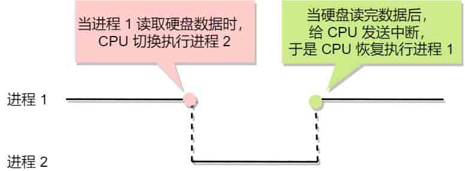

这种**多个程序、交替执行**的思想，就有 CPU 管理多个进程的初步想法。

对于一个支持多进程的系统，CPU 会从一个进程快速切换至另一个进程，其间每个进程各运行几十或几百个毫秒。

虽然单核的 CPU 在某一个瞬间，只能运行一个进程。但在 1 秒钟期间，它可能会运行多个进程，这样就产生**并行的错觉**，实际上这是**并发**。

> 并发和并行有什么区别？

一图胜千言。

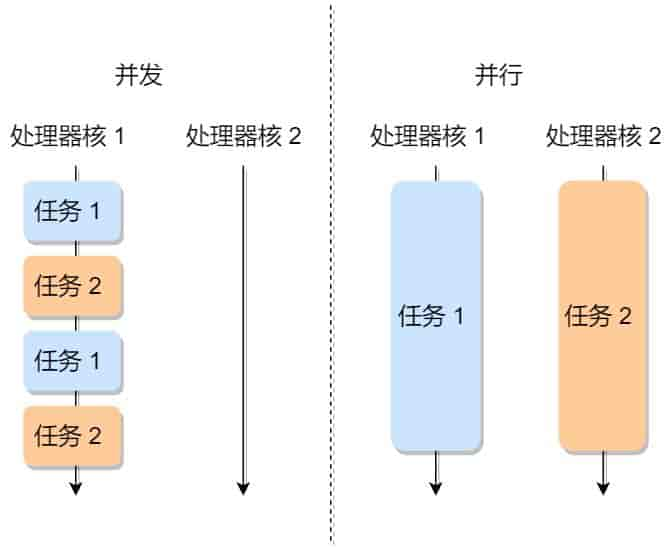

> 进程与程序的关系的类比

到了晚饭时间，一对小情侣肚子都咕咕叫了，于是男生见机行事，就想给女生做晚饭，所以他就在网上找了辣子鸡的菜谱，接着买了一些鸡肉、辣椒、香料等材料，然后边看边学边做这道菜。

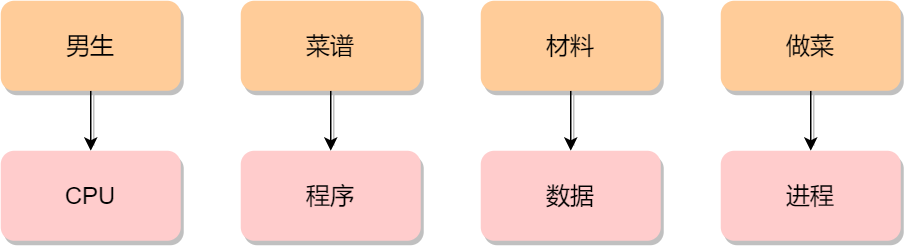

突然，女生说她想喝可乐，那么男生只好把做菜的事情暂停一下，并在手机菜谱标记做到哪一个步骤，把状态信息记录了下来。

然后男生听从女生的指令，跑去下楼买了一瓶冰可乐后，又回到厨房继续做菜。

这体现了，**CPU 可以从一个进程（做菜）切换到另外一个进程（买可乐）**，在切换前必须要**记录当前进程中运行的状态信息**，以备下次切换回来的时候可以恢复执行。

所以，可以发现进程有着「**运行 - 暂停 - 运行**」的活动规律。

### 进程的状态

在上面，我们知道了进程有着「运行 - 暂停 - 运行」的活动规律。一般说来，一个进程并不是自始至终连续不停地运行的，它与并发执行中的其他进程的执行是相互制约的。

它有时处于运行状态，有时又由于某种原因而暂停运行处于等待状态，当使它暂停的原因消失后，它又进入准备运行状态。

所以，**在一个进程的活动期间至少具备三种基本状态，即运行状态、就绪状态、阻塞状态。**

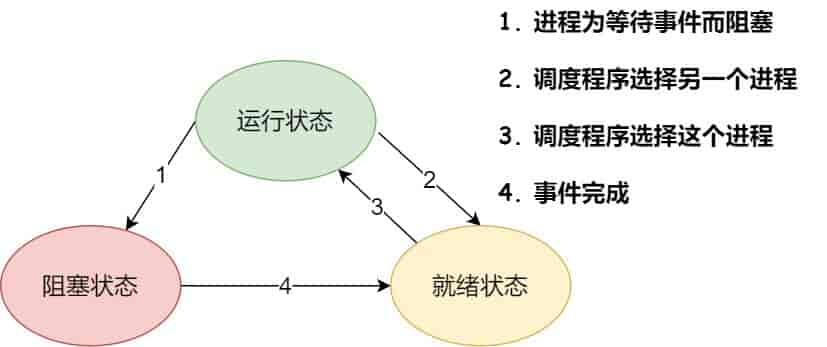

上图中各个状态的意义：

- 运行状态（Running）：该时刻进程占用 CPU；
- 就绪状态（Ready）：可运行，由于其他进程处于运行状态而暂时停止运行；
- 阻塞状态（Blocked）：该进程正在等待某一事件发生（如等待输入/输出操作的完成）而暂时停止运行，这时，即使给它 CPU 控制权，它也无法运行；

当然，进程还有另外两个基本状态：

- 创建状态（new）：进程正在被创建时的状态；
- 结束状态（Exit）：进程正在从系统中消失时的状态；

于是，一个完整的进程状态的变迁如下图：

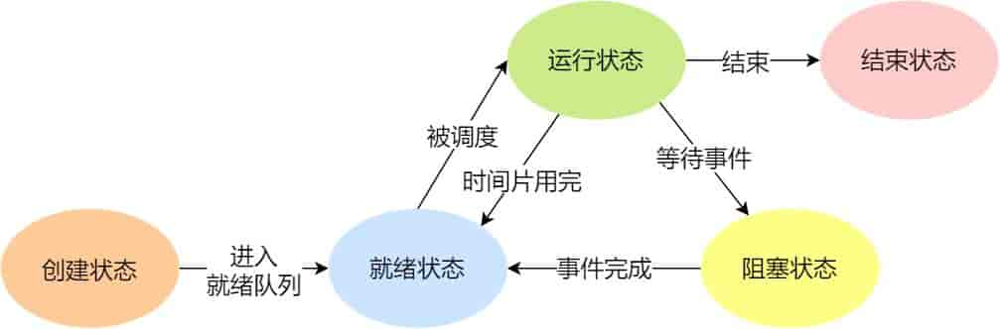

再来详细说明一下进程的状态变迁：

- NULL -> 创建状态：一个新进程被创建时的第一个状态；
- 创建状态 -> 就绪状态：当进程被创建完成并初始化后，一切就绪准备运行时，变为就绪状态，这个过程是很快的；
- 就绪态 -> 运行状态：处于就绪状态的进程被操作系统的进程调度器选中后，就分配给 CPU 正式运行该进程；
- 运行状态 -> 结束状态：当进程已经运行完成或出错时，会被操作系统作结束状态处理；
- 运行状态 -> 就绪状态：处于运行状态的进程在运行过程中，由于分配给它的运行时间片用完，操作系统会把该进程变为就绪态，接着从就绪态选中另外一个进程运行；
- 运行状态 -> 阻塞状态：当进程请求某个事件且必须等待时，例如请求 I/O 事件；
- 阻塞状态 -> 就绪状态：当进程要等待的事件完成时，它从阻塞状态变到就绪状态；

如果有大量处于阻塞状态的进程，进程可能会占用着物理内存空间，显然不是我们所希望的，毕竟物理内存空间是有限的，被阻塞状态的进程占用着物理内存就是一种浪费物理内存的行为。

所以，在虚拟内存管理的操作系统中，通常会把阻塞状态的进程的物理内存空间换出到硬盘，等需要再次运行的时候，再从硬盘换入到物理内存。

那么，就需要一个新的状态，来**描述进程没有占用实际的物理内存空间的情况，这个状态就是挂起状态**。这跟阻塞状态是不一样，阻塞状态是等待某个事件的返回。

另外，挂起状态可以分为两种：

- 阻塞挂起状态：进程在外存（硬盘）并等待某个事件的出现；
- 就绪挂起状态：进程在外存（硬盘），但只要进入内存，即刻立刻运行；

这两种挂起状态加上前面的五种状态，就变成了七种状态变迁，见如下图：

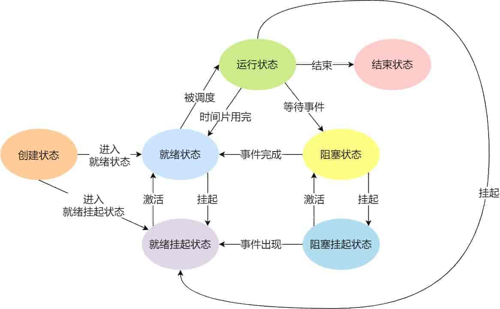

导致进程挂起的原因不只是因为进程所使用的内存空间不在物理内存，还包括如下情况：

- 通过 sleep 让进程间歇性挂起，其工作原理是设置一个定时器，到期后唤醒进程。
- 用户希望挂起一个程序的执行，比如在 Linux 中用 `Ctrl+Z` 挂起进程；

### 进程的控制结构

在操作系统中，是用**进程控制块**（*process control block，PCB*）数据结构来描述进程的。

那 PCB 是什么呢？**PCB 是进程存在的唯一标识**，这意味着一个进程的存在，必然会有一个 PCB，如果进程消失了，那么 PCB 也会随之消失。

> PCB 具体包含什么信息呢？

**进程描述信息：**

- 进程标识符：标识各个进程，每个进程都有一个并且唯一的标识符；
- 用户标识符：进程归属的用户，用户标识符主要为共享和保护服务；

**进程控制和管理信息：**

- 进程当前状态，如 new、ready、running、waiting 或 blocked 等；
- 进程优先级：进程抢占 CPU 时的优先级；

**资源分配清单：**

- 有关内存地址空间或虚拟地址空间的信息，所打开文件的列表和所使用的 I/O 设备信息。

**CPU 相关信息：**

- CPU 中各个寄存器的值，当进程被切换时，CPU 的状态信息都会被保存在相应的 PCB 中，以便进程重新执行时，能从断点处继续执行。

可见，PCB 包含信息还是比较多的。

> 每个 PCB 是如何组织的呢？

通常是通过**链表**的方式进行组织，把具有**相同状态的进程链在一起，组成各种队列**。比如：

- 将所有处于就绪状态的进程链在一起，称为**就绪队列**；
- 把所有因等待某事件而处于等待状态的进程链在一起就组成各种**阻塞队列**；
- 另外，对于运行队列在单核 CPU 系统中则只有一个运行指针了，因为单核 CPU 在某个时间，只能运行一个程序。

那么，就绪队列和阻塞队列链表的组织形式如下图：

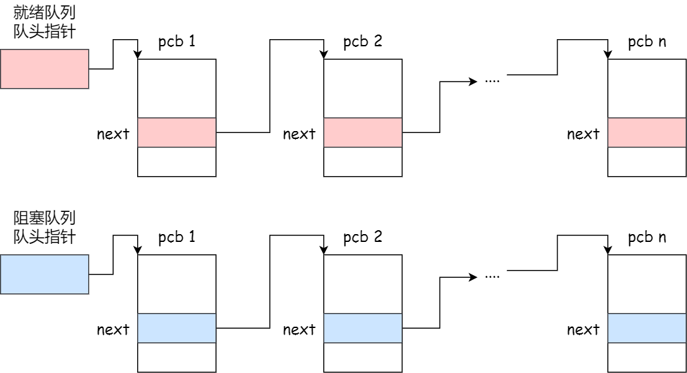

除了链接的组织方式，还有索引方式，它的工作原理：将同一状态的进程组织在一个索引表中，索引表项指向相应的 PCB，不同状态对应不同的索引表。

一般会选择链表，因为可能面临进程创建，销毁等调度导致进程状态发生变化，所以链表能够更加灵活的插入和删除。

### 进程的控制

我们熟知了进程的状态变迁和进程的数据结构 PCB 后，再来看看进程的**创建、终止、阻塞、唤醒**的过程，这些过程也就是进程的控制。

**01 创建进程**

操作系统允许一个进程创建另一个进程，而且允许子进程继承父进程所拥有的资源。

创建进程的过程如下：

- 申请一个空白的 PCB，并向 PCB 中填写一些控制和管理进程的信息，比如进程的唯一标识等；
- 为该进程分配运行时所必需的资源，比如内存资源；
- 将 PCB 插入到就绪队列，等待被调度运行；

**02 终止进程**

进程可以有 3 种终止方式：正常结束、异常结束以及外界干预（信号 `kill` 掉）。

当子进程被终止时，其在父进程处继承的资源应当还给父进程。而当父进程被终止时，该父进程的子进程就变为孤儿进程，会被 1 号进程收养，并由 1 号进程对它们完成状态收集工作。

终止进程的过程如下：

- 查找需要终止的进程的 PCB；
- 如果处于执行状态，则立即终止该进程的执行，然后将 CPU 资源分配给其他进程；
- 如果其还有子进程，则应将该进程的子进程交给 1 号进程接管；
- 将该进程所拥有的全部资源都归还给操作系统；
- 将其从 PCB 所在队列中删除；

**03 阻塞进程**

当进程需要等待某一事件完成时，它可以调用阻塞语句把自己阻塞等待。而一旦被阻塞等待，它只能由另一个进程唤醒。

阻塞进程的过程如下：

- 找到将要被阻塞进程标识号对应的 PCB；
- 如果该进程为运行状态，则保护其现场，将其状态转为阻塞状态，停止运行；
- 将该 PCB 插入到阻塞队列中去；

**04 唤醒进程**

进程由「运行」转变为「阻塞」状态是由于进程必须等待某一事件的完成，所以处于阻塞状态的进程是绝对不可能叫醒自己的。

如果某进程正在等待 I/O 事件，需由别的进程发消息给它，则只有当该进程所期待的事件出现时，才由发现者进程用唤醒语句叫醒它。

唤醒进程的过程如下：

- 在该事件的阻塞队列中找到相应进程的 PCB；
- 将其从阻塞队列中移出，并置其状态为就绪状态；
- 把该 PCB 插入到就绪队列中，等待调度程序调度；

进程的阻塞和唤醒是一对功能相反的语句，如果某个进程调用了阻塞语句，则必有一个与之对应的唤醒语句。

### 进程的上下文切换

各个进程之间是共享 CPU 资源的，在不同的时候进程之间需要切换，让不同的进程可以在 CPU 执行，那么这个**一个进程切换到另一个进程运行，称为进程的上下文切换**。

> 在详细说进程上下文切换前，我们先来看看 CPU 上下文切换

大多数操作系统都是多任务，通常支持大于 CPU 数量的任务同时运行。实际上，这些任务并不是同时运行的，只是因为系统在很短的时间内，让各个任务分别在 CPU 运行，于是就造成同时运行的错觉。

任务是交给 CPU 运行的，那么在每个任务运行前，CPU 需要知道任务从哪里加载，又从哪里开始运行。

所以，操作系统需要事先帮 CPU 设置好 **CPU 寄存器和程序计数器**。

-   CPU 寄存器是 CPU 内部一个容量小，但是速度极快的内存（缓存）。
-   程序计数器则是用来存储 CPU 正在执行的指令位置、或者即将执行的下一条指令位置。

所以说，CPU 寄存器和程序计数是 CPU 在运行任何任务前，所必须依赖的环境，这些环境就叫做 **CPU 上下文**。

既然知道了什么是 CPU 上下文，那理解 CPU 上下文切换就不难了。

CPU 上下文切换就是先把前一个任务的 CPU 上下文（CPU 寄存器和程序计数器）保存起来，然后加载新任务的上下文到这些寄存器和程序计数器，最后再跳转到程序计数器所指的新位置，运行新任务。

系统内核会存储保持下来的上下文信息，当此任务再次被分配给 CPU 运行时，CPU 会重新加载这些上下文，这样就能保证任务原来的状态不受影响，让任务看起来还是连续运行。

上面说到所谓的「任务」，主要包含进程、线程和中断。所以，可以根据任务的不同，把 CPU 上下文切换分成：**进程上下文切换**、**线程上下文切换**和**中断上下文切换**。

> 进程的上下文切换到底是切换什么呢？

进程是由内核管理和调度的，所以**进程的切换**只能发生在**内核态**。

所以，进程的上下文切换不仅包含了**虚拟内存、栈、全局变量**等**用户空间的资源**，还包括了**内核堆栈、寄存器**等**内核空间的资源**。

通常，会把交换的信息保存在进程的 PCB，当要运行另外一个进程的时候，我们需要从这个进程的 PCB 取出上下文，然后恢复到 CPU 中，这使得这个进程可以继续执行，如下图所示：

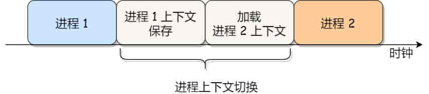

大家需要注意，进程的上下文开销是很关键的，我们希望它的开销越小越好，这样可以使得进程可以把更多时间花费在执行程序上，而不是耗费在上下文切换。

> 发生进程上下文切换有哪些场景？

- 为了保证所有进程可以得到公平调度，CPU 时间被划分为一段段的时间片，这些时间片再被轮流分配给各个进程。这样，当某个进程的时间片耗尽了，进程就从运行状态变为就绪状态，系统从就绪队列选择另外一个进程运行；
- 进程在系统资源不足（比如内存不足）时，要等到资源满足后才可以运行，这个时候进程也会被挂起，并由系统调度其他进程运行；
- 当进程通过睡眠函数 sleep 这样的方法将自己主动挂起时，自然也会重新调度；
- 当有优先级更高的进程运行时，为了保证高优先级进程的运行，当前进程会被挂起，由高优先级进程来运行；
- 发生硬件中断时，CPU 上的进程会被中断挂起，转而执行内核中的中断服务程序；

以上，就是发生进程上下文切换的常见场景了。

### 孤儿进程是什么

父进程先于子进程结束，此时子进程成为一个孤儿进程。

Linux系统规定：所有孤儿进程都成为一个特殊进程（进程1，也就是init进程）的子进程。

### 多进程fork后不同进程会共享哪些资源

多进程fork后不同进程会共享代码段、数据段、堆、文件描述符等资源。

在Unix-like系统中，当调用fork()函数创建子进程时，子进程会复制父进程的地址空间，包括代码段、数据段、堆等。因此，子进程会和父进程共享这些资源。

-   文件描述符：子进程会复制父进程打开的文件描述符，包括标准输入、输出和错误输出。
-   内存映射：如果父进程使用了内存映射（如mmap()函数），子进程也会继承这些内存映射。
-   信号处理器：子进程会继承父进程对信号的处理方式（包括信号处理函数和信号屏蔽集）。
-   用户ID和组ID：子进程会保留与父进程相同的用户ID和组ID。
-   资源限制：子进程会继承父进程设置的各种资源限制，如CPU时间限制、文件大小限制等。

## 线程

在早期的操作系统中都是以进程作为独立运行的基本单位，直到后面，计算机科学家们又提出了更小的能独立运行的基本单位，也就是**线程。**

>   线程是一个执行上下文，它包含诸多状态数据：每个线程有自己的执行流、调用栈、错误码、信号掩码、私有数据。Linux内核用任务（Task）表示一个执行流。

### 为什么使用线程？

我们举个例子，假设你要编写一个视频播放器软件，那么该软件功能的核心模块有三个：

- 从视频文件当中读取数据；
- 对读取的数据进行解压缩；
- 把解压缩后的视频数据播放出来；

对于单进程的实现方式，我想大家都会是以下这个方式：

```c
int main() {
    while (1) {
        //读取文件数据
        Read(); // ---------> I/0

        // 解压缩数据
        Decompress(); // ---------> CPU

        //播放解压缩数据的数据
        Play();
    }
}
```

对于单进程的这种方式，存在以下问题：

- 播放出来的画面和声音会不连贯，因为当 CPU 能力不够强的时候，`Read`的时候可能进程就等在这了，这样就会导致等半天才进行数据解压和播放；
- 各个函数之间不是并发执行，影响资源的使用效率；

那改进成多进程的方式：

```c
int main() {
    while (1) {
        //读取文件数据
        Read(); // ---------> I/0
    }
}

int main() {
    while (1) {
        // 解压缩数据
        Decompress(); // ---------> CPU
    }
}

int main() {
    while (1) {
        //播放解压缩数据的数据
        Play();
    }
}
```

对于多进程的这种方式，依然会存在问题：

- 进程之间如何通信，共享数据？
- 维护进程的系统开销较大，如创建进程时，分配资源、建立 PCB；终止进程时，回收资源、撤销 PCB；进程切换时，保存当前进程的状态信息；

那到底如何解决呢？需要有一种新的实，满足以下特性：

- 实体之间可以并发运行；
- 实体之间共享相同的地址空间；

这个新的实体，就是**线程 ( Thread )**，线程之间可以并发运行且共享相同的地址空间。

### 什么是线程？

**线程是进程当中的一条执行流程。**

同一个进程内多个线程之间可以共享代码段、数据段、打开的文件等资源，但每个线程各自都有一套独立的寄存器和栈，这样可以确保线程的控制流是相对独立的。

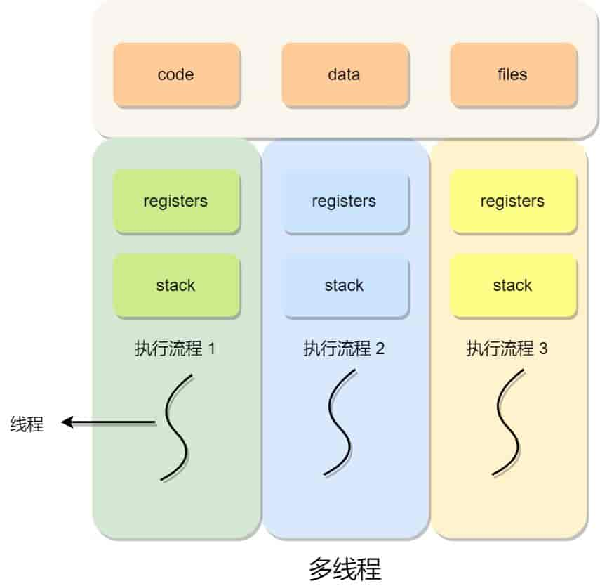

> 线程的优缺点？

线程的优点：

- 一个进程中可以同时存在多个线程；
- 各个线程之间可以并发执行；
- 各个线程之间可以共享地址空间和文件等资源；

线程的缺点：

- 当进程中的一个线程崩溃时，会导致其所属进程的所有线程崩溃（这里是针对 C/C++ 语言，Java 语言中的线程崩溃不会造成进程崩溃）。

举个例子，对于游戏的用户设计，则不应该使用多线程的方式，否则一个用户挂了，会影响其他同个进程的线程。

### 线程与进程的比较

线程与进程的比较如下：

- 进程是资源（包括内存、打开的文件等）分配的单位，线程是 CPU 调度的单位；
- 进程拥有一个完整的资源平台，而线程只独享必不可少的资源，如寄存器和栈；
- 线程同样具有就绪、阻塞、执行三种基本状态，同样具有状态之间的转换关系；
- 线程能减少并发执行的时间和空间开销；

对于，线程相比进程能减少开销，体现在：

- 线程的创建时间比进程快，因为进程在创建的过程中，还需要资源管理信息，比如内存管理信息、文件管理信息，而线程在创建的过程中，不会涉及这些资源管理信息，而是共享它们；
- 线程的终止时间比进程快，因为线程释放的资源相比进程少很多；
- 同一个进程内的线程切换比进程切换快，因为线程具有相同的地址空间（虚拟内存共享），这意味着同一个进程的线程都具有同一个页表，那么在切换的时候不需要切换页表。而对于进程之间的切换，切换的时候要把页表给切换掉，而页表的切换过程开销是比较大的；
- 由于同一进程的各线程间共享内存和文件资源，那么在线程之间数据传递的时候，就不需要经过内核了，这就使得线程之间的数据交互效率更高了；

所以，不管是时间效率，还是空间效率线程比进程都要高。

### 线程的上下文切换

在前面我们知道了，线程与进程最大的区别在于：**线程是调度的基本单位，而进程则是资源拥有的基本单位**。

所以，所谓操作系统的任务调度，实际上的调度对象是线程，而进程只是给线程提供了虚拟内存、全局变量等资源。

对于线程和进程，我们可以这么理解：

- 当进程只有一个线程时，可以认为进程就等于线程；
- 当进程拥有多个线程时，这些线程会共享相同的虚拟内存和全局变量等资源，这些资源在上下文切换时是不需要修改的；

另外，线程也有自己的私有数据，比如栈和寄存器等，这些在上下文切换时也是需要保存的。

> 线程上下文切换的是什么？

这还得看线程是不是属于同一个进程：

- 当两个线程不是属于同一个进程，则切换的过程就跟进程上下文切换一样；
- 当两个线程是属于同一个进程，因为虚拟内存是共享的，所以在切换时，虚拟内存这些资源就保持不动，只需要切换线程的私有数据、寄存器等不共享的数据；

所以，线程的上下文切换相比进程，开销要小很多。

### 线程的实现

主要有三种线程的实现方式：

- **用户线程（*User Thread*）**：在用户空间实现的线程，不是由内核管理的线程，是由用户态的线程库来完成线程的管理；
- **内核线程（*Kernel Thread*）**：在内核中实现的线程，是由内核管理的线程；
- **轻量级进程（*LightWeight Process*）**：在内核中来支持用户线程；

那么，这还需要考虑一个问题，用户线程和内核线程的对应关系。

首先，第一种关系是**多对一**的关系，也就是多个用户线程对应同一个内核线程：

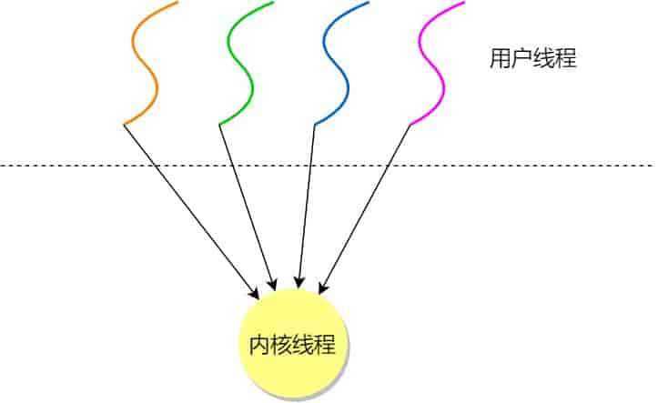

第二种是**一对一**的关系，也就是一个用户线程对应一个内核线程：

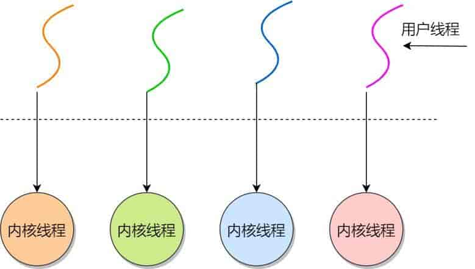

第三种是**多对多**的关系，也就是多个用户线程对应到多个内核线程：

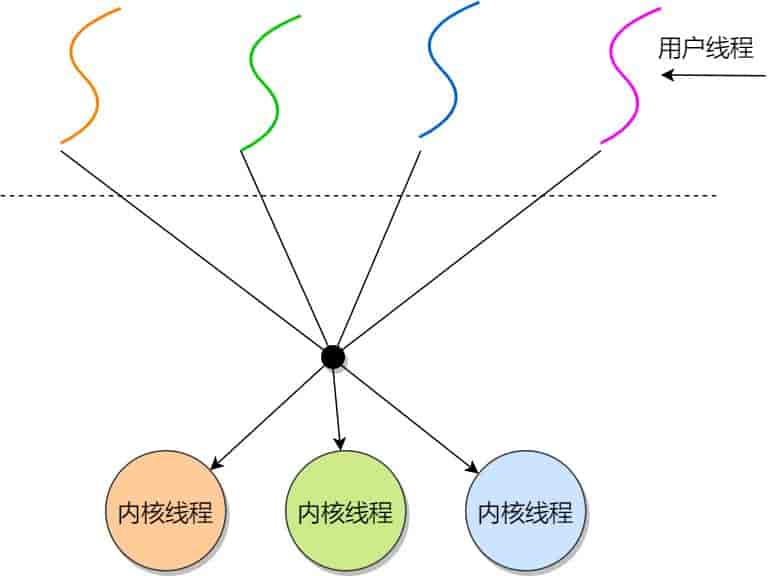

> 用户线程如何理解？存在什么优势和缺陷？

用户线程是基于用户态的线程管理库来实现的，那么**线程控制块（Thread Control Block, TCB）** 也是在库里面来实现的，对于操作系统而言是看不到这个 TCB 的，它只能看到整个进程的 PCB。

所以，**用户线程的整个线程管理和调度**，操作系统是**不直接参与的**，而是**由用户级线程库函数**来**完成**线程的管理，包括线程的创建、终止、同步和调度等。

用户级线程的模型，也就类似前面提到的**多对一**的关系，即多个用户线程对应同一个内核线程，如下图所示：

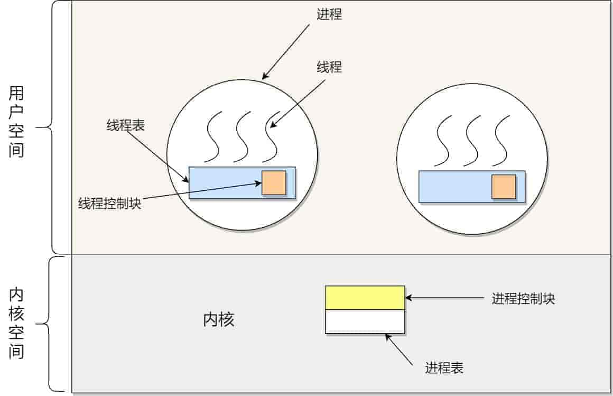

用户线程的**优点**：

- 每个进程都需要有它私有的线程控制块（TCB）列表，用来跟踪记录它各个线程状态信息（PC、栈指针、寄存器），TCB 由用户级线程库函数来维护，可用于不支持线程技术的操作系统；
- 用户线程的切换也是由线程库函数来完成的，无需用户态与内核态的切换，所以速度特别快；

用户线程的**缺点**：

- 由于操作系统不参与线程的调度，如果一个线程发起了系统调用而阻塞，那进程所包含的用户线程都不能执行了。
- 当一个线程开始运行后，除非它主动地交出 CPU 的使用权，否则它所在的进程当中的其他线程无法运行，因为用户态的线程没法打断当前运行中的线程，它没有这个特权，只有操作系统才有，但是用户线程不是由操作系统管理的。
- 由于时间片分配给进程，故与其他进程比，在多线程执行时，每个线程得到的时间片较少，执行会比较慢；

以上，就是用户线程的优缺点了。

> 那内核线程如何理解？存在什么优势和缺陷？

内核线程是由**操作系统**管理的，线程对应的`TCB`自然是放在操作系统里的，这样线程的创建、终止和管理都是**由操作系统负责**。

内核线程的模型，也就类似前面提到的**一对一**的关系，即一个用户线程对应一个内核线程，如下图所示：

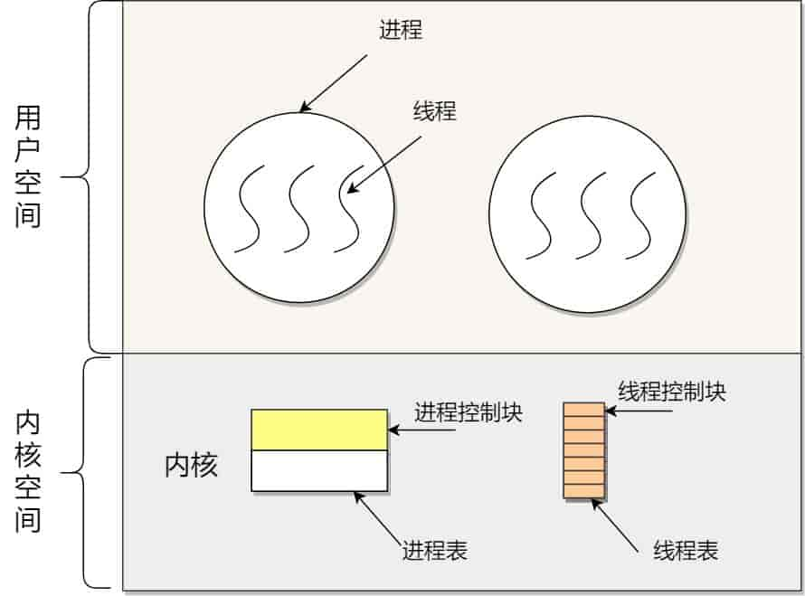

内核线程的**优点**：

- 在一个进程当中，如果某个内核线程发起系统调用而被阻塞，并不会影响其他内核线程的运行；
- 分配给线程，多线程的进程获得更多的 CPU 运行时间；

内核线程的**缺点**：

- 在支持内核线程的操作系统中，由内核来维护进程和线程的上下文信息，如 PCB 和 TCB；
- 线程的创建、终止和切换都是通过系统调用的方式来进行，因此对于系统来说，系统开销比较大；

以上，就是内核线程的优缺点了。

> 最后的轻量级进程如何理解？

**轻量级进程**（Light-weight process，LWP）是**内核支持的用户线程**，一个进程可有**一个或多个LWP**，每个 LWP 是跟内核线程一对一映射的，也就是 LWP 都是由一个内核线程支持，而且 LWP 是由内核管理并像普通进程一样被调度。

在大多数系统中，**LWP 与普通进程的区别也就在于它只有一个最小的执行上下文和调度程序所需的统计信息**。一般来说，一个进程代表程序的一个实例，而 LWP 代表程序的执行线程，因为一个执行线程不像进程那样需要那么多状态信息，所以 LWP 也不带有这样的信息。

在 LWP 之上也是可以使用用户线程的，那么 LWP 与用户线程的对应关系就有三种：

- `1 : 1`，即一个 LWP 对应一个用户线程；
- `N : 1`，即一个 LWP 对应多个用户线程；
- `M : N`，即多个 LWP 对应多个用户线程；

接下来针对上面这三种对应关系说明它们优缺点。先看下图的 LWP 模型：

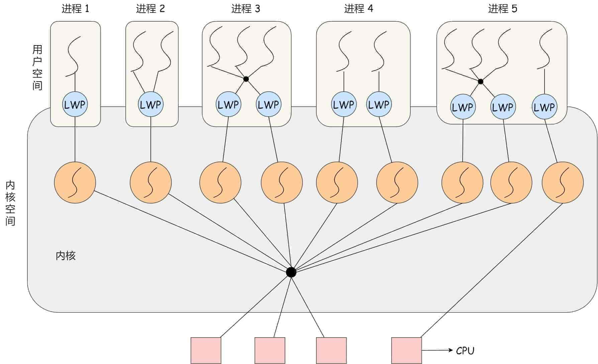

**1 : 1 模式**

一个线程对应到一个 LWP 再对应到一个内核线程，如上图的进程 4，属于此模型。

- 优点：实现并行，当一个 LWP 阻塞，不会影响其他 LWP；
- 缺点：每一个用户线程，就产生一个内核线程，创建线程的开销较大。

**N : 1 模式**

多个用户线程对应一个 LWP 再对应一个内核线程，如上图的进程 2，线程管理是在用户空间完成的，此模式中用户的线程对操作系统不可见。

- 优点：用户线程要开几个都没问题，且上下文切换发生在用户空间，切换的效率较高；
- 缺点：一个用户线程如果阻塞了，则整个进程都将会阻塞，另外在多核 CPU 中，是没办法充分利用 CPU 的。

**M : N 模式**

根据前面的两个模型混搭一起，就形成 `M:N` 模型，该模型提供了两级控制，首先多个用户线程对应到多个 LWP，LWP 再一一对应到内核线程，如上图的进程 3。

- 优点：综合了前两种优点，大部分的线程上下文发生在用户空间，且多个线程又可以充分利用多核 CPU 的资源。

**组合模式**

如上图的进程 5，此进程结合 `1:1` 模型和 `M:N` 模型。开发人员可以针对不同的应用特点调节内核线程的数目来达到物理并行性和逻辑并行性的最佳方案。

### 多线程的优点和缺点？

>   多线程的优点

**提高程序性能**

-   充分利用多核CPU资源，并行执行任务，加快计算速度（如视频渲染、科学计算）。
-   在I/O密集型任务（如文件读写、网络请求）中，线程阻塞时可切换执行其他任务，减少CPU闲置时间。

**增强响应能力**

-   在GUI程序中，主线程保持界面交互流畅，后台线程处理耗时操作（如下载、数据处理），避免界面卡顿。
-   实时系统（如监控软件、交易系统）通过多线程实现任务并行处理。

**简化复杂任务设计**

-   将任务拆分为独立子线程，代码结构更清晰（如Web服务器为每个请求分配独立线程）。
-   支持异步编程（如日志记录、缓存更新），避免阻塞主流程。

**资源高效利用**

-   线程共享进程内存和变量，通信成本低（相比进程间通信需IPC机制）。
-   线程创建和切换开销小于进程，适合高并发场景（如Nginx处理海量请求）。

**模块化与可维护性**

-   通过线程分离功能模块（如游戏开发中物理引擎与渲染线程分离），降低代码耦合度。

>   多线程的缺点

**同步与线程安全问题**

-   共享资源需通过锁（如互斥锁）或原子操作避免竞态条件（Race Conditions）和数据竞争。
-   不当同步可能导致死锁（Deadlocks），如线程相互等待资源释放。

**调试与维护困难**

-   线程间交互复杂，问题难以复现（如并发bug可能仅在特定时序下出现）。
-   调试工具对多线程支持有限，需依赖日志和静态分析。

**资源消耗与性能瓶颈**

-   每个线程占用内存（如线程栈默认1-2MB），过多线程导致内存耗尽或频繁上下文切换，降低性能。
-   线程数超过CPU核心数时，调度开销显著增加。

**稳定性风险**

-   单个线程崩溃可能波及整个进程（如内存越界访问导致进程终止）。
-   缺乏进程级别的隔离性，安全性较低。

**编程复杂度高**

-   需深入理解并发模型（如锁、信号量），对开发者经验要求较高。
-   不同语言/平台差异大（如Python的GIL限制多线程性能）。

>   适用场景与替代方案

| 场景                        | 推荐方案                         | 注意事项                 |
| --------------------------- | -------------------------------- | ------------------------ |
| **I/O密集型**（网络、文件） | 多线程+异步I/O                   | 避免线程过多导致切换开销 |
| **CPU密集型**（计算、渲染） | 多进程（绕过线程限制，如Python） | 需处理进程间通信         |
| **高稳定性需求**            | 多进程+隔离内存                  | 如浏览器多标签页设计     |

>   总结

多线程通过并发执行提升性能与响应速度，但需权衡同步复杂度与资源消耗。实际开发中可结合线程池优化资源管理，或混合多进程与多线程。

### 线程是否具有相同的堆栈?

答：真正的程序执行都是线程来完成的，程序启动的时候操作系统就帮你创建了一个主线程。

每个线程有自己的堆栈。

### 内核线程和用户线程的区别？

（1）管理方式

-   内核线程：由操作系统内核进行管理。内核负责线程的创建、调度、销毁等操作，对线程的运行状态进行跟踪和控制。

-   用户线程：由用户空间的线程库进行管理。应用程序通过调用线程库的函数来创建、管理和调度用户线程，内核并不知道用户线程的存在。

（2）调度方式

-   内核线程：内核根据其调度算法，在不同的内核线程之间进行切换和调度，以实现多任务处理。调度的基本单位是内核线程，每个内核线程都可以独立地在处理器上运行。

-   用户线程：用户线程的调度由用户空间的线程库完成。线程库通常采用简单的轮转调度或优先级调度算法，在用户线程之间进行切换。但这种调度是在用户空间内进行的，不会直接涉及内核的调度机制。

（3）系统资源占用

-   内核线程：每个内核线程都有自己独立的内核栈和上下文信息，需要占用一定的内核空间和系统资源。创建和销毁内核线程的开销相对较大。

-   用户线程：用户线程共享进程的地址空间和资源，它们在用户空间中运行，不需要额外的内核空间来存储线程信息，不需要涉及到内核态和上下文切换。创建和销毁用户线程的开销相对较小。

（4）并发能力

>   在多核处理器上，如果使用用户级线程，则一个进程中的多个用户级线程只能被分配到同一CPU上执行。而使用内核级线程时，可以将多个线程分配给不同的CPU进行并行执行。

-   内核线程：内核可以同时调度多个内核线程在不同的处理器核心上并行执行，充分利用多核处理器的性能，实现真正的并发执行。

-   用户线程：在单处理器系统中，用户线程实际上是通过线程库的调度在同一处理器上轮流执行，不能实现真正的并行。在多处理器系统中，虽然多个用户线程可以在不同的处理器核心上同时运行，但由于用户线程的调度由用户空间的线程库控制，其并发能力受到一定限制。

>   阻塞与同步：当一个用户级线程被阻塞时，整个进程中的所有用户级线程都会受影响，因为调度决策是由用户程序控制的。而当一个内核级线程被阻塞时，其他进程或者同一进程中的其他线程仍然可以继续执行。

## 协程（Coroutine）

定义：

协程是一种用户态的轻量级线程，或者说是一种“用户态的协作式多任务”。它不是由操作系统内核调度的，而是由程序自身（或协程库）进行调度。协程在执行过程中可以主动暂停（yield）并将控制权交给其他协程，并在需要时从暂停点恢复执行。

特点：

1.  用户态调度：协程的调度完全由用户程序控制，通常由协程库或语言运行时实现。内核对协程一无所知。
2.  协作式调度：协程的切换是协作式的，一个协程只有在主动放弃CPU（例如通过 `yield` 或 `await`）时，才会将控制权交给其他协程。如果一个协程不主动放弃，它会一直占用CPU，直到完成或遇到阻塞操作。
3.  资源消耗：
    -   创建/销毁开销小：协程的创建和销毁只是简单的函数调用和栈空间的分配，不涉及系统调用，开销非常小。
    -   上下文切换开销小：协程上下文切换只涉及少量寄存器和栈指针的保存和恢复，不涉及用户态到内核态的切换，开销极小。
    -   内存消耗：协程的栈空间通常很小（几KB到几十KB），可以创建成千上万个协程而不会耗尽内存。
4.  同步机制相对简单：由于协程是协作式的，通常不需要复杂的锁机制来保护共享数据，因为在同一时间只有一个协程在运行。但如果协程内部有阻塞操作，或者需要与线程进行交互，仍然需要同步。
5.  单核并发：协程在单核CPU上实现的是并发，而不是并行。它们通过快速切换来模拟并行。

适用场景：

-   I/O密集型任务：当一个协程遇到I/O阻塞时，它可以主动让出CPU，让其他协程继续执行，从而提高I/O并发能力和吞吐量。
-   高并发连接服务：例如Web服务器、游戏服务器等，可以为每个连接创建一个协程，以极低的资源消耗支持大量并发连接。
-   状态机和事件驱动编程：协程的暂停和恢复机制非常适合实现复杂的异步逻辑和状态机。
-   简化异步编程：通过同步的方式编写异步代码，避免回调地狱（Callback Hell）。

线程与协程的区别总结：

| 特性     | 线程（Thread）                          | 协程（Coroutine）                             |
| :------- | :-------------------------------------- | :-------------------------------------------- |
| 调度者   | 操作系统内核                            | 用户程序/协程库/语言运行时                    |
| 调度方式 | 抢占式调度                              | 协作式调度（主动让出CPU）                     |
| 资源消耗 | 创建/销毁、上下文切换开销大；内存消耗大 | 创建/销毁、上下文切换开销小；内存消耗小       |
| 并行性   | 多核CPU上可实现并行                     | 单核CPU上实现并发，无法并行                   |
| 共享资源 | 共享进程地址空间，需复杂同步机制        | 共享进程地址空间，同步相对简单（但仍需注意）  |
| 可见性   | 内核可见                                | 内核不可见，只在用户态存在                    |
| 栈空间   | 通常较大（MB级别）                      | 通常较小（KB级别）                            |
| 编程模型 | 传统同步编程，阻塞I/O导致线程阻塞       | 异步编程同步化，通过 `yield`/`await` 避免阻塞 |

## 进程和线程有什么区别？

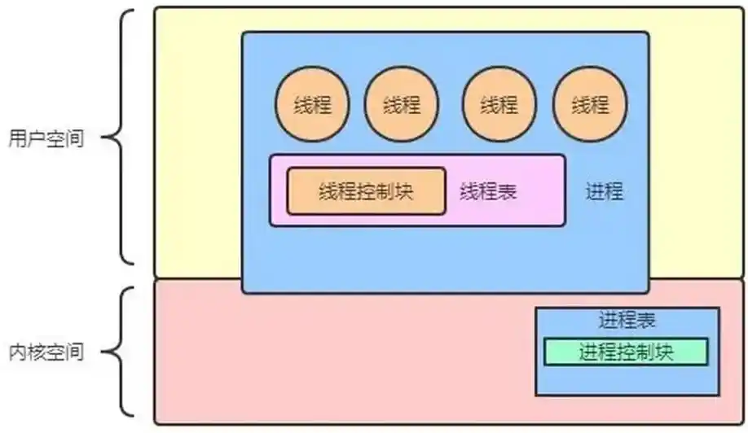

答：进程是并发执行的程序在执行过程中分配和管理资源的基本单位。线程是进程的一个执行单元，是比进程还要小的独立运行的基本单位。一个程序至少有一个进程，一个进程至少有一个线程。两者的区别主要有以下几个方面：

1.   进程是资源分配的最小单位。
2.   线程是程序执行的最小单位，也是处理器调度的基本单位，但进程不是，两者均可并发执行。
3.   进程有自己的独立地址空间，每启动一个进程，系统就会为它分配地址空间，建立数据表来维护代码段、堆栈段和数据段，这种操作非常昂贵。而线程是共享进程中的数据，使用相同的地址空间，因此，CPU切换一个线程的花费远比进程小很多，同时创建一个线程的开销也比进程小很多。
4.   线程之间的通信更方便，同一进程下的线程共享全局变量、静态变量等数据，而进程之间的通信需要以通信的方式（IPC)进行。不过如何处理好同步与互斥是编写多线程程序的难点。但是多进程程序更健壮，多线程程序只要有一个线程死掉，整个进程也跟着死掉了，而一个进程死掉并不会对另外一个进程造成影响，因为进程有自己独立的地址空间。
5.   进程切换时，消耗的资源大，效率低。所以涉及到频繁的切换时，使用线程要好于进程。同样如果要求同时进行并且又要共享某些变量的并发操作，只能用线程不能用进程。
6.   执行过程：每个独立的进程有一个程序运行的入口、顺序执行序列和程序入口。但是线程不能独立执行，必须依存在应用程序中，由应用程序提供多个线程执行控制。

优缺点：

-   线程执行开销小，但是不利于资源的管理和保护。线程适合在SMP机器（双CPU系统）上运行。
-   进程执行开销大，但是能够很好的进行资源管理和保护，可以跨机器迁移。

何时使用多进程，何时使用多线程？

-   对资源的管理和保护要求高，不限制开销和效率时，使用多进程。
-   要求效率高，频繁切换时，资源的保护管理要求不是很高时，使用多线程。

## 进程和线程的对比

（1）定义与基本概念

进程：是程序在操作系统中的一次执行过程，是系统进行资源分配和调度的基本单位，有独立的内存空间和系统资源。

线程：是进程中的一个执行单元，是CPU调度和分派的基本单位，不能独立存在，依赖于进程，共享进程的资源。

（2）资源分配

进程：拥有独立的地址空间，进程间的资源相互隔离，各自的资源如内存、文件等互不干扰。

线程：同一进程内的线程共享进程的资源，如代码段、数据段、打开的文件等，但每个线程有自己独立的栈空间和寄存器等少量资源。

（3）调度与执行

进程：进程调度开销大，涉及到内存环境切换等操作，切换速度慢。

线程：线程上下文切换开销小，因为共享进程资源，切换时只需保存和恢复少量寄存器等信息，切换速度快。

（4）并发性与独立性

进程：进程间可并发执行，相互独立，一个进程崩溃通常不影响其他进程。

线程：同一进程内的线程可并发执行，线程间协作性高，但一个线程崩溃可能导致整个进程崩溃。

## 调度

进程都希望自己能够占用 CPU 进行工作，那么这涉及到前面说过的进程上下文切换。

一旦操作系统把进程切换到运行状态，也就意味着该进程占用着 CPU 在执行，但是当操作系统把进程切换到其他状态时，那就不能在 CPU 中执行了，于是操作系统会选择下一个要运行的进程。

选择一个进程运行这一功能是在操作系统中完成的，通常称为**调度程序**（*scheduler*）。

那到底什么时候调度进程，或以什么原则来调度进程呢？

>   我知道很多人会问，线程不是操作系统的调度单位吗？为什么这里参与调度的是进程？
>
>   先提前说明，这里的进程指只有主线程的进程，所以调度主线程就等于调度了整个进程。
>
>   那为什么干脆不直接取名线程调度？主要是操作系统相关书籍，都是用进程调度这个名字，这里也沿用了这个名字。

### 调度时机

在进程的生命周期中，当进程从一个运行状态到另外一状态变化的时候，其实会触发一次调度。

比如，以下状态的变化都会触发操作系统的调度：

- *从就绪态 -> 运行态*：当进程被创建时，会进入到就绪队列，操作系统会从就绪队列选择一个进程运行；
- *从运行态 -> 阻塞态*：当进程发生 I/O 事件而阻塞时，操作系统必须选择另外一个进程运行；
- *从运行态 -> 结束态*：当进程退出结束后，操作系统得从就绪队列选择另外一个进程运行；

因为，这些状态变化的时候，操作系统需要考虑是否要让新的进程给 CPU 运行，或者是否让当前进程从 CPU 上退出来而换另一个进程运行。

另外，如果硬件时钟提供某个频率的周期性中断，那么可以根据如何处理时钟中断，把调度算法分为两类：

- **非抢占式调度算法**挑选一个进程，然后让该进程运行直到被阻塞，或者直到该进程退出，才会调用另外一个进程，也就是说不会理时钟中断这个事情。
- **抢占式调度算法**挑选一个进程，然后让该进程只运行某段时间，如果在该时段结束时，该进程仍然在运行时，则会把它挂起，接着调度程序从就绪队列挑选另外一个进程。这种抢占式调度处理，需要在时间间隔的末端发生**时钟中断**，以便把 CPU 控制返回给调度程序进行调度，也就是常说的**时间片机制**。

### 调度原则

**原则一**（提高CPU 利用率）：如果运行的程序，发生了 I/O 事件的请求，那 CPU 使用率必然会很低，因为此时进程在阻塞等待硬盘的数据返回。这样的过程，势必会造成 CPU 突然的空闲。所以，为了提高 CPU 利用率，在这种发送 I/O 事件致使 CPU 空闲的情况下，调度程序需要从就绪队列中选择一个进程来运行。

**原则二**（提高系统的吞吐率）：有的程序执行某个任务花费的时间会比较长，如果这个程序一直占用着 CPU，会造成系统吞吐量（CPU 在单位时间内完成的进程数量）的降低。所以，**要提高系统的吞吐率，调度程序要权衡长任务和短任务进程的运行完成数量。**

**原则三**（减少周转时间）：从进程开始到结束的过程中，实际上是包含两个时间，分别是进程运行时间和进程等待时间，这两个时间总和就称为周转时间。进程的周转时间越小越好，**如果进程的等待时间很长而运行时间很短，那周转时间就很长**，这不是我们所期望的，调度程序应该避免这种情况发生。

**原则四**（减少等待时间）：处于就绪队列的进程，也不能等太久，当然希望这个等待的时间越短越好，这样可以使得进程更快的在 CPU 中执行。所以，**就绪队列中进程的等待时间也是调度程序所需要考虑的原则。**

**原则五**（减少响应时间）：对于鼠标、键盘这种交互式比较强的应用，我们当然希望它的响应时间越快越好，否则就会影响用户体验了。所以，**对于交互式比较强的应用，响应时间也是调度程序需要考虑的原则。**

针对上面的五种调度原则，总结成如下：

- **CPU 利用率**：调度程序应确保 CPU 是始终匆忙的状态，这可提高 CPU 的利用率；
- **系统吞吐量**：吞吐量表示的是单位时间内 CPU 完成进程的数量，长作业的进程会占用较长的 CPU 资源，因此会降低吞吐量，相反，短作业的进程会提升系统吞吐量；
- **周转时间**：周转时间是进程运行 + 阻塞时间 + 等待时间的总和，一个进程的周转时间越小越好；
- **等待时间**：这个等待时间不是阻塞状态的时间，而是进程处于就绪队列的时间，等待的时间越长，用户越不满意；
- **响应时间**：用户提交请求到系统第一次产生响应所花费的时间，在交互式系统中，响应时间是衡量调度算法好坏的主要标准。

说白了，这么多调度原则，目的就是要使得进程要「快」。

### 调度算法

不同的调度算法适用的场景也是不同的。

接下来，说说在**单核 CPU 系统**中常见的调度算法。

> 01 先来先服务调度算法

最简单的一个调度算法，就是非抢占式的**先来先服务（*First Come First Serve, FCFS*）算法**了。

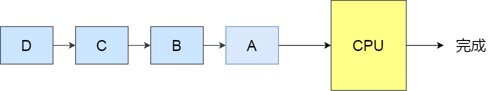

顾名思义，先来后到，**每次从就绪队列选择最先进入队列的进程，然后一直运行，直到进程退出或被阻塞**，才会继续从队列中选择第一个进程接着运行。

这似乎很公平，但是当一个长作业先运行了，那么后面的短作业等待的时间就会很长，不利于短作业。

FCFS 对长作业有利，适用于 CPU 繁忙型作业的系统，而不适用于 I/O 繁忙型作业的系统。

> 02 最短作业优先调度算法

**最短作业优先（Shortest Job First, SJF）调度算法**同样也是顾名思义，它会**优先选择运行时间最短的进程来运行**，这有助于提高系统的吞吐量。

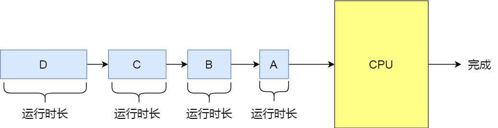

这显然对长作业不利，很容易造成一种极端现象。

比如，一个长作业在就绪队列等待运行，而这个就绪队列有非常多的短作业，那么就会使得长作业不断的往后推，周转时间变长，致使长作业长期不会被运行。

> 03 高响应比优先调度算法

前面的「先来先服务调度算法」和「最短作业优先调度算法」都没有很好的权衡短作业和长作业。

那么，高响应比优先（Highest Response Ratio Next, HRRN）调度算法主要是权衡了短作业和长作业。

**每次进行进程调度时，先计算「响应比优先级」，然后把「响应比优先级」最高的进程投入运行**，「响应比优先级」的计算公式：


从上面的公式，可以发现：

- 如果两个进程的「等待时间」相同时，「要求的服务时间」越短，「响应比」就越高，这样短作业的进程容易被选中运行；
- 如果两个进程「要求的服务时间」相同时，「等待时间」越长，「响应比」就越高，这就兼顾到了长作业进程，因为进程的响应比可以随时间等待的增加而提高，当其等待时间足够长时，其响应比便可以升到很高，从而获得运行的机会；

>   很多人问怎么才能知道一个进程要求服务的时间？这不是不可预知的吗？
>
>   对的，这是不可预估的。所以，高响应比优先调度算法是「理想型」的调度算法，现实中是实现不了的。
>

> 04 时间片轮转调度算法

最古老、最简单、最公平且使用最广的算法就是**时间片轮转（*Round Robin, RR*）调度算法**。

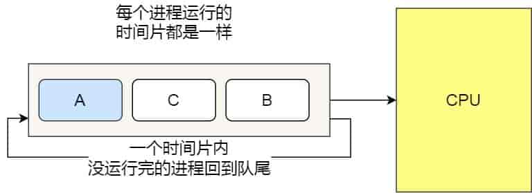

**每个进程被分配一个时间段，称为时间片（*Quantum*），即允许该进程在该时间段中运行。**

- 如果时间片用完，进程还在运行，那么将会把此进程从 CPU 释放出来，并把 CPU 分配给另外一个进程；
- 如果该进程在时间片结束前阻塞或结束，则 CPU 立即进行切换；

另外，时间片的长度就是一个很关键的点：

- 如果时间片设得太短会导致过多的进程上下文切换，降低了 CPU 效率；
- 如果时间片设得太长又可能引起短作业进程的响应时间变长，不利于短作业。

一般来说，时间片设为 `20ms~50ms` 通常是一个比较合理的折中值。

> 05 最高优先级调度算法

前面的「时间片轮转算法」做了个假设，即让所有的进程同等重要，也不偏袒谁，大家的运行时间都一样。

但是，对于多用户计算机系统就有不同的看法了，它们希望调度是有优先级的，即希望调度程序能**从就绪队列中选择最高优先级的进程进行运行，这称为最高优先级（*Highest Priority First，HPF*）调度算法**。

进程的优先级可以分为，静态优先级和动态优先级：

- 静态优先级：创建进程时候，就已经确定了优先级了，然后整个运行时间优先级都不会变化；
- 动态优先级：根据进程的动态变化调整优先级，比如如果进程运行时间增加，则降低其优先级，如果进程等待时间（就绪队列的等待时间）增加，则升高其优先级，也就是**随着时间的推移增加等待进程的优先级**。

该算法也有两种处理优先级高的方法，非抢占式和抢占式：

- 非抢占式：当就绪队列中出现优先级高的进程，运行完当前进程，再选择优先级高的进程。
- 抢占式：当就绪队列中出现优先级高的进程，当前进程挂起，调度优先级高的进程运行。

但是依然有缺点，可能会导致低优先级的进程永远不会运行。

> 06 多级反馈队列调度算法

**多级反馈队列（Multilevel Feedback Queue）调度算法**是「时间片轮转算法」和「最高优先级算法」的综合和发展。

顾名思义：

- 「多级」表示有多个队列，每个队列优先级从高到低，同时优先级越高时间片越短。
- 「反馈」表示如果有新的进程加入优先级高的队列时，立刻停止当前正在运行的进程，转而去运行优先级高的队列；

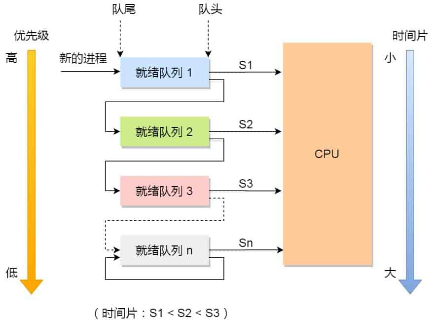

来看看，它是如何工作的：

- 设置了多个队列，赋予每个队列不同的优先级，每个**队列优先级从高到低**，同时**优先级越高时间片越短**；
- 新的进程会被放入到第一级队列的末尾，按先来先服务的原则排队等待被调度，如果在第一级队列规定的时间片没运行完成，则将其转入到第二级队列的末尾，以此类推，直至完成；
- 当较高优先级的队列为空，才调度较低优先级的队列中的进程运行。如果进程运行时，有新进程进入较高优先级的队列，则停止当前运行的进程并将其移入到原队列末尾，接着让较高优先级的进程运行；

可以发现，对于短作业可能可以在第一级队列很快被处理完。对于长作业，如果在第一级队列处理不完，可以移入下次队列等待被执行，虽然等待的时间变长了，但是运行时间也变更长了，所以该算法很好的**兼顾了长短作业，同时有较好的响应时间。**

> 看的迷迷糊糊？那我拿去银行办业务的例子，把上面的调度算法串起来，你还不懂，你锤我！

**办理业务的客户相当于进程，银行窗口工作人员相当于 CPU。**

现在，假设这个银行只有一个窗口（单核 CPU），那么工作人员一次只能处理一个业务。

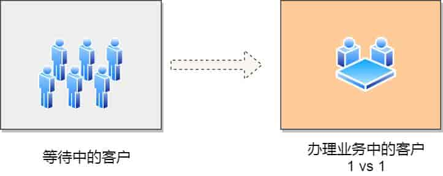

那么最简单的处理方式，就是先来的先处理，后面来的就乖乖排队，这就是**先来先服务（*FCFS*）调度算法**。但是万一先来的这位老哥是来贷款的，这一谈就好几个小时，一直占用着窗口，这样后面的人只能干等，或许后面的人只是想简单的取个钱，几分钟就能搞定，却因为前面老哥办长业务而要等几个小时，你说气不气人？


有客户抱怨了，那我们就要改进，我们干脆优先给那些几分钟就能搞定的人办理业务，这就是**短作业优先（*SJF*）调度算法**。听起来不错，但是依然还是有个极端情况，万一办理短业务的人非常的多，这会导致长业务的人一直得不到服务，万一这个长业务是个大客户，那不就捡了芝麻丢了西瓜


那就公平起见，现在窗口工作人员规定，每个人我只处理 10 分钟。如果 10 分钟之内处理完，就马上换下一个人。如果没处理完，依然换下一个人，但是客户自己得记住办理到哪个步骤了。这个也就是**时间片轮转（RR）调度算法**。但是如果时间片设置过短，那么就会造成大量的上下文切换，增大了系统开销。如果时间片过长，相当于退化成 FCFS 算法了。


既然公平也可能存在问题，那银行就对客户分等级，分为普通客户、VIP 客户、SVIP 客户。只要高优先级的客户一来，就第一时间处理这个客户，这就是**最高优先级（*HPF*）调度算法**。但依然也会有极端的问题，万一当天来的全是高级客户，那普通客户不是没有被服务的机会，不把普通客户当人是吗？那我们把优先级改成动态的，如果客户办理业务时间增加，则降低其优先级，如果客户等待时间增加，则升高其优先级。


那有没有兼顾到公平和效率的方式呢？这里介绍一种算法，考虑的还算充分的，**多级反馈队列（*MFQ*）调度算法**，它是时间片轮转算法和优先级算法的综合和发展。它的工作方式：


- 银行设置了多个排队（就绪）队列，每个队列都有不同的优先级，**各个队列优先级从高到低**，同时每个队列执行时间片的长度也不同，**优先级越高的时间片越短**。
- 新客户（进程）来了，先进入第一级队列的末尾，按先来先服务原则排队等待被叫号（运行）。如果时间片用完客户的业务还没办理完成，则让客户进入到下一级队列的末尾，以此类推，直至客户业务办理完成。
- 当第一级队列没人排队时，就会叫号二级队列的客户。如果客户办理业务过程中，有新的客户加入到较高优先级的队列，那么此时办理中的客户需要停止办理，回到原队列的末尾等待再次叫号，因为要把窗口让给刚进入较高优先级队列的客户。

可以发现，对于要办理短业务的客户来说，可以很快的轮到并解决。对于要办理长业务的客户，一下子解决不了，就可以放到下一个队列，虽然等待的时间稍微变长了，但是轮到自己的办理时间也变长了，也可以接受，不会造成极端的现象，可以说是综合上面几种算法的优点。

