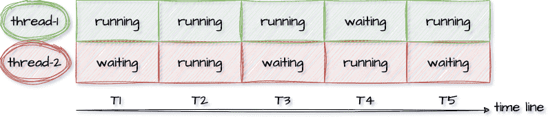

# 同步问题

## lock-free和无锁数据结构

### 什么是lock-free

lock-free没有锁同步的问题，所有线程无阻碍的执行原子指令，而不是等待。比如一个线程读atomic类型变量，一个线程写atomic变量，它们没有任何等待，硬件原子指令确保不会出现数据不一致，写入数据不会出现半完成，读取数据也不会读一半。

那到底什么是lock-free？有人说lock-free就是不使用mutex / semaphores之类的无锁（lock-Less）编程，这句话严格来说并不对。

我们先看一下wiki对Lock-free的描述：

>   Lock-freedom allows individual threads to starve but guarantees system-wide throughput. An algorithm is lock-free if, when the program threads are run for a sufficiently long time, at least one of the threads makes progress (for some sensible definition of progress). All wait-free algorithms are lock-free. In particular, if one thread is suspended, then a lock-free algorithm guarantees that the remaining threads can still make progress. Hence, if two threads can contend for the same mutex lock or spinlock, then the algorithm is not lock-free. (If we suspend one thread that holds the lock, then the second thread will block.)
>
>

翻译一下：

>   无锁允许单个线程饿死，但保证了系统范围的吞吐量。如果当程序线程运行足够长的时间时，至少有一个线程取得进展（对于一些合理的进展定义），则算法是无锁的。所有无等待算法都是无锁的。特别是，如果一个线程挂起，那么无锁算法可以保证剩余的线程仍然可以继续工作。因此，如果两个线程可以争用同一个互斥锁或自旋锁，那么算法就不是无锁的。（如果我们挂起一个持有锁的线程，那么第二个线程就会阻塞。）

-   第1段：lock-free允许单个线程饥饿但保证系统级吞吐。如果一个程序线程执行足够长的时间，那么至少一个线程会往前推进，那么这个算法就是lock-free的。
-   第2段：尤其是，如果一个线程被暂停，lock-free算法保证其他线程依然能够往前推进。

第1段给lock-free下定义，第2段则是对lock-free作解释：如果2个线程竞争同一个互斥锁或者自旋锁，那它就不是lock-free的；因为如果暂停（Hang）持有锁的线程，那么另一个线程会被阻塞。

wiki的这段描述很抽象，它不够直观，稍微再解释一下：lock-free描述的是代码逻辑的属性，不使用锁的代码，大部分具有这种属性。大家经常会混淆这lock-free和无锁这2个概念。其实，lock-free是对代码（算法）性质的描述，是属性；而无锁是说代码如何实现，是手段。

lock-free的关键描述是：如果一个线程被暂停，那么其他线程应能继续前进，它需要有系统级（system-wide）的吞吐。

如图，两个线程在时间线上，至少有一个线程处于running状态。



我们从反面举例来看，假设我们要借助锁实现一个无锁队列，我们可以直接使用线程不安全的std::queue + std::mutex来做：

```c++
template <typename T>
class Queue {
public:
    void push(const T& t) {
        q_mutex.lock();
        q.push(t);
        q_mutex.unlock();
    }
private:
    std::queue<T> q;
    std::mutex q_mutex;
};
```

如果有线程A/B/C同时执行push方法，最先进入的线程A获得互斥锁。线程B和C因为获取不到互斥锁而陷入等待。这个时候，线程A如果因为某个原因（如出现异常，或者等待某个资源）而被永久挂起，那么同样执行push的线程B/C将被永久挂起，系统整体（system-wide）没法推进，而这显然不符合lock-free的要求。因此：所有基于锁（包括spinlock）的并发实现，都不是lock-free的。

因为它们都会遇到同样的问题：即如果永久暂停当前占有锁的线程/进程的执行，将会阻塞其他线程/进程的执行。而对照lock-free的描述，它允许部分process（理解为执行流）饿死但必须保证整体逻辑的持续前进，基于锁的并发显然是违背lock-free要求的。

### CAS loop实现Lock-free

Lock-Free同步主要依靠CPU提供的read-modify-write原语，著名的“比较和交换”CAS（Compare And Swap）在X86机器上是通过cmpxchg系列指令实现的原子操作，CAS逻辑上用代码表达是这样的：

```c++
bool CAS(T* ptr, T expect_value, T new_value) {
   if (*ptr != expect_value) {
      return false;
   }
   *ptr = new_value;
   return true;
}
```

CAS接受3个参数：

-   内存地址
-   期望值，通常传第一个参数所指内存地址中的旧值
-   新值

逻辑描述：CAS比较内存地址中的值和期望值，如果不相同就返回失败，如果相同就将新值写入内存并返回成功。

当然这个C函数描述的只是CAS的逻辑，这个函数操作不是原子的，因为它可以划分成几个步骤：读取内存值、判断、写入新值，各步骤之间是可以插入其他操作的。不过前面讲了，原子指令相当于把这些步骤打包，它可能是通过lock; cmpxchg指令实现的，但那是实现细节，程序员更应该注重在逻辑上理解它的行为。

通过CAS实现Lock-free的代码通常借助循环，代码如下：

```c++
do {
    T expect_value = *ptr;
} while (!CAS(ptr, expect_value, new_value));
```

1.  创建共享数据的本地副本：expect_value。
2.  根据需要修改本地副本，从ptr指向的共享数据里load后赋值给expect_value。
3.  检查共享的数据跟本地副本是否相等，如果相等，则把新值复制到共享数据。

第三步是关键，虽然CAS是原子的，但加载expect_value跟CAS这2个步骤，并不是原子的。所以，我们需要借助循环，如果ptr内存位置的值没有变（*ptr \== expect_value），那就存入新值返回成功；否则说明加载expect_value后，ptr指向的内存位置被其他线程修改了，这时候就返回失败，重新加载expect_value，重试，直到成功为止。

CAS loop支持多线程并发写，这个特点太有用了，因为多线程同步，很多时候都面临多写的问题，我们可以基于CAS实现Fetch-and-add(FAA)算法，它看起来像这样：

```c++
T faa(T & t) {
    T temp = t;
    while (!compare_and_swap(x, temp, temp + 1));
}
```

第一步加载共享数据的值到temp，第二步比较+存入新值，直到成功。

### 无锁数据结构：lock-free stack

无锁数据结构是通过非阻塞算法而非锁保护共享数据，非阻塞算法保证竞争共享资源的线程，不会因为互斥而让它们的执行无限期暂停；无阻塞算法是lock-free的，因为无论如何调度都能确保有系统级的进度。wiki定义如下：

>   A non-blocking algorithm ensures that threads competing for a shared resource do not have their execution indefinitely postponed by mutual exclusion. A non-blocking algorithm is lock-free if there is guaranteed system-wide progress regardless of scheduling.

翻译一下：

>   非阻塞算法确保竞争共享资源的线程不会因互斥而无限期延迟执行。非阻塞算法是无锁的，如果有保证的系统范围的进度，而不考虑调度。

下面是C++ atomic compare_exchange_weak()实现的一个lock-free堆栈（from CppReference）：

```c++
template <typename T>
struct node {
    T data;
    node* next;
    node(const T& data) : data(data), next(nullptr) {}
};

template <typename T>
class stack {
    std::atomic<node<T>*> head;
public:
    void push(const T& data) {
      node<T>* new_node = new node<T>(data);
      new_node->next = head.load(std::memory_order_relaxed);
      while (!head.compare_exchange_weak(new_node->next, new_node, std::memory_order_release, std::memory_order_relaxed));
    }
};
```

代码解析：

-   节点（node）保存T类型的数据data，并且持有指向下一个节点的指针。
-   std::atomic<node*>类型表明atomic里放置的是Node的指针，而非Node本身，因为指针在64位系统上是8字节，等于机器字长，再长没法保证原子性。
-   stack类包含head成员，head是一个指向头结点的指针，头结点指针相当于堆顶指针，刚开始没有节点，head为NULL。
-   push函数里，先根据data值创建新节点，然后要把它放到堆顶。
-   因为是用链表实现的栈，所以，如果新节点要成为新的堆顶（相当于新节点作为新的头结点插入），那么新节点的next域要指向原来的头结点，并让head指向新节点。
-   new_node->next = head.load把新节点的next域指向原头结点，然后head.compare_exchange_weak(new_node->next, new_node)，让head指向新节点。
-   C++ atomic的compare_exchange_weak()跟上述的CAS稍有不同，head.load()不等于new_node->next的时候，它会把head.load()的值重新加载到new_node->next。
-   所以，在加载head值和CAS之间，如果其他线程调用push操作，改变了head的值，那没有关系，该线程的本次cas失败，下次重试便可以了。
-   多个线程同时push时，任一线程在任意步骤阻塞/挂起，其他线程都会继续执行并最终返回，无非就是多执行几次while循环。

这样的行为逻辑显然符合lock-free的定义，注意用CAS+Loop实现自旋锁不符合lock-free的定义，注意区分。

## 程序序：Program Order

对单线程程序而言，代码会一行行顺序执行，就像我们编写的程序的顺序那样。比如：

```c++
a = 1;
b = 2;
```

会先执行a=1再执行b=2，从程序角度看到的代码行依次执行叫程序序，我们在此基础上构建软件，并以此作为讨论的基础。

## 内存序：Memory Order

与程序序相对应的内存序，是指从某个角度观察到的对于内存的读和写所真正发生的顺序。内存操作顺序并不唯一，在一个包含core0和core1的CPU中，core0和core1有着各自的内存操作顺序，这两个内存操作顺序不一定相同。从包含多个Core的CPU的视角看到的全局内存操作顺序跟单core视角看到的内存操作顺序亦不同，而这种不同，对于有些程序逻辑而言，是不可接受的，例如：

程序序要求a = 1在b = 2之前执行，但内存操作顺序可能并非如此，对a赋值1并不确保发生在对b赋值2之前，这是因为：

-   如果编译器认为对b赋值没有依赖对a赋值，那它完全可能在编译期调整编译后的汇编指令顺序。
-   即使编译器不做调整，到了执行期，也有可能对b的赋值先于对a赋值执行。

虽然对一个Core而言，如上所述，这个Core观察到的内存操作顺序不一定符合程序序，但内存操作序和程序序必定产生相同的结果，无论在单Core上对a、b的赋值哪个先发生，结果上都是a被赋值为1、b被赋值为2，如果单核上乱序执行会影响结果，那编译器的指令重排和CPU乱序执行便不会发生，硬件会提供这项保证。

但多核系统，硬件不提供这样的保证，多线程程序中，每个线程所工作的Core观察到的不同内存操作序，以及这些顺序与全局内存序的差异，常常导致多线程同步失败，所以，需要有同步机制确保内存序与程序序的一致，内存屏障（Memory Barrier）的引入，就是为了解决这个问题，它让不同的Core之间，以及Core与全局内存序达成一致。

## 乱序执行：Out-of-order Execution

乱序执行会引起内存顺序跟程序顺序不同，乱序执行的原因是多方面的，比如编译器指令重排、超标量指令流水线、预测执行、Cache-Miss等。内存操作顺序无法精确匹配程序顺序，这有可能带来混乱，既然有副作用，那为什么还需要乱序执行呢？答案是为了性能。

我们先看看没有乱序执行之前，早期的有序处理器（In-order Processors）是怎么处理指令的？

-   指令获取，从代码节内存区域加载指令到I-Cache
-   译码
-   如果指令操作数可用（例如操作数位于寄存器中），则分发指令到对应功能模块中；如果操作数不可用，通常是需要从内存加载，则处理器会stall，一直等到它们就绪，直到数据被加载到Cache或拷贝进寄存器
-   指令被功能单元执行
-   功能单元将结果写回寄存器或内存位置

乱序处理器（Out-of-order Processors）又是怎么处理指令的呢？

-   指令获取，从代码节内存区域加载指令到I-Cache
-   译码
-   分发指令到指令队列
-   指令在指令队列中等待，一旦操作数就绪，指令就离开指令队列，那怕它之前的指令未被执行（乱序）
-   指令被派往功能单元并被执行
-   执行结果放入队列（Store Buffer），而不是直接写入Cache
-   只有更早请求执行的指令结果写入cache后，指令执行结果才写入Cache，通过对指令结果排序写入cache，使得执行看起来是有序的

指令乱序执行是结果，但原因并非只有CPU的乱序执行，而是由两种因素导致：

-   **编译期**：指令重排（编译器），编译器会为了性能而对指令重排，源码上先后的两行，被编译器编译后，可能调换指令顺序，但编译器会基于一套规则做指令重排，有明显依赖的指令不会被随意重排，指令重排不能破坏程序逻辑。
-   **运行期**：乱序执行（CPU），CPU的超标量流水线、以及预测执行、Cache-Miss等都有可能导致指令乱序执行，也就是说，后面的指令有可能先于前面的指令执行。

## Store Buffer

**为什么需要Store Buffer？**

考虑下面的代码：

```c++
void set_a() {
    a = 1;
}
```

-   假设运行在core0上的set_a()对整型变量a赋值1，计算机通常不会直接写穿通到内存，而是会在Cache中修改对应Cache Line
-   如果Core0的Cache里没有a，赋值操作（store）会造成Cache Miss
-   Core0会stall在等待Cache就绪（从内存加载变量a到对应的Cache Line），但Stall会损害CPU性能，相当于CPU在这里停顿，白白浪费着宝贵的CPU时间
-   有了Store Buffer，当变量在Cache中没有就位的时候，就先Buffer住这个Store操作，而Store操作一旦进入Store Buffer，core便认为自己Store完成，当随后Cache就位，store会自动写入对应Cache。

所以，我们需要Store Buffer，每个Core都有独立的Store Buffer，每个Core都访问私有的Store Buffer，Store Buffer帮助CPU遮掩了Store操作带来的延迟。

**Store Buffer会带来什么问题？**

```
a = 1;
b = 2;
assert(a == 1);
```

上面的代码，断言a==1的时候，需要读（load）变量a的值，而如果a在被赋值前就在Cache中，就会从Cache中读到a的旧值（可能是1之外的其他值），所以断言就可能失败。但这样的结果显然是不能接受的，它违背了最直观的程序顺序性。

问题出在变量a除保存在内存外，还有2份拷贝：一份在Store Buffer里，一份在Cache里；如果不考虑这2份拷贝的关系，就会出现数据不一致。那怎么修复这个问题呢？

可以通过在Core Load数据的时候，先检查Store Buffer中是否有悬而未决的a的新值，如果有，则取新值；否则从cache取a的副本。这种技术在多级流水线CPU设计的时候就经常使用，叫Store Forwarding。有了Store Buffer Forwarding，就能确保单核程序的执行遵从程序顺序性，但多核还是有问题，让我们考查下面的程序：

**多核内存序问题**

```c++
int a = 0; // 被CPU1 Cache
int b = 0; // 被CPU0 Cache

// CPU0执行
void x() {
    a = 1;
    b = 2;
}

// CPU1执行
void y() {
    while (b == 0);
    assert(a == 1);
}
```

假设a和b都被初始化为0；CPU0执行x()函数，CPU1执行y()函数；变量a在CPU1的local Cache里，变量b在CPU0的local Cache里。

-   CPU0执行a = 1的时候，因为a不在CPU0的local cache，CPU0会把a的新值1写入Store Buffer里，并发送Read Invalidate消息给其他CPU。
-   CPU1执行while (b == 0)，因为b不在CPU1的local cache里，CPU1会发送Read消息去其他CPU获取b的值。
-   CPU0执行b = 2，因为b在CPU0的local Cache，所以直接更新local cache中b的副本。
-   CPU0收到CPU1发来的read消息，把b的新值2发送给CPU1；同时存放b的Cache Line的状态被设置为Shared，以反应b同时被CPU0和CPU1 cache住的事实。
-   CPU1收到b的新值2后结束循环，继续执行assert(a == 1)，因为此时local Cache中的a值为0，所以断言失败。
-   CPU1收到CPU0发来的Read Invalidate后，更新a的值为1，但为时已晚，程序在上一步已经崩了（assert失败）。

怎么办？答案留到内存屏障一节揭晓。

## Invalidate Queue

**为什么需要Invalidate Queue？**

当一个变量加载到多个core的Cache，则这个Cache Line处于Shared状态，如果Core1要修改这个变量，则需要通过发送核间消息Invalidate来通知其他Core把对应的Cache Line置为Invalid，当其他Core都Invalid这个CacheLine后，则本Core获得该变量的独占权，这个时候就可以修改它了。

收到Invalidate消息的core需要回Invalidate ACK，一个个core都这样ACK，等所有core都回复完，Core1才能修改它，这样CPU就白白浪费。

事实上，其他核在收到Invalidate消息后，会把Invalidate消息缓存到Invalidate Queue，并立即回复ACK，真正Invalidate动作可以延后再做，这样一方面因为Core可以快速返回别的Core发出的Invalidate请求，不会导致发生Invalidate请求的Core不必要的Stall，另一方面也提供了进一步优化可能，比如在一个CacheLine里的多个变量的Invalidate可以攒一次做了。

但写Store Buffer的方式其实是Write Invalidate，它并非立即写入内存，如果其他核此时从内存读数，则有可能不一致。

## 内存屏障

那有没有方法确保对a的赋值一定先于对b的赋值呢？有，内存屏障被用来提供这个保障。

内存屏障（Memory Barrier），也称内存栅栏、屏障指令等，是一类同步屏障指令，是CPU或编译器在对内存随机访问的操作中的一个同步点，同步点之前的所有读写操作都执行后，才可以开始执行此点之后的操作。语义上，内存屏障之前的所有写操作都要写入内存；内存屏障之后的读操作都可以获得同步屏障之前的写操作的结果。

内存屏障，其实就是提供一种机制，确保代码里顺序写下的多行，会按照书写的顺序，被存入内存，主要是解决Store Buffer引入导致的写入内存间隙的问题。

```c++
void x() {
    a = 1;
    wmb();
    b = 2;
}
```

像上面那样在a=1和b=2之间插入一条内存屏障语句，就能确保a=1先于b=2生效，从而解决了内存乱序访问问题，那插入的这句smp_mb()，到底会干什么呢？

回忆前面的流程，CPU0在执行完a = 1之后，执行smp_mb()操作，这时候，它会给Store Buffer里的所有数据项做一个标记（marked），然后继续执行b = 2，但这时候虽然b在自己的cache里，但由于store buffer里有marked条目，所以，CPU0不会修改cache中的b，而是把它写入Store Buffer；所以CPU0收到Read消息后，会把b的0值发给CPU1，所以继续在while (b)自旋。

简而言之，Core执行到write memory barrier（wmb）的时候，如果Store Buffer还有悬而未决的store操作，则都会被mark上，直到被标注的Store操作进入内存后，后续的Store操作才能被执行，因此wmb保障了barrier前后操作的顺序，它不关心barrier前的多个操作的内存序，以及barrier后的多个操作的内存序，是否与Global Memory Order一致。

```
a = 1;
b = 2;
wmb();
c = 3;
d = 4;
```

wmb()保证“a=1;b=2”发生在“c=3;d = 4”之前，不保证a = 1和b = 2的内存序，也不保证c = 3和d = 4的内部序。

**Invalidate Queue的引入的问题**

就像引入Store Buffer会影响Store的内存一致性，Invalidate Queue的引入会影响Load的内存一致性。因为Invalidate queue会缓存其他核发过来的消息，比如Invalidate某个数据的消息被delay处置，导致core在Cache Line中命中这个数据，而这个Cache Line本应该被Invalidate消息标记无效。如何解决这个问题呢？

一种思路是硬件确保每次load数据的时候，需要确保Invalidate Queue被清空，这样可以保证load操作的强顺序

软件的思路，就是仿照wmb()的定义，加入rmb()约束。rmb()给我们的invalidate queue加上标记。当一个load操作发生的时候，之前的rmb()所有标记的invalidate命令必须全部执行完成，然后才可以让随后的load发生。这样，我们就在rmb()前后保证了load观察到的顺序等同于global memory order

所以，我们可以像下面这样修改代码：

```
a = 1;
wmb();
b = 2;
while(b != 2) {};
rmb();
assert(a == 1);
```

**系统对内存屏障的支持**

gcc编译器在遇到内嵌汇编语句asm volatile(“” ::: “memory”)，将以此作为一条内存屏障，重排序内存操作，即此语句之前的各种编译优化将不会持续到此语句之后。

Linux 内核提供函数 barrier()用于让编译器保证其之前的内存访问先于其之后的完成。

```c
#define barrier() __asm__ __volatile__("" ::: "memory")
```

CPU内存屏障：

-   通用barrier，保证读写操作有序，mb()和smp_mb()
-   写操作barrier，仅保证写操作有序，wmb()和smp_wmb()
-   读操作barrier，仅保证读操作有序，rmb()和smp_rmb()

**小结**

-   为了提高处理器的性能，SMP中引入了store buffer(以及对应实现store buffer forwarding)和invalidate queue。
-   store buffer的引入导致core上的store顺序可能不匹配于global memory的顺序，对此，我们需要使用wmb()来解决。
-   invalidate queue的存在导致core上观察到的load顺序可能与global memory order不一致，对此，我们需要使用rmb()来解决。
-   由于wmb()和rmb()分别只单独作用于store buffer和invalidate queue，因此这两个memory barrier共同保证了store/load的顺序。

## 小结

pthread接口提供的几种同步原语如下：

| 同步原语                     | 常见应用场景                                                 | 出现背景                                     | 优势                                           | 劣势                                                         | 备注                                                         |
| ---------------------------- | ------------------------------------------------------------ | -------------------------------------------- | ---------------------------------------------- | ------------------------------------------------------------ | ------------------------------------------------------------ |
| 互斥锁(mutex)                | 每次只有一个线程可以向前执行                                 | 大部分场景                                   | 使用简单、锁竞争不激烈的时候性能非常高         | 竞争激烈时候性能较低                                         | 第一选择，pthread有多种锁定特性，建议只使用标准互斥类型      |
| 读写锁(read_write_lock)      | 允许更高的并行度，一次只有一个线程可以占有写模式的锁，但是多个读线程可以占用读模式的读写锁 | 适用于读的次数远大于写的情况                 | 读多写少的情况下性能较好                       | 可能导致写饥饿、读饥饿。(取决于实现）                        | 可以实现为：读优先、写优先、公平。                           |
| 条件变量(condition_variable) | 允许线程以无竞争的方式等到特定的条件发生、同时避免忙等待；拥有通知机制。 | 生产者-消费者模型                            | 可以用于通知线程条件满足                       | 唤醒线程、重新获取锁和重新检查条件可能导致额外的性能开销。   | 需要配合互斥量使用、需要check虚假唤醒和唤醒多个（posix标准允许唤醒一个以上线程） |
| 自旋锁(spin)                 | 线程并不希望在重新调度上花时间。不通过休眠使线程阻塞，而是通过忙等近似阻塞，用来实现一些其他类型的锁 | 锁被持有的时间短                             | 非抢占式内核避免中断、一些系统函数和系统库使用 | 自旋的时间可能会比预期长（时间片作用下）                     | 用户层不推荐使用，因为互斥锁足够高效                         |
| 屏障 (barrier)               | 协调多个线程并行工作，每个线程等待直到全部线程都到达一点然后从该点进行执行 | 适用于固定数量的线程的并行算法、数据初始化等 | 简化同步的代码                                 | 某些实现中，当线程在屏障上等待时会消耗 CPU 资源(忙等)；只适用于固定数量的线程 | 和Memory Barrier是两种，使用pthread_barrier_*接口。类似Java中的CyclicBarrier或者C++20的std:barrier |

由于linux下线程和进程本质都是LWP，那么进程间通信使用的IPC（管道、FIFO、消息队列、信号量）线程间也可以使用，也可以达到相同的作用。但是由于IPC资源在进程退出时不会清理（因为它是系统资源），因此不建议使用。

以下是一些非锁但是也能实现线程安全或者部分线程安全的常见做法：

|名称|简介|常见应用场景|优势|劣势|备注|
| ---------------------------- | ------------------------------------------------------------ | -------------------------------------------- | ---------------------------------------------- | ------------------------------------------------------------ | ------------------------------------------------------------ |
|原子赋值|简单类型的对齐读取和写入通常是原子的。比如 int32、int64|双buffer切换时候的指针赋值；共享内存中简单类型之间修改|无锁且实现简单||本质上单条处理器指令是原子的；<br/>并非所有处理器架构都保证是原子的|
|简单原子变量(atomic)|通过编译器、语言等实现原子的CPU指令|原生类型的自增自减和立即数赋值等、不强调先后只追求最终结果的正确|性能高、实现简单||gcc、C、C++、Java等都有实现<br/>所有原子类型都不支持拷贝<br/>没有浮点类型的原子变量|
|CAS(简单原子变量就是一种weak的CAS)|内存屏障|对执行的先后顺序有严格要求|性能高、实现简单||在竞争严重的时候，自旋可能非常浪费CPU|
|双buffer|在内存中保存两份|更新不频繁的数据|性能高、无需加锁|浪费空间|只适用于一写多读的场景|
|延迟删除双buffer(Double Buffering with Deferred Deletion)|在更新后短期内双buffer，而后删除旧版本，通过指针赋值的原子性切换到新数据|更新不频繁的数据<br/>读多写少的场景|性能高、无需加锁|更新频率有限制|只适用于一写多读的场景|
|thread_local|每个线程持有一份数据，彻底摆脱线程同步|线程间无需实时交互|性能高、无需加锁|每个线程都有一个实例||
|per-cpu变量|每个处理器都分配了该变量的副本|绑核后无锁读写|性能高、无需加锁||参考：DEFINE_PER_CPU，get_cpu_var等|
|RCU(Read-Copy-Update)|需要修改时候创建副本，然后切换副本|读多写少的场景|||参见：rcu_read_lock, https://liburcu.org/|

可以看到，上面很多做法都是采用了副本，尽量避免在 thread 中间共享数据。最快的同步就是没同步（The fastest synchronization of all is the kind that never takes place），Share nothing is best。
