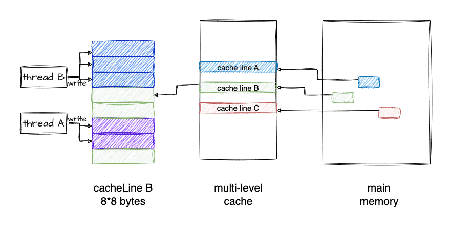
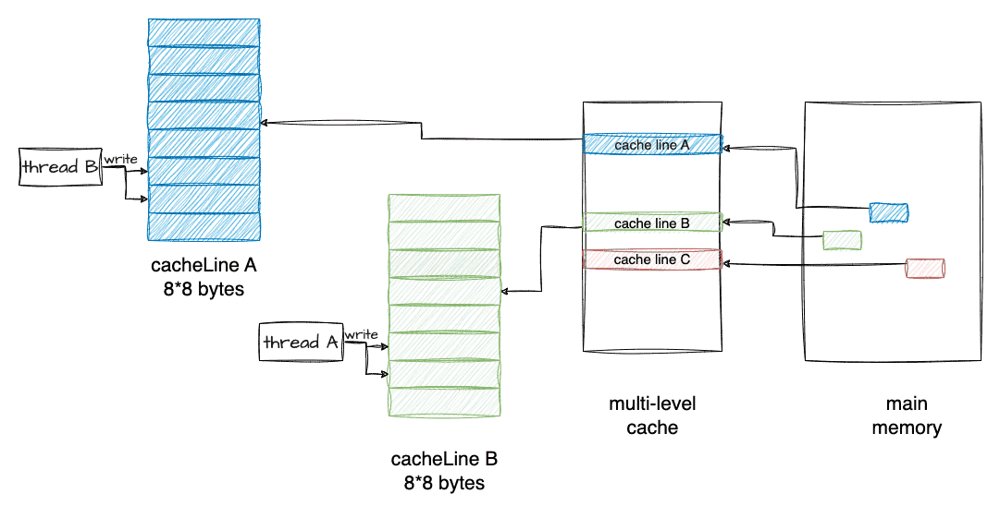

# 伪共享

多个线程同时读写同一个Cache Line中的变量、导致CPU Cache频繁失效，从而使得程序性能下降的现象称为**伪共享**（False Sharing）。

```c++
const size_t shm_size = 16*1024*1024; //16M
static char shm[shm_size];
std::atomic<size_t> shm_offset{0};

void f() {
    for (;;) {
        auto off = shm_offset.fetch_add(sizeof(long));
        if (off >= shm_size) break;
        *(long*)(shm + off) = off; // 赋值
    }
}
```

考察上面的程序：shm是一块16M字节的内存，我测试的机器的L3 Cache是32M，16M字节能确保shm在Cache里放得下。f()函数的循环里，视shm为long类型的数组，依次给每个元素赋值，shm_offset用于记录偏移位置，shm_offset.fetch_add(sizeof(long))原子性的增加shm_offset的值（因为x86_64系统上long的长度为8，所以shm_offset每次增加8），并返回增加前的值，对shm上long数组的每个元素赋值后，结束循环从函数返回。

因为shm_offset是atomic类型变量，所以多线程调用f()依然能正常工作，虽然多个线程会竞争shm_offset，但每个线程会排他性的对各long元素赋值，多线程并行会加快对shm的赋值操作。我们加上多线程调用代码：

```c++
std::atomic<size_t> step{0};

const int THREAD_NUM = 2;

void work_thread() {
    const int LOOP_N = 10;
    for (int n = 1; n <= LOOP_N; ++n) {
        f();
        ++step;
        while (step.load() < n * THREAD_NUM) {}
        shm_offset = 0;
    }
}

int main() {
    std::thread threads[THREAD_NUM];
    for (int i = 0; i < THREAD_NUM; ++i) {
        threads[i] = std::move(std::thread(work_thread));
    }
    for (int i = 0; i < THREAD_NUM; ++i) {
        threads[i].join();
    }
    return 0;
}
```

-   main函数里启动2个工作线程work_thread。
-   工作线程对shm共计赋值10轮，后面的每一轮会访问Cache里的shm数据，step用于work_thread之间每一轮的同步。
-   工作线程调用完f()后会增加step，等2个工作线程都调用完之后，step的值增加到n * THREAD_NUM后，while()会结束循环，重置shm_offset，重新开始新一轮对shm的赋值。

如图所示：



编译后执行上面的程序，产生如下的结果：

```
time ./a.out

real 0m3.406s
user 0m6.740s
sys 0m0.040s
```

time命令用于时间测量，a.out程序运行完成后会打印耗时，real列显式耗时3.4秒。

## 改进版f_fast

我们稍微修改一下f函数，改进版f函数取名f_fast：

```c++
void f_fast() {
    for (;;) {
        const long inner_loop = 16;
        auto off = shm_offset.fetch_add(sizeof(long) * inner_loop);
        for (long j = 0; j < inner_loop; ++j) {
            if (off >= shm_size) return;
            *(long*)(shm + off) = j;
            off += sizeof(long);
        }
    }
}
```

for循环里，shm_offset不再是每次增加8字节（sizeof(long)），而是8*16=128字节，然后在内层的循环里，依次对16个long连续元素赋值，然后下一轮循环又再次增加128字节，直到完成对shm的赋值。如图所示：



no-false-sharing

编译后重新执行程序，结果显示耗时降低到0.06秒，对比前一种耗时3.4秒，f_fast性能提升明显。

```
time ./a.out

real 0m0.062s
user 0m0.110s
sys 0m0.012s
```

**f和f_fast的行为差异**

shm数组总共有2M个long元素，因为16M / sizeof(long) 得 2M：

1、f()函数行为逻辑

-   线程1和线程2的work_thread里会交错地对shm元素赋值，shm的2M个long元素，会顺序的一个接一个的派给2个线程去赋值。
-   可能的行为：元素1由线程1赋值，元素2由线程2赋值，然后元素3和元素4由线程1赋值，然后元素5又由线程2赋值…
-   每次分派元素的时候，shm_offset都会atomic的增加8字节，所以不会出现2个线程给同1个元素赋值的情况。

2、f_fast()函数行为逻辑

-   每次派元素的时候，shm_offset原子性的增加128字节（16个元素）。
-   这16个字节作为一个整体，派给线程1或者线程2；虽然线程1和线程2还是会交错的操作shm元素，但是以16个元素（128字节）为单元，这16个连续的元素不会被分开派发给不同线程。
-   一次派发的16个元素，会在一个线程里被一个接着一个的赋值（内部循环里）。

## 为什么f_fast更快

第一眼感觉是f_fast()里shm_offset.fetch_add()调用频次降低到了原来的1/16，有理由怀疑是原子变量的竞争减少导致程序执行速度加快。为了验证，让我们在内层的循环里加一个原子变量test的fetch_add，test原子变量的竞争会像f()函数里shm_offset.fetch_add()一样激烈，修改后的f_fast代码变成下面这样：

```c++
void f_fast() {
    for (;;) {
        const long inner_loop = 16;
        auto off = shm_offset.fetch_add(sizeof(long) * inner_loop);
        for (long j = 0; j < inner_loop; ++j) {
            test.fetch_add(1);
            if (off >= shm_size) return;
            *(long*)(shm + off) = j;
            off += sizeof(long);
        }
    }
}
```

为了避免test.fetch_add(1)的调用被编译器优化掉，我们在main函数的最后把test的值打印出来。编译后测试一下，结果显示：执行时间只是稍微增加到real 0m0.326s，很显然，并不是atomic的调用频次减少导致性能飙升。

重新审视f()循环里的逻辑：f()循环里的操作很简单：原子增加、判断、赋值。我们把f()的里赋值注释掉，再测试一下，发现它的速度得到了很大提升，看来是*(long*)(shm + off) = off这一行代码执行慢，但这明明只是一行赋值。我们把它反汇编来看，它只是一个mov指令，源操作数是寄存器，目标操作数是内存地址，从寄存器拷贝数据到一个内存地址，为什么会这么慢呢？

## 原因

现在揭晓答案：导致f()性能底下的元凶是伪共享（false sharing）。那什么是伪共享？要说清这个问题，还得联系CPU的架构以及CPU怎么访问数据，回顾一下关于多核Cache结构。

**背景知识**

现代CPU可以有多个核，每个核有自己的L1-L2缓存，L1又区分数据缓存（L1-DCache）和指令缓存（L1-ICache），L2不区分数据和指令Cache，而L3是跨核共享的，L3通过内存总线连接到内存，内存被所有CPU所有Core共享。

CPU访问L1 Cache的速度大约是访问内存的100倍，Cache作为CPU与内存之间的缓存，减少对内存的访问频率。

从内存加载数据到Cache的时候，是以Cache Line为长度单位的，Cache Line的长度通常是64字节，所以，那怕只读一个字节，但是包含该字节的整个Cache Line都会被加载到缓存，同样，如果修改一个字节，那么最终也会导致整个Cache Line被冲刷到内存。

如果一块内存数据被多个线程访问，假设多个线程在多个Core上并行执行，那么它便会被加载到多个Core的的Local Cache中；这些线程在哪个Core上运行，就会被加载到哪个Core的Local Cache中，所以，内存中的一个数据，在不同Core的Cache里会同时存在多份拷贝。

那么，便会存在缓存一致性问题。当一个Core修改其缓存中的值时，其他Core不能再使用旧值。该内存位置将在所有缓存中失效。此外，由于缓存以缓存行而不是单个字节的粒度运行，因此整个缓存行将在所有缓存中失效。如果我们修改了Core1缓存里的某个数据，则该数据所在的Cache Line的状态需要同步给其他Core的缓存，Core之间可以通过核间消息同步状态，比如通过发送Invalidate消息给其他核，接收到该消息的核会把对应Cache Line置为无效，然后重新从内存里加载最新数据。

当然，被加载到多个Core缓存中的同一Cache Line，会被标记为共享（Shared）状态，对共享状态的缓存行进行修改，需要先获取缓存行的修改权（独占），MESI协议用来保证多核缓存的一致性，更多的细节可以参考MESI的文章。

**示例分析**

假设线程1运行在Core1，线程2运行在Core2。

-   因为shm被线程1和线程2这两个线程并发访问，所以shm的内存数据会以Cache Line粒度，被同时加载到2个Core的Cache，因为被多核共享，所以该Cache Line被标注为Shared状态。
-   假设线程1在offset为64的位置写入了一个8字节的数据（sizeof(long)），要修改一个状态为Shared的Cache Line，Core1会发送核间通信消息到Core2，去拿到该Cache Line的独占权，在这之后，Core1才能修改Local Cache
-   线程1执行完shm_offset.fetch_add(sizeof(long))后，shm_offset会增加到72。
-   这时候Core2上运行的线程2也会执行shm_offset.fetch_add(sizeof(long))，它返回72并将shm_offset增加到80。
-   线程2接下来要修改shm[72]的内存位置，因为shm[64]和shm[72]在一个Cache Line，而这个Cache Line又被置为Invalidate，所以，它需要从内存里重新加载这一个Cache Line，而在这之前，Core1上的线程1需要把Cache Line冲刷到内存，这样线程2才能加载最新的数据。

这种交替执行模式，相当于Core1和Core2之间需要频繁的发送核间消息，收到消息的Core的Cache Line被置为无效，并重新从内存里加载数据到Cache，每次修改后都需要把Cache中的数据刷入内存，这相当于废弃掉了Cache，因为每次读写都直接跟内存打交道，Cache的作用不复存在，这就是性能低下的原因。

这种多核多线程程序，因为并发读写同一个Cache Line的数据（临近位置的内存数据），导致Cache Line的频繁失效，内存的频繁Load/Store，从而导致性能急剧下降的现象叫伪共享，伪共享是性能杀手。

## 另一个伪共享的例子

假设线程x和y，分别修改Data的a和b变量，如果被频繁调用，也会出现性能低下的情况，怎么规避呢？

```c++
struct Data {
    int a;
    int b;
} data; // global

void thread1() {
    data.a = 1;
}

void thread2() {
    data.b = 2;
}
```

**空间换时间**

避免Cache伪共享导致性能下降的思路是用空间换时间，通过增加填充，让a和b两个变量分布到不同的Cache Line，这样对a和b的修改就会作用于不同Cache Line，就能避免Cache失效的问题。

```c++
struct Data {
    int a;
    int padding[60];
    int b;
};
```

在Linux kernel中存在__cacheline_aligned_in_smp宏定义用于解决false sharing问题。

```c++
#ifdef CONFIG_SMP
#define __cacheline_aligned_in_smp __cacheline_aligned
#else
#define __cacheline_aligned_in_smp
#endif

struct Data {
    int a;
    int b __cacheline_aligned_in_smp;
};
```

从上面的宏定义，可以看到：

-   在多核系统里，该宏定义是 __cacheline_aligned，也就是Cache Line的大小
-   在单核系统里，该宏定义是空的
