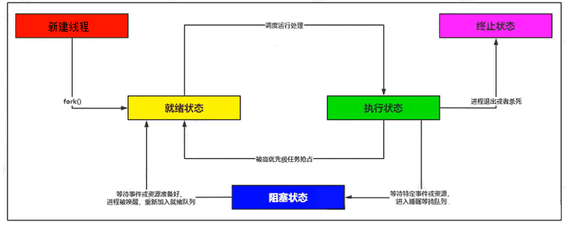
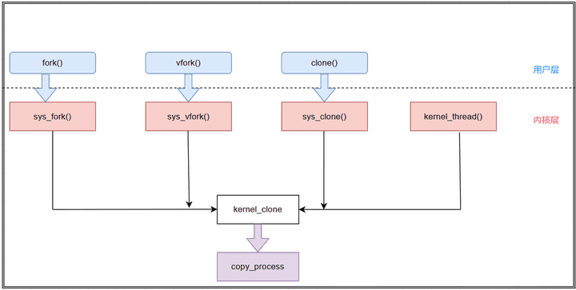

# 深入了解进程

## 进程的概念

### 概述

Linux内核中，进程（Process）是最基本的执行实体，它代表了正在执行的程序的实例。

-   进程是系统资源分配的基本单位。在Linux内核中，每个进程都有一个独特的进程描述符结构体——task_struct，它包含了进程的身份信息、状态、优先级、虚拟内存、打开的文件描述符、信号处理等众多属性。
-   进程拥有独立的地址空间，即虚拟内存空间，确保了进程间的隔离性和安全性。

### 基础概念

**轻量级进程：**

-   定义：LWP是一种内核支持的用户线程实现，每一个LWP都对应着内核中的一个实体，也就是说，每个LWP都有自己的内核级线程支持，从而能够独立地被内核调度。LWP结合了用户线程和内核线程的优点，既可以享受到多线程的优势，又能避免传统用户线程的全局阻塞问题。

**内核线程：**

-   定义：内核线程是直接在内核空间运行的线程，它没有独立的用户空间，主要执行内核任务，不与任何特定的用户进程关联。内核线程通常用于执行内核维护工作，如定时器中断处理、I/O调度、垃圾回收等后台服务。
-   特点：没有自己的地址空间，所有内核线程共享内核地址空间，可以直接访问硬件资源，但不能执行用户态的代码。

**用户进程和用户线程：**

-   用户进程：用户进程是运行在用户空间的应用程序实例，它拥有独立的地址空间、打开的文件描述符集合以及其他系统资源。一个用户进程可以包含一个或多个线程（无论是内核线程还是用户线程/LWP）。
-   用户线程：用户线程是在用户空间创建和管理的线程，存在于进程的地址空间内部。用户线程由进程自己或用户空间的线程库（如POSIX Pthreads）创建和调度，而非由操作系统内核直接管理。用户线程依赖于用户态的线程库实现上下文切换，速度相对较慢。早期的用户线程在没有内核支持的情况下，如果其中一个线程阻塞在系统调用上，会导致整个进程阻塞。

**轻量级进程和用户线程的关系：**

在Linux系统中，当你使用用户层的线程库（如POSIX Pthreads）创建用户线程时，大多数情况下（特别是使用Native POSIX Thread Library，NPTL时），操作系统会在内核层面对应地创建一个内核线程。NPTL实现了用户线程与内核线程的1:1映射关系，意味着每个用户线程都有一个与之紧密耦合的内核线程。

内核通过维护内核线程来确保线程的调度、上下文切换、系统调用响应等功能。这样一来，当用户线程执行系统调用或发生阻塞时，内核能够透明地调度另一个线程继续执行，避免了用户级线程模型可能导致的整个进程被阻塞的问题。此外，由于内核直接参与调度，还能保证线程在多处理器环境下的公平性和高效性。

>   注意：在Linux环境下，为了统一和简化表述，现代Linux内核并不区分内核进程和用户进程，一般所说的进程均包含了内核层面的支持，并且Linux内核支持的线程模型多数情况下是指LWP，即每个用户级线程背后都有一个对应的内核线程作为支撑。而在Linux内核视角看，所有的执行实体都被视为进程（task），无论是否执行用户代码还是内核代码，这被称为"一切皆进程"的哲学。因此，所谓的“用户线程”在Linux中表现为具有独立调度实体的LWP。而线程组的概念更多出现在高级编程接口或者性能测试工具中，而不是内核核心概念。

### 进程查看命令

**①、ps (Process Status)**：ps命令是Linux及类Unix系统中最基础的进程查看工具之一，它提供了当前系统中进程状态的一次性快照视图。通过不同的选项，可以获取到不同级别的进程信息。以下是一些常用选项及其作用：

-   -e 或 --every：显示系统中所有的进程。
-   -f 或 --full：提供完整的格式输出，包括进程树状关系和环境变量等额外信息。
-   -l 或 --long：长格式输出，包含更多详细信息，如F旗表示进程正在等待文件锁。
-   -u 或 --user：按照用户来显示进程，并显示每个进程的CPU和内存使用情况。
-   -aux 是一个常见的组合选项，用于显示系统中所有用户的全部进程，包括后台进程（不与终端关联的进程）。

例如，ps -ef 将显示出当前系统中所有进程的详细信息，包括PID（进程ID）、PPID（父进程ID）、TTY（终端类型）、CWD（当前工作目录）、CMD（启动命令）等字段。

**②、top**：相比之下，top命令则提供了一个动态实时的视图，它可以持续不断地刷新并显示当前系统中各进程的资源使用情况。启动top命令后，您将看到一个全屏界面，其中包括：

-   进程列表：按照默认排序（通常是CPU使用率或优先级）列出正在运行的进程及其相关信息，如PID、USER（执行进程的用户）、PR（优先级）、NI（nice值，影响优先级）、VIRT（虚拟内存大小）、RES（常驻内存大小）、%CPU和%MEM（CPU和内存使用百分比）等。
-   系统总体状态：包括系统运行时间、登录用户数、系统负载、CPU和内存的整体使用状况等统计数据。
-   交互式操作：在top运行过程中，用户可以通过键盘输入相应的命令（如按P键切换到按CPU使用率排序，按M键切换到按内存使用率排序，或使用k键杀死指定进程等）来进行进一步的进程管理和监控。

总结起来，ps命令更适合一次性快速查看特定进程或系统某一时刻的进程状态，而top命令则是实时监控和管理系统性能的理想工具，尤其是在需要跟踪和调整进程资源占用时更为实用。

### 总结

进程的几个要素：

1.  有一段程序待其执行
2.  有进程专用的系统堆栈空间
3.  在内核有task_struct结构体
4.  进程有独立的存储空间，拥有专用的用户空间

如果具备前面三条而缺少第4条就可以称为线程“”，如果完全没有用户空间，就称为**内核线程**，如果共享用户空间就称为**用户线程** 。

## Linux中，进程是如何创建的？

在Linux系统中，进程创建主要通过`fork()`系统调用实现，其核心机制涉及资源复制、写时拷贝（Copy-On-Write）技术以及父子进程的协同管理。

### 进程创建的起点

Linux系统的进程创建始于`init`进程（PID=1），它是所有用户进程的祖先。除`init`外，其他进程均由已有进程通过`fork()`调用创建。

-   **父进程**：调用`fork()`的原始进程。
-   **子进程**：新创建的进程，继承父进程的代码、数据和资源。

### `fork()`系统调用的核心步骤

当调用`fork()`时，内核执行以下操作：

1.  分配内核数据结构：
    -   为子进程分配新的`task_struct`（进程控制块）、内核栈和唯一的PID。
    -   复制父进程的页表、内存映射区域（`mm_struct`）和寄存器上下文。
2.  写时拷贝（Copy-On-Write）优化：
    -   父子进程初始共享物理内存页，并标记为只读。
    -   当任一进程尝试写入共享页时，触发页错误，内核为该进程分配独立副本。
3.  资源继承：子进程继承父进程的文件描述符表、信号处理函数、环境变量等。
4.  调度与返回：
    -   将子进程加入就绪队列，状态设为`TASK_RUNNING`。
    -   在父进程中返回子进程PID，子进程中返回0。

### 父子进程的执行与区分

**并发执行**：`fork()`后，父子进程从相同指令处开始并发执行，顺序由调度器决定。

返回值区分：

-   父进程通过子进程PID管理子进程（如调用`wait()`回收资源）。
-   子进程通过返回0确认自身身份，通常后续调用`exec()`加载新程序。

### 失败处理与限制

失败原因：

-   系统进程数达到上限（`/proc/sys/kernel/pid_max`）或用户进程数超限。
-   返回-1并设置`errno`为`EAGAIN`。

**解决方案**：调整系统参数或优化进程管理逻辑。

### 其他创建方式

-   **`vfork()`**：早期用于`fork()`后立即`exec()`的场景，现因写时拷贝优化逐渐废弃。
-   **`clone()`**：主要用于创建线程，允许更细粒度的资源共享控制。

### 总结：进程创建的关键特性

| 特性       | 说明                                 |
| ---------- | ------------------------------------ |
| 共享与隔离 | 初始共享内存，写时拷贝实现物理隔离。 |
| 资源继承   | 子进程继承文件描述符、信号处理等。   |
| 执行顺序   | 父子进程并发执行，顺序不确定。       |
| 优化机制   | 写时拷贝减少内存复制开销，提升性能。 |

通过上述机制，Linux实现了高效且安全的进程创建，支持多任务并发与资源隔离。开发者需注意正确处理子进程回收（如`wait()`调用），避免僵尸进程。

## 进程的生命周期

### 进程状态文字描述

 Linux操作系统属于多任务操作系统，系统中的每个进程能够分时复用CPU时间片，通过有效的进程调度策略实现多任务并行执行。而进程在被CPU调度运行，等待CPU资源分配以及等待外部事件时会属于不同的状态。进程状态如下：

-   创建状态：新进程刚刚被创建，尚未开始执行。
-   就绪状态：进程已准备好所有必需资源，等待CPU分配时间片执行。
-   执行状态：进程已获得CPU资源并在其中运行。
-   阻塞状态：进程因等待某个资源或事件而暂时停止运行，从CPU队列中移除。
-   终止状态：进程已完成执行或被终止，不再存在。

### 进程状态程序中的体现

```c
#define TASK_RUNNING		    0x00000000
#define TASK_INTERRUPTIBLE		0x00000001
#define TASK_UNINTERRUPTIBLE	0x00000002
#define __TASK_STOPPED		0x00000004
#define __TASK_TRACED		0x00000008
```

-   TASK_RUNNING：表示进程处于可运行状态。这意味着进程已经准备好在CPU上执行，并且调度器可以选择它来进行运行。当进程获取到CPU时间片时，它就会进入运行状态。
-   TASK_INTERRUPTIBLE：表示进程处于可中断睡眠状态。这种状态下，进程正在等待某个事件发生（例如I/O操作完成、锁可用等），并且如果收到信号或者等待的条件满足，它可以被唤醒并重新加入到可运行队列中。在可中断睡眠期间，进程可以响应信号并改变其状态。
-   TASK_UNINTERRUPTIBLE：表示进程处于不可中断睡眠状态。类似可中断睡眠，进程同样在等待某种资源或事件，但是在此状态下，进程不会响应任何信号，即使接收到信号也不会立即醒来，除非等待的资源变为可用或特定条件达成。
-   __TASK_STOPPED：标志意味着进程已停止执行，通常是因为收到了SIGSTOP或SIGTSTP这样的停止信号，或者是调试器暂停了进程。停止的进程不会消耗CPU资源，直到收到SIGCONT信号恢复执行。
-   __TASK_TRACED：表示进程正在被调试器或其他跟踪工具追踪，并进入了跟踪停止状态。在这种状态下，进程同样不会执行，等待调试器的进一步操作，比如单步执行、继续执行等。

这些状态标志会被组合在一个进程控制块（PCB，在Linux内核中表现为task_struct结构体的一个成员变量state）中，以表示进程的当前状态。调度器根据这些状态决定何时何地将进程投入运行或从运行状态移除。在实际的内核源码中，为了准确反映进程状态，这些宏可能会与其他标志位一起使用或组合起来形成更复杂的状态标识。

### 进程状态的切换

如下图，便是进程进行状态之间的切换，这些工作都是有调度器来完成的。



## 多进程fork后不同进程会共享哪些资源

### 共享的资源

1、**文件描述符（File Descriptors）**

-   子进程会继承父进程所有打开的文件描述符（如标准输入/输出/错误、套接字、管道等），且数值相同。
-   共享机制：父子进程的FD指向内核同一系统级文件表项，因此共享文件偏移量和文件状态标志（如O_NONBLOCK）。
-   注意：关闭操作独立（子进程关闭FD不影响父进程），但需注意引用计数问题。

2、**内存映射区（Memory-Mapped Regions）**

-   通过mmap()创建的共享内存映射（如MAP_SHARED标志）会被继承，父子进程可读写同一物理内存区域。
-   写时复制（COW）：若映射为MAP_PRIVATE，初始共享物理页，修改时触发COW生成独立副本。

3、**信号处理程序（Signal Handlers）**

-   子进程继承父进程注册的信号处理函数（如SIGINT的处理逻辑）。
-   但信号掩码（`sigprocmask`）和未决信号（pending signals）可能因实现而异。

4、**进程间通信（IPC）资源**

-   管道（Pipes）：继承打开的管道描述符，可继续用于通信。
-   共享内存段（Shared Memory）：通过shmget()创建的共享内存区域可被访问。
-   消息队列与信号量：需显式设置共享标志（如IPC_CREAT）才能继承。

5、**命名空间（Namespaces）**

-   默认共享相同的命名空间（如网络、PID、挂载点等），除非调用clone()时指定CLONE_NEW*标志创建独立命名空间。

### 独立的资源

1、**进程ID（PID）与父进程ID（PPID）**：子进程拥有独立的PID和PPID（父进程为调用者）。

2、**内存地址空间（虚拟内存）**

-   子进程通过**写时复制（COW）**机制初始共享物理内存页，但修改后生成独立副本，最终拥有完全分离的地址空间。
-   示例：父子进程的全局变量初始值相同，但修改后互不影响。

3、**栈与堆（Stack & Heap）**

-   栈空间独立，子进程复制父进程的栈内容但后续操作互不干扰。
-   堆空间（如malloc分配的内存）初始共享，修改时触发COW。

4、**寄存器状态与程序计数器**

-   子进程从fork()返回后开始执行，拥有独立的寄存器状态和程序计数器。

5、**信号量与互斥锁状态**

-   用户态锁（如pthread_mutex_t）需重新初始化，否则可能导致死锁。
-   内核态锁（如`futex`）状态可能继承，但需谨慎处理竞争条件。

6、**定时器与资源统计**

-   CPU时间、文件锁（flock）、定时器（setitimer）等资源独立统计。

### 写时复制（Copy-On-Write, COW）

-   原理：fork()后父子进程共享物理内存页，内核将其标记为只读。任一进程尝试写入时触发缺页异常，内核分配新页面并复制数据。
-   优势：避免不必要的内存复制，提升fork()效率并节省内存。
-   示例：父子进程修改同一变量会触发COW，导致变量地址相同但物理页不同。

### 注意事项与常见问题

1.  **资源竞争**：共享文件描述符可能导致偏移量冲突（如并发读写同一文件），需通过fcntl设置文件锁或使用原子操作。
2.  **僵尸进程**：父进程需通过wait()回收子进程资源，避免子进程退出后成为僵尸进程。
3.  **同步机制**：共享内存需配合信号量或互斥锁（如sem_open()或pthread_mutex）。
4.  **性能影响**：频繁fork()可能导致内存碎片，建议结合exec()替换进程映像。

### 总结

| 资源类型         | 是否共享 | 关键特性                         |
| ---------------- | -------- | -------------------------------- |
| 文件描述符       | ✅ 共享   | 共享偏移量，独立关闭操作         |
| 内存映射（共享） | ✅ 共享   | `MAP_SHARED`映射可跨进程读写     |
| 信号处理程序     | ✅ 共享   | 继承处理逻辑，但信号掩码可能独立 |
| 虚拟内存（COW）  | ❌ 独立   | 初始共享，写操作后分离           |
| 进程ID           | ❌ 独立   | 子进程拥有新PID                  |
| 用户态锁         | ❌ 独立   | 需显式初始化，否则行为未定义     |

通过合理利用共享资源和同步机制，可以高效实现多进程协作（如服务器并发处理），同时需注意资源隔离与竞争问题。

## task_struct数据结构简述

### 数据结构成员简述

进程是操作系统调度的一个实体，需要对进程所必须资源做一个抽象化，此抽象化为进程控制块 (PCB，Process Control BLock)，PCB在Linux内核里面采用task_struct结构体来描述进程控制块。Linux内核涉及进程和程序的所有算法都围绕名为task_struct的数据结构而建立操作。`task_struct`定义在`include\linux\sched.h`，具体Linux内核源码task_struct结构体核心成员如下（task_struct结构体过于庞大，暂时了解几个重要成员）：

-   __state：表示当前进程状态，例如可运行、睡眠、僵死等。
-   stack：指向进程的内核栈。
-   usage：引用计数，用于跟踪进程使用情况。
-   prio、static_prio和normal_prio：描述进程的调度优先级和策略。
-   se、rt和dl：分别对应CFS（完全公平调度器）、实时调度和Deadline调度的调度实体。
-   mm：指向进程的内存描述符结构（mm_struct），管理进程的虚拟内存。
-   active_mm：在没有独立内存空间时，指向当前活动的内存描述符。
-   exit_state、exit_code和exit_signal：进程退出时的状态、退出码和发送给父进程的信号。
-   pid和tgid：分别代表进程ID和线程组ID。
-   real_parent、parent、children和sibling：用于构建进程间的父子、兄弟关系，形成进程树。
-   files：指向进程打开的文件表，即files_struct结构体，记录所有已打开的文件描述符。
-   signal和sighand：管理和处理进程接收到的信号。
-   blocked、real_blocked和saved_sigmask：记录进程当前屏蔽的信号集合。
-   nsproxy：命名空间代理，用于管理和切换不同命名空间。
-   fs：指向文件系统信息结构，记录进程的当前工作目录、根目录等文件系统相关信息。
-   其他字段还包括了进程的调度统计信息、时间统计、内存页面错误统计、POSIX定时器、安全特性、审计信息等。

### 需要注意的成员

 内存块指针，特殊的是对于内核线程而言的mm是空指针，active_mm是内核线程在运行的时候向进程借用的地址空间：

```
struct mm_struct  *mm;
struct mm_struct  *active_mm;
```

### 进程优先级

### 优先级的代码表示

描述进程的调度优先级和策略，之后的任务调度以及时间片分配都要用到优先级：

```c
int prio;
int static_prio;
int normal_prio;
unsigned int rt_priority;
```

-   int prio：这个字段代表进程的动态优先级，它是根据进程的行为和系统负载动态调整的。在传统的Linux调度器（如CFS调度器）中，这个优先级通常被映射到调度实体（sched_entity）的一个虚拟运行时间（vruntime），而不是一个直观意义上的数字大小，较大的vruntime意味着较低的优先级。
-   int static_prio：静态优先级，也称为nice值，在Linux中范围是-20至19，数值越小表示优先级越高。静态优先级可以通过nice值或者用户权限改变，但不会像动态优先级那样频繁变化。
-   int normal_prio：此字段在某些Linux调度器实现中可能用来表示经过nice值调整后的正常优先级，它结合了静态优先级和可能的额外优先级调整因素。
-   unsigned int rt_priority：实时优先级，仅适用于实时调度策略（如SCHED_FIFO或SCHED_RR）。实时进程有固定的优先级分配，rt_priority值越大，表示进程的实时优先级越高，抢占其他进程的可能性也就越大。实时进程一般不受nice值的影响，其优先级高于普通进程。在实时调度策略下，rt_priority用于确定进程在实时进程队列中的相对位置。

### Linux内核下的进程分类

在Linux内核中，进程可以按照其调度需求和优先级的不同分为不同的类别，主要包括：

**普通进程（Normal Process）**：

又称为分时进程，这类进程在Linux系统中遵循默认的分时调度策略，如CFS（Completely Fair Scheduler）。它们按照各自权重（nice值）和虚拟运行时间（vruntime）来获取CPU时间片。nice值可以在[-20, 19]范围内调整，数值越小，优先级越高，但总体来说，普通进程之间是公平共享CPU资源的。

**实时进程（Real-time Process）**：

实时进程在满足特定条件的情况下需要得到及时响应，具有更高的优先级。Linux内核提供两种实时调度策略：SCHED_FIFO（先进先出）和SCHED_RR（轮转调度）。

-   SCHED_FIFO：实时进程中，优先级高的进程总是优先执行，一旦开始运行，除非进程主动放弃CPU（如阻塞等待I/O或睡眠），否则不会被优先级相同或更低的其他进程抢占。
-   SCHED_RR：同样是实时进程，但它在用完时间片后会重新加入队列等待下一次调度，这样可以保证在相同优先级的实时进程中实现时间片轮转。

**限期进程（Deadline Process）**：

在一些文献和系统中，也可能提到限期进程这一概念，它指的是那些具有严格截止时间要求的任务，必须在规定时间内完成。在Linux内核的标准调度器中并没有直接的限期调度策略，但在实时扩展（如PREEMPT_RT补丁集）的支持下，可以通过特殊的实时调度策略或者其他方法模拟实现这种功能。实际应用中，这种类型的进程通常归入实时进程范畴，通过设定合适的实时优先级并配合调度算法确保其能够在截止时间前完成计算。

###  优先级的在不同类型进程的分配

-   限期进程的优先级是-1;
-   实时进程的优先级1-99，优先级数值最大，表示优先级越高；
-   普通进程的静态优先级为: 100-139，优先级数值越小，表示优先级越高，可通过修改nice值改变普通进程的优先级，优先级等于120加 上nice值；

>   限期进程的优先级比实时进程要高，实时进程的优先级比普通进程要高

下表就是描述了不同进程对应的优先级成员的变化：

| 优先级                                           | 限期进程                                                     | 实时进程                                            | 昔通进程                             |
| ------------------------------------------------ | ------------------------------------------------------------ | --------------------------------------------------- | ------------------------------------ |
| prio调度优先级<br/>（数值越小，优先级越高）      | 大多数情况下prio等于normal_prio。特殊情况。如果进程X占有实时互斥锁，进程Y正在等待锁，进程Y的优先级比进程进程x优先级高，那么把进程X的优先级临时提高到进程Y的的优先级，即进程X的prio的值等于进程Y的prio值。 | 同【限期进程】                                      | 同【限期进程】                       |
| static_prio静态优先级                            | 没有意义，总是0                                              | 没有意义，总是0                                     | 120+nice值，数值越小，表示优先级越高 |
| normal_prio正常优先级<br/>（数值越小优先级越高） | -1                                                           | 99-rt_priority                                      | static_prio                          |
| rt_priority实时优先级                            | 没有意义，总是0                                              | 实时进程的优先级，范围1-99。<br/>数值越大优先级越高 | 没有意义，总是0                      |

## 进程系统调用

进程的系统调用定义在`kernel/fork.c`文件里面

### 系统调用简述和框图

当运行应用程序的时候，调用`fork()/vfork()/clone()`函数就是系统调用。系统调用就是应用程序如何进入内核空间执行任务，程序使用系统调用执行一系列的操作：比如创建进程、文件IO等等。

系统调用框图（使用Linux版本为6.1的内核，不同的内核其系统调用有点差异） 如下所示：



### 系统调用的代码体现

**①、fork系统调用代码**

```c
#ifdef __ARCH_WANT_SYS_FORK
SYSCALL_DEFINE0(fork)
{
#ifdef CONFIG_MMU
    struct kernel_clone_args args = { .exit_signal = SIGCHLD, };
    return kernel_clone(&args);
#else
    /* can not support in nommu mode */
    return -EINVAL;
#endif
}
```

**②、vfork系统调用代码**

```c
#ifdef __ARCH_WANT_SYS_VFORK
SYSCALL_DEFINE0(vfork)
{
    struct kernel_clone_args args = { .flags = CLONE_VFORK | CLONE_VM, .exit_signal	= SIGCHLD, };
    return kernel_clone(&args);
}
#endif
```

**③、clone系统调用代码**

```c
#ifdef __ARCH_WANT_SYS_CLONE
#ifdef CONFIG_CLONE_BACKWARDS
SYSCALL_DEFINE5(clone, unsigned long, clone_flags, unsigned long, newsp,  int __user *, parent_tidptr,  unsigned long, tls,  int __user *, child_tidptr)
#elif defined(CONFIG_CLONE_BACKWARDS2)
SYSCALL_DEFINE5(clone, unsigned long, newsp, unsigned long, clone_flags,  int __user *, parent_tidptr,  int __user *, child_tidptr,  unsigned long, tls)
#elif defined(CONFIG_CLONE_BACKWARDS3)
SYSCALL_DEFINE6(clone, unsigned long, clone_flags, unsigned long, newsp, int, stack_size, int __user *, parent_tidptr, int __user *, child_tidptr, unsigned long, tls)
#else
SYSCALL_DEFINE5(clone, unsigned long, clone_flags, unsigned long, newsp,  int __user *, parent_tidptr,  int __user *, child_tidptr,  unsigned long, tls)
#endif
{
struct kernel_clone_args args = { .flags = (lower_32_bits(clone_flags) & ~CSIGNAL), .pidfd = parent_tidptr, .child_tid = child_tidptr, .parent_tid = parent_tidptr, .exit_signal = (lower_32_bits(clone_flags) & CSIGNAL), .stack = newsp, .tls = tls, };
return kernel_clone(&args);
}
#endif
```

### 进程退出

1、进程主动终止：从main()函数返回，链接程序会自动添加到exit()系统调用；

exit系统调用在内核定义如下`kernel\exit.c`：

```c
SYSCALL_DEFINE1(exit, int, error_code){
    do_exit((error_code & 0xff)<<8);
}
```

2、进程被动终止：进程收到一个自己不能处理的信号；进程收到 SIGKILL等终止信息。

### 内核线程

定义：它是独立运行在内核空间的进程，与普通用户进程区别在于内核线程没有独立的进程地址空间。task_struct数据结构里面有一个成员指针mm设置为NULL，它只能运行在内核空间。

内核创建一个内核线程代码体现如下：

```c
/* * Create a kernel thread. */
pid_t kernel_thread(int (*fn)(void *), void *arg, unsigned long flags) {
    struct kernel_clone_args args = {
            .flags = ((lower_32_bits(flags) | CLONE_VM | CLONE_UNTRACED) & ~CSIGNAL),
            .exit_signal    = (lower_32_bits(flags) & CSIGNAL),
            .fn        = fn,
            .fn_arg        = arg,
            .kthread    = 1,
    };
    return kernel_clone(&args);
}
```

## Linux中，父子进程的优先级以及调度？

在Linux系统中，父子进程的优先级和调度机制涉及进程创建时的继承关系、调度策略的动态调整以及内核的优化策略。

### 父子进程的优先级继承与调整

**优先级继承**

-   子进程默认继承父进程的静态优先级（由`nice`值决定），范围通常为-20（最高）到19（最低）。
-   动态优先级由内核根据进程行为（如I/O等待时间、CPU使用率）动态调整，父子进程可独立变化。

**优先级修改方式**

-   命令行工具：
    -   启动时设置：`nice -n 15 command`（子进程优先级为父进程`nice`值+15）。
    -   运行时调整：`renice 5 -p 1234`（需root权限降低优先级）。
-   **编程接口**：通过`nice()`系统调用或实时任务的`pthread_setschedparam()`。

**实际优先级计算**

-   进程的最终优先级（PRI）由默认值80加上`nice`值（NI）决定，即`PRI = 80 + NI`，范围限制在60~99。
-   **示例**：若父进程`nice=-10`，子进程继承后`PRI=70`（优先级较高）。

### 父子进程的调度策略

父子进程调度顺序：默认父进程优先调度（因父进程的TLB缓存活跃）。

**注意**：POSIX未规定父子进程的执行顺序，需依赖同步机制（如信号量）强制顺序。

## 进程结束后是如何回收的？

进程结束后，操作系统会通过一系列机制回收其占用的资源，包括内存、文件描述符、内核数据结构等。

### 进程终止的触发方式

进程可能通过以下方式终止：

-   **正常退出**：调用`exit()`或从`main()`返回，传递退出状态码。
-   **异常终止**：因未捕获的信号（如 `SIGSEGV`）、断言失败或非法操作（如除以零）终止。
-   **强制终止**：其他进程通过 `kill()` 发送信号（如 `SIGKILL`）终止目标进程。

### 资源回收的核心步骤

无论终止方式如何，操作系统均会执行以下回收流程：

1.  标记进程状态：进程首先被标记为“僵尸状态”（`EXIT_ZOMBIE`），保留其退出状态码和资源使用记录。

2.  释放用户空间资源：

    -   立即回收用户态内存（堆、栈、代码段等），即使进程未显式释放动态分配的内存。
    -   关闭所有打开的文件描述符和网络连接。

3.  通知父进程：内核向父进程发送 `SIGCHLD` 信号，通知子进程终止。

4.  回收内核资源：

    -   释放进程控制块（PCB）、页表、信号量等内核对象。

-   **注意**：若父进程未调用 `wait()`，PCB 资源会残留，形成僵尸进程。

### 父进程的回收责任

-   `wait()` 与 `waitpid()`：
-   父进程需调用这些函数获取子进程退出状态，并彻底释放其内核资源（如PCB）。
    -   **阻塞与非阻塞**：`wait()` 会阻塞父进程，而 `waitpid()` 可通过参数设置为非阻塞。

-   孤儿进程的处理：

    -   若父进程先于子进程终止，子进程成为孤儿进程，由 `init` 进程（PID=1）自动收养并回收。

### 僵尸进程与解决方案

僵尸进程的产生：子进程终止后，父进程未调用 `wait()`，导致其PCB残留（状态为 `Z`）。

危害：占用有限的进程表项，可能导致新进程无法创建。

解决方案：

1.  **主动调用 `wait()`**：父进程显式回收子进程。
2.  **终止父进程**：僵尸进程会被 `init` 接管并回收。
3.  **信号处理**：父进程捕获 `SIGCHLD` 信号并自动调用 `wait()`。
4.  **双重 `fork()`**：子进程创建孙进程后立即退出，孙进程由 `init` 回收（常用于守护进程）。
