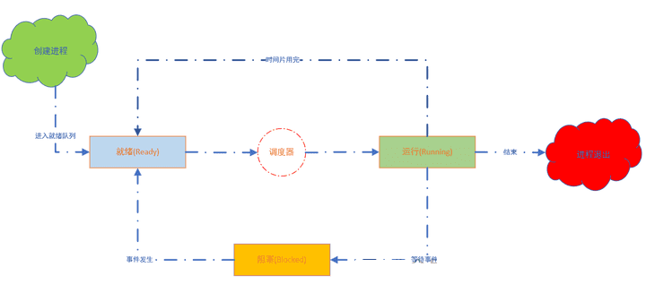
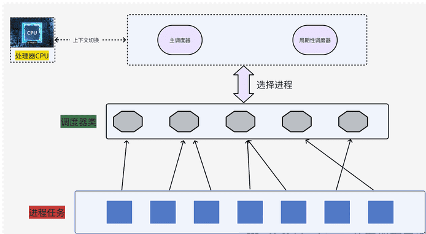
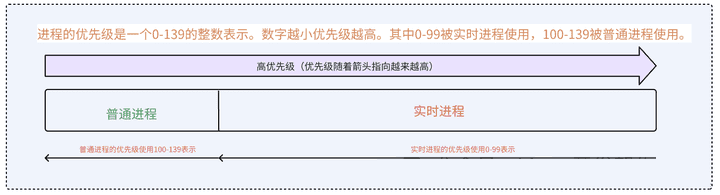

# 进程调度器

Linux内核的进程调度器不仅负责决定哪个进程将在CPU上运行，何时运行，还涉及到优先级管理、实时性保证、多处理器调度策略等诸多复杂问题。其设计理念和技术实现，直接影响到操作系统的响应速度、吞吐量以及整体稳定性，尤其对于现代多核、多线程环境下的计算需求来说，更是显得至关重要。

## 概念

在Linux内核中，调度器（Scheduler）是操作系统内核的关键组件之一，负责管理和协调CPU资源在多个进程间高效、公正地分配。调度器的主要目标是确保CPU时间片能在系统中的各个进程间合理分配，从而最大化系统资源利用率，同时也要考虑进程的响应时间和整体系统性能。

## 结构框图

Linux内核中用来安排调度进程 (一段程序的执行过程) 执行的模块称为调度器(Scheduler)，它可以切换进程状态 (Process status) 。比如：执行、可中断睡眠、不可中断睡眠、退出、暂停等。



调度器是 CPU 中央处理器的管理员，主要负责完成做两件事情：

-   选择某些就绪进程来执行。

-   是打断某些执行的进程让它们变为就绪状态。

调度器分配CPU时间的基本依据：进程的优先级。

上下文切换（context switch ）：将进程在 CPU 中切换执行的过程，内核承担此任务，负责重建和存储被切换掉之前的CPU 状态。

## Linux下的调度类介绍

调度类是内核调度框架中更为抽象的概念，它是一种组织和管理调度策略的结构化方式。在Linux内核中，每个调度类都对应一个具体的调度策略，或者一套相关的调度策略，并提供了一系列与调度相关的函数接口，如进程入队、出队、选择下一个运行进程等操作。

### sched_class数据结构介绍

sched_class结构体是在代码中体现调度类，描述了调度器的基本操作接口，内核根据不同调度策略（如CFS、实时调度等）实现了对应的调度类，这些调度类则通过实现下面的接口来参与到内核的整体调度流程中。

数据结构定义在`kernel/sched/sched.h`，比较重要的几个成员接口：

-   enqueue_task: 向就绪队列添加一个进程，某个任务进入可运行状态时，该函数将会调用，它将调度实体放入到红黑树当中。
-   dequeue_task: 将一个进程从就绪队列中进行删除，当某个任务退出可运行状态时调用该函数，将从红黑树中去掉对应调度实体。
-   yield_task:在进程想要资源放弃对处理器的控制权时，可使用在sched_yiled系统调用，会调用内核API去处理操作。
-   check_preempt_curr: 检查当前运行的任务是否被抢占。
-   pick_next_task: 选择下来要运行的最合适的实体 (进程)。
-   put_prev_task: 用于另一个进程代替当前运行的进程。
-   set_curr_task: 当任务修改它调用类或修改它的任务组时，将调用这个函数。
-   task_tick: 在每次激活周期调度器时，由周期性调度器调用。

### Linux下的五大调度类

Linux内核中实例化了五个调度类，代码如下：

```c
extern const struct sched_class stop_sched_class;
extern const struct sched_class dl_sched_class;
extern const struct sched_class rt_sched_class;
extern const struct sched_class fair_sched_class;
extern const struct sched_class idle_sched_class;
```

-   stop_sched_class停机调度类：优先级是最高的调度类，停机进程是优先级最高的进程，可以抢占所有其它进程，其他进程不可能抢占停机进程。
-   dl_sched_class指Deadline调度类，它指的是具有固定截止期限（deadline）的调度策略，这类策略适用于对完成时间有严格限制的任务
-   rt_sched_class表示实时调度类（Real-Time Scheduling Class），这是用于实时进程调度的策略，包括SCHED_FIFO（先进先出）和SCHED_RR（循环轮转）两种调度策略。实时进程在调度时可以获得更高的优先级，并能抢占其他非实时进程以保证及时响应。
-   fair_sched_class 即完全公平调度类（Completely Fair Scheduler, CFS），它是Linux内核自2.6.23以来用于普通进程的标准调度策略。CFS设计的目标是在所有可运行进程之间公平地分配CPU时间，基于进程的动态优先级（由nice值和CPU使用时间等因素决定）进行调度。
-   idle_sched_class 是空闲调度类，它负责调度idle进程。当系统的所有其他进程都不需要CPU时，idle进程会被调度执行，通常它的作用是降低CPU利用率，避免无谓的忙碌等待，并在必要时触发电源管理相关的操作。

### 调度器结构分析



当处理器空闲时，它会向主调度器请求分配新任务，主调度器依据任务列表及其优先级等信息作出决策，通过上下文切换将CPU使用权转交给合适的任务。此外，周期性调度器定期唤醒主调度器以重新评估系统负载，并据此可能调整任务执行计划，如在高负载时减少低优先级任务执行，确保关键服务获得足够资源。

## 调度优先级

task_struct结构体中采用三个成员表示进程的优先级：prio 和 normal_prio 表示动态优先级，static_prio 表示进程的静态优先级。

内核将任务优先级划分，实时优先级范围是0 到 MAX_RT_PRIO-1 （即 99 ），而普通进程的静态优先级范围是从`MAX_RT_PRIO`到`MAX_PRIO-1`（即 100到139）。代码定义在 Linux 内核源码：`/include/linux/sched/prio.h` 。



实时进程与普通进程有着明确的优先级区间：实时进程的优先级范围是0至99，这类进程往往对应于对响应时间和执行效率要求极高的应用，比如音频视频流媒体播放、工业控制等领域。数字越小的实时进程享有更高的优先级，因此在争夺CPU资源时能优先得到执行。

另一方面，普通进程的优先级设定在100至139之间，这类进程主要包括日常的非实时应用，如Web服务器、数据库管理系统等。同样遵循数值越小优先级越高的原则，即使在普通进程中，较小优先级的进程也会相对优先被执行。

## 调度策略

Linux内核提供了一些调度策略用来选择调度器

linux 内核调度策略源码：`/include/uapi/linux/sched.h` 。代码定义如下：

```c
/* * Scheduling policies */
#define SCHED_NORMAL        0
#define SCHED_FIFO        1
#define SCHED_RR        2
#define SCHED_BATCH        3
/* SCHED_ISO: reserved but not implemented yet */
#define SCHED_IDLE        5
#define SCHED_DEADLINE        6
```

-   SCHED_NORMAL：定义了正常进程调度策略，即非实时调度策略。在Linux内核中，使用完全公平调度器（Completely Fair Scheduler, CFS）来实现，它旨在为所有进程提供公平的CPU时间分配，依据进程的nice值（优先级）和虚拟运行时间来平衡各进程的执行机会。

-   SCHED_FIFO：代表先进先出（First In, First Out）的实时调度策略。在该策略下，实时进程按到达就绪队列的顺序执行，具有该调度策略的进程一旦获得CPU就不会被更低优先级的进程抢占，除非自身主动释放CPU，或者有更高优先级的SCHED_FIFO或SCHED_RR实时进程变得可运行。

-   SCHED_RR：轮转（Round Robin）实时调度策略，类似于SCHED_FIFO，但是实时进程在一个时间片（quantum）结束之后会被放置到同优先级实时进程队列的末尾，等待再次轮到自己执行，这样保证同一优先级的实时进程可以轮流获得执行机会。

-   SCHED_BATCH：批处理调度策略，适用于CPU密集型且对响应时间要求不高的批处理作业。使用此策略的进程会尽量减少上下文切换，从而提高CPU缓存的局部性并减少开销，有利于提高整体系统吞吐量。

-   SCHED_IDLE：空闲调度策略，应用于低优先级后台任务。这类任务只有在系统完全空闲时才会得到执行，不会影响其他任何进程的调度。

-   SCHED_DEADLINE：截止期限（Deadline）调度策略，专为那些有严格截止时间约束的进程设计。此类进程需要在预设的截止时间内完成计算任务，调度器会确保进程在规定时间内获得足够的CPU资源来满足其执行需求。

>   SCHED_NORMAL、SCHED_BATCH、SCHED_IDLE直接被映射到fair_sched_class；SCHED_RR、SCHED_FIFO与rt_schedule_class进行相关联
