# 进程间通信

每个进程的用户地址空间都是独立的，一般而言是不能互相访问的，但内核空间是每个进程都共享的，所以进程之间要通信必须通过内核。

## 进程之间通信的途径有哪些？

Linux 所有的进程间通信方式：

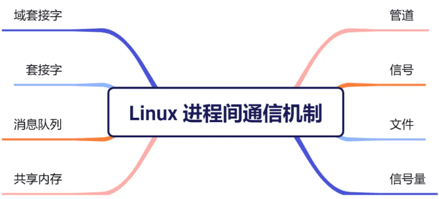

1.  无名管道(pipe)：管道是一种半双工的通信方式，数据只能单向流动，而且只能在具有亲缘关系的进程间使用。进程的亲缘关系通常是指父子进程关系。
2.  高级管道(popen)：将另一个程序当做一个新的进程在当前程序进程中启动，则它算是当前程序的子进程，这种方式我们成为高级管道方式。
3.  有名管道 (named pipe) ：有名管道也是半双工的通信方式，但是它允许无亲缘关系进程间的通信。
4.  消息队列( message queue ) ：消息队列是由消息的链表，存放在内核中并由消息队列标识符标识。消息队列克服了信号传递信息少、管道只能承载无格式字节流以及缓冲区大小受限等缺点。
5.  信号量( semophore ) ：信号量是一个计数器，可以用来控制多个进程对共享资源的访问。它常作为一种锁机制，防止某进程正在访问共享资源时，其他进程也访问该资源。因此，主要作为进程间以及同一进程内不同线程之间的同步手段。
6.  信号 (sinal) ：信号是一种比较复杂的通信方式，用于通知接收进程某个事件已经发生。
7.  共享内存(shared memory) ：共享内存就是映射一段能被其他进程所访问的内存，这段共享内存由一个进程创建，但多个进程都可以访问。
8.  套接字(socket) ：socket 也是一种进程间通信机制，与其他通信机制不同的是，它可用于不同机器间的进程通信。

## 管道（Pipe）

管道是 Linux 中用于进程间通信的一种机制，就是内核里的环形缓存。管道只能一端写入，另一端读出。通信数据都遵循先进先出原则。管道分为两种类型：**匿名管道**和**有名管道**。

>   管道这种通信方式效率低，不适合进程间频繁地交换数据。

### 管道的示例

如果你学过 Linux 命令，那你肯定很熟悉「`|`」这个竖线。

```bash
$ ps auxf | grep mysql
```

上面命令行里的「`|`」竖线就是一个**管道**，它的功能是将前一个命令（`ps auxf`）的输出，作为后一个命令（`grep mysql`）的输入，从这功能描述，可以看出**管道传输数据是单向的**，如果想相互通信，我们需要创建两个管道才行。

同时，我们得知上面这种管道是没有名字，所以「`|`」表示的管道称为**匿名管道**，用完了就销毁。

在使用命名管道前，先需要通过 `mkfifo` 命令来创建，并且指定管道名字：

```bash
$ mkfifo myPipe
```

myPipe 就是这个管道的名称，基于 Linux 一切皆文件的理念，所以管道也是以文件的方式存在，我们可以用 ls 看一下，这个文件的类型是 p，也就是 pipe（管道）的意思：

```bash
$ ls -l
prw-r--r--. 1 root    root         0 Jul 17 02:45 myPipe
```

接下来，我们往 myPipe 这个管道写入数据：

```bash
$ echo "hello" > myPipe  // 将数据写进管道
// 停住了 ...
```

你操作了后，你会发现命令执行后就停在这了，这是因为管道里的内容没有被读取，只有当管道里的数据被读完后，命令才可以正常退出。

于是，我们执行另外一个命令来读取这个管道里的数据：

```bash
$ cat < myPipe  // 读取管道里的数据
hello
```

可以看到，管道里的内容被读取出来了，并打印在了终端上，另外一方面，echo 那个命令也正常退出了。

我们可以看出，**管道这种通信方式效率低，不适合进程间频繁地交换数据**。当然，它的好处，自然就是简单，同时也我们很容易得知管道里的数据已经被另一个进程读取了。

### 匿名管道

**概念**：匿名管道是一种在有亲缘关系的进程间（如父子进程）进行单向数据传输的通信机制，存在于内存中，通常用于临时通信。如果需要双向通信，则一般需要两个管道。

使用场景：适用于有亲缘关系的进程间的简单数据传输，例如父子进程。

匿名管道的创建，需要通过下面这个系统调用：

```c
int pipe(int fd[2])
```

这里表示创建一个匿名管道，并返回了两个描述符，一个是管道的读取端描述符 `fd[0]`，另一个是管道的写入端描述符 `fd[1]`。注意，这个匿名管道是特殊的文件，只存在于内存，不存于文件系统中。

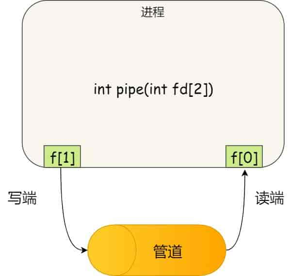

其实，**所谓的管道，就是内核里面的一串缓存**。从管道的一端写入的数据，实际上是缓存在内核中的，另一端读取，也就是从内核中读取这段数据。另外，管道传输的数据是无格式的流且大小受限。

看到这，你可能会有疑问了，这两个描述符都是在一个进程里面，并没有起到进程间通信的作用，怎么样才能使得管道是跨过两个进程的呢？

我们可以使用 `fork` 创建子进程，**创建的子进程会复制父进程的文件描述符**，这样就做到了两个进程各有两个「 `fd[0]` 与 `fd[1]`」，两个进程就可以通过各自的 fd 写入和读取同一个管道文件实现跨进程通信了。

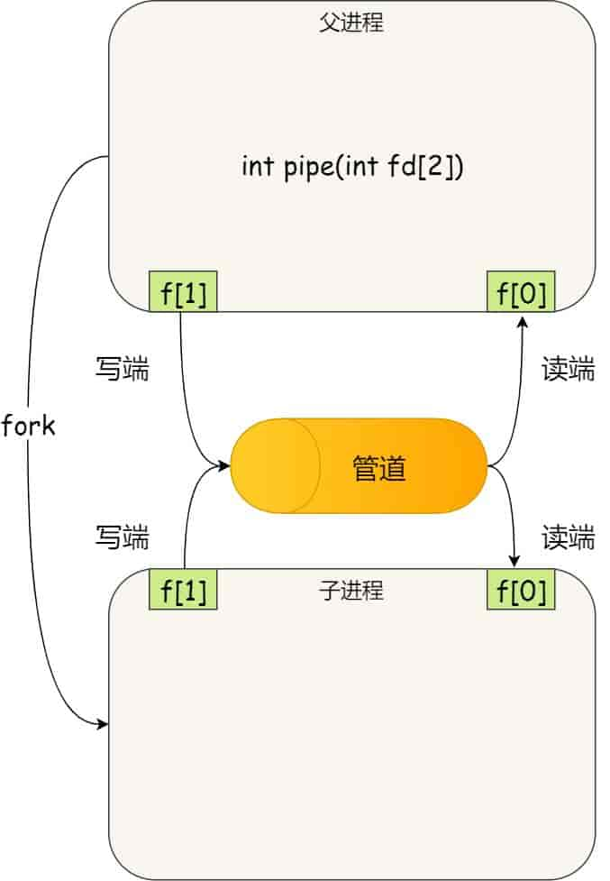

管道只能一端写入，另一端读出，所以上面这种模式容易造成混乱，因为父进程和子进程都可以同时写入，也都可以读出。那么，为了避免这种情况，通常的做法是：

- 父进程关闭读取的 fd[0]，只保留写入的 fd[1]；
- 子进程关闭写入的 fd[1]，只保留读取的 fd[0]；

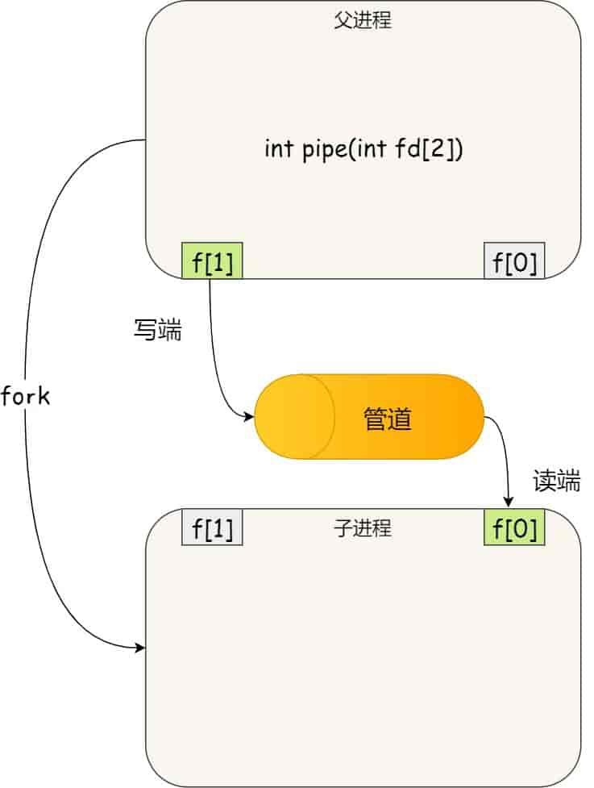

所以说如果需要双向通信，则应该创建两个管道。

到这里，我们仅仅解析了使用管道进行父进程与子进程之间的通信，但是在我们 shell 里面并不是这样的。

在 shell 里面执行 `A | B`命令的时候，A 进程和 B 进程都是 shell 创建出来的子进程，A 和 B 之间不存在父子关系，它俩的父进程都是 shell。

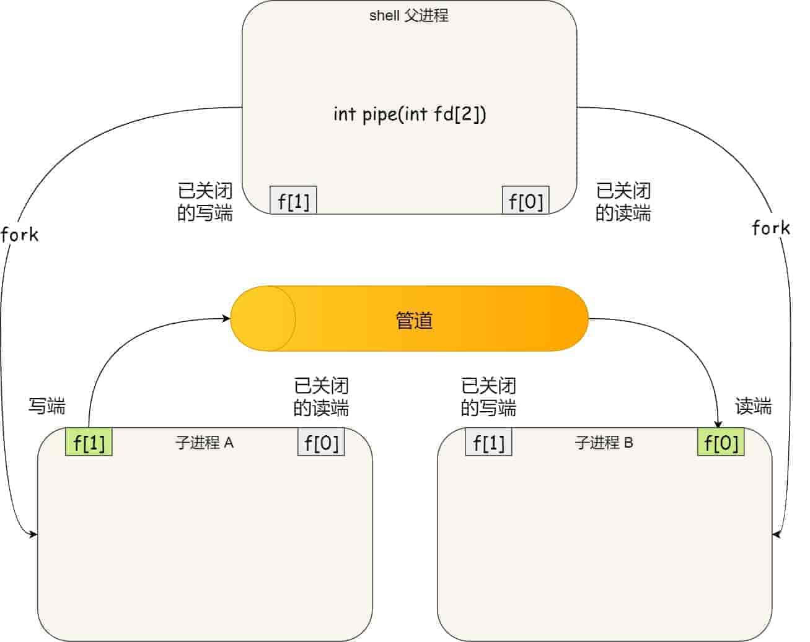

所以说，在 shell 里通过「`|`」匿名管道将多个命令连接在一起，实际上也就是创建了多个子进程，那么在我们编写 shell 脚本时，能使用一个管道搞定的事情，就不要多用一个管道，这样可以减少创建子进程的系统开销。

我们可以得知，**对于匿名管道，它的通信范围是存在父子关系的进程**。因为管道没有实体，也就是没有管道文件，只能通过 fork 来复制父进程 fd 文件描述符，来达到通信的目的。

简单示例：

```c
#include  <unistd.h>

int main() {
    int pipefd[2];
    pipe(pipefd);  //  创建匿名管道
    if (fork() == 0) {  //  子进程
        close(pipefd[1]);  //  关闭写端
        //读取数据
        read(pipefd[0], buf, 5);
        //  ...
    } else {  //  父进程
        close(pipefd[0]);  //  关闭读端
        //  写入数据
        write(pipefd[1], "hello", 5);
        //  ...
    }
}
```

### 有名管道

**概念：** **有名管道（FIFO，First-In-First-Out）** 是一种特殊类型的文件，用于在不相关的进程之间实现通信。与匿名管道不同，有名管道在文件系统中具有一个实际的路径名。这允许任何具有适当权限的进程打开和使用它，而不仅限于有亲缘关系的进程。

简单图解：

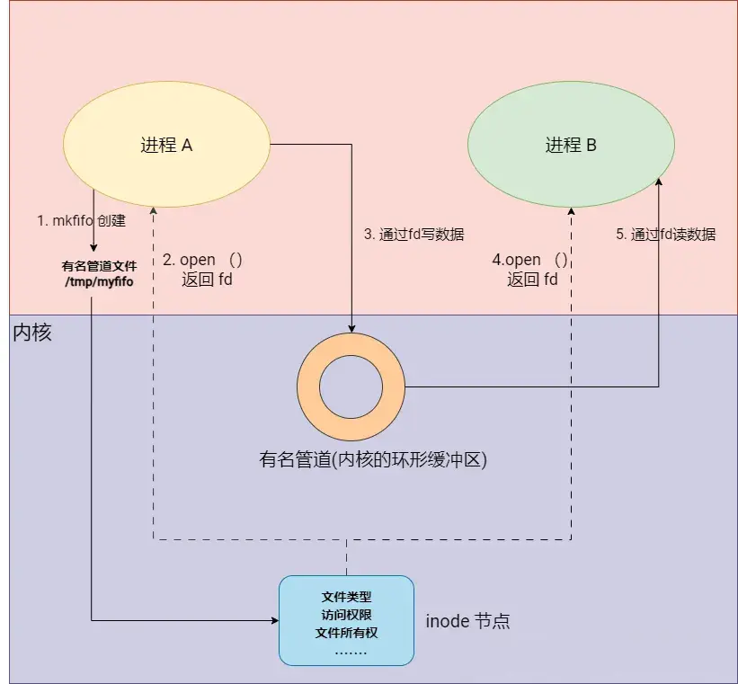

简单说明：有名管道是 Linux 中一种特殊的文件，它允许不同的进程通过读写这个文件来相互通信。

使用场景：用于本机任何两个进程间的通信，特别是当这些进程没有血缘关系时。

**对于命名管道，它可以在不相关的进程间也能相互通信**。因为命名管道提前创建了一个类型为管道的设备文件，在进程里只要使用这个设备文件，就可以相互通信。

不管是匿名管道还是命名管道，进程写入的数据都是缓存在内核中，另一个进程读取数据时候自然也是从内核中获取，同时通信数据都遵循**先进先出**原则，不支持 lseek 之类的文件定位操作。

简单示例：

```c
//  server.c
int main() {
    const char *fifoPath = "/tmp/my_fifo";
    mkfifo(fifoPath, 0666);  //  创建有名管道
    char buf[1024];
    int fd;
    //  永久循环，持续监听有名管道
    while (1) {
        fd = open(fifoPath, O_RDONLY);  //  打开管道进行读取
        read(fd, buf, sizeof(buf));

        //  打印接收到的消息
        printf("Received:  %s\n", buf);
        close(fd);
    }
    return 0;
}

//  client.c
int main() {
    const char *fifoPath = "/tmp/my_fifo";
    char buf[1024];
    int fd;
    printf("Enter  message:  ");        //  获取要发送的消息
    fgets(buf, sizeof(buf), stdin);
    fd = open(fifoPath, O_WRONLY);  //  打开管道进行写入
    write(fd, buf, strlen(buf) + 1);
    close(fd);
    return 0
}
```

## 信号 (Signals)

**概念**：在 Linux 中，信号允许操作系统或一个进程向另一个进程发送简单的消息。信号主要用于传递关于系统事件的通知，例如中断请求、程序异常、或其他重要事件。每个信号代表了一个特定类型的事件，并且进程可以根据收到的信号执行相应的动作。

**对于异常情况下的工作模式，就需要用「信号」的方式来通知进程。**信号是异步的，意味着它们可以在任何时间点被发送到进程，通常与进程的正常控制流无关。信号的使用为进程提供了一种处理外部事件和错误的方式。

可以使用命令 `kill -l` 来查看 Linux 系统支持的信号有哪些：

```sh
~$ kill -l
) SIGHUP       2) SIGINT       3) SIGQUIT      4) SIGILL       5) SIGTRAP
) SIGABRT      7) SIGBUS       8) SIGFPE       9) SIGKILL     10) SIGUSR1
) SIGSEGV     12) SIGUSR2     13) SIGPIPE     14) SIGALRM     15) SIGTERM
...
```

使用场景：

-   异常处理：当程序遇到运行时错误，比如除以零、非法内存访问等，操作系统会向该进程发送一个适当的信号，如SIGFPE（浮点异常）、SIGSEGV（段错误）。默认情况下：都会使程序终止。
-   外部中断：用户可以通过特定的键盘输入（最常见的是Ctrl+C）来中断正在终端上运行的进程。这会生成 SIGINT 信号，通常导致程序终止。
-   进程控制：如使用 kill 命令发送信号来终止或暂停某个进程。
-   定时器和超时：程序可以设置定时器，当定时器到期时，会收到 SIGALRM 信号。这常用于限制某些操作的执行时间，确保它们不会占用过多时间。
-   子进程状态变化：当一个子进程结束或停止时，它的父进程会收到 SIGCHLD 信号。这使得父进程可以监控其子进程的状态变化（从运行到正常退出）。

运行在 shell 终端的进程，我们可以通过键盘输入某些组合键的时候，给进程发送信号。例如

- Ctrl+C 产生 `SIGINT` 信号，表示终止该进程；
- Ctrl+Z 产生 `SIGTSTP` 信号，表示停止该进程，但还未结束；

如果进程在后台运行，可以通过 `kill` 命令的方式给进程发送信号，但前提需要知道运行中的进程 PID 号，例如：

- kill -9 1050，表示给 PID 为 1050 的进程发送 `SIGKILL` 信号，用来立即结束该进程；

所以，信号事件的来源主要有硬件来源（如键盘 Cltr+C）和软件来源（如 kill 命令）。

信号是进程间通信机制中**唯一的异步通信机制**，因为可以在任何时候发送信号给某一进程。一旦有信号产生，有下面这几种用户进程对信号的处理方式。

1.  **执行默认操作**。Linux 对每种信号都规定了默认操作。
2.  **捕捉信号**。我们可以为信号定义一个信号处理函数。当信号发生时，我们就执行相应的信号处理函数。
3.  **忽略信号**。当我们不希望处理某些信号的时候，就可以忽略该信号，不做任何处理。有两个信号是应用进程无法捕捉和忽略的，即 `SIGKILL` 和 `SIGSTOP`，它们用于在任何时候中断或结束某一进程。

简单示例：

```c
void signal_handler(int signal_num) {
    printf("Received signal: %d\n", signal_num);
}

int main() {
    signal(SIGINT, signal_handler);  // 注册信号处理函数
    // 无限循环，等待信号
    while (1) {
        sleep(1); // 暂停一秒
    }
    return 0;
}
```

在这个例子中，程序设置了一个信号处理函数来处理 SIGINT 信号（通常由 Ctrl+C 产生）。当收到该信号时，signal_handler 函数会被调用。

以下是对上述代码执行流程的简单图解说明，方便大家理解：

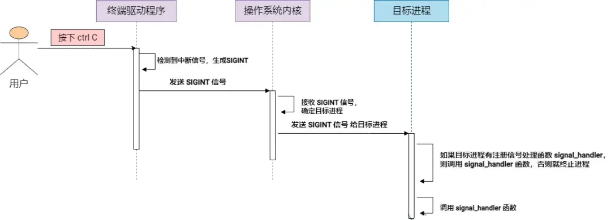

## 文件(Files)

概念：文件在 Linux 系统中是一种基本的持久化存储机制，可用于进程间通信。多个进程可以通过对同一个文件的读取和写入来共享信息。

简单图解：

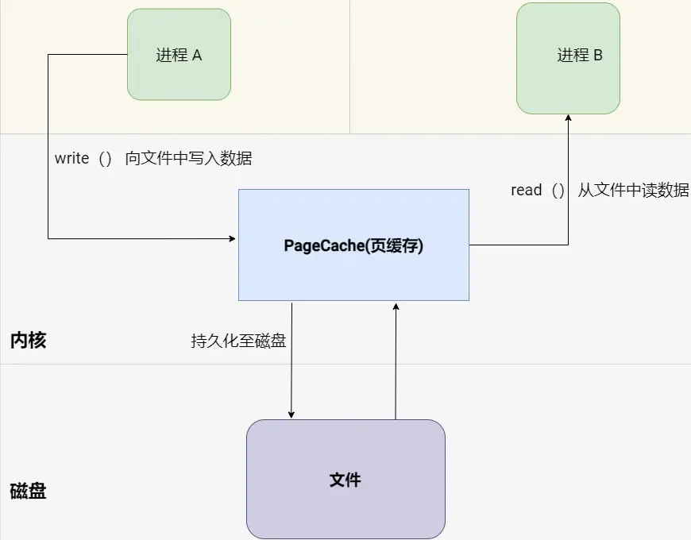

使用场景：

-   数据交换：进程之间可以通过读写同一文件来交换数据。例如，一个进程写入结果数据，另一个进程读取这些数据进行进一步处理。
-   持久化存储：文件用于保存需要在应用程序重启后依然保留的数据，例如用户数据、应用状态等。

简单示例：

```c
// 写进程: 向文件中写入数据
int main() {
    const char *file = "/tmp/ipc_file";
    int fd = open(file, O_RDWR | O_CREAT, 0666);
    write(fd, "Hello from Process A", 20);  // 向文件写入数据
    close(fd);     // 关闭文件
    return 0;
}

// 读进程: 从文件中读取数据
int main() {
    const char *file = "/tmp/ipc_file";
    int fd = open(file, O_RDWR | O_CREAT, 0666);
    char buf[50];
    read(fd, buf, 20);  // 从文件中读取数据
    close(fd);     // 关闭文件
    return 0;
}
```

>   注意：如果存在多个写进程同时操作同一个文件，那么会引发数据竞态和一致性问题。为了解决这个问题，可以使用文件锁或其他同步机制来协调对文件的访问，确保数据的完整性和一致性。

### Linux 文件锁

文件锁是 Linux 系统中用来控制多个进程同时访问同一个文件的一种机制。它的作用就像是门上的锁，确保在同一时间内只有一个进程能够写入文件，从而避免多个进程同时写入数据导致的混乱。

文件锁有什么用？

-   防止数据覆盖：当一个进程正在写文件时，文件锁可以防止其他进程同时写入，从而避免数据被覆盖。
-   保证写操作的完整性：通过锁定文件，确保每次只有一个进程能够执行写操作，这有助于保持写入数据的完整性。

在 Linux 中，可以使用`fcntl`或`flock`系统调用来实现文件锁。使用`fcntl`实现文件锁，从而保证多个进程在操作同一文件时不会相互干扰，维护数据的一致性和完整性。

以下是一个具体的示例：

```c
int main() {
    const char *file = "/tmp/ipc_file";
    int fd = open(file, O_RDWR | O_CREAT, 0666);
    // 设置文件锁
    struct flock fl;
    fl.l_type = F_WRLCK;  // 设置写锁
    fl.l_whence = SEEK_SET;
    fl.l_start = 0;
    fl.l_len = 0;  // 锁定整个文件
    if (fcntl(fd, F_SETLKW, &fl) == -1) {
        perror("Error locking file");
        return -1;
    }
    write(fd, "Hello from Process A", 20); // 执行写操作
    // 释放锁
    fl.l_type = F_UNLCK;
    fcntl(fd, F_SETLK, &fl);
    close(fd);
    return 0;
}
```

## 信号量(Semaphores)

概念：信号量是一种在进程间或同一进程的不同线程间提供同步的机制。它是一个计数器，用于控制对共享资源的访问。当计数器值大于0时，表示资源可用；当值为0时，表示资源被占用。进程在访问共享资源前必须减少（wait）信号量，访问后必须增加（post）信号量。

信号量有两种，一种是 POSIX 信号量，另一种是 System V 信号量。由于 POSIX 信号量提供了更简洁、更易于理解和使用的 API，并且在现代操作系统中得到了广泛支持和优化，所以这里重点讲解 POSIX 信号量。

简单图解：

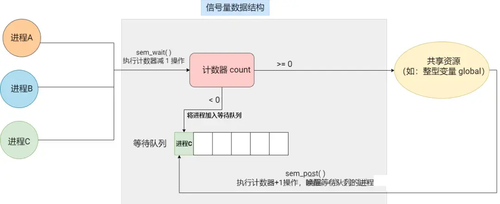

### 分类

匿名信号量和有名信号量 API 接口区别：

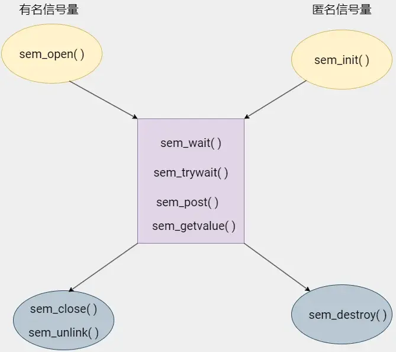

>   匿名信号量
>

概念：匿名信号量是内存中的信号量，不与任何文件系统的名称关联。它们通常用于单一进程内不同线程间的同步，或在具有共同祖先的进程之间进行同步。

特点：

-   作用域：限于创建它的进程内部或其子进程之间。
-   生命周期：与创建它们的进程的生命周期相同，进程终止时信号量也会消失。

使用场景：

-   互斥访问：在多线程程序中，确保同一时刻只有一个线程可以访问某个共享资源。
-   同步操作：协调多个线程的执行顺序，一个线程在另一个线程完成其任务之后再开始执行。如：线程池中的任务队列没任务时，线程必须等待，而当有有线程向队列添加任务时，需要唤醒其他线程来进行消费任务。

>   有名信号量
>

概念：有名信号量在文件系统中具有一个唯一的名称，允许不同的独立进程通过这个名称访问同一个信号量，实现进程间同步。

特点：

-   作用域：可以跨不同的进程使用。它们在文件系统中具有一个全局唯一的名称，任何知道这个名称的进程都可以访问同一个信号量。
-   生命周期：生命周期可以超过创建它们的进程。即使创建它们的进程已经结束，只要有名信号量的名称存在于文件系统中，它们就继续存在。

使用场景：

-   进程间互斥：多个独立进程共享资源，如文件或内存映射区域，需要互斥访问以避免冲突。
-   同步操作：协调多个进程的执行顺序，一个进程在另一个进程完成其任务之后再开始执行。如：在生产者消费者模型中，只要当生产者向队列添加数据，队列不为空的时候，消费者才能消费数据，否则只能等待。

### 进一步理解

>   信号量是一个整型变量，用于控制多个进程对共享资源的访问。它主要用于实现进程间的同步和互斥。信号量的值表示可用资源的数量，当一个进程需要访问共享资源时，它会先对信号量进行操作（如P操作，即等待操作，如果信号量的值大于 0，则将信号量的值减 1，表示占用一个资源；如果信号量的值为 0，则进程阻塞等待）。当进程使用完共享资源后，会进行V操作（即信号操作，将信号量的值加 1，表示释放一个资源）。

信号量表示资源的数量，控制信号量的方式有两种原子操作：

- 一个是 **P 操作**，这个操作会把信号量减去 1，相减后如果信号量 < 0，则表明资源已被占用，进程需阻塞等待；相减后如果信号量 >= 0，则表明还有资源可使用，进程可正常继续执行。
- 另一个是 **V 操作**，这个操作会把信号量加上 1，相加后如果信号量 <= 0，则表明当前有阻塞中的进程，于是会将该进程唤醒运行；相加后如果信号量 > 0，则表明当前没有阻塞中的进程；

P 操作是用在进入共享资源之前，V 操作是用在离开共享资源之后，这两个操作是必须成对出现的。

接下来，举个例子，如果要使得两个进程互斥访问共享内存，我们可以初始化信号量为 `1`。

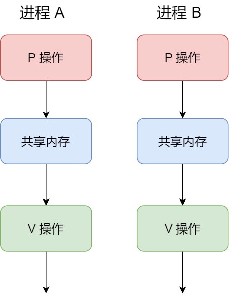

具体的过程如下：

- 进程 A 在访问共享内存前，先执行了 P 操作，由于信号量的初始值为 1，故在进程 A 执行 P 操作后信号量变为 0，表示共享资源可用，于是进程 A 就可以访问共享内存。
- 若此时，进程 B 也想访问共享内存，执行了 P 操作，结果信号量变为了 -1，这就意味着临界资源已被占用，因此进程 B 被阻塞。
- 直到进程 A 访问完共享内存，才会执行 V 操作，使得信号量恢复为 0，接着就会唤醒阻塞中的线程 B，使得进程 B 可以访问共享内存，最后完成共享内存的访问后，执行 V 操作，使信号量恢复到初始值 1。

可以发现，信号初始化为 `1`，就代表着是**互斥信号量**，它可以保证共享内存在任何时刻只有一个进程在访问，这就很好的保护了共享内存。

### 示例1

在多进程里，每个进程并不一定是顺序执行的，它们基本是以各自独立的、不可预知的速度向前推进，但有时候我们又希望多个进程能密切合作，以实现一个共同的任务。

例如，进程 A 是负责生产数据，而进程 B 是负责读取数据，这两个进程是相互合作、相互依赖的，进程 A 必须先生产了数据，进程 B 才能读取到数据，所以执行是有前后顺序的。

那么这时候，就可以用信号量来实现多进程同步的方式，我们可以初始化信号量为 `0`。

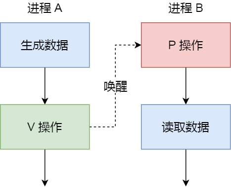

具体过程：

- 如果进程 B 比进程 A 先执行了，那么执行到 P 操作时，由于信号量初始值为 0，故信号量会变为 -1，表示进程 A 还没生产数据，于是进程 B 就阻塞等待；
- 接着，当进程 A 生产完数据后，执行了 V 操作，就会使得信号量变为 0，于是就会唤醒阻塞在 P 操作的进程 B；
- 最后，进程 B 被唤醒后，意味着进程 A 已经生产了数据，于是进程 B 就可以正常读取数据了。

可以发现，信号初始化为 `0`，就代表着是**同步信号量**，它可以保证进程 A 应在进程 B 之前执行。

### 示例2

来看一个进程互斥的例子：

下面是使用**有名信号量**来实现两个独立进程对同一个日志文件进行互斥访问的简化示例。

写入进程 1 (process1.c)

```c
int main() {
    FILE *logFile = fopen("logfile.txt", "a");  // 打开日志文件
    // 打开或创建有名信号量
    sem_t *sem = sem_open("/log_semaphore", O_CREAT, 0644, 1);
    // 获取信号量
    sem_wait(sem);
    // 写入日志
    fprintf(logFile, "Log message from Process 1\n");
    fflush(logFile);
    // 释放信号量
    sem_post(sem);
    // 关闭信号量和文件
    sem_close(sem);
    fclose(logFile);
    return 0;
}
```

写入进程 2 (process2.c)

```c
int main() {
    FILE *logFile = fopen("logfile.txt", "a");  // 打开日志文件
    // 打开或创建有名信号量
    sem_t *sem = sem_open("/log_semaphore", O_CREAT, 0644, 1);
    // 获取信号量
    sem_wait(sem);
    // 写入日志
    fprintf(logFile, "Log message from Process 2\n");
    fflush(logFile);
    // 释放信号量
    sem_post(sem);
    // 关闭信号量和文件
    sem_close(sem);
    fclose(logFile);
    return 0;
}
```

## 共享内存(Shared Memory)

当多个进程需要访问相同的数据时，使用共享内存是一种高效的方式。它允许两个或多个进程访问同一个物理内存区域，这使得数据传输不需要通过内核空间，从而提高了通信效率。

-   效率最高：其核心优势在于**零拷贝**和**最小化内核介入**，允许进程像访问普通内存一样高效地交换数据，尤其适合传输**大量数据**。
-   代价：需要**显式的、复杂的同步机制**来协调多个进程的并发访问，增加了编程难度和出错风险。
-   适用场景：对**性能要求极高**、需要传输**大量数据**、且开发者有能力**处理好同步问题**的场合（如高性能计算、实时系统、数据库、图形渲染引擎等）。

在讲解共享内存前，我们需要了解内存映射技术？

**内存映射技术（Memory Mapping）** 是一种将文件或设备的数据映射到进程内存地址空间的技术，它允许进程直接对这部分内存进行读写操作，就像访问普通内存一样。这种技术不仅可以用于文件I/O操作，提高文件访问效率，而且是实现共享内存的基础。

在 Linux 系统中，内存映射可以通过 **mmap** 系统调用来实现。**mmap** 允许将文件映射到进程的地址空间，也可以用来创建匿名映射（即不基于任何文件的共享内存区域）。

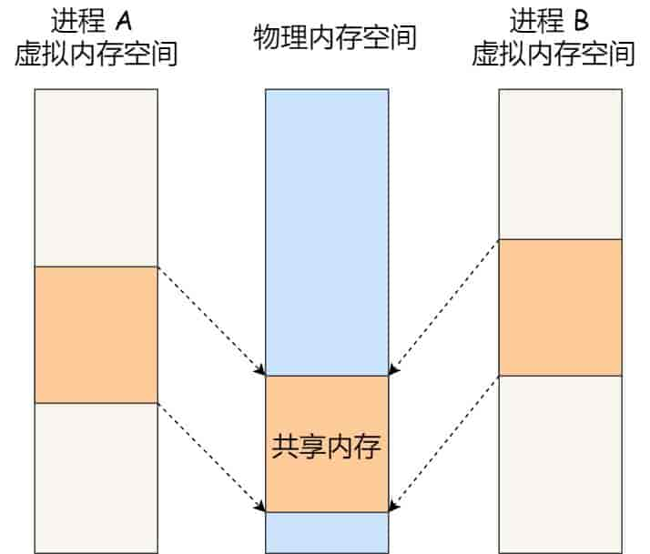

在 Linux 中，共享内存可以分为如下几类。

### a、匿名共享内存

**工作原理**：匿名共享内存不与任何具体的文件系统文件直接关联，其内容仅在内存中存在。这意味着当所有使用它的进程都结束时，该内存区域的数据就会消失。这种特性使得匿名共享内存非常适合于那些需要临时共享数据但又不需要将数据持久存储到磁盘的场景。

简单图解：

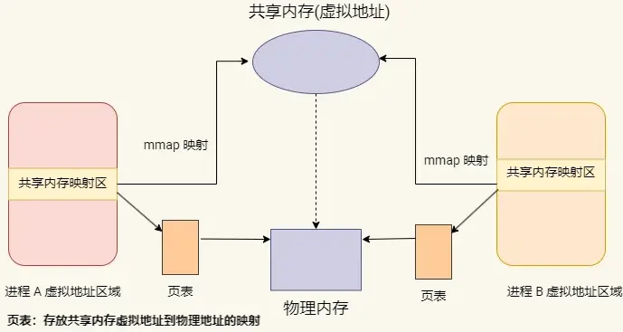

注意：在 Linux 中，匿名共享内存主要被设计用于有亲缘关系的进程间通信，如父子进程间。这是因为匿名共享内存的引用（例如，通过 mmap 创建时返回的内存地址）不会自动出现在其他进程中，而是需要通过某种进程间通信的方式（如Unix域套接字）传递给相关的进程。而通过 Unix 域套接字来实现又稍显复杂，所以我们一般推荐匿名共享内存适用于有亲缘关系的进程间通信。

创建和使用：

在 Linux 系统中，匿名共享内存通常是通过 mmap()函数创建的，调用时需指定MAP_ANONYMOUS标志。此外，还需要设置 PROT_READ 和 PROT_WRITE 权限，以确保内存区域可读写。创建时也可以选择 MAP_SHARED 标志，以便在多个进程间共享这块内存。

示例代码片段如下：

```c
#include <sys/mman.h>
void* shared_memory = mmap(NULL, size, PROT_READ | PROT_WRITE, MAP_SHARED | MAP_ANONYMOU);
```

在这里，size是希望映射的内存区域大小，mmap()调用成功后，返回指向共享内存区域的指针。

使用场景：

**大量数据交换** ：当两个或多个进程需要交换大量数据时，使用共享内存比传统的进程间通信方法（如管道或消息队列）更有效率。

使用信号量来解决匿名共享内存同步问题的简单示例：

```c
int main() {
    // 创建有名信号量
    sem_t *sem = sem_open("/mysemaphore", O_CREAT, 0666, 1);

    // 创建匿名共享内存
    int *counter = mmap(NULL, sizeof(int), PROT_READ | PROT_WRITE, MAP_SHARED | MAP_ANONYMOUS, -1, 0);
    *counter = 0;  // 初始化计数器

    pid_t pid = fork();
    if (pid == 0) {
        // 子进程
        for (int i = 0; i < 10; ++i) {
            sem_wait(sem); // 等待信号量
            (*counter)++;   // 递增计数器
            printf("Child process increments counter to %d\n", *counter);
            sem_post(sem);  // 释放信号量
            sleep(1);       // 模拟工作负载
        }
        exit(0);
    } else {
        // 父进程
        for (int i = 0; i < 10; ++i) {
            sem_wait(sem); // 等待信号量
            printf("Parent process reads counter as %d\n", *counter);
            sem_post(sem); // 释放信号量
            sleep(1);      // 模拟工作负载
        }

        // 等待子进程结束
        wait(NULL);
        sem_close(sem);
        sem_unlink("/mysemaphore");
        munmap(counter, sizeof(int)); // 释放共享内存
    }

    return 0;
}
```

### b、基于文件的共享内存

工作原理：基于文件的共享内存通过将磁盘上的实际文件映射到一个或多个进程的地址空间中来实现。当文件被映射到内存后，进程就可以像访问普通内存一样直接读写文件内容，操作系统负责同步内存修改回磁盘文件。这种机制既提高了数据访问的效率，也实现了数据的持久化存储。

相比匿名共享内存只能适合有亲缘关系的进程，**基于文件的共享内存特别适合于实现非亲缘关系进程间的数据共享**。

简单图解：

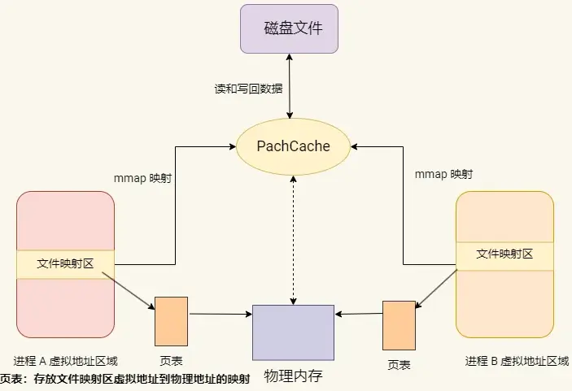

创建和使用：

要创建基于文件的共享内存，首先需要打开（或创建）一个文件，然后使用 mmap()将文件映射到内存中。与匿名共享内存不同，这里需要提供文件描述符而不是 MAP_ANONYMOUS 标志。

示例代码片段如下：

```c
#include <sys/mman.h>
#include <fcntl.h>

size_t size = 4096; // 共享内存区域大小

int fd = open("shared_file", O_RDWR | O_CREAT, 0666);
ftruncate(fd, size); // 设置文件大小
void* shared_memory = mmap(NULL, size, PROT_READ | PROT_WRITE, MAP_SHARED, fd, 0);
```

在这里，shared_file 是被映射的文件名，size 是文件的预期大小。通过 ftruncate() 调整文件大小以匹配共享内存的需求。mmap()成功后返回指向共享内存区域的指针。

使用场景：

-   **大量数据交换** ：基于文件的共享内存同样适用于多个进程需要进行大量数据交换的场景。与匿名共享内存不同的是，这些数据可以持久化存储到磁盘上。

下面来看一个使用**有名信号量解决基于文件的共享内存同步问题的示例**，这个简单的示例演示了两个进程：一个进程向共享内存写入数据，另一个进程从共享内存读取数据。这两个进程使用同一个有名信号量来同步对共享内存区域的访问。

示例代码：

**写入进程**：

```c
int main() {
    const char *filename = "shared_file";
    const size_t size = 4096;

    // 打开共享文件
    int fd = open(filename, O_RDWR | O_CREAT, 0666);

    // 映射文件到内存
    void *addr = mmap(NULL, size, PROT_READ | PROT_WRITE, MAP_SHARED, fd, 0);

    // 打开有名信号量
    sem_t *sem = sem_open("/mysemaphore", O_CREAT, 0666, 1);

    // 等待信号量，写入数据
    sem_wait(sem);
    strcpy((char *) addr, "Hello from writer process!");
    sem_post(sem);

    // 清理
    munmap(addr, size);
    close(fd);
    sem_close(sem);

    return 0;
}
```

读取进程：

```c
int main() {
    const char *filename = "shared_file";
    const size_t size = 4096;

    // 打开共享文件
    int fd = open(filename, O_RDONLY);

    // 映射文件到内存
    void *addr = mmap(NULL, size, PROT_READ, MAP_SHARED, fd, 0);

    // 打开有名信号量
    sem_t *sem = sem_open("/mysemaphore", O_CREAT, 0666, 1);

    // 等待信号量，读取数据
    sem_wait(sem);
    printf("Read from shared memory: %s\n", (char *) addr);
    sem_post(sem);

    // 清理
    munmap(addr, size);
    close(fd);
    sem_close(sem);

    return 0;
}
```

**说明**：上面的信号量初始值为 1，实际上信号量在这里充当的就是互斥锁。

### c、Posix 共享内存

与基于文件的共享内存相比，POSIX 共享内存不需要直接映射磁盘上的文件，而是通过创建命名的共享内存对象来实现进程间的数据共享。这些对象虽然在逻辑上类似于文件（因为可以通过shm_open创建和打开），但实质上直接存在于内存中，提供了更快的数据访问速度。

Posix 共享内存接口：

-   shm_open()：创建或打开一个共享内存对象
-   shm_unlink()：删除一个共享内存对象的名称
-   ftruncate()：调整共享内存对象的大小
-   mmap()：将共享内存对象映射到调用进程的地址空间
-   munmap()：解除共享内存对象的映射

以下是一个 使用 POSIX 共享内存进行**两个不相关进程**间通信的简化示例。一个进程写数据，另一个进程读取数据。

写入进程 (writer.c)

```c
#define SHM_NAME "/example_shm"     // 共享内存名称
#define SHM_SIZE 4096               // 共享内存大小
#define SEM_NAME "/example_sem"     // 信号量名称

int main() {
    // 创建或打开共享内存对象
    int shm_fd = shm_open(SHM_NAME, O_CREAT | O_RDWR, 0666);
    ftruncate(shm_fd, SHM_SIZE);

    // 映射共享内存到进程地址空间
    void *ptr = mmap(0, SHM_SIZE, PROT_WRITE | PROT_READ, MAP_SHARED, shm_fd, 0);

    // 创建或打开有名信号量，初始值为 1
    sem_t *sem = sem_open(SEM_NAME, O_CREAT, 0666, 1);

    // 等待信号量，开始写入数据
    sem_wait(sem);
    const char *message = "Hello from writer process!";
    sprintf(ptr, "%s", message);
    printf("Writer wrote to shared memory: %s\n", message);
    sem_post(sem);  // 释放信号量

    // 清理资源
    munmap(ptr, SHM_SIZE);
    close(shm_fd);
    sem_close(sem);

    return 0;
}
```

读取进程 (reader.c)

```c
#define SHM_NAME "/example_shm"     // 共享内存名称
#define SHM_SIZE 4096               // 共享内存大小
#define SEM_NAME "/example_sem"     // 信号量名称

int main() {
    // 打开已经存在的共享内存对象
    int shm_fd = shm_open(SHM_NAME, O_RDONLY, 0666);

    // 映射共享内存到进程地址空间
    void *ptr = mmap(0, SHM_SIZE, PROT_READ, MAP_SHARED, shm_fd, 0);

    // 打开有名信号量
    sem_t *sem = sem_open(SEM_NAME, 0);

    // 等待信号量，开始读取数据
    sem_wait(sem);
    printf("Reader read from shared memory: %s\n", (char *) ptr);
    sem_post(sem);  // 释放信号量

    // 清理资源
    munmap(ptr, SHM_SIZE);
    close(shm_fd);
    sem_close(sem);

    return 0;
}
```

### d、System V共享内存

与POSIX共享内存不同，System V共享内存使用IPC键值key_t来标识和管理共享内存段，而不是通过命名的方式。这种机制提供了一套底层控制共享内存的API，允许进行更细粒度的操作，如权限控制、共享内存状态的查询和管理等。

System V共享内存接口：

-   shmget()：创建或获取共享内存段的标识符
-   shmat()：将共享内存段附加到进程的地址空间
-   shmdt()：分离共享内存段和进程的地址空间
-   shmctl()：对共享内存段执行控制操作

**示例演示**：

以下是一个使用 System V 共享内存 和 System V 信号量 实现两个不相关进程的同步通信的示例。一个进程写入共享内存，另一个进程读取共享内存，并通过信号量进行同步控制。

信号量初始化 (semaphore_init.c)

```c
#define FILE_PATH "sharedfile"  // ftok生成key所用的文件路径

int main() {
    // 生成信号量键值
    key_t sem_key = ftok(FILE_PATH, 'B');

    // 创建信号量集，包含一个信号量
    int sem_id = semget(sem_key, 1, 0666 | IPC_CREAT);

    // 初始化信号量的值为 1
    semctl(sem_id, 0, SETVAL, 1);

    printf("Semaphore initialized.\n");

    return 0;
}
```

写入进程 (writer.c)

```c
#define SHM_SIZE 1024  // 共享内存大小
#define FILE_PATH "sharedfile"  // ftok生成key所用的文件路径

int main() {
    // 生成共享内存和信号量的键值
    key_t shm_key = ftok(FILE_PATH, 'A');
    key_t sem_key = ftok(FILE_PATH, 'B');

    // 创建共享内存段
    int shm_id = shmget(shm_key, SHM_SIZE, 0666 | IPC_CREAT);

    // 将共享内存段附加到进程的地址空间
    char *shm_ptr = (char *) shmat(shm_id, NULL, 0);

    // 创建信号量集，只有一个信号量
    int sem_id = semget(sem_key, 1, 0666 | IPC_CREAT);

    // 等待信号量
    struct sembuf sem_op = {0, -1, 0};  // P 操作
    semop(sem_id, &sem_op, 1);

    // 向共享内存写入数据
    strcpy(shm_ptr, "Hello from writer process!");
    printf("Writer wrote to shared memory: %s\n", shm_ptr);

    // 释放信号量
    sem_op.sem_op = 1;  // V 操作
    semop(sem_id, &sem_op, 1);

    // 分离共享内存段
    shmdt(shm_ptr);

    return 0;
}
```

读取进程 (reader.c)

```c
#define SHM_SIZE 1024  // 共享内存大小
#define FILE_PATH "sharedfile"  // ftok生成key所用的文件路径

int main() {
    // 生成共享内存和信号量的键值
    key_t shm_key = ftok(FILE_PATH, 'A');
    key_t sem_key = ftok(FILE_PATH, 'B');

    // 获取共享内存段
    int shm_id = shmget(shm_key, SHM_SIZE, 0666);

    // 将共享内存段附加到进程的地址空间
    char *shm_ptr = (char *) shmat(shm_id, NULL, 0);

    // 获取信号量集
    int sem_id = semget(sem_key, 1, 0666);

    // 等待信号量
    struct sembuf sem_op = {0, -1, 0};  // P 操作
    semop(sem_id, &sem_op, 1);

    // 读取共享内存中的数据
    printf("Reader read from shared memory: %s\n", shm_ptr);

    // 释放信号量
    sem_op.sem_op = 1;  // V 操作
    semop(sem_id, &sem_op, 1);

    // 分离共享内存段
    shmdt(shm_ptr);

    return 0;
}
```

### 共享内存的缺点与注意事项

虽然共享内存效率最高，但它也带来了复杂性和风险：

**同步需求：**多个进程同时读写共享内存会导致竞争条件（Race Conditions）。**必须使用额外的同步机制**，如：

*   **信号量（Semaphore）**：最常用的同步共享内存的方式（`System V` 或 `POSIX`）。
*   **互斥锁（Mutex）和条件变量（Condition Variable）**：`POSIX`线程同步原语，如果共享内存用于存放这些结构，进程间也可使用（需要放在共享内存区域并设置为进程间共享`PTHREAD_PROCESS_SHARED`）。
*   **文件锁（Flock/Fcntl）**：效率相对较低。
*   **原子操作（Atomic Operations）**：用于简单的计数器或标志位。

**这些同步操作本身会引入开销，并且增加了编程的复杂度。**

-   **安全性：**缺乏内置的访问控制（不像消息队列或套接字可能有权限标识）。需要进程自己协调好访问权限。
-   **易错性：**编程错误（如不同步、越界访问）容易导致数据损坏、死锁等问题，调试困难。
-   **内存管理：**需要显式地创建、附加、分离和销毁共享内存段，管理不当可能导致内存泄漏或资源未释放。
-   **缓存一致性：**在现代多核CPU架构下，不同CPU核心上的进程缓存（Cache）需要保持共享内存数据的一致性（由硬件和内核负责的缓存一致性协议如MESI保证），这本身也会有一些开销，但通常远低于数据复制。

### Tips

| 类型               | 区别                                                         | 适用场景                                                  | 使用方式                              |
| :----------------- | :----------------------------------------------------------- | :-------------------------------------------------------- | :------------------------------------ |
| 匿名共享内存       | 无需文件支持，进程通过内存页直接共享数据，通常通过 `mmap()`  进行内存映射 | 需要快速创建和销毁共享内存，且不需要持久化                | `mmap()` , `sem_open()`               |
| 基于文件的共享内存 | 使用文件作为媒介，进程通过文件系统共享内存，适合需要持久化的场景 | 共享数据需要持久化或跨设备使用                            | `mmap()` , `open()` **,**`sem_open()` |
| POSIX 共享内存     | POSIX 标准接口，更现代，支持更细粒度的控制和权限管理         | 在 POSIX 兼容系统中，适合现代应用程序，提供更好的并发控制 | `shm_open()` , `mmap()`               |
| System V 共享内存  | 传统 System V 接口，支持较大规模共享内存段，但接口老旧       | 老系统或需要兼容旧版代码，适用于大规模数据共享            | `shmget()` , `shmat()`                |

## 消息队列 (Message Queues)

管道的通信方式是效率低的，因此管道不适合进程间频繁地交换数据。

对于这个问题，**消息队列**的通信模式就可以解决。比如，A 进程要给 B 进程发送消息，A 进程把数据放在对应的消息队列后就可以正常返回了，B 进程需要的时候再去读取数据就可以了。同理，B 进程要给 A 进程发送消息也是如此。

消息这种模型，两个进程之间的通信就像平时发邮件一样，你来一封，我回一封，可以频繁沟通了。

但邮件的通信方式存在不足的地方有两点，**一是通信不及时，二是附件也有大小限制**，这同样也是消息队列通信不足的点。

**消息队列不适合比较大数据的传输**，因为在内核中每个消息体都有一个最大长度的限制，同时所有队列所包含的全部消息体的总长度也是有上限。在 Linux 内核中，会有两个宏定义 `MSGMAX` 和 `MSGMNB`，它们以字节为单位，分别定义了一条消息的最大长度和一个队列的最大长度。

>   消息队列是一种允许一个或多个进程向其写入消息，并由一个或多个进程读取消息的 IPC 机制。每条消息都由一个消息队列标识符（ID）识别，且可以携带一个特定的类型。消息队列允许不同进程非阻塞地发送和接收记录或数据块，这些记录可以是不同类型和大小的。

消息队列图解：

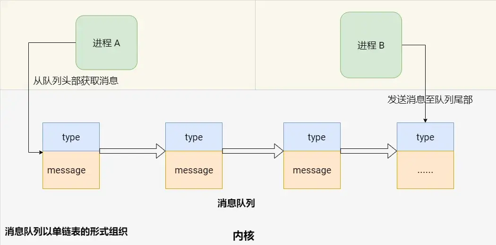

**消息队列是保存在内核中的消息链表**，在发送数据时，会分成一个一个独立的数据单元，也就是消息体（数据块），消息体是用户自定义的数据类型，消息的发送方和接收方要约定好消息体的数据类型，所以每个消息体都是固定大小的存储块，不像管道是无格式的字节流数据。如果进程从消息队列中读取了消息体，内核就会把这个消息体删除。

**消息队列通信过程中，存在用户态与内核态之间的数据拷贝开销**，因为进程写入数据到内核中的消息队列时，会发生从用户态拷贝数据到内核态的过程，同理另一进程读取内核中的消息数据时，会发生从内核态拷贝数据到用户态的过程。

消息队列生命周期随内核，如果没有释放消息队列或者没有关闭操作系统，消息队列会一直存在，而匿名管道的生命周期，是随进程的创建而建立，随进程的结束而销毁。

使用场景：

-   进程间通信：在涉及多个运行进程的应用中，消息队列提供了一种高效的方式来传递信息。它允许进程之间无需直接相互连接就能交换数据，从而简化了通信过程。
-   异步数据处理**：**消息队列使进程能够异步处理信息。一个进程（即生产者）可以发送任务或数据至队列，并继续其他操作，而另一进程（即消费者）可以在准备就绪时从队列中取出并处理这些数据。这种模式有效地分离了数据的生成和消费过程，提高了应用的效率和响应速度。

以下是使用 System V 消息队列的一个简单示例：

```c
struct message {
    long mtype;
    char mtext[100];
};

// 发送消息至消息队列
int main() {
    key_t key = ftok("queuefile", 65);  // 生成唯一键
    int msgid = msgget(key, 0666 | IPC_CREAT); // 创建消息队列
    struct message msg;
    msg.mtype = 1; // 设置消息类型
    sprintf(msg.mtext, "Hello World"); // 消息内容
    msgsnd(msgid, &msg, sizeof(msg.mtext), 0); // 发送消息
    printf("Sent message: %s\n", msg.mtext);
    return 0;
}

// 从消息队列中获取消息
int main() {
    key_t key = ftok("queuefile", 65);
    int msgid = msgget(key, 0666 | IPC_CREAT);
    struct message msg;
    msgrcv(msgid, &msg, sizeof(msg.mtext), 1, 0); // 接收消息
    printf("Received message: %s\n", msg.mtext);
    msgctl(msgid, IPC_RMID, NULL); // 销毁消息队列
    return 0;
}
```

## 套接字 (Sockets)

套接字是一种在不同进程间进行数据交换的通信机制。在 Linux 中，套接字可以用于同一台机器上的进程间通信（IPC）或不同机器上的网络通信。套接字支持多种通信协议，最常见的是TCP（可靠的、连接导向的协议）和UDP（无连接的、不可靠的协议）。

简单图解：

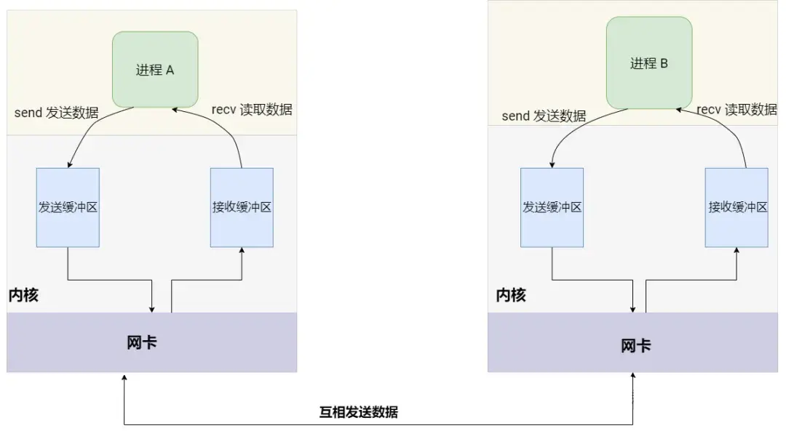

**使用场景：**

-   **网络通信**：同一台主机或不同主机上的进程之间通过网络套接字进行数据交换。

**简单示例：**使用 TCP 套接字进行通信

服务端 (server.c)

```c
int main() {
    int server_fd, new_socket;
    struct sockaddr_in address;
    int addrlen = sizeof(address);
    char buffer[1024] = {0};

    // 创建套接字
    server_fd = socket(AF_INET, SOCK_STREAM, 0);

    // 定义套接字地址
    address.sin_family = AF_INET;
    address.sin_addr.s_addr = INADDR_ANY;
    address.sin_port = htons(8080);

    // 绑定套接字到地址和端口
    bind(server_fd, (struct sockaddr *) &address, sizeof(address));

    // 监听套接字
    listen(server_fd, 3);

    while (1) {
        // 接受客户端连接
        new_socket = accept(server_fd, (struct sockaddr *) &address, (socklen_t * ) & addrlen);

        // 读取客户端数据
        read(new_socket, buffer, 1024);
        printf("Message from client: %s\n", buffer);

        // 关闭客户端连接
        close(new_socket);
    }

    // 关闭服务器套接字
    close(server_fd);

    return 0;
}
```

客户端 (client.c)

```c
int main() {
    int sock = 0;
    struct sockaddr_in serv_addr;

    // 创建套接字
    sock = socket(AF_INET, SOCK_STREAM, 0);

    // 定义服务器地址
    serv_addr.sin_family = AF_INET;
    serv_addr.sin_port = htons(8080);

    // 连接到服务器
    connect(sock, (struct sockaddr *) &serv_addr, sizeof(serv_addr));

    // 发送数据到服务器
    char *message = "Hello from the client!";
    send(sock, message, strlen(message), 0);

    // 关闭套接字
    close(sock);

    return 0;
}
```

## 域套接字 (Unix Domain Sockets)

域套接字（Unix Domain Sockets）是一种在同一台机器上的进程间进行数据通信的机制。相对于网络套接字，它们提供了更高效的本地通信方式，因为数据不需要经过网络协议栈。域套接字支持流（类似TCP）和数据报（类似UDP）两种模式。

特别说明：在域套接字通信中，“不经过网络协议栈” 指的是数据传输不需要IP层的路由、不需要TCP/UDP等传输层协议的封包与解包处理，也不需要网络接口层的参与。这一点与网络套接字不同，后者用于跨网络的通信，需要经过完整的网络协议栈处理，包括数据的封装、传输、路由和解封装等。

简单图解：

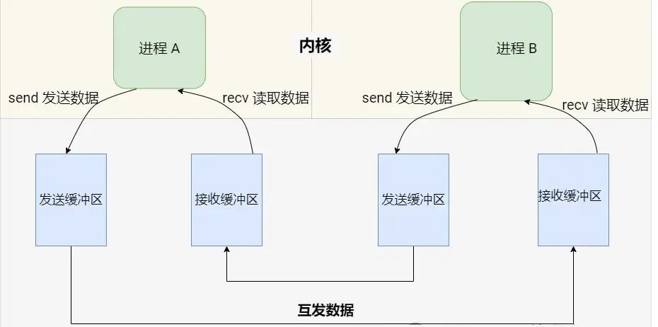

**使用场景：**

-   **本地进程间通信**：当需要在同一台机器上的不同进程间高效地交换数据时。
-   **替代管道和消息队列**：当需要比管道和消息队列更复杂的双向通信时。

简单示例：使用 Unix 域套接字进行通信

服务器端 (server.c)

```c
int main() {
    int server_fd, client_socket;
    struct sockaddr_un address;

    // 创建套接字
    server_fd = socket(AF_UNIX, SOCK_STREAM, 0);

    // 设置地址
    address.sun_family = AF_UNIX;
    strcpy(address.sun_path, "/tmp/unix_socket");

    // 绑定并监听
    bind(server_fd, (struct sockaddr *) &address, sizeof(address));
    listen(server_fd, 5);

    while (1) {
        // 接受客户端连接
        client_socket = accept(server_fd, NULL, NULL);

        // 读取客户端发送的数据
        char buffer[100];
        read(client_socket, buffer, sizeof(buffer));
        printf("Received: %s\n", buffer);

        // 关闭客户端套接字
        close(client_socket);
    }

    // 关闭服务器套接字并删除 socket 文件
    close(server_fd);
    unlink("/tmp/unix_socket");

    return 0;
}
```

客户端 (client.c)

```c
int main() {
    int sock;
    struct sockaddr_un address;

    // 创建套接字
    sock = socket(AF_UNIX, SOCK_STREAM, 0);

    // 设置地址
    address.sun_family = AF_UNIX;
    strcpy(address.sun_path, "/tmp/unix_socket");

    // 连接服务器
    connect(sock, (struct sockaddr *) &address, sizeof(address));

    // 发送数据到服务器
    char *message = "Hello from the client!";
    write(sock, message, strlen(message));

    // 关闭套接字
    close(sock);

    return 0;
}
```

注意事项：

-   Unix 域套接字的地址是文件系统中的路径，而不是IP地址和端口。
-   Unix 域套接字通常用于同一台机器上的进程间通信，而不适用于网络通信。
-   使用 Unix 域套接字时，需要确保套接字文件的路径是可访问的，并在通信完成后清理套接字文件。

## 效率最高是哪个？

在Linux下，**共享内存（Shared Memory）**是效率最高的进程间通信（IPC）手段，主要原因如下：

>   1、直接内存访问，数据拷贝次数最少

共享内存允许多个进程直接读写同一块物理内存区域，无需通过内核中转或多次数据拷贝。相比其他IPC机制（如管道、消息队列需要在内核和用户空间之间拷贝数据），共享内存仅需两次数据拷贝（输入文件到共享内存区，共享内存区到输出文件），大幅减少了开销。

>   2、绕过内核协议栈

共享内存的通信完全在用户空间完成，避免了内核态与用户态的切换开销。而其他机制（如套接字或管道）需要内核介入处理数据流，增加了延迟。

>   3、高性能场景的适用性

共享内存特别适合需要**高频、大数据量交换**的场景（如高性能计算、实时数据处理）。进程可以直接操作内存，速度接近内存访问的物理极限。相比之下，消息队列或管道因数据分片和拷贝会导致性能下降。

>   4、同步机制的灵活性

虽然共享内存本身不提供同步机制，但可以结合**信号量**或**互斥锁**实现进程间同步。这种分离设计使得开发者可以根据需求选择最优的同步策略，进一步优化性能。

>   其他高效IPC的对比

-   Unix Domain Socket (UDS)：虽然性能接近共享内存（绕过网络协议栈，内核内存处理），但仍需系统调用和内核缓冲区的数据拷贝，效率略低。
-   内存映射文件：类似共享内存，但涉及文件I/O操作，性能受磁盘速度限制。

>   注意事项

共享内存的缺点是需要**手动管理同步**（如避免竞态条件），且**不适用于跨主机通信**。若对实时性要求极高且通信方在同一主机，共享内存是最优选择；若需简化开发或跨网络通信，则需考虑其他机制（如套接字或消息队列）。

**替代选择：**

*   对于中小数据量或更注重简洁性和安全性，**命名管道（FIFO）** 或 **本地Unix域套接字（AF_UNIX Sockets）** 通常是更简单、更安全的选择，虽然效率低于共享内存但通常足够。
*   **内存映射文件**在需要文件持久化或特定场景下是共享内存的良好替代品，效率接近。

选择哪种IPC技术，必须**在效率、开发复杂度、安全性、功能需求之间进行权衡**。共享内存是性能冠军，但也需要最谨慎的使用。

综上，共享内存凭借其**零拷贝、低延迟、高吞吐**的特性，成为Linux下最高效的IPC方式。

## 共享内存与其他主要IPC方式的效率对比

在Linux下，**效率最高的进程间通信（IPC）手段通常是共享内存**。原因在于其设计原理最大程度地减少了数据复制的开销。

以下是与其他主要IPC方式的效率对比

**管道（无名管道/Pipe 和 命名管道/FIFO）：**

*   数据需要在内核维护的缓冲区中进行中转。
*   写进程通过`write`系统调用将数据从用户空间拷贝到内核缓冲区。
*   读进程通过`read`系统调用将数据从内核缓冲区拷贝到自己的用户空间。
*   **涉及两次用户态/内核态切换（每次系统调用）和至少两次数据拷贝（用户->内核->用户）。** 对于频繁或大量数据传输，开销显著。

**消息队列：**
*   数据被放入内核维护的消息队列中。
*   发送进程通过`msgsnd`将数据从用户空间拷贝到内核中的消息结构体。
*   接收进程通过`msgrcv`将数据从内核中的消息结构体拷贝到自己的用户空间。
*   **同样涉及系统调用切换和两次数据拷贝（用户->内核->用户）。** 内核管理消息队列本身也带来一定开销。虽然结构化消息提供了便利，但效率低于共享内存。

**套接字（Socket）（尤其是本地Unix域套接字/AF_UNIX）：**
*   本地Unix域套接字是效率最高的套接字类型，避免了网络协议栈的开销，可以在内核中通过文件系统inode直接通信，有时甚至能利用内核缓冲区进行一定优化（如`sendfile`）。
*   然而，标准的`send`/`recv`操作通常**仍然涉及数据在用户空间和内核空间之间的拷贝（用户->内核->用户）以及系统调用开销**。虽然优化后的本地套接字性能很好（接近甚至有时能超过管道/FIFO），但**理论极限和常规使用上仍不及精心设计的共享内存**。

**信号（Signal）：**
*   严格来说，信号不是用于常规数据传输的IPC机制。它能传递的信息量极小（只有一个信号编号和极有限的附加数据`sigval`）。
*   发送和处理信号涉及内核调度、中断进程执行等，开销相对较大且不适合数据交换。**效率问题不在于数据传输速度，而在于其根本不适合传输数据。**

**内存映射文件（Memory-Mapped Files）：**
*   机制与共享内存非常相似，底层都是通过映射同一块物理内存（可能是由文件支持的）到不同进程的地址空间。
*   效率也很高，接近共享内存。主要区别在于它有一个关联的磁盘文件，同步回写文件可能带来额外I/O开销（虽然可以使用`MAP_SHARED`和`msync`控制）。如果不需要持久化到文件，纯共享内存通常更纯粹、更直接。

## 共享内存的使用有哪些需要注意的地方？

共享内存虽然高效，但使用中充满陷阱。以下是必须严格注意的关键事项，附详细说明：

### 同步问题（核心挑战）
>   竞态条件（Race Conditions）

多个进程同时读写同一内存区域时，数据可能被覆盖或损坏。

**解决方案**：

- **信号量（Semaphore）**：最常用（System V 或 POSIX）。
- **互斥锁（Mutex）+ 条件变量**：需设置 `PTHREAD_PROCESS_SHARED` 属性（示例代码）：
  ```c
  pthread_mutexattr_t attr;
  pthread_mutexattr_init(&attr);
  pthread_mutexattr_setpshared(&attr, PTHREAD_PROCESS_SHARED);
  pthread_mutex_init(&shm->lock, &attr);  // shm 是共享内存区域
  ```
- **原子操作**（如 `__atomic_add_fetch`）用于简单计数器。

>   缓存一致性（Cache Coherency）

多核 CPU 中，各核心的缓存可能导致数据不一致。

**应对**：

- 使用内存屏障（`__sync_synchronize()` 或 C11 `atomic_thread_fence()`）。
- 避免依赖 `volatile`（它不保证原子性）。

### 内存管理与生命周期

创建与销毁责任

- 明确哪个进程负责创建（`shmget()`/`shm_open()`）和销毁（`shmctl()`/`shm_unlink()`）。
- 显式清理：共享内存需手动释放（shmdt解除映射，shmctl删除内存段），否则可能导致内存泄漏。
- **常见错误**：进程崩溃后共享内存残留（需用 `ipcrm` 手动清理）。

附着（Attach）与分离（Detach）

- 结束时必须调用 `shmdt()` 分离内存，否则可能泄露资源。
- 最后一个进程分离后，需显式销毁共享内存段。

**系统限制**

-   大小限制：Linux默认共享内存段大小受SHMMAX限制（通常32MB），可通过修改`/proc/sys/kernel/shmmax`调整。

-   数量限制：系统级参数SHMMNI（最大共享内存段数）和SHMALL（总共享内存页数）需合理配置。

### 安全与权限
**访问控制**：

-   设置共享内存权限（如shm_open的0660模式），限制非授权进程访问。

-   敏感数据建议加密存储。

示例：

```c
int shm_id = shmget(key, size, IPC_CREAT | 0666);  // System V
int fd = shm_open("/my_shm", O_CREAT | O_RDWR, 0666); // POSIX
```
* 权限不足会导致其他进程无法访问。

**安全风险**

- 恶意进程可能注入数据或破坏内存。
- 无亲缘关系的进程需通过键值（ftok生成）或ID访问共享内存。
- **建议**：在可信环境使用，或结合 Linux 命名空间隔离（如 Docker）。

### 内存对齐与布局

**结构体对齐（Padding）**：不同进程编译环境差异可能导致结构体内存布局不同。

**对策**：

- 使用 `#pragma pack(1)` 或 `__attribute__((packed))` 强制紧凑布局。
- 避免在共享内存中存储指针（虚拟地址无效）。

**跨平台兼容性**：数据序列化（如 Protocol Buffers）可解决字节序问题，但会增加开销。

### 性能陷阱
>   **伪共享（False Sharing）**

多个 CPU 核心频繁修改同一Cache Line中的不同变量，导致缓存失效。

**优化**：将高频读写的数据隔离到不同的 Cache Line（通常 64 字节对齐）。

示例：
```c
struct {
    int data1 __attribute__((aligned(64))); // 对齐到 Cache Line
    int data2 __attribute__((aligned(64)));
} shm_data;
```

>   **锁竞争**

过度使用锁会抵消共享内存的性能优势。

**方案**：

- 无锁数据结构（如 Ring Buffer）。
- 读写锁（`pthread_rwlock_t`）替代互斥锁。

### 数据一致性与完整性

显式初始化：共享内存的初始值未定义，必须显式初始化（如memset或构造函数）。

数据校验

-   使用校验和、版本号或原子操作（如std::atomic）确保数据完整性。

-   避免缓存不一致（多核CPU中），可通过内存屏障或缓存对齐（如alignas(64)）解决。

### 错误处理与调试

系统调用检查

-   检查shmget、mmap等函数的返回值，失败时处理错误（如perror） 。

工具辅助

-   使用ipcs查看共享内存状态，ipcrm手动清理残留资源。

### 其他陷阱

1.  多次挂载问题：同一进程多次调用shmat会导致多个虚拟地址映射同一物理内存，可能耗尽进程地址空间。应避免重复挂载。

2.  跨主机限制：共享内存仅适用于单机通信，跨主机需结合网络机制（如套接字）。

### 调试与维护

**工具使用**

- `ipcs -m` 查看 System V 共享内存段。
- `lsof | grep shm` 定位打开的 POSIX 共享内存。
- `cat /proc/sysvipc/shm` 获取内核共享内存状态。

**日志与断言**：在共享内存操作前后加入日志，但注意避免日志函数本身引发阻塞。

### 替代方案选择

| **场景**       | **推荐方式**                  | **原因**                 |
| -------------- | ----------------------------- | ------------------------ |
| 需持久化存储   | 内存映射文件 (`mmap`)         | 数据可保存到磁盘         |
| 简单小数据通信 | Unix 域套接字                 | 无需处理同步，开发简单   |
| 临时高性能通信 | 匿名共享内存 (`memfd_create`) | 无文件系统残留，容器友好 |

### 最佳实践总结

**同步先行**：设计时优先规划锁机制（如信号量+互斥锁组合）。

**权限最小化**：仅开放必要进程的访问权限（如 `0600`）。

**资源清理**：进程退出前主动分离并销毁共享内存。

**内存隔离**：高频变量按 Cache Line 对齐，避免伪共享。

**防御性编程**：共享内存区域加入 Magic Number 校验数据有效性：

```c
struct ShmHeader {
    uint32_t magic;  // 例如 0xDEADBEEF
    int data_version;
};
```

> ⚠️：共享内存的调试难度远高于其他 IPC。务必编写完备的单元测试，模拟进程崩溃、并发冲突等边界场景。

