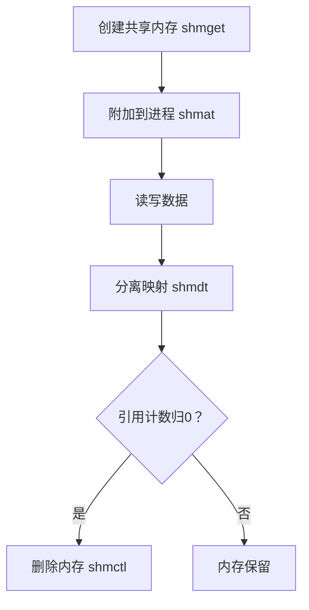

# 共享内存是怎么通信的？

Linux共享内存是一种高效的进程间通信（IPC）机制，其核心原理是==多个进程通过页表映射将同一块物理内存区域，关联到各自的虚拟地址空间==，从而实现数据的直接共享。



## 核心原理

**物理内存共享**

多个进程的虚拟地址通过页表映射到同一块物理内存区域。当一个进程修改该内存时，其他进程可及时看到更新，**无需内核介入数据拷贝**。

**映射过程**：

1.  创建共享内存区域（物理内存开辟）。
2.  各进程调用 `shmat()` 将共享内存附加到自身虚拟地址空间。
3.  进程通过返回的指针直接读写内存。

**高效性优势**

-   **仅两次数据拷贝**：数据从发送进程用户空间 → 共享内存 → 接收进程用户空间，而管道/消息队列需4次拷贝（用户-内核-内核-用户）。
-   **访问速度**：等同于访问进程自身内存，避免系统调用切换开销。

## 实现方式：System V vs POSIX

| 特性     | System V 共享内存              | POSIX 共享内存              |
| :----- | :--- | : |
| 创建接口 | `shmget()`                         | `shm_open()` + `mmap()`         |
| 标识机制 | 基于 `key_t`（通过 `ftok()` 生成） | 基于文件名（如 `/dev/shm/xxx`） |
| 控制函数 | `shmctl()`                         | `ftruncate()` + `munmap()`      |
| 生命周期 | 随内核持续（需显式删除）           | 文件系统持久（可手动清理）      |
| 典型场景 | 传统IPC                            | 更符合现代API标准               |

关键步骤（System V为例）：

**1、生成唯一键值**：

```c
key_t key = ftok("/tmp", 123); // 通过文件路径和项目ID生成
```

**2、创建共享内存**：

```c
int shmid = shmget(key, 4096, IPC_CREAT | 0666); // 大小需4KB对齐
```

**3、附加到进程地址空间**：

```c
char *ptr = (char*)shmat(shmid, NULL, 0); // 返回映射后的虚拟地址指针
```

**4、分离与删除**：

```c
shmdt(ptr);                          // 解除映射
shmctl(shmid, IPC_RMID, NULL);       // 标记删除（引用计数归0时释放）
```

## ⏳ 生命周期与资源管理

**随内核持续**：共享内存段一旦创建，即使所有进程退出，仍保留在内核中，直至**显式删除**（`shmctl(IPC_RMID)`）或系统重启。

**引用计数**：

-   `shmat()` 时计数+1，`shmdt()` 时计数-1。
-   计数归零且标记 `IPC_RMID` 后，内核才释放物理内存。

**管理命令**：

-   查看：`ipcs -m`
-   删除：`ipcrm -m <shmid>`

## 注意事项

### 同步问题（核心挑战）

>   竞态条件（Race Conditions）

多个进程同时读写同一内存区域时，数据可能被覆盖或损坏。

>   缓存一致性（Cache Coherency）

多核 CPU 中，各核心的缓存可能导致数据不一致。

**应对**：

- 使用内存屏障（`__sync_synchronize()` 或 C11 `atomic_thread_fence()`）。
- 避免依赖 `volatile`（它不保证原子性）。

### 内存管理与生命周期

创建与销毁责任

- 明确哪个进程负责创建（`shmget()`/`shm_open()`）和销毁（`shmctl()`/`shm_unlink()`）。
- 显式清理：共享内存需手动释放（shmdt解除映射，shmctl删除内存段），否则可能导致内存泄漏。
- **常见错误**：进程崩溃后共享内存残留（需用 `ipcrm` 手动清理）。

附着（Attach）与分离（Detach）

- 结束时必须调用 `shmdt()` 分离内存，否则可能泄露资源。
- 最后一个进程分离后，需显式销毁共享内存段。

**系统限制**

-   大小限制：Linux默认共享内存段大小受SHMMAX限制（通常32MB），可通过修改`/proc/sys/kernel/shmmax`调整。

-   数量限制：系统级参数SHMMNI（最大共享内存段数）和SHMALL（总共享内存页数）需合理配置。

### 安全与权限

**访问控制**：

-   设置共享内存权限（如shm_open的0660模式），限制非授权进程访问。

-   敏感数据建议加密存储。

示例：

```c
int shm_id = shmget(key, size, IPC_CREAT | 0666);  // System V
int fd = shm_open("/my_shm", O_CREAT | O_RDWR, 0666); // POSIX
```

* 权限不足会导致其他进程无法访问。

**安全风险**

- 恶意进程可能注入数据或破坏内存。
- 无亲缘关系的进程需通过键值（ftok生成）或ID访问共享内存。
- **建议**：在可信环境使用，或结合 Linux 命名空间隔离（如 Docker）。

### 内存对齐与布局

**结构体对齐（Padding）**：不同进程编译环境差异可能导致结构体内存布局不同。

**对策**：

- 使用 `#pragma pack(1)` 或 `__attribute__((packed))` 强制紧凑布局。
- 避免在共享内存中存储指针（虚拟地址无效）。

**跨平台兼容性**：数据序列化（如 Protocol Buffers）可解决字节序问题，但会增加开销。

### 性能陷阱

>   **伪共享（False Sharing）**

多个 CPU 核心频繁修改同一Cache Line中的不同变量，导致缓存失效。

**优化**：将高频读写的数据隔离到不同的 Cache Line（通常 64 字节对齐）。

示例：

```c
struct {
    int data1 __attribute__((aligned(64))); // 对齐到 Cache Line
    int data2 __attribute__((aligned(64)));
} shm_data;
```

>   **锁竞争**

过度使用锁会抵消共享内存的性能优势。

**方案**：

- 无锁数据结构（如 Ring Buffer）。
- 读写锁（`pthread_rwlock_t`）替代互斥锁。

### 数据一致性与完整性

显式初始化：共享内存的初始值未定义，必须显式初始化（如memset或构造函数）。

数据校验

-   使用校验和、版本号或原子操作（如std::atomic）确保数据完整性。

-   避免缓存不一致（多核CPU中），可通过内存屏障或缓存对齐（如alignas(64)）解决。

### 错误处理与调试

系统调用检查

-   检查shmget、mmap等函数的返回值，失败时处理错误（如perror） 。

工具辅助

-   使用ipcs查看共享内存状态，ipcrm手动清理残留资源。

### 其他陷阱

1.  多次挂载问题：同一进程多次调用shmat会导致多个虚拟地址映射同一物理内存，可能耗尽进程地址空间。应避免重复挂载。

2.  跨主机限制：共享内存仅适用于单机通信，跨主机需结合网络机制（如套接字）。

### 调试与维护

**工具使用**

- `ipcs -m` 查看 System V 共享内存段。
- `lsof | grep shm` 定位打开的 POSIX 共享内存。
- `cat /proc/sysvipc/shm` 获取内核共享内存状态。

**日志与断言**：在共享内存操作前后加入日志，但注意避免日志函数本身引发阻塞。

### 替代方案选择

| **场景**       | **推荐方式**                  | **原因**                 |
| -------------- | ----------------------------- | ------------------------ |
| 需持久化存储   | 内存映射文件 (`mmap`)         | 数据可保存到磁盘         |
| 简单小数据通信 | Unix 域套接字                 | 无需处理同步，开发简单   |
| 临时高性能通信 | 匿名共享内存 (`memfd_create`) | 无文件系统残留，容器友好 |

### 最佳实践总结

**同步先行**：设计时优先规划锁机制（如信号量+互斥锁组合）。

**权限最小化**：仅开放必要进程的访问权限（如 `0600`）。

**资源清理**：进程退出前主动分离并销毁共享内存。

**内存隔离**：高频变量按 Cache Line 对齐，避免伪共享。

**防御性编程**：共享内存区域加入 Magic Number 校验数据有效性：

```c
struct ShmHeader {
    uint32_t magic;  // 例如 0xDEADBEEF
    int data_version;
};
```

⚠️：共享内存的调试难度远高于其他 IPC。务必编写完备的单元测试，模拟进程崩溃、并发冲突等边界场景。

## 典型应用场景

1.  **高性能计算**：多进程协作处理大型数据集（如矩阵运算）。
2.  **生产者-消费者模型**：实时数据流处理（如日志采集）。
3.  **临时共享存储**：进程间传递大规模临时数据（避免序列化开销）。

## 注意事项

1.  **安全风险**：未授权进程可能通过相同`key`访问共享内存（需合理设置权限）。
2.  **内存泄漏**：程序异常退出时需确保调用 `shmdt()` 和 `shmctl()`。
3.  **碎片化问题**：频繁创建/释放可能致物理内存碎片（建议复用内存段）。

