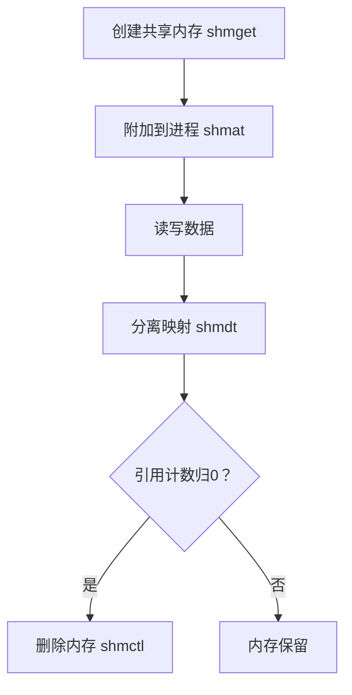

# 共享内存是怎么通信的？

Linux共享内存是一种高效的进程间通信（IPC）机制，其核心原理是==多个进程通过页表映射将同一块物理内存区域，关联到各自的虚拟地址空间==，从而实现数据的直接共享。



共享内存是Linux最快的IPC机制，但需开发者自行处理同步问题。合理搭配信号量或锁，可充分发挥其高性能优势，适用于实时性要求高的场景

## 核心原理

**物理内存共享**

多个进程的虚拟地址通过页表映射到同一块物理内存区域。当一个进程修改该内存时，其他进程可及时看到更新，**无需内核介入数据拷贝**。

**映射过程**：

1.  创建共享内存区域（物理内存开辟）。
2.  各进程调用 `shmat()` 将共享内存附加到自身虚拟地址空间。
3.  进程通过返回的指针直接读写内存。

**高效性优势**

-   **仅两次数据拷贝**：数据从发送进程用户空间 → 共享内存 → 接收进程用户空间，而管道/消息队列需4次拷贝（用户-内核-内核-用户）。
-   **访问速度**：等同于访问进程自身内存，避免系统调用切换开销。

## 实现方式：System V vs POSIX

| 特性     | System V 共享内存              | POSIX 共享内存              |
| :----- | :--- | : |
| 创建接口 | `shmget()`                         | `shm_open()` + `mmap()`         |
| 标识机制 | 基于 `key_t`（通过 `ftok()` 生成） | 基于文件名（如 `/dev/shm/xxx`） |
| 控制函数 | `shmctl()`                         | `ftruncate()` + `munmap()`      |
| 生命周期 | 随内核持续（需显式删除）           | 文件系统持久（可手动清理）      |
| 典型场景 | 传统IPC                            | 更符合现代API标准               |

关键步骤（System V为例）：

**1、生成唯一键值**：

```c
key_t key = ftok("/tmp", 123); // 通过文件路径和项目ID生成
```

**2、创建共享内存**：

```c
int shmid = shmget(key, 4096, IPC_CREAT | 0666); // 大小需4KB对齐
```

**3、附加到进程地址空间**：

```c
char *ptr = (char*)shmat(shmid, NULL, 0); // 返回映射后的虚拟地址指针
```

**4、分离与删除**：

```c
shmdt(ptr);                          // 解除映射
shmctl(shmid, IPC_RMID, NULL);       // 标记删除（引用计数归0时释放）
```

## ⏳ 生命周期与资源管理

**随内核持续**：共享内存段一旦创建，即使所有进程退出，仍保留在内核中，直至**显式删除**（`shmctl(IPC_RMID)`）或系统重启。

**引用计数**：

-   `shmat()` 时计数+1，`shmdt()` 时计数-1。
-   计数归零且标记 `IPC_RMID` 后，内核才释放物理内存。

**管理命令**：

-   查看：`ipcs -m`
-   删除：`ipcrm -m <shmid>`

## 同步问题与解决方案

共享内存**不提供内置同步机制**，并发读写可能导致数据损坏。

常用同步方案：

1.  信号量（Semaphore）：通过PV操作控制临界区访问（如 `sem_wait()`/`sem_post()`)。
2.  互斥锁（Mutex）：适用于多线程/多进程场景（需置于共享内存中）。
3.  文件锁（fcntl）：保护共享内存的特定区域。

## 典型应用场景

1.  **高性能计算**：多进程协作处理大型数据集（如矩阵运算）。
2.  **生产者-消费者模型**：实时数据流处理（如日志采集）。
3.  **临时共享存储**：进程间传递大规模临时数据（避免序列化开销）。

## 注意事项

1.  **安全风险**：未授权进程可能通过相同`key`访问共享内存（需合理设置权限）。
2.  **内存泄漏**：程序异常退出时需确保调用 `shmdt()` 和 `shmctl()`。
3.  **碎片化问题**：频繁创建/释放可能致物理内存碎片（建议复用内存段）。

