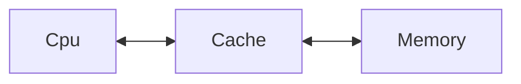
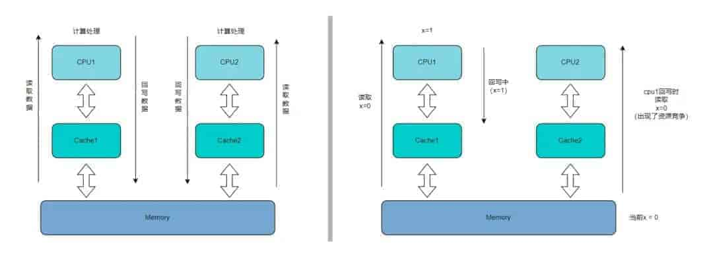

# 编程中的锁是如何实现的

## 为什么需要锁

### 如何做到多线程安全？

如何做到多线程的资源争夺安全？是一个非常经典的多线程应用问题。

对于大多数开发者能够第一想到的一种方案就是给程序上锁。正如下面的一段简单代码：

```c++
#include <iostream>
#include <mutex>
#include <thread>

// C++语言标准提供的锁的封装类型
std::mutex mtx;
int x = 0;

void test() {
    for (int i = 0; i < 100000; i += 1) {
        // 上锁
        mtx.lock();
        x += 1;
        // 解锁
        mtx.unlock();
    }
}

int main() {
    {
        std::jthread th1(test);
        std::jthread th2(test);
    }
    std::cout << x << std::endl;
}
```

该程序创建了两个线程，并在线程中都对同一个共享资源（对象 x）进行了操作。为了保证线程安全用了互斥锁（对象 mtx）对其进行保护。

倘若取消 mtx 对 x 操作时的保护，相信大多数情况下会出现五花八门的运行结果。可见，锁是在处理多线程资源争夺问题上的一种强力手段。

而为什么这么一个普通的对象，在多线程的操作中会与我们在单线程操作时的期望有所不同呢？下面我们先回顾一下计算机组成原理中内存模型的相关知识。

### 计算机内存模型

下面是一张简单的计算机内存模型图：



随着现代由于各种硬件的发展，缓存 Cache 的层数和实际逻辑策略的策略是有不同，但基本结构还是大致以这种分层的逻辑为主。

以上文中代码应用为例，假设两个线程分别运行在 CPU1 和 CPU2 中，都需要对 Memory 中的 x 进行操作。

在每次获取 x 值时从是经过 Memory -> Cache -> CPU，而回写又是反向的经过 CPU -> Cache -> Memory。

此时可能出现一种情况，当 CPU1 正在计算或者准备回写时，CPU2 还没等到 CPU1 的流水线回写到 Memory 就读取了 Memory 中的旧数据。自此两条流水线就完美的岔开了。这就是我们常说的资源竞争问题。



因此我们得出一个结论：资源竞争的出现需要至少一个非原子访问和至少一个写操作。

## 互斥锁的底层原理

互斥锁的实现通常结合了硬件原子指令和操作系统调度机制。

1、用户态尝试获取锁（自旋）：

-   当一个线程尝试获取互斥锁时，它首先会在用户态使用CPU提供的原子指令（如 `XCHG`、`CMPXCHG`）来尝试修改锁的状态（例如，将一个标志位从0设置为1）。
-   如果成功，表示获取到锁，线程进入临界区。
-   如果失败（锁已被其他线程持有），线程会进入一个短时间的自旋循环，不断地尝试获取锁。自旋的目的是为了避免频繁的用户态/内核态切换，因为上下文切换的开销较大。如果锁很快被释放，自旋可以更快地获取到锁。

2、内核态等待（阻塞）：

-   如果自旋一段时间后仍然无法获取锁，线程会判断锁的竞争可能比较激烈，或者锁的持有时间可能较长。此时，线程会放弃CPU，通过系统调用进入内核态。
-   在内核态，操作系统会将该线程的状态设置为“等待”（Waiting/Blocked），并将其从CPU的运行队列中移除，放入互斥锁的等待队列中。
-   操作系统会进行上下文切换，调度其他可运行的线程执行。

3、锁的释放与唤醒：

-   当持有锁的线程完成临界区操作后，它会通过原子操作释放锁（例如，将标志位从1设置为0）。
-   如果互斥锁的等待队列中有线程在等待，释放锁的线程会通过系统调用通知操作系统。
-   操作系统会从等待队列中选择一个或多个线程（通常是第一个等待的线程），将其状态设置为“就绪”（Ready），并将其放入CPU的运行队列中，等待被调度执行。
-   被唤醒的线程会从之前阻塞的地方继续执行，重新尝试获取锁。

## 实现锁的方式

关于编程中锁的具体实现，需要脱离我们的编程语言，往操作系统、硬件的支持这些更下的一层去探究。

### 中断的开关

在线程切换的时候需要用到中断，因此若关闭了中断，则可以阻止当前 CPU 运行的任务被其他任务所抢占。

这是一种非常简单粗暴的方式，具体的在进入临界区代码前关闭中断，离开临界区后重新开启中断。

简单的用伪码表示为：

```v
function lock()
    关闭中断

function unlock()
    开启中断

function thread_fun()
    lock()
    临界区操作
    unlock()
```

首先该方法的最大优点就是 **简单** ！

但是 **缺点** 却是一大堆，并且在多处理器的环境下该方法基本完全无效。因为在多处理器下，不同的线程极大可能的运行在不同的 CPU 下，当前进程下的线程不会互相切换，因此无法达到锁的目的。

但回到单处理器的环境，该方法也具有极大弊端。我们无法预料在临界区需要什么样的环境支持和会做什么。假如临界区就是需要一次 IO 中断的产生，那当前程序甚至说是整个计算机将会锁死。即使临界区本身不需要中断，也有可能一些耗时的操作导致后台中断的丢失或其他需要中断的任务无法正常运行而使得计算机直接死机。

### 基于原子的自旋锁

回归最朴素的思想，如果要做代码块的保护可以怎么实现。

显然，做一个全局的标记即可。在即将进入临界区前读取该标记是否可以通过，若可通过则修改此标记防止其他线程的通过。也就是我们常说的读改写操作。但寻常变量在上文中提到的计算机内存模型中显然是不可以实现这样的效果的。

因此这里就需要的是**硬件的加持** 。通过在硬件层面通常会提供的一些原子操作的指令集，直接在处理器级别执行原子操作，而无需进行复杂的同步控制。

简单的用伪码表示该原子对象可以为：

```v
object atomic
    function init()
    	set(0)

    function clear()
        set(0)

    function test_and_set()-> bool
    if is 0 then
        set(1)
        return true
    else
        return false
```

关于**解锁**比较简单，直接将原子对象重新置为空闲即可。

而上锁的操作是需要不断循环检测该标志是否已经被标记，这就是所谓的自旋。当然不断的去查询检测，其实让 CPU 执行了多余操作，因此可以让其在循环内部一定程度的让出任务调度权。

```
function lock()
	while !atomic.test_and_set()
		直接自旋 or 让出任务调度权

function unlock()
	atomic.clear()

function thread_fun()
	lock()
	临界区操作
	unlock()
```

自旋锁的方案对单处理器和多处理器的环境下均适用。且是直接用循环判断上锁的，比较适合锁竞争较为激烈和等待时间较短的情况。

但其背后也有着一定的缺点。特别是在上锁时有着大量的无效检查。而直接让出调度权有会增加线程间的切换开销，其公平性取又决于系统的调度策略。

不过有了这个最基础的模型，我们可以在软件层面对其制定一系列的策略方案，从而将这些无法避免的缺点来最小化，并延申出功能更加丰富和强大的锁。

## 小结

其实对于锁实现的方式远远不止本文中提到的这几种方式。锁的实现可以下深到硬件，上升到软件框架。中间可以涉及操作系统，编译器，虚拟机等多个方面。
