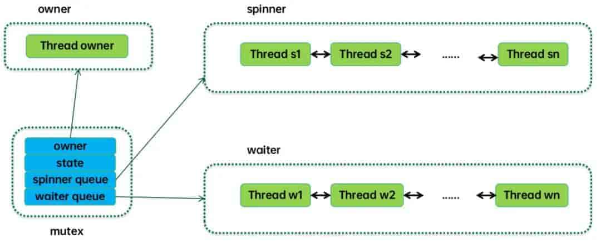

# Question

## 中断上下文用什么锁

自旋锁

## 死锁和饥饿问题

在使用同步机制时，需要注意避免死锁和饥饿问题。死锁是指两个或多个线程相互等待对方释放资源，导致所有线程都无法继续执行的情况。饥饿是指一个或多个线程长期无法获取所需的资源，导致无法继续执行的情况。

为了避免死锁，可以按照一定的顺序获取锁，或者使用超时机制来避免无限期等待。为了避免饥饿，可以使用公平的同步机制，或者使用优先级调度来确保每个线程都有机会获取资源。

## 常见的多线程同步机制

原子操作：互斥锁的实现依赖于CPU提供的原子操作（如 `Test-and-Set`、`Compare-and-Swap / CAS`）。这些指令能够在一个不可中断的步骤中完成读取、修改和写入内存的操作，从而保证了在多核环境下对锁状态的修改是安全的。

自旋锁：在某些情况下，如果预期锁的持有时间很短，线程可能会采用自旋的方式（即在一个循环中不断尝试获取锁，而不放弃CPU）来等待锁。自旋锁避免了上下文切换的开销，但如果锁的持有时间长，会浪费CPU周期。

内核态等待：当自旋等待一段时间后仍无法获取锁，或者锁的持有时间可能较长时，线程会放弃CPU，进入睡眠状态，并被放入等待队列。当锁被释放时，操作系统会唤醒等待队列中的一个线程。这涉及到用户态到内核态的切换。

## mutex阻塞，当获得资源后会唤醒任务，这是如何唤醒的？



（1）操作系统中断机制

当持有互斥锁的任务释放锁时，会触发操作系统的相关代码执行。这可能会产生一个中断信号，通知操作系统锁的状态已经改变。

操作系统接收到中断后，会暂停当前正在执行的任务（如果有必要），转而执行与互斥锁管理相关的代码。

（2）调度器的作用

操作系统的调度器会检查等待该互斥锁的任务队列。在这个队列中，记录了所有因为等待该互斥锁而被阻塞的任务。

调度器根据一定的调度算法，从等待队列中选择一个任务（通常是等待时间最长的任务，或者具有较高优先级的任务），将其状态从阻塞状态改为就绪状态。

（3）上下文切换

一旦任务被标记为就绪状态，调度器会进行上下文切换。它会保存当前任务的上下文信息（包括寄存器值、程序计数器等），并恢复被唤醒任务的上下文信息。

这样，被唤醒的任务就可以从上次暂停的地方继续执行，就好像它从未被阻塞过一样，从而实现了任务的唤醒。

## 假设一个函数有加锁或者读取锁资源的操作，递归的时候会不会遇到死锁的情况？

在递归函数中，如果涉及加锁或读取锁资源的操作，**是否会发生死锁取决于锁的类型和实现方式**。

### 使用不可重入锁（如普通互斥锁）会导致死锁

**原因**：不可重入锁（如`std::mutex`）不允许同一线程多次获取同一把锁。当递归函数在持有锁的情况下再次尝试加锁时，线程会因等待自己释放锁而陷入死锁。

```cpp
std::mutex mtx;
void recursive_func(int n) {
    mtx.lock();  // 第一次加锁成功
    if (n > 0) {
        recursive_func(n - 1);  // 递归调用时再次尝试加锁，导致死锁
    }
    mtx.unlock();
}
```

**结果**：线程因自阻塞而卡死，无法继续执行。

### 使用可重入锁（递归锁）可避免死锁

**原理**：递归锁（如`std::recursive_mutex`或Java的`ReentrantLock`）允许同一线程多次获取同一把锁，内部通过计数器记录加锁次数，只有计数器归零时锁才会释放。

```cpp
std::recursive_mutex rmtx;
void safe_recursive_func(int n) {
    std::lock_guard<std::recursive_mutex> lock(rmtx);  // 自动管理锁
    if (n > 0) {
        safe_recursive_func(n - 1);  // 递归调用不会死锁
    }
}
```

**结果**：线程可正常执行递归逻辑，锁在递归结束后完全释放。

### 中断上下文死锁

若中断处理程序与线程竞争同一自旋锁，可能因递归加锁导致死锁（自旋锁不可重入）。

解决方案：改用互斥锁或避免在中断中加锁。

### 总结

| **场景**             | **锁类型**             | **是否死锁** | **解决方案**                         |
| -------------------- | ---------------------- | ------------ | ------------------------------------ |
| 递归调用不可重入锁   | `std::mutex`           | 是           | 改用递归锁（`std::recursive_mutex`） |
| 递归调用可重入锁     | `std::recursive_mutex` | 否           | 确保锁的完全释放                     |
| 中断上下文竞争自旋锁 | 自旋锁                 | 是           | 改用互斥锁或避免中断加锁             |

## 如果一个进程想读取另外一个进程的锁具体怎么办

在多进程环境中，一个进程无法直接读取另一个进程持有的锁的状态（如互斥锁或读写锁），因为这些锁通常由操作系统内核管理，且进程间的内存空间是隔离的。但可以通过以下方法间接实现锁状态的检测或同步：

### 使用共享内存与标志变量

**原理**：在共享内存中创建一个标志变量（如布尔值或整数），用于表示锁的状态。多个进程通过访问该共享变量来间接判断锁的占用情况。

实现步骤：

1.  **创建共享内存**：通过`shmget`或`mmap`分配一块共享内存区域。
2.  **定义锁状态变量**：例如，`0`表示未锁定，`1`表示锁定。
3.  **原子操作**：使用原子指令（如`CAS`）或信号量确保对标志变量的修改是线程安全的。

### 文件锁（flock/fcntl）

**原理**：通过文件系统的锁机制（如`flock`或`fcntl`）实现跨进程锁状态检测。文件锁是操作系统提供的全局资源，所有进程可见。

实现步骤：

1.  **创建锁文件**：所有进程操作同一个文件（如`/tmp/lockfile`）。
2.  **尝试非阻塞加锁**：使用`flock(fd, LOCK_EX | LOCK_NB)`尝试获取排他锁，若失败则说明锁被其他进程持有。
3.  **释放锁**：通过`flock(fd, LOCK_UN)`释放锁。

示例：

```
int fd = open("/tmp/lockfile", O_RDWR);
if (flock(fd, LOCK_EX | LOCK_NB) == -1) {
    printf("锁已被其他进程占用\n");
} else {
    flock(fd, LOCK_UN);  // 释放锁
}
```

优势：跨平台支持（Linux/Windows），适用于独立进程间的同步。

### 推荐方案

-   常规场景：优先使用文件锁（flock），简单且跨平台。
-   高性能场景：共享内存结合原子操作，但需自行处理竞态条件。
-   复杂逻辑：信号量或消息队列提供更灵活的同步机制。

## 自旋锁和互斥锁区别，哪个更占用CPU？

### CPU占用对比

| **维度**            | **自旋锁**                | **互斥锁**                   |
| ------------------- | ------------------------- | ---------------------------- |
| **等待期间CPU占用** | 高（持续占用CPU循环检查） | 低（线程休眠，释放CPU）      |
| **上下文切换开销**  | 无（避免线程切换）        | 高（两次上下文切换）         |
| **适用场景**        | 锁持有时间极短（纳秒级）  | 锁持有时间较长（毫秒级以上） |

-   **自旋锁的CPU消耗**：若锁竞争激烈或持有时间较长，自旋锁会持续占用CPU，导致资源浪费（如100% CPU使用率）。例如，在单核CPU上，自旋锁可能完全无效，因为持有锁的线程无法被调度执行。
-   **互斥锁的CPU消耗**：虽然阻塞时释放CPU，但上下文切换（保存/恢复线程状态、刷新缓存等）会带来额外开销。若锁频繁争用，切换成本可能超过自旋锁的忙等待。

### 适用场景

**自旋锁**：

-   多核CPU环境，且锁持有时间极短（如计数器增减、缓存操作）。
-   中断上下文（不允许睡眠的场景）。

**互斥锁**：

-   锁持有时间较长（如文件I/O、复杂计算）。
-   单核CPU或高竞争场景（避免CPU空转）。

### 性能优化策略

-   **自旋锁优化**：
    -   自适应自旋：根据历史锁持有时间动态调整自旋次数（如JVM的适应性自旋）。
    -   混合锁：先自旋尝试，失败后转为阻塞（如Linux的mutex实现）。
-   **互斥锁优化**：
    -   减少临界区大小：缩短锁持有时间，降低竞争概率。
    -   读写锁分离：读多写少时用读写锁（RWMutex）提升并发性。

### 总结

**更占用CPU**：自旋锁在锁竞争或长时间持有时会持续消耗CPU；互斥锁的CPU占用低，但上下文切换开销大。

选择建议：

-   高频短时操作 → 自旋锁（如内核数据结构）。
-   低频长时操作 → 互斥锁（如数据库事务）。
-   现代系统常结合两者优势（如混合锁或自适应策略）。

## 二进制信号量和互斥锁等同吗？

二进制信号量和互斥锁虽然在某些场景下功能相似（如实现互斥访问），但它们在设计目的、行为特性和适用场景上存在本质区别，**不能完全等同**。

### 核心区别

| 特性           | 二进制信号量                          | 互斥锁（Mutex）                    |
| -------------- | ------------------------------------- | ---------------------------------- |
| **设计目的**   | 线程/任务间的同步（如事件通知）       | 保护临界区，实现互斥访问           |
| **所有权机制** | 无所有者概念，可由任意线程释放        | 必须由加锁线程解锁（严格所有权）   |
| **优先级继承** | 不支持                                | 支持（避免优先级反转问题）         |
| **初始值**     | 可设为0或1（如初始为0表示事件未触发） | 通常初始为1（表示资源可用）        |
| **递归锁定**   | 不支持                                | 部分实现支持（如递归互斥锁）       |
| **性能**       | 更轻量（操作简单）                    | 略高开销（需维护优先级继承等状态） |

### 关键差异详解

**同步 vs 互斥**

-   二进制信号量：本质是同步工具，用于协调线程执行顺序（如生产者-消费者模型）。例如，初始值为0的信号量可用于等待事件触发。
-   互斥锁：本质是互斥工具，确保临界区代码的独占访问。例如，保护共享变量的修改。

**所有权与释放灵活性**

-   二进制信号量的释放（sem_post）和获取（sem_wait）可由不同线程完成，适用于跨线程通知。
-   互斥锁必须由加锁线程解锁，否则导致未定义行为（如死锁）。

**优先级反转处理**

-   互斥锁通过优先级继承临时提升低优先级线程的优先级，避免高优先级线程长时间阻塞。
-   二进制信号量无此机制，可能在高实时性系统中引发性能问题。

### 适用场景

**使用二进制信号量的情况**

-   线程间事件通知（如中断唤醒任务）。
-   简单互斥场景（但需注意无优先级继承的风险）。
-   需要跨线程释放信号的协作模型（如生产者-消费者）。

**使用互斥锁的情况**

-   保护共享资源的原子性操作（如全局计数器）。
-   需要避免优先级反转的实时系统。
-   复杂临界区管理（如支持递归锁定）。

### 常见误区

误区1：二进制信号量是“简化版互斥锁”。

纠正：二者语义不同，信号量侧重同步，互斥锁侧重互斥。

误区2：信号量初始值为1即可完全替代互斥锁。

纠正：虽功能相似，但互斥锁的所有权和优先级继承机制更安全。

### 总结

二进制信号量和互斥锁在特定场景下可互换，但**不能等同**。选择时需考虑：

-   是否需要跨线程释放？ → 选信号量。
-   是否需要避免优先级反转？ → 选互斥锁。
-   是否需要轻量级同步？ → 选信号量。

## 如何保证 buffer 读和写的互斥

在多线程或进程环境中，保证 Buffer 读写互斥的关键在于合理选择同步机制，根据场景需求设计锁策略。

### 互斥锁（Mutex）

基本原理

-   通过锁机制强制同一时间仅允许一个线程访问 Buffer（无论是读或写）。
-   示例：使用 pthread_mutex_t 或 std::mutex 保护环形缓冲区的读写指针。

适用场景

-   读写操作频繁且临界区较短时（如简单的环形缓冲区）。
-   需要严格互斥的场景（如写操作必须独占 Buffer）。

实现示例

```c
pthread_mutex_t lock;
void write_buffer(char* data) {
    pthread_mutex_lock(&lock);
    // 写入数据到 Buffer
    pthread_mutex_unlock(&lock);
}
```

### 读写锁（Read-Write Lock）

基本原理

-   允许多个读线程并发访问，但写线程独占资源（读共享，写互斥）。
-   示例：ReentrantReadWriteLock 在 Java 中实现读多写少的缓存。

适用场景

-   读操作远多于写操作（如数据库缓冲池、配置表）。
-   需要提升读并发性能的场景。

实现示例

```c
ReentrantReadWriteLock rwLock = new ReentrantReadWriteLock();
void readBuffer() {
    rwLock.readLock().lock();
    // 读取 Buffer
    rwLock.readLock().unlock();
}
void writeBuffer() {
    rwLock.writeLock().lock();
    // 写入 Buffer
    rwLock.writeLock().unlock();
}
```

### 自旋锁（Spinlock）

基本原理

-   线程通过忙等待获取锁，适用于短临界区和高并发场景。
-   内核中常用 spin_lock_irqsave保护中断上下文的数据。

适用场景

-   中断上下文或非睡眠上下文的 Buffer 操作。
-   多核系统中锁竞争时间极短的场景。

注意事项

-   长时间持有自旋锁会导致 CPU 资源浪费，需配合中断禁用。

### 条件变量（Condition Variable）

基本原理

-   结合互斥锁实现线程间同步，当 Buffer 空/满时阻塞线程并唤醒等待者。
-   示例：生产者-消费者模型中的 wait() 和 notify()。

适用场景

-   需要动态协调读写速度的场景（如流数据处理）。

### 原子操作与无锁设计

基本原理

-   使用原子指令（如 CAS）实现无锁 Buffer，避免锁开销。
-   示例：atomic_compare_exchange更新环形缓冲区的指针。

适用场景

-   高性能场景（如高频交易系统）。
-   单生产者单消费者（SPSC）等特定模式。

缺点

-   实现复杂，需处理内存顺序和ABA问题。

### 分区锁（Partitioned Lock）

基本原理：将 Buffer 分片，每个分片独立加锁（如 PostgreSQL 的 BufMappingPartitionLock）。

适用场景：大规模 Buffer 需高并发访问（如数据库共享内存池）。

### 选型建议

| 机制         | 优点                 | 缺点               | 适用场景               |
| ------------ | -------------------- | ------------------ | ---------------------- |
| **互斥锁**   | 简单、严格互斥       | 读写均串行，性能低 | 简单 Buffer 或短临界区 |
| **读写锁**   | 读并发高             | 写操作阻塞所有读   | 读多写少的缓存         |
| **自旋锁**   | 无上下文切换，响应快 | CPU 忙等待         | 中断上下文或极短临界区 |
| **条件变量** | 动态协调读写速度     | 需配合互斥锁使用   | 生产者-消费者模型      |
| **无锁设计** | 高性能，无阻塞       | 实现复杂，受限场景 | 高性能单生产者单消费者 |

**综合建议**：

-   通用场景优先选择 **读写锁** 或 **互斥锁+条件变量**。
-   内核或实时系统考虑 自旋锁 或 无锁环形缓冲区。
-   分布式系统可参考 分区锁 设计。

