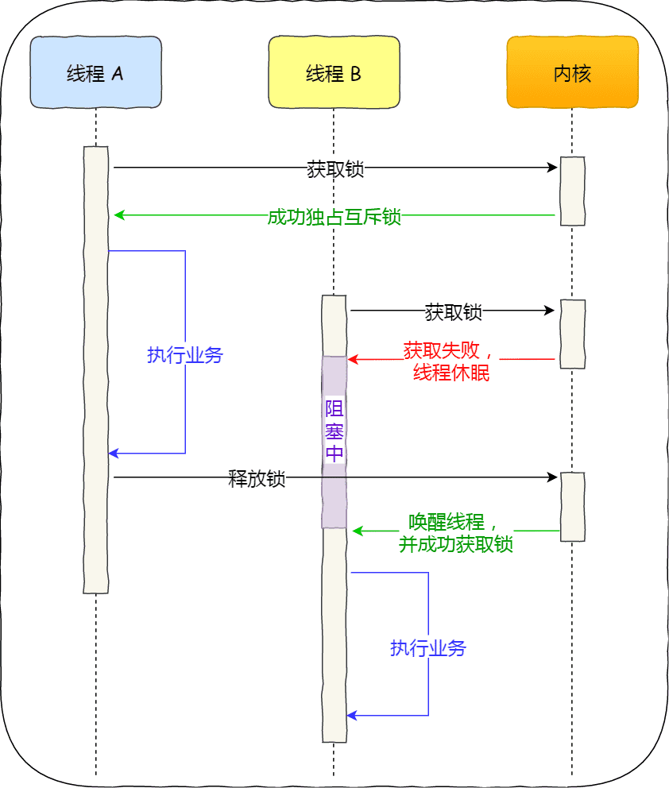
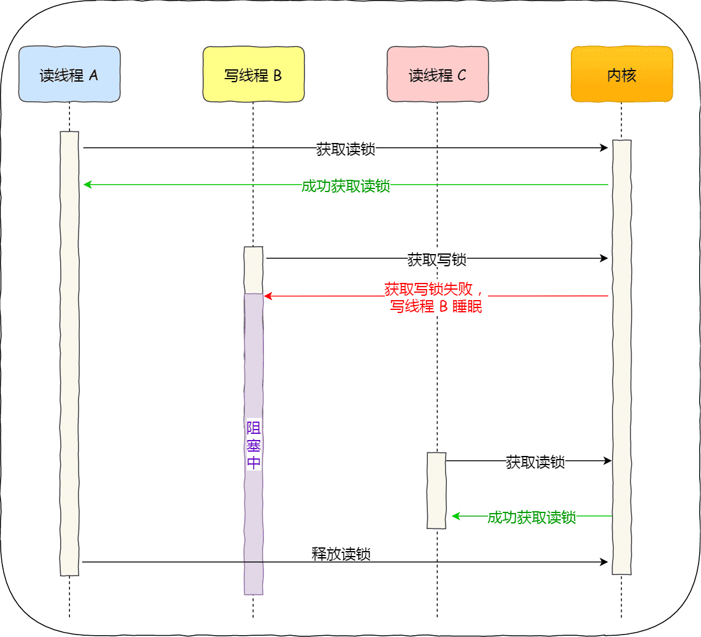
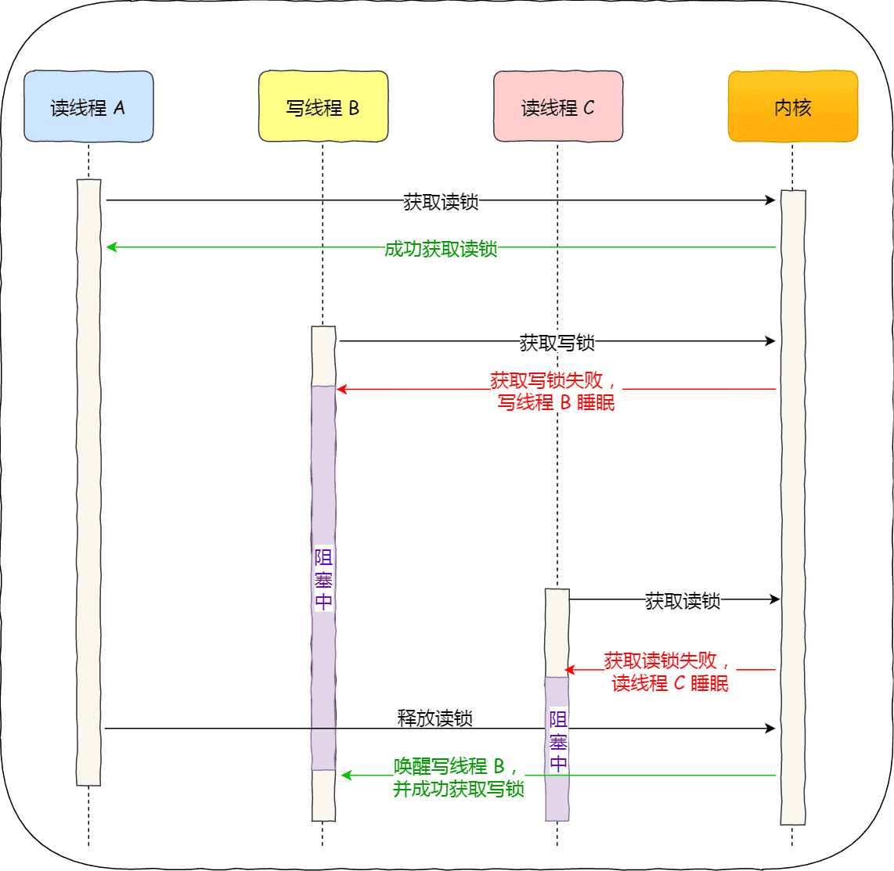

# 常见的锁

多线程访问共享资源的时候，避免不了资源竞争而导致数据错乱的问题，所以我们通常为了解决这一问题，都会在访问共享资源之前加锁。

最常用的就是互斥锁，当然还有很多种不同的锁，比如自旋锁、读写锁、乐观锁等，不同种类的锁自然适用于不同的场景。

如果选择了错误的锁，那么在一些高并发的场景下，可能会降低系统的性能，这样用户体验就会非常差了。

所以，为了选择合适的锁，我们不仅需要清楚知道加锁的成本开销有多大，还需要分析业务场景中访问的共享资源的方式，再来还要考虑并发访问共享资源时的冲突概率。

对症下药，才能减少锁对高并发性能的影响。

## 多线程里线程的同步方式有哪些

-   互斥锁（Mutex）：使用互斥锁可以保证在同一时间只有一个线程访问共享资源，其他线程需要等待释放锁后才能访问。这样可以避免多个线程同时修改共享资源导致数据不一致的问题。
-   条件变量（Condition Variable）：条件变量用于在线程之间进行等待和通知机制。通过条件变量，一个线程可以等待某个条件满足，而另一个线程在满足条件时发送信号通知等待的线程继续执行。
-   信号量（Semaphore）：信号量是一个计数器，用来控制对共享资源的访问。它可以实现多个线程对同一资源的有序访问。
-   屏障（Barrier）：屏障用于将多个线程分为若干阶段进行并发执行，并在每个阶段结束后使所有线程都停止，直到所有线程都完成当前阶段后再继续执行下一个阶段。
-   原子操作（Atomic Operations）：原子操作是指不可中断的操作，在多线程环境下能够确保操作的完整性。例如原子整型变量或原子指令集可用于保证对共享数据的原子性访问。

## 互斥锁与自旋锁

最底层的两种就是会「互斥锁和自旋锁」，有很多高级的锁都是基于它们实现的，你可以认为它们是各种锁的基础，所以我们必须清楚它俩之间的区别和应用。

当已经有一个线程加锁后，其他线程加锁则就会失败，互斥锁和自旋锁对于加锁失败后的处理方式是不一样的：

- **互斥锁**加锁失败后，线程会**释放 CPU**，给其他线程；
- **自旋锁**加锁失败后，线程会**忙等待**，直到它拿到锁；

互斥锁是一种「独占锁」，比如当线程 A 加锁成功后，此时互斥锁已经被线程 A 独占了，只要线程 A 没有释放手中的锁，线程 B 加锁就会失败，于是就会释放 CPU 让给其他线程，**既然线程 B 释放掉了 CPU，自然线程 B 加锁的代码就会被阻塞**。

**对于互斥锁加锁失败而阻塞的现象，是由操作系统内核实现的**。当加锁失败时，内核会将线程置为「睡眠」状态，等到锁被释放后，内核会在合适的时机唤醒线程，当这个线程成功获取到锁后，于是就可以继续执行。如下图：



所以，互斥锁加锁失败时，会从用户态陷入到内核态，让内核帮我们切换线程，虽然简化了使用锁的难度，但是存在一定的性能开销成本。

那这个开销成本是什么呢？会有**两次线程上下文切换的成本**：

- 当线程加锁失败时，内核会把线程的状态从「运行」状态设置为「睡眠」状态，然后把 CPU 切换给其他线程运行；
- 接着，当锁被释放时，之前「睡眠」状态的线程会变为「就绪」状态，然后内核会在合适的时间，把 CPU 切换给该线程运行。

线程的上下文切换的是什么？当两个线程是属于同一个进程，**因为虚拟内存是共享的，所以在切换时，虚拟内存这些资源就保持不动，只需要切换线程的私有数据、寄存器等不共享的数据。**

上下文切换的耗时有人统计过，大概在几十纳秒到几微秒之间，如果你锁住的代码执行时间比较短，那可能上下文切换的时间都比你锁住的代码执行时间还要长。

所以，**如果你能确定被锁住的代码执行时间很短，就不应该用互斥锁，而应该选用自旋锁，否则使用互斥锁。**

自旋锁是通过 CPU 提供的 `CAS` 函数（Compare And Swap），在「用户态」完成加锁和解锁操作，不会主动产生线程上下文切换，所以相比互斥锁来说，会快一些，开销也小一些。

自旋锁特点：

-   禁止睡眠：持有自旋锁时不能调用可能阻塞的函数（如kmalloc）。
-   多核优化：现代内核使用票据锁（Ticket Lock）或MCS锁避免线程饥饿。

一般加锁的过程，包含两个步骤：

- 第一步，查看锁的状态，如果锁是空闲的，则执行第二步；
- 第二步，将锁设置为当前线程持有；

CAS 函数就把这两个步骤合并成一条硬件级指令，形成**原子指令**，这样就保证了这两个步骤是不可分割的，要么一次性执行完两个步骤，要么两个步骤都不执行。

比如，设锁为变量 lock，整数 0 表示锁是空闲状态，整数 pid 表示线程 ID，那么 CAS(lock, 0, pid) 就表示自旋锁的加锁操作，CAS(lock, pid, 0) 则表示解锁操作。

使用自旋锁的时候，当发生多线程竞争锁的情况，加锁失败的线程会「忙等待」，直到它拿到锁。这里的「忙等待」可以用 `while` 循环等待实现，不过最好是使用 CPU 提供的 `PAUSE` 指令来实现「忙等待」，因为可以减少循环等待时的耗电量。

自旋锁是最简单的一种锁，一直自旋，利用 CPU 周期，直到锁可用。需要注意，在单核 CPU 上，需要**抢占式的调度器**（即不断通过时钟中断一个线程，运行其他线程）。否则，**自旋锁在单 CPU 上无法使用，因为一个自旋的线程永远不会放弃 CPU**。

>   自旋锁可适用于中断上下文

自旋锁开销少，在多核系统下一般不会主动产生线程切换，适合异步、协程等在用户态切换请求的编程方式，但如果被锁住的代码执行时间过长，自旋的线程会长时间占用 CPU 资源，所以自旋的时间和被锁住的代码执行的时间是成「正比」的关系，我们需要清楚的知道这一点。

自旋锁与互斥锁使用层面比较相似，但实现层面上完全不同：**当加锁失败时，互斥锁用「线程切换」来应对，自旋锁则用「忙等待」来应对**。

它俩是锁的最基本处理方式，更高级的锁都会选择其中一个来实现，比如读写锁既可以选择互斥锁实现，也可以基于自旋锁实现。

### 互斥锁的工作原理

互斥锁的工作原理基于操作系统提供的原子操作和线程调度机制。当一个线程执行到需要访问共享资源的代码段时，它会调用互斥锁的加锁函数（如std::mutex的lock方法）。此时，互斥锁会检查自身的状态，如果当前处于未锁定状态，它会将自己标记为已锁定，并允许该线程进入临界区访问共享资源。这个标记过程是通过原子操作实现的，确保在多线程环境下不会出现竞争条件。例如，在一个多线程的文件读写操作中，当一个线程获取到互斥锁后，就可以安全地对文件进行写入，避免其他线程同时写入导致文件内容混乱。

如果互斥锁已经被其他线程锁定，那么调用加锁函数的线程会被操作系统挂起，放入等待队列中，进入阻塞状态。此时，该线程会让出 CPU 资源，以便其他线程能够继续执行，避免了无效的 CPU 占用。

当持有锁的线程完成对共享资源的访问后，它会调用互斥锁的解锁函数（如std::mutex的unlock方法） 。解锁操作会将互斥锁的状态标记为未锁定，并从等待队列中唤醒一个等待的线程（如果有线程在等待）。被唤醒的线程会重新竞争 CPU 资源，当它获得 CPU 时间片后，会再次尝试获取互斥锁。一旦获取成功，就可以进入临界区访问共享资源。例如，在一个多线程的数据库操作中，当一个线程完成对数据库的更新操作并释放互斥锁后，等待队列中的另一个线程就有机会获取锁，进行查询或其他操作。

## 读写锁

读写锁由「读锁」和「写锁」两部分构成，如果只读取共享资源用「读锁」加锁，如果要修改共享资源则用「写锁」加锁。

所以，**读写锁适用于能明确区分读操作和写操作的场景**。

读写锁的工作原理是：

- 当「写锁」没有被线程持有时，多个线程能够并发地持有读锁，这大大提高了共享资源的访问效率，因为「读锁」是用于读取共享资源的场景，所以多个线程同时持有读锁也不会破坏共享资源的数据。
- 但是，一旦「写锁」被线程持有后，读线程的获取读锁的操作会被阻塞，而且其他写线程的获取写锁的操作也会被阻塞。

所以说，写锁是独占锁，因为任何时刻只能有一个线程持有写锁，类似互斥锁和自旋锁，而读锁是共享锁，因为读锁可以被多个线程同时持有。

知道了读写锁的工作原理后，我们可以发现，**读写锁在读多写少的场景，能发挥出优势**。

另外，根据实现的不同，读写锁可以分为「读优先锁」和「写优先锁」。

读优先锁期望的是，读锁能被更多的线程持有，以便提高读线程的并发性，它的工作方式是：当读线程 A 先持有了读锁，写线程 B 在获取写锁的时候，会被阻塞，并且在阻塞过程中，后续来的读线程 C 仍然可以成功获取读锁，最后直到读线程 A 和 C 释放读锁后，写线程 B 才可以成功获取写锁。如下图：



而「写优先锁」是优先服务写线程，其工作方式是：当读线程 A 先持有了读锁，写线程 B 在获取写锁的时候，会被阻塞，并且在阻塞过程中，后续来的读线程 C 获取读锁时会失败，于是读线程 C 将被阻塞在获取读锁的操作，这样只要读线程 A 释放读锁后，写线程 B 就可以成功获取写锁。如下图：



读优先锁对于读线程并发性更好，但也不是没有问题。我们试想一下，如果一直有读线程获取读锁，那么写线程将永远获取不到写锁，这就造成了写线程「饥饿」的现象。

写优先锁可以保证写线程不会饿死，但是如果一直有写线程获取写锁，读线程也会被「饿死」。

既然不管优先读锁还是写锁，对方可能会出现饿死问题，那么我们就不偏袒任何一方，搞个**「公平读写锁」**。

**公平读写锁**比较简单的一种方式是：用队列把获取锁的线程排队，不管是写线程还是读线程都按照先进先出的原则加锁即可，这样读线程仍然可以并发，也不会出现「饥饿」的现象。

互斥锁和自旋锁都是最基本的锁，读写锁可以根据场景来选择这两种锁其中的一个进行实现。

## RCU（Read-Copy-Update）

原理：读操作无锁访问，写操作通过复制-更新-替换旧数据的方式实现同步，延迟释放旧数据。

优势：读性能极高，适合读多写少的场景（如路由表、内核链表）。

**限制**：写操作开销大，需处理内存回收问题。

## 中断屏蔽（Interrupt Disabling）

原理：通过关闭本地CPU中断来避免竞态，适用于单处理器环境。

风险：长时间屏蔽中断可能导致数据丢失或系统崩溃。

接口：

```
local_irq_disable();  // 屏蔽中断
local_irq_enable();    // 恢复中断
```

## 总结

开发过程中，最常见的就是互斥锁的了，互斥锁加锁失败时，会用「线程切换」来应对，当加锁失败的线程再次加锁成功后的这一过程，会有两次线程上下文切换的成本，性能损耗比较大。

如果我们明确知道被锁住的代码的执行时间很短，那我们应该选择开销比较小的自旋锁，因为自旋锁加锁失败时，并不会主动产生线程切换，而是一直忙等待，直到获取到锁，那么如果被锁住的代码执行时间很短，那这个忙等待的时间相对应也很短。

如果能区分读操作和写操作的场景，那读写锁就更合适了，它允许多个读线程可以同时持有读锁，提高了读的并发性。根据偏袒读方还是写方，可以分为读优先锁和写优先锁，读优先锁并发性很强，但是写线程会被饿死，而写优先锁会优先服务写线程，读线程也可能会被饿死，那为了避免饥饿的问题，于是就有了公平读写锁，它是用队列把请求锁的线程排队，并保证先入先出的原则来对线程加锁，这样便保证了某种线程不会被饿死，通用性也更好点。

互斥锁和自旋锁都是最基本的锁，读写锁可以根据场景来选择这两种锁其中的一个进行实现。

不管使用的哪种锁，我们的加锁的代码范围应该尽可能的小，也就是加锁的粒度要小，这样执行速度会比较快。再来，使用上了合适的锁，就会快上加快了。
