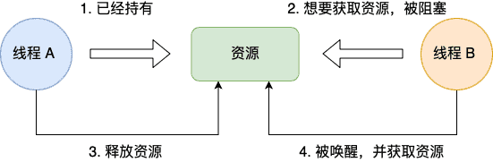
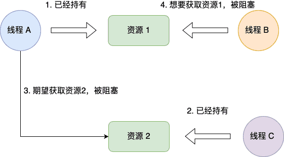
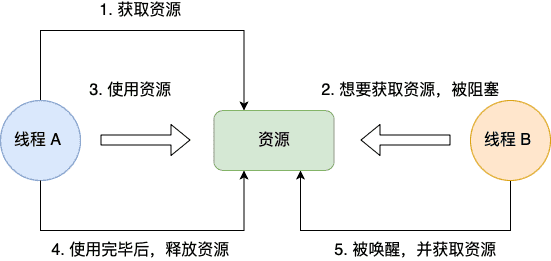
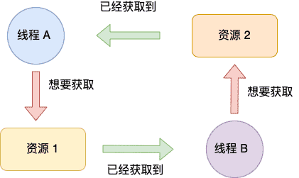
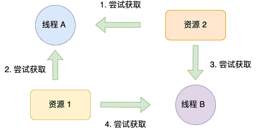

# 怎么避免死锁？

## 死锁的概念

在多线程编程中，我们为了防止多线程竞争共享资源而导致数据错乱，都会在操作共享资源之前加上互斥锁，只有成功获得到锁的线程，才能操作共享资源，获取不到锁的线程就只能等待，直到锁被释放。

那么，当两个线程为了保护两个不同的共享资源而使用了两个互斥锁，那么这两个互斥锁应用不当的时候，可能会造成**两个线程都在等待对方释放锁**，在没有外力的作用下，这些线程会一直相互等待，就没办法继续运行，这种情况就是发生了**死锁**。

死锁只有**同时满足**以下四个条件才会发生：

- 互斥条件：某种资源一次只允许一个进程访问，即该资源一旦分配给某个进程，其他进程就不能再访问，直到该进程访问结束。
- 持有并等待条件：一个进程本身占有资源（一种或多种），同时还有资源未得到满足，正在等待其他进程释放该资源。
- 不可剥夺条件：别人已经占有了某项资源，你不能因为自己也需要该资源，就去把别人的资源抢过来。
- 环路等待条件：存在一个进程链，使得每个进程都占有下一个进程所需的至少一种资源。

当以上四个条件均满足，必然会造成死锁，发生死锁的进程无法进行下去，它们所持有的资源也无法释放。这样会导致CPU的吞吐量下降。所以死锁情况是会浪费系统资源和影响计算机的使用性能的。那么，解决死锁问题就是相当有必要的了。

举个例子，小林拿了小美房间的钥匙，而小林在自己的房间里，小美拿了小林房间的钥匙，而小美也在自己的房间里。如果小林要从自己的房间里出去，必须拿到小美手中的钥匙，但是小美要出去，又必须拿到小林手中的钥匙，这就形成了死锁。

### 互斥条件

互斥条件是指**多个线程不能同时使用同一个资源**。

比如下图，如果线程 A 已经持有的资源，不能再同时被线程 B 持有，如果线程 B 请求获取线程 A 已经占用的资源，那线程 B 只能等待，直到线程 A 释放了资源。



### 持有并等待条件

持有并等待条件是指，当线程 A 已经持有了资源 1，又想申请资源 2，而资源 2 已经被线程 C 持有了，所以线程  A 就会处于等待状态，但是**线程  A 在等待资源 2 的同时并不会释放自己已经持有的资源 1**。



### 不可剥夺条件

>   系统中的资源可以分为两类：
>
>   -   可剥夺资源，是指某进程在获得这类资源后，该资源可以再被其他进程或系统剥夺，CPU和主存均属于可剥夺性资源；
>   -   另一类资源是不可剥夺资源，当系统把这类资源分配给某进程后，再不能强行收回，只能在进程用完后自行释放，如磁带机、打印机等。
>
>   产生死锁中的竞争资源之一指的是竞争不可剥夺资源（例如：系统中只有一台打印机，可供进程P1使用，假定P1已占用了打印机，若P2继续要求打印机打印将阻塞）
>
>   产生死锁中的竞争资源另外一种资源指的是竞争临时资源（临时资源包括硬件中断、信号、消息、缓冲区内的消息等），通常消息通信顺序进行不当，则会产生死锁

不可剥夺条件是指，当线程已经持有了资源，**在自己使用完之前不能被其他线程获取**，线程 B 如果也想使用此资源，则只能在线程 A 使用完并释放后才能获取。



### 环路等待条件

环路等待条件指的是，在死锁发生的时候，**两个线程获取资源的顺序构成了环形链**。

比如，线程 A 已经持有资源 2，而想请求资源 1，线程 B 已经获取了资源 1，而想请求资源 2，这就形成资源请求等待的环形图。



## 探寻死锁根源

死锁的产生并非毫无缘由，它往往是由多种因素共同作用导致的。在多线程编程中，了解死锁产生的原因，就如同找到了破解死锁谜题的钥匙，能够帮助我们更好地预防和排查死锁问题。接下来，让我们深入剖析死锁产生的常见原因，并结合具体的代码示例进行详细解释。

### 加锁顺序不当

当多个线程需要获取多个锁时，如果它们获取锁的顺序不一致，就如同两条交叉的轨道，很容易导致死锁的发生。假设现在有两个线程thread1和thread2，它们都需要获取锁mutex1和mutex2。thread1先获取mutex1，然后尝试获取mutex2；而thread2先获取mutex2，然后尝试获取mutex1。当thread1获取了mutex1之后，thread2获取了mutex2，此时两个线程就会像陷入了一个无法解开的死结，互相等待对方释放自己需要的锁，从而陷入死锁。

以下是具体的代码示例：

```c++
#include <iostream>
#include <thread>
#include <mutex>

std::mutex mutex1;
std::mutex mutex2;

void thread1Function() {
    mutex1.lock();
    std::cout << "Thread 1: Acquired mutex1" << std::endl;
    std::this_thread::sleep_for(std::chrono::seconds(1));
    mutex2.lock();
    std::cout << "Thread 1: Acquired mutex2" << std::endl;
    mutex2.unlock();
    mutex1.unlock();
}

void thread2Function() {
    mutex2.lock();
    std::cout << "Thread 2: Acquired mutex2" << std::endl;
    std::this_thread::sleep_for(std::chrono::seconds(1));
    mutex1.lock();
    std::cout << "Thread 2: Acquired mutex1" << std::endl;
    mutex1.unlock();
    mutex2.unlock();
}

int main() {
    std::thread thread1(thread1Function);
    std::thread thread2(thread2Function);

    thread1.join();
    thread2.join();

    return 0;
}
```

在这段代码中，thread1Function和thread2Function函数中获取锁的顺序不同，这就像是埋下了一颗定时炸弹，为死锁的发生创造了条件。当两个线程同时运行时，只要它们获取锁的顺序出现不一致，就极有可能出现死锁的情况。

### 重复加锁

如果一个线程在已经持有某个锁的情况下，再次尝试获取该锁，而这个锁又不支持重入（即同一个线程多次获取同一把锁），那么就如同自己给自己设置了障碍，必然会导致死锁。例如，在 C++ 中使用std::mutex时，如果一个线程在已经锁定了std::mutex的情况下，再次调用lock方法，就会陷入死锁的困境。因为它无法再次获取已经持有的锁，而其他线程也无法获取该锁，就像一条被堵住的通道，所有线程都无法继续前进，从而导致整个程序陷入停滞。

以下是一个展示重复加锁引发死锁的代码示例：

```c++
#include <iostream>
#include <thread>
#include <mutex>

std::mutex myMutex;

void recursiveFunction(int count) {
    myMutex.lock();
    std::cout << "Entering recursiveFunction, count: " << count << std::endl;
    if (count > 0) {
        recursiveFunction(count - 1);
    }
    myMutex.unlock();
    std::cout << "Exiting recursiveFunction, count: " << count << std::endl;
}

int main() {
    std::thread myThread(recursiveFunction, 3);
    myThread.join();
    return 0;
}
```

在这个例子中，recursiveFunction函数是递归的，每次调用都会尝试获取myMutex锁。当递归调用时，由于myMutex不支持重入，第二次获取锁时就会被阻塞，导致死锁的发生。就好像一个人走进了一个只有一个入口的迷宫，并且每次进入都把入口堵住，自己出不来，别人也进不去。

### 加锁后未解锁

线程获取锁后，正常情况下应该在使用完资源后及时解锁，以便其他线程能够获取锁并访问资源。然而，如果线程获取锁后，由于异常或逻辑错误未能释放锁，就如同一个人占用了公共资源却不归还，其他线程将无法获取该锁，最终导致死锁的发生。

下面是一个线程获取锁后因异常未解锁导致死锁的代码示例：

```c++
#include <iostream>
#include <thread>
#include <mutex>

std::mutex mutex;

void someFunction() {
    mutex.lock();
    std::cout << "Locked the mutex" << std::endl;
    throw std::runtime_error("Something went wrong");
    mutex.unlock();
    std::cout << "Unlocked the mutex" << std::endl;
}

int main() {
    std::thread thread(someFunction);
    thread.join();
    return 0;
}
```

在这段代码中，someFunction函数在获取锁后，抛出了一个异常。由于异常的抛出，导致mutex.unlock()语句没有被执行，锁没有被释放。这样一来，其他线程如果尝试获取这个锁，就会一直等待，从而引发死锁。这就好比一个人借了别人的东西，却因为突发状况忘记归还，使得其他人无法使用这个东西，造成了资源的浪费和程序的错误运行。

### 优先级翻转

在非实时操作系统中，当进行了线程优先级划分时，就可能出现优先级翻转的情况，进而导致死锁。具体来说，低优先级的线程可能会持有高优先级线程所需要的锁，由于非实时操作系统不能保证所有线程在一定时间段内一定会被调用，低优先级线程可能长时间得不到调度，无法执行释放锁的代码，高优先级线程就会因为等待低优先级线程释放锁而被阻塞。如果此时高优先级线程还持有了低优先级线程需要的锁，那么就一定会导致死锁。

假设有三个线程：高优先级线程 H、中优先级线程 M 和低优先级线程 L，并且线程 H 和线程 L 共享一个资源，通过一个互斥锁来保护。当线程 L 获取了锁并开始执行，此时线程 H 被唤醒，由于其优先级高，抢占了线程 L 的执行权。但线程 H 需要线程 L 持有的锁才能继续执行，所以线程 H 进入等待状态。之后，线程 M 被唤醒并开始执行，由于线程 L 的优先级低于线程 M，线程 L 无法获得 CPU 执行权，也就无法释放锁，线程 H 就会一直等待。如果线程 H 在等待过程中，又获取了线程 L 需要的另一个锁，而线程 L 在之后尝试获取这个锁时，就会因为线程 H 持有该锁而等待，这样就形成了死锁，线程 H 和线程 L 都无法继续执行 。

## 代码中如何避免死锁

### 使用相同顺序获取锁

为了避免因资源申请顺序不一致导致的死锁，我们可以让所有线程按照相同的顺序获取锁。比如，在前面提到的多线程多锁的场景中，如果线程 A 和线程 B 都先获取 mutex1，再获取 mutex2，就不会出现死锁的情况。这种方法就像是制定了一个交通规则，所有车辆都按照统一的顺序行驶，就不会出现堵塞。

### 避免嵌套锁，使用递归锁

尽量避免在一个线程中请求多个锁，减少嵌套锁的使用。如果确实需要使用嵌套锁，应该使用递归锁。

### 引入锁的等级制度

我们可以对锁进行等级划分，规定线程在持有低等级锁时，不能获取高等级的锁。这样可以避免线程之间形成循环等待的情况，从而预防死锁的发生。例如，将锁分为一级锁、二级锁和三级锁，线程在获取二级锁之前，必须先释放所有一级锁；获取三级锁之前，必须先释放所有一级锁和二级锁。通过这种方式，可以有效地打破死锁产生的循环等待条件。

### 超时机制

在获取锁时设置超时时间，如果在规定时间内无法获取锁，则放弃并进行其他处理。这样可以避免线程无限等待，减少死锁的可能性。

## 死锁的处理方式有哪些？

答：死锁的处理方式主要从预防死锁、避免死锁、检测与解除死锁这四个方面来进行处理。

### 预防死锁

避免死锁问题（不允许死锁发生，属于静态策略）就只需要破环**四个必要条件**其中一个条件就可以，大多数场景下，互斥条件和不可剥夺条件是无法破坏的。

最常见的并且可行的就是**使用资源有序分配法，来破环循环等待条件**；或者**使用定时锁来打破持有并等待条件**。

1.  资源一次性分配：（破坏请求和保持条件）
2.  可剥夺资源：即当某进程新的资源未满足时，释放已占有的资源（破坏不可剥夺条件）
3.  资源有序分配法：系统给每类资源赋予一个编号，每一个进程按编号递增的顺序请求资源，释放则相反（破坏环路等待条件）

#### 资源有序分配法

那什么是资源有序分配法呢？

线程 A 和 线程 B 获取资源的顺序要一样，当线程 A 是先尝试获取资源 A，然后尝试获取资源 B 的时候，线程 B 同样也是先尝试获取资源 A，然后尝试获取资源 B。也就是说，线程 A 和 线程 B 总是以相同的顺序申请自己想要的资源。

我们使用资源有序分配法的方式来修改前面发生死锁的代码，我们可以不改动线程 A 的代码。

我们先要清楚线程 A 获取资源的顺序，它是先获取互斥锁 A，然后获取互斥锁 B。

所以我们只需将线程 B 改成以相同顺序的获取资源，就可以打破死锁了。



#### 定时锁

线程在加锁时可指定 timeout 参数，该参数指定超过 timeout 秒后会自动释放锁定的资源，这样就可以解开死锁了。

### 避免死锁

**避免**（==不允许死锁发生，属于动态策略==）是一种依靠算法机制来实现的死锁预防机制，它主要是针对那些不可能实现按序加锁，也不能使用定时锁的场景的。

预防死锁的几种策略，会严重地损害系统性能。因此在避免死锁时，要施加较弱的限制，从而获得较满意的系统性能。由于在避免死锁的策略中，允许进程动态地申请资源。因而，系统在进行资源分配之前预先计算资源分配的安全性。若此次分配不会导致系统进入不安全状态，则将资源分配给进程；否则，进程等待。其中最具有代表性的避免死锁算法是银行家算法。

银行家算法的核心思想就是：在进程提出资源申请时，先预判此次分配是否会导致系统进入不安全状态。如果会进入不安全状态，就暂时不答应这次请求，让该进程先阻塞等待。

### 检测死锁

-   首先为每个进程和每个资源指定一个唯一的号码；
-   然后建立资源分配表和进程等待表

### 解除死锁

当发现有进程死锁后，便应立即把它从死锁状态中解脱出来，常采用的方法有：

1.  剥夺资源：从其它进程剥夺足够数量的资源给死锁进程，以解除死锁状态；
2.  撤消进程：可以直接撤消死锁进程或撤消代价最小的进程，直至有足够的资源可用，死锁状态消除为止；所谓代价是指优先级、运行代价、进程的重要性和价值等。

## 总结

简单来说，死锁问题的产生是由两个或者以上线程并行执行的时候，争夺资源而互相等待造成的。

死锁只有同时满足互斥、持有并等待、不可剥夺、环路等待这四个条件的时候才会发生。

所以要避免死锁问题，就是要破坏其中一个条件即可，最常用的方法就是使用资源有序分配法来破坏环路等待条件。
