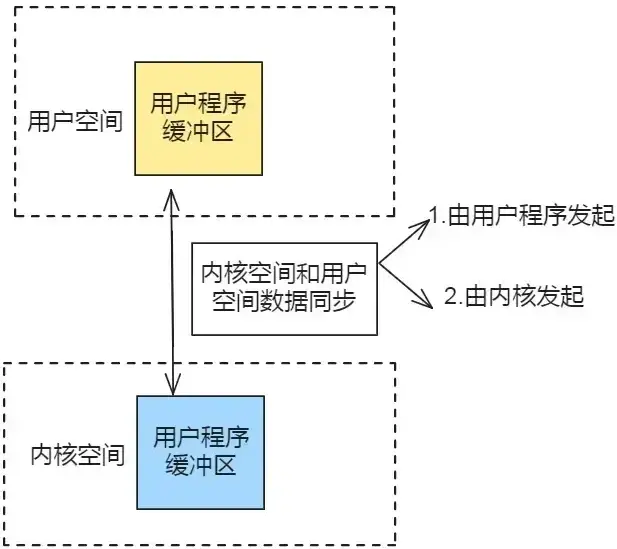
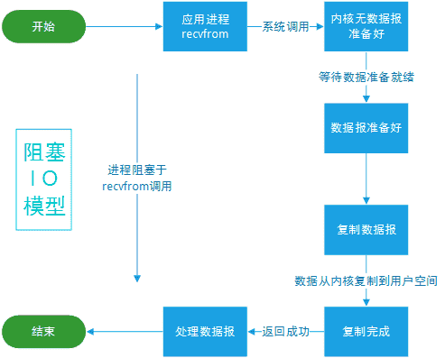
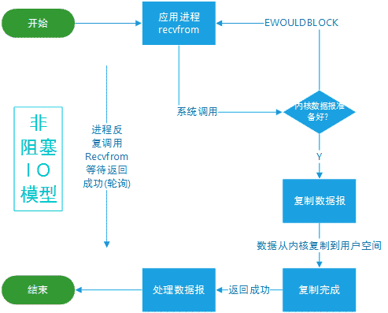
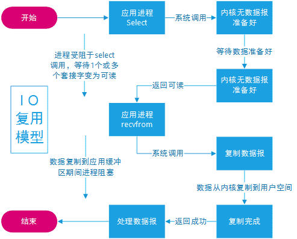
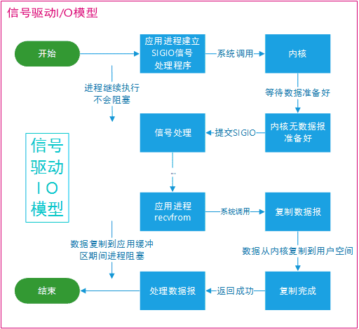
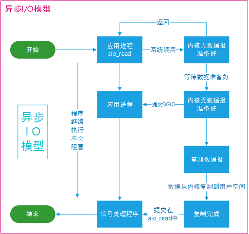
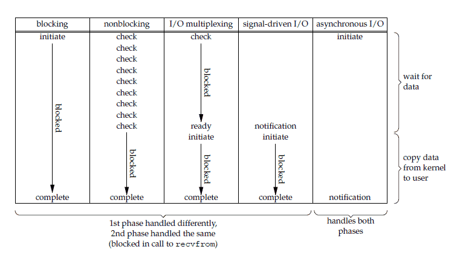

# Unix IO模型

## 概述

同步与异步

- 同步：同步就是发起一个调用后，被调用者未处理完请求之前，调用不返回。此时需要调用者询问处理结果
- 异步：异步就是发起一个调用后，立刻得到被调用者的回应表示已接收到请求，但是被调用者并没有返回结果，此时调用者来询问处理结果，被调用者通常依靠事件、回调等机制来通知调用者其返回结果。

同步和异步最大的区别在于在异步中调用者不需要等待处理结果，被调用者会通过回调等机制来通知调用者其返回结果。

阻塞和非阻塞这两个概念是程序级别的。

- 阻塞：阻塞就是发起一个请求，调用者一直等待请求结果返回，也就是当前线程会被挂起，无法从事其他任务，只有当条件就绪才能继续。
- 非阻塞：非阻塞调用指在不能立刻得到结果之前，该调用不会阻塞当前线程。

举个例子，理解下同步、阻塞、异步、非阻塞的区别：同步就是烧开水，要自己来看开没开；异步就是水开了，然后水壶响了通知你水开了（回调通知）。阻塞是烧开水的过程中，你不能干其他事情，必须在旁边等着；非阻塞是烧开水的过程里可以干其他事情。

从以上概念也可以看出，不会存在异步非阻塞的场景

## IO模型分析方法

IO模型是指计算机程序与外部设备之间进行数据输入输出操作的方式和机制，描述了程序如何与外部设备进行通信、数据传输和处理的方法。

**分析IO模型需要了解2个问题：**

问题1：发送IO请求，IO请求可以理解为用户空间和内核空间数据同步，根据发起者不同分为以下两种情况：

-   由用户程序发起（同步IO）。
-   由内核发起（异步IO）。

问题2：等待数据到来，等待数据到来的方式有以下几种：

-   阻塞（阻塞IO）。
-   轮询（非阻塞IO）。
-   信号通知（信号驱动IO）。



内核空间和用户空间数据同步由谁发起是分析Linux IO模型最核心问题

## Unix IO 模型简介

一个输入操作通常包括两个阶段：

- 等待数据准备好
- 从内核向进程复制数据

对于一个套接字上的输入操作，第一步通常涉及等待数据从网络中到达。当所等待分组到达时，它被复制到内核中的某个缓冲区。第二步就是把数据从内核缓冲区复制到应用进程缓冲区。

Unix 下有五种 I/O 模型：

-   阻塞式 I/O（Blocking IO）：在执行一个IO操作时，如果数据没有准备好，程序会一直等待，直到数据准备就绪才会返回结果。这种模型下，应用程序需要等待数据传输完成，期间无法进行其他任务。

-   非阻塞式 I/O（Non-blocking IO）：在执行一个IO操作时，如果数据没有准备好，程序不会等待而是立即返回。通过不断轮询来检查是否有数据准备好，然后再进行读写操作。这样可以避免长时间的阻塞等待，但仍然需要主动检查状态。

-   多路复用I/O （Multiplexing IO）：使用select、poll或epoll等系统调用，在一个线程中同时监听多个文件描述符（sockets），当任意一个文件描述符有就绪事件发生时，再去进行相应的读写操作。这样可以同时处理多个连接，并且避免了频繁地轮询。

-   异步 I/O（Asynchronous IO）：在执行一个IO操作时，程序发起请求后就可以继续做其他事情，并且在IO操作完成后，系统会通知应用程序进行数据处理。这种模型下，IO的读写操作和结果处理是分离的，应用程序无需等待IO操作完成。

### 阻塞式 I/O

应用进程被阻塞，直到数据复制到应用进程缓冲区中才返回。

应该注意到，在阻塞的过程中，其它程序还可以执行，因此阻塞不意味着整个操作系统都被阻塞。因为其他程序还可以执行，因此不消耗 CPU 时间，这种模型的执行效率会比较高。

下图中，recvfrom 用于接收 Socket 传来的数据，并复制到应用进程的缓冲区 buf 中。这里把 recvfrom() 当成系统调用。

```c
ssize_t recvfrom(int sockfd, void *buf, size_t len, int flags, struct sockaddr *src_addr, socklen_t *addrlen);
```



### 非阻塞式 I/O

应用进程执行系统调用之后，内核返回一个错误码。应用进程可以继续执行，但是需要不断的执行系统调用来获知 I/O 是否完成，这种方式称为轮询(polling)。

由于 CPU 要处理更多的系统调用，因此这种模型是比较低效的。



### I/O 复用

使用 select 或者 poll 等待数据，并且可以等待多个套接字中的任何一个变为可读，这一过程会被阻塞，当某一个套接字可读时返回。之后再使用 recvfrom 把数据从内核复制到进程中。

它可以让单个进程具有处理多个 I/O 事件的能力。又被称为 Event Driven I/O，即事件驱动 I/O。

如果一个 Web 服务器没有 I/O 复用，那么每一个 Socket 连接都需要创建一个线程去处理。如果同时有几万个连接，那么就需要创建相同数量的线程。并且相比于多进程和多线程技术，I/O 复用不需要进程线程创建和切换的开销，系统开销更小。



### 信号驱动 I/O

应用进程使用 sigaction 系统调用，内核立即返回，应用进程可以继续执行，也就是说等待数据阶段应用进程是非阻塞的。内核在数据到达时向应用进程发送 SIGIO 信号，应用进程收到之后在信号处理程序中调用 recvfrom 将数据从内核复制到应用进程中。

相比于非阻塞式 I/O 的轮询方式，信号驱动 I/O 的 CPU 利用率更高。



### 异步 I/O

进行 aio_read 系统调用会立即返回，应用进程继续执行，不会被阻塞，内核会在所有操作完成之后向应用进程发送信号。

异步 I/O 与信号驱动 I/O 的区别在于，异步 I/O 的信号是通知应用进程 I/O 完成，而信号驱动 I/O 的信号是通知应用进程可以开始 I/O



## I/O 模型比较

### 同步 I/O 与异步 I/O

- 同步 I/O：应用进程在调用 recvfrom 操作时会阻塞。
- 异步 I/O：不会阻塞。

阻塞式 I/O、非阻塞式 I/O、I/O 复用和信号驱动 I/O 都是同步 I/O，虽然非阻塞式 I/O 和信号驱动 I/O 在等待数据阶段不会阻塞，但是在之后的将数据从内核复制到应用进程这个操作会阻塞。

### 五大 I/O 模型比较

前四种 I/O 模型的主要区别在于第一个阶段，而第二个阶段是一样的：将数据从内核复制到应用进程过程中，应用进程会被阻塞。



## IO模型常见问题

### 阻塞IO和非阻塞IO区别？

-   阻塞IO：在阻塞IO模型中，当应用程序发起一个IO操作（例如读取文件或网络数据），如果数据没有准备好，该操作会一直阻塞线程的执行。线程会等待，直到数据准备好后才能继续执行后续的代码。这意味着在进行阻塞IO操作期间，线程无法执行其他任务。
-   非阻塞IO：相比之下，非阻塞IO模型允许应用程序在发起一个IO操作后立即返回，并且无论数据是否准备好都可以继续执行后续的代码。如果数据还没有准备好，非阻塞IO模型会立即返回一个错误码或者空数据。应用程序需要通过轮询或者重复尝试来检查数据是否已经准备好。

非阻塞IO与阻塞IO相比具有以下特点：

1.  异步通知：在非阻塞IO模型中，应用程序可以使用回调函数或者事件驱动机制来处理IO操作完成的通知。当数据准备就绪时，系统会通知应用程序进行读取或写入操作。
2.  非阻塞轮询：为了检查是否有数据可用，应用程序需要通过轮询的方式重复检查IO状态。这意味着在没有数据可读取时，应用程序需要不断地轮询以避免线程被阻塞。
3.  处理更多任务：由于非阻塞IO模型允许应用程序同时处理多个任务，在等待一个任务的结果时可以继续执行其他任务。这可以提高并发性和吞吐量。

### 同步IO和异步IO区别？

1.  同步IO（Synchronous IO）：在同步IO模型中，应用程序发起一个IO操作后会被阻塞等待操作完成。这意味着应用程序必须等待IO操作完成后才能继续执行后续代码。当数据就绪时，系统将数据传输给应用程序并解除阻塞状态，应用程序可以读取或写入数据。同步IO通常以函数调用的形式进行，例如读取文件、网络请求等。
2.  异步IO（Asynchronous IO）：在异步IO模型中，应用程序发起一个IO操作后立即返回，并不会阻塞等待结果返回。应用程序可以继续执行后续代码而无需等待。当数据就绪时，系统会通知应用程序进行读取或写入操作，并提供相应的回调函数或事件处理机制来处理完成通知。异步IO常见的实现方式包括回调函数、Promise/Future对象、协程/生成器等。

关键区别：

-   同步IO需要阻塞等待结果返回，而异步IO则不需要。
-   同步IO只能进行一次性的单个操作，而异步IO可以同时处理多个任务。
-   同步IO适合于简单和可预测的IO操作，而异步IO适合于需要同时处理大量任务和高并发的场景。

### 信号驱动IO和异步IO区别？

1.  信号驱动IO：信号驱动IO使用操作系统提供的信号机制来通知应用程序IO事件的发生。应用程序首先通过调用`sigaction()`函数注册一个信号处理函数，并指定需要监听的IO事件，如可读、可写等。当指定的事件发生时，操作系统会发送相应的信号给应用程序，并执行注册的信号处理函数进行后续操作。这种模型下，应用程序可以继续执行其他任务而无需等待结果返回。
2.  异步IO：异步IO则是通过操作系统提供的异步IO接口进行实现。应用程序通过向内核发起异步IO请求，并传入回调函数或其他形式的完成通知方式。当数据就绪时，内核会主动通知应用程序并触发回调函数或完成事件来进行后续操作。在异步IO模型中，应用程序可以并行地执行其他任务，而不需要一直等待结果返回。

关键区别：

-   信号驱动IO使用了操作系统提供的信号机制，而异步IO则使用了专门设计的异步接口。
-   信号驱动IO以信号为触发点进行通知，而异步IO则以回调函数或事件为触发点进行通知。
-   信号驱动IO的实现相对较为底层，需要应用程序自行处理信号和回调函数，而异步IO则提供了更高级的接口封装。

选择使用信号驱动IO还是异步IO取决于具体应用的需求和平台支持情况。在某些平台上，可能更适合使用信号驱动IO来处理特定类型的事件。而在其他情况下，使用操作系统提供的异步IO接口能够更方便地实现非阻塞IO操作。

### 非阻塞IO是不是异步IO？

非阻塞IO（Non-blocking IO）和异步IO（Asynchronous IO）是两种不同的IO操作模型，尽管它们都用于实现非阻塞式的IO处理，但在实现机制上有所不同。

非阻塞IO指的是应用程序在进行IO操作时，如果没有立即得到所需的数据或结果，不会一直等待而是立即返回一个错误码。应用程序可以通过轮询或选择性地调用其他任务来继续执行，然后再次检查IO是否就绪。这种模型下，应用程序需要主动查询和处理IO状态。

异步IO则是一种更高级的模型，在发起一个IO请求后，应用程序无需一直等待结果返回，而是可以继续执行其他任务。当数据就绪或操作完成时，操作系统会通知应用程序，并触发事先注册好的回调函数或者发送事件通知。这种模型下，应用程序可以并行执行多个任务，并且在适当时候接收通知。

尽管非阻塞IO和异步IO都能够实现非阻塞式的IO处理，但其实现方式和编程模型上有所差异。非阻塞IO需要应用程序自行查询和处理状态变化，而异步IO则由操作系统负责监测和通知状态变化。因此，虽然非阻塞IO可以视为一种基本形式的异步IO，但两者在编程模型和使用方式上还是有区别的。
