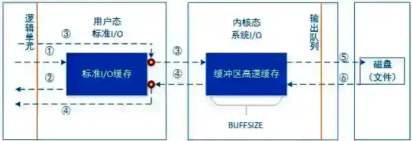

# Review

## IO多路复用概念与常见的实现方式？

### IO多路复用（IO Multiplexing）概念

IO多路复用是一种**单线程/进程高效管理多个IO连接**的技术，核心思想是：

-   **注册监听**：程序将一组文件描述符（如socket）注册到操作系统内核，告知内核需要**监视**这些描述符的IO事件（可读、可写、异常等）。
-   **事件驱动**：内核发现某个描述符的IO条件就绪（如数据到达）时，通知程序处理，避免程序轮询或阻塞等待单个IO操作。

**与传统IO模型的对比**：

-   **阻塞IO**：单线程阻塞在单个IO操作上，无法处理并发连接。
-   **非阻塞IO**：需轮询检查IO状态，浪费CPU资源。
-   **多线程/进程**：为每个连接创建线程/进程，资源开销大且上下文切换频繁。
-   **IO多路复用**：**单线程监听多个IO事件**，兼顾并发性能和资源效率。

### IO多路复用的常见实现方式

Linux系统中主要通过以下系统调用实现IO多路复用：

#### （1）select

**原理**：通过`fd_set`位图管理文件描述符集合，调用`select`时内核轮询检查这些描述符的状态，返回就绪的数量。

特点：

-   **跨平台支持**：几乎所有操作系统均支持。

-   缺点：文件描述符数量受限（默认1024）。

每次调用需重新传递整个`fd_set`，效率低（O(N)复杂度）。

#### （2）poll

**原理**：使用`struct pollfd`数组管理描述符，通过`poll`调用监听事件，返回就绪的描述符信息。

改进：

-   取消描述符数量限制（基于数组而非位图）。
-   支持更丰富的事件类型（如`POLLRDHUP`）。

缺点：仍需遍历所有描述符（O(N)复杂度）。

大量连接时性能仍不足。

#### （3）epoll（Linux特有）

原理：

-   **红黑树+就绪队列**：通过`epoll_create`创建内核事件表（红黑树存储监听项），`epoll_ctl`动态增删监听事件，`epoll_wait`从就绪队列获取事件。
-   **事件回调机制**：内核通过回调直接通知就绪事件，无需遍历所有描述符（O(1)复杂度）。

优势：

-   **高性能**：支持海量连接（百万级），适用于高并发场景（如Nginx、Redis）。

-   边缘触发（ET）与水平触发（LT）：

    -   **ET模式**：仅通知一次事件，需一次性处理完数据（减少重复触发）。
    -   **LT模式**：持续通知未处理的事件（编程更简单）。

#### （4）kqueue（BSD/macOS特有）

类似epoll，采用事件驱动模型，高效管理大量描述符，主要在FreeBSD/macOS中使用。

### 核心区别总结

| 特性               | select           | poll             | epoll           | kqueue        |
| ------------------ | ---------------- | ---------------- | --------------- | ------------- |
| **描述符数量限制** | 1024（可调整）   | 无硬限制         | 无硬限制        | 无硬限制      |
| **数据结构**       | 位图（`fd_set`） | 数组（`pollfd`） | 红黑树+就绪队列 | 事件队列      |
| **效率**           | O(N)轮询         | O(N)轮询         | O(1)事件回调    | O(1)事件回调  |
| **触发模式**       | 水平触发（LT）   | 水平触发（LT）   | 支持LT/ET       | 支持LT/ET     |
| **跨平台性**       | 广泛支持         | 多数Unix系统     | Linux特有       | BSD/macOS特有 |

### 适用场景

-   **低并发或跨平台**：`select`或`poll`（简单但性能一般）。
-   **高并发服务器**：`epoll`（Linux）或`kqueue`（BSD），如Web服务器、实时通信系统。
-   **编程复杂度**：`epoll`需处理ET/LT模式，`select/poll`更易上手但扩展性差。

### 扩展知识

-   **异步IO（AIO）**：真正的异步非阻塞模型（如Linux的`io_uring`），但实现复杂，尚未普及。
-   **结合非阻塞IO**：IO多路复用通常与非阻塞IO配合使用，避免单次IO操作阻塞线程。

通过合理选择IO多路复用技术，可显著提升程序的并发能力和资源利用率，尤其在网络编程中至关重要。

## 详细说下IO多路复用是如何避免程序轮询或阻塞等待单个IO操作？

IO多路复用（I/O Multiplexing）通过**事件驱动机制**和**内核级监听**，避免了程序轮询或阻塞等待单个IO操作的问题。其核心在于**将多个IO描述符的监听交给内核统一管理**，仅在数据就绪时通知应用程序处理，从而减少无效的CPU消耗和线程阻塞。以下是具体实现原理和机制：

>   传统IO模型的缺陷

-   **阻塞IO**：线程在调用`read()`时会一直阻塞，直到数据到达内核缓冲区，无法处理其他连接。
-   **非阻塞IO**：线程通过轮询（不断调用`read()`检查状态）避免阻塞，但空转导致CPU资源浪费。
-   **多线程/进程**：每个连接分配独立线程/进程，资源开销大且上下文切换频繁。

>   IO多路复用的解决机制

（1）注册与监听

-   **统一事件源**：应用程序将多个文件描述符（如Socket）注册到内核的监听列表（通过`select`/`poll`/`epoll`等系统调用）。
-   **内核态管理**：内核负责监控这些描述符的状态（如可读、可写），而非应用程序轮询。

（2）事件驱动与通知

-   **阻塞等待事件**：调用`select`/`epoll_wait`时，线程阻塞**在内核的监听函数**上，而非单个IO操作。
-   就绪事件返回：当任意注册的描述符数据就绪（如收到网络数据），内核唤醒线程并返回就绪的描述符列表。

-   **示例**：若10个Socket中3个有数据到达，内核仅返回这3个Socket，避免遍历所有连接。

（3）高效处理就绪IO

-   **批量处理**：应用程序遍历就绪列表，仅对实际有数据的描述符发起`read`/`write`操作，减少无效调用。
-   **非阻塞IO配合**：多路复用通常与非阻塞IO结合，确保单次IO操作不会阻塞线程（如`recv`返回`EAGAIN`时跳过）。

>   关键实现技术对比

不同系统调用通过优化监听机制进一步提升效率：

| 技术   | 监听机制                           | 避免轮询/阻塞的关键改进            | 缺点                               |
| ------ | ---------------------------------- | ---------------------------------- | ---------------------------------- |
| select | 线性扫描所有描述符（`fd_set`位图） | 将轮询从用户态转移到内核态         | 描述符数量受限（1024），效率O(N)。 |
| poll   | 链表存储描述符（`pollfd`数组）     | 突破数量限制，但仍需遍历所有描述符 | 性能随连接数增加下降。             |
| epoll  | 红黑树+就绪队列（事件回调）        | 仅返回就绪事件，时间复杂度O(1)     | 仅限Linux系统。                    |
| kqueue | 事件队列（类似`epoll`）            | 支持复杂事件类型（如文件修改）     | 仅限BSD/macOS系统。                |

>   工作流程示例（以epoll为例）

1、注册描述符：

```c
epoll_ctl(epfd, EPOLL_CTL_ADD, fd, &event);  // 将fd加入监听列表
```

2、阻塞等待事件：

```c
epoll_wait(epfd, events, max_events, timeout);  // 内核返回就绪的fd
```

3、处理就绪事件：

```c
for (每个就绪的fd) {
    read(fd, buf, size);  // 仅处理有数据的fd
}
```

流程中无需轮询所有连接，内核仅通知活跃事件。

>   优势总结

-   **减少CPU空转**：内核代替用户程序轮询，仅在有数据时唤醒线程。
-   **单线程高并发**：一个线程可管理成千上万个连接，避免多线程资源竞争。
-   **灵活的事件驱动**：支持水平触发（LT）和边缘触发（ET）模式，适应不同场景。

>   适用场景

-   **高并发服务器**：如Nginx（epoll）、Redis（多路复用+非阻塞IO）。
-   **实时通信系统**：需同时处理大量客户端连接。
-   **资源受限环境**：嵌入式设备或低功耗场景。

通过上述机制，IO多路复用将**主动轮询**转化为**被动事件通知**，实现了高效、低耗的IO管理。

## IO多路复用中，内核是如何监视这些描述符的IO事件的？性能消耗怎么样？

在Linux系统中，**IO多路复用（I/O Multiplexing）**的核心在于**内核如何高效监视文件描述符（FD）的IO事件**，并通过事件通知机制减少用户态轮询或阻塞等待的开销。其性能消耗与具体实现（如`select`、`poll`、`epoll`）密切相关。以下是详细分析：

### 内核监视IO事件的核心机制

IO多路复用的内核实现主要依赖以下技术：

#### （1）文件描述符（FD）与等待队列

-   FD关联的内核结构：每个文件描述符（如Socket）在内核中对应一个struct file对象，包含两个关键队列：

    -   **等待队列（Wait Queue）**：存储因等待该FD事件而阻塞的进程/线程信息（如回调函数）。
    -   **接收队列（Receive Queue）**：存储从网卡/DMA缓冲区拷贝到的数据。

-   **事件注册**：当用户程序调用`epoll_ctl`（或`select`/`poll`）时，内核将FD及其关注的事件（如可读、可写）注册到监听列表中，并绑定回调函数（如`ep_poll_callback`）。

#### （2）事件触发与通知

1.  **数据到达**：网卡通过DMA将数据写入内核的`RingBuffer`，触发硬中断，内核线程`ksoftirqd`处理软中断，将数据拷贝到对应Socket的接收队列。
2.  **唤醒进程**：内核通过回调函数（如`ep_poll_callback`）检查FD是否就绪，若就绪则将其加入**就绪队列**（如`epoll`的`rdllist`），并唤醒等待的进程。
3.  **用户态获取事件**：用户调用`epoll_wait`时，内核直接返回就绪的FD列表，无需遍历所有监听项。

#### （3）不同实现的技术差异

| 机制       | 数据结构                   | 事件检测方式           | 性能瓶颈                         |
| ---------- | -------------------------- | ---------------------- | -------------------------------- |
| **select** | 位图（`fd_set`）           | 线性扫描所有FD（O(N)） | FD数量受限（1024），频繁拷贝FD集 |
| **poll**   | 链表（`pollfd`数组）       | 线性扫描所有FD（O(N)） | 大量FD时遍历开销大               |
| **epoll**  | 红黑树（管理FD）+ 就绪队列 | 事件驱动回调（O(1)）   | 仅Linux支持，编程复杂度稍高      |
| **kqueue** | 事件表（`kevent`）         | 事件驱动回调（O(1)）   | BSD/macOS特有，支持更多事件类型  |

### 性能消耗分析

IO多路复用的性能消耗主要体现在**系统调用、数据拷贝、FD遍历**三个方面：

#### （1）系统调用开销

-   **`select/poll`**：每次调用需重新传递FD集合，触发完整的内核态切换（高并发时频繁调用代价高）。
-   **`epoll/kqueue`**：通过`epoll_ctl`或`kevent`动态维护FD集合，`epoll_wait`仅检查就绪队列，系统调用次数显著减少。

#### （2）数据拷贝开销

-   **`select/poll`**：每次调用需将FD集合从用户态拷贝到内核态（如`fd_set`），连接数多时拷贝耗时显著。
-   **`epoll/kqueue`**：FD集合在内核中持久化，仅需在首次注册时拷贝，后续仅传递就绪事件。

#### （3）FD遍历开销

-   **`select/poll`**：需遍历所有监听的FD，即使大部分未就绪（如10000个FD中仅10个就绪，仍需扫描9990个）。
-   **`epoll/kqueue`**：仅返回就绪的FD，时间复杂度从O(N)降至O(1)。

#### 性能对比（以10万并发连接为例）

| 指标         | select/poll          | epoll/kqueue         |
| ------------ | -------------------- | -------------------- |
| **系统调用** | 高频（每次全量传递） | 低频（事件驱动）     |
| **数据拷贝** | 每次调用拷贝所有FD   | 仅首次注册时拷贝     |
| **遍历效率** | O(N)，与FD数量正相关 | O(1)，仅处理就绪事件 |
| **适用场景** | 低并发（<1000连接）  | 高并发（百万级连接） |

### 优化与适用场景

#### （1）内核优化

-   **`epoll`的红黑树与就绪队列**：红黑树高效管理FD（插入/删除O(logN)），就绪队列直接返回事件，避免无效遍历。
-   **边缘触发（ET）模式**：仅当FD状态变化时通知，减少重复触发（需配合非阻塞IO一次性读完数据）。

#### （2）适用场景

-   **高并发网络服务器**：如Nginx（epoll）、Redis（epoll）。
-   **实时通信系统**：需低延迟处理大量连接（如聊天服务器）。
-   **资源受限环境**：单线程管理海量连接，避免多线程上下文切换。

### 总结

IO多路复用的内核监视机制通过**事件驱动**和**回调通知**取代轮询，核心优化点在于：

1.  **减少无效遍历**：仅处理就绪的FD（epoll/kqueue）。
2.  **降低拷贝开销**：FD集合在内核中持久化。
3.  **最小化系统调用**：通过就绪队列批量返回事件。

性能排序：**epoll/kqueue > poll > select**，实际选择需结合操作系统和并发规模。

## select和epoll的区别？

（1）监视文件描述符数量

-   select：单个进程可监视的文件描述符数量有限，通常受限于系统参数，一般为1024。

-   epoll：能支持大量的文件描述符，理论上只受系统内存限制。

（2）工作模式

-   select：采用轮询方式，遍历所有监视的文件描述符，检查是否有事件发生，时间复杂度为O(n)。

-   epoll：有两种模式，水平触发（LT）和边缘触发（ET）。ET模式下，只有文件描述符状态发生变化时才会通知，可减少不必要的唤醒，效率更高。

（3）数据结构

-   select：使用fd_set结构体来存储文件描述符集合，每次调用select都需要将文件描述符集合从用户空间复制到内核空间。

-   epoll：在内核中维护一个红黑树来管理文件描述符，通过epoll_ctl函数添加、删除或修改文件描述符的事件监听，只在有事件发生时才将相关数据从内核空间复制到用户空间。

（4）应用场景

-   select：适用于小规模并发或并发连接数较固定的场景。

-   epoll：适合处理高并发场景，如大规模网络服务器，能高效处理大量连接。

## epoll的性能为什么比select高？

>   （1）事件通知机制高效

select采用轮询方式，不管文件描述符是否有事件发生，都要遍历所有文件描述符，时间复杂度为O(n)。随着文件描述符数量增加，性能会显著下降。

epoll通过回调机制实现事件通知。当文件描述符就绪时，内核会将其放入就绪队列，用户程序通过epoll_wait获取就绪事件，无需轮询，时间复杂度为O(1)。

>   （2）内存拷贝次数少

select每次调用都需要将文件描述符集合从用户空间拷贝到内核空间，返回时又要将就绪的文件描述符集合从内核空间拷贝到用户空间。

epoll使用mmap技术，在内核空间和用户空间建立共享内存映射，减少了数据拷贝次数，提高了数据传输效率。

>   （3）支持大量文件描述符

select受限于fd_set的大小，能监视的文件描述符数量有限，通常为1024。

epoll在内核中使用红黑树来管理文件描述符，理论上只受系统内存限制，能支持大量文件描述符，更适合高并发场景。

## 标准IO与系统IO的区别？



（1）定义与层次

标准IO：是C语言标准库提供的一套输入输出函数，如fopen、fread、fwrite等，它是对系统IO的封装，属于用户层的接口，提供了更方便、更高级的操作方式。

系统IO：是操作系统内核提供的底层输入输出接口，像open、read、write等函数，直接与操作系统的内核进行交互，处于操作系统内核层。

（2）缓冲机制

标准IO：具有完善的缓冲机制，它会在用户空间设置缓冲区，对数据进行缓存，减少系统调用的次数，提高读写效率。

例如，fwrite函数先将数据写入缓冲区，当缓冲区满或执行fflush函数时，才将数据真正写入磁盘。

系统IO：本身没有用户空间的缓冲机制，数据直接在内核空间和应用程序之间传递。不过，操作系统的内核会对磁盘等设备进行缓冲管理。

（3）可移植性

标准IO：具有良好的可移植性，只要是遵循C标准的平台，都可以使用标准IO函数，代码在不同操作系统上的兼容性较好。

系统IO：与具体的操作系统紧密相关，不同操作系统的系统IO接口可能存在差异，可移植性相对较差。

（4）功能特性

标准IO：提供了丰富的功能，如格式化输入输出（printf、scanf）、文件定位（fseek）等，更适合处理文本数据和对文件进行复杂的操作。

系统IO：更侧重于底层的文件操作，如文件描述符的管理、设备的直接访问等，在处理一些特殊设备或需要对文件进行底层控制时更具优势。

