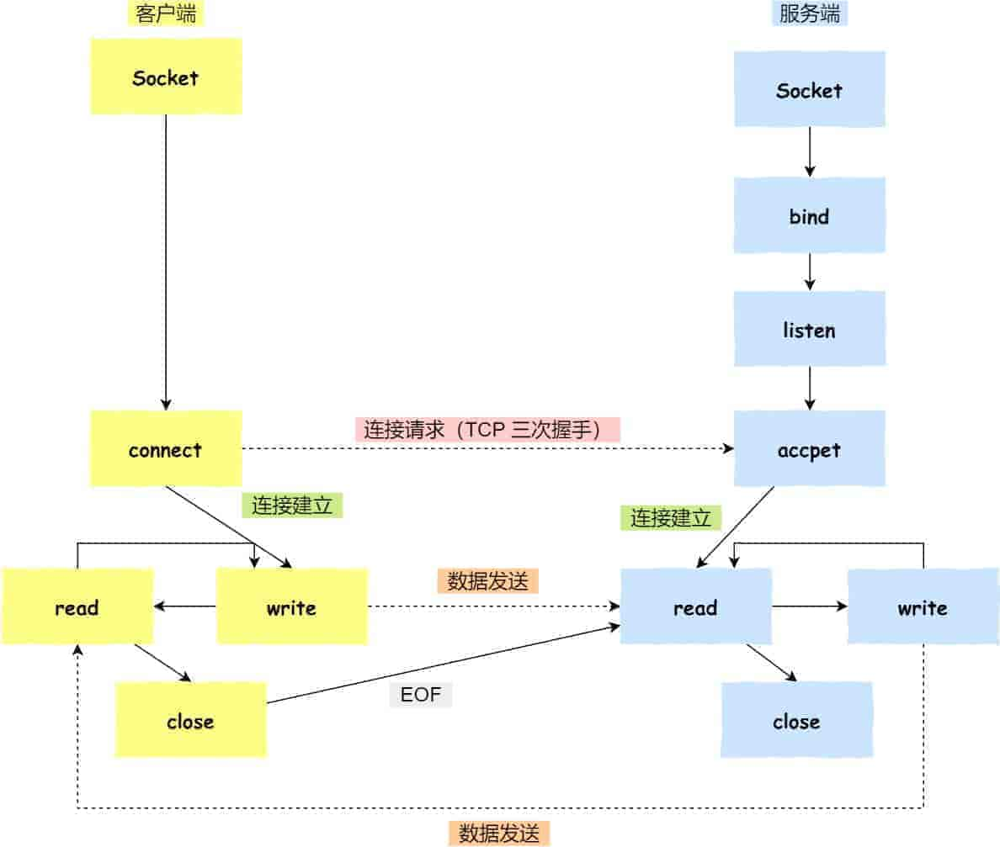
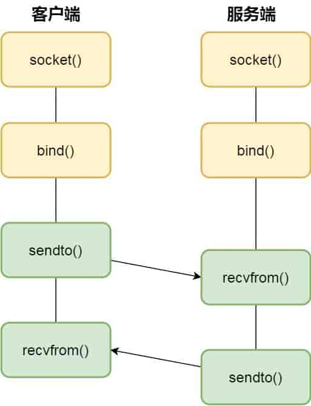
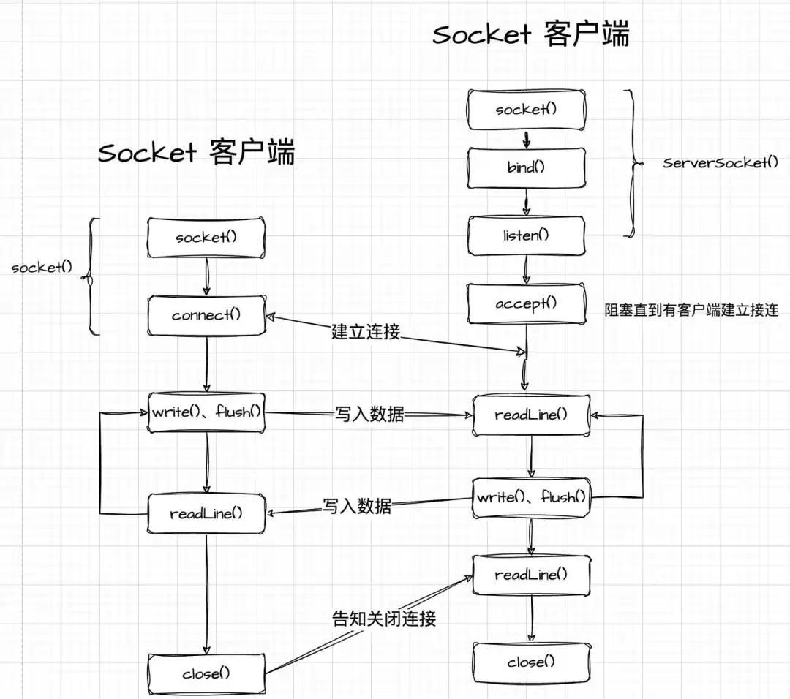

# socket

## Socket简介

**要想跨网络与不同主机上的进程之间通信**，就需要 Socket 通信了。

实际上，Socket 通信不仅可以跨网络与不同主机的进程间通信，还可以在同主机上进程间通信。

我们来看看创建 socket 的系统调用：

```c
int socket(int domain, int type, int protocol)
```

三个参数分别代表：

- domain 参数用来指定协议族，比如 AF_INET 用于 IPV4、AF_INET6 用于 IPV6、AF_LOCAL/AF_UNIX 用于本机；
- type 参数用来指定通信特性，比如 SOCK_STREAM 表示的是字节流，对应 TCP、SOCK_DGRAM 表示的是数据报，对应 UDP、SOCK_RAW 表示的是原始套接字；
- protocol 参数原本是用来指定通信协议的，但现在基本废弃。因为协议已经通过前面两个参数指定完成，protocol 目前一般写成 0 即可；

根据创建 socket 类型的不同，通信的方式也就不同：

- 实现 TCP 字节流通信：socket 类型是 AF_INET 和 SOCK_STREAM；
- 实现 UDP 数据报通信：socket 类型是 AF_INET 和 SOCK_DGRAM；
- 实现本地进程间通信：「本地字节流 socket」类型是 AF_LOCAL 和 SOCK_STREAM，「本地数据报 socket」类型是 AF_LOCAL 和 SOCK_DGRAM。另外，AF_UNIX 和 AF_LOCAL 是等价的，所以 AF_UNIX 也属于本地 socket；

接下来，简单说一下这三种通信的编程模式。

> 针对 TCP 协议通信的 socket 编程模型



- 服务端和客户端初始化 `socket`，得到文件描述符；
- 服务端调用 `bind`，将绑定在 IP 地址和端口；
- 服务端调用 `listen`，进行监听；
- 服务端调用 `accept`，等待客户端连接；
- 客户端调用 `connect`，向服务器端的地址和端口发起连接请求；
- 服务端 `accept` 返回用于传输的 `socket` 的文件描述符；
- 客户端调用 `write` 写入数据；服务端调用 `read` 读取数据；
- 客户端断开连接时，会调用 `close`，那么服务端 `read` 读取数据的时候，就会读取到了 `EOF`，待处理完数据后，服务端调用 `close`，表示连接关闭。

这里需要注意的是，服务端调用 `accept` 时，连接成功了会返回一个已完成连接的 socket，后续用来传输数据。

所以，监听的 socket 和真正用来传送数据的 socket，是「**两个**」socket，一个叫作**监听 socket**，一个叫作**已完成连接 socket**。

成功连接建立之后，双方开始通过 read 和 write 函数来读写数据，就像往一个文件流里面写东西一样。

> 针对 UDP 协议通信的 socket 编程模型



UDP 是没有连接的，所以不需要三次握手，也就不需要像 TCP 调用 listen 和 connect，但是 UDP 的交互仍然需要 IP 地址和端口号，因此也需要 bind。

对于 UDP 来说，不需要要维护连接，那么也就没有所谓的发送方和接收方，甚至都不存在客户端和服务端的概念，只要有一个 socket 多台机器就可以任意通信，因此每一个 UDP 的 socket 都需要 bind。

另外，每次通信时，调用 sendto 和 recvfrom，都要传入目标主机的 IP 地址和端口。

> 针对本地进程间通信的 socket 编程模型

本地 socket 被用于在**同一台主机上进程间通信**的场景：

- 本地 socket 的编程接口和 IPv4、IPv6 套接字编程接口是一致的，可以支持「字节流」和「数据报」两种协议；
- 本地 socket 的实现效率大大高于 IPv4 和 IPv6 的字节流、数据报 socket 实现；

对于本地字节流 socket，其 socket 类型是 AF_LOCAL 和 SOCK_STREAM。

对于本地数据报 socket，其 socket 类型是 AF_LOCAL 和 SOCK_DGRAM。

本地字节流 socket 和 本地数据报 socket 在 bind 的时候，不像 TCP 和 UDP 要绑定 IP 地址和端口，而是**绑定一个本地文件**，这也就是它们之间的最大区别。

## socket的流程

以下是使用 socket 进行网络编程的基本流程函数，以 TCP 为例：



**服务器端**

1、创建 socket：使用 socket 函数创建一个套接字。

```c
int sockfd = socket(AF_INET, SOCK_STREAM, 0);
if (sockfd == -1) {
    // 处理错误
}
```

2、绑定地址和端口：使用 bind 函数将 socket 绑定到指定的地址和端口。

```c
struct sockaddr_in server_addr;

server_addr.sin_family = AF_INET;
server_addr.sin_port = htons(port);
server_addr.sin_addr.s_addr = INADDR_ANY;

if (bind(sockfd, (struct sockaddr *)&server_addr, sizeof(server_addr)) == -1)
{
	// 处理错误
}
```

3、监听连接：使用 listen 函数开始监听指定 socket 上的连接请求。

```c
if (listen(sockfd, backlog) == -1) {// 处理错误}
```

4、接受连接：使用 accept 函数接受客户端的连接请求。

```c
struct sockaddr_in client_addr;
socklen_t client_addr_len = sizeof(client_addr);
int connfd = accept(sockfd, (struct sockaddr *)&client_addr, &client_addr_len);

if (connfd == -1) {
    // 处理错误
}
```

5、数据传输：使用 read 和 write 函数在连接上进行数据的读取和写入。

```c
char buffer[BUFFER_SIZE];
int n = read(connfd, buffer, BUFFER_SIZE);
if (n == -1) {
    // 处理错误
}

// 处理数据
n = write(connfd, buffer, strlen(buffer));
if (n == -1) {
    // 处理错误
}
```

6、关闭连接：使用 close 函数关闭连接。

```c
close(connfd);
close(sockfd);
```

**客户端**

1、创建 socket：与服务器端相同，使用 socket 函数创建套接字。

```c
int sockfd = socket(AF_INET, SOCK_STREAM, 0);
if (sockfd == -1) {
    // 处理错误
}
```

2、连接服务器：使用 connect 函数连接到服务器。

```c
struct sockaddr_in server_addr;

server_addr.sin_family = AF_INET;
server_addr.sin_port = htons(port);

inet_pton(AF_INET, server_ip, &server_addr.sin_addr);

if (connect(sockfd, (struct sockaddr *)&server_addr, sizeof(server_addr)) == -1)
{
    // 处理错误
}
```

3、数据传输：与服务器端类似，使用 read 和 write 函数进行数据的读取和写入。

4、关闭连接：使用 close 函数关闭 socket。

```c
close(sockfd);
```

以上是基本的 socket 编程流程函数，如果是 UDP 编程，流程会有所不同，主要区别在于不需要监听和接受连接，而是直接使用sendto和 recvfrom 函数进行数据的发送和接收。
