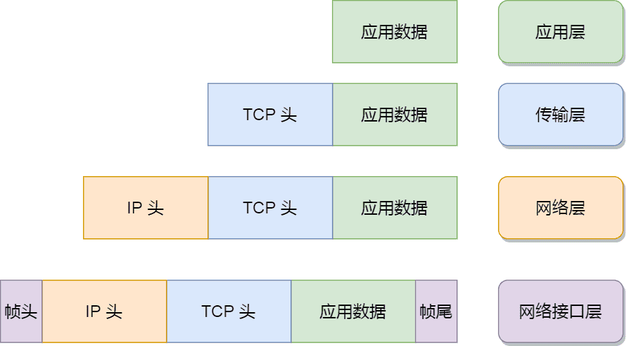
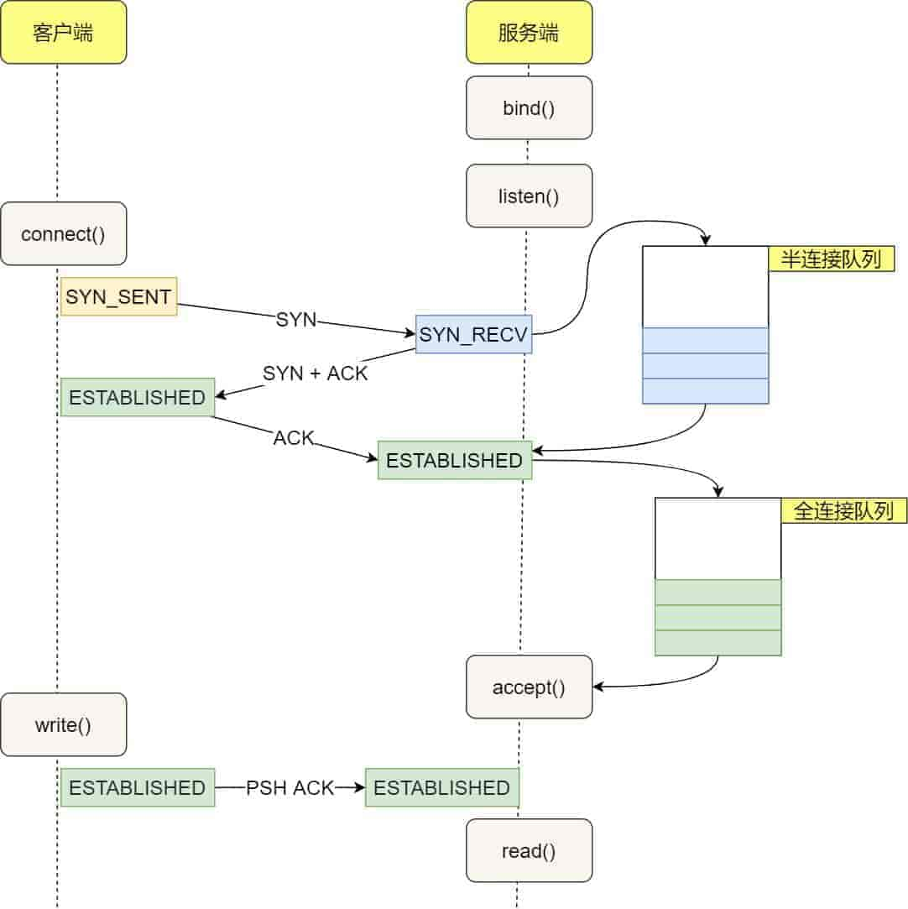

# 如何查看网络的性能指标？

Linux 网络协议栈是根据 TCP/IP 模型来实现的，TCP/IP 模型由应用层、传输层、网络层和网络接口层，共四层组成，每一层都有各自的职责。



应用程序要发送数据包时，通常是通过 socket 接口，于是就会发生系统调用，把应用层的数据拷贝到内核里的 socket 层，接着由网络协议栈从上到下逐层处理后，最后才会送到网卡发送出去。

而对于接收网络包时，同样也要经过网络协议逐层处理，不过处理的方向与发送数据时是相反的，也就是从下到上的逐层处理，最后才送到应用程序。

网络的速度往往跟用户体验是挂钩的，那我们又该用什么指标来衡量 Linux 的网络性能呢？以及如何分析网络问题呢？

## 性能指标有哪些？

通常是以 4 个指标来衡量网络的性能，分别是带宽、延时、吞吐率、PPS（Packet Per Second），它们表示的意义如下：

- *带宽*，表示链路的最大传输速率，单位是 b/s（比特 / 秒），带宽越大，其传输能力就越强。
- *延时*，表示请求数据包发送后，收到对端响应，所需要的时间延迟。不同的场景有着不同的含义，比如可以表示建立 TCP 连接所需的时间延迟，或一个数据包往返所需的时间延迟。
- *吞吐率*，表示单位时间内成功传输的数据量，单位是 b/s（比特 / 秒）或者 B/s（字节 / 秒），吞吐受带宽限制，带宽越大，吞吐率的上限才可能越高。
- *PPS*，全称是 Packet Per Second（包 / 秒），表示以网络包为单位的传输速率，一般用来评估系统对于网络的转发能力。

当然，除了以上这四种基本的指标，还有一些其他常用的性能指标，比如：

- *网络的可用性*，表示网络能否正常通信；
- *并发连接数*，表示 TCP 连接数量；
- *丢包率*，表示所丢失数据包数量占所发送数据组的比率；
- *重传率*，表示重传网络包的比例；

你可能会问了，如何观测这些性能指标呢？不急，继续往下看。

## 网络配置如何看？

要想知道网络的配置和状态，我们可以使用 `ifconfig` 或者 `ip` 命令来查看。

这两个命令功能都差不多，不过它们属于不同的软件包，`ifconfig` 属于 `net-tools` 软件包，`ip` 属于 `iproute2` 软件包。

学以致用，那就来使用这两个命令，来查看网口 `ens160` 的配置等信息：

```idl
$ ifconfig ens160
ens160: flags=4163<UP,BROADCAST,RUNNING,MULTICAST>  mtu 1500
        inet 192.168.134.128  netmask 255.255.255.0  broadcast 192.168.134.255
        inet6 fe80::20c:29ff:fe97:3def  prefixlen 64  scopeid 0x20<link>
        ether 00:0c:29:97:3d:ef  txqueuelen 1000  (Ethernet)
        RX packets 82055  bytes 8507815 (8.1 MiB)
        RX errors 0  dropped 0  overruns 0  frame 0
        TX packets 168025  bytes 30359642 (28.9 MiB)
        TX errors 0  dropped 5 overruns 0  carrier 0  collisions 0

$ ip -s addr show dev ens160
2: ens160: <BROADCAST,MULTICAST,UP,LOWER_UP> mtu 1500 qdisc mq state UP group default qlen 1000
    link/ether 00:0c:29:97:3d:ef brd ff:ff:ff:ff:ff:ff
    altname enp3s0
    inet 192.168.134.128/24 brd 192.168.134.255 scope global dynamic noprefixroute ens160
       valid_lft 1633sec preferred_lft 1633sec
    inet6 fe80::20c:29ff:fe97:3def/64 scope link noprefixroute
       valid_lft forever preferred_lft forever
    RX:  bytes packets errors dropped  missed   mcast
       8536603   82329      0       0       0       0
    TX:  bytes packets errors dropped carrier collsns
      30464830  168631      0       5       0       0
```

虽然这两个命令输出的格式不尽相同，但是输出的内容基本相同，比如都包含了 IP 地址、子网掩码、MAC 地址、网关地址、MTU 大小、网口的状态以及网路包收发的统计信息，下面就来说说这些信息，它们都与网络性能有一定的关系。

第一，网口的连接状态标志。其实也就是表示对应的网口是否连接到交换机或路由器等设备，如果 `ifconfig` 输出中看到有 `RUNNING`，或者 `ip` 输出中有 `LOWER_UP`，则说明物理网路是连通的，如果看不到，则表示网口没有接网线。

第二，MTU 大小。默认值是 `1500` 字节，其作用主要是限制网络包的大小，如果 IP 层有一个数据报要传，而且数据帧的长度比链路层的 MTU 还大，那么 IP 层就需要进行分片，即把数据报分成若干片，这样每一片就都小于 MTU。事实上，每个网络的链路层 MTU 可能会不一样，所以你可能需要调大或者调小 MTU 的数值。

第三，网口的 IP 地址、子网掩码、MAC 地址、网关地址。这些信息必须要配置正确，网络功能才能正常工作。

第四，网路包收发的统计信息。通常有网络收发的字节数、包数、错误数以及丢包情况的信息，如果 `TX`（发送）和 `RX`（接收）部分中 errors、dropped、overruns、carrier 以及 collisions 等指标不为 0 时，则说明网络发送或者接收出问题了，这些出错统计信息的指标意义如下：

- *errors* 表示发生错误的数据包数，比如校验错误、帧同步错误等；
- *dropped* 表示丢弃的数据包数，即数据包已经收到了 Ring Buffer（这个缓冲区是在内核内存中，更具体一点是在网卡驱动程序里），但因为系统内存不足等原因而发生的丢包；
- *overruns* 表示超限数据包数，即网络接收/发送速度过快，导致 Ring Buffer 中的数据包来不及处理，而导致的丢包，因为过多的数据包挤压在 Ring Buffer，这样 Ring Buffer 很容易就溢出了；
- *carrier* 表示发生 carrirer 错误的数据包数，比如双工模式不匹配、物理电缆出现问题等；
- *collisions* 表示冲突、碰撞数据包数；

`ifconfig` 和 `ip` 命令只显示的是网口的配置以及收发数据包的统计信息，而看不到协议栈里的信息，那接下来就来看看如何查看协议栈里的信息。

## socket 信息如何查看？

我们可以使用 `netstat` 或者 `ss`，这两个命令查看 socket、网络协议栈、网口以及路由表的信息。

虽然 `netstat` 与 `ss` 命令查看的信息都差不多，但是如果在生产环境中要查看这类信息的时候，尽量不要使用 `netstat` 命令，因为它的性能不好，在系统比较繁忙的情况下，如果频繁使用 `netstat` 命令则会对性能的开销雪上加霜，所以更推荐你使用性能更好的 `ss` 命令。

从下面这张图，你可以看到这两个命令的输出内容：

```idl
# -n表示不显示名字，而是以数字方式显示ip和端口
# -l表示只显示 LISTEN 状态的socket
# -p表示显示进程信息
$ netstat -nlp
Active Internet connections (only servers)
Proto Recv-Q Send-Q Local Address           Foreign Address         State       PID/Program name
tcp        0      0 0.0.0.0:22              0.0.0.0:*               LISTEN      796/sshd: /usr/sbin
tcp6       0      0 :::22                   :::*                    LISTEN      796/sshd: /usr/sbin
udp        0      0 127.0.0.1:323           0.0.0.0:*                           766/chronyd
udp6       0      0 ::1:323                 :::*                                766/chronyd
raw6       0      0 :::58                   :::*                    7           770/NetworkManager
Active UNIX domain sockets (only servers)
Proto RefCnt Flags       Type       State         I-Node   PID/Program name     Path
unix  2      [ ACC ]     STREAM     LISTENING     26979    1127/systemd         /run/user/0/systemd/private
......

# -l 表示只显示 LISTEN 状态的socket
# -t 表示只显示 tcp连接
# -n 表示不显示名字，而是以数字方式显示ip和端口
# -p表示显示进程信息

$ ss -ltnp
State                        Recv-Q                       Send-Q                                              Local Address:Port                                               Peer Address:Port                       Process
LISTEN                       0                            128                                                       0.0.0.0:22                                                      0.0.0.0:*                           users:(("sshd",pid=796,fd=3))
LISTEN                       0                            128                                                          [::]:22                                                         [::]:*                           users:(("sshd",pid=796,fd=4))
[root@localhost ~]#

```

可以发现，输出的内容都差不多，比如都包含了 socket 的状态（*State*）、接收队列（*Recv-Q*）、发送队列（*Send-Q*）、本地地址（*Local Address*）、远端地址（*Foreign Address*）、进程 PID 和进程名称（*PID/Program name*）等。

接收队列（*Recv-Q*）和发送队列（*Send-Q*）比较特殊，在不同的 socket 状态。它们表示的含义是不同的。

当 socket 状态处于`Established`时：

- *Recv-Q* 表示 socket 缓冲区中还没有被应用程序读取的字节数；
- *Send-Q* 表示 socket 缓冲区中还没有被远端主机确认的字节数；

而当 socket 状态处于`Listen`时：

- *Recv-Q* 表示全连接队列的长度；
- *Send-Q* 表示全连接队列的最大长度；

在 TCP 三次握手过程中，当服务器收到客户端的 SYN 包后，内核会把该连接存储到半连接队列，然后再向客户端发送 SYN+ACK 包，接着客户端会返回 ACK，服务端收到第三次握手的 ACK 后，内核会把连接从半连接队列移除，然后创建新的完全的连接，并将其增加到全连接队列，等待进程调用 `accept()` 函数时把连接取出来。



也就说，全连接队列指的是服务器与客户端完了 TCP 三次握手后，还没有被 `accept()` 系统调用取走连接的队列。

那对于协议栈的统计信息，依然还是使用 `netstat` 或 `ss`，它们查看统计信息的命令如下：

```idl
$ netstat -s
Ip:
    Forwarding: 2
    96482 total packets received
    1 with invalid addresses
    0 forwarded
    0 incoming packets discarded
    96478 incoming packets delivered
    197739 requests sent out
    12 dropped because of missing route
    OutTransmits: 197739
......
Tcp:
    8 active connection openings
    1 passive connection openings
    0 failed connection attempts
    0 connection resets received
    1 connections established
    96322 segments received
    199532 segments sent out
    3 segments retransmitted
    0 bad segments received
    5 resets sent
Udp:
    152 packets received
    0 packets to unknown port received
    0 packet receive errors
    172 packets sent
    0 receive buffer errors
    0 send buffer errors
......

$ ss -s
Total: 119
TCP:   3 (estab 1, closed 0, orphaned 0, timewait 0)

Transport Total     IP        IPv6
RAW       1         0         1
UDP       3         2         1
TCP       3         2         1
INET      7         4         3
FRAG      0         0         0
```

`ss` 命令输出的统计信息相比 `netsat` 比较少，`ss` 只显示已经连接（*estab*）、关闭（*closed*）、孤儿（*orphaned*）socket 等简要统计。

而 `netstat` 则有更详细的网络协议栈信息，比如上面显示了 TCP 协议的主动连接（*active connections openings*）、被动连接（*passive connection openings*）、失败重试（*failed connection attempts*）、发送（*segments send out*）和接收（*segments received*）的分段数量等各种信息。

## 网络吞吐率和 PPS 如何查看？

可以使用 `sar` 命令当前网络的吞吐率和 PPS，用法是给 `sar` 增加 `-n` 参数就可以查看网络的统计信息，比如

- sar -n DEV，显示网口的统计数据；
- sar -n EDEV，显示关于网络错误的统计数据；
- sar -n TCP，显示 TCP 的统计数据

>   在Linux系统中，`sar`命令通常与`sysstat`包相关联，用于收集、报告和存储系统活动和性能统计信息。如果你想安装`sar`命令，你需要先确保你的系统上安装了`sysstat`包。

比如，我通过 `sar` 命令获取了网口的统计信息：

```idl
# 数字1表示每隔1秒输出一组数据
$ sar -n DEV 1
Linux 5.14.0-570.22.1.el9_6.x86_64 (localhost.localdomain)      07/10/25        _x86_64_        (4 CPU)

05:55:02        IFACE   rxpck/s   txpck/s    rxkB/s    txkB/s   rxcmp/s   txcmp/s  rxmcst/s   %ifutil
05:55:03           lo      0.00      0.00      0.00      0.00      0.00      0.00      0.00      0.00
05:55:03       ens160     43.00    100.00      4.23     26.98      0.00      0.00      0.00      0.00

05:55:03        IFACE   rxpck/s   txpck/s    rxkB/s    txkB/s   rxcmp/s   txcmp/s  rxmcst/s   %ifutil
05:55:04           lo      0.00      0.00      0.00      0.00      0.00      0.00      0.00      0.00
05:55:04       ens160     16.00     24.00      1.60      2.78      0.00      0.00      0.00      0.00
^Z
[1]+  Stopped                 sar -n DEV 1
```

它们的含义：

- `rxpck/s` 和 `txpck/s` 分别是接收和发送的 PPS，单位为包 / 秒。
- `rxkB/s` 和 `txkB/s` 分别是接收和发送的吞吐率，单位是 KB/ 秒。
- `rxcmp/s` 和 `txcmp/s` 分别是接收和发送的压缩数据包数，单位是包 / 秒。

对于带宽可以使用 `ethtool` 命令来查询，它的单位通常是 `Gb/s` 或者 `Mb/s`，不过注意这里小写字母 `b`，表示比特而不是字节。我们通常提到的千兆网卡、万兆网卡等，单位也都是比特（*bit*）。如下你可以看到，eth0 网卡就是一个千兆网卡：

```bash
$ ethtool eth0 | grep Speed
  Speed: 1000Mb/s
```

## 连通性和延时如何查看？

要测试本机与远程主机的连通性和延时，通常是使用 `ping` 命令，它是基于 ICMP 协议的，工作在网络层。

比如，如果要测试本机到 `192.168.00.0` IP 地址的连通性和延时：

```idl
# -c 5表示发送5次ICMP包
$ ping 192.168.00.0 -c 5
PING 192.168.00.0 (192.168.00.0) 56(84) bytes of data.
64 bytes from 192.168.00.0: icmp_seq=1 ttl=128 time=0.524 ms
64 bytes from 192.168.00.0: icmp_seq=2 ttl=128 time=0.570 ms
64 bytes from 192.168.00.0: icmp_seq=3 ttl=128 time=0.579 ms
64 bytes from 192.168.00.0: icmp_seq=4 ttl=128 time=0.583 ms
64 bytes from 192.168.00.0: icmp_seq=5 ttl=128 time=0.517 ms

--- 192.168.00.0 ping statistics ---
5 packets transmitted, 5 received, 0% packet loss, time 4123ms
rtt min/avg/max/mdev = 0.517/0.554/0.583/0.028 ms
```

显示的内容主要包含  `icmp_seq`（ICMP 序列号）、`TTL`（生存时间，或者跳数）以及 `time` （往返延时），而且最后会汇总本次测试的情况，如果网络没有丢包，`packet loss` 的百分比就是 0。

不过，需要注意的是，`ping` 不通服务器并不代表 HTTP 请求也不通，因为有的服务器的防火墙是会禁用 ICMP 协议的。
