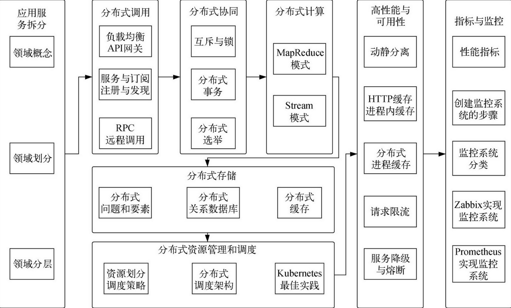

# README

Question：

-   分布式服务接口的幂等性如何设计（比如不能重复扣款）？
-   分布式服务接口请求的顺序性如何保证？
-   分布式事务了解吗？你们如何解决分布式事务问题的？TCC 如果出现网络连不通怎么办？XA 的一致性如何保证？

## 如何设计分布式系统

设计分布式系统的本质就是“合理地将一个系统拆分成多个子系统并部署到不同的机器上”，所以首先要考虑的问题是如何合理地将系统进行拆分。由于拆分后的各个子系统不可能孤立地存在，必然要通过网络进行连接交互，它们之间如何通信变得尤为重要。当然，在通信过程中要识别“敌我”，防止信息在传递过程中被拦截和篡改（这就涉及安全问题了）。分布式系统如果要适应不断增长的业务需求，就需要考虑扩展性。分布式系统还必须保证可靠性和数据的一致性。

概括起来，在设计分布式系统时，应考虑以下问题：

-   ● 如何将系统拆分为子系统？
-   如何规划子系统间的通信？
-   如何考虑通信过程中的安全？
-   如何让子系统可以扩展？
-   如何保证子系统的可靠性？
-   如何实现数据的一致性？

## 如何设计分布式系统

设计分布式系统的挑战如下。

-   异构性：由于分布式系统基于不同的网络、操作系统、计算机硬件和编程语言构造，必须有一种通用的网络通信协议来屏蔽异构系统之间的差异。一般由中间件来处理这些差异。
-   缺乏全球时钟：在程序需要协作时，通过交换消息来协调它们的动作。紧密的协调经常依赖于对程序动作发生时间的共识。但是，实际网络上计算机同步时钟的准确性受到了极大的限制，即没有一个正确时间的全局概念。这是通过网络发送消息作为唯一的通信方式这一事实带来的直接结果。
-   一致性：数据被分散或复制到不同的机器上，如何保证各台主机之间的数据的一致性是一个难点。
-   故障的独立性：任何计算机都有可能发生故障，且故障不尽相同。故障出现的时间也是相互独立的。一般分布式系统允许出现部分故障而不影响整个系统的正常使用。
-   并发：使用分布式系统的目的是更好地共享资源，所以系统中的每个资源都必须被设计成在并发环境中是安全的。
-   透明性：分布式系统中任何组件的故障，或者主机的升级、迁移，对于用户来说都是不可见的。
-   开放性：分布式系统由不同的程序员来编写不同的组件，组件最终要集成为一个系统，所以组件所发布的接口必须遵守一定的规范且能够被互相理解。
-   安全性：加密用于给共享资源提供适当的保护，在网络上传递的所有敏感信息都需要进行加密。拒绝服务攻击仍然是一个有待解决的问题。
-   可扩展性：系统要设计成随着业务量的增加而相应地扩展，以提供对应的服务。
