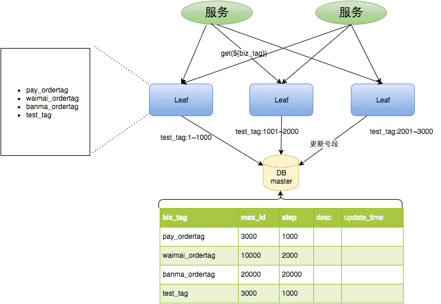
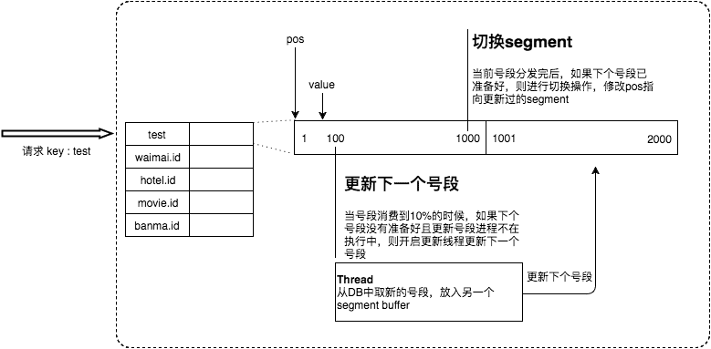
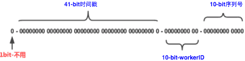
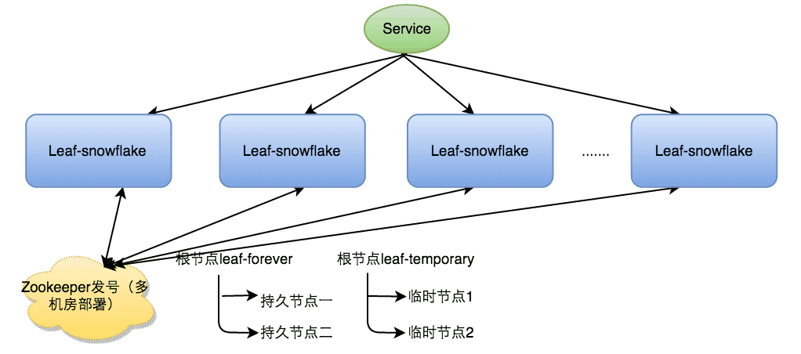
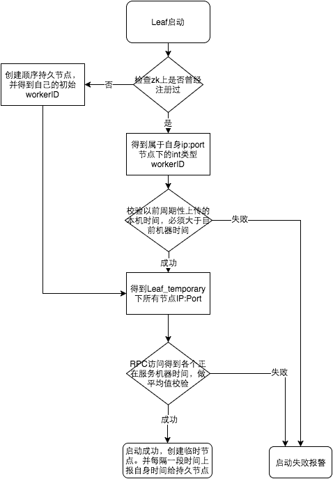
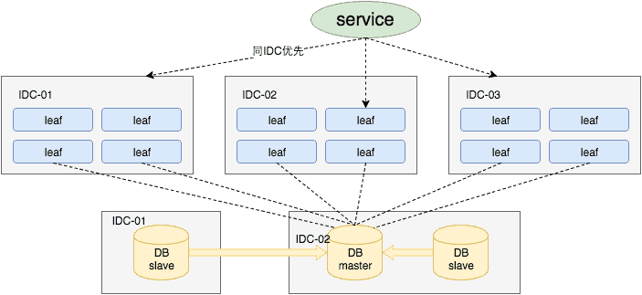

# Leaf分布式ID详解

参考：[Leaf——美团点评分布式ID生成系统](https://tech.meituan.com/2017/04/21/mt-leaf.html)

Leaf是美团开源的分布式ID生成系统，其诞生主要是为了解决美团各个业务线生成分布式 ID 的方法多种多样以及不可靠的问题。

Leaf开源地址：https://github.com/Meituan-Dianping/Leaf。根据项目 README 介绍，在 4C8G VM 基础上，通过公司 RPC 方式调用，QPS 压测结果近 5w/s，TP999 1ms。

## 背景

一个能够生成全局唯一ID的系统是非常必要的，那业务系统对ID号的要求有哪些呢？

1.  全局唯一性：不能出现重复的ID号，既然是唯一标识，这是最基本的要求。
2.  趋势递增：在MySQL InnoDB引擎中使用的是聚集索引，由于多数RDBMS使用B-tree的数据结构来存储索引数据，在主键的选择上面我们应该尽量使用有序的主键保证写入性能。
3.  单调递增：保证下一个ID一定大于上一个ID，例如事务版本号、IM增量消息、排序等特殊需求。
4.  信息安全：如果ID是连续的，恶意用户的扒取工作就非常容易做了，直接按照顺序下载指定URL即可；如果是订单号就更危险了，竞对可以直接知道我们一天的单量。所以在一些应用场景下，会需要ID无规则、不规则。

上述123对应三类不同的场景，3和4需求还是互斥的，无法使用同一个方案满足。

同时除了对ID号码自身的要求，业务还对ID号生成系统的可用性要求极高，想象一下，如果ID生成系统瘫痪，整个美团点评支付、优惠券发券、骑手派单等关键动作都无法执行，这就会带来一场灾难。

由此总结下一个ID生成系统应该做到如下几点：

1.  平均延迟和TP999延迟都要尽可能低；
2.  可用性5个9；
3.  高QPS。

## Leaf方案实现

Leaf提供了两种生成ID的方式：

- Leaf-segment号段模式
- Leaf-snowflake雪花算法

### Leaf-segment数据库方案

第一种Leaf-segment方案，在使用数据库的方案上，做了如下改变：

-   **数据库自增ID**方案每次获取ID都得读写一次数据库，造成数据库压力大。改为利用proxy server批量获取，每次获取一个segment(step决定大小)号段的值。用完之后再去数据库获取新的号段，可以大大的减轻数据库的压力。
-   各个业务不同的发号需求用biz_tag字段来区分，每个biz-tag的ID获取相互隔离，互不影响。如果以后有性能需求需要对数据库扩容，不需要上述描述的复杂的扩容操作，只需要对biz_tag分库分表就行。

数据库表设计如下：

```sql
+-------------+--------------+------+-----+-------------------+-----------------------------+
| Field       | Type         | Null | Key | Default           | Extra                       |
+-------------+--------------+------+-----+-------------------+-----------------------------+
| biz_tag     | varchar(128) | NO   | PRI |                   |                             |
| max_id      | bigint(20)   | NO   |     | 1                 |                             |
| step        | int(11)      | NO   |     | NULL              |                             |
| desc        | varchar(256) | YES  |     | NULL              |                             |
| update_time | timestamp    | NO   |     | CURRENT_TIMESTAMP | on update CURRENT_TIMESTAMP |
+-------------+--------------+------+-----+-------------------+-----------------------------+
```

对应sql：

```sql
CREATE TABLE `leaf_alloc`
(
    `biz_tag`     varchar(128) NOT NULL DEFAULT '' COMMENT '业务key',
    `max_id`      bigint(20) NOT NULL DEFAULT '1' COMMENT '当前已经分配了的最大id',
    `step`        int(11) NOT NULL COMMENT '初始步长，也是动态调整的最小步长',
    `description` varchar(256)          DEFAULT NULL COMMENT '业务key的描述',
    `update_time` timestamp    NOT NULL DEFAULT CURRENT_TIMESTAMP ON UPDATE CURRENT_TIMESTAMP COMMENT '更新时间',
    PRIMARY KEY (`biz_tag`)
) ENGINE=InnoDB;
```

重要字段说明：biz_tag用来区分业务，max_id表示该biz_tag目前所被分配的ID号段的最大值，step表示每次分配的号段长度。

原来获取ID每次都需要写数据库，现在只需要把step设置得足够大，比如1000。那么只有当1000个号被消耗完了之后才会去重新读写一次数据库。读写数据库的频率从1减小到了1/step，大致架构如下图所示：



test_tag在第一台Leaf机器上是`1~1000`的号段，当这个号段用完时，会去加载另一个长度为step=1000的号段，假设另外两台号段都没有更新，这个时候第一台机器新加载的号段就应该是3001~4000。同时数据库对应的biz_tag这条数据的max_id会从3000被更新成4000，更新号段的SQL语句如下：

```sql
Begin
UPDATE table SET max_id=max_id+step WHERE biz_tag=xxx
SELECT tag, max_id, step FROM table WHERE biz_tag=xxx
Commit
```

这种模式有以下优缺点：

优点：

-   Leaf服务可以很方便的线性扩展，性能完全能够支撑大多数业务场景。
-   ID号码是趋势递增的8byte的64位数字，满足上述数据库存储的主键要求。
-   容灾性高：Leaf服务内部有号段缓存，即使DB宕机，短时间内Leaf仍能正常对外提供服务。
-   可以自定义max_id的大小，非常方便业务从原有的ID方式上迁移过来。

缺点：

-   ID号码不够随机，能够泄露发号数量的信息，不太安全。
-   TP999数据波动大，当号段使用完之后还是会hang在更新数据库的I/O上，tg999数据会出现偶尔的尖刺。
-   DB宕机会造成整个系统不可用。

#### 双buffer优化

对于第二个缺点，Leaf-segment做了一些优化，简单的说就是：

Leaf 取号段的时机是在号段消耗完的时候进行的，也就意味着号段临界点的ID下发时间取决于下一次从DB取回号段的时间，并且在这期间进来的请求也会因为DB号段没有取回来，导致线程阻塞。如果请求DB的网络和DB的性能稳定，这种情况对系统的影响是不大的，但是假如取DB的时候网络发生抖动，或者DB发生慢查询就会导致整个系统的响应时间变慢。

为此，我们希望DB取号段的过程能够做到无阻塞，不需要在DB取号段的时候阻塞请求线程，即当号段消费到某个点时就异步的把下一个号段加载到内存中。而不需要等到号段用尽的时候才去更新号段。这样做就可以很大程度上的降低系统的TP999指标。

>   Leaf 对原有的号段模式进行改进，比如它这里增加了双号段避免获取 DB 在获取号段的时候阻塞请求获取 ID 的线程。简单来说，就是我一个号段还没用完之前，我自己就主动提前去获取下一个号段。

详细实现如下图所示：



采用双buffer的方式，Leaf服务内部有两个号段缓存区segment。当前号段已下发10%时，如果下一个号段未更新，则另启一个更新线程去更新下一个号段。当前号段全部下发完后，如果下个号段准备好了则切换到下个号段为当前segment接着下发，循环往复。

-   每个biz-tag都有消费速度监控，通常推荐segment长度设置为服务高峰期发号QPS的600倍（10分钟），这样即使DB宕机，Leaf仍能持续发号10-20分钟不受影响。
-   每次请求来临时都会判断下个号段的状态，从而更新此号段，所以偶尔的网络抖动不会影响下个号段的更新。

### Leaf-snowflake方案

Leaf-segment方案可以生成趋势递增的ID，同时ID号是可计算的，不适用于订单ID生成场景，比如竞对在两天中午12点分别下单，通过订单id号相减就能大致计算出公司一天的订单量，这个是不能忍受的。面对这一问题，我们提供了 Leaf-snowflake方案。

>   Leaf-snowflake雪花算法，是在传统雪花算法之上，加上Zookeeper，做了一点改造

Leaf-snowflake方案完全沿用snowflake方案的bit位设计，即是**1+41+10+12**的方式组装ID号。



对于workerID的分配，当服务集群数量较小的情况下，完全可以手动配置。Leaf服务规模较大，动手配置成本太高。所以使用Zookeeper持久顺序节点的特性自动对snowflake节点配置wokerID。

Leaf-snowflake是按照下面几个步骤启动的：

1.  启动Leaf-snowflake服务，连接Zookeeper，在leaf_forever父节点下检查自己是否已经注册过（是否有该顺序子节点）。
2.  如果有注册过直接取回自己的workerID（zk顺序节点生成的int类型ID号），启动服务。
3.  如果没有注册过，就在该父节点下面创建一个持久顺序节点，创建成功后取回顺序号当做自己的workerID号，启动服务。



#### 弱依赖ZooKeeper

Leaf支持双号段，还解决了雪花 ID 系统时钟回拨问题。不过，时钟问题的解决需要弱依赖于 Zookeeper（使用 Zookeeper 作为注册中心，通过在特定路径下读取和创建子节点来管理 workId） 。

除了每次会去ZK拿数据以外，也会在本机文件系统上缓存一个workerID文件。如果Zookeeper出现异常，Leaf-snowflake服务会直接获取本地的workId，它相当于对Zookeeper是弱依赖的。

当ZooKeeper出现问题，恰好机器出现问题需要重启时，能保证服务能够正常启动。这样做到了对三方组件的弱依赖。一定程度上提高了SLA。

#### 解决时钟问题

因为这种方案依赖时间，如果机器的时钟发生了回拨，那么就会有可能生成重复的ID号，需要解决时钟回退的问题。



参见上图整个启动流程图，服务启动时首先检查自己是否写过ZooKeeper leaf_forever节点：

1.  若写过，则用自身系统时间与`leaf_forever/${self}`节点记录时间做比较，若小于`leaf_forever/${self}`时间则认为机器时间发生了大步长回拨，服务启动失败并报警。
2.  若未写过，证明是新服务节点，直接创建持久节点`leaf_forever/${self}`并写入自身系统时间，接下来综合对比其余Leaf节点的系统时间来判断自身系统时间是否准确，具体做法是取leaf_temporary下的所有临时节点(所有运行中的Leaf-snowflake节点)的服务IP：Port，然后通过RPC请求得到所有节点的系统时间，计算`sum(time)/nodeSize`。
3.  若`abs( 系统时间-sum(time)/nodeSize ) < 阈值`，认为当前系统时间准确，正常启动服务，同时写临时节点`leaf_temporary/${self}` 维持租约。
4.  否则认为本机系统时间发生大步长偏移，启动失败并报警。
5.  每隔一段时间(3s)上报自身系统时间写入`leaf_forever/${self}`。

由于强依赖时钟，对时间的要求比较敏感，在机器工作时NTP同步也会造成秒级别的回退，建议可以直接关闭NTP同步。要么在时钟回拨的时候直接不提供服务直接返回ERROR_CODE，等时钟追上即可。或者做一层重试，然后上报报警系统，或者是发现有时钟回拨之后自动摘除本身节点并报警，如下：

```java
//发生了回拨，此刻时间小于上次发号时间
if (timestamp < lastTimestamp) {
    long offset = lastTimestamp - timestamp;
    if (offset <= 5) {
        try {
            //时间偏差大小小于5ms，则等待两倍时间
            wait(offset << 1);//wait
            timestamp = timeGen();
            if (timestamp < lastTimestamp) {
                //还是小于，抛异常并上报
                throwClockBackwardsEx(timestamp);
            }
        } catch (InterruptedException e) {
            throw e;
        }
    } else {
        //throw
        throwClockBackwardsEx(timestamp);
    }
}
//分配ID
```

从上线情况来看，在2017年闰秒出现那一次出现过部分机器回拨，由于Leaf-snowflake的策略保证，成功避免了对业务造成的影响。

## Leaf高可用容灾

对于**DB可用性**问题，我们目前采用一主两从的方式，同时分机房部署，Master和Slave之间采用**半同步方式**同步数据。同时使用公司Atlas数据库中间件（已开源，改名为[DBProxy](https://github.com/Meituan-Dianping/DBProxy)）做主从切换。当然这种方案在一些情况会退化成异步模式，甚至在**非常极端**情况下仍然会造成数据不一致的情况，但是出现的概率非常小。如果你的系统要保证100%的数据强一致，可以选择使用“类Paxos算法”实现的强一致MySQL方案，如MySQL 5.7前段时间刚刚GA的[MySQL Group Replication](https://dev.mysql.com/doc/refman/5.7/en/group-replication.html)。但是运维成本和精力都会相应的增加，根据实际情况选型即可。



同时Leaf服务分IDC部署，内部的服务化框架是“MTthrift RPC”。服务调用的时候，根据负载均衡算法会优先调用同机房的Leaf服务。在该IDC内Leaf服务不可用的时候才会选择其他机房的Leaf服务。同时服务治理平台OCTO还提供了针对服务的过载保护、一键截流、动态流量分配等对服务的保护措施。
