# 分布式ID实现方案

分布式系统中设计分布式 ID 对于确保订单、用户或记录等实体的唯一性至关重要。

## 为什么需要全局唯一ID

传统的单体架构的时候，我们基本是单库然后业务单表的结构。每个业务表的ID一般我们都是从1增，通过AUTO_INCREMENT=1设置自增起始值，但是在分布式服务架构模式下分库分表的设计，使得多个库或多个表存储相同的业务数据。这种情况根据数据库的自增ID就会产生相同ID的情况，不能保证主键的唯一性。

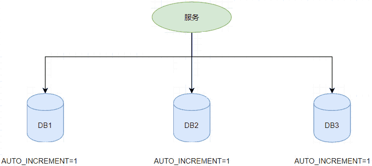

如上图，如果第一个订单存储在 DB1 上则订单 ID 为1，当一个新订单又入库了存储在 DB2 上订单 ID 也为1。我们系统的架构虽然是分布式的，但是在用户层应是无感知的，重复的订单主键显而易见是不被允许的。那么针对分布式系统如何做到主键唯一性呢？

## 分布式 ID 的设计需求

分布式 ID 作为分布式系统中必不可少的一环，很多地方都要用到分布式 ID。

一个最基本的分布式 ID 需要满足下面这些要求：

- 唯一性：ID 必须在所有服务或系统中全局唯一。
- 可扩展性：系统应能够在高负载下以高吞吐量生成 ID。
- 排序性：在某些用例中，ID 需要是有序或大致按时间排序的（例如用于排序）。
- 避免碰撞：两个 ID 相同的概率应当极小。
- 去中心化：ID 的生成应不依赖单一的生成器，避免单点故障。
- 可用性：即使在网络分区时，ID 生成系统也应能正常工作。
- 紧凑性：ID 的格式应在存储时高效，特别是在数据库或日志中。
- 透明性：有时 ID 需要嵌入元数据（如时间戳或机器 ID ）以便调试或追踪。
- 高性能：分布式 ID 的生成速度要快，对本地资源消耗要小。
- 高可用：生成分布式 ID 的服务要保证可用性无限接近于 100%。

除了这些之外，一个比较好的分布式 ID 还应保证：

- **安全**：ID 中不包含敏感信息。
- **有序递增**：如果要把 ID 存放在数据库的话，ID 的有序性可以提升数据库写入速度。并且，很多时候，我们还很有可能会直接通过 ID 来进行排序。
- **有具体的业务含义**：生成的 ID 如果能有具体的业务含义，可以让定位问题以及开发更透明化（通过 ID 就能确定是哪个业务）。
- **独立部署**：也就是分布式系统单独有一个发号器服务，专门用来生成分布式 ID。这样就生成 ID 的服务可以和业务相关的服务解耦。不过，这样同样带来了网络调用消耗增加的问题。总的来说，如果需要用到分布式 ID 的场景比较多的话，独立部署的发号器服务还是很有必要的。

## 常见的分布式 ID 解决方案

### 数据库

#### 数据库自增ID

在很多数据库中自增的主键ID，数据库本身是能够保证唯一的。

-   MySQL中的auto_increment。

-   Oracle中sequence。

我们在业务代码中，不需要做任何处理，这个ID的值，是由数据库自动生成的，并且它会保证数据的唯一性。

这种方式的优缺点也比较明显：

- **优点**：实现起来比较简单、ID 有序递增、存储消耗空间小，数据查询效率非常高
- **缺点**：
    -   支持的并发量不大、存在数据库单点问题（可以使用数据库集群解决，不过增加了复杂度）、ID 没有具体业务含义、安全问题（比如根据订单 ID 的递增规律就能推算出每天的订单量）、每次获取 ID 都要访问一次数据库（增加了对数据库的压力，获取速度也慢）
    -   只能保证单表的数据唯一性，如果跨表或者跨数据库，ID可能会重复。
    -   ID是自增的，生成规则很容易被猜透，有安全风险。
    -   ID是基于数据库生成的，在高并发下，可能会有性能问题。
    -   强依赖DB，当DB异常时整个系统不可用，属于致命问题。配置主从复制可以尽可能的增加可用性，但是数据一致性在特殊情况下难以保证，主从切换时的不一致可能会导致重复发号。
    -   ID发号性能瓶颈限制在单台MySQL的读写性能。

> 在一些老系统或者公司的内部管理系统中，可能会用数据库递增ID作为分布式ID的方案，这些系统的用户并发量一般比较小，数据量也不多。

以 MySQL 举例，我们通过下面的方式即可。

**1.创建一个数据库表。**

```sql
CREATE TABLE `sequence_id` (
  `id` bigint(20) unsigned NOT NULL AUTO_INCREMENT,
  `stub` char(10) NOT NULL DEFAULT '',
  PRIMARY KEY (`id`),
  UNIQUE KEY `stub` (`stub`)
) ENGINE=InnoDB DEFAULT CHARSET=utf8mb4;
```

`stub` 字段无意义，只是为了占位，便于我们插入或者修改数据。并且，给 `stub` 字段创建了唯一索引，保证其唯一性。

**2.通过 `replace into` 来插入数据。**

```java
BEGIN;
REPLACE INTO sequence_id (stub) VALUES ('stub');
SELECT LAST_INSERT_ID();
COMMIT;
```

插入数据这里，我们没有使用 `insert into` 而是使用 `replace into` 来插入数据，具体步骤是这样的：

- 第一步：尝试把数据插入到表中。

- 第二步：如果主键或唯一索引字段出现重复数据错误而插入失败时，先从表中删除含有重复关键字值的冲突行，然后再次尝试把数据插入到表中。

>   对于MySQL性能问题，可用如下方案解决：

在分布式系统中我们可以多部署几台机器，每台机器设置不同的初始值，且步长和机器数相等。比如有两台机器。设置步长step为2，TicketServer1的初始值为1（1，3，5，7，9，11…）、TicketServer2的初始值为2（2，4，6，8，10…）。这是Flickr团队在2010年撰文介绍的一种主键生成策略（[Ticket Servers: Distributed Unique Primary Keys on the Cheap ](https://code.flickr.net/2010/02/08/ticket-servers-distributed-unique-primary-keys-on-the-cheap/)）。

假设我们要部署N台机器，步长需设置为N，每台的初始值依次为0,1,2…N-1那么整个架构就变成了如下图所示：

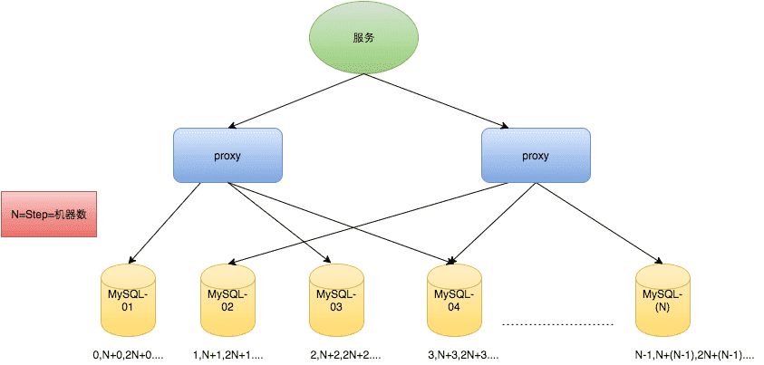

这种架构貌似能够满足性能的需求，但有以下几个缺点：

-   系统水平扩展比较困难，比如定义好了步长和机器台数之后，如果要添加机器该怎么做？
-   ID没有了单调递增的特性，只能趋势递增，这个缺点对于一般业务需求不是很重要，可以容忍。
-   数据库压力还是很大，每次获取ID都得读写一次数据库，只能靠堆机器来提高性能。

#### 数据库号段模式

在高并发的系统中，频繁访问数据库，会影响系统的性能。

可以对数据库自增ID方案做一个优化，一次生成一定步长的ID，比如：步长是1000，每次数据库自增1000，ID值从100001变成了101001。

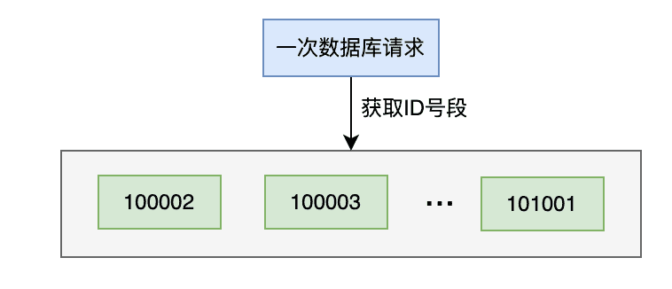

将100002~101001这个号段的1000个ID，缓存到服务器的内存中。

当有获取分布式ID的请求过来时，先从服务器的内存中获取数据，如果能够获取到，则直接返回。

如果没有获取到，则说明缓存的号段的数据已经被获取完了。这时需要重新从数据库中获取一次新号段的ID，缓存到服务器的内存中，这样下次又能直接从内存中获取ID了。

**数据库号段模式的优缺点:**

- **优点**：
    -   ID 有序递增、存储消耗空间小
    -   实现简单，对数据库的依赖减弱了，可以提升系统的性能。
- **缺点**：存在数据库单点问题（可以使用数据库集群解决，不过增加了复杂度）、ID 没有具体业务含义、安全问题（比如根据订单 ID 的递增规律就能推算出每天的订单量）

数据库的号段模式也是目前比较主流的一种分布式 ID 生成方式。像滴滴开源的[Tinyid](https://github.com/didi/tinyid/wiki/tinyid原理介绍)就是基于这种方式来做的。不过，TinyId 使用了双号段缓存、增加多 db 支持等方式来进一步优化。

以 MySQL 举例，我们通过下面的方式即可。

**1. 创建一个数据库表。**

```sql
CREATE TABLE `sequence_id_generator` (
  `id` int(10) NOT NULL,
  `current_max_id` bigint(20) NOT NULL COMMENT '当前最大id',
  `step` int(10) NOT NULL COMMENT '号段的长度',
  `version` int(20) NOT NULL COMMENT '版本号',
  `biz_type`    int(20) NOT NULL COMMENT '业务类型',
   PRIMARY KEY (`id`)
) ENGINE=InnoDB DEFAULT CHARSET=utf8mb4;
```

`current_max_id`字段和`step`字段主要用于获取批量 ID，获取的批量 id 为：`current_max_id ~ current_max_id+step`。

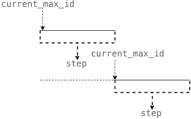

`version` 字段主要用于解决并发问题（乐观锁）,`biz_type` 主要用于表示业务类型。

**2. 先插入一行数据。**

```sql
INSERT INTO `sequence_id_generator` (`id`, `current_max_id`, `step`, `version`, `biz_type`)
VALUES (1, 0, 100, 0, 101);
```

**3. 通过 SELECT 获取指定业务下的批量唯一 ID**

```sql
SELECT `current_max_id`, `step`,`version` FROM `sequence_id_generator` where `biz_type` = 101
```

结果：

```plain
id current_max_id step version biz_type
1 0 100 0 101
```

**4. 不够用的话，更新之后重新 SELECT 即可。**

```sql
UPDATE sequence_id_generator SET current_max_id = 0+100, version=version+1 WHERE version = 0  AND `biz_type` = 101
SELECT `current_max_id`, `step`,`version` FROM `sequence_id_generator` where `biz_type` = 101
```

结果：

```plain
id current_max_id step version biz_type
1 100 100 1 101
```

相比于数据库主键自增的方式，**数据库的号段模式对于数据库的访问次数更少，数据库压力更小。**

另外，为了避免单点问题，可以使用主从模式来提高可用性。

#### 数据库的多主模式

为了解决上面单节点岩机问题，我们可以使用数据库的多主模式。

即有多个master数据库实例。

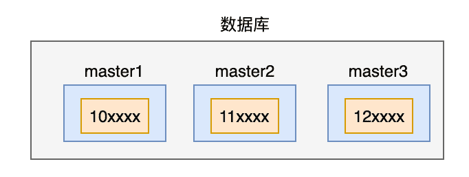

在生成ID的时候，一个请求只能写入一个master实例。

为了保证在不同的master实例下ID的唯一性，我们需要事先规定好每个master下的大的区间，比如：master1的数据是10开头的，master2的数据是11开头的，master3的数据是12开头的。

然后每个master，还是按照数据库号段模式来处理。

优点：避免了数据库号段模式的单节点岩机风险，提升了系统的稳定性，由于结合使用了号段模式，系统性能也是OK的。

缺点：

-   跨多个master实例下生成的ID，可能不是递增的。
-   **强依赖DB**，当DB异常时整个系统不可用。虽然配置主从复制可以尽可能的增加可用性，但是**数据一致性在特殊情况下难以保证**。主从切换时的不一致可能会导致重复发号，还有就是**ID发号性能瓶颈限制在单台MySQL的读写性能**。

#### Redis生成ID

除了使用数据库之外，Redis其实也能产生自增ID。

我们可以使用Redis中的incr命令：

```sql
redis> SET ID_VALUE 1000
OK

redis> INCR ID_VALUE
(integer) 1001

redis> GET ID_VALUE
"1001"
```

给ID_VALUE设置了值是1000，然后使用INCR命令，可以每次都加1。

这个方案跟我们之前讨论过的方案1（数据库自增ID）的方案类似。

**Redis 方案的优缺点：**

- **优点**：性能不错并且生成的 ID 是有序递增的，避免了跨表或者跨数据库ID重复的问题。
- **缺点**：
    -   和数据库主键自增方案的缺点类似，ID是自增的，生成规则很容易被猜透，有安全风险。
    -   并且Redis可能也存在单节点，岩机的风险。

为了提高可用性和并发，我们可以使用 Redis Cluster，不过集群后，又要和传统数据库一样，设置分段和步长。

除了 Redis Cluster 之外，你也可以使用开源的 Redis 集群方案[Codis](https://github.com/CodisLabs/codis)（大规模集群比如上百个节点的时候比较推荐）。

#### MongoDB ObjectId

除了 Redis 之外，MongoDB ObjectId 经常也会被拿来当做分布式 ID 的解决方案。

MongoDB ObjectId 一共需要 12 个字节存储：

- 0~3：时间戳
- 3~6：代表机器 ID
- 7~8：机器进程 ID
- 9~11：自增值

**MongoDB 方案的优缺点：**

- **优点**：性能不错并且生成的 ID 是有序递增的
- **缺点**：需要解决重复 ID 问题（当机器时间不对的情况下，可能导致会产生重复 ID）、有安全性问题（ID 生成有规律性）

#### Zookeeper生成ID

Zookeeper主要通过其znode数据版本来生成序列号，可以生成32位和64位的数据版本号，客户端可以使用这个版本号来作为唯一的序列号。

由于需要高度依赖Zookeeper，并且是同步调用API，如果在竞争较大的情况下，需要考虑使用分布式锁。

因此，性能在高并发的分布式环境下，也不太理想。

很少人会使用Zookeeper来生成唯一ID。

### 算法

#### UUID

UUID (Universally Unique IDentifier) 通用唯一识别码，也称为 GUID (Globally Unique IDentifier) 全球唯一标识符。

UUID是一个长度为128位的标志符，能够在时间和空间上确保其唯一性。

UUID 包含 32 个 16 进制数字（8-4-4-4-12）。

UUID最初应用于Apollo网络计算系统，随后在Open Software Foundation（OSF）的分布式计算环境（DCE）中得到应用。

可让分布式系统可以不借助中心节点，就可以生成唯一标识，比如唯一的ID进行日志记录。

UUID是基于时间戳、MAC地址、随机数等多种因素生成，理论上全球范围内几乎不可能重复。

UUID 的优缺点：

- **优点**：
    -   生成速度通常比较快、简单易用
    -   UUID不借助中心节点，可以保持程序的独立性，可以保证程序在不同的数据库之间，做数据迁移，都不受影响。
- **缺点**：存储消耗空间大（32 个字符串，128 位）、不安全（基于 MAC 地址生成 UUID 的算法会造成 MAC 地址泄露)、无序（非自增）、没有具体业务含义、需要解决重复 ID 问题（当机器时间不对的情况下，可能导致会产生重复 ID）

使用 UUID 作为 MySQL 数据库主键的时候就非常不合适：

- 数据库主键要尽量越短越好，而 UUID 的消耗的存储空间比较大（32 个字符串，128 位）。
- 对MySQL索引不利：如果作为数据库主键，在InnoDB引擎下，UUID的无序性可能会引起数据位置频繁变动，严重影响性能。

>   在分布式日志系统或者分布式链路跟踪系统中，可以使用UUID生成唯一标识，用于串联请求的日志。

在Java中可以通过UUID的randomUUID方法获取唯一字符串：

```java
import java.util.UUID;

public class UuidTest {
    public static void main(String[] args) {
        String uuid = UUID.randomUUID().toString();
        System.out.println(uuid);
    }
}
```

运行结果：

```java
22527933-d0a7-4c2b-a377-aeb438a31b02
```

#### Snowflake雪花算法

详细讲解：[Snowflake雪花算法](./雪花算法（Snowflake）.md)

#### Mist 薄雾算法

详细讲解：[Mist 薄雾算法](./Mist 薄雾算法.md)

### 开源框架

#### Leaf

leaf-segment 方案

-   优化：双buffer + 预分配
-   容灾：Mysql DB 一主两从，异地机房，半同步方式
-   缺点：如果用segment号段式方案：id是递增，可计算的，不适用于订单ID生成场景，比如分别在两天中午12点分别下单，通过订单id号相减就能大致计算出公司一天的订单量，这个是不能忍受的。

leaf-snowflake方案

-   使用Zookeeper持久顺序节点的特性自动对snowflake节点配置workerID
    1.  启动Leaf-snowflake服务，连接Zookeeper，在leaf_forever父节点下检查自己是否已经注册过（是否有该顺序子节点）。
    2.  如果有注册过直接取回自己的workerID（zk顺序节点生成的int类型ID号），启动服务。
    3.  如果没有注册过，就在该父节点下面创建一个持久顺序节点，创建成功后取回顺序号当做自己的workerID号，启动服务。
-   缓存workerID，减少第三方组件的依赖
-   由于强依赖时钟，对时间的要求比较敏感，在机器工作时NTP同步也会造成秒级别的回退，建议可以直接关闭NTP同步。要么在时钟回拨的时候直接不提供服务直接返回ERROR_CODE，等时钟追上即可。或者做一层重试，然后上报报警系统，更或者是发现有时钟回拨之后自动摘除本身节点并报警

进一步请查阅：[Leaf Detail](./Leaf Detail.md)

#### Tinyid

Tinyid是滴滴用Java开发的一款分布式id生成系统，基于数据库号段算法实现。

Tinyid是在美团的ID生成算法Leaf的基础上扩展而来，支持数据库多主节点模式，它提供了REST API和JavaClient两种获取方式，相对来说使用更方便。

但跟美团Leaf不同的是，Tinyid只支持号段一种模式，并不支持Snowflake模式。

基于数据库号段模式的简单架构方案：
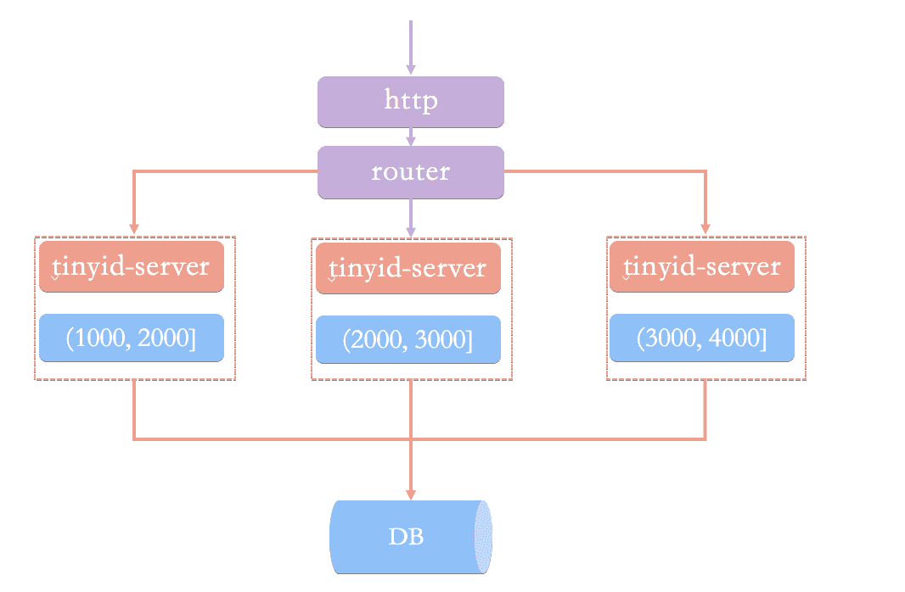

在这种架构模式下，我们通过 HTTP 请求向发号器服务申请唯一 ID。负载均衡 router 会把我们的请求送往其中的一台 tinyid-server。

这种方案主要有下面这 2 个问题：

- 获取新号段的情况下，程序获取唯一 ID 的速度比较慢。
- 需要保证 DB 高可用，这个是比较麻烦且耗费资源的。

除此之外，HTTP 调用也存在网络开销。ID生成系统向外提供http服务，请求经过负载均衡router，能够路由到其中一台tinyid-server，这样就能从事先加载好的号段中获取一个ID了。

如果号段还没有加载，或者已经用完了，则需要向db再申请一个新的可用号段，多台server之间因为号段生成算法的原子性，而保证每台server上的可用号段不重，从而使id生成不重。

但也带来了这些问题：

- 当id用完时需要访问db加载新的号段，db更新也可能存在version冲突，此时id生成耗时明显增加。
- db是一个单点，虽然db可以建设主从等高可用架构，但始终是一个单点。
- 使用http方式获取一个id，存在网络开销，性能和可用性都不太好。

为了解决这些这些问题：增加了tinyid-client本地生成ID、使用双号段缓存、增加多 db 支持提高服务的稳定性。

最终的架构方案如下：
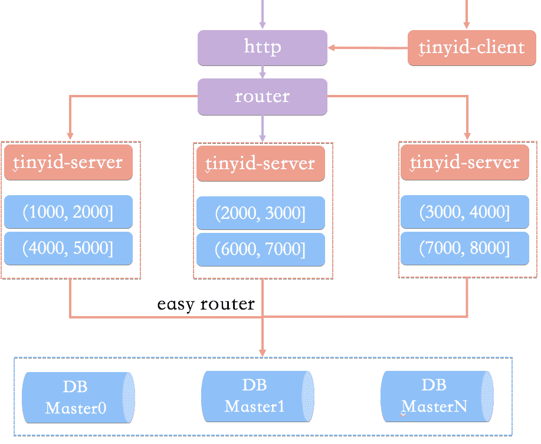

相比于基于数据库号段模式的简单架构方案，Tinyid 方案主要做了下面这些优化：

- **双号段缓存**：为了避免在获取新号段的情况下，程序获取唯一 ID 的速度比较慢。Tinyid 中的号段在用到一定程度的时候，就会去异步加载下一个号段，保证内存中始终有可用号段。
- **增加多 db 支持**：支持多个 DB，并且，每个 DB 都能生成唯一 ID，提高了可用性。
- **增加 tinyid-client**：
    -   纯本地操作，无 HTTP 请求消耗，性能和可用性都有很大提升。
    -   tinyid-client向tinyid-server发送请求来获取可用号段，之后在本地构建双号段、id生成，如此id生成则变成纯本地操作，性能大大提升。

Tinyid 的优缺点这里就不分析了，结合数据库号段模式的优缺点和 Tinyid 的原理就能知道。

如果你想知道滴滴Tinyid的更多细节，可以看看Github地址：https://github.com/didi/tinyid

#### UidGenerator

百度 UID-Generator 使用 Java 语言，基于雪花算法实现。

UidGenerator以组件形式工作在应用项目中，支持自定义workerId位数和初始化策略，从而适用于docker等虚拟化环境下实例自动重启、漂移等场景。

在实现上，UidGenerator通过借用未来时间来解决sequence天然存在的并发限制。

采用RingBuffer来缓存已生成的UID，并行化UID的生产和消费，同时对CacheLine补齐，避免了由RingBuffer带来的硬件级「伪共享」问题。最终单机QPS可达600万。

UidGenerator 对 Snowflake(雪花算法)进行了改进，生成的唯一 ID 组成如下：

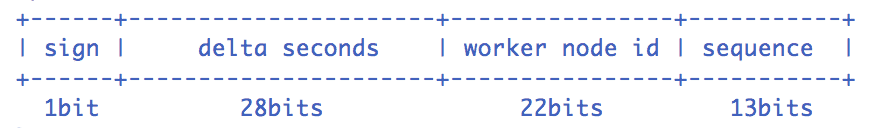

- sign(1bit)：固定1bit符号标识，即生成的UID为正数。
- delta seconds (28 bits) ：当前时间，相对于时间基点"2016-05-20"的增量值，单位：秒，最多可支持约8.7年
- worker id (22 bits)：机器id，最多可支持约420w次机器启动。内置实现为在启动时由数据库分配，默认分配策略为用后即弃，后续可提供复用策略。
- sequence (13 bits)：每秒下的并发序列，13 bits可支持每秒8192个并发。

可以看出，和原始 Snowflake生成的唯一 ID 的组成不太一样。并且，上面这些参数我们都可以自定义。

其中 workId （机器 id），最多可支持约420w次机器启动。内置实现为在启动时由数据库分配（表名为 WORKER_NODE），默认分配策略为用后即弃，后续可提供复用策略。

```sql
DROP TABLE IF EXISTS WORKER_NODE;
CREATE TABLE WORKER_NODE
(
    ID          BIGINT      NOT NULL AUTO_INCREMENT COMMENT 'auto increment id',
    HOST_NAME   VARCHAR(64) NOT NULL COMMENT 'host name',
    PORT        VARCHAR(64) NOT NULL COMMENT 'port',
    TYPE        INT         NOT NULL COMMENT 'node type: ACTUAL or CONTAINER',
    LAUNCH_DATE DATE        NOT NULL COMMENT 'launch date',
    MODIFIED    TIMESTAMP   NOT NULL COMMENT 'modified time',
    CREATED     TIMESTAMP   NOT NULL COMMENT 'created time',
    PRIMARY KEY (ID)
) COMMENT='DB WorkerID Assigner for UID Generator',ENGINE = INNODB;
```

##### DefaultUidGenerator 实现

`DefaultUidGenerator` 就是正常的根据时间戳和机器位还有序列号的生成方式，和雪花算法很相似，对于时钟回拨也只是抛异常处理。仅有一些不同，如**以秒为为单位**而不再是毫秒和支持Docker等虚拟化环境。

```java
protected synchronized long nextId() {
    long currentSecond = getCurrentSecond();

    // Clock moved backwards, refuse to generate uid
    if (currentSecond < lastSecond) {
        long refusedSeconds = lastSecond - currentSecond;
        throw new UidGenerateException("Clock moved backwards. Refusing for %d seconds", refusedSeconds);
    }

    // At the same second, increase sequence
    if (currentSecond == lastSecond) {
        sequence = (sequence + 1) & bitsAllocator.getMaxSequence();
        // Exceed the max sequence, we wait the next second to generate uid
        if (sequence == 0) {
            currentSecond = getNextSecond(lastSecond);
        }

    // At the different second, sequence restart from zero
    } else {
        sequence = 0L;
    }

    lastSecond = currentSecond;

    // Allocate bits for UID
    return bitsAllocator.allocate(currentSecond - epochSeconds, workerId, sequence);
}
```

如果你要使用 DefaultUidGenerator 的实现方式的话，以上划分的占用位数可通过 spring 进行参数配置。

```xml
<bean id="defaultUidGenerator" class="com.baidu.fsg.uid.impl.DefaultUidGenerator" lazy-init="false">
    <property name="workerIdAssigner" ref="disposableWorkerIdAssigner"/>

    <!-- Specified bits & epoch as your demand. No specified the default value will be used -->
    <property name="timeBits" value="29"/>
    <property name="workerBits" value="21"/>
    <property name="seqBits" value="13"/>
    <property name="epochStr" value="2016-09-20"/>
</bean>
```

##### CachedUidGenerator 实现

sequence决定了UidGenerator的并发能力，13 bits的 sequence 可支持 8192/s 的并发，但现实中很有可能不够用，从而诞生了 CachedUidGenerator。

`CachedUidGenerator`是官方建议的性能较高的生成方式，使用 RingBuffer环形数组缓存生成的id。数组每个元素成为一个slot。RingBuffer容量，默认为Snowflake算法中sequence最大值（$2^{13}$ = 8192）。可通过 boostPower 配置进行扩容，以提高 RingBuffer 读写吞吐量。

Tail指针、Cursor指针用于环形数组上读写slot：

-   **Tail指针**：表示Producer生产的最大序号(此序号从0开始，持续递增)。Tail不能超过Cursor，即生产者不能覆盖未消费的slot。当Tail已赶上curosr，此时可通过rejectedPutBufferHandler指定PutRejectPolicy
-   **Cursor指针**：表示Consumer消费到的最小序号(序号序列与Producer序列相同)。Cursor不能超过Tail，即不能消费未生产的slot。当Cursor已赶上tail，此时可通过rejectedTakeBufferHandler指定TakeRejectPolicy

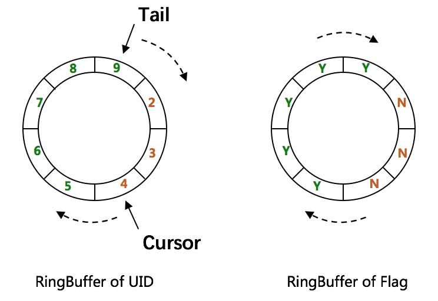

CachedUidGenerator采用了双RingBuffer，Uid-RingBuffer用于存储Uid、Flag-RingBuffer用于存储Uid状态(是否可填充、是否可消费)。

由于数组元素在内存中是连续分配的，可最大程度利用CPU cache以提升性能。但同时会带来「伪共享」FalseSharing问题，为此在Tail、Cursor指针、Flag-RingBuffer中采用了CacheLine 补齐方式。

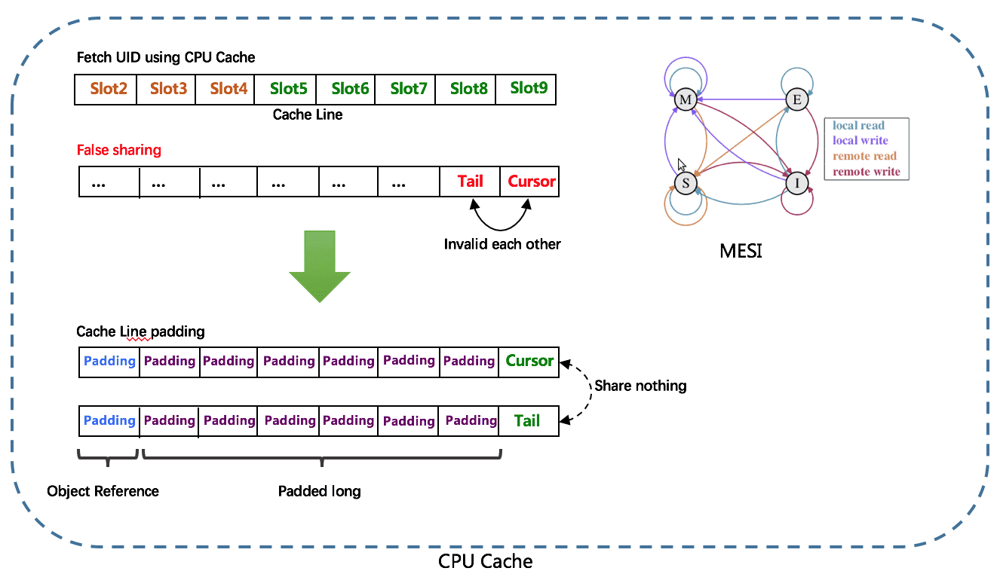

**RingBuffer填充时机**

-   **初始化预填充**：RingBuffer初始化时，预先填充满整个RingBuffer。
-   **即时填充**：Take消费时，即时检查剩余可用slot量(tail - cursor)，如小于设定阈值，则补全空闲slots。阈值可通过paddingFactor来进行配置，请参考Quick Start中CachedUidGenerator配置。
-   **周期填充**：通过Schedule线程，定时补全空闲slots。可通过scheduleInterval配置，以应用定时填充功能，并指定Schedule时间间隔。

>   自 18 年后，UidGenerator 就基本没有再维护了。想了解更多细节可以看看Github地址：https://github.com/baidu/uid-generator

#### IdGenerator(个人)

和 UidGenerator、Leaf 一样，[IdGenerator](https://github.com/yitter/IdGenerator) 也是一款基于 Snowflake(雪花算法)的唯一 ID 生成器。

IdGenerator 有如下特点：

- 生成的唯一 ID 更短；
- 兼容所有雪花算法（号段模式或经典模式，大厂或小厂）；
- 原生支持 C#/Java/Go/C/Rust/Python/Node.js/PHP(C 扩展)/SQL/ 等语言，并提供多线程安全调用动态库（FFI）；
- 解决了时间回拨问题，支持手工插入新 ID（当业务需要在历史时间生成新 ID 时，用本算法的预留位能生成 5000 个每秒）；
- 不依赖外部存储系统；
- 默认配置下，ID 可用 71000 年不重复。

IdGenerator 生成的唯一 ID 组成如下：

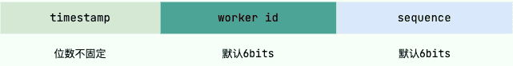

- **timestamp (位数不固定)**：时间差，是生成 ID 时的系统时间减去 BaseTime(基础时间，也称基点时间、原点时间、纪元时间，默认值为 2020 年) 的总时间差（毫秒单位）。初始为 5bits，随着运行时间而增加。如果觉得默认值太老，你可以重新设置，不过要注意，这个值以后最好不变。
- **worker id (默认 6 bits)**：机器 id，机器码，最重要参数，是区分不同机器或不同应用的唯一 ID，最大值由 `WorkerIdBitLength`（默认 6）限定。如果一台服务器部署多个独立服务，需要为每个服务指定不同的 WorkerId。
- **sequence (默认 6 bits)**：序列数，是每毫秒下的序列数，由参数中的 `SeqBitLength`（默认 6）限定。增加 `SeqBitLength` 会让性能更高，但生成的 ID 也会更长。

## 选择解决方案的考虑因素

每种解决方案适合不同的用例，具体选择取决于扩展性、排序和存储大小等因素。

- 吞吐量需求：如果系统需要每秒生成数百万个 ID，Snowflake 或 Redis-based 方案比 UUID 更合适。
- 有序还是随机：如果 ID 需要按时间排序，可以考虑 Snowflake、KSUID。
- 存储限制：与 KSUID 相比，Snowflake ID 更小，如果存储大小至关重要，可以选择更紧凑的格式。
- 元数据：如果需要在ID中包含元数据，Snowflake ID 或自定义哈希方案可以编码时间戳或机器 ID 等信息。

以上每种模式都有自己的缺点，实际上大多是以上几种模式的结合来运用的，所以大方向是两个方案：

-   综合后的缓存+号段
-   雪花的改良，天然的唯一性。

## 推荐阅读

-   [分布式ID生成服务的技术原理和项目实战](https://mp.weixin.qq.com/s/bFDLb6U6EgI-DvCdLTq_QA)

-   [分布式ID介绍&实现方案总结](https://blog.csdn.net/kfashfasf/article/details/135934533)

