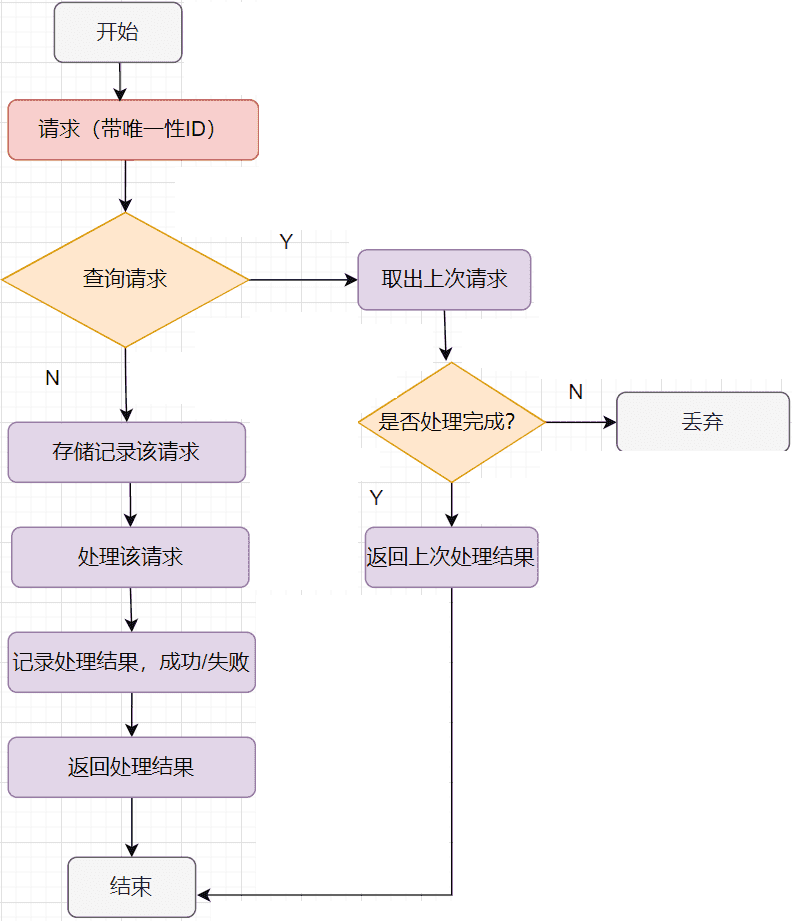

# 分布式场景下的重试机制

为什么要重试？什么时候重试？

分布式场景下，随着业务需求的迭代，不可避免会出现分布式事务问题。即使勤劳的程序员们可以加班修复数据，但数据不一致导致的系统不可用时间依然存在。为了保障系统的可用性和数据的最终一致性，通过建立合理的重试机制，让系统拥有一定的自愈能力，提高修复数据的同时，减少人工介入，解放生产力。

## 为什么要重试

### 悲观思维

>   墨菲定律：任何可能出错的事情最终都会出错！

分布式场景下的各种问题，最终都会出现。网络抖动、单点故障、服务超时、服务异常、系统抖动（jvm的stw、mysql的flush(redolog写满等)、redis的内存回收）。如果忽略这些问题，将会直接降低服务的健壮性，轻则影响用户体验，重则引起系统故障。因此在做技术方案设计与实现时，需要充分考虑各种失败的场景，针对性做**防御性编程**。

### 容错编程

容错编程是一种旨在确保应用程序的可靠性和稳定性的编程思想

常见容错措施：

1.  异常处理：通过捕获和处理异常避免应用程序崩溃
2.  错误处理：通过检查错误代码并采取适当的措施，通过重试或回滚，来处理错误
3.  重试机制：在出现错误时，重试重新执行代码块，直到成功或达到最大尝试次数
4.  备份机制：在主要系统出现故障时，切换到备用系统以保持应用程序的正常运行
5.  日志记录：记录错误和异常信息以便以后排查问题

## 什么时候进行重试

显而易见，失败的时候重试😂

而服务间调用失败又分两种场景：业务异常和超时。

### 调用失败的场景

#### 业务异常

业务异常表示本次调用是完整的，由于下游系统业务校验不通过返回失败信息。

```json
{
    "code": 500001,
    "msg": "订单不存在"
}
```

类似上面的Response，可能上游系统在请求接口时传错参数，或者由于数据同步延迟，暂时没有此订单。对于这种失败场景，**调用方是明确知道对方收到请求的**，可以放心的根据业务场景重试。如果是数据同步延迟，调用方可能就会在数据同步完成时重试成功。

#### 超时

超时可分为：

-   连接超时（Connection Timeout）：建立连接超时，网络问题，或者服务无法响应（服务宕机、连接数占满等原因）
-   读超时（Read Timeout：连接建立成功，服务端响应超时或响应体太大，导致读取超时。

## 失败重试的风险

如果是**接口提供方**有熔断等快速失败的策略还好，否则频繁的重试可能会增加下游系统的压力，导致下游系统RT增加，甚至Web容器线程打满导致服务不可用

### 超时重试的风险

-   下游服务宕机需要重启时，导致刚启动就被宕机期间积攒的重试请求打满再次宕机，形成无法启动的困境
-   接口响应体过大导致的读超时，多次重试导致网络中存在大量数据包，造成网络拥塞
-   下游服务逻辑复杂导致的超时，多次重试加大下游服务的压力，导致下游服务Web服务线程打满或者OOM
-   其他场景……

### 超时重试风险更大

-   超时时间的设置至关重要，尽量避免多层级调用关系a->b->c，超时时间应该a>b>c，甚至a>b+c。否则可能会一直重试，形成DDoS攻击效果
-   非幂等写服务应避免重试，或者提前生成唯一流水号来保证写服务操作通过判断流水号来实现幂等。
-   经常检查慢查询，超时严重考虑服务降级，修复后再取消降级
-   除了控制单次超时时间，还要控制好用户能忍受的最坏超时时间（用户可能由于等待时间过长而重复触发，响应时间=单次超时时间*重试次数）
-   重试次数与频率的控制，防止对下游服务造成过大的压力

## 避免重试的风险

### 超时时间的配置

合理配置超时时间，多层级调用要注意每层超时时间要大于其底层超时时间之和

### 幂等

一次请求和重复多次请求对资源的影响是一致的，就称该操作是幂等的

#### 编写符合RESTful的API

RESTful是一个形容词，描述了一种软件架构风格REST。Representational State Transfer，简称REST，表现层状态转换。RESTful约定：

-   以资源作为URI（对应RequestMapping）
-   对资源的获取、创建、修改和删除对应HTTP协议提供的GET、POST、PUT和DELETE方法

HTTP Method的幂等性：

-   GET请求是获取资源，并不会修改资源，所以天然幂等
-   DELETE请求删除资源，虽然改变了资源状态，但是多次删除对系统的作用是相同的，也是幂等的
-   PUT请求会修改资源，是否幂等要看具体逻辑。
-   POST请求表示创建，是否幂等要看业务逻辑，如需幂等可以通过数据库唯一约束实现。

#### 幂等的设计

无论哪种设计，都需要一个全局唯一的ID，来标记这个请求是独一无二的。

##### 幂等处理流程



##### 幂等方案

1.  简单场景直接通过数据库唯一约束实现
2.  客户端提交场景：PRG（POST/Redirect/GET）
3.  用户在网页表单中填写数据，通过POST请求服务器，创建新资源或现有数据
4.  服务器收到POST请求后，对请求参数进行有效性验证并持久化存储，并在操作成功后不直接返回处理结果，而是通过HTTP响应302或303实现重定向，指示客户端发起一个新的GET请求取访问一个特定的URL
5.  客户端重定向到新的URL，获取之前POST操作结果并展示
6.  用户即使重新发起POST请求，浏览器会根据缓存重新发起GET请求，而不是POST，从而避免重复提交
7.  Token机制：业务流程中提前存储token，并在首次调用时删除token，后续重复调用判断token不存在避免重复请求。
8.  其他方案。

### 背压

#### 概念

Backpressure，是一个异步编程中的概念，为了保证超负荷情况下系统的吞吐量，限制数据流的生产速率来适应消费速率，使得生产者不会产生过多的数据流，从而保证消费者的实时消耗。

在重试机制中，用于防止无脑重试导致下游系统压力过大，甚至崩溃。

#### 原理

背压控制的实现机制通常是消费者和生产者之间建立一个通信通道，通过这个通道传递关于消费者能力的信息，以便生产者可以通过不产生过多数据的情况下，维护一条相对稳定的数据流。

#### 实现

常见的背压实现机制：

-   令牌桶算法：消费者可以借助令牌桶算法控制其可用的资源，并通过消费者者何时需要令牌，从而控制生产者产生
-   订阅/发布模式：消费者发出反馈消息给生产者，从而动态控制生产者输出数据的速率
-   缓冲区大小控制：设置一定大小的缓冲区，生产者生产的数据会存储在缓冲区中，当缓冲区满时，生产者停止工作，直到消费者重新处理之后，才能再次开始数据生产。
-   信号量机制，由消费者通过信号量通知生产者何时可以生产数据。

示例：tcp流量控制。

### 退避策略

对于一些暂时性的错误，比如网络抖动等，可能立即重试还是会失败，通常等待一小会儿再重试成功率会更高，并且可以打散上游重试时间，防止同时重试导致下游流量激增的问题。

决定等待多久再重试的方法就叫做退避策略，常见的退避策略有：

1.  线性退避：每次等待固定的时间后重试
2.  随机退避：在一定范围内随机等待一个时间后重试
3.  指数退避：连续重试时，每次等待时间都是前一次的倍数 $2^n$ second delay

### 防止Retry Storm

当请求链路过长时，如果每一层都进行重试，可能会导致调用量指数级扩大，即使系统集成Sentinel等熔断限流组件，重试不再是指数增长，但还是会随着链路的层级增长而扩大调用次数，因此链路层面的特殊重试机制非常重要。Google SRE中指出Google内部使用特殊错误码的方式放置重试风暴：

-   约定一个特殊的status code，表示失败，但别重试
-   任何一级重试失败后，生成该status code并返回给上层
-   上层收到该status code后，停止对这个下游的重试，并将错误码返回给自己的上层

这种方法理想情况下，只有最下层发生重试，上游收到错误码后都不会重试，链路整体放大倍数就是单层重试的次数。
