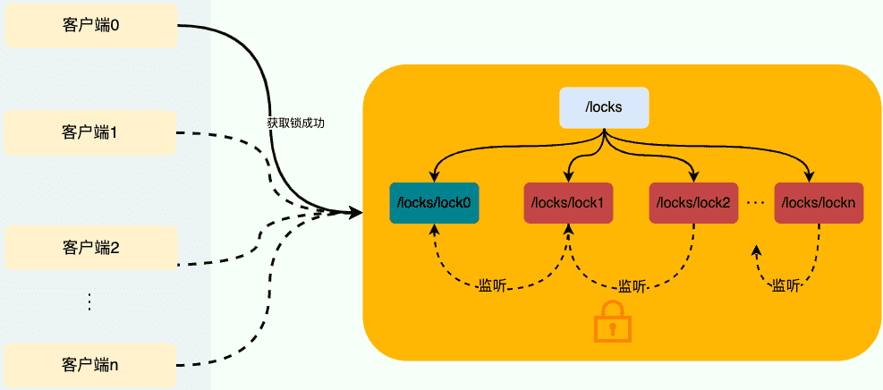
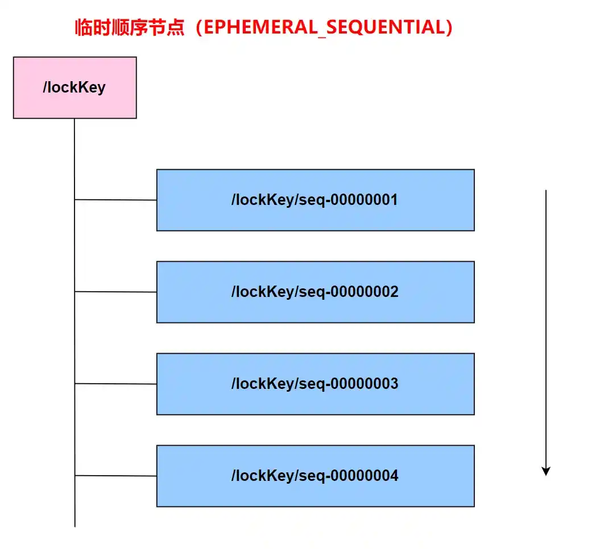
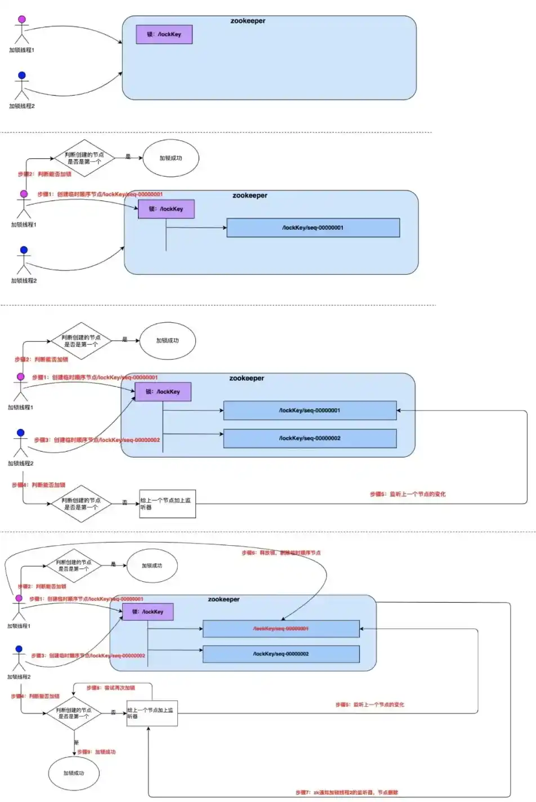
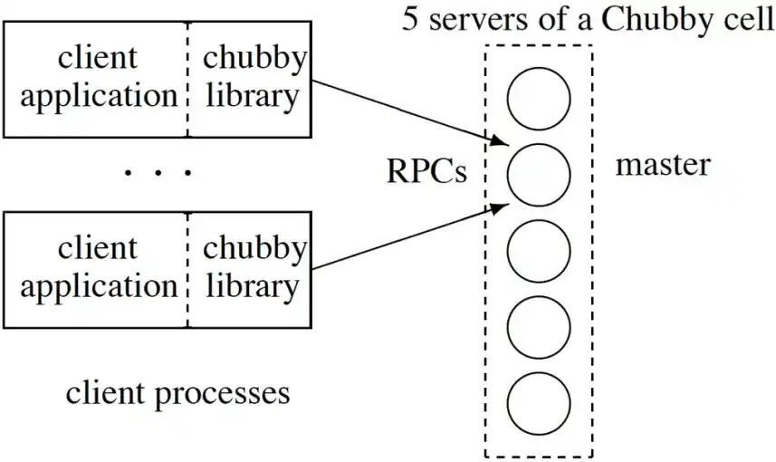
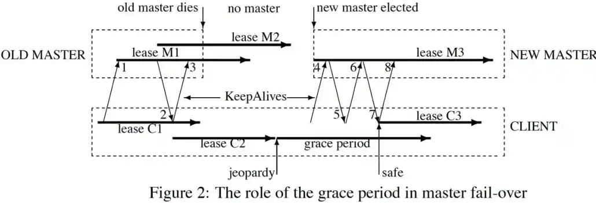

# 分布式锁常见实现方案总结

## 为什么需要分布式锁？

分布式系统下，不同的服务/客户端通常运行在独立的进程上。如果多个进程共享同一份资源的话，使用本地锁就没办法实现资源的互斥访问了。于是，**分布式锁** 就诞生了。

举个例子：系统的订单服务一共部署了 3 份，都对外提供服务。用户下订单之前需要检查库存，为了防止超卖，这里需要加锁以实现对检查库存操作的同步访问。由于订单服务位于不同的 JVM 进程中，本地锁在这种情况下就没办法正常工作了。我们需要用到分布式锁，这样的话，即使多个线程不在同一个 JVM 进程中也能获取到同一把锁，进而实现共享资源的互斥访问。

## 分布式锁的设计原则

> 分布式锁的最小设计原则：**安全性**和**有效性**

一个最基本的分布式锁需要满足：

- **互斥**：任意一个时刻，锁只能被一个线程持有。
- **无死锁**（属于有效性）：即使锁定资源的客户端崩溃或被分区，也总是可以获得锁。如果某个客户端获得锁之后花了太长时间处理，或者客户端发生了故障，锁无法释放会导致整个处理流程无法进行下去，所以要避免死锁。最常见的是在超时机制中通过设置一个 **TTL(Time To Live，存活时间) 来避免死锁。**
- **容错性**（属于有效性）：为避免单点故障，锁服务需要具有一定容错性。大体有两种容错方式，**一种是锁服务本身是一个集群，**能够自动故障切换(ZooKeeper、etcd)；另一种是客户端向多个独立的锁服务发起请求，其中某个锁服务故障时仍然可以从其他锁服务读取到锁信息(Redlock)，代价是一个客户端要获取多把锁，并且要求每台机器的时钟都是一样的，否则 TTL 会不一致，可能有的机器会提前释放锁，有的机器会太晚释放锁，导致出现问题。
- **高可用**：锁服务是高可用的，当一个锁服务出现问题，能够自动切换到另外一个锁服务。并且，即使客户端的释放锁的代码逻辑出现问题，锁最终一定还是会被释放，不会影响其他线程对共享资源的访问。这一般是通过超时机制实现的。
- **可重入**：一个节点获取了锁之后，还可以再次获取锁。

除了上面这三个基本条件之外，一个好的分布式锁还需要满足下面这些条件：

- **高性能**：获取和释放锁的操作应该快速完成，并且不应该对整个系统的性能造成过大影响。
- **非阻塞**：如果获取不到锁，不能无限期等待，避免对系统正常运行造成影响。
- **同源性**：A加的锁，不能被B解锁

## 分布式锁的常见实现方式有哪些？

想要实现分布式锁，必须借助一个外部系统，所有进程都去这个系统上申请「加锁」。

而这个外部系统，必须要实现「互斥」的能力，即两个请求同时进来，只会给一个进程返回成功，另一个返回失败（或等待）。

>   这个外部系统，可以是 MySQL，也可以是 Redis、ZooKeeper、Etcd。但在高并发业务场景下，为了追求更好的性能，我们通常会选择使用 Redis。

- 基于数据库实现分布式锁
    - 基于数据库表（锁表，很少使用）
    - 乐观锁(基于版本号)
    - 悲观锁(基于排它锁)
- 基于分布式键值存储系统比如 Redis、Etcd 实现分布式锁：
    - 单个Redis实例：setnx(key, 当前时间+过期时间) + Lua
    - Redis集群模式：Redlock
- 基于 zookeeper实现分布式锁
    - 临时有序节点来实现的分布式锁，Curator

关系型数据库的方式一般是通过唯一索引或者排他锁实现。不过，一般不会使用这种方式，问题太多比如性能太差、不具备锁失效机制。

基于 ZooKeeper 或者 Redis 实现分布式锁这两种实现方式要用的更多一些。

## 基于 MySQL 的分布式锁（ShedLock）

使用 ShedLock 需要在 MySQL 数据库创建一张加锁用的表：

```sql
CREATE TABLE shedlock
(
    name VARCHAR(64),
    lock_until TIMESTAMP(3) NULL,
    locked_at TIMESTAMP(3) NULL,
    locked_by VARCHAR(255),
    PRIMARY KEY (name)
)
```

加锁：

通过插入同一个 name(primary key)，或者更新同一个 name 来抢，对应的 intsert、update 的 SQL 为：

```sql
INSERT INTO shedlock
(name, lock_until, locked_at, locked_by)
VALUES
(锁名字,  当前时间+最多锁多久,  当前时间, 主机名)

UPDATE shedlock
SET lock_until = 当前时间+最多锁多久,
locked_at = 当前时间,
locked_by = 主机名 WHERE name = 锁名字 AND lock_until <= 当前时间
```

释放锁：

通过设置 lock_until 来实现释放，再次抢锁的时候需要通过 lock_util 来判断锁失效了没。对应的 SQL 为：

```sql
UPDATE shedlock
SET lock_until = lockTime WHERE name = 锁名字
```

问题分析：

1.  单点问题；
2.  主从同步问题。假如使用全同步模式，分布式锁将会有性能上的问题。

## 基于 Redis 实现分布式锁

可参考：[Redis、ZooKeeper、Etcd，谁有最好用的分布式锁？](https://mp.weixin.qq.com/s/yZC6VJGxt1ANZkn0SljZBg)

## 基于 ZooKeeper 实现分布式锁

ZooKeeper 相比于 Redis 实现分布式锁，除了提供相对更高的可靠性之外，在功能层面还有一个非常有用的特性：**Watch 机制**。这个机制可以用来实现公平的分布式锁。不过，使用 ZooKeeper 实现的分布式锁在性能方面相对较差，因此如果对性能要求比较高的话，ZooKeeper 可能就不太适合了。

### ZooKeeper 的节点类型

ZooKeeper 的数据存储结构就像一棵树，这棵树由节点组成，这种节点叫做 Znode，它是 ZooKeeper 中数据的最小单元。

Znode 分为四种类型：

-   持久节点 （`PERSISTENT`）：默认的节点类型。一旦创建就一直存在即使 ZooKeeper 集群宕机，直到将其删除。创建节点的客户端与 ZooKeeper 断开连接后，该节点依旧存在 。
-   临时节点（`EPHEMERAL`）：和持久节点相反，临时节点的生命周期是与 **客户端会话（session）** 绑定的，**会话消失则节点消失**，当创建节点的客户端与 ZooKeeper 断开连接后，临时节点会被删除。**临时节点只能做叶子节点**，不能创建子节点。
-   持久节点顺序节点（`PERSISTENT_SEQUENTIAL`）：所谓顺序节点，就是在创建节点时，ZooKeeper 根据创建的顺序给该节点名称进行编号；除了具有持久（PERSISTENT）节点的特性之外，子节点的名称还具有顺序性。比如 `/node1/app0000000001`、`/node1/app0000000002` 。
-   临时顺序节点（`EPHEMERAL_SEQUENTIAL`）：【==使用该类型节点实现分布式锁==】，顾名思义，临时顺序节点结合和临时节点和顺序节点的特点：在创建节点时，ZooKeeper 根据创建的时间顺序给该节点名称进行编号；当创建节点的客户端与 ZooKeeper 断开连接后，临时节点会被删除。除了具备临时（EPHEMERAL）节点的特性之外，子节点的名称还具有顺序性。

### 为什么要用临时顺序节点？

临时节点相比持久节点，最主要的是对会话失效的情况处理不一样，临时节点会话消失则对应的节点消失。这样的话，如果客户端发生异常导致没来得及释放锁也没关系，会话失效节点自动被删除，不会发生死锁的问题。

使用 Redis 实现分布式锁的时候，我们是通过过期时间来避免锁无法被释放导致死锁问题的，而 ZooKeeper 直接利用临时节点的特性即可。

假设不使用顺序节点的话，所有尝试获取锁的客户端都会对持有锁的子节点加监听器。当该锁被释放之后，势必会造成所有尝试获取锁的客户端来争夺锁，这样对性能不友好。使用顺序节点之后，只需要监听前一个节点就好了，对性能更友好。

### 如何基于 ZooKeeper 实现分布式锁？

ZooKeeper 分布式锁是基于 **临时顺序节点** 和 **Watcher（事件监听器）** 实现的。

获取锁：

1. 首先我们要有一个持久节点`/locks`，客户端获取锁就是在`locks`下创建临时顺序节点。
2. 假设客户端 1 创建了`/locks/lock1`节点，创建成功之后，会判断 `lock1`是否是 `/locks` 下最小的子节点。
3. 如果 `lock1`是最小的子节点，则获取锁成功。否则，获取锁失败。
4. 如果获取锁失败，则说明有其他的客户端已经成功获取锁。客户端 1 并不会不停地循环去尝试加锁，而是在前一个节点比如`/locks/lock0`上注册一个事件监听器。这个监听器的作用是当前一个节点释放锁之后通知客户端 1（避免无效自旋），这样客户端 1 就加锁成功了。

释放锁：

1. 成功获取锁的客户端在执行完业务流程之后，会将对应的子节点删除。
2. 成功获取锁的客户端在出现故障之后，对应的子节点由于是临时顺序节点，也会被自动删除，避免了锁无法被释放。
3. 我们前面说的事件监听器其实监听的就是这个子节点删除事件，子节点删除就意味着锁被释放。



### ZooKeeper 的 watch 机制

Watcher（事件监听器），是 ZooKeeper 中的一个很重要的特性。ZooKeeper 允许用户在指定节点上注册一些 Watcher，并且在一些特定事件触发的时候，ZooKeeper 服务端会将事件通知到感兴趣的客户端上去，该机制是 ZooKeeper 实现分布式协调服务的重要特性。

ZooKeeper 集群和客户端通过长连接维护一个 session，当客户端试图创建/lock 节点的时候，发现它已经存在了，这时候创建失败，但客户端不一定就此返回获取锁失败。客户端可以进入一种等待状态，等待当/lock 节点被删除的时候，ZooKeeper 通过 watch 机制通知它，这样它就可以继续完成创建操作（获取锁）。这可以让分布式锁在客户端用起来就像一个本地的锁一样：加锁失败就**阻塞**住，直到获取到锁为止。这样的特性 Redis 的 Redlock 就无法实现。



### 为什么要设置对前一个节点的监听？

同一时间段内，可能会有很多客户端同时获取锁，但只有一个可以获取成功。如果获取锁失败，则说明有其他的客户端已经成功获取锁。获取锁失败的客户端并不会不停地循环去尝试加锁，而是在前一个节点注册一个事件监听器。

事件监听器的作用是：当前一个节点对应的客户端释放锁之后（也就是前一个节点被删除之后，监听的是删除事件），通知获取锁失败的客户端（唤醒等待的线程，Java 中的 `wait/notifyAll` ），让它尝试去获取锁。

### ZooKeeper 是怎么检测出某个客户端已经崩溃了呢？

实际上，每个客户端都与 ZooKeeper 的某台服务器维护着一个 Session，这个 Session 依赖定期的心跳(heartbeat)来维持。如果 ZooKeeper 长时间收不到客户端的心跳（这个时间称为 Sesion 的过期时间），那么它就认为 Session 过期了，通过这个 Session 所创建的所有的 ephemeral 类型的 znode 节点都会被自动删除。

### 加锁&释放锁

-   客户端尝试创建一个 znode 节点，比如/lock。那么第一个客户端就创建成功了，相当于拿到了锁；而其它的客户端会创建失败（znode 已存在），获取锁失败。
-   持有锁的客户端访问共享资源完成后，将 znode 删掉，这样其它客户端接下来就能来获取锁了。**（客户端删除锁）**
-   znode 应该被创建成 **EPHEMERAL_SEQUENTIAL** 的。这是 znode 的一个特性，它保证如果**创建 znode 的那个客户端崩溃了，那么相应的 znode 会被自动删除。**这保证了**锁一定会被释放（ZooKeeper 服务器自己删除锁）。**另外保证了**公平性，**后面创建的节点会加在节点链最后的位置，等待锁的客户端会按照先来先得的顺序获取到锁。



**惊群效应：**错误的实现——如果实现 ZooKeeper 分布式锁的时候，所有后加入的节点都监听最小的节点。那么删除节点的时候，所有客户端都会被唤醒，这个时候由于通知的客户端很多，通知操作会造成 ZooKeeper 性能突然下降，这样会影响 ZooKeeper 的使用。

#### 时钟变迁问题

ZooKeeper 不依赖全局时间，它使用 zab 协议实现分布式共识算法，不存在该问题。

#### 超时导致锁失效问题

ZooKeeper 不依赖有效时间，它依靠心跳维持锁的占用状态，不存在该问题。

看起来这个锁相当完美，没有 Redlock 过期时间的问题，而且能在需要的时候让锁自动释放。但仔细考察的话，并不尽然。客户端可以删除锁，ZooKeeper 服务器也可以删除锁，会引发问题。

### ZooKeeper锁存在的问题

GC 问题对 ZooKeeper 的锁有何影响：

1.  客户端 1 创建了 znode 节点/lock，获得了锁。
2.  客户端 1 进入了长时间的 GC pause。（或者网络出现问题、或者 zk 服务检测心跳线程出现问题等等）
3.  客户端 1 连接到 ZooKeeper 的 Session 过期了，znode 节点/lock 被自动删除。
4.  客户端 2 创建了 znode 节点/lock，从而获得了锁。
5.  客户端 1 从 GC pause 中恢复过来，它仍然认为自己持有锁。

这个场景下，客户端 1 和客户端 2 在一段窗口时间内同时获取到锁。可见，即使是使用 ZooKeeper，也无法保证进程 GC、网络延迟异常场景下的安全性。

结论：使用 ZooKeeper 的**临时节点实现**的分布式锁，它的锁安全期是在客户端取得锁之后到 **zk 服务器会话超时的阈值（跨机房部署很容易出现）**的时间之间。它无法设置占用分布式锁的时间，**何时 zk 服务器会删除锁是不可预知的，**所以这种方式它比较适合一些客户端获取到锁之后能够快速处理完毕的场景。

### 另一种方案

另外一种使用 zk 作分布式锁的实现方式：不使用临时节点，而是使用持久节点加锁，把 zk 集群当做一个 MySQL、或者一个单机版的 Redis，加锁的时候存储锁的到期时间，这种方案把**锁的删除、判断过期**这两个职责交给客户端处理。（当做一个可以容错的 MySQL，性能问题！）

### ZooKeeper 分布式锁的优点和缺点

优点：

1.  ZooKeeper 分布式锁基于分布式一致性算法ZAB实现，能有效的解决分布式问题，不受时钟变迁影响，不可重入问题，使用起来也较为简单；
2.  当锁持有方发生异常的时候，它和 ZooKeeper 之间的 session 无法维护。ZooKeeper 会在 Session 租约到期后，自动删除该 Client 持有的锁，以避免锁长时间无法释放而导致死锁。

缺点：

ZooKeeper 实现的分布式锁，性能并不太高。为啥呢？

因为每次在创建锁和释放锁的过程中，都要**动态创建、销毁瞬时节点**来实现锁功能。大家知道，ZK 中创建和删除节点只能通过 Leader 服务器来执行，然后 Leader 服务器还需要将数据同步不到所有的 Follower 机器上，这样频繁的网络通信，性能的短板是非常突出的。

总之，在高性能、高并发的场景下，不建议使用 ZooKeeper 的分布式锁。而由于 ZooKeeper 的高可用特性，所以在并发量不是太高的场景，推荐使用 ZooKeeper 的分布式锁。

小结一下，基于 ZooKeeper 的锁和基于 Redis 的锁相比在实现特性上有两个不同：

-   在正常情况下，客户端可以持有锁任意长的时间，这可以确保它做完所有需要的资源访问操作之后再释放锁。这避免了基于 Redis 的锁对于有效时间(lock validity time)到底设置多长的两难问题。实际上，基于 ZooKeeper 的锁是依靠 Session（心跳）来维持锁的持有状态的，而 Redis 不支持 Sesion。
-   基于 ZooKeeper 的锁支持在获取锁失败之后等待锁重新释放的事件。这让客户端对锁的使用更加灵活。

### Curator

实际项目中，推荐使用 Curator 来实现 ZooKeeper 分布式锁。Curator 是 Netflix 公司开源的一套 ZooKeeper Java 客户端框架，相比于 ZooKeeper 自带的客户端 zookeeper 来说，Curator 的封装更加完善，各种 API 都可以比较方便地使用。

`Curator`主要实现了下面四种锁：

- `InterProcessMutex`：分布式可重入排它锁
- `InterProcessSemaphoreMutex`：分布式不可重入排它锁
- `InterProcessReadWriteLock`：分布式读写锁
- `InterProcessMultiLock`：将多个锁作为单个实体管理的容器，获取锁的时候获取所有锁，释放锁也会释放所有锁资源（忽略释放失败的锁）。

```java
CuratorFramework client = ZKUtils.getClient();
client.start();
// 分布式可重入排它锁
InterProcessLock lock1 = new InterProcessMutex(client, lockPath1);
// 分布式不可重入排它锁
InterProcessLock lock2 = new InterProcessSemaphoreMutex(client, lockPath2);
// 将多个锁作为一个整体
InterProcessMultiLock lock = new InterProcessMultiLock(Arrays.asList(lock1, lock2));

if (!lock.acquire(10, TimeUnit.SECONDS)) {
   throw new IllegalStateException("不能获取多锁");
}
System.out.println("已获取多锁");
System.out.println("是否有第一个锁: " + lock1.isAcquiredInThisProcess());
System.out.println("是否有第二个锁: " + lock2.isAcquiredInThisProcess());
try {
    // 资源操作
    resource.use();
} finally {
    System.out.println("释放多个锁");
    lock.release();
}
System.out.println("是否有第一个锁: " + lock1.isAcquiredInThisProcess());
System.out.println("是否有第二个锁: " + lock2.isAcquiredInThisProcess());
client.close();
```

### 如何实现可重入锁？

这里以 Curator 的 `InterProcessMutex` 对可重入锁的实现来介绍（源码地址：[InterProcessMutex.java](https://github.com/apache/curator/blob/master/curator-recipes/src/main/java/org/apache/curator/framework/recipes/locks/InterProcessMutex.java)）。

当我们调用 `InterProcessMutex#acquire`方法获取锁的时候，会调用`InterProcessMutex#internalLock`方法。

```java
// 获取可重入互斥锁，直到获取成功为止
@Override
public void acquire() throws Exception {
  if (!internalLock(-1, null)) {
    throw new IOException("Lost connection while trying to acquire lock: " + basePath);
  }
}
```

`internalLock` 方法会先获取当前请求锁的线程，然后从 `threadData`( `ConcurrentMap<Thread, LockData>` 类型)中获取当前线程对应的 `lockData` 。`lockData` 包含锁的信息和加锁的次数，是实现可重入锁的关键。

第一次获取锁的时候，`lockData`为 `null`。获取锁成功之后，会将当前线程和对应的 `lockData` 放到 `threadData` 中

```java
private boolean internalLock(long time, TimeUnit unit) throws Exception {
  // 获取当前请求锁的线程
  Thread currentThread = Thread.currentThread();
  // 拿对应的 lockData
  LockData lockData = threadData.get(currentThread);
  // 第一次获取锁的话，lockData 为 null
  if (lockData != null) {
    // 当前线程获取过一次锁之后
    // 因为当前线程的锁存在，lockCount 自增后返回，实现锁重入。
    lockData.lockCount.incrementAndGet();
    return true;
  }
  // 尝试获取锁
  String lockPath = internals.attemptLock(time, unit, getLockNodeBytes());
  if (lockPath != null) {
    LockData newLockData = new LockData(currentThread, lockPath);
     // 获取锁成功之后，将当前线程和对应的 lockData 放到 threadData 中
    threadData.put(currentThread, newLockData);
    return true;
  }

  return false;
}
```

`LockData`是 `InterProcessMutex`中的一个静态内部类。

```java
private final ConcurrentMap<Thread, LockData> threadData = Maps.newConcurrentMap();

private static class LockData
{
    // 当前持有锁的线程
    final Thread owningThread;
    // 锁对应的子节点
    final String lockPath;
    // 加锁的次数
    final AtomicInteger lockCount = new AtomicInteger(1);

    private LockData(Thread owningThread, String lockPath)
    {
      this.owningThread = owningThread;
      this.lockPath = lockPath;
    }
}
```

如果已经获取过一次锁，后面再来获取锁的话，直接就会在 `if (lockData != null)` 这里被拦下了，然后就会执行`lockData.lockCount.incrementAndGet();` 将加锁次数加 1。

整个可重入锁的实现逻辑非常简单，直接在客户端判断当前线程有没有获取锁，有的话直接将加锁次数加 1 就可以了。

## Chubby

提到分布式锁，就不能不提 Google 的 Chubby。

Chubby 是 Google 内部使用的分布式锁服务，有点类似于 ZooKeeper，但也存在很多差异。Chubby 对外公开的资料，主要是一篇论文，叫做“The Chubby lock service for loosely-coupled distributed systems”，下载地址如下：https://research.google.com/archive/chubby.html

Chubby 自然也考虑到了延迟造成的锁失效的问题。论文里有一段描述如下：

>   a process holding a lock L may issue a request R, but then fail. Another process may ac- quire L and perform some action before R arrives at its destination. If R later arrives, it may be acted on without the protection of L, and potentially on inconsistent data.
>
>   （译文：一个进程持有锁 L，发起了请求 R，但是请求失败了。另一个进程获得了锁 L 并在请求 R 到达目的方之前执行了一些动作。如果后来请求 R 到达了，它就有可能在没有锁 L 保护的情况下进行操作，带来数据不一致的潜在风险。）

这跟前面 Martin 的分析大同小异。





Chubby 给出的用于解决（**缓解**）这一问题的机制称为 sequencer，类似于 fencing token 机制。锁的持有者可以随时请求一个 sequencer，这是一个字节串，它由三部分组成：

-   锁的名字。
-   锁的获取模式（排他锁还是共享锁）。
-   lock generation number（一个 64bit 的单调递增数字）。作用相当于 fencing token 或 epoch number。

**sequencer：**客户端拿到 sequencer 之后，在操作资源的时候把它传给资源服务器。然后，资源服务器负责对 sequencer 的有效性进行检查。检查可以有两种方式：

-   调用 Chubby 提供的 API，CheckSequencer()将整个 sequencer 传进去进行检查。这个检查是为了保证客户端持有的锁在进行资源访问的时候仍然有效。
-   将客户端传来的 sequencer 与资源服务器当前观察到的**最新的 sequencer 进行对比检查。**可以理解为与 Martin 描述的对于 fencing token 的检查类似。

**锁延期机制：**当然，如果由于兼容的原因，资源服务本身不容易修改，那么 Chubby 还提供了一种机制：

-   lock-delay。Chubby 允许客户端为持有的锁指定一个 lock-delay 的时间值（默认是 1 分钟）。当 Chubby 发现客户端**被动失去联系**的时候，并不会立即释放锁，而是会在 lock-delay 指定的时间内阻止其它客户端获得这个锁。这是为了在把锁分配给新的客户端之前，让之前持有锁的客户端有充分的时间把请求队列排空(draining the queue)，尽量防止出现延迟到达的未处理请求。

可见，为了应对锁失效问题，Chubby 提供的两种处理方式：CheckSequencer()检查与上次最新的 sequencer 对比、lock-delay，它们对于安全性的保证是从强到弱的。而且，**这些处理方式本身都没有保证提供绝对的正确性(correctness)。**但是，Chubby 确实提供了单调递增的 lock generation number，这就允许资源服务器在需要的时候，利用它提供更强的安全性保障。

总结起来，Chubby 引入了资源方和锁服务的验证，来避免了锁服务本身孤立地做预防死锁机制而导致的破坏锁安全性的风险。同时依靠 Session 来维持锁的持有状态，在正常情况下，客户端可以持有锁任意长的时间，这可以确保它做完所有需要的资源访问操作之后再释放锁。这避免了基于 Redis 的锁对于有效时间(lock validity time)到底设置多长的两难问题。

## 基于 Etcd 的分布式锁

基于 Etcd 实现的分布式锁流程：

1.  客户端 1 创建一个 lease 租约（设置过期时间）；
2.  客户端 1 携带这个租约，创建 /lock 节点；
3.  客户端 1 发现节点不存在，拿锁成功；
4.  客户端 2 同样方式创建节点，节点已存在，拿锁失败；
5.  客户端 1 定时给这个租约「续期」，保持自己一直持有锁；
6.  客户端 1 操作共享资源；
7.  客户端 1 删除 /lock 节点，释放锁。

Etcd 虽然没有像 ZooKeeper 提供临时节点的概念，但 Etcd 提供了一个叫「租约」的概念。

我们先创建一个租约对象，并设置一定的过期时间，之后在创建节点时，把这个租约和节点进行「关联」。之后，我们定时给这个租约进行「续期」，保证我们创建的节点一直有效，一直持有锁。

Etcd的定时给租约续期的步骤，和上面 ZooKeeper 客户端定时给 Server 发心跳类似，其目的都是让服务端保持这个 Session 或 KV 持续有效。

所以，它依旧存在和 ZooKeeper 相同的问题：

1.  客户端 1 创建节点 /lock 成功，拿到了锁
2.  客户端 1 发生长时间 GC
3.  客户端 1 无法向 Etcd 发请求给租约「续期」
4.  租约到期，Etcd 「删除」锁节点
5.  客户端 2 创建临时节点 /lock 成功，拿到了锁
6.  客户端 1 GC 结束，它仍然认为自己持有锁（冲突）

可见，基于 Etcd 实现的分布锁，当拿到锁发生 GC、网络延迟问题，依旧可能失效。

## 总结

对于分布式锁可以总结下：

-   无论是基于 Redis、ZooKeeper 还是 Etcd，都**无法保证 100% 安全**，都存在失效的可能。如果你的业务数据非常敏感，在使用分布式锁时，一定要注意这个问题，不能假设分布式锁 100% 安全。
-   很多人用分布锁，以为拿到锁后，就可以安心地去改共享资源，认为分布锁 100% 安全，其实不然，拿到锁后面临各种异常情况，都有可能导致锁失效，这时候再去改资源，可能锁已经被别人拿到去改资源了，产生并发冲突
-   一个严谨的分布式锁模型应该考虑锁租期、锁归属、副本同步、NPC 问题、进程垃圾回收（GC）、网络延迟等异常情况下
-   使用 Redis 分布锁可以最大程度把并发请求阻挡在最上层（非常适合高并发场景），但对于数据敏感的业务场景，资源层要做兜底（fencing token 的思路，类似乐观锁），两者结合起来用

但为什么我们总是能听到很多人使用 ZooKeeper、Etcd 实现分布式锁呢？

因为抛开安全性，ZooKeeper 和 Etcd 相比于 Redis 实现分布锁，在功能层面有一个非常好用的特性：**Watch**。

这个 API 允许客户端「监听」ZooKeeper、Etcd 某个节点的变化，以此实现「公平」的分布式锁。

具体选择 Redis 还是 ZooKeeper 来实现分布式锁，还是要根据业务的具体需求来决定：

1.  基于 ZooKeeper 的分布式锁，适用于高可靠（高可用）而并发量不是太大的场景；推荐基于 **Curator** 框架来实现。不过，现在很多项目都不会用到 ZooKeeper，如果单纯是因为分布式锁而引入 ZooKeeper 的话，那是不太可取的，不建议这样做，为了一个小小的功能增加了系统的复杂度。
2.  基于 Redis 的分布式锁，适用于并发量很大、性能要求很高的、而可靠性问题可以通过其他方案去弥补的场景。
3.  基于 MySQL 的分布式锁一般均有单点问题，高并发场景下对数据库的压力比较大；

**需要考虑的问题：**我们的业务对极端情况的容忍度，为了一把绝对安全的分布式锁导致过度设计，引入的复杂性和得到的收益是否值得。

为了进一步提高系统的可靠性，建议引入一个兜底机制。例如，可以通过**版本号（Fencing Token）机制** 来避免并发冲突。

## 参考阅读

- [分布式锁实现原理与最佳实践](https://mp.weixin.qq.com/s/JzCHpIOiFVmBoAko58ZuGw)
- [聊聊分布式锁](https://mp.weixin.qq.com/s/-N4x6EkxwAYDGdJhwvmZLw)
- [Redis、ZooKeeper、Etcd，谁有最好用的分布式锁？](https://mp.weixin.qq.com/s/yZC6VJGxt1ANZkn0SljZBg)

