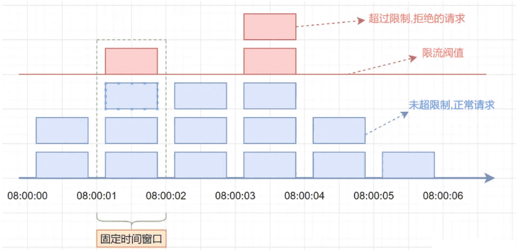
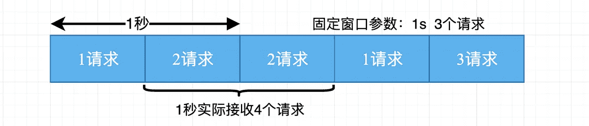
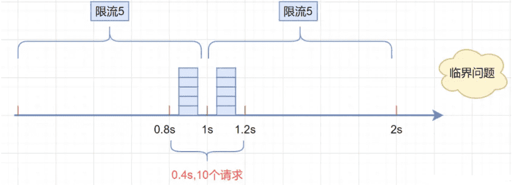
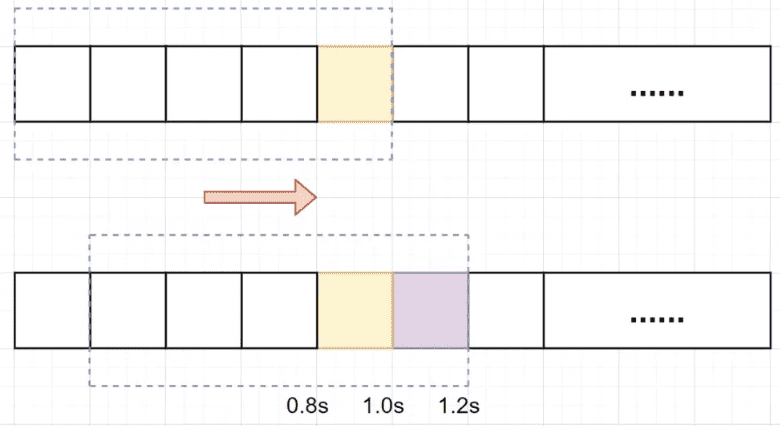
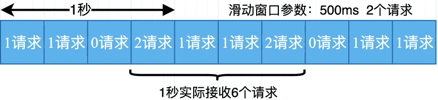
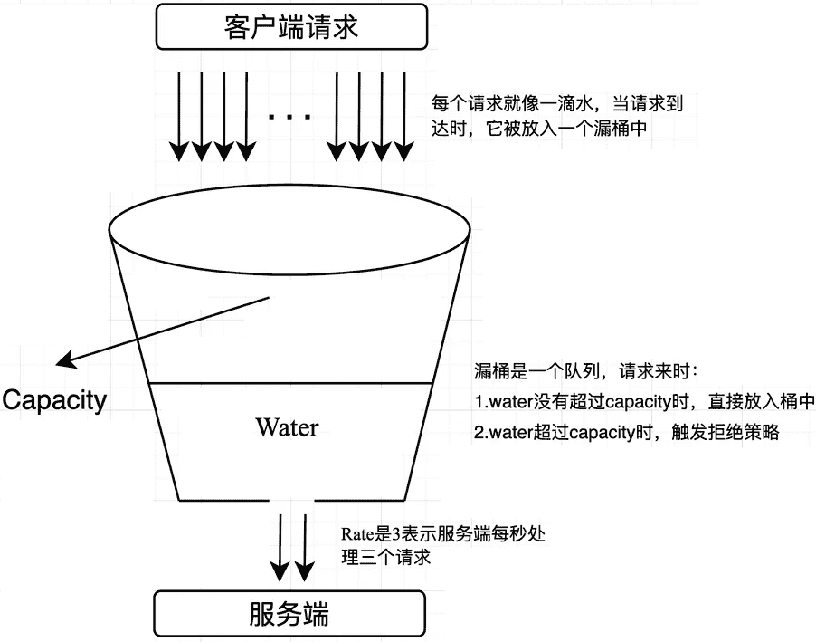
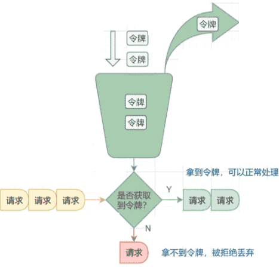

# 分布式限流算法

>   原文：https://mp.weixin.qq.com/s/Rpv1dzBwNsxxVPryENfSFg
>

随着微服务的流行，服务之间的依赖性和调用关系变得越来越复杂，服务的稳定性变得尤为重要。业务场景中经常会涉及到瞬时流量冲击，可能会导致请求响应超时，甚至服务器被压垮、宕机不可用。出于对系统本身和上下游服务的保护，我们通常会对请求进行限流处理，快速拒绝超出配置上限的请求，保证系统或上下游服务系统的稳定。合理策略能有效应对流量冲击，确保系统可用性和性能。本文详细介绍了几种限流算法，比较各个算法的优缺点，给出了限流算法选型的一些建议，同时对业务上常用的分布式限流也提出一些解决方案。

**一个好的限流设计必须要考虑到业务的特性和需求，同时具备以下六点：**

1.  **多级限流：**除了主备复制的限流服务，可以考虑实现多级限流策略。例如，可以在应用层、服务层和数据层都设置限流，这样可以更好地防止系统过载。
2.  **动态阈值调整：**我们可以根据系统的实时负载情况动态调整限流策略。例如，当系统负载较低时，我们可以放宽限流策略；当系统负载较高时，我们可以收紧限流策略。
3.  **灵活维度：**限流策略应该能够根据不同的业务场景进行调整。除了接口、设备、ip、账户 id 等维度外，我们还可以考虑更细粒度的限流。例如，我们可以根据用户的行为模式进行限流，这样可以更好地防止恶意用户的攻击。
4.  **解耦性：**限流应该作为一个基础服务，与具体的业务逻辑分离。这样，当业务逻辑发生变化时，不需要修改限流服务的代码，只需要调整限流策略即可。
5.  **容错性：**限流服务应该具有高可用性，但是如果出现问题，业务应该有备选方案（熔断、降级）。这可能包括使用备用的限流服务，或者根据业务的敏感性决定是否放行请求。
6.  **监控和报警：**对限流策略应进行实时监控，并设置报警机制。当限流策略触发时，可立即收到报警，以便我们可以及时地处理问题。

## 背景

保护高并发服务稳定主要有三把利器：缓存、降级和限流。

1.  缓存：缓存是一种提高数据读取性能的技术，通过在内存中存储经常访问的数据，可以减少对数据库或者其他存储系统的访问，从而提高系统的响应速度。缓存可以应用在多个层次，例如浏览器缓存、CDN 缓存、反向代理缓存、应用缓存等。
2.  降级：降级是在系统压力过大或者部分服务不可用的情况下，暂时关闭一些非核心的服务，以保证核心服务的正常运行。降级可以在多个层次进行，例如页面降级、功能降级、服务降级等。
3.  限流：限流是一种控制系统处理请求的速率的技术，以防止系统过载。限流可以通过多种算法实现，例如令牌桶算法、漏桶算法等。

这三把“利器”各有其特点，通常会结合使用，以达到最佳的效果。例如，可以通过缓存来减少数据库的访问，通过降级来应对系统故障，通过限流来防止系统过载。在设计高并发系统时，需要根据系统的具体需求和特点，合理地使用这些技术。接下来本文会主要介绍一些业界常用的限流方法。

## 限流知识概述

限流是一种对请求或并发数进行限制的关键技术手段，旨在保障系统的正常运行。当服务资源有限、处理能力有限时，限流可以对调用服务的上游请求进行限制，以防止自身服务因资源耗尽而停止服务。

在限流中，有两个重要的概念需要了解：

1.  **阈值：**指在单位时间内允许的请求量。例如，将 QPS（每秒请求数）限制为500，表示在1秒内最多接受500次请求。通过设置合适的阈值，可以控制系统的负载，避免过多的请求导致系统崩溃或性能下降。
2.  **拒绝策略：**用于处理超过阈值的请求的策略。常见的拒绝策略包括**直接拒绝、排队等待**等。直接拒绝会立即拒绝超过阈值的请求，而排队等待则将请求放入队列中，按照一定的规则进行处理。选择合适的拒绝策略可以平衡系统的稳定性和用户体验。

通过合理设置阈值和选择适当的拒绝策略，限流技术可以帮助系统应对突发的请求量激增、恶意用户访问或请求频率过高的情况，保障系统的稳定性和可用性。限流方案根据限流范围，可分为**单机限流和分布式限流；**其中单机限流依据算法，又可分为固定窗口、滑动窗口、漏桶和令牌桶限流等常见四种。本文将对上述限流方案进行详细介绍。

## 限流基本算法

### 固定窗口限流

#### 算法介绍

固定窗口限流算法（Fixed Window Rate Limiting Algorithm）是一种最简单的限流算法，其原理是**在固定时间窗口(单位时间)内限制请求的数量**。该算法将时间分成固定的窗口，并在每个窗口内限制请求的数量。具体来说，算法将请求按照时间顺序放入时间窗口中，并计算该时间窗口内的请求数量，如果请求数量超出了限制，则拒绝该请求。

假设单位时间(固定时间窗口)是1秒，限流阀值为3。在单位时间1秒内，每来一个请求,计数器就加1，如果计数器累加的次数超过限流阀值3，后续的请求全部拒绝。等到1s结束后，计数器清0，重新开始计数。如下图：



#### 优缺点

优点：

1.  实现简单：固定窗口算法的实现相对简单，易于理解和部署。
2.  稳定性较高：对于突发请求能够较好地限制和控制，稳定性较高。
3.  易于实现速率控制：固定窗口算法可以很容易地限制请求的速率，例如每秒最多允许多少个请求。

缺点：

1.  请求分布不均匀：固定窗口算法中，窗口内的请求分布可能不均匀，导致某些窗口内的请求数量超过阈值，而其他窗口内的请求较少。
2.  无法应对突发流量：固定窗口算法的窗口大小是固定的，无法灵活地应对突发流量。
3.  请求的不公平性：窗口结束时的请求计数重置可能导致请求的不公平性。例如，在窗口结束前的最后一秒内，请求计数已满，而在窗口开始时的第一秒内，请求计数为零。



固定窗口算法适用于对请求速率有明确要求且流量相对稳定的场景，但对于突发流量和请求分布不均匀的情况，可能需要考虑其他更灵活的限流算法。

但存在**明显的临界问题**，比如：假设限流阀值为5个请求，单位时间窗口是1s，如果我们在单位时间内的前0.8-1s和1-1.2s，分别并发5个请求。虽然都没有超过阀值，但是如果算0.8-1.2s，则并发数高达10，就已经超过单位时间1s不超过5阀值的定义。



#### 代码实现

具体实现时，可以使用一个计数器来记录当前窗口内的请求数，并与预设的阈值进行比较。固定窗口算法的原理如下：

1.  将时间划分固定大小窗口，例如每秒一个窗口。
2.  在每个窗口内，记录请求的数量。
3.  当有请求到达时，将请求计数加一。
4.  如果请求计数超过了预设的阈值（比如3个请求），拒绝该请求。
5.  窗口结束后，重置请求计数。

```java
public static Integer counter = 0;  //统计请求数
public static long lastAcquireTime =  0L;
public static final Long windowUnit = 1000L ; //假设固定时间窗口是1000ms
public static final Integer threshold = 10; // 窗口阀值是10

/**
* 固定窗口时间算法
* @return
*/
public synchronized boolean fixedWindowsTryAcquire() {
    long currentTime = System.currentTimeMillis();  //获取系统当前时间
    if (currentTime - lastAcquireTime > windowUnit) {  //检查是否在时间窗口内
        counter = 0;  // 计数器清0
        lastAcquireTime = currentTime;  //开启新的时间窗口
    }
    if (counter < threshold) {  // 小于阀值
        counter++;  //计数统计器加1
        return true;
    }

    return false;
}
```

### 滑动窗口限流

#### 算法介绍

上文已经说明当遇到时间窗口的临界突变时，固定窗口算法可能无法灵活地应对流量的变化。例如，在一个时间窗口结束时，如果突然出现大量请求，固定窗口算法可能会导致请求被拒绝，即使在下一个时间窗口内的请求并不多。这种情况下，我们需要一种更灵活的算法来应对突发流量和请求分布不均匀的情况—滑动窗口算法。该算法是对固定窗口算法的一种改进，它通过动态调整窗口的大小来更好地适应流量的变化。与固定窗口算法不同，滑动窗口算法可以在遇到下一个时间窗口之前调整窗口的大小，以便更好地控制请求的速率。

滑动窗口限流算法是一种常用的限流算法，用于控制系统对外提供服务的速率，防止系统被过多的请求压垮。它**将单位时间周期分为n个小周期，分别记录每个小周期内接口的访问次数，并且根据时间滑动删除过期的小周期**。它可以解决固定窗口临界值的问题。

用一张图解释滑动窗口算法，如下：假设单位时间还是1s，滑动窗口算法把它划分为5个小周期，也就是滑动窗口（单位时间）被划分为5个小格子。每格表示0.2s。每过0.2s，时间窗口就会往右滑动一格。然后呢，每个小周期，都有自己独立的计数器，如果请求是0.83s到达的，0.8~1.0s对应的计数器就会加1。



滑动窗口如何解决固定窗口的临界问题？

假设1s内的限流阀值还是5个请求，0.81.0s内（比如0.9s的时候）来了5个请求，落在黄色格子里。时间过了1.0s这个点之后，又来5个请求，落在紫色格子里。如果是固定窗口算法，是不会被限流的，但是滑动窗口的话，每过一个小周期，它会右移一个小格。过了1.0s这个点后，会右移一小格，当前的单位时间段是0.21.2s，这个区域的请求已经超过限定的5了，已触发限流啦，实际上，紫色格子的请求都被拒绝啦。

显然，当滑动窗口的格子周期划分的越多，那么滑动窗口的滚动就越平滑，限流的统计就会越精确。

#### 优缺点

优点：

1.  灵活性：滑动窗口算法可以根据实际情况动态调整窗口的大小，以适应流量的变化。这种灵活性使得算法能够更好地应对突发流量和请求分布不均匀的情况。
2.  实时性：由于滑动窗口算法在每个时间窗口结束时都会进行窗口滑动，它能够更及时地响应流量的变化，提供更实时的限流效果。
3.  精度：相比于固定窗口算法，滑动窗口算法的颗粒度更小，可以提供更精确的限流控制，通过调整时间窗口的大小来实现不同的限流效果。
4.  可扩展性强（可以非常容易地与其他限流算法结合使用）

缺点：

1.  内存消耗：滑动窗口算法需要维护一个窗口内的请求时间列表，随着时间的推移，列表的长度会增长。这可能会导致较大的内存消耗，特别是在窗口大小较大或请求频率较高的情况下。
2.  算法复杂性：相比于简单的固定窗口算法，滑动窗口算法的实现较为复杂。它需要处理窗口滑动、请求计数和过期请求的移除等逻辑，可能需要更多的代码和计算开销。
3.  突发流量无法处理（无法应对短时间内的大量请求，因为一旦到达限流后，请求都会直接暴力被拒绝。这样就会损失一部分请求，这其实对于产品来说，并不太友好），需要合理调整时间窗口大小。



从代码的角度可以发现，滑动窗口算法实际上是颗粒度更小的固定窗口算法，它可以在一定程度上提高限流的精度和实时性，并不能从根本上解决请求分布不均匀的问题。算法受限于窗口的大小和时间间隔，特别是在极端情况下，如突发流量过大或请求分布极不均匀的情况下，仍然可能导致限流不准确。因此，在实际应用中，要采用更复杂的算法或策略来进一步优化限流效果。

#### 伪代码实现

算法的原理如下：

1.  窗口大小：确定一个固定的窗口大小，例如1秒。
2.  请求计数：在窗口内，每次有请求到达时，将请求计数加1。
3.  限制条件：如果窗口内的请求计数超过了设定的阈值，即超过了允许的最大请求数，就拒绝该请求。
4.  窗口滑动：随着时间的推移，窗口会不断滑动，移除过期的请求计数，以保持窗口内的请求数在限制范围内。
5.  动态调整：在滑动窗口算法中，我们可以根据实际情况调整窗口的大小。当遇到下一个时间窗口之前，我们可以根据当前的流量情况来调整窗口的大小，以适应流量的变化。

```java
/**
* 单位时间划分的小周期（单位时间是1分钟，10s一个小格子窗口，一共6个格子）
*/
private int SUB_CYCLE = 10;

/**
* 每分钟限流请求数
*/
private int thresholdPerMin = 100;

/**
* 计数器, k-为当前窗口的开始时间值秒，value为当前窗口的计数
*/
private final TreeMap<Long, Integer> counters = new TreeMap<>();

/**
* 滑动窗口时间算法实现
*/
public synchronized boolean slidingWindowsTryAcquire() {
    long currentWindowTime = LocalDateTime.now().toEpochSecond(ZoneOffset.UTC) / SUB_CYCLE * SUB_CYCLE; //获取当前时间在哪个小周期窗口
    int currentWindowNum = countCurrentWindow(currentWindowTime); //当前窗口总请求数

    //超过阀值限流
    if (currentWindowNum >= thresholdPerMin) {
        return false;
    }

    //计数器+1
    counters.get(currentWindowTime)++;
    return true;
}

/**
* 统计当前窗口的请求数
*/
private synchronized int countCurrentWindow(long currentWindowTime) {
    //计算窗口开始位置
    long startTime = currentWindowTime - SUB_CYCLE* (60s/SUB_CYCLE-1);
    int count = 0;

    //遍历存储的计数器
    Iterator<Map.Entry<Long, Integer>> iterator = counters.entrySet().iterator();
    while (iterator.hasNext()) {
        Map.Entry<Long, Integer> entry = iterator.next();
        // 删除无效过期的子窗口计数器
        if (entry.getKey() < startTime) {
            iterator.remove();
        } else {
            //累加当前窗口的所有计数器之和
            count =count + entry.getValue();
        }
    }
    return count;
}
```

### 漏桶限流

#### 算法介绍

尽管滑动窗口算法可以提供一定的限流效果，但它仍然受限于窗口的大小和时间间隔。在某些情况下，突发流量可能会导致窗口内的请求数超过限制。为了更好地平滑请求的流量，漏桶限流算法（Leaky Bucket Algorithm）可以作为滑动窗口算法的改进。算法的原理很简单：它维护一个固定容量的漏桶，请求以不定的速率流入漏桶，而漏桶以固定的速率流出。如果请求到达时，漏桶已满，则会触发拒绝策略。可以从**生产者-消费者模式**去理解这个算法，请求充当生产者，每个请求就像一滴水，当请求到达时，它被放入一个队列（漏桶）中。而漏桶则充当消费者，以固定的速率从队列中消费请求，就像从桶底的孔洞中不断漏出水滴。消费的速率等于限流阈值，例如每秒处理2个请求，即500毫秒消费一个请求。漏桶的容量就像队列的容量，当请求堆积超过指定容量时，会触发拒绝策略，即新到达的请求将被丢弃或延迟处理。

漏桶限流算法的思想是将数据包看作是水滴，漏桶看作是一个固定容量的水桶，数据包像水滴一样从桶的顶部流入桶中，并通过桶底的一个小孔以一定的速度流出，从而限制了数据包的流量。算法的实现如下：

1.  漏桶容量：确定一个固定的漏桶容量，表示漏桶可以存储的最大请求数。
2.  漏桶速率：确定一个固定的漏桶速率，表示漏桶每秒可以处理的请求数。
3.  请求处理：当请求到达时，生产者将请求放入漏桶中。
4.  漏桶流出：漏桶以固定的速率从漏桶中消费请求，并处理这些请求。如果漏桶中有请求，则处理一个请求；如果漏桶为空，则不处理请求。
5.  请求丢弃或延迟：如果漏桶已满，即漏桶中的请求数达到了容量上限，新到达的请求将被丢弃或延迟处理。



#### 优缺点

优点：

1.  简单易实现：漏桶算法的原理简单，实现起来也相对容易，可以通过调整桶的大小和漏出速率来满足不同的限流需求，可以灵活地适应不同的场景。
2.  平滑流量：漏桶算法可以平滑突发流量，使得输出流量变得更加平稳，避免瞬间请求过多导致系统崩溃或者雪崩。
3.  有效防止过载：通过控制流出的流量，漏桶算法可以有效地防止系统过载，使得系统可以适应不同的流量需求，避免过载或者过度闲置。

缺点：

1.  需要对请求进行缓存，会增加服务器的内存消耗。
2.  对突发流量的处理不够灵活：虽然漏桶算法可以平滑突发流量，但是在某些情况下，我们可能希望能够快速处理突发流量。在这种情况下，漏桶算法可能就不够灵活了。
3.  无法动态调整流量：漏桶算法的流出速率是固定的，无法根据系统的实际情况动态调整。
4.  可能会导致流量浪费：如果输入流量小于漏桶的流出速率，那么漏桶的流出速率就会被浪费。
5.  对于流量波动比较大的场景，需要较为灵活的参数配置才能达到较好的效果。
6.  如果输入流量持续大于漏桶的流出速率，那么漏桶会一直满，新的请求会被丢弃，可能会导致服务质量下降。

#### 伪代码实现

漏桶限流算法的基本工作原理是：对于每个到来的数据包，都将其加入到漏桶中，并检查漏桶中当前的水量是否超过了漏桶的容量。如果超过了容量，就将多余的数据包丢弃。如果漏桶中还有水，就以一定的速率从桶底输出数据包，保证输出的速率不超过预设的速率，从而达到限流的目的。

1. 流入的水滴，可以看作是访问系统的请求，这个流入速率是不确定的。
2. 桶的容量一般表示系统所能处理的请求数。
3. 如果桶的容量满了，就达到限流的阀值，就会丢弃水滴（拒绝请求）
4. 流出的水滴，是恒定过滤的，对应服务按照固定的速率处理请求。

```java
/**
 * LeakyBucket 类表示一个漏桶,
 * 包含了桶的容量和漏桶出水速率等参数，
 * 以及当前桶中的水量和上次漏水时间戳等状态。
 */
public class LeakyBucket {
    private final long capacity;    // 桶的容量
    private final long rate;        // 漏桶出水速率
    private long water;             // 当前桶中的水量
    private long lastLeakTimestamp; // 上次漏水时间戳

    public LeakyBucket(long capacity, long rate) {
        this.capacity = capacity;
        this.rate = rate;
        this.water = 0;
        this.lastLeakTimestamp = System.currentTimeMillis();
    }

    /**
     * tryConsume() 方法用于尝试向桶中放入一定量的水，如果桶中还有足够的空间，则返回 true，否则返回 false。
     * @param waterRequested
     * @return
     */
    public synchronized boolean tryConsume(long waterRequested) {
        leak();
        if (water + waterRequested <= capacity) {
            water += waterRequested;
            return true;
        } else {
            return false;
        }
    }

    /**
     * leak() 方法用于漏水，根据当前时间和上次漏水时间戳计算出应该漏出的水量，然后更新桶中的水量和漏水时间戳等状态。
     */
    private void leak() {
        long now = System.currentTimeMillis();
        long elapsedTime = now - lastLeakTimestamp;
        long leakedWater = elapsedTime * rate / 1000;
        if (leakedWater > 0) {
            water = Math.max(0, water - leakedWater);
            lastLeakTimestamp = now;
        }
    }
}
//注意: tryConsume() 和 leak() 方法中，都需要对桶的状态进行同步，以保证线程安全性。
```

###  令牌桶限流

#### 算法介绍

令牌桶算法是一种常用的限流算法，可以用于限制单位时间内请求的数量。该算法**维护一个固定容量的令牌桶，每秒钟会向令牌桶中放入一定数量的令牌。当有请求到来时，如果令牌桶中有足够的令牌，则请求被允许通过并从令牌桶中消耗一个令牌，否则请求被拒绝**。

令牌桶算法是实现限流的一种常见思路，用于限制请求的速率。它可以确保系统在高负载情况下仍能提供稳定的服务，并防止突发流量对系统造成过载。最常用的 Google Java 开发工具包 Guava 中的限流工具类 RateLimiter 就是令牌桶的一个实现。



#### 优缺点

优点：

1.  平滑流量：令牌桶算法可以平滑突发流量，使得突发流量在一段时间内均匀地分布，避免了流量的突然高峰对系统的冲击。
2.  灵活性：令牌桶算法可以通过调整令牌生成速率和桶的大小来灵活地控制流量。
3.  允许突发流量：由于令牌桶可以积累一定数量的令牌，因此在流量突然增大时，如果桶中有足够的令牌，可以应对这种突发流量。

Guava的RateLimiter限流组件，就是基于令牌桶算法实现的。

缺点：

1.  实现复杂：相比于其他一些限流算法（如漏桶算法），令牌桶算法的实现稍微复杂一些，需要维护令牌的生成和消耗。在短时间内有大量请求到来时，可能会导致令牌桶中的令牌被快速消耗完，从而限流。这种情况下，可以考虑使用漏桶算法。
2.  需要精确的时间控制：令牌桶算法需要根据时间来生成令牌，因此需要有精确的时间控制。如果系统的时间控制不精确，可能会影响限流的效果。
3.  可能会有资源浪费：如果系统的流量持续低于令牌生成的速率，那么桶中的令牌可能会一直积累，造成资源的浪费。

总体来说，令牌桶算法具有较高的稳定性和精度，但实现相对复杂，适用于对稳定性和精度要求较高的场景。

#### 代码实现

令牌桶算法基于一个令牌桶的概念，其中令牌以固定的速率产生，并放入桶中。每个令牌代表一个请求的许可。当请求到达时，需要从令牌桶中获取一个令牌才能通过。如果令牌桶中没有足够的令牌，则请求被限制或丢弃。令牌桶算法的实现步骤如下：

1.  初始化一个令牌桶，包括桶的容量和令牌产生的速率。
2.  持续以固定速率产生令牌，并放入令牌桶中，直到桶满为止。
3.  当请求到达时，尝试从令牌桶中获取一个令牌。
4.  如果令牌桶中有足够的令牌，则请求通过，并从令牌桶中移除一个令牌。
5.  如果令牌桶中没有足够的令牌，则请求被限制或丢弃。

```java
/**
 * TokenBucket 类表示一个令牌桶
 */
public class TokenBucket {

    private final int capacity;     // 令牌桶容量
    private final int rate;         // 令牌生成速率，单位：令牌/秒
    private int tokens;             // 当前令牌数量
    private long lastRefillTimestamp;  // 上次令牌生成时间戳

    /**
     * 构造函数中传入令牌桶的容量和令牌生成速率。
     * @param capacity
     * @param rate
     */
    public TokenBucket(int capacity, int rate) {
        this.capacity = capacity;
        this.rate = rate;
        this.tokens = capacity;
        this.lastRefillTimestamp = System.currentTimeMillis();
    }

    /**
     * allowRequest() 方法表示一个请求是否允许通过，该方法使用 synchronized 关键字进行同步，以保证线程安全。
     * @return
     */
    public synchronized boolean allowRequest() {
        refill();
        if (tokens > 0) {
            tokens--;
            return true;
        } else {
            return false;
        }
    }

    /**
     * refill() 方法用于生成令牌，其中计算令牌数量的逻辑是按照令牌生成速率每秒钟生成一定数量的令牌，
     * tokens 变量表示当前令牌数量，
     * lastRefillTimestamp 变量表示上次令牌生成的时间戳。
     */
    private void refill() {
        long now = System.currentTimeMillis();
        if (now > lastRefillTimestamp) {
            int generatedTokens = (int) ((now - lastRefillTimestamp) / 1000 * rate);
            tokens = Math.min(tokens + generatedTokens, capacity);
            lastRefillTimestamp = now;
        }
    }
}
```

### 四种基本算法的对比

| 算法     | 优点                                                         | 缺点                                                        | 适合场景                                                     |
| -------- | ------------------------------------------------------------ | ----------------------------------------------------------- | ------------------------------------------------------------ |
| 固定窗口 | 简单直观，易于实现<br>适用于稳定的流量控制，易于实现速率控制 | 无法应对短时间内的突发流量<br/>流量不均匀时可能导致突发流量 | 稳定的流量控制，不需要保证请求均匀分布的场景                 |
| 滑动窗口 | 平滑处理突发流量<br/>颗粒度更小，可以提供更精确的限流控制    | 实现相对复杂，需要维护滑动窗口的状态<br/>存在较高的内存消耗 | 需要平滑处理突发流量的场景                                   |
| 漏桶算法 | 平滑处理突发流量<br/>可以固定输出速率，有效防止过载          | 对突发流量的处理不够灵活<br/>无法应对流量波动的情况         | 需要固定输出速率的场景<br/>避免流量的突然增大对系统的冲击的场景 |
| 令牌桶   | 平滑处理突发流量<br/>可以动态调整限流规则 能适应不同时间段的流量变化 | 实现相对复杂<br/>需要维护令牌桶的状态                       | 需要动态调整限流规则的场景<br/>需要平滑处理突发流量的场景    |

## 分布式限流

单机限流指针对单一服务器的情况，通过限制单台服务器在单位时间内处理的请求数量，防止服务器过载。常见的限流算法上文已介绍，其优点在于实现简单，效率高，效果明显。随着微服务架构的普及，系统的服务通常会部署在多台服务器上，此时就需要分布式限流来保证整个系统的稳定性。接下本文会介绍几种常见的分布式限流技术方案：

### 基于中心化的限流方案

#### 方案原理

通过一个中心化的限流器来控制所有服务器的请求。实现方式：

1.  选择一个中心化的组件，例如— Redis。
2.  定义限流规则，例如：可以设置每秒钟允许的最大请求数（QPS），并将这个值存储在 Redis 中。
3.  对于每个请求，服务器需要先向 Redis 请求令牌。
4.  如果获取到令牌，说明请求可以被处理；如果没有获取到令牌，说明请求被限流，可以返回一个错误信息或者稍后重试。

#### 代码实现

```go
package main

import (
"context"
"fmt"
"go.uber.org/atomic"
"sync"
"git.code.oa.com/pcg-csd/trpc-ext/redis"
)

type RedisClient interface {
Do(ctx context.Context, cmd string, args ...interface{}) (interface{}, error)
}

// Client 数据库
type Client struct {
    client RedisClient // redis 操作
    script string      // lua脚本
}

// NewBucketClient 创建redis令牌桶
func NewBucketClient(redis RedisClient) *Client {
    helper := redis
    return &Client{
    client: helper,
    script: `
        -- 令牌桶限流脚本
        -- KEYS[1]: 桶的名称
        -- ARGV[1]: 桶的容量
        -- ARGV[2]: 令牌产生速率
        local bucket = KEYS[1]
        local capacity = tonumber(ARGV[1])
        local tokenRate = tonumber(ARGV[2])
        local redisTime = redis.call('TIME')
        local now = tonumber(redisTime[1])
        local tokens, lastRefill = unpack(redis.call('hmget', bucket, 'tokens', 'lastRefill'))
        tokens = tonumber(tokens)
        lastRefill = tonumber(lastRefill)
        if not tokens or not lastRefill then
            tokens = capacity
            lastRefill = now
        else
            local intervalsSinceLast = (now - lastRefill) * tokenRate
            tokens = math.min(capacity, tokens + intervalsSinceLast)
        end
        if tokens < 1 then
            return 0
        else
            redis.call('hmset', bucket, 'tokens', tokens - 1, 'lastRefill', now)
            return 1
        end`,
    }
}

// 获取令牌，获取成功则立即返回true，否则返回false
func (c *Client) isAllowed(ctx context.Context, key string, capacity int64, tokenRate int64) (bool, error) {
    result, err := redis.Int(c.client.Do(ctx, "eval", c.script, 1, key, capacity, tokenRate))
    if err != nil {
        fmt.Println("Redis 执行错误:", err)
        return false, err
    }
    return result == 1, nil}
}

// 调用检测
func main() {
    c := NewBucketClient(redis.GetPoolByName("redis://127.0.0.1:6379"))
    gw := sync.WaitGroup{}
    gw.Add(120)
    count := atomic.Int64{}
    for i := 0; i < 120; i++ {
        go func(i int) {
        defer gw.Done()
        status, err := c.isAllowed(context.Background(), "test", 100, 10)
        if status {
            count.Add(1)
        }
        fmt.Printf("go %d status:%v error: %v\n", i, status, err)
        }(i)
    }
    gw.Wait()
    fmt.Printf("allow %d\n\n", count.Load())
}
```

执行结果：

```
coroutine 4l status:true error: <nil>
coroutine 70 status:false error: <nil>
coroutine 8l status:false error: <nil>
coroutine 39 status:false error: <nil>
coroutine 27 status:false error: <nil>
coroutine 87 status:false error: <nil>
coroutine 38 status:false error: <nil>
coroutine 71 status:false error: <nil>
coroutine 84 status:false error: <nil>
coroutine 66 status:false error: <nil>
coroutine 83 status:false error: <nil>
coroutine 40 status:false error: <nil>
coroutine 86 status:false error: <nil>
coroutine 85 status:false error: <nil>
coroutine 102 status:false error: <nil>
coroutine 99 status:false error: <nil>
coroutine 82 status:false error: <nil>
coroutine 80 status:false error: <nil>
allow 100
```

#### 存在的问题

1.  性能瓶颈：由于所有的请求都需要经过 Redis，因此 Redis 可能成为整个系统的性能瓶颈。为了解决这个问题，可以考虑使用 Redis 集群来提高性能，或者使用更高性能的硬件。
2.  单点故障：如果 Redis 出现故障，整个系统的限流功能将受到影响。为了解决这个问题，可以考虑使用 Redis 的主从复制或者哨兵模式来实现高可用。
3.  网络带宽：Redis 是一个基于网络通信的内存数据库，因此网络带宽是其性能的一个关键因素。如果网络带宽有限，可能会导致请求的传输速度变慢，从而影响 Redis 的性能。

###   基于负载均衡的分布式限流方案

#### 方案原理

可以看到中心化限流方案的存在较高的单点故障风险，且带宽瓶颈比较严重。在这个基础上本文结合本地缓存单机限流和负载均衡设计了一个新的分布式限流方案。具体方案如下：

1.  使用负载均衡器或分布式服务发现，将请求均匀地分发到每个机器上。这确保了每个机器都能处理一部分请求。
2.  在每个机器上维护本机的限流状态，实现本地缓存单机限流的逻辑。使用令牌桶限流算法，在每个机器上独立地进行限流控制。每秒钟处理的请求数、令牌桶的令牌数量等。根据本地限流状态，对到达的请求进行限流判断。
3.  准备相应的动态调整方案，可以根据每个机器的实际负载情况，动态地调整限流参数。例如，如果一个机器的 CPU 或内存使用率过高，可以降低这个机器的限流阈值，减少这个机器的请求处理量。反之，如果一个机器的资源使用率较低，提高这个机器的限流阈值，增加这个机器的请求处理量。

#### 存在的问题

1.  本地缓存：对本地缓存的要求较高，需要自己根据业务逻辑抉择本地缓存的淘汰策略和缓存容量限制等风险点。
2.  限流精度：本地缓存单机限流的精度受限于每个服务实例的资源和配置。这可能导致限流策略无法精确地适应整个系统的流量变化，无法灵活地调整限流规则。
3.  请求负载均衡器的单点故障。
4.  动态扩缩容的适应性：当系统需要动态扩展或缩容时，该方案可能需要额外的配置和和调整，以确保新加入或移除的服务实例能够正确地参与限流和请求均衡。

### 基于分布式协调服务的限流

#### 方案原理

使用 ZooKeeper 或者 etcd 等分布式协调服务来实现限流。每台服务器都会向分布式协调服务申请令牌，只有获取到令牌的请求才能被处理。基本方案：

1.  初始化令牌桶：在 ZooKeeper 中创建一个节点，节点的数据代表令牌的数量。初始时，将数据设置为令牌桶的容量。
2.  申请令牌：当一个请求到达时，服务器首先向 ZooKeeper 申请一个令牌。这可以通过获取节点的分布式锁，然后将节点的数据减1实现。如果操作成功，说明申请到了令牌，请求可以被处理；如果操作失败，说明令牌已经用完，请求需要被拒绝或者等待。
3.  释放令牌：当一个请求处理完毕时，服务器需要向 ZooKeeper 释放一个令牌。这可以通过获取节点的分布式锁，然后将节点的数据加1实现。
4.  补充令牌：可以设置一个定时任务，定期向 ZooKeeper 中的令牌桶补充令牌。补充的频率和数量可以根据系统的负载情况动态调整。

#### 存在的问题

这个方案的优点是可以实现精确的全局限流，并且可以避免单点故障。但是，这个方案的缺点是实现复杂，且对 ZooKeeper 的性能有较高的要求。如果 ZooKeeper 无法处理大量的令牌申请和释放操作，可能会成为系统的瓶颈。

### Tips

本质上单机限流和分布式限流的区别其实就在于“阈值”存放的位置，单机限流就上面所说的算法直接在单台服务器上实现就好了，而往往我们的服务是集群部署的。因此需要多台机器协同提供限流功能。

像上述的计数器或者时间窗口的算法，可以将计数器存放至 Redis 等分布式 K-V 存储中。例如滑动窗口的每个请求的时间记录可以利用 Redis的zset存储，利用ZREMRANGEBYSCORE删除时间窗口之外的数据，再用 ZCARD 计数。

像令牌桶也可以将令牌数量放到 Redis 中。不过这样的方式等于每一个请求我们都需要去 Redis 判断一下能不能通过，在性能上有一定的损耗。所以有个优化点就是**批量获取**，每次取令牌不是一个一取，而是取一批，不够了再去取一批，这样可以减少对 Redis 的请求。

不过要注意一点，批量获取会导致一定范围内的限流误差。比如你取了10 个此时不用，等下一秒再用，那同一时刻集群机器总处理量可能会超过阈值。其实「批量」这个优化点太常见了，不论是 MySQL的批量刷盘，还是Kafka 消息的批量发送还是分布式 ID 的高性能发号，都包含了「批量」的思想

当然，分布式限流还有一种思想是平分，假设之前单机限流 500，现在集群部署了5台，那就让每台继续限流 500呗，即在总的入口做总的限流限制，然后每台机子再自己实现限流。

## 限流的难点

可以看到，每个限流都有个阈值，这个阈值如何定是个难点。

定大了服务器可能顶不住，定小了就“误杀”了，没有资源利用最大化，对用户体验不好。我能想到的就是限流上线之后先预估个大概的阈值，然后不执行真正的限流操作，而是采取日志记录方式，对日志进行分析查看限流的效果，然后调整阈值，推算出集群总的处理能力，和每台机子的处理能力(方便扩缩容)，然后将线上的流量进行重放，测试真正的限流效果，最终值确定，然后上线。

或者基于TCP拥塞控制的思想，根据请求响应在一个时间段的响应时间P90或者P99值来确定此时服务器的健康状况，来进行动态限流。

其实真实的业务场景很复杂，需要限流的条件和资源很多，每个资源限流要求还不一样。

## 限流组件

一般而言，我们不需要自己实现限流算法来达到限流的目的，不管是接入层限流还是细粒度的接口限流，都有现成的轮子使用，其实现也是用了上述我们所说的限流算法。

比如 Google Guava 提供的限流工县类 Ratelimiter，是基于令牌桶实现的，并目扩展了算法，支持预热功能。

阿里开源的限流框架 sentinel中的匀速排队限流策略，就采用了漏桶算法。

Nginx 中的限流模块 Limit_reg_zone，采用了漏桶算法，还有 OpenResty 中的 resty.limit.reg 库等等

## 总结

**总之，没有最好的方案，只有合适的方案。**在选择合适的限流方案时，我们需要考虑多种因素，包括系统的需求、现有的技术栈、系统的负载情况以及底层系统的性能等。理解每种方案的工作原理和特性，以便在实际应用中做出最佳的选择。

**限流是保证系统稳定和高效运行的重要手段，但它并不是唯一的解决方案。**我们还需要考虑其他的系统设计和优化手段，例如负载均衡、缓存、异步处理等（面对爆量，扩容永远是最好的方式，除了贵！）。这些手段相互配合，才能构建出一个既能应对高并发请求，又能保证服务质量的系统。
