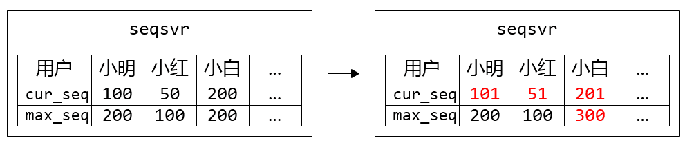
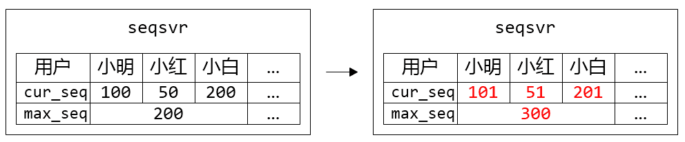
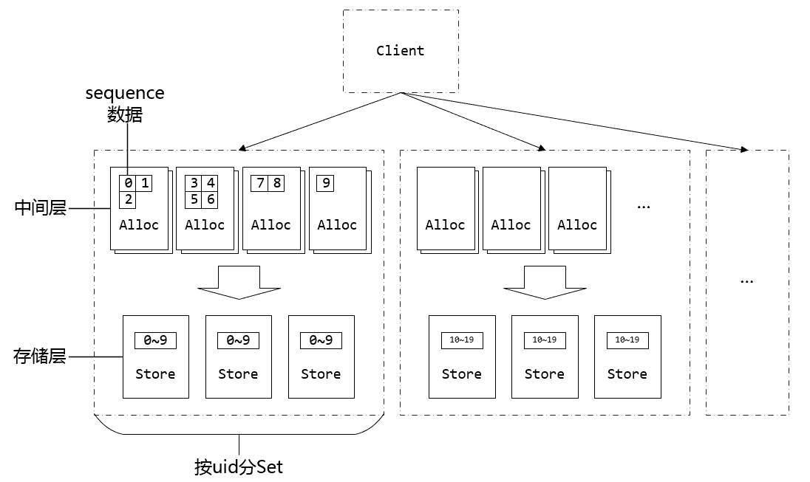
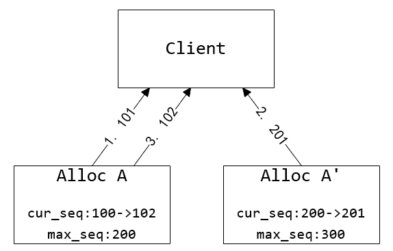
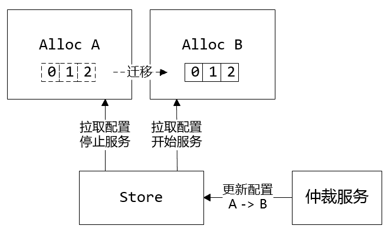
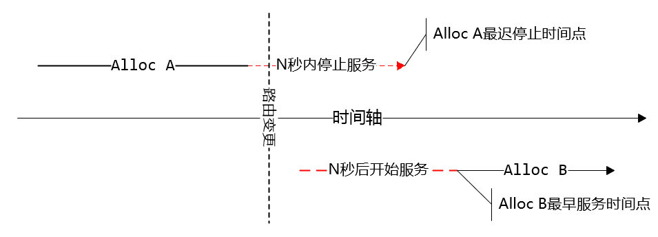
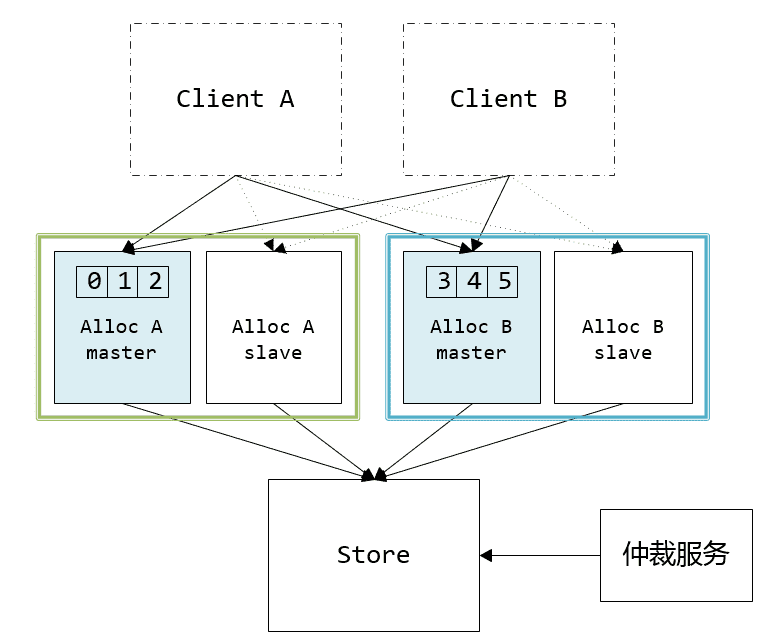
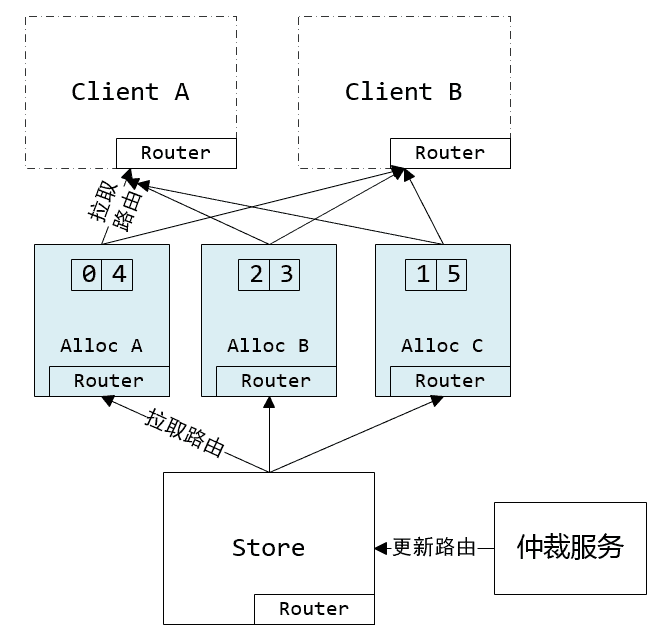
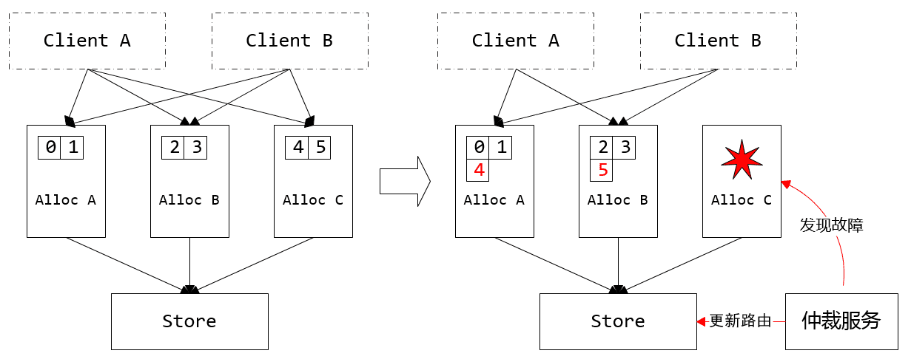

# 微信序列号生成器架构设计及演变

>   原文：[微信序列号生成器架构设计及演变](https://www.infoq.cn/article/wechat-serial-number-generator-architecture)

## 摘要

微信在立项之初，就已确立了利用数据版本号实现终端与后台的数据增量同步机制，确保发消息时消息可靠送达对方手机，避免了大量潜在的家庭纠纷。时至今日，微信已经走过第五个年头，这套同步机制仍然在消息收发、朋友圈通知、好友数据更新等需要数据同步的地方发挥着核心的作用。而在这同步机制的背后，需要一个高可用、高可靠的序列号生成器来产生同步数据用的版本号。这个序列号生成器我们称之为 seqsvr，目前已经发展为一个每天万亿级调用的重量级系统，其中每次申请序列号平时调用耗时 1ms，99.9% 的调用耗时小于 3ms，服务部署于数百台 4 核 CPU 服务器上。

本文会重点介绍 seqsvr 的架构核心思想，以及 seqsvr 随着业务量快速上涨所做的架构演变。

## 背景

微信服务器端为每一份需要与客户端同步的数据（例如消息）都会赋予一个唯一的、递增的序列号（后文称为 sequence），作为这份数据的版本号。在客户端与服务器端同步的时候，客户端会带上已经同步下去数据的最大版本号，后台会根据客户端最大版本号与服务器端的最大版本号，计算出需要同步的增量数据，返回给客户端。这样不仅保证了客户端与服务器端的数据同步的可靠性，同时也大幅减少了同步时的冗余数据。

这里不用乐观锁机制来生成版本号，而是使用了一个独立的 seqsvr 来处理序列号操作，一方面因为业务有大量的 sequence 查询需求——查询已经分配出去的最后一个 sequence，而基于 seqsvr 的查询操作可以做到非常轻量级，避免对存储层的大量 IO 查询操作；另一方面微信用户的不同种类的数据存在不同的 Key-Value 系统中，使用统一的序列号有助于避免重复开发，同时业务逻辑可以很方便地判断一个用户的各类数据是否有更新。

从 seqsvr 申请的、用作数据版本号的 sequence，具有两种基本的性质：

1.  递增的 64 位整型变量
2.  每个用户都有自己独立的 64 位 sequence 空间

举个例子，小明当前申请的 sequence 为 100，那么他下一次申请的 sequence，可能为 101，也可能是 110，总之一定大于之前申请的 100。而小红呢，她的 sequence 与小明的 sequence 是独立开的，假如她当前申请到的 sequence 为 50，然后期间不管小明申请多少次 sequence 怎么折腾，都不会影响到她下一次申请到的值（很可能是 51）。

这里用了每个用户独立的 64 位 sequence 的体系，而不是用一个全局的 64 位（或更高位）sequence，很大原因是全局唯一的 sequence 会有非常严重的申请互斥问题，不容易去实现一个高性能高可靠的架构。对微信业务来说，每个用户独立的 64 位 sequence 空间已经满足业务要求。

目前 sequence 用在终端与后台的数据同步外，同时也广泛用于微信后台逻辑层的基础数据一致性 cache 中，大幅减少逻辑层对存储层的访问。虽然一个用于终端——后台数据同步，一个用于后台 cache 的一致性保证，场景大不相同。但我们仔细分析就会发现，两个场景都是利用 sequence 可靠递增的性质来实现数据的一致性保证，这就要求我们的 seqsvr 保证分配出去的 sequence 是稳定递增的，一旦出现回退必然导致各种数据错乱、消息消失；另外，这两个场景都非常普遍，我们在使用微信的时候会不知不觉地对应到这两个场景：小明给小红发消息、小红拉黑小明、小明发一条失恋状态的朋友圈，一次简单的分手背后可能申请了无数次 sequence。微信目前拥有数亿的活跃用户，每时每刻都会有海量 sequence 申请，这对 seqsvr 的设计也是个极大的挑战。那么，既要 sequence 可靠递增，又要能顶住海量的访问，要如何设计 seqsvr 的架构？我们先从 seqsvr 的架构原型说起。

## 架构原型

不考虑 seqsvr 的具体架构的话，它应该是一个巨大的 64 位数组，而我们每一个微信用户，都在这个大数组里独占一格 8bytes 的空间，这个格子就放着用户已经分配出去的最后一个 sequence：cur_seq。每个用户来申请 sequence 的时候，只需要将用户的 cur_seq+=1，保存回数组，并返回给用户。

图 1. 小明申请了一个 sequence，返回 101

### 预分配中间层

任何一件看起来很简单的事，在海量的访问量下都会变得不简单。前文提到，seqsvr 需要保证分配出去的 sequence 递增（数据可靠），还需要满足海量的访问量（每天接近万亿级别的访问）。满足数据可靠的话，我们很容易想到把数据持久化到硬盘，但是按照目前每秒千万级的访问量（~10^7 QPS），基本没有任何硬盘系统能扛住。

后台架构设计很多时候是一门关于权衡的哲学，针对不同的场景去考虑能不能降低某方面的要求，以换取其它方面的提升。仔细考虑我们的需求，我们只要求递增，并没有要求连续，也就是说出现一大段跳跃是允许的（例如分配出的 sequence 序列：1,2,3,10,100,101）。于是我们实现了一个简单优雅的策略：

1.  内存中储存最近一个分配出去的 sequence：cur_seq，以及分配上限：max_seq
2.  分配 sequence 时，将 cur_seq++，同时与分配上限 max_seq 比较：如果 cur_seq > max_seq，将分配上限提升一个步长 max_seq += step，并持久化 max_seq
3.  重启时，读出持久化的 max_seq，赋值给 cur_seq

图 2. 小明、小红、小白都各自申请了一个 sequence，但只有小白的 max_seq 增加了步长 100

这样通过增加一个预分配 sequence 的中间层，在保证 sequence 不回退的前提下，大幅地提升了分配 sequence 的性能。实际应用中每次提升的步长为 10000，那么持久化的硬盘 IO 次数从之前~10^7 QPS 降低到~10^3 QPS，处于可接受范围。在正常运作时分配出去的 sequence 是顺序递增的，只有在机器重启后，第一次分配的 sequence 会产生一个比较大的跳跃，跳跃大小取决于步长大小。

### 分号段共享存储

请求带来的硬盘 IO 问题解决了，可以支持服务平稳运行，但该模型还是存在一个问题：重启时要读取大量的 max_seq 数据加载到内存中。

我们可以简单计算下，以目前 uid（用户唯一 ID）上限 2^32 个、一个 max_seq 8bytes 的空间，数据大小一共为 32GB，从硬盘加载需要不少时间。另一方面，出于数据可靠性的考虑，必然需要一个可靠存储系统来保存 max_seq 数据，重启时通过网络从该可靠存储系统加载数据。如果 max_seq 数据过大的话，会导致重启时在数据传输花费大量时间，造成一段时间不可服务。

为了解决这个问题，我们引入号段 Section 的概念，uid 相邻的一段用户属于一个号段，而同个号段内的用户共享一个 max_seq，这样大幅减少了 max_seq 数据的大小，同时也降低了 IO 次数。

图 3. 小明、小红、小白属于同个 Section，他们共用一个 max_seq。在每个人都申请一个 sequence 的时候，只有小白突破了 max_seq 上限，需要更新 max_seq 并持久化

目前 seqsvr 一个 Section 包含 10 万个 uid，max_seq 数据只有 300+KB，为我们实现从可靠存储系统读取 max_seq 数据重启打下基础。

### 工程实现

工程实现在上面两个策略上做了一些调整，主要是出于数据可靠性及灾难隔离考虑

1.  把存储层和缓存中间层分成两个模块 StoreSvr 及 AllocSvr。StoreSvr 为存储层，利用了多机 NRW 策略来保证数据持久化后不丢失；AllocSvr 则是缓存中间层，部署于多台机器，每台 AllocSvr 负责若干号段的 sequence 分配，分摊海量的 sequence 申请请求。
2.  整个系统又按 uid 范围进行分 Set，每个 Set 都是一个完整的、独立的 StoreSvr+AllocSvr 子系统。分 Set 设计目的是为了做灾难隔离，一个 Set 出现故障只会影响该 Set 内的用户，而不会影响到其它用户。

图 4. 原型架构图

## 容灾设计

接下来我们会介绍 seqsvr 的容灾架构。我们知道，后台系统绝大部分情况下并没有一种唯一的、完美的解决方案，同样的需求在不同的环境背景下甚至有可能演化出两种截然不同的架构。既然架构是多变的，那纯粹讲架构的意义并不是特别大，期间也会讲下 seqsvr 容灾设计时的一些思考和权衡，希望对大家有所帮助。

seqsvr 的容灾模型在五年中进行过一次比较大的重构，提升了可用性、机器利用率等方面。其中不管是重构前还是重构后的架构，seqsvr 一直遵循着两条架构设计原则：

1.  保持自身架构简单
2.  避免对外部模块的强依赖

这两点都是基于 seqsvr 可靠性考虑的，毕竟 seqsvr 是一个与整个微信服务端正常运行息息相关的模块。按照我们对这个世界的认识，系统的复杂度往往是跟可靠性成反比的，想得到一个可靠的系统一个关键点就是要把它做简单。相信大家身边都有一些这样的例子，设计方案里有很多高大上、复杂的东西，同时也总能看到他们在默默地填一些高大上的坑。当然简单的系统不意味着粗制滥造，我们要做的是理出最核心的点，然后在满足这些核心点的基础上，针对性地提出一个足够简单的解决方案。

那么，seqsvr 最核心的点是什么呢？每个 uid 的 sequence 申请要递增不回退。这里我们发现，如果 seqsvr 满足这么一个约束：任意时刻任意 uid 有且仅有一台 AllocSvr 提供服务，就可以比较容易地实现 sequence 递增不回退的要求。

图 5. 两台 AllocSvr 服务同个 uid 造成 sequence 回退。Client 读取到的 sequence 序列为 101、201、102

但也由于这个约束，多台 AllocSvr 同时服务同一个号段的多主机模型在这里就不适用了。我们只能采用单点服务的模式，当某台 AllocSvr 发生服务不可用时，将该机服务的 uid 段切换到其它机器来实现容灾。这里需要引入一个仲裁服务，探测 AllocSvr 的服务状态，决定每个 uid 段由哪台 AllocSvr 加载。出于可靠性的考虑，仲裁模块并不直接操作 AllocSvr，而是将加载配置写到 StoreSvr 持久化，然后 AllocSvr 定期访问 StoreSvr 读取最新的加载配置，决定自己的加载状态。

图 6. 号段迁移示意。通过更新加载配置把 0~2 号段从 AllocSvrA 迁移到 AllocSvrB

同时，为了避免失联 AllocSvr 提供错误的服务，返回脏数据，AllocSvr 需要跟 StoreSvr 保持租约。这个租约机制由以下两个条件组成：

1.  租约失效：AllocSvr N 秒内无法从 StoreSvr 读取加载配置时，AllocSvr 停止服务
2.  租约生效：AllocSvr 读取到新的加载配置后，立即卸载需要卸载的号段，需要加载的新号段等待 N 秒后提供服务

图 7. 租约机制。AllocSvrB 严格保证在 AllocSvrA 停止服务后提供服务

这两个条件保证了切换时，新 AllocSvr 肯定在旧 AllocSvr 下线后才开始提供服务。但这种租约机制也会造成切换的号段存在小段时间的不可服务，不过由于微信后台逻辑层存在重试机制及异步重试队列，小段时间的不可服务是用户无感知的，而且出现租约失效、切换是小概率事件，整体上是可以接受的。

到此讲了 AllocSvr 容灾切换的基本原理，接下来会介绍整个 seqsvr 架构容灾架构的演变

## 容灾 1.0 架构：主备容灾

最初版本的 seqsvr 采用了主机 + 冷备机容灾模式：全量的 uid 空间均匀分成 N 个 Section，连续的若干个 Section 组成了一个 Set，每个 Set 都有一主一备两台 AllocSvr。正常情况下只有主机提供服务；在主机出故障时，仲裁服务切换主备，原来的主机下线变成备机，原备机变成主机后加载 uid 号段提供服务。

图 8. 容灾 1.0 架构：主备容灾

可能看到前文的叙述，有些同学已经想到这种容灾架构。一主机一备机的模型设计简单，并且具有不错的可用性——毕竟主备两台机器同时不可用的概率极低，相信很多后台系统也采用了类似的容灾策略。

### 设计权衡

主备容灾存在一些明显的缺陷，比如备机闲置导致有一半的空闲机器；比如主备切换的时候，备机在瞬间要接受主机所有的请求，容易导致备机过载。既然一主一备容灾存在这样的问题，为什么一开始还要采用这种容灾模型？事实上，架构的选择往往跟当时的背景有关，seqsvr 诞生于微信发展初期，也正是微信快速扩张的时候，选择一主一备容灾模型是出于以下的考虑：

1.  架构简单，可以快速开发
2.  机器数少，机器冗余不是主要问题
3.  Client 端更新 AllocSvr 的路由状态很容易实现

前两点好懂，人力、机器都不如时间宝贵。而第三点比较有意思，下面展开讲下

微信后台绝大部分模块使用了一个自研的 RPC 框架，seqsvr 也不例外。在这个 RPC 框架里，调用端读取本地机器的 client 配置文件，决定去哪台服务端调用。这种模型对于无状态的服务端，是很好用的，也很方便实现容灾。我们可以在 client 配置文件里面写“对于号段 x，可以去 SvrA、SvrB、SvrC 三台机器的任意一台访问”，实现三主机容灾。

但在 seqsvr 里，AllocSvr 是预分配中间层，并不是无状态的。而前面我们提到，AllocSvr 加载哪些 uid 号段，是由保存在 StoreSvr 的加载配置决定的。那么这时候就尴尬了，业务想要申请某个 uid 的 sequence，Client 端其实并不清楚具体去哪台 AllocSvr 访问，client 配置文件只会跟它说“AllocSvrA、AllocSvrB…这堆机器的某一台会有你想要的 sequence”。换句话讲，原来负责提供服务的 AllocSvrA 故障，仲裁服务决定由 AllocSvrC 来替代 AllocSvrA 提供服务，Client 要如何获知这个路由信息的变更？

这时候假如我们的 AllocSvr 采用了主备容灾模型的话，事情就变得简单多了。我们可以在 client 配置文件里写：对于某个 uid 号段，要么是 AllocSvrA 加载，要么是 AllocSvrB 加载。Client 端发起请求时，尽管 Client 端并不清楚 AllocSvrA 和 AllocSvrB 哪一台真正加载了目标 uid 号段，但是 Client 端可以先尝试给其中任意一台 AllocSvr 发请求，就算这次请求了错误的 AllocSvr，那么就知道另外一台是正确的 AllocSvr，再发起一次请求即可。

也就是说，对于主备容灾模型，最多也只会浪费一次的试探请求来确定 AllocSvr 的服务状态，额外消耗少，编码也简单。可是，如果 Svr 端采用了其它复杂的容灾策略，那么基于静态配置的框架就很难去确定 Svr 端的服务状态：Svr 发生状态变更，Client 端无法确定应该向哪台 Svr 发起请求。这也是为什么一开始选择了主备容灾的原因之一。

### 主备容灾的缺陷

在我们的实际运营中，容灾 1.0 架构存在两个重大的不足：

1.  扩容、缩容非常麻烦
2.  一个 Set 的主备机都过载，无法使用其他 Set 的机器进行容灾

在主备容灾中，Client 和 AllocSvr 需要使用完全一致的配置文件。变更这个配置文件的时候，由于无法实现在同一时间更新给所有的 Client 和 AllocSvr，因此需要非常复杂的人工操作来保证变更的正确性（包括需要使用 iptables 来做请求转发，具体的详情这里不做展开）。

对于第二个问题，常见的方法是用一致性 Hash 算法替代主备，一个 Set 有多台机器，过载机器的请求被分摊到多台机器，容灾效果会更好。在 seqsvr 中使用类似一致性 Hash 的容灾策略也是可行的，只要 Client 端与仲裁服务都使用完全一样的一致性 Hash 算法，这样 Client 端可以启发式地去尝试，直到找到正确的 AllocSvr。例如对于某个 uid，仲裁服务会优先把它分配到 AllocSvrA，如果 AllocSvrA 挂掉则分配到 AllocSvrB，再不行分配到 AllocSvrC。那么 Client 在访问 AllocSvr 时，按照 AllocSvrA -> AllocSvrB -> AllocSvrC 的顺序去访问，也能实现容灾的目的。但这种方法仍然没有克服前面主备容灾面临的配置文件变更的问题，运营起来也很麻烦。

## 容灾 2.0 架构：嵌入式路由表容灾

最后我们另辟蹊径，采用了一种不同的思路：既然 Client 端与 AllocSvr 存在路由状态不一致的问题，那么让 AllocSvr 把当前的路由状态传递给 Client 端，打破之前只能根据本地 Client 配置文件做路由决策的限制，从根本上解决这个问题。

所以在 2.0 架构中，我们把 AllocSvr 的路由状态嵌入到 Client 请求 sequence 的响应包中，在不带来额外的资源消耗的情况下，实现了 Client 端与 AllocSvr 之间的路由状态一致。具体实现方案如下：

seqsvr 所有模块使用了统一的路由表，描述了 uid 号段到 AllocSvr 的全映射。这份路由表由仲裁服务根据 AllocSvr 的服务状态生成，写到 StoreSvr 中，由 AllocSvr 当作租约读出，最后在业务返回包里旁路给 Client 端。

图 9. 容灾 2.0 架构：动态号段迁移容灾

把路由表嵌入到请求响应包看似很简单的架构变动，却是整个 seqsvr 容灾架构的技术奇点。利用它解决了路由状态不一致的问题后，可以实现一些以前不容易实现的特性。例如灵活的容灾策略，让所有机器都互为备机，在机器故障时，把故障机上的号段均匀地迁移到其它可用的 AllocSvr 上；还可以根据 AllocSvr 的负载情况，进行负载均衡，有效缓解 AllocSvr 请求不均的问题，大幅提升机器使用率。

另外在运营上也得到了大幅简化。之前对机器进行运维操作有着繁杂的操作步骤，而新架构只需要更新路由即可轻松实现上线、下线、替换机器，不需要关心配置文件不一致的问题，避免了一些由于人工误操作引发的故障。

图 10. 机器故障号段迁移

### 路由同步优化

把路由表嵌入到取 sequence 的请求响应包中，那么会引入一个类似“先有鸡还是先有蛋”的哲学命题：没有路由表，怎么知道去哪台 AllocSvr 取路由表？另外，取 sequence 是一个超高频的请求，如何避免嵌入路由表带来的带宽消耗？

这里通过在 Client 端内存缓存路由表以及路由版本号来解决，请求步骤如下：

1.  Client 根据本地共享内存缓存的路由表，选择对应的 AllocSvr；如果路由表不存在，随机选择一台 AllocSvr
2.  对选中的 AllocSvr 发起请求，请求带上本地路由表的版本号
3.  AllocSvr 收到请求，除了处理 sequence 逻辑外，判断 Client 带上版本号是否最新，如果是旧版则在响应包中附上最新的路由表
4.  Client 收到响应包，除了处理 sequence 逻辑外，判断响应包是否带有新路由表。如果有，更新本地路由表，并决策是否返回第 1 步重试

基于以上的请求步骤，在本地路由表失效的时候，使用少量的重试便可以拉到正确的路由，正常提供服务。
