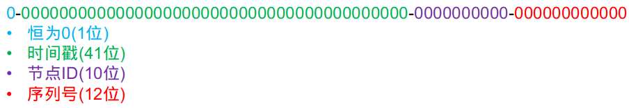
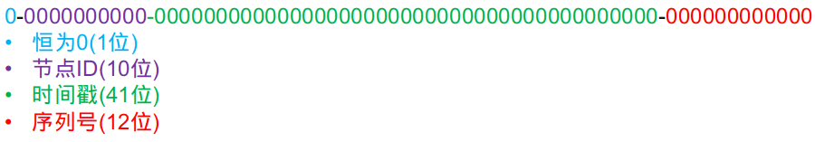
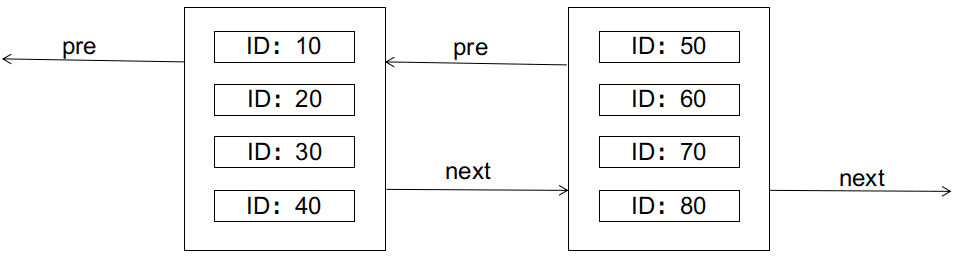
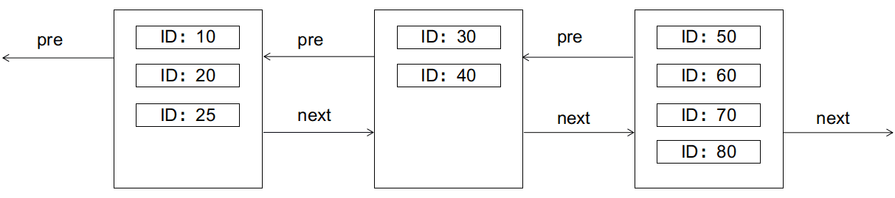
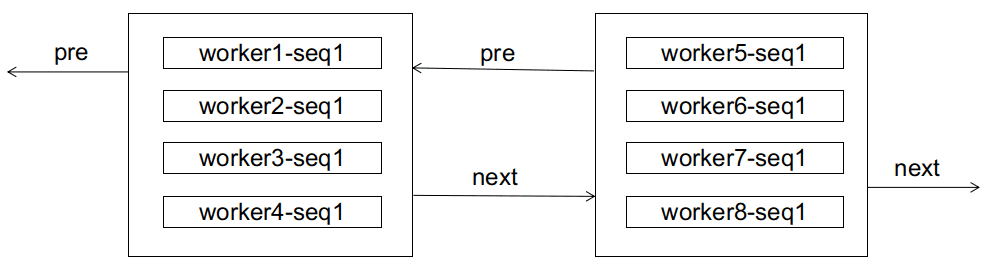
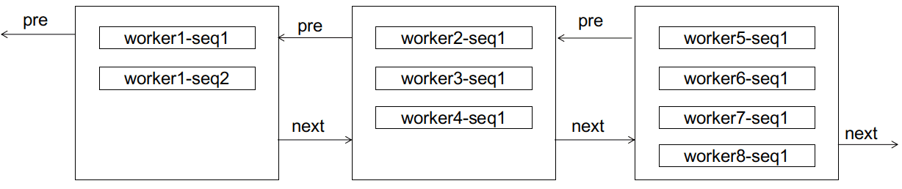
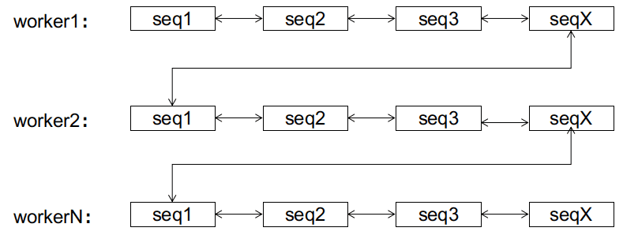

# 雪花算法（Snowflake）

雪花算法（Snowflake）是一种生成全局唯一ID的分布式算法。它的主要功能是在分布式系统中生成一个全局唯一的ID，且ID是按照时间有序递增的。

## 雪花优缺点

优点：

| 优点         | 解释                                                       |
| :----------- | :--------------------------------------------------------- |
| 高性能高可用 | 生成时不依赖第三方库或者中间件，完全在内存中生成，稳定性好 |
| 高吞吐       | 每秒钟能生成数百万的自增 ID                                |
| ID 自增      | 存入数据库中，索引效率高                                   |

缺点：需要解决重复 ID 问题（ID 生成依赖时间，在获取时间的时候，可能会出现时间回拨的问题，也就是服务器上的时间突然倒退到之前的时间，进而导致会产生重复 ID）、依赖机器 ID 对分布式环境不友好（当需要自动启停或增减机器时，固定的机器 ID 可能不够灵活）。

>   在获取时间的时候，可能会出现时间回拨的问题，什么是时间回拨问题呢？就是服务器上的时间突然倒退到之前的时间。

1.  人为原因，把系统环境的时间改了；
2.  有时候不同的机器上需要同步时间，可能不同机器之间存在误差，那么可能会出现时间回拨问题。

>   算法中可通过记录最后一个生成 id 时的时间戳来解决，每次生成 id 之前比较当前服务器时钟是否被回拨，避免生成重复 id。

## 实现原理

Snowflake以划分命名空间的方式将 64-bit位分割成多个部分，每个部分代表不同的含义。


- 第1位占用1bit，其值始终是0，可看做是符号位不使用。

- 第2位开始的41位是时间戳，41-bit位可表示2^41个数，每个数代表毫秒，那么雪花算法可用的时间年限是(1L<<41)/(1000L360024*365)=69 年的时间。

- 中间的10-bit位可表示机器数，即$2^{10} = 1024$台机器，但是一般情况下我们不会部署这么多台机器。如果我们对IDC（互联网数据中心）有需求，还可以将 10-bit 分 5-bit 给 IDC，分5-bit给工作机器。这样就可以表示32个IDC，每个IDC下可以有32台机器，具体的划分可以根据自身需求定义。

- 最后12-bit位是自增序列，可表示$2^{12} = 4096$个数。

这样的划分之后相当于**在一毫秒一个数据中心的一台机器上可产生4096个有序的不重复的ID**。但是我们 IDC 和机器数肯定不止一个，所以毫秒内能生成的有序ID数是翻倍的。

雪花算法的工作原理如下：

1.  获取当前时间戳的41位，并将其左移22位，以获取时间戳部分。
2.  获取机器ID，并将其左移12位，以获取机器ID部分。
3.  生成序列号，同一毫秒内生成多个ID时，序列号递增。
4.  合并时间戳、机器ID和序列号，形成64位整数ID。

在实际项目中，我们一般也会对 Snowflake 算法进行改造，最常见的就是在 Snowflake 算法生成的 ID 中加入业务类型信息。

>   如果希望运行更久，**增加时间戳的位数**；如果需要支持更多节点部署，**增加标识位长度**；如果并发很高，**增加序列号位数**。

雪花算法并不是一成不变的，可以根据系统内具体场景进行定制。上述划分中的工作机器ID位数（10位或5位）可能会因不同的实现方式而有所差异。在Twitter原始的雪花算法设计中，可能并没有直接使用10位来表示工作机器ID，而是将机器ID部分进一步细分为数据中心ID和工作机器ID，其中每个部分可能占用更少的位数（如各5位）。

## 生成示例

Snowflake的Twitter官方原版是用Scala写的，对Scala语言有研究的同学可以去阅读下，以下是 Java 版本的写法：

```java
/**
 * Twitter_Snowflake<br>
 * SnowFlake的结构如下(每部分用-分开):<br>
 * 0 - 0000000000 0000000000 0000000000 0000000000 0 - 00000 - 00000 - 000000000000 <br>
 * 1位标识，由于long基本类型在Java中是带符号的，最高位是符号位，正数是0，负数是1，所以id一般是正数，最高位是0<br>
 * 41位时间截(毫秒级)，注意，41位时间截不是存储当前时间的时间截，而是存储时间截的差值（当前时间截 - 开始时间截)
 * 得到的值），这里的的开始时间截，一般是我们的id生成器开始使用的时间，由我们程序来指定的（如下下面程序IdWorker类的startTime属性）。41位的时间截，可以使用69年，年T = (1L << 41) / (1000L * 60 * 60 * 24 * 365) = 69<br>
 * 10位的数据机器位，可以部署在1024个节点，包括5位datacenterId和5位workerId<br>
 * 12位序列，毫秒内的计数，12位的计数顺序号支持每个节点每毫秒(同一机器，同一时间截)产生4096个ID序号<br>
 * 加起来刚好64位，为一个Long型。<br>
 * SnowFlake的优点是，整体上按照时间自增排序，并且整个分布式系统内不会产生ID碰撞(由数据中心ID和机器ID作区分)，并且效率较高，经测试，SnowFlake每秒能够产生26万ID左右。
 */
public class SnowflakeDistributeId {


    // ==============================Fields===========================================
    /**
     * 开始时间截 (2015-01-01)
     */
    private final long twepoch = 1420041600000L;

    /**
     * 机器id所占的位数
     */
    private final long workerIdBits = 5L;

    /**
     * 数据标识id所占的位数
     */
    private final long datacenterIdBits = 5L;

    /**
     * 支持的最大机器id，结果是31 (这个移位算法可以很快的计算出几位二进制数所能表示的最大十进制数)
     */
    private final long maxWorkerId = ~(-1L << workerIdBits);

    /**
     * 支持的最大数据标识id，结果是31
     */
    private final long maxDatacenterId = ~(-1L << datacenterIdBits);

    /**
     * 序列在id中占的位数
     */
    private final long sequenceBits = 12L;

    /**
     * 机器ID向左移12位
     */
    private final long workerIdShift = sequenceBits;

    /**
     * 数据标识id向左移17位(12+5)
     */
    private final long datacenterIdShift = sequenceBits + workerIdBits;

    /**
     * 时间截向左移22位(5+5+12)
     */
    private final long timestampLeftShift = sequenceBits + workerIdBits + datacenterIdBits;

    /**
     * 生成序列的掩码，这里为4095 (0b111111111111=0xfff=4095)
     */
    private final long sequenceMask = ~(-1L << sequenceBits);

    /**
     * 工作机器ID(0~31)
     */
    private long workerId;

    /**
     * 数据中心ID(0~31)
     */
    private long datacenterId;

    /**
     * 毫秒内序列(0~4095)
     */
    private long sequence = 0L;

    /**
     * 上次生成ID的时间截
     */
    private long lastTimestamp = -1L;

    //==============================Constructors=====================================

    /**
     * 构造函数
     *
     * @param workerId     工作ID (0~31)
     * @param datacenterId 数据中心ID (0~31)
     */
    public SnowflakeDistributeId(long workerId, long datacenterId) {
        if (workerId > maxWorkerId || workerId < 0) {
            throw new IllegalArgumentException(String.format("worker Id can't be greater than %d or less than 0", maxWorkerId));
        }
        if (datacenterId > maxDatacenterId || datacenterId < 0) {
            throw new IllegalArgumentException(String.format("datacenter Id can't be greater than %d or less than 0", maxDatacenterId));
        }
        this.workerId = workerId;
        this.datacenterId = datacenterId;
    }

    // ==============================Methods==========================================

    /**
     * 获得下一个ID (该方法是线程安全的)
     *
     * @return SnowflakeId
     */
    public synchronized long nextId() {
        long timestamp = timeGen();

        //如果当前时间小于上一次ID生成的时间戳，说明系统时钟回退过这个时候应当抛出异常
        if (timestamp < lastTimestamp) {
            throw new RuntimeException(
                    String.format("Clock moved backwards.  Refusing to generate id for %d milliseconds", lastTimestamp - timestamp));
        }

        //如果是同一时间生成的，则进行毫秒内序列
        if (lastTimestamp == timestamp) {
            sequence = (sequence + 1) & sequenceMask;
            //毫秒内序列溢出
            if (sequence == 0) {
                //阻塞到下一个毫秒,获得新的时间戳
                timestamp = tilNextMillis(lastTimestamp);
            }
        }
        //时间戳改变，毫秒内序列重置
        else {
            sequence = 0L;
        }

        //上次生成ID的时间截
        lastTimestamp = timestamp;

        //移位并通过或运算拼到一起组成64位的ID
        return ((timestamp - twepoch) << timestampLeftShift) //
                | (datacenterId << datacenterIdShift) //
                | (workerId << workerIdShift) //
                | sequence;
    }

    /**
     * 阻塞到下一个毫秒，直到获得新的时间戳
     *
     * @param lastTimestamp 上次生成ID的时间截
     * @return 当前时间戳
     */
    protected long tilNextMillis(long lastTimestamp) {
        long timestamp = timeGen();
        while (timestamp <= lastTimestamp) {
            timestamp = timeGen();
        }
        return timestamp;
    }

    /**
     * 返回以毫秒为单位的当前时间
     *
     * @return 当前时间(毫秒)
     */
    protected long timeGen() {
        return System.currentTimeMillis();
    }
}
```

测试的代码如下

```java
public static void main(String[] args) {
    SnowflakeDistributeId idWorker = new SnowflakeDistributeId(0, 0);
    for (int i = 0; i < 1000; i++) {
        long id = idWorker.nextId();
//      System.out.println(Long.toBinaryString(id));
        System.out.println(id);
    }
}
```

雪花算法提供了一个很好的设计思想，雪花算法生成的ID是趋势递增，不依赖数据库等第三方系统，以服务的方式部署，稳定性更高，生成ID的性能也是非常高的，而且可以根据自身业务特性分配bit位，非常灵活。

但是雪花算法强**依赖机器时钟**，如果机器上时钟回拨，会导致发号重复或者服务会处于不可用状态。如果恰巧回退前生成过一些ID，而时间回退后，生成的ID就有可能重复。官方对于此并没有给出解决方案，而是简单的抛错处理，这样会造成在时间被追回之前的这段时间服务不可用。

很多其他类雪花算法也是在此思想上的设计然后改进规避它的缺陷。如果你想要使用 Snowflake 算法的话，一般不需要你自己再造轮子。有很多基于 Snowflake 算法的开源实现比如美团 的 Leaf、百度的 UidGenerator，并且这些开源实现对原有的 Snowflake 算法进行了优化，性能更优秀，还解决了 Snowflake 算法的时间回拨问题和依赖机器 ID 的问题。

并且，Seata 还提出了“改良版雪花算法”，针对原版雪花算法进行了一定的优化改良，解决了时间回拨问题，大幅提高的 QPS。具体介绍和改进原理，可以参考下面这两篇文章：

-   [Seata 基于改良版雪花算法的分布式 UUID 生成器分析](https://seata.io/zh-cn/blog/seata-analysis-UUID-generator.html)
-   [在开源项目中看到一个改良版的雪花算法，现在它是你的了。](https://www.cnblogs.com/thisiswhy/p/17611163.html)

## 分析雪花

### 生成 ID 重复问题

假设场景：

>   一个订单微服务，通过雪花算法生成 ID，共部署三个节点，标识位一致。此时有 200 并发，均匀散布三个节点，三个节点同一毫秒同一序列号下生成 ID，那么就会产生重复 ID。

通过上述假设场景，可以知道`雪花算法`生成 ID 冲突存在一定的前提条件：

1.  服务通过集群的方式部署，其中部分机器标识位一致；
2.  业务存在一定的并发量，没有并发量无法触发重复问题；
3.  生成 ID 的时机：同一毫秒下的序列号一致。

解决方案：如果能保证标识位不重复，那么雪花 ID 也不会重复，有三种方案：

-   预分配：应用上线前，统计当前服务的节点数，人工去申请标识位。这种方案，没有代码开发量，在服务节点固定或者项目少可以使用，但是解决不了服务节点动态扩容性问题。
-   动态分配**：**通过将标识位存放在 Redis、Zookeeper、MySQL 等中间件，在服务启动的时候去请求标识位，请求后标识位更新为下一个可用的。
-   统一分配ID：启动一个专门分配ID的服务，它来统一分配各个业务或服务需要的ID。

### 第一位为什么不使用

在雪花算法中，第一位是符号位，0表示整数，第一位如果是1则表示负数，我们用的ID默认就是正数，所以默认就是0，那么这一位默认就没有意义。

### 标识位怎么用

标识位一共10 bit，如果全部表示机器，那么可以表示1024台机器，如果拆分，5 bit 表示机房，5bit表示机房里面的机器，那么可以有32个机房，每个机房可以用32台机器。

### twepoch表示什么？

由于时间戳只能用69年，我们的计时又是从1970年开始的，所以这个`twepoch`表示从项目开始的时间，用生成ID的时间减去`twepoch`作为时间戳，可以使用更久。

### 时间戳比较

在获取时间戳小于上一次获取的时间戳的时候，不能生成ID，而是继续循环，直到生成可用的ID，这里没有使用拓展位防止时钟回拨。

## 如何解决时钟回拨问题

时钟回拨：指的是系统时钟被向后调整到之前的时间，也就是在某一瞬间，系统时间突然跳回到之前的某个时间点；

这对雪花来说无疑是致命！

这个问题谈不上解决，只能说规避或者保证唯一的解决方案：

-   拒绝策略：这个很简单，就是检测到时钟回拨后，拒绝ID的生成。

-   使用物理时钟和逻辑时钟结合的方式：

    -   物理时钟是指系统硬件上的时钟，它具有不同步的风险。而逻辑时钟则是指根据本地时钟和网络时间协议（NTP）获取的网络时钟计算出来的时间戳，它具有更好的同步性能。
    -   在使用逻辑时钟时，可以将本地的逻辑时钟与 NTP 服务提供的时间进行比较，并使用两个时钟之间的差值来确定当前的本地时间。如果本地时钟发生回拨，可以通过记录回拨的信息以及处理回拨前后的时间变化来避免ID重复或生成失败。

-   时间后移消费

    每次产生ID的时候保存一次时间，发生时间回拨的时候，取出缓存的时间+1s，缺点是时间可能会错位。

## Seata改良版雪花算法

原文：https://seata.apache.org/zh-cn/blog/seata-analysis-UUID-generator/

Seata内置了一个分布式UUID生成器，用于辅助生成全局事务ID和分支事务ID。我们希望该生成器具有如下特点：

-   高性能
-   全局唯一
-   趋势递增

高性能不必多言。全局唯一很重要，否则不同的全局事务/分支事务会混淆在一起。此外，趋势递增对于使用数据库作为TC集群的存储工具的用户而言，能降低数据页分裂的频率，从而减少数据库的IO压力 (branch_table表以分支事务ID作为主键)。

在老版Seata(1.4以前)，该生成器的实现基于标准版的雪花算法。标准版雪花算法网上已经有很多解读文章了，此处就不再赘述了。尚未了解的同学可以先看看网上的相关资料，再来看此文章。此处我们谈谈标准版雪花算法的几个缺点：

1.  时钟敏感。因为ID生成总是和当前操作系统的时间戳绑定的(利用了时间的单调递增性)，因此若操作系统的时钟出现回拨，生成的ID就会重复(一般而言不会人为地去回拨时钟，但服务器会有偶发的"时钟漂移"现象)。对于此问题，Seata的解决策略是记录上一次的时间戳，若发现当前时间戳小于记录值(意味着出现了时钟回拨)，则拒绝服务，等待时间戳追上记录值。但这也意味着这段时间内该TC将处于不可用状态。
2.  突发性能有上限。标准版雪花算法宣称的QPS很大，约400w/s，但严格来说这算耍了个文字游戏~ 因为算法的时间戳单位是毫秒，而分配给序列号的位长度为12，即每毫秒4096个序列空间。所以更准确的描述应该是4096/ms。400w/s与4096/ms的区别在于前者不要求每一毫秒的并发都必须低于4096 (也许有些毫秒会高于4096，有些则低于)。Seata亦遵循此限制，若当前时间戳的序列空间已耗尽，会自旋等待下一个时间戳。

在较新的版本上(1.4之后)，该生成器针对原算法进行了一定的优化改良，很好地解决了上述的2个问题。改进的核心思想是解除与操作系统时间戳的时刻绑定，生成器只在初始化时获取了系统当前的时间戳，作为初始时间戳，但之后就不再与系统时间戳保持同步了。它之后的递增，只由序列号的递增来驱动。比如序列号当前值是4095，下一个请求进来，序列号+1溢出12位空间，序列号重新归零，而溢出的进位则加到时间戳上，从而让时间戳+1。至此，时间戳和序列号实际可视为一个整体了。实际上我们也是这样做的，为了方便这种溢出进位，我们调整了64位ID的位分配策略，由原版的：



改成(即时间戳和节点ID换个位置)：



这样时间戳和序列号在内存上是连在一块的，在实现上就很容易用一个`AtomicLong`来同时保存它俩：

```java
/**
 * timestamp and sequence mix in one Long
 * highest 11 bit: not used
 * middle  41 bit: timestamp
 * lowest  12 bit: sequence
 */
private AtomicLong timestampAndSequence;
```

最高11位可以在初始化时就确定好，之后不再变化：

```java
/**
 * business meaning: machine ID (0 ~ 1023)
 * actual layout in memory:
 * highest 1 bit: 0
 * middle 10 bit: workerId
 * lowest 53 bit: all 0
 */
private long workerId;
```

那么在生产ID时就很简单了：

```java
public long nextId() {
   // 获得递增后的时间戳和序列号
   long next = timestampAndSequence.incrementAndGet();
   // 截取低53位
   long timestampWithSequence = next & timestampAndSequenceMask;
   // 跟先前保存好的高11位进行一个或的位运算
   return workerId | timestampWithSequence;
}
```

至此，我们可以发现：

1.  生成器不再有4096/ms的突发性能限制了。倘若某个时间戳的序列号空间耗尽，它会直接推进到下一个时间戳，"借用"下一个时间戳的序列号空间(不必担心这种"超前消费"会造成严重后果，下面会阐述理由)。
2.  生成器弱依赖于操作系统时钟。在运行期间，生成器不受时钟回拨的影响(无论是人为回拨还是机器的时钟漂移)，因为生成器仅在启动时获取了一遍系统时钟，之后两者不再保持同步。唯一可能产生重复ID的只有在重启时的大幅度时钟回拨(人为刻意回拨或者修改操作系统时区，如北京时间改为伦敦时间~ 机器时钟漂移基本是毫秒级的，不会有这么大的幅度)。
3.  持续不断的"超前消费"会不会使得生成器内的时间戳大大超前于系统的时间戳，从而在重启时造成ID重复？ 理论上如此，但实际几乎不可能。要达到这种效果，意味该生成器接收的QPS得持续稳定在400w/s之上~ 说实话，TC也扛不住这么高的流量，所以说呢，天塌下来有个子高的先扛着，瓶颈一定不在生成器这里。

此外，我们还调整了下节点ID的生成策略。原版在用户未手动指定节点ID时，会截取本地IPv4地址的低10位作为节点ID。在实践生产中，发现有零散的节点ID重复的现象(多为采用k8s部署的用户)。例如这样的IP就会重复：

-   192.168.4.10
-   192.168.8.10

即只要IP的第4个字节和第3个字节的低2位一样就会重复。新版的策略改为优先从本机网卡的MAC地址截取低10位，若本机未配置有效的网卡，则在[0, 1023]中随机挑一个作为节点ID。这样调整后似乎没有新版的用户再报同样的问题了(当然，有待时间的检验，不管怎样，不会比IP截取策略更糟糕)。

以上就是对Seata的分布式UUID生成器的简析，如果您喜欢这个生成器，也可以直接在您的项目里使用它，它的类声明是`public`的，完整类名为：`io.seata.common.util.IdWorker`

### 关于新版雪花算法的答疑

原文：https://seata.apache.org/zh-cn/blog/seata-snowflake-explain

在上一篇关于新版雪花算法的解析中，我们提到新版算法所做出的2点改变：

1.  时间戳不再时刻追随系统时钟。
2.  节点ID和时间戳互换位置。

由原版的：


改成


有细心的同学提出了一个问题：新版算法在单节点内部确实是单调递增的，但是在多实例部署时，它就不再是全局单调递增了啊！因为显而易见，节点ID排在高位，那么节点ID大的，生成的ID一定大于节点ID小的，不管时间上谁先谁后。而原版算法，时间戳在高位，并且始终追随系统时钟，可以保证早生成的ID小于晚生成的ID，只有当2个节点恰好在同一时间戳生成ID时，2个ID的大小才由节点ID决定。这样看来，新版算法是不是错的？

这是一个很好的问题！能提出这个问题的同学，说明已经深入思考了标准版雪花算法和新版雪花算法的本质区别，这点值得鼓励！在这里，我们先说结论：新版算法的确不具备全局的单调递增性，但这不影响我们的初衷(减少数据库的页分裂)。这个结论看起来有点违反直觉，但可以被证明。

在证明之前，我们先简单回顾一下数据库关于页分裂的知识。以经典的mysql innodb为例，innodb使用B+树索引，其中，主键索引的叶子节点还保存了数据行的完整记录，叶子节点之间以双向链表的形式串联起来。叶子节点的物理存储形式为数据页，一个数据页内最多可以存储N条行记录(N与行的大小成反比)。如图所示：



B+树的特性要求，左边的节点应小于右边的节点。如果此时要插入一条ID为25的记录，会怎样呢(假设每个数据页只够存放4条记录)？答案是会引起页分裂，如图：



页分裂是IO不友好的，需要新建数据页，拷贝转移旧数据页的部分记录等，我们应尽量避免。

理想的情况下，主键ID最好是顺序递增的(例如把主键设置为auto_increment)，这样就只会在当前数据页放满了的时候，才需要新建下一页，双向链表永远是顺序尾部增长的，不会有中间的节点发生分裂的情况。

最糟糕的情况下，主键ID是随机无序生成的(例如java中一个UUID字符串)，这种情况下，新插入的记录会随机分配到任何一个数据页，如果该页已满，就会触发页分裂。

如果主键ID由标准版雪花算法生成，最好的情况下，是每个时间戳内只有一个节点在生成ID，这时候算法的效果等同于理想情况的顺序递增，即跟auto_increment无差。最坏的情况下，是每个时间戳内所有节点都在生成ID，这时候算法的效果接近于无序(但仍比UUID的完全无序要好得多，因为workerId只有10位决定了最多只有1024个节点)。实际生产中，算法的效果取决于业务流量，并发度越低，算法越接近理想情况。

那么，换成新版算法又会如何呢？

新版算法从全局角度来看，ID是无序的，但对于每一个workerId，它生成的ID都是严格单调递增的，又因为workerId是有限的，所以最多可划分出1024个子序列，每个子序列都是单调递增的。

对于数据库而言，也许它初期接收的ID都是无序的，来自各个子序列的ID都混在一起，就像这样：



如果这时候来了个worker1-seq2，显然会造成页分裂：



但分裂之后，有趣的事情发生了，对于worker1而言，后续的seq3，seq4不会再造成页分裂(因为还装得下)，seq5也只需要像顺序增长那样新建页进行链接(区别是这个新页不是在双向链表的尾部)。注意，worker1的后续ID，不会排到worker2及之后的任意节点(因而不会造成后边节点的页分裂)，因为它们总比worker2的ID小；也不会排到worker1当前节点的前边(因而不会造成前边节点的页分裂)，因为worker1的子序列总是单调递增的。在这里，我们称worker1这样的子序列达到了稳态，意为这条子序列已经"稳定"了，它的后续增长只会出现在子序列的尾部，而不会造成其它节点的页分裂。

同样的事情，可以推广到各个子序列上。无论前期数据库接收到的ID有多乱，经过有限次的页分裂后，双向链表总能达到这样一个稳定的终态：



到达终态后，后续的ID只会在该ID所属的子序列上进行顺序增长，而不会造成页分裂。该状态下的顺序增长与auto_increment的顺序增长的区别是，前者有1024个增长位点(各个子序列的尾部)，后者只有尾部一个。

到这里，我们可以回答开头所提出的问题了：新算法从全局来看的确不是全局递增的，但该算法是**收敛**的，达到稳态后，新算法同样能达成像全局顺序递增一样的效果。

### 扩展思考

以上只提到了序列不停增长的情况，而实践生产中，不光有新数据的插入，也有旧数据的删除。而数据的删除有可能会导致页合并(innodb若发现相邻2个数据页的空间利用率都不到50%，就会把它俩合并)，这对新算法的影响如何呢？

经过上面的流程，我们可以发现，新算法的本质是利用前期的页分裂，把不同的子序列逐渐分离开来，让算法不断收敛到稳态。而页合并则恰好相反，它有可能会把不同的子序列又合并回同一个数据页里，妨碍算法的收敛。尤其是在收敛的前期，频繁的页合并甚至可以让算法永远无法收敛(你刚分离出来我就又把它们合并回去，一夜回到解放前~)！但在收敛之后，只有在各个子序列的尾节点进行的页合并，才有可能破坏稳态(一个子序列的尾节点和下一个子序列的头节点进行合并)。而在子序列其余节点上的页合并，不影响稳态，因为子序列仍然是有序的，只不过长度变短了而已。

以seata的服务端为例，服务端那3张表的数据的生命周期都是比较短的，一个全局事务结束之后，它们就会被清除了，这对于新算法是不友好的，没有给时间它进行收敛。不过已经有延迟删除的PR在review中，搭配这个PR，效果会好很多。比如定期每周清理一次，前期就有足够的时间给算法进行收敛，其余的大部分时间，数据库就能从中受益了。到期清理时，最坏的结果也不过是表被清空，算法从头再来。

如果您希望把新算法应用到业务系统当中，请务必确保算法有时间进行收敛。比如用户表之类的，数据本就打算长期保存的，算法可以自然收敛。或者也做了延迟删除的机制，给算法足够的时间进行收敛。

## 总结

雪花算法依赖于时间的一致性，如果发生时间回拨，可能会导致问题。为了解决这个问题，**通常会使用拓展位来扩展时间戳的位数。**原本雪花算法只能支持69年的时间范围，但根据实际需求，可以增加时间戳的位数来延长可使用的年限，比如使用42位可以支持139年的时间范围。然而，对于很多公司来说，首要任务是生存下来，因此可能会权衡取舍，不过度追求时间戳位数的增加。

需要注意的是，雪花算法也有一些缺点。在单机上，生成的ID是递增的，但在多台机器上，只能大致保持递增趋势，并不能严格保证递增。这是因为多台机器之间的时钟不一定完全同步。因此，在多机器环境下，对于严格的递增需求，需要考虑其他解决方案。

总而言之，雪花算法是一种常用的分布式唯一ID生成算法，但并非完美解决方案。在使用时，需要根据实际需求和限制条件进行权衡和选择，以寻找适合自己情况的解决方案。

## 参考

-   [雪花算法（Snowflake）](https://blog.csdn.net/weixin_37842058/article/details/145651263)
-   [一文读懂“Snowflake（雪花）”算法](https://cloud.tencent.com/developer/article/2364487)
-   [在开源项目中看到一个改良版的雪花算法，现在它是你的了。](https://www.cnblogs.com/thisiswhy/p/17611163.html)
