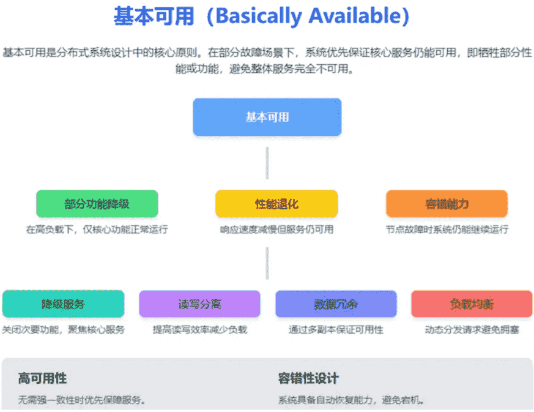
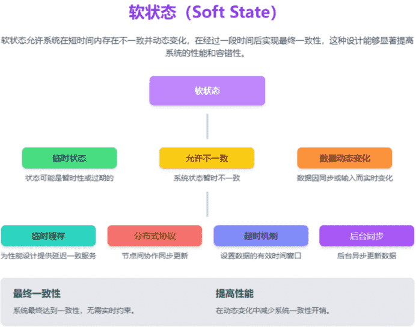
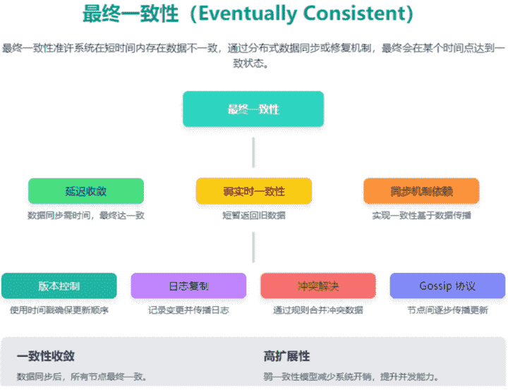

# BASE 理论

**BASE** 是 **Basically Available（基本可用）**、**Soft-state（软状态）** 和 **Eventually Consistent（最终一致性）** 三个短语的缩写。BASE 理论是对 CAP 中一致性 C 和可用性 A 权衡的结果，其来源于对大规模互联网系统分布式实践的总结，是基于 CAP 定理逐步演化而来的，它大大降低了我们对系统的要求。

## BASE 理论的核心思想

即使无法做到强一致性，但每个应用都可以根据自身业务特点，采用适当的方式来使系统达到最终一致性。

> 也就是牺牲数据的一致性来满足系统的高可用性，系统中一部分数据不可用或者不一致时，仍需要保持系统整体“主要可用”。

**BASE 理论本质上是对 CAP 的延伸和补充，更具体地说，是对 CAP 中 AP 方案的一个补充。**

**为什么这样说呢？**

CAP 理论这节我们也说过了：

> 如果系统没有发生“分区”的话，节点间的网络连接通信正常的话，也就不存在 P 了。这个时候，我们就可以同时保证 C 和 A 了。因此，**如果系统发生“分区”，我们要考虑选择 CP 还是 AP。如果系统没有发生“分区”的话，我们要思考如何保证 CA 。**

因此，AP 方案只是在系统发生分区的时候放弃一致性，而不是永远放弃一致性。在分区故障恢复后，系统应该达到最终一致性。这一点其实就是 BASE 理论延伸的地方。

## BASE 理论三要素

### 基本可用

基本可用是指分布式系统在出现不可预知故障的时候，允许损失部分可用性。但是，这绝不等价于系统不可用。

**什么叫允许损失部分可用性呢？**

- **响应时间上的损失**: 正常情况下，处理用户请求需要 0.5s 返回结果，但是由于系统出现故障，处理用户请求的时间变为 3 s。
- **系统功能上的损失**：正常情况下，用户可以使用系统的全部功能，但是由于系统访问量突然剧增，系统的部分非核心功能无法使用。

**基本可用的核心特性**：

- 部分功能降级：在高负载或部分节点失败的情况下，系统可能关闭次要功能，保障主要功能的正常运行。例如：关闭用户评论、推荐算法等非核心功能，确保支付流程可用。
- 性能退化：系统在负载过大时可能会牺牲响应速度，优先保证在线服务的可用性（例如请求延迟增加，但不宕机）。
- 容错能力：系统通过冗余和分布式架构提升容错性，即便部分组件出问题，整体服务仍能继续运行。

**基本可用的实现方式**：

- 降级服务（Graceful Degradation）：在资源紧张时优先保障核心功能，并动态关闭非核心功能。
- 读写分离：优化读操作性能，通过缓存或异步写操作降低负载。
- 数据冗余：使用多节点数据复制保证数据可访问性，即使个别节点失效也不会影响整体服务。
- 负载均衡：自动分流请求至健康的节点，避免资源耗尽导致服务不可用。

**应用场景**：

- 电商网站：在大促销期间，部分算法或次要功能（如推荐或优惠券）被暂时关闭，保证用户能够完成下单和支付流程。
- 分布式系统：通过多机房部署，当某个机房宕机时，其他机房接管流量，确保服务可用。
- CDN 服务：用户请求的非核心静态文件（如图片）可能存在延迟或缓存过期更新的情况，但页面主内容仍然正常加载。

### 软状态

软状态指允许系统中的数据存在中间状态（**CAP 理论中的数据不一致**），并认为该中间状态的存在不会影响系统的整体可用性，即允许系统在不同节点的数据副本之间进行数据同步的过程存在延时。

**Soft State 的核心特性**：

- 状态的临时性：系统在运行过程中，某些数据状态可能为暂时的、不稳定的。例如缓存中的数据在某一时刻可能与主数据库不一致，但短时间后会自动进行更新。
- 允许数据不一致：系统不同节点间的状态可以暂时不一致。不同节点上的数据依赖同步协议在后台异步执行。
- 动态变化：数据可能由于外部输入、定时任务或同步协议而动态更新。数据的软状态能够降低系统的一致性压力。
- 最终一致性：软状态支持“最终一致性原则”，即经过一段时间后，整个系统最终达到一致状态，而不需要强制性实时同步。

**Soft State 的实现方式**：

- 临时缓存 (Temporary Cache)：用于确保数据请求提高性能，允许缓存中数据短时间内过期或不一致。
- 分布式协作协议：系统内部使用如 Gossip 协议，节点间交换更新信息，逐步传播状态。
- 超时机制 (Timeout Mechanisms)：设置数据的有效期或一致性检查时限。
- 后台数据同步 (Background Sync)：通过异步方式完成节点间的数据修复与更新工作。

**应用场景**：

- 电商系统：购物车显示的某些信息（例如：价格或库存）可能会延迟更新，但不会影响最终下单。
- 分布式缓存：Redis 或 Memcached 中的数据可能是一个阶段性软状态。
- 社交媒体系统：例如用户评论、点赞数等可能短时间不同步，但最终数据保持一致。

### 最终一致性

最终一致性强调的是系统中所有的数据副本，在经过一段时间的同步后，最终能够达到一个一致的状态。因此，最终一致性的本质是需要系统保证最终数据能够达到一致，而不需要实时保证系统数据的强一致性。

分布式一致性的 3 种级别：

1. **强一致性**：系统写入了什么，读出来的就是什么。
2. **弱一致性**：不一定可以读取到最新写入的值，也不保证多少时间之后读取到的数据是最新的，只是会尽量保证某个时刻达到数据一致的状态。
3. **最终一致性**：弱一致性的升级版，系统会保证在一定时间内达到数据一致的状态。

**业界比较推崇是最终一致性级别，但是某些对数据一致要求十分严格的场景比如银行转账还是要保证强一致性。**

那实现最终一致性的具体方式是什么呢?

- **读时修复**：在读取数据时，检测数据的不一致，进行修复。比如 Cassandra 的 Read Repair 实现，具体来说，在向 Cassandra 系统查询数据的时候，如果检测到不同节点的副本数据不一致，系统就自动修复数据。
- **写时修复**：在写入数据，检测数据的不一致时，进行修复。比如 Cassandra 的 Hinted Handoff 实现。具体来说，Cassandra 集群的节点之间远程写数据的时候，如果写失败就将数据缓存下来，然后定时重传，修复数据的不一致性。
- **异步修复**：这个是最常用的方式，通过定时对账检测副本数据的一致性，并修复。

比较推荐 **写时修复**，这种方式对性能消耗比较低。

**最终一致性的核心特性**：

- 延迟收敛：数据同步和修复处理可能需要一定的时间，但只要没有新的数据更改，系统最终会达到一致状态（即全局一致性）。
- 弱实时一致性：数据更新后，读操作可能一段时间内返回旧数据，但会随着时间的推移返回最新数据。
- 依赖同步机制：系统之间通过异步消息传递、增量数据更新或日志回放等机制，实现数据传播和同步。

**最终一致性的实现方式**：

- 版本控制 (Version Control)：使用数据的版本号或时间戳，标记最新更新，确保多节点之间更新顺序一致。
- 日志复制 (Log Replication)：节点间通过日志机制传播数据变更，确保所有节点最终拥有相同的日志。
- 冲突检测与解决 (Conflict Resolution)：在多节点写入冲突的情况下，通过算法（如最后写入优先、数据合并等）解决冲突并统一数据。
- Gossip 协议：节点使用类似“谣言传播”的方式互相同步状态，逐渐到达一致。

**应用场景**：

- 电商库存系统：下单后短暂显示旧的库存数据，通过后台修复最终实现数据同步。
- 社交平台消息系统：短时间内同一条消息可能在不同客户端显示状态不一致（如已读/未读），最终同步至一致状态。
- 分布式数据库（如 DynamoDB、Cassandra）：写优先设计，允许短暂的不一致性，最终确保分布式节点的完整同步。

## BASE理论实际应用案例

在一个大型社交媒体平台上，用户可以在线更新他们的个人状态（例如，发布心情、描述活动等）。该平台有多个数据中心，分布在不同的地理位置，以支持全球用户的低延迟访问。为了能够快速响应用户请求并保持高可用性，该平台选择遵循BASE原则。

符合BASE原则的特征：

-   基本可用（Basically Available）：
    - 在这个系统中，即使有部分数据中心出现故障，其他数据中心依然可以处理用户的状态更新和查看请求。
    - 用户可以不间断地继续发布状态，而不需要等待所有数据中心同步完成。
-   软状态（Soft state）：
    - 用户发布的状态信息在传播过程中，允许在短时间内不同数据中心的数据有所不同。
    - 不一致被认为是暂时的，并且在最终一致性（eventual consistency）下会得到解决。
-   最终一致性（Eventually Consistent）
    - 虽然在某个时间点，不同的数据中心可能会显示出不同的用户状态，但是随着时间的推移，通过后台的同步和合并机制，所有数据中心最终会达到一致的状态。
    - 系统可能使用异步复制来慢慢将所有数据中心的数据同步一致。

BASE原则是对CAP中一致性和可用性权衡的结果，它通过牺牲强一致性来获得可用性，并允许数据在一段时间内是不一致的，但最终达到一致状态。

在Java分布式系统开发中，我们经常需要根据具体业务需求来选择适合的原则。例如：

- 对于需要强一致性的场景（如银行交易），可能更倾向于选择CP（一致性和分区容错性）。
- 对于可以容忍短期不一致，但需要高可用的场景（如社交网络的点赞功能），可能更适合选择AP（可用性和分区容错性）并遵循BASE原则。

在实际应用中，我们可能会使用各种技术和框架来实现这些原则，如分布式事务、最终一致性等。理解这些原则对于设计可靠的分布式系统至关重要。

## 总结

**ACID 是数据库事务完整性的理论，CAP 是分布式系统设计理论，BASE 是 CAP 理论中 AP 方案的延伸**

总的来说，BASE 理论面向的是大型高可用可扩展的分布式系统，和传统事务的 ACID 是相反的，它完全不同于 ACID 的强一致性模型，而是通过牺牲强一致性来获得可用性，并允许数据在一段时间是不一致的。

