# Paxos 算法

## 介绍

Paxos 算法是 Leslie Lamport（莱斯利·兰伯特）在 **1990** 年提出了一种分布式系统**共识**算法。这也是第一个被证明完备的共识算法（前提是不存在拜占庭将军问题，也就是没有恶意节点）。

共识算法的作用是让分布式系统中的多个节点之间对某个提案（Proposal）达成一致的看法。提案的含义在分布式系统中十分宽泛，像哪一个节点是 Leader 节点、多个事件发生的顺序等等都可以是一个提案。

兰伯特当时提出的 Paxos 算法主要包含 2 个部分：

- **Basic Paxos 算法**：描述的是多节点之间如何就某个值(提案 Value)达成共识。
- **Multi-Paxos 思想**：描述的是执行多个 Basic Paxos 实例，就一系列值达成共识。Multi-Paxos 说白了就是执行多次 Basic Paxos，核心还是 Basic Paxos 。

## 背景

当今的数据中心和应用程序在高度动态的环境中运行，为了应对高度动态的环境，它们通过额外的服务器进行横向扩展，并且根据需求进行扩展和收缩。同时，服务器和网络故障也很常见。

因此，系统必须在正常操作期间处理服务器的上下线。它们必须对变故做出反应并在几秒钟内自动适应；对客户来说的话，明显的中断通常是不可接受的。

幸运的是，分布式共识可以帮助应对这些挑战。

### 拜占庭将军

在介绍共识算法之前，先介绍一个简化版拜占庭将军的例子来帮助理解共识算法。

> 假设多位拜占庭将军中没有叛军，信使的信息可靠但有可能被暗杀的情况下，将军们如何达成是否要进攻的一致性决定？

解决方案大致可以理解成：先在所有的将军中选出一个大将军，用来做出所有的决定。

举例如下：假如现在一共有 3 个将军 A，B 和 C，每个将军都有一个随机时间的倒计时器，倒计时一结束，这个将军就把自己当成大将军候选人，然后派信使传递选举投票的信息给将军 B 和 C，如果将军 B 和 C 还没有把自己当作候选人（自己的倒计时还没有结束），并且没有把选举票投给其他人，它们就会把票投给将军 A，信使回到将军 A 时，将军 A 知道自己收到了足够的票数，成为大将军。在有了大将军之后，是否需要进攻就由大将军 A 决定，然后再去派信使通知另外两个将军，自己已经成为了大将军。如果一段时间还没收到将军 B 和 C 的回复（信使可能会被暗杀），那就再重派一个信使，直到收到回复。

### 共识算法

共识是可容错系统中的一个基本问题：即使面对故障，服务器也可以在共享状态上达成一致。

共识算法允许一组节点像一个整体一样一起工作，即使其中的一些节点出现故障也能够继续工作下去，其正确性主要是源于复制状态机的性质：一组`Server`的状态机计算相同状态的副本，即使有一部分的`Server`宕机了它们仍然能够继续运行。

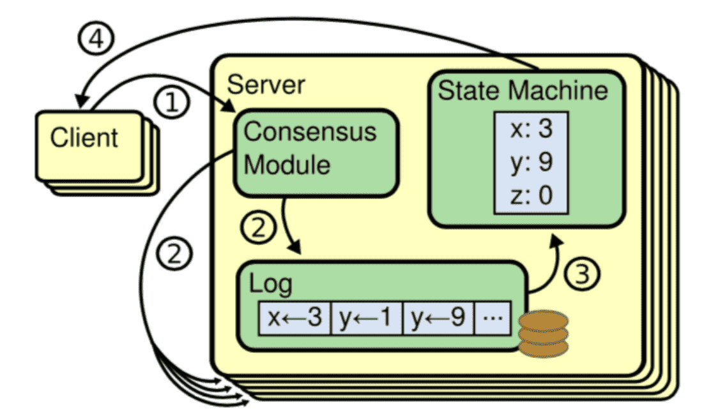

一般通过使用复制日志来实现复制状态机。每个`Server`存储着一份包括命令序列的日志文件，状态机会按顺序执行这些命令。因为每个日志包含相同的命令，并且顺序也相同，所以每个状态机处理相同的命令序列。由于状态机是确定性的，所以处理相同的状态，得到相同的输出。

因此共识算法的工作就是保持复制日志的一致性。服务器上的共识模块从客户端接收命令并将它们添加到日志中。它与其他服务器上的共识模块通信，以确保即使某些服务器发生故障。每个日志最终包含相同顺序的请求。一旦命令被正确地复制，它们就被称为已提交。每个服务器的状态机按照日志顺序处理已提交的命令，并将输出返回给客户端，因此，这些服务器形成了一个单一的、高度可靠的状态机。

适用于实际系统的共识算法通常具有以下特性：

- 安全。确保在非拜占庭条件（也就是上文中提到的简易版拜占庭）下的安全性，包括网络延迟、分区、包丢失、复制和重新排序。
- 高可用。只要大多数服务器都是可操作的，并且可以相互通信，也可以与客户端进行通信，那么这些服务器就可以看作完全功能可用的。因此，一个典型的由五台服务器组成的集群可以容忍任何两台服务器端故障。假设服务器因停止而发生故障；它们稍后可能会从稳定存储上的状态中恢复并重新加入集群。
- 一致性不依赖时序。错误的时钟和极端的消息延迟，在最坏的情况下也只会造成可用性问题，而不会产生一致性问题。

- 在集群中大多数服务器响应，命令就可以完成，不会被少数运行缓慢的服务器来影响整体系统性能。

## Basic Paxos 算法

Paxos算法解决的问题正是分布式一致性问题，即一个分布式系统中的各个进程如何就某个值(决议)达成一致。

Paxos算法运行在允许宕机故障的异步系统中，不要求可靠的消息传递，可容忍消息丢失、延迟、乱序以及重复。它利用大多数 (Majority) 机制保证了2F+1的容错能力，即2F+1个节点的系统最多允许F个节点同时出现故障。

一个或多个提议进程 (Proposer) 可以发起提案 (Proposal)，Paxos算法使所有提案中的某一个提案，在所有进程中达成一致。系统中的多数派同时认可该提案，即达成了一致。最多只针对一个确定的提案达成一致。

### 问题

假设一个集群包含三个节点 A、B、C，提供只读 key-value 存储服务。只读 key-value 的意思是指，当一个 key 被创建时，它的值就确定下来了，且后面不能修改。

客户端 1 和客户端 2 同时试图创建一个 K 键。客户端 1 创建值为 "baili" 的 K，客户端 2 创建值为 "百里" 的 K 。在这种情况下，集群如何达成共识，实现各节点上 K 的值一致呢？

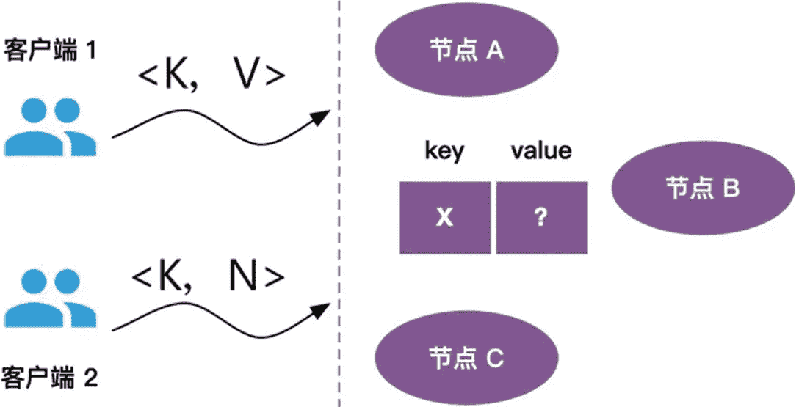

### 角色

Basic Paxos 中存在 3 个重要的角色：

1. **提议者（Proposer）**：也可以叫做协调者（coordinator），提议者负责接受客户端的请求并发起提案 (Proposal)。提案信息通常包括提案编号 (Proposal ID) 和提议的值 (Value)。
2. **接受者（Acceptor）**：也可以叫做投票员（voter），负责对提议者的提案进行投票，同时需要记住自己的投票历史；收到Proposal后可以接受提案，若Proposal获得多数Acceptors的接受，则称该Proposal被批准。
3. **学习者（Learner）**：不参与决策，从Proposers/Acceptors学习最新达成一致的提案(Value)。如果有超过半数接受者就某个提议达成了共识，那么学习者就需要接受这个提议，并就该提议作出运算，然后将运算结果返回给客户端。

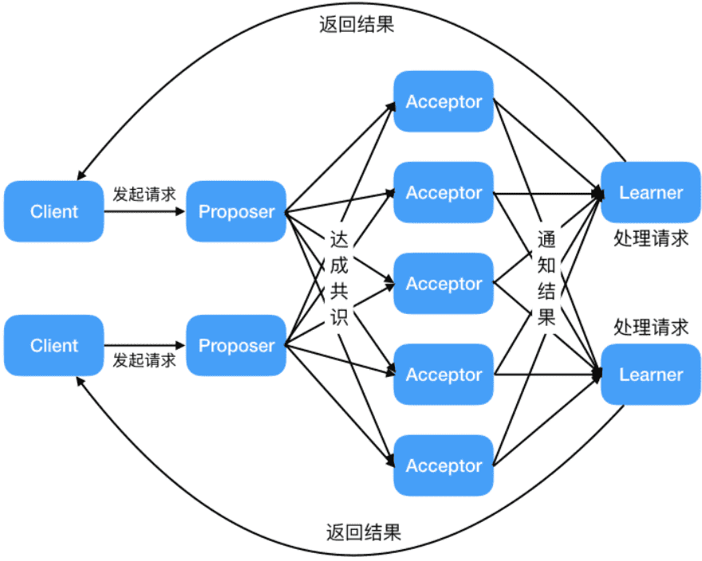

为了减少实现该算法所需的节点数，一个节点可以身兼多个角色。并且，一个提案被选定需要被半数以上的 Acceptor 接受。这样的话，Basic Paxos 算法还具备容错性，在少于一半的节点出现故障时，集群仍能正常工作。

### 算法流程

在 Paxos 算法中，使用提案表示一个提议，提案包括提案编号和提议的值。接下来，我们使用 [n, v] 表示一个提案，其中，n 是提案编号，v 是提案的值。

在 Basic Paxos 中，集群中各个节点为了达成共识，需要进行 2 个阶段的协商，即准备（Prepare）阶段和接受（Accept）阶段。

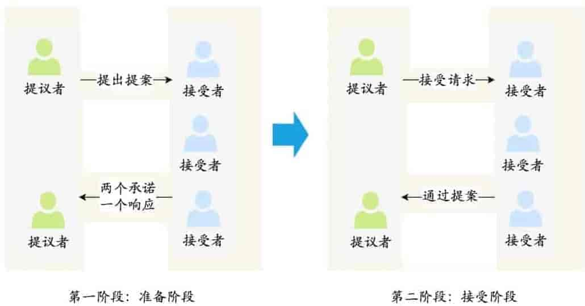

#### prepare(准备)阶段

Proposer向Acceptors发出Prepare请求，Acceptors针对收到的Prepare请求进行Promise承诺。

1. 提议者提议一个新的提案 P[Mn,?]，然后向接受者的某个超过半数的子集成员发送编号为Mn (可使用时间戳加Server ID，全局唯一)的Prepare请求，这里无需携带提案内容，只携带Proposal ID即可。
2. 如果一个接受者收到一个编号为Mn的准备请求，并且编号Mn大于它已经响应的所有准备请求的编号，那么它就会将它已经批准过的最大编号的提案作为响应反馈给提议者，同时该接受者会承诺不会再批准任何编号小于Mn的提案。

接受者在收到提案后，会给与提议者两个承诺与一个应答：

- 两个承诺：
    - 承诺不会再接受提案号小于或等于(注意：这里是<= ) Mn 的 Prepare 请求
    - 承诺不会再接受提案号小于Mn(注意：这里是< ) 的 Accept 请求
- 一个应答：
    - 不违背以前作出的承诺的前提下，回复已经通过的提案中提案号最大的那个提案所设定的值和提案号Mmax，如果这个值从来没有被任何提案设定过，则返回空值。
    - 如果不满足已经做出的承诺，即收到的提案号并不是决策节点收到过的最大的，那允许直接对此 Prepare 请求不予理会。

假设客户端 1 的提案编号是 1，客户端 2 的提案编号为 5，并假设节点 A, B 先收到来自客户端 1 的准备请求，节点 C 先收到来自客户端 2 的准备请求。

客户端作为提议者，向所有的接受者发送包含提案编号的准备请求。注意在准备阶段，请求中不需要指定提议的值，只需要包含提案编号即可。

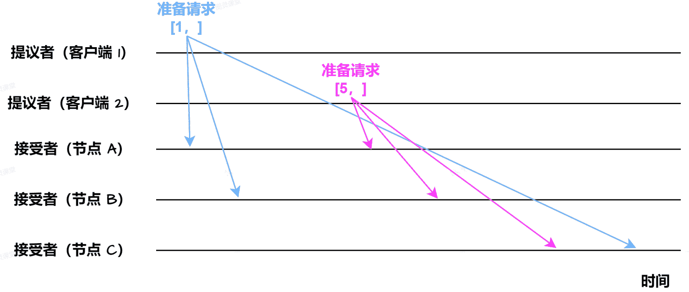

接下来，节点 A，B 接收到客户端 1 的准备请求，节点 C 接收到客户端 2 的准备请求。

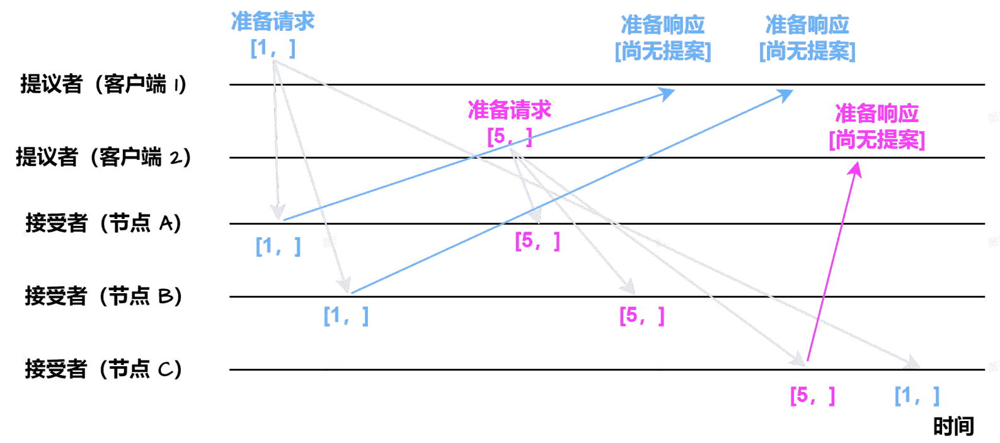

集群中各个节点在接收到第一个准备请求的处理：

- 节点 A, B：由于之前没有通过任何提案，所以节点 A，B 将返回“尚无提案”的准备响应，并承诺以后不再响应提案编号小于等于 1 的准备请求，不会通过编号小于 1 的提案
- 节点 C：由于之前没有通过任何提案，所以节点 C 将返回“尚无提案”的准备响应，并承诺以后不再响应提案编号小于等于 5 的准备请求，不会通过编号小于 5 的提案

接下来，当节点 A，B 接收到提案编号为 5 的准备请求，节点 C 接收到提案编号为 1 的准备请求：

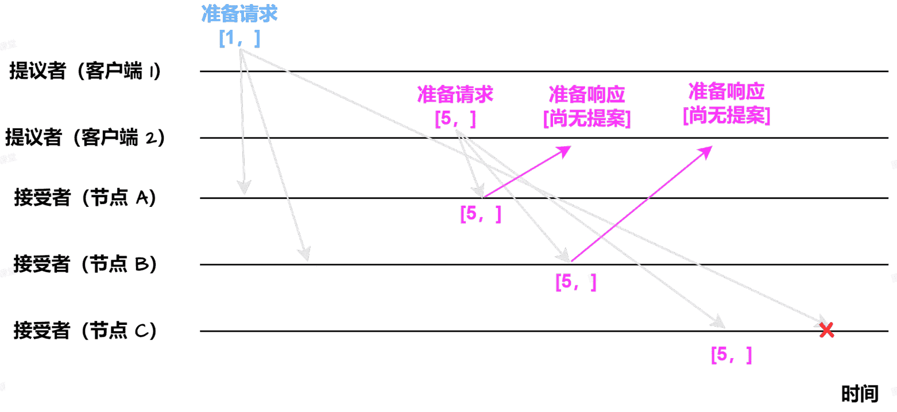

- 节点 A, B：由于提案编号 5 大于之前响应的准备请求的提案编号 1，且节点 A, B 都没有通过任何提案，故均返回“尚无提案”的响应，并承诺以后不再响应提案编号小于等于 5 的准备请求，不会通过编号小于 5 的提案
- 节点 C：由于节点 C 接收到提案编号 1 小于节点 C 之前响应的准备请求的提案编号 5，所以丢弃该准备请求，不作响应

#### Accept(接受)阶段

>   Proposer收到多数Acceptors承诺的Promise后，向Acceptors发出Propose请求，Acceptors针对收到的Propose请求进行Accept处理。
>
>   -   `Propose`：Proposer 收到多数Acceptors的Promise应答后，从应答中选择Proposal ID最大的提案的Value，作为本次要发起的提案。如果所有应答的提案Value均为空值，则可以自己随意决定提案Value。然后携带当前Proposal ID，向所有Acceptors发送Propose请求。
>   -   `Accept`：Acceptor收到Propose请求后，在不违背自己之前作出的承诺下，接受并持久化当前Proposal ID和提案Value。

当客户端 1，2 在收到大多数节点的准备响应之后会开始发送接受请求。

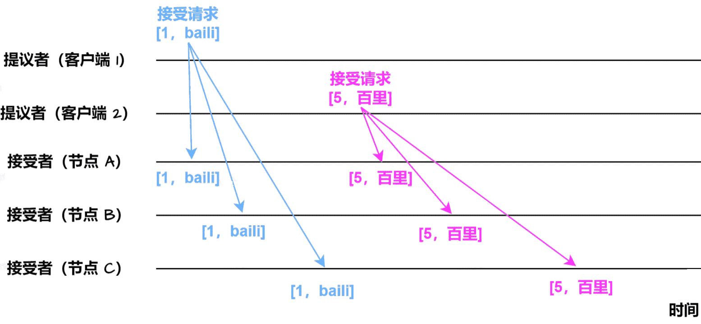

- 客户端 1：客户端 1 接收到大多数的接受者（节点 A, B）的准备响应后，根据响应中的提案编号最大的提案的值，设置接受请求的值。由于节点 A, B 均返回“尚无提案”，即提案值为空，故客户端 1 把自己的提议值 "baili" 作为提案的值，发送接受请求 [1, "baili"]
- 客户端 2：客户端 2 接收到大多数接受者的准备响应后，根据响应中的提案编号最大的提案的值，设置接受请求的值。由于节点 A, B, C 均返回“尚无提案”，即提案值为空，故客户端 2 把自己的提议值 "百里" 作为提案的值，发送接受请求 [5, "百里"]

当节点 A, B, C 接收到客户端 1, 2 的接受请求时，对接受请求进行处理：

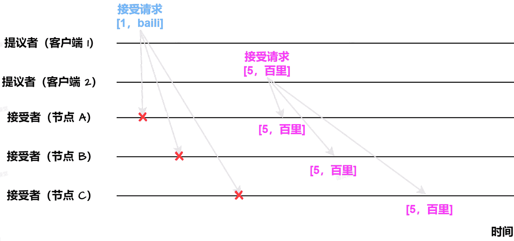

- 节点 A, B, C 接收到接受请求 [1, "baili"]，由于提案编号 1 小于三个节点承诺可以通过的最小提案编号 5，所以提案 [1, "baili"] 被拒绝
- 节点 A, B, C 接收到接受请求 [5, "百里"]，由于提案编号 5 不小于三个节点承诺可以通过的最小提案编号 5，所以通过提案 [5, "百里"]，即三个节点达成共识，接受 X 的值为 "百里"

如果集群中还有学习者，当接受者通过一个提案，就通知学习者，当学习者发现大多数接受者都通过了某个提案，那么学习者也通过该提案，接受提案的值。

总结一下：

1. 如果提议者收到来自半数以上的接受者对于它发出的编号为Mn的准备请求的响应，那么它就会发送一个针对[Mn,Vn]的接受请求给接受者，注意Vn的值就是收到的响应中编号最大的提案的值，如果响应中不包含任何提案，那么它可以随意选定一个值。
2. 如果接受者收到这个针对[Mn,Vn]提案的接受请求，只要该接受者尚未对编号大于Mn的准备请求做出响应，它就可以通过这个提案。
3. 当提议者收到了多数接受者的接受应答后，协商结束，共识决议形成，将形成的决议发送给所有学习节点进行学习。

所以Paxos算法的整体详细流程如下：

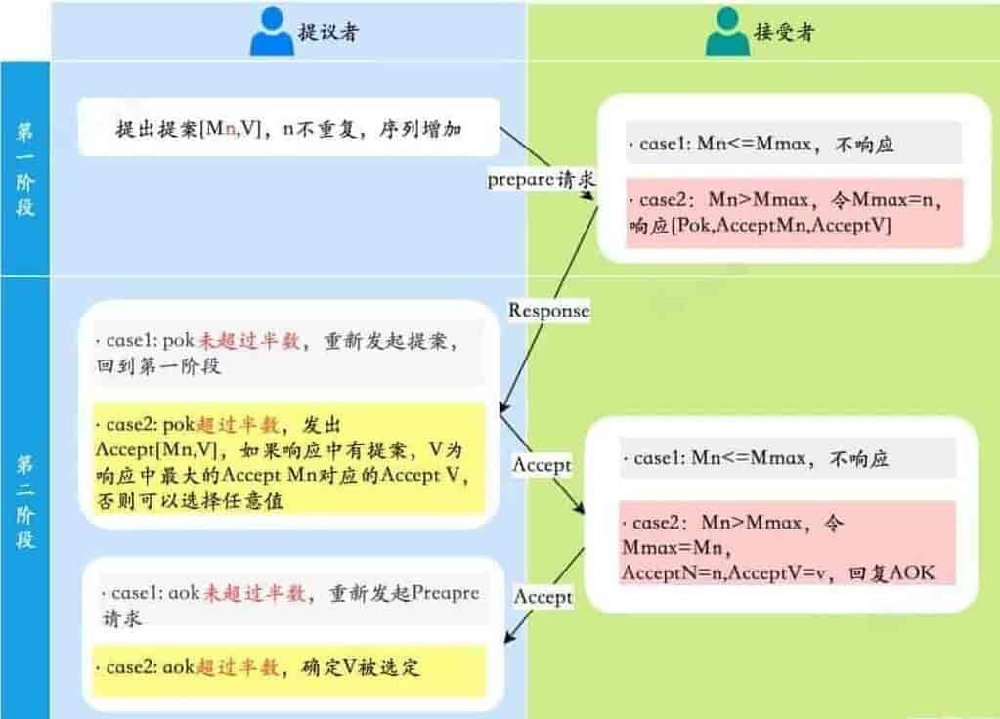

#### 接受者存在已通过提案的情况

>   Proposer在收到多数Acceptors的Accept之后，标志着本次Accept成功，决议形成，将形成的决议发送给所有Learners。

上面例子中，准备阶段和接受阶段均不存在接受者已经通过提案的情况。这里继续使用上面的例子，不过假设节点 A, B 已通过提案 [5, "百里"]，节点 C 未通过任何提案。增加一个新的提议者客户端 3，客户端 3 的提案为 [8，""] 。

接下来，客户端 3 执行准备阶段和接受阶段。

客户端 3 向节点 A, B, C 发送提案编号为 8 的准备请求：

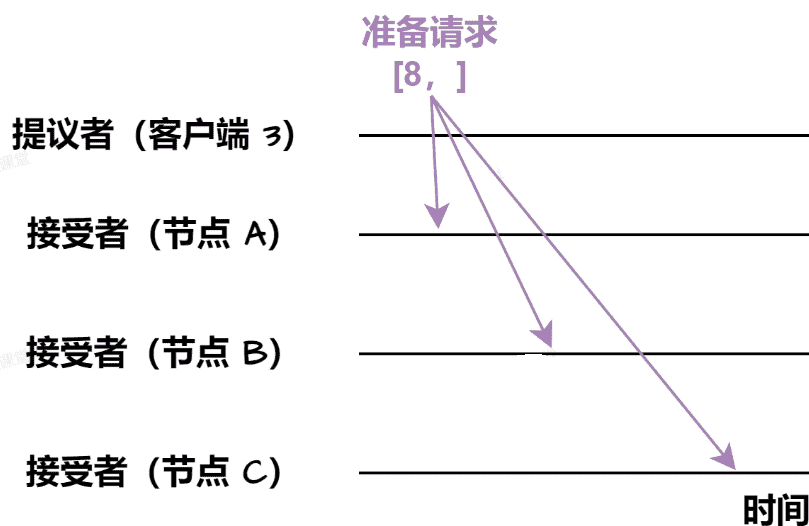

节点 A, B 接收到客户端 3 的准备请求，由于节点 A, B 已通过提案 [5, "百里"]，故在准备响应中，包含此提案信息。

节点 C 接收到客户端 3 的准备请求，由于节点 C 未通过任何提案，故节点 C 将返回“尚无提案”的准备响应。

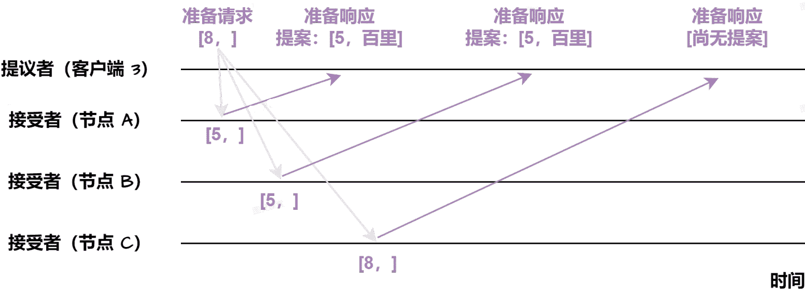

客户端 3 接收到节点 A, B, C 的准备响应后，向节点 A, B, C 发送接受请求。这里需要特点指出，客户端 3 会根据响应中的提案编号最大的提案的值，设置接受请求的值。由于在准备响应中，已包含提案 [5, "百里"]，故客户端 3 将接受请求的提案编号设置为 8，提案值设置为 "" 即接受请求的提案为 [8, ""]：

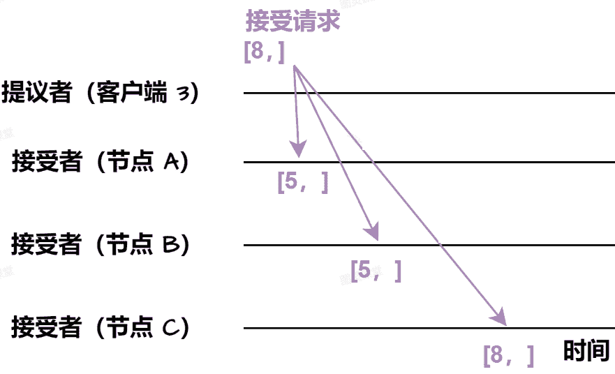

节点 A, B, C 接收到客户端 3 的接受请求，由于提案编号 8 不小于三个节点承诺可以通过的最小提案编号，故均通过提案 [8, ]。

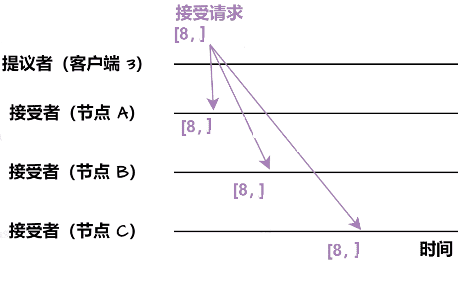

概括来说，Basic Paxos 具有以下特点：

- Basic Paxos 通过二阶段方式来达成共识，即准备阶段和接受阶段
- Basic Paxos 除了达成共识功能，还实现了容错，在少于一半节点出现故障时，集群也能工作
- 提案编号大小代表优先级。对于提案编号，接受者提供三个承诺：
    - 如果准备请求的提案编号，小于等于接受者已经响应的准备请求的提案编号，那么接受者承诺不响应这个准备请求
    - 如果接受请求中的提案编号，小于接受者已经响应的准备请求的提案编号，那么接受者承诺不通过这个提案
    - 如果按受者已通过提案，那些接受者承诺会在准备请求的响应中，包含已经通过的最大编号的提案信息

### 伪代码

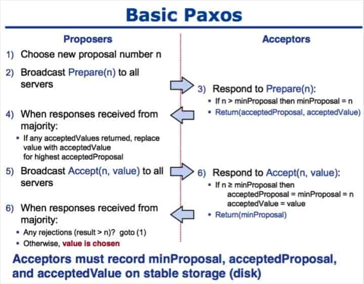

-   获取一个Proposal ID n，为了保证Proposal ID唯一，可采用时间戳+Server ID生成；
-   Proposer向所有Acceptors广播Prepare(n)请求；
-   Acceptor比较n和minProposal，如果n>minProposal，minProposal=n，并且将 acceptedProposal 和 acceptedValue 返回；
-   Proposer接收到过半数回复后，如果发现有acceptedValue返回，将所有回复中acceptedProposal最大的acceptedValue作为本次提案的value，否则可以任意决定本次提案的value；
-   到这里可以进入第二阶段，广播Accept (n,value) 到所有节点；
-   Acceptor比较n和minProposal，如果n>=minProposal，则acceptedProposal=minProposal=n，acceptedValue=value，本地持久化后，返回；否则，返回minProposal。
-   提议者接收到过半数请求后，如果发现有返回值result >n，表示有更新的提议，跳转到1；否则value达成一致。

#### 死循环问题（活锁）

>   两个Proposers交替Prepare成功，而Accept失败，形成活锁(Livelock)。

比如说，此时提案者 P1 提出一个方案 M1，完成了 Prepare 阶段的工作，这个时候 acceptor 则批准了 M1，但是此时提案者 P2 同时也提出了一个方案 M2，它也完成了 Prepare 阶段的工作。然后 P1 的方案已经不能在第二阶段被批准了（因为 acceptor 已经批准了比 M1 更大的 M2），所以 P1 自增方案变为 M3 重新进入 Prepare 阶段，然后 acceptor，又批准了新的 M3 方案，它又不能批准 M2 了，这个时候 M2 又自增进入 Prepare 阶段。

就这样无休无止的永远提案下去，这就是 paxos 算法的死循环问题。

那么如何解决呢？很简单，人多了容易吵架，那么现在 **就允许一个能提案** 就行了。

## Multi Paxos 思想

>   Paxos算法有什么缺点吗？怎么优化？Basic Paxos 算法只能对单个值达成共识，决议的形成至少需要两次网络来回，在高并发情况下可能需要更多的网络来回，极端情况下甚至可能形成活锁。如果想连续确定多个值，Basic Paxos搞不定了。因此Basic Paxos几乎只是用来做理论研究，并不直接应用在实际工程中。
>

实际应用中几乎都需要连续确定多个值，而且希望能有更高的效率。Multi-Paxos正是为解决此问题而提出。

如果直接通过多次执行 Basic Paxos 实例方式，来实现一系列值的共识，存在以下问题：

- 如果集群中多个提议者同时在准备阶段提交提案，可能会出现没有提议者接收到大多数准备响应，导致需要重新提交准备请求。例如，在一个 5 个节点的集群中，有 3 个节点同时作为提议者同时提交提案，那就会出现没有一个提议者获取大多数的准备响应，而需要重新提交
- 为了达成一个值的共识，需要进行 2 轮 RPC 通讯，分别是准备阶段和接受阶段，性能低下

为了解决以上问题，Multi-Paxos基于Basic Paxos做了两点改进（引入了领导者和优化了 Basic Paxos 的执行过程）：

-   针对每一个要确定的值，运行一次Paxos算法实例(Instance)，形成决议。每一个Paxos实例使用唯一的Instance ID标识。
-   在所有Proposers中选举一个Leader，由Leader唯一地提交Proposal给Acceptors进行表决。这样没有Proposer竞争，解决了活锁问题。在系统中仅有一个Leader进行Value提交的情况下，Prepare阶段就可以跳过，从而将两阶段变为一阶段，提高效率。

>   Multi Paxos 算法是一个统称，是指基于 Multi Paxos 思想，通过多个 Basic Paxos 实例实现一系列值的共识的算法（例如 Raft 算法等）。

### 领导者

上面的问题一存在多个提议者同时提交准备请求的情况，如果引入了领导者，由领导者作为唯一的提议者，就可以解决问题一中的冲突的问题。

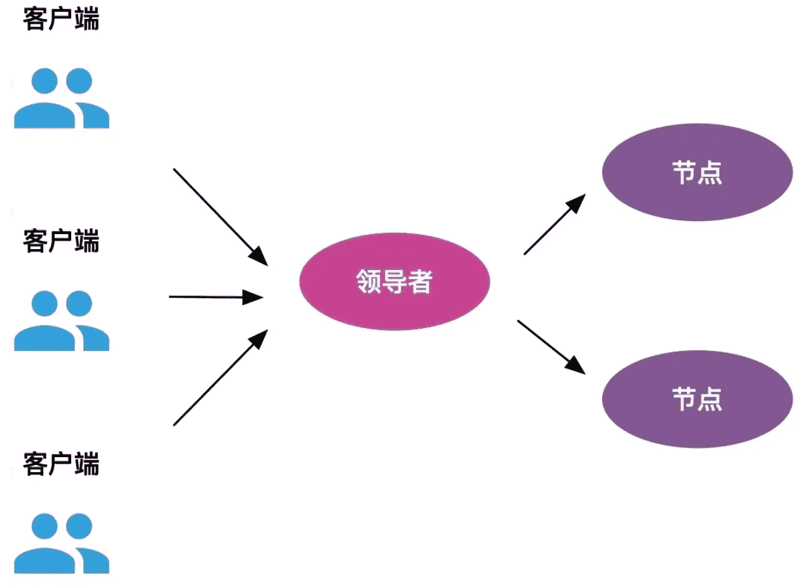

>   Lamport 没有说明如何选举领导者，需要在实现 Multi Paxos 算法的时候自行实现。

Multi-Paxos首先需要选举Leader，Leader的确定也是一次决议的形成，所以可执行一次Basic Paxos实例来选举出一个Leader。选出Leader之后只能由Leader提交Proposal，在Leader宕机之后服务临时不可用，需要重新选举Leader继续服务。在系统中仅有一个Leader进行Proposal提交的情况下，Prepare阶段可以跳过。

 ### 优化 Basic Paxos 执行过程

准备阶段的意义，是发现接受者节点上已通过的提案的值。引入领导者后，只有领导者才可发送提议，因此，领导者的提案就已经是最新的了，不再需要通过准备阶段来发现之前被大多数节点通过的提案，领导者可以独立指定提议的值。

这样一来，准备阶段存在就没有意义了，领导者可以直接跳过准备阶段，直接进行接受阶段，减少了 RPC 通讯次数。

>   Multi-Paxos通过改变Prepare阶段的作用范围至后面Leader提交的所有实例，从而使得Leader的连续提交只需要执行一次Prepare阶段，后续只需要执行Accept阶段，将两阶段变为一阶段，提高了效率。为了区分连续提交的多个实例，每个实例使用一个Instance ID标识，Instance ID由Leader本地递增生成即可。
>
>   Multi-Paxos允许有多个自认为是Leader的节点并发提交Proposal而不影响其安全性，这样的场景即退化为Basic Paxos。

 ### Chubby 的 Multi Paxos 实现

Google 分布式锁 Chubby 实现了 Multi Paxos 算法。Chubby 的 Multi Paxos 算法主要包括：

- Chubby 引入主节点作为领导者，即主节点作为唯一提议者，不存在多个提议者同时提交提案的情况，也不存在提案冲突的情况。Chubby 通过执行 Basic Paxos 算法进行投票选举产生主节点
- 在 Chubby 中，由于引入了主节点，因此，也去除了 Basic Paxos 的准备阶段
- 在 Chubby 中，为实现强一致性，所有的读请求和写请求都由主节点来处理

1. Chubby 所有的写请求由主节点来处理：当主节点接收到客户端的写请求，作为提议者，将数据发送给所有节点，在大多数服务器接受了这个写请求后，给客户端响应写成功。

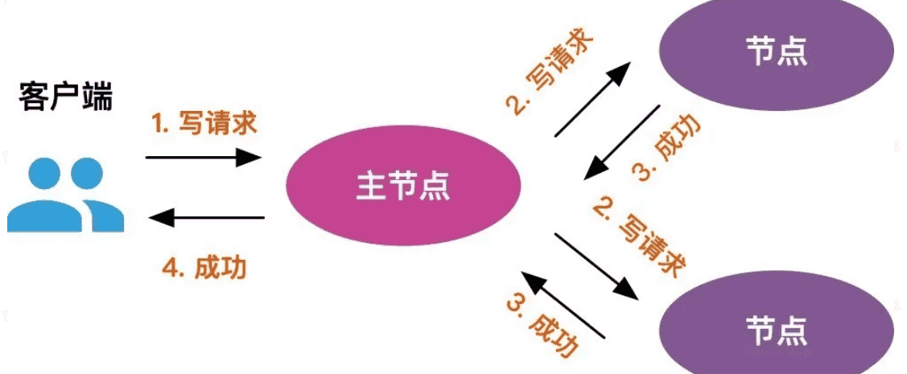

2. Chubby 所有的读请求由主节点来处理：当主节点接收到读请求，主节点只需要查询本地数据，然后返回给客户端。

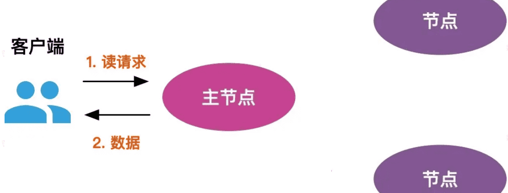

⚠️**注意**：Multi-Paxos 只是一种思想，并不是算法，这种思想的核心就是通过多个 Basic Paxos 实例就一系列值达成共识。也就是说，Basic Paxos 是 Multi-Paxos 思想的核心，Multi-Paxos 就是多执行几次 Basic Paxos。

由于兰伯特提到的 Multi-Paxos 思想缺少代码实现的必要细节(比如怎么选举领导者)，所以在理解和实现上比较困难。因此，Multi Paxos 的算法实现，是建立在一个未经证明的基础之上。实现 Multi Paxos 算法，最大的挑战是如何证明它是正确的。

不过，也不需要担心，并不需要自己实现基于 Multi-Paxos 思想的共识算法，业界已经有了比较出名的实现。像 Raft 算法就是 Multi-Paxos 的一个变种，其简化了 Multi-Paxos 的思想，变得更容易被理解以及工程实现，实际项目中可以优先考虑 Raft 算法。

## Paxos的变种优化

>   通常说Paxos算法是复杂算法难以理解是指其推导过程复杂。理论证明一个Paxos的实现，比实现这个Paxos还要难。一个成熟的Paxos实现很难独立产生，往往需要和一个系统结合在一起，通过一个或者多个系统来验证其可靠性和完备性。

由于 Paxos 算法在国际上被公认的非常难以理解和实现，因此不断有人尝试简化这一算法。到了 2013 年才诞生了一个比 Paxos 算法更易理解和实现的共识算法—Raft 算法。更具体点来说，Raft 是 Multi-Paxos 的一个变种，其简化了 Multi-Paxos 的思想，变得更容易被理解以及工程实现。

-   针对没有恶意节点的情况，除Raft算法外，当前最常用的一些共识算法比如 **ZAB 协议**、**Fast Paxos** 算法都是基于 Paxos 算法改进的。

-   针对存在恶意节点的情况，一般使用的是**工作量证明（POW，Proof-of-Work）**、**权益证明（PoS，Proof-of-Stake ）** 等共识算法。
