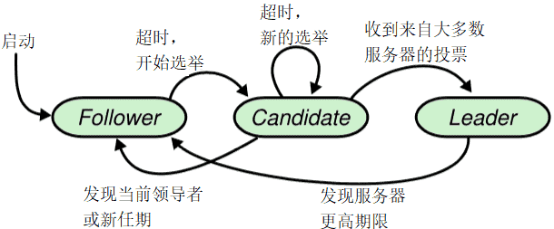
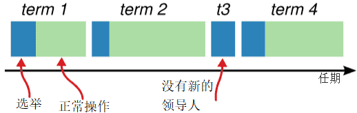
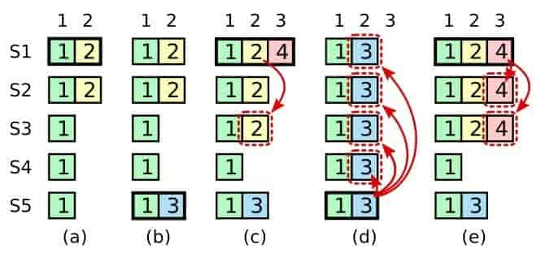
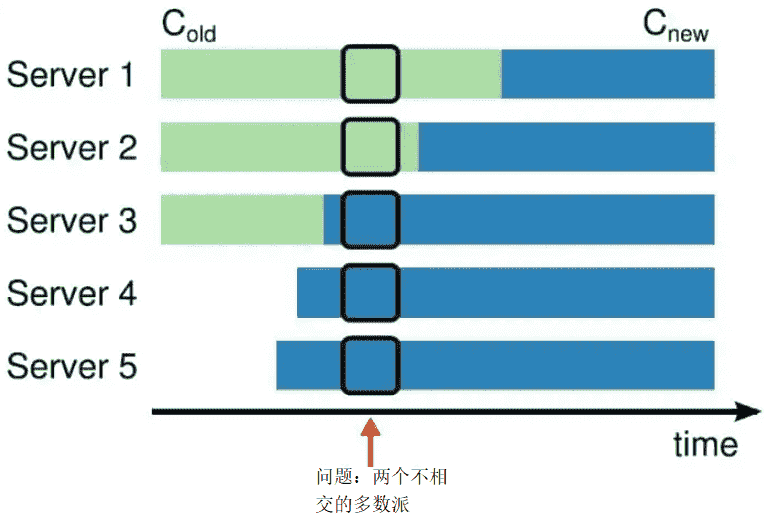
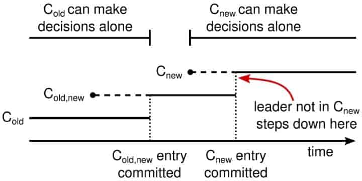

# Raft 算法详解

为什么Raft算法是分布式系统的首选？

## Raft算法是什么？

Paxos是出了名的难懂，而Raft正是为了探索一种更易于理解的一致性算法而产生的。它的首要设计目的就是易于理解，所以在选主的冲突处理等方式上它都选择了非常简单明了的解决方案。

Paxos 和 Raft 都是为了实现==一致性==产生的，不同于Paxos算法直接从分布式一致性问题出发推导出来，Raft算法则是从多副本状态机的角度提出，用于管理多副本状态机的日志复制。

Raft实现了和Paxos相同的功能，它将一致性分解为多个子问题：Leader选举(Leader election)、日志同步(Log replication)、安全性(Safety)、日志压缩(Log compaction)、成员变更(Membership change)等。同时，Raft算法使用了更强的假设来减少了需要考虑的状态，使之变的易于理解和实现。

## 基础

### 节点类型

一个 Raft 集群包括若干服务器，以典型的 5 服务器集群举例。在任意的时间，每个服务器一定会处于以下三个状态中的一个：

- `Leader`：负责发起心跳，接受客户端请求，并向Follower同步请求日志，当日志同步到大多数节点上后告诉Follower提交日志。
- `Candidate`：Leader 选举过程中的临时角色，由 Follower 转化而来，发起投票参与竞选。
- `Follower`：接受 Leader 的心跳和日志同步数据，在Leader告之日志可以提交之后，提交日志；投票给 Candidate。

在正常的情况下，只有一个服务器是 Leader，剩下的服务器是Follower。Follower是被动的，它们不会发送任何请求，只是响应来自 Leader 和 Candidate 的请求。

三类角色的变迁图如下：

Follower只响应其他服务器的请求。如果Follower超时没有收到Leader的消息，它会成为一个Candidate并且开始一次Leader选举。收到大多数服务器投票的Candidate会成为新的Leader。Leader在宕机之前会一直保持Leader的状态。

### 任期

如图所示，raft 算法将时间划分为任意长度的任期（term），任期用连续的数字表示，看作当前 term 号。每一个任期的开始都是一次选举，在选举开始时，一个或多个 Candidate 会尝试成为 Leader。如果一个 Candidate 赢得了选举，它就会在该任期内担任 Leader。

在成功选举Leader之后，Leader会在整个term内管理整个集群。如果Leader选举失败，该term就会因为没有Leader而结束。

如果没有选出 Leader，将会开启另一个任期，并立刻开始下一次选举。raft 算法保证在给定的一个任期最少要有一个 Leader。

每个节点都会存储当前的 term 号，当服务器之间进行通信时会交换当前的 term 号；如果有服务器发现自己的 term 号比其他人小，那么他会更新到较大的 term 值。如果一个 Candidate 或者 Leader 发现自己的 term 过期了，他会立即退回成 Follower。如果一台服务器收到的请求的 term 号是过期的，那么它会拒绝此次请求。

### 日志

- `entry`：每一个事件成为 entry，只有 Leader 可以创建 entry。entry 的内容为`<term,index,cmd>`，其中 cmd 是可以应用到状态机的操作。
- `log`：由 entry 构成的数组，每一个 entry 都有一个表明自己在 log 中的 index。只有 Leader 才可以改变其他节点的 log。entry 总是先被 Leader 添加到自己的 log 数组中，然后再发起共识请求，获得同意后才会被 Leader 提交给状态机。Follower 只能从 Leader 获取新日志和当前的 commitIndex，然后把对应的 entry 应用到自己的状态机中。

## Raft算法子问题

Raft实现了和Paxos相同的功能，它将一致性分解为多个子问题：

- Leader选举(Leader election)
- 日志同步(Log replication)
- 安全性(Safety)
- 日志压缩(Log compaction)
- 成员变更(Membership change)

### 领导人选举

raft 使用心跳机制来触发 Leader 的选举。当Server启动时，初始化为Follower。Leader向所有Followers周期性发送heartbeat。如果Follower在选举超时时间内没有收到Leader的heartbeat，就会等待一段随机的时间后发起一次Leader选举。

Follower将其当前term加一然后转换为Candidate。它首先给自己投票并且给集群中的其他服务器发送 RequestVote RPC 。结果有以下三种情况：

- 赢得了多数（超过1/2）的选票，成功选举为Leader；
- 收到了Leader的消息，表示有其它服务器已经抢先当选了Leader；
- 没有Server赢得多数的选票，Leader选举失败，等待选举时间超时（Election Timeout）后发起下一次选举。

在 Candidate 等待选票的时候，它可能收到其他节点声明自己是 Leader 的心跳，此时有两种情况：

- 该 Leader 的 term 号大于等于自己的 term 号，说明对方已经成为 Leader，则自己回退为 Follower。

- 该 Leader 的 term 号小于自己的 term 号，那么会拒绝该请求并让该节点更新 term。

如果一台服务器能够收到来自 Leader 或者 Candidate 的有效信息，那么它会一直保持为 Follower 状态，并且刷新自己的 electionElapsed，重新计时。

选举出Leader后，Leader会向所有的 Follower 周期性发送心跳来保证自己的 Leader 地位。如果一个 Follower 在一个周期内没有收到心跳信息，就叫做选举超时，然后它就会认为此时没有可用的 Leader，并且开始进行一次选举以选出一个新的 Leader。

为了开始新的选举，Follower 会自增自己的 term 号并且转换状态为 Candidate。然后他会向所有节点发起 RequestVoteRPC 请求，Candidate 的状态会持续到以下情况发生：

- 赢得选举
- 其他节点赢得选举
- 一轮选举结束，无人胜出

赢得选举的条件是：一个 Candidate 在一个任期内收到了来自集群内的多数选票`N/2+1`，就可以成为 Leader。

在 Candidate 等待选票的时候，它可能收到其他节点声明自己是 Leader 的心跳，此时有两种情况：

- 该 Leader 的 term 号大于等于自己的 term 号，说明对方已经成为 Leader，则自己回退为 Follower。
- 该 Leader 的 term 号小于自己的 term 号，那么会拒绝该请求并让该节点更新 term。

由于可能同一时刻出现多个 Candidate，导致没有 Candidate 获得大多数选票，如果没有其他手段来重新分配选票的话，那么可能会无限重复下去。

raft 使用了随机的选举超时时间来避免上述情况。每一个 Candidate 在发起选举后，都会随机化一个新的选举超时时间，这种机制使得各个服务器能够分散开来，在大多数情况下只有一个服务器会率先超时；它会在其他服务器超时之前赢得选举。

>   Raft保证选举出的Leader上一定具有最新的已提交的日志。

### 日志复制/同步

一旦选出了 Leader，它就开始接受客户端的请求。每一个客户端的请求都包含一条需要被复制状态机（`Replicated State Machine`）执行的命令。

Leader 收到客户端请求后，会生成一个 entry，包含`<index,term,cmd>`，再将这个 entry 添加到自己的日志末尾后，向所有的节点广播该 entry，要求其他服务器复制这条 entry。

-   如果 Follower 接受该 entry，则会将 entry 添加到自己的日志后面，同时返回给 Leader 同意。

-   如果 Leader 收到了多数的成功响应，Leader 会将这个 entry 应用到自己的状态机中，之后可以称这个 entry 是 committed 的，并且向客户端返回执行结果。

>   某些Followers可能没有成功的复制日志，Leader会无限的重试 AppendEntries RPC直到所有的Followers最终存储了所有的日志条目。

raft 保证以下两个性质：

- 在两个日志里，有两个 entry 拥有相同的 index 和 term，那么它们一定有相同的 cmd
- 在两个日志里，有两个 entry 拥有相同的 index 和 term，那么它们前面的 entry 也一定相同

通过“仅有 Leader 可以生成 entry”来保证第一个性质，第二个性质需要一致性检查来进行保证。

一般情况下，Leader 和 Follower 的日志保持一致，然后，Leader 的崩溃会导致日志不一样，这样一致性检查会产生失败。

一个Follower可能会丢失掉Leader上的一些条目，也有可能包含一些Leader没有的条目，也有可能两者都会发生。丢失的或者多出来的条目可能会持续多个任期。Leader 通过强制 Follower 复制自己的日志来处理日志的不一致。这就意味着，在 Follower 上的冲突日志会被Leader的日志覆盖。

为了使得 Follower 的日志和自己的日志一致，Leader 需要找到 Follower 与它日志一致的地方，然后删除 Follower 在该位置之后的日志，接着把这之后的日志发送给 Follower。Leader会从后往前试，每次AppendEntries失败后尝试前一个日志条目，直到成功找到每个Follower的日志一致位点，然后向后逐条覆盖Followers在该位置之后的条目。

`Leader` 给每一个`Follower` 维护了一个 `nextIndex`，它表示 `Leader` 将要发送给该追随者的下一条日志条目的索引。当一个 `Leader` 开始掌权时，它会将 `nextIndex` 初始化为它的最新的日志条目索引数+1。如果一个 `Follower` 的日志和 `Leader` 的不一致，`AppendEntries` 一致性检查会在下一次 `AppendEntries RPC` 时返回失败。在失败之后，`Leader` 会将 `nextIndex` 递减然后重试 `AppendEntries RPC`。最终 `nextIndex` 会达到一个 `Leader` 和 `Follower` 日志一致的地方。这时，`AppendEntries` 会返回成功，`Follower` 中冲突的日志条目都被移除了，并且添加所缺少的上了 `Leader` 的日志条目。一旦 `AppendEntries` 返回成功，`Follower` 和 `Leader` 的日志就一致了，这样的状态会保持到该任期结束。

### 安全性

Raft增加了如下两条限制以保证安全性：

-   ==拥有最新的已提交的log entry的Follower才有资格成为Leader==。这个保证是在RequestVote RPC中做的，Candidate在发送RequestVote RPC时，要带上自己的最后一条日志的term和log index，其他节点收到消息时，如果发现自己的日志比请求中携带的更新，则拒绝投票。日志比较的原则是，如果本地的最后一条log entry的term更大，则term大的更新，如果term一样大，则log index更大的更新。

-   Leader只能推进commit index来提交当前term的已经复制到大多数服务器上的日志，旧term日志的提交要等到提交当前term的日志来间接提交(log index 小于 commit index的日志被间接提交)。

之所以要这样，是因为可能会出现已提交的日志又被覆盖的情况：

在阶段a，term为2，S1是Leader，且S1写入日志(term, index)为(2, 2)，并且日志被同步写入了S2；

在阶段b，S1离线，触发一次新的选主，此时S5被选为新的Leader，此时系统term为3，且写入了日志(term, index)为(3，2)；

S5尚未将日志推送到Followers就离线了，进而触发了一次新的选主，而之前离线的S1经过重新上线后被选中变成Leader，此时系统term为4，此时S1会将自己的日志同步到Followers，按照上图就是将日志(2，2)同步到了S3，而此时由于该日志已经被同步到了多数节点(S1, S2, S3)，因此，此时日志(2，2)可以被提交了。；

在阶段d，S1又下线了，触发一次选主，而S5有可能被选为新的Leader(这是因为S5可以满足作为主的一切条件：1. term = 5 > 4，2. 最新的日志为(3，2)，比大多数节点(如S2/S3/S4的日志都新)，然后S5会将自己的日志更新到Followers，于是S2、S3中已经被提交的日志(2，2)被截断了。

增加上述限制后，即使日志(2，2)已经被大多数节点(S1、S2、S3)确认了，但是它不能被提交，因为它是来自之前term(2)的日志，直到S1在当前term(4)产生的日志(4，4)被大多数Followers确认，S1方可提交日志(4，4)这条日志，当然，根据Raft定义，(4，4)之前的所有日志也会被提交。此时即使S1再下线，重新选主时S5不可能成为Leader，因为它没有包含大多数节点已经拥有的日志(4，4)。

#### 选举限制

Leader 需要保证自己存储全部已经提交的日志条目。这样才可以使日志条目只有一个流向：从 Leader 流向 Follower，Leader 永远不会覆盖已经存在的日志条目。

每个 Candidate 发送 RequestVoteRPC 时，都会带上最后一个 entry 的信息。所有节点收到投票信息时，会对该 entry 进行比较，如果发现自己的更新，则拒绝投票给该 Candidate。

判断日志新旧的方式：如果两个日志的 term 不同，term 大的更新；如果 term 相同，更长的 index 更新。

#### 节点崩溃

如果 Leader 崩溃，集群中的节点在 electionTimeout 时间内没有收到 Leader 的心跳信息就会触发新一轮的选主，在选主期间整个集群对外是不可用的。

如果 Follower 和 Candidate 崩溃，处理方式会简单很多。之后发送给它的 RequestVoteRPC 和 AppendEntriesRPC 会失败。由于 raft 的所有请求都是幂等的，所以失败的话会无限的重试。如果崩溃恢复后，就可以收到新的请求，然后选择追加或者拒绝 entry。

#### 时间与可用性

raft 的要求之一就是安全性不依赖于时间：系统不能仅仅因为一些事件发生的比预想的快一些或者慢一些就产生错误。为了保证上述要求，最好能满足以下的时间条件：

`broadcastTime << electionTimeout << MTBF`

- `broadcastTime`：向其他节点并发发送消息的平均响应时间；
- `electionTimeout`：选举超时时间；
- `MTBF(mean time between failures)`：单台机器的平均健康时间；

`broadcastTime`应该比`electionTimeout`小一个数量级，为的是使`Leader`能够持续发送心跳信息（heartbeat）来阻止`Follower`开始选举；

`electionTimeout`也要比`MTBF`小几个数量级，为的是使得系统稳定运行。当`Leader`崩溃时，大约会在整个`electionTimeout`的时间内不可用；我们希望这种情况仅占全部时间的很小一部分。

由于`broadcastTime`和`MTBF`是由系统决定的属性，因此需要决定`electionTimeout`的时间。

一般来说，broadcastTime 一般为 `0.5～20ms`，electionTimeout 可以设置为 `10～500ms`，MTBF 一般为一两个月。

### 日志压缩

在实际的系统中，不能让日志无限增长，否则系统重启时需要花很长的时间进行回放，从而影响可用性。Raft采用对整个系统进行snapshot来解决，snapshot之前的日志都可以丢弃。

每个副本独立的对自己的系统状态进行snapshot，并且只能对已经提交的日志记录进行snapshot。

Snapshot中包含以下内容：

- 日志元数据。最后一条已提交的 log entry的 log index和term。这两个值在snapshot之后的第一条log entry的AppendEntries RPC的完整性检查的时候会被用上。
- 系统当前状态。

当Leader要发给某个日志落后太多的Follower的log entry被丢弃，Leader会将snapshot发给Follower。或者当新加进一台机器时，也会发送snapshot给它。发送snapshot使用InstalledSnapshot RPC。

做snapshot既不要做的太频繁，否则消耗磁盘带宽，也不要做的太不频繁，否则一旦节点重启需要回放大量日志，影响可用性。推荐当日志达到某个固定的大小做一次snapshot。

做一次snapshot可能耗时过长，会影响正常日志同步。可以通过使用copy-on-write技术避免snapshot过程影响正常日志同步。

### 成员变更

成员变更是在集群运行过程中副本发生变化，如增加/减少副本数、节点替换等。

成员变更也是一个分布式一致性问题，既所有服务器对新成员达成一致。但是成员变更又有其特殊性，因为在成员变更的一致性达成的过程中，参与投票的进程会发生变化。

如果将成员变更当成一般的一致性问题，直接向Leader发送成员变更请求，Leader复制成员变更日志，达成多数派之后提交，各服务器提交成员变更日志后从旧成员配置(Cold)切换到新成员配置(Cnew)。

因为各个服务器提交成员变更日志的时刻可能不同，造成各个服务器从旧成员配置(Cold)切换到新成员配置(Cnew)的时刻不同。

成员变更不能影响服务的可用性，但是成员变更过程的某一时刻，可能出现在Cold和Cnew中同时存在两个不相交的多数派，进而可能选出两个Leader，形成不同的决议，破坏安全性。

由于成员变更的这一特殊性，成员变更不能当成一般的一致性问题去解决。

为了解决这一问题，Raft提出了两阶段的成员变更方法。集群先从旧成员配置Cold切换到一个过渡成员配置，称为共同一致(joint consensus)，共同一致是旧成员配置Cold和新成员配置Cnew的组合Cold U Cnew，一旦共同一致Cold U Cnew被提交，系统再切换到新成员配置Cnew。

Raft两阶段成员变更过程如下：

1. Leader收到成员变更请求从Cold切成Cnew；
2. Leader在本地生成一个新的log entry，其内容是Cold∪Cnew，代表当前时刻新旧成员配置共存，写入本地日志，同时将该log entry复制至Cold∪Cnew中的所有副本。在此之后新的日志同步需要保证得到Cold和Cnew两个多数派的确认；
3. Follower收到Cold∪Cnew的log entry后更新本地日志，并且此时就以该配置作为自己的成员配置；
4. 如果Cold和Cnew中的两个多数派确认了Cold U Cnew这条日志，Leader就提交这条log entry；
5. 接下来Leader生成一条新的log entry，其内容是新成员配置Cnew，同样将该log entry写入本地日志，同时复制到Follower上；
6. Follower收到新成员配置Cnew后，将其写入日志，并且从此刻起，就以该配置作为自己的成员配置，并且如果发现自己不在Cnew这个成员配置中会自动退出；
7. Leader收到Cnew的多数派确认后，表示成员变更成功，后续的日志只要得到Cnew多数派确认即可。Leader给客户端回复成员变更执行成功。

异常分析：

- 如果Leader的Cold U Cnew尚未推送到Follower，Leader就挂了，此后选出的新Leader并不包含这条日志，此时新Leader依然使用Cold作为自己的成员配置。
- 如果Leader的Cold U Cnew推送到大部分的Follower后就挂了，此后选出的新Leader可能是Cold也可能是Cnew中的某个Follower。
- 如果Leader在推送Cnew配置的过程中挂了，那么同样，新选出来的Leader可能是Cold也可能是Cnew中的某一个，此后客户端继续执行一次改变配置的命令即可。
- 如果大多数的Follower确认了Cnew这个消息后，那么接下来即使Leader挂了，新选出来的Leader肯定位于Cnew中。
- 两阶段成员变更比较通用且容易理解，但是实现比较复杂，同时两阶段的变更协议也会在一定程度上影响变更过程中的服务可用性，因此我们期望增强成员变更的限制，以简化操作流程。

两阶段成员变更，之所以分为两个阶段，是因为对Cold与Cnew的关系没有做任何假设，为了避免Cold和Cnew各自形成不相交的多数派选出两个Leader，才引入了两阶段方案。

如果增强成员变更的限制，假设Cold与Cnew任意的多数派交集不为空，这两个成员配置就无法各自形成多数派，那么成员变更方案就可能简化为一阶段。

那么如何限制Cold与Cnew，使之任意的多数派交集不为空呢? 方法就是每次成员变更只允许增加或删除一个成员。

可从数学上严格证明，只要每次只允许增加或删除一个成员，Cold与Cnew不可能形成两个不相交的多数派。

一阶段成员变更：

- 成员变更限制每次只能增加或删除一个成员(如果要变更多个成员，连续变更多次)。
- 成员变更由Leader发起，Cnew得到多数派确认后，返回客户端成员变更成功。
- 一次成员变更成功前不允许开始下一次成员变更，因此新任Leader在开始提供服务前要将自己本地保存的最新成员配置重新投票形成多数派确认。
- Leader只要开始同步新成员配置，即可开始使用新的成员配置进行日志同步。

## Raft与Multi-Paxos对比

Raft与Multi-Paxos都是基于领导者的一致性算法，乍一看有很多地方相同，下面总结一下Raft与Multi-Paxos的异同。

Raft与Multi-Paxos中相似的概念：

| Raft          | Multi-Paxos    |
| ------------- | -------------- |
| Leader        | Proposer       |
| Term          | Proposal ID    |
| Log           | Proposal Value |
| Log index     | Instance ID    |
| RequestVote   | Prepare阶段    |
| AppendEntries | Accept阶段     |

Raft与Multi-Paxos的不同：

| 概念                     | Raft             | Multi-Paxos      |
| ------------------------ | ---------------- | ---------------- |
| 领导者                   | 唯一Leader       | 允许多Proposer   |
| 具有最新提交的日志的副本 | 任意副本         | 允许空洞         |
| 领导者选举权             | 日志连续性       | 保证连续         |
| 日志提交                 | 推进commit index | 异步的Commit消息 |

## Multi Paxos、Raft、ZAB 的关系与区别

以上这种把共识问题分解为“Leader Election”、“Entity Replication”和“Safety”三个问题来思考、解决的解题思路，即“Raft 算法”，ZooKeeper 的 ZAB 算法与 Raft 的思路也非常类似，这些算法都被认为是 **Multi Paxos 的等价派生实现。**

核心原理都是一样：

- 通过随机超时来实现无活锁的选主过程
- 通过主节点来**发起写操作**
- 通过心跳来检测存活性
- 通过Quorum机制来保证一致性

具体细节上可以有差异：

- 是全部节点都能参与选主，还是部分节点能参与（ZAB 分为 Leader Follower Observer 只有 Follower 能选 Leader）
- Quorum中是众生平等还是各自带有权重
- 怎样表示值的方式

Paxos像民主制：人人平等可提议，需要反复协商，决策过程复杂。代表作：MySQL MGR组复制，多主模式下多个节点都可以写入（需冲突检测）。

Raft像独裁制：有明确的负责人（班长），命令执行简单直接，容易理解和执行。代表作：MongoDB副本集，只有Primary 节点可以接收写入请求。

## 参考

- [Raft 算法介绍](https://tanxinyu.work/raft/)
- [raft-thesis](https://github.com/OneSizeFitsQuorum/raft-thesis-zh_cn/blob/master/raft-thesis-zh_cn.md)
- [stanford.pdf](https://github.com/ongardie/dissertation/blob/master/stanford.pdf)
- 学习 raft 算法推荐网站：https://raft.github.io/

