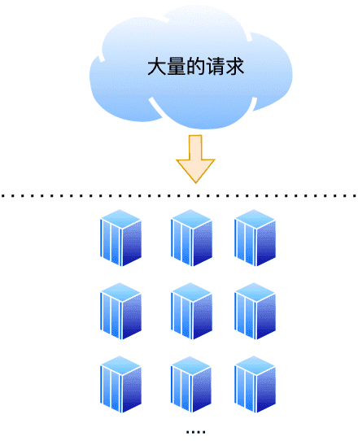
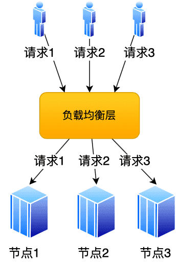
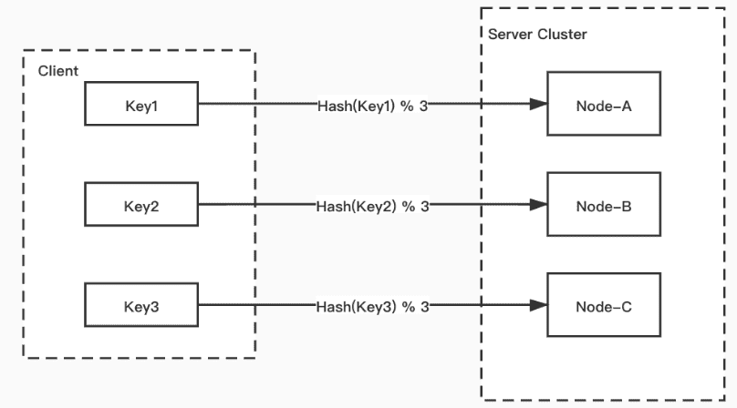
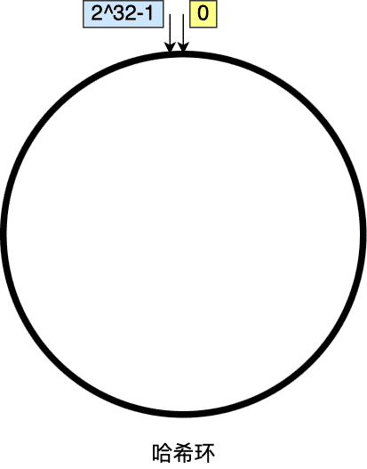
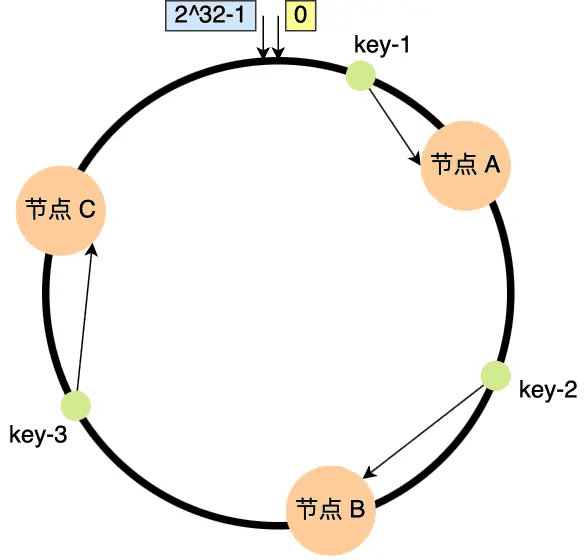
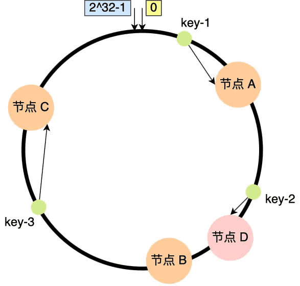
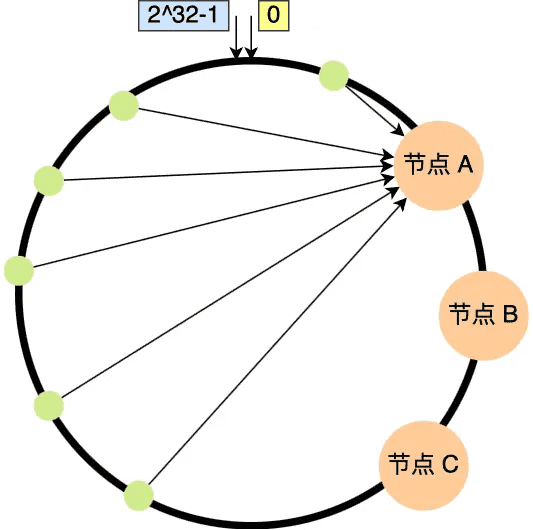
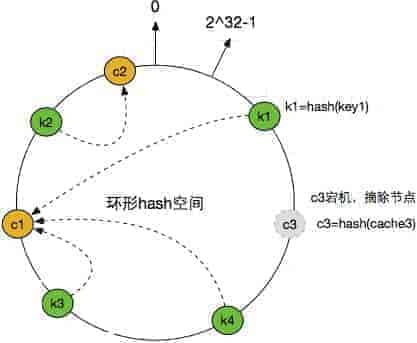
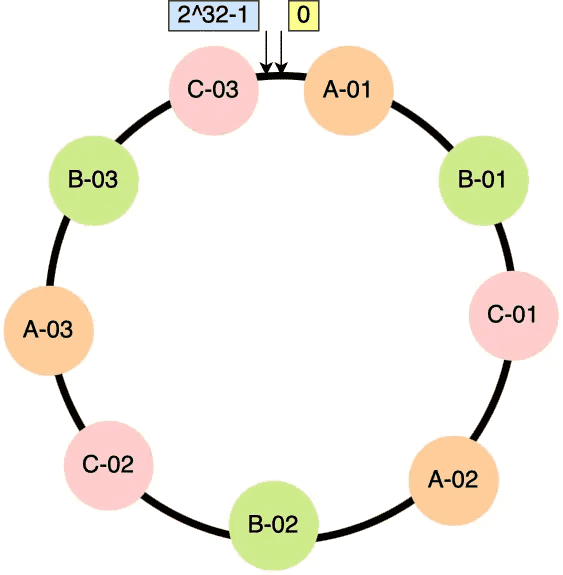

# 一致性Hash算法

如何实现分布式系统中的高效数据分片？

## 如何分配请求？

大多数网站背后肯定不是只有一台服务器提供服务，因为单机的并发量和数据量都是有限的，所以都会用多台服务器构成集群来对外提供服务。

但是问题来了，现在有那么多个节点，要如何分配客户端的请求呢？

其实这个问题就是「负载均衡问题」。解决负载均衡问题的算法很多，不同的负载均衡算法，对应的就是不同的分配策略，适应的业务场景也不同。

最简单的方式，引入一个中间的负载均衡层，让它将外界的请求「轮流」的转发给内部的集群。比如集群有 3 个节点，外界请求有 3 个，那么每个节点都会处理 1 个请求，达到了分配请求的目的。

考虑到每个节点的硬件配置有所区别，我们可以引入权重值，将硬件配置更好的节点的权重值设高，然后根据各个节点的权重值，按照一定比重分配在不同的节点上，让硬件配置更好的节点承担更多的请求，这种算法叫做加权轮询。

加权轮询算法使用场景是建立在每个节点存储的数据都是相同的前提。所以，每次读数据的请求，访问任意一个节点都能得到结果。

但是，加权轮询算法是无法应对「分布式系统」的，因为分布式系统中，每个节点存储的数据是不同的。

当我们想提高系统的容量，就会将数据水平切分到不同的节点来存储，也就是将数据分布到了不同的节点。比如**一个分布式 KV（key-value）缓存系统，某个 key 应该到哪个或者哪些节点上获得，应该是确定的**，不是说任意访问一个节点都可以得到缓存结果的。

因此，我们要想一个能应对分布式系统的负载均衡算法。

## 传统hash存在的问题

hash算法最简单的做法就是进行取模运算，比如分布式系统中有 3 个节点，就可以基于 hash(key) % 3 公式对数据进行映射。

>   hash算法可以用来解决分布式存储的问题，但如果节点数量发生变化，也将会发生大量的数据迁移。

如果节点数量发生了变化（比如当前节点不能满足要求了，需要新增一个节点增加容量），也就是在对系统做扩容或者缩容时，必须迁移改变了映射关系的数据，否则会出现查询不到数据的问题。

显然，要解决这个问题，就需要进行**数据迁移**，比如节点的数量从 3 变化为 4 时，需要基于新的计算公式 hash(key) % 4，重新对数据和节点做映射。

假设总数据条数为 M，哈希算法在面对节点数量变化时，最坏情况下所有数据都需要迁移，所以它的数据迁移规模是 O(M)，这样数据的迁移成本太高了。

而一致性 hash 算法则是将这种因节点数量变化所需要花费的调整成本，降至最低

## 一致性hash

而一致性 hash 是传统 hash 算法的增强版。

>   一致性哈希算法在1997年由麻省理工学院提出的一种分布式哈希(DHT)实现算法，设计目标是为了解决因特网中的热点(Hot spot)问题，初衷和CARP十分类似。一致性哈希修正了CARP使用的简单哈希算法带来的问题，使得分布式哈希(DHT)可以在P2P环境中真正得到应用。

一致性hash算法提出了在动态变化的Cache环境中，判定哈希算法好坏的四个定义：

-   `平衡性(Balance)`：平衡性是指哈希的结果能够尽可能分布到所有的缓冲中去，这样可以使得所有的缓冲空间都得到利用。很多哈希算法都能够满足这一条件。
-   `单调性(Monotonicity)`：单调性是指如果已经有一些内容通过哈希分派到了相应的缓冲中，又有新的缓冲加入到系统中。哈希的结果应能够保证原有已分配的内容可以被映射到原有的或者新的缓冲中去，而不会被映射到旧的缓冲集合中的其他缓冲区。
-   `分散性(Spread)`：在分布式环境中，终端有可能看不到所有的缓冲，而是只能看到其中的一部分。当终端希望通过哈希过程将内容映射到缓冲上时，由于不同终端所见的缓冲范围有可能不同，从而导致哈希的结果不一致，最终的结果是相同的内容被不同的终端映射到不同的缓冲区中。这种情况显然是应该避免的，因为它导致相同内容被存储到不同缓冲中去，降低了系统存储的效率。分散性的定义就是上述情况发生的严重程度。好的哈希算法应能够尽量避免不一致的情况发生，也就是尽量降低分散性。
-   `负载(Load)`：负载问题实际上是从另一个角度看待分散性问题。既然不同的终端可能将相同的内容映射到不同的缓冲区中，那么对于一个特定的缓冲区而言，也可能被不同的用户映射为不同的内容。与分散性一样，这种情况也是应当避免的，因此好的哈希算法应能够尽量降低缓冲的负荷。

一致性哈希算法就很好地解决了分布式系统在扩容或者缩容时，发生过多的数据迁移的问题。

一致哈希算法也用了取模运算，但与哈希算法不同的是，哈希算法是对节点的数量进行取模运算，而一致哈希算法是**对$2^{32}$进行取模运算**，是一个固定的值。

我们可以把一致哈希算法是对 $2^{32}$ 进行取模运算的结果值组织成一个圆环，就像钟表一样，钟表的圆可以理解成由 60 个点组成的圆，而此处我们把这个圆想象成由 $2^{32}$ 个点组成的圆，这个圆环被称为**哈希环**，如下图：

一致性 hash 引入了哈希环的概念，核心思路：

- 规定了一个哈希环，环的元素由 [0, $2^{32} -1$] 范围的整数组成
- 将 key，服务节点通过计算映射到哈希环上
- 顺时针方向为 key 寻找相邻的**第一台**服务节点，完成 key -> node 的关系映射

一致性hash算法就是通过一个首尾相连的hash环解决传统hash算法中大量的数据迁移的问题的，如果增加或者移除一个节点，仅影响该节点在哈希环上顺时针相邻的后继节点，其它数据也不会受到影响。

比如，下图中的 key-1 映射的位置，往顺时针的方向找到第一个节点就是节点 A。

另外两个节点对应关系为：

- Key2 -> Node-B
- Key3 -> Node-C

假设当前新增一个节点，比如节点数量从3增加到了4，新的节点 D 经过哈希计算后映射到了下图中的位置：

也就是说，key-1、key-3 都不受影响，只有 key-2的数据需要被迁移节点 D。

因此，在一致哈希算法中，如果增加或者移除一个节点，仅影响该节点在哈希环上顺时针相邻的后继节点，其它数据也不会受到影响。这就可以解决传统hash算法中大量数据迁移的问题。

### 数据倾斜问题

但是一致性哈希算法并**不保证节点能够在哈希环上分布均匀**，这样就会带来一个问题，会有大量的请求集中在一个节点上。

这样所有的数据都会请求到节点A上，这就没有了负载均衡。并且假设节点A故障被移除了，那么所有的数据也都需要迁移到节点B上。

因此，一致性 hash 确实能够降低节点数量变化对集群整体造成的影响，但存在**数据倾斜**问题。

### 不平衡的问题

一个节点宕机之后，数据需要落到距离他最近的节点上，会导致下个节点的压力突然增大，可能导致雪崩，整个服务挂掉。

如下图所示：

当节点C3摘除之后，之前再C3上的k1就要迁移到C1上，这时候带来了两部分的压力：

-   之前请求到C3上的流量转嫁到了C1上，会导致C1的流量增加，如果之前C3上存在热点数据，则可能导致C1扛不住压力挂掉。
-   之前存储到C3上的key值转义到了C1，会导致C1的内容占用量增加，可能存在瓶颈。

当上面两个压力发生的时候，可能导致C1节点也宕机了。那么压力便会传递到C2上，又出现了类似滚雪球的情况，服务压力出现了雪崩，导致整个服务不可用。这一点违背了最开始提到的四个原则中的**平衡性**，节点宕机之后，流量及内存的分配方式打破了原有的平衡。

### 引入虚拟节点

但是一致性哈希算法并**不保证节点能够在哈希环上分布均匀**，存在**数据倾斜**问题。

要想解决节点能在哈希环上分配不均匀的问题，就是要有大量的节点，节点数越多，哈希环上的节点分布的就越均匀。

但问题是，实际中我们没有那么多节点。所以这个时候我们就加入**虚拟节点**，也就是对一个真实节点做多个副本。

具体做法是，不再**将真实节点映射到哈希环上**，而是**将虚拟节点映射到哈希环上**，并**将虚拟节点映射到实际节点**，所以这里有「两层」映射关系。

>   引入虚拟节点：将一个真实节点映射为多个虚拟节点。不再将真实节点映射到哈希环上，而是将虚拟节点映射到哈希环上，从而提高节点的负载均衡度，和系统的稳定性。

虚拟节点的核心：

- 将一个物理节点分化成多个虚拟节点
- 将虚拟节点映射到哈希环上
- 当 key 命中虚拟节点后，通过虚拟节点找到其所属的物理节点

也就是说，不再将真实节点映射到哈希环上，而是将虚拟节点映射到哈希环上，并将虚拟节点映射到实际节点，所以这里有**两层**的映射关系。

比如对每个节点分别设置 3 个虚拟节点：

- 对节点 A 加上编号来作为虚拟节点：A-01、A-02、A-03
- 对节点 B 加上编号来作为虚拟节点：B-01、B-02、B-03
- 对节点 C 加上编号来作为虚拟节点：C-01、C-02、C-03

引入虚拟节点后，原本哈希环上只有 3 个节点的情况，就会变成有 9 个虚拟节点映射到哈希环上，哈希环上的节点数量多了 3 倍。

可以看到这样使得数据分布更加平衡。这时候，如果有访问请求寻址到「A-01」这个虚拟节点，接着再通过「A-01」虚拟节点找到真实节点 A，这样请求就能访问到真实节点 A 了。另外如果移除了一个节点C，也不会发生大量的数据迁移情况，并且能有不同的节点共同分担系统的变化，因此稳定性更高：

比如，当某个节点被移除时，对应该节点的多个虚拟节点均会移除，而这些虚拟节点按顺时针方向的下一个虚拟节点，可能会对应不同的真实节点，即这些不同的真实节点共同分担了节点变化导致的压力。

上图是为了方便理解，每个真实节点仅包含 3 个虚拟节点，这样能起到的均衡效果其实很有限。而在实际的工程中，虚拟节点的数量会大很多，比如 Nginx 的一致性哈希算法，每个权重为 1 的真实节点就含有160 个虚拟节点。

另外，虚拟节点除了会提高节点的均衡度，还会提高系统的稳定性。**当节点变化时，会有不同的节点共同分担系统的变化，因此稳定性更高**。

比如，当某个节点被移除时，对应该节点的多个虚拟节点均会移除，而这些虚拟节点按顺时针方向的下一个虚拟节点，可能会对应不同的真实节点，即这些不同的真实节点共同分担了节点变化导致的压力。

而且，有了虚拟节点后，还可以为硬件配置更好的节点增加权重，比如对权重更高的节点增加更多的虚拟机节点即可。

因此，**带虚拟节点的一致性哈希方法不仅适合硬件配置不同的节点的场景，而且适合节点规模会发生变化的场景**。

## 总结

不同的负载均衡算法适用的业务场景也不同的。

轮询这类的策略只能适用与每个节点的数据都是相同的场景，访问任意节点都能请求到数据。但是不适用分布式系统，因为分布式系统意味着数据水平切分到了不同的节点上，访问数据的时候，一定要寻址存储该数据的节点。

哈希算法虽然能建立数据和节点的映射关系，但是每次在节点数量发生变化的时候，最坏情况下所有数据都需要迁移，这样太麻烦了，所以不适用节点数量变化的场景。

为了减少迁移的数据量，就出现了一致性哈希算法。

一致性哈希是指将「存储节点」和「数据」都映射到一个首尾相连的哈希环上，如果增加或者移除一个节点，仅影响该节点在哈希环上顺时针相邻的后继节点，其它数据也不会受到影响。

但是一致性哈希算法不能够均匀的分布节点，会出现大量请求都集中在一个节点的情况，在这种情况下进行容灾与扩容时，容易出现雪崩的连锁反应。

为了解决一致性哈希算法不能够均匀的分布节点的问题，就需要引入虚拟节点，对一个真实节点做多个副本。不再将真实节点映射到哈希环上，而是将虚拟节点映射到哈希环上，并将虚拟节点映射到实际节点，所以这里有「两层」映射关系。

引入虚拟节点后，会提高节点的均衡度，还会提高系统的稳定性。所以，带虚拟节点的一致性哈希方法不仅适合硬件配置不同的节点的场景，而且适合节点规模会发生变化的场景。
