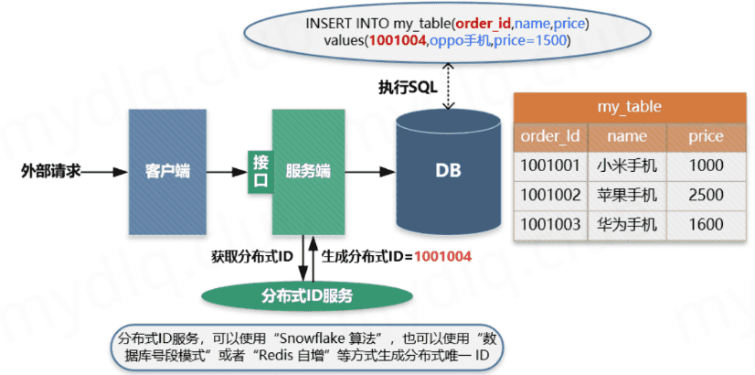
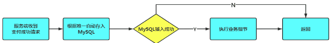
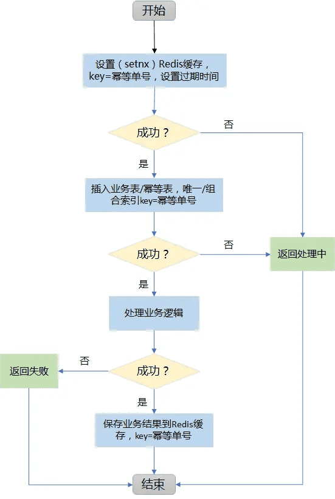
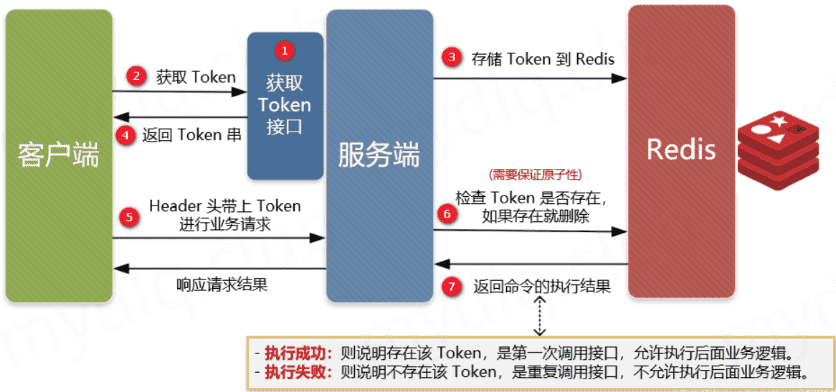

# 幂等性：如何避免重复操作的影响？

## 什么是幂等

### 百度百科

在编程中一个幂等操作的特点是其任意多次执行所产生的影响均与一次执行的影响相同。幂等函数，或幂等方法，是指可以使用相同参数重复执行，并能获得相同结果的函数。

这些函数不会影响系统状态，也不用担心重复执行会对系统造成改变。例如，`abs`函数就是一个幂等函数，无论多次执行，其结果都是一样的。更复杂的操作幂等保证是利用唯一交易号（流水号）实现。

### 幂等的业务概念

幂等性不仅仅只是一次或多次操作对资源没有产生影响，还包括第一次操作产生影响后，以后多次操作不会再产生影响。并且幂等关注的是是否对资源产生影响，而不关注结果。

举例：服务端会进行重试等操作或客户端有可能会进行多次点击提交。如果这样请求多次的话，那最终处理的数据结果就一定要保证统一，如支付场景。此时就需要通过保证业务幂等性方案来完成。

在计算机中编程中，一个幂等操作的特点是其任意多次执行所产生的影响均与一次执行的影响相同。幂等函数或幂等方法是指可以使用相同参数重复执行，并能获得相同结果的函数。这些函数不会影响系统状态，也不用担心重复执行会对系统造成改变。简单理解就是，一个逻辑即使被重复执行多次，也不影响最终结果的一致性，这叫幂等。

1. 幂等包括第一次请求的时候对资源产生了副作用，但是以后的多次请求都不会再对资源产生副作用。幂等关注的是以后的多次请求是否对资源产生了副作用，而不关注结果。
2. 网络超时等问题，不是幂等的讨论范围。
3. 幂等性是系统服务对外一种承诺，而不是实现，承诺只要调用接口成功，外部多次调用对系统的影响是一致的。声明为幂等的服务会认为外部调用失败是常态，并且失败之后必然会有重试。

### 为什么要实现幂等

业务上

-   当用户购物进行下单操作，用户操作多次，但订单系统对于本次操作只能产生一个订单（不控制会导致恶意刷单）。
-   当用户对订单进行付款，支付系统不管出现什么问题，应该只对用户扣一次款。
-   当支付成功对库存扣减时，库存系统对订单中商品的库存数量也只能扣减一次。
-   当对商品进行发货时，也需保证物流系统有且只能发一次货。

技术上

- 前端重复提交表单：在填写表单时候，用户填写完成提交，很多时候会因网络波动没有及时对用户做出提交成功响应，致使用户认为没有成功提交，然后一直点提交按钮，这时就会发生重复提交表单请求。
- 用户恶意进行刷单：例如在实现用户投票这种功能时，如果用户针对一个项目进行重复提交投票，这样会导致接口接收到用户重复提交的投票信息，这样会使投票结果与事实严重不符。
- 接口超时重复提交：很多时候 HTTP 客户端工具都默认开启超时重试的机制，尤其是第三方调用接口时候，为了防止网络波动超时等造成的请求失败，都会添加重试机制，导致一个请求提交多次。
- 消息进行重复消费：当使用 MQ 消息中间件时候，如果发生消息中间件出现错误未及时提交消费信息，导致发生重复消费。

### 幂等的维度

-   时间（时域唯一性）：定义幂等的有效期。有些业务需要永久性保证幂等，如下单、支付等。而部分业务只要保证一段时间幂等即可。你希望在多长时间内保证某次操作的幂等？
-   空间（空域唯一性）：定义了幂等的范围，如生成订单的话，不允许出现重复下单。一次操作=服务方法+传入的业务数据

同时对于幂等的使用一般都会伴随着出现锁的概念，用于解决并发安全问题。

### 接口幂等性

在HTTP/1.1中，对幂等性进行了定义。它描述了一次和多次请求某一个资源对于资源本身应该具有同样的结果（网络超时等问题除外），即第一次请求的时候对资源产生了副作用，但是以后的多次请求都不会再对资源产生副作用。这里的副作用是不会对结果产生破坏或者产生不可预料的结果。也就是说，其任意多次执行对资源本身所产生的影响均与一次执行的影响相同。

### 引入幂等的影响

幂等性是为了简化客户端逻辑处理，能放置重复提交等操作，但却增加了服务端的逻辑复杂性和成本，其主要是：

- 把并行执行的功能改为串行执行，降低了执行效率。
- 增加了额外控制幂等的业务逻辑，复杂化了业务功能；

所以在使用时候需要考虑是否引入幂等性的必要性，根据实际业务场景具体分析，除了业务上的特殊要求外，一般情况下不需要引入的接口幂等性。

## 如何保证幂等性

### 前端保证

在用户点击完提交按钮后，可以把按钮设置为不可用或者隐藏状态。

前端限制比较简单，但有个问题，前端的这种限制很容易绕过，比如通过模拟网页请求来重复提交请求

### 数据库唯一主键

数据库唯一主键的实现主要是利用数据库中主键唯一约束的特性，一般来说唯一主键比较适用于“插入”时的幂等性，其目的就是**保证一张表中只能存在一条带该唯一主键的记录**。

使用数据库唯一主键完成幂等性时需要注意的是，该主键一般来说并不是使用数据库中自增主键，而是使用分布式 ID 充当主键，这样才能能保证在分布式环境下 ID 的全局唯一性。

使用限制：需要生成全局唯一主键 ID；且只能用于插入操作

主要流程：

1. 客户端执行创建请求，调用服务端接口。
2. 服务端执行业务逻辑，生成一个分布式 ID，将该 ID 充当待插入数据的主键，然后执数据插入操作，运行对应的 SQL 语句。
3. 服务端将该条数据插入数据库中，如果插入成功则表示没有重复调用接口。如果抛出主键重复异常，则表示数据库中已经存在该条记录，返回错误信息到客户端。

### 去重表

去重表的机制是根据mysql唯一索引的特性来的，比如在支付场景中，如果一个订单只会支付一次，那么订单ID可以作为唯一标识。这时，就可以建一张数据库去重表，并且把唯一标识（订单ID）作为唯一索引，在实现时，把创建支付单据和写入去去重表，放在一个事务中，如果重复创建，数据库会抛出唯一约束异常，操作就会回滚。通过该种基于数据库层次的幂等，可以保证相同订单ID的请求只会被处理一次。并且幂等控制数据不会丢失。

### Redis分布式锁

可以基于redis的setnx操作，并设置过期时间，表示在一定时间内只被系统进行一次处理，防止系统并发处理相同请求。如果setnx成功了说明这是第一次进行数据插入，继续执行SQL语句即可。如果setnx失败了，那说明已经执行过了。

redis分布式锁与去重表机制，其处理流程如下：

### token方案

调用方在调用接口的时候先向后端请求一个全局 ID（Token），请求的时候携带这个全局 ID 一起请求（Token 最好将其放到 Headers 中），后端需要对这个 Token 作为 Key，用户信息作为 Value 到 Redis 中进行键值内容校验，如果 Key 存在且 Value 匹配就执行删除命令，然后正常执行后面的业务逻辑。如果不存在对应的 Key 或 Value 不匹配就返回重复执行的错误信息，这样来保证幂等操作。

要求：

- 需要生成全局唯一 Token 串；
- 需要使用第三方组件 Redis 进行数据效验；

在并发情况下，执行 Redis 查找数据与删除需要保证原子性，否则很可能在并发下无法保证幂等性。其实现方法可以使用分布式锁或者使用 Lua 表达式来注销查询与删除操作。

## 总结

幂等性是开发当中很常见也很重要的一个需求，尤其是支付、订单等与金钱挂钩的服务，保证接口幂等性尤其重要

- 对于下单等存在唯一主键的，可以使用“唯一主键方案”的方式实现。
- 类似于前端重复提交、重复下单、没有唯一ID号的场景，可以通过 Token 与 Redis 配合的“防重 Token 方案”实现更为快捷。

