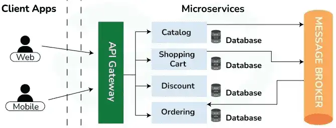
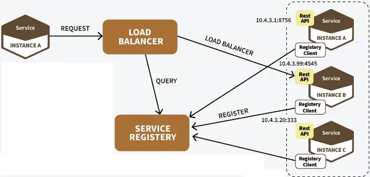
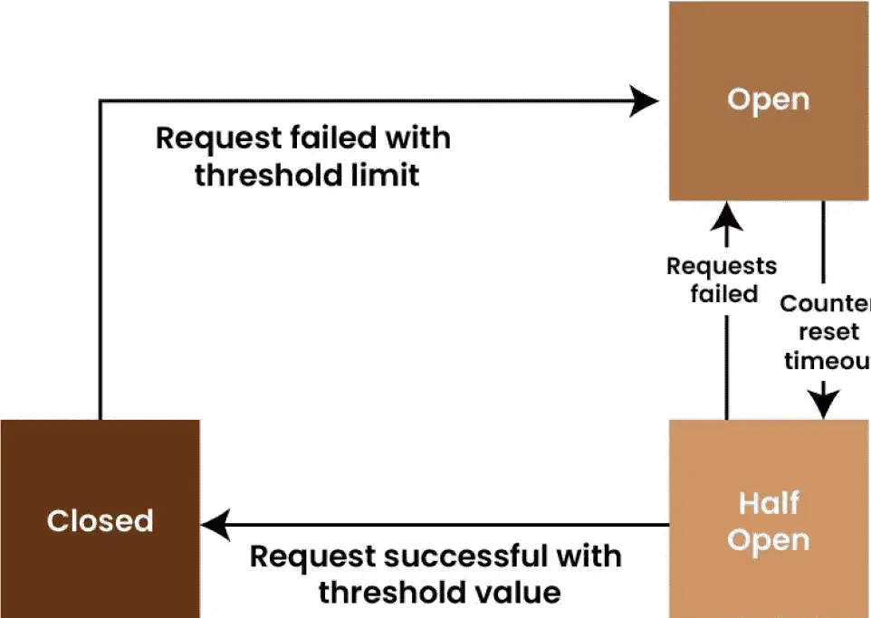
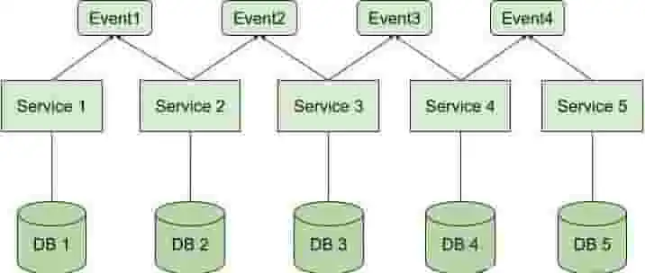
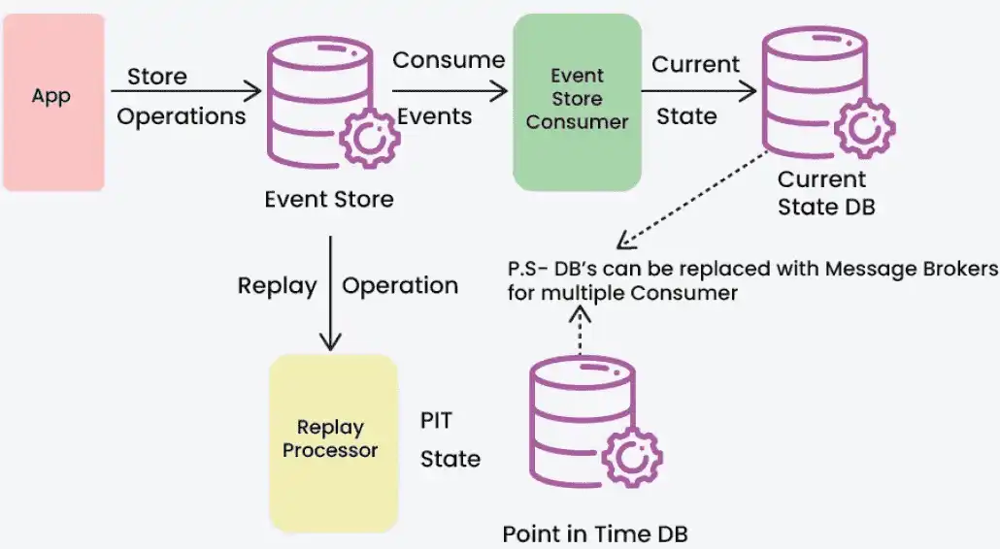
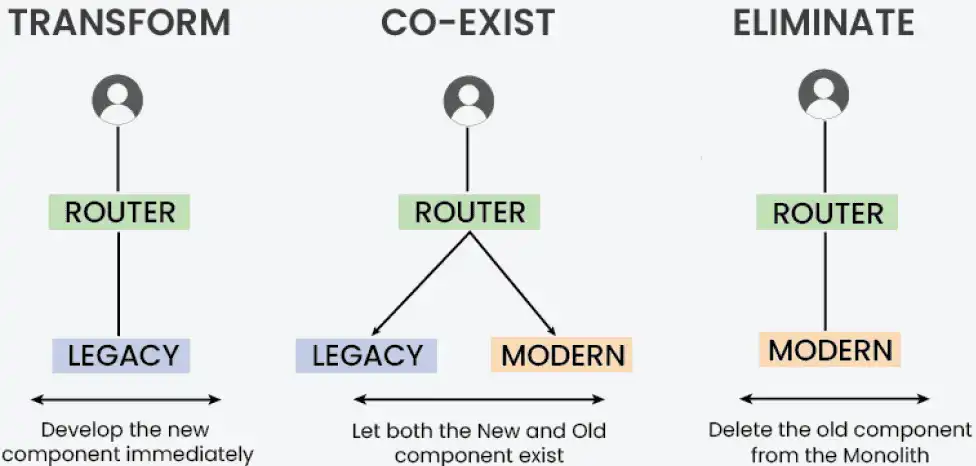
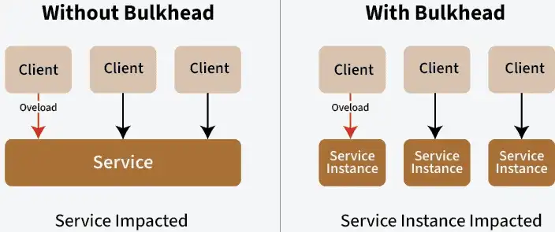
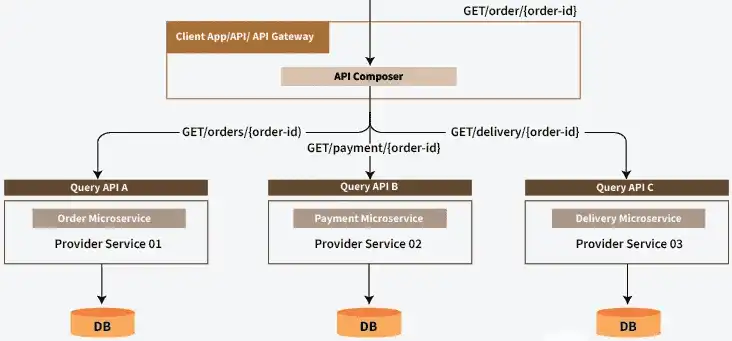
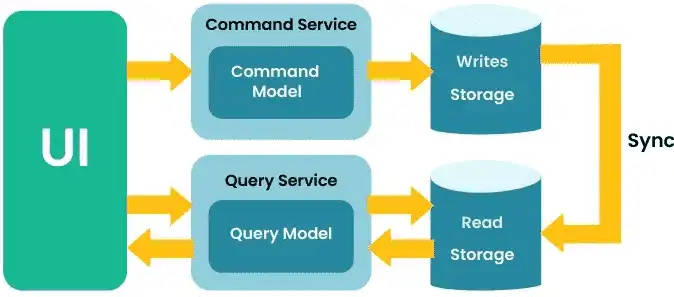

# 微服务中常见的9种设计模式

## API Gateway Pattern(网关模式)

API Gateway模式是一种设计模式，用于管理客户端与后端服务之间的请求，它充当客户端和服务之间的中介层，提供一个统一的接口来处理所有的API请求。

这种模式通过将多个服务的复杂性隐藏在一个接口后面来简化客户端的体验，它还可以处理身份验证、日志记录和速率限制等任务，使其成为微服务架构的关键部分。

API Gateway模式可以抽象如下图：

优点：

-   简化客户端开发：客户端只需与API网关交互，而不必直接与多个后端服务进行通信。
-   安全性：可以在网关层实现身份验证和授权策略。
-   负载均衡和缓存：可以在API网关中实现，以提高性能。
-   协议转换：支持不同协议（如HTTP到gRPC）的转换。

缺点：

-   单点故障：API网关可能成为系统的单点故障。
-   复杂性：需要额外的开发和维护工作来管理网关。

适用场景：

-   微服务架构：在微服务架构中，API网关可以作为一个集中入口，简化客户端与多个后端服务的交互。
-   安全需求：需要在一个集中点管理身份验证、授权和流量控制。
-   跨域请求和协议转换：需要支持不同客户端协议（如HTTP、WebSocket）的请求，或需要执行协议转换。
-   负载均衡和缓存：需要在网关层实现负载均衡和缓存以提高性能。

## Service Registry Pattern(服务注册表模式)

服务注册表模式用于在微服务架构中跟踪微服务实例的位置和状态，服务提供者在启动时将其地址注册到服务注册表中，然后，其他服务可以查找注册表以查找它并与之通信。这种动态发现实现了灵活性，并帮助服务在不对其位置进行硬编码的情况下进行交互。

Service Registry模式可以抽象如下图：

优点：

-   动态发现：服务消费者可以动态地发现服务提供者的位置。
-   负载均衡：帮助实现客户端负载均衡，通过选择最优的服务实例来处理请求。

缺点：

-   一致性问题：需要确保注册表中信息的一致性和及时更新。
-   复杂性增加：需要额外的组件和配置来管理服务注册。

适用场景：

-   动态服务发现：在微服务环境中，服务实例是动态的，需要一种机制来注册和发现服务。
-   自动伸缩：服务实例数量根据负载自动调整，需要动态更新服务注册信息。
-   服务的健康检查：需要定期检查服务实例的健康状态并更新注册信息。

## Circuit Breaker Pattern(断路器模式)

断路器模式用于在服务之间调用时，防止系统因服务故障而出现级联故障，它可以检测服务的失败，并在检测到故障时，短路请求以避免进一步的失败。如果服务反复失败，断路器将跳闸，从而阻止对该服务的进一步请求。超时期限后，它允许有限的请求测试服务是否重新联机，这减少了失败服务的负载并增强了系统弹性。

Circuit Breaker模式可以抽象如下图：

优点：

-   提高系统稳定性：防止因服务故障导致的系统崩溃。
-   快速失败：当检测到故障时，快速返回错误而不是等待超时。

缺点：

-   状态管理：需要管理断路器的状态（关闭、打开、半开）。
-   配置复杂性：需要调整断路器的参数以适应不同的服务。

适用场景：

-   不稳定的网络环境：经常出现网络故障或延迟，需要防止这些问题影响整个系统。
-   下游服务不可靠：某些服务可能会不时出现故障，需要隔离这些故障以保护系统的其他部分。
-   高可用性要求：需要确保系统在部分服务不可用时仍能继续运行。

## Saga Pattern(Saga模式)

Saga模式是一种分布式事务管理模式，用于管理跨多个服务的长时间运行的业务交易。Saga将事务分解为一系列的小事务，每个小事务由一个独立的服务处理。如果一个步骤失败，则会采取补偿措施来反转前面的步骤。这样，即使遇到故障，您也可以保持整个系统的数据一致性。

Saga模式可以抽象如下图：

优点：

-   去中心化：没有单一的事务管理器。
-   灵活性：支持复杂的业务流程和长时间运行的事务。

缺点：

-   复杂性：需要设计补偿逻辑来处理事务失败。
-   一致性挑战：需要确保最终一致性，而不是立即一致性。

适用场景：

-   分布式事务：需要管理跨多个服务的长时间运行的事务，确保数据最终一致性。
-   复杂业务流程：涉及多个步骤和服务的业务流程，需要灵活的事务管理。
-   需要补偿逻辑：在事务失败时，需要执行补偿操作来回滚或调整状态。

## Event Sourcing Pattern(事件溯源模式)

事件溯源模式是通过存储系统中所有状态变化的事件来记录状态的变化，应用程序的状态可以通过重放这些事件来重建。每个事件都描述了发生的更改，允许服务通过重放事件历史记录来重建当前状态，这提供了清晰的审计跟踪，并简化了出现错误时的数据恢复。

Event Sourcing模式可以抽象如下图：

优点：

-   审计和回溯：可以轻松回溯系统状态的变化。
-   重放能力：可以重放事件来恢复系统状态。

缺点：

-   存储需求：需要存储大量的事件数据。
-   复杂性：需要处理事件的版本控制和模式演进。

适用场景：

-   审计和回溯：需要详细记录系统中所有状态变化，以便进行审计和回溯。
-   复杂状态恢复：需要在系统故障后通过事件重建状态。
-   历史分析：需要分析系统历史事件以获取业务洞察。

## Strangler Fig Pattern(绞杀者模式)

绞杀者模式用于逐步替换旧系统的功能，而不需要一次性重构整个系统，新功能在新系统中实现，随着时间的推移，随着更多功能转移到微服务，旧系统会逐渐被 “扼杀”，直到它可以完全停用，这种方法将风险降至最低，并允许更顺利的迁移。

Strangler Fig模式可以抽象如下图：

优点：

-   风险降低：逐步迁移减少了系统中断的风险。
-   灵活性：允许同时运行旧系统和新系统。

缺点：

-   复杂性：需要管理两个系统的并行运行。
-   整合挑战：需要处理新旧系统之间的数据和功能集成。

适用场景：

-   遗留系统替换：需要逐步替换旧系统的功能，而不是一次性重构，比如：单体服务迁移成微服务。
-   风险管理：在迁移过程中需要降低系统中断的风险。
-   持续交付：需要在不断交付新功能的同时，逐步淘汰旧系统。

## Bulkhead Pattern(舱壁模式)

舱壁模式通过将系统分成独立的隔离部分，如果一个服务遇到问题，它不会损害其他服务，通过创建边界，此模式增强了系统的弹性，确保一个领域的故障不会导致整个系统故障。

Bulkhead 模式可以抽象如下图：

优点：

-   增强稳定性：隔离故障，防止其影响其他部分。
-   资源隔离：可以为不同的服务或组件分配不同的资源池。

缺点：

-   资源利用率：可能导致资源的低效利用。
-   复杂性：需要设计和管理多个隔离区域。

适用场景：

-   隔离故障：需要防止一个组件的故障影响整个系统。
-   资源管理：需要为不同的服务或组件分配独立的资源池，以优化资源利用。
-   高可靠性需求：需要确保系统某些部分在其他部分出现故障时仍能正常工作。

## API Composition Pattern(API组合模式)

API组合模式用于在微服务架构中聚合来自多个服务的数据，以提供客户端需要的完整响应，通常用于替代复杂的查询。单独的服务 （组合服务） 从各种服务收集响应，并将它们组合成一个 Client 端的响应，这减少了 Client 端发出多个请求的需要，并简化了它们与系统的交互。

API Composition模式可以抽象如下图：

优点：

-   简化客户端：客户端可以通过一个API请求获取完整的数据。
-   减少请求数量：通过组合API减少客户端的请求次数。

缺点：

-   性能问题：组合多个服务的响应可能导致延迟。
-   复杂性：需要处理不同服务响应的合并和格式化。

适用场景：

-   数据聚合：需要从多个服务中聚合数据以提供完整的响应。
-   复杂查询替代：无法或不希望在单个服务中执行复杂查询时，需要在API层进行数据组合。
-   减少客户端请求：通过组合API减少客户端的请求次数和复杂性。

## CQRS Design Pattern(CQRS模式)

CQRS（Command Query Responsibility Segregation）模式将命令（写操作）和查询（读操作）分开，以优化性能和可扩展性。例如，命令端可以专注于执行业务规则，而查询端可以优化以实现快速数据检索，这种模式在具有大量读写操作的应用程序中特别有用，因为它通过允许对每一端进行不同的优化来增强性能和可扩展性。

CQRS模式可以抽象如下图：

优点：

-   优化性能：读写分离可以针对不同的操作进行优化。
-   灵活性：支持不同的数据存储策略。

缺点：

-   复杂性：需要维护两个独立的数据模型。
-   一致性挑战：需要确保读写模型之间的一致性。

适用场景：

-   高并发和性能优化：需要同时支持大量的读取和写入操作，并且需要分别优化读取和写入路径。
-   复杂业务逻辑：写操作需要执行复杂的业务规则，而读取操作需要快速响应。
-   大规模系统：需要灵活扩展和优化系统的不同部分以满足不同的负载需求。
