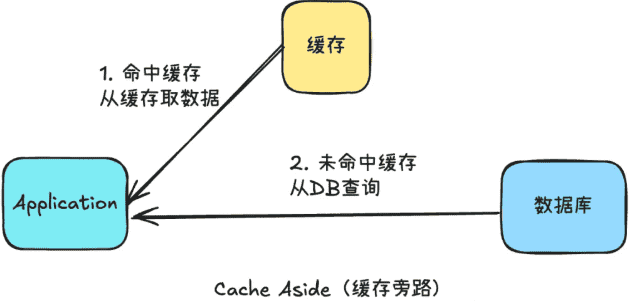
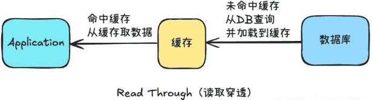
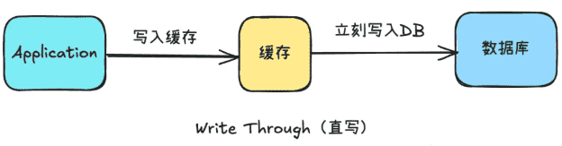
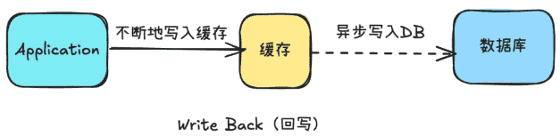

# 4种缓存模式及其实现

随着应用程序的复杂性日益增加，缓存管理变得至关重要。缓存不仅能有效减轻数据库负载，还能显著提升数据访问速度。选择合适的缓存模式能够在不同的业务场景下发挥出最佳效果。

本文将详细介绍四种常见的缓存模式：Cache-Aside (旁路缓存)、Read-Through (透读缓存)、Write-Through (透写缓存) 和 Write-Back / Write-Behind (写后缓存)，并通过代码示例深入剖析它们的实现。

## Cache-Aside (旁路缓存)

Cache-Aside（旁路缓存）模式，又叫 Lazy-Loading（懒加载）模式，在这种模式下，缓存的读取和写入由应用程序直接管理。应用程序首先尝试从缓存中读取数据，若缓存未命中，则从数据库中加载数据并将其存储在缓存中；对于更新操作，应用程序直接更新数据库，并更新或删除缓存中的相关数据。



工作流程：

1.  读取数据：
    1.  应用程序查询缓存。
    2.  如果缓存命中，返回缓存数据。
    3.  如果缓存未命中，应用程序从数据库加载数据，并将其存入缓存。
2.  更新数据：
    1.  应用程序直接更新数据库。
    2.  然后，应用程序更新或删除缓存中的数据。

优缺点：

1.  优点：
    -   灵活：开发者可以根据需求选择从缓存或数据库读取数据。
    -   减少数据库负载，提高访问速度。
    -   简单易于实现，开发者可以完全控制缓存管理。
2.  缺点：
    -   需要手动管理缓存，增加了开发和维护的复杂度。
    -   存在缓存一致性问题，需要小心处理缓存的清除和更新。

适用场景：适用于读取频繁但更新较少的数据。例如，用户信息、商品详情、广告推荐等。

代码示例：

```java
import java.util.HashMap;
import java.util.Map;

public class CacheAside {
    private Map<String, String> cache = new HashMap<>();
    private Map<String, String> database = new HashMap<>();

    public String getFromCacheOrDatabase(String key) {
        String data = cache.get(key);
        if (data == null) {
            data = database.get(key);
            cache.put(key, data);
        }
        return data;
    }
}
```

## Read-Through (透读缓存)

`Read-Through` 模式下，缓存层自动管理数据的读取。当应用程序请求数据时，缓存层会先检查缓存，如果缓存命中则直接返回数据；如果缓存未命中，则缓存层自动从数据库加载数据，并将数据存入缓存。



工作流程：

1.  应用程序请求数据。
2.  如果缓存中存在数据，直接返回数据。
3.  如果缓存中没有数据，缓存系统会从数据库加载数据，并将数据存入缓存。

独立设计缓存层

-   缓存层实现：需要一个独立的缓存系统（如 Redis、Memcached）。缓存系统需要能够在数据未命中时，自动从数据库加载数据，并缓存这些数据。
-   缓存一致性：通常需要通过缓存管理器来控制数据过期、更新和一致性。

优缺点：

优点：

-   简化了应用程序的逻辑，应用程序无需关心数据是从缓存还是数据库加载。
-   减少了数据库的负担，提升了系统性能。

缺点：

-   增加了对缓存层的依赖，缓存层需要具备高可用性和强大的扩展性。
-   当缓存未命中时，可能会造成缓存层和数据库的负载增加。

适用场景：适用于需要快速访问并且能够容忍一定程度缓存一致性问题的应用场景，比如商品数据、用户会话等。

代码示例：

```java
import java.util.HashMap;
import java.util.Map;

public class ReadThrough {
    private Map<String, String> cache = new HashMap<>();
    private Map<String, String> database = new HashMap<>();

    public String getFromCacheOrReadThroughDatabase(String key) {
        String data = cache.get(key);
        if (data == null) {
            data = database.get(key);
            cache.put(key, data);
        }
        return data;
    }
}
```

### Cache-Aside（旁路缓存）和Read-Through（透读缓存）的区别

Cache-Aside (旁路缓存)

数据访问方式：

-   在Cache-Aside模式中，应用程序首先查询缓存，如果缓存中不存在所需数据，则从数据库中获取数据，并将数据存储到缓存中。应用程序负责直接操作缓存。
-   缓存更新策略：
-   数据更新时，应用程序负责更新缓存。这意味着数据的写入和更新操作会首先更新数据库，然后再更新缓存。缓存中的数据通常在需要时才会被更新。

Read-Through (透读缓存)数据访问方式：

-   在Read-Through模式中，应用程序直接查询缓存，如果缓存中不存在所需数据，则缓存系统会负责从数据库中获取数据，并将数据存储到缓存中。应用程序并不直接操作缓存。
-   缓存更新策略：
-   数据更新时，缓存系统会负责更新缓存。当数据发生变化时，缓存系统会自动更新缓存，确保缓存中的数据与数据库中的数据保持一致。

区别总结

-   Cache-Aside模式中，应用程序负责读取和写入缓存，而Read-Through模式中，缓存系统负责从数据库中读取数据并更新缓存。
-   在Cache-Aside中，数据更新时需要应用程序负责更新缓存，而在Read-Through中，缓存系统会自动更新缓存以保持数据一致性。
-   Cache-Aside适用于读取频率高、写入频率低的场景，而Read-Through适用于需要保证数据一致性的场景。

## Write-Through (透写缓存)

Write-Through 模式要求数据在写入时同时更新缓存和数据库。当应用程序写入数据时，数据首先写入缓存，然后立即写入数据库。这种模式**保证了缓存中的数据始终与数据库中的数据一致**。



工作流程：

1.  应用程序写入数据。
2.  数据首先写入缓存。
3.  然后，数据被同步写入数据库。

独立设计缓存层：

-   缓存层实现：需要一个缓存层，在写数据时同步更新缓存和数据库。这样可以确保缓存中的数据与数据库中的数据保持一致。

优缺点：

优点：

-   保证了缓存和数据库中的数据一致性。
-   每次数据更新时，都会更新缓存，避免了缓存过期问题。

缺点：

-   写操作会增加缓存层和数据库的负担，可能影响性能。
-   相对于其他模式，写入操作的延迟较高。

适用场景：适用于数据一致性要求较高的场景，如库存管理、金融交易等。

代码示例：

```java
import java.util.HashMap;
import java.util.Map;

public class WriteThrough {
    private Map<String, String> cache = new HashMap<>();
    private Map<String, String> database = new HashMap<>();

    public void writeToCacheAndDatabase(String key, String value) {
        cache.put(key, value);
        database.put(key, value);
    }
}
```

## Write-Back / Write-Behind (写后缓存)

`Write-Back（写后缓存`）模式下，应用程序先将数据写入缓存，而不立即写入数据库。

**数据在缓存中更新后，定期或按需将更新后的数据异步写入数据库**。这种模式的好处是减少了写操作的延迟，提高了性能，但需要处理数据同步的问题。



工作流程：

1.  应用程序将数据写入缓存。
2.  数据更新首先写入缓存，而不直接写入数据库。
3.  缓存会定期或异步地将数据写入数据库。

独立设计缓存层：

-   缓存层实现：需要一个独立的缓存层，该层不仅处理数据读取，还负责缓存数据的写入。为了确保数据最终一致性，通常会使用异步操作将缓存中的数据写回数据库。

优缺点：

优点：

-   提高了写操作的性能，减少了对数据库的写入压力。
-   写操作的延迟较低，因为数据只写入缓存。

缺点：

-   需要处理缓存与数据库的数据同步问题，确保最终一致性。
-   如果缓存数据未及时写入数据库，可能导致数据丢失。

适用场景：适用于不需要即时写入数据库的场景，例如日志收集、批量数据更新等。

代码示例：

```java
import java.util.HashMap;
import java.util.Map;

public class WriteBack {
    private Map<String, String> cache = new HashMap<>();
    private Map<String, String> database = new HashMap<>();
    private Map<String, Boolean> dirtyMap = new HashMap<>();

    public void writeToCache(String key, String value) {
        cache.put(key, value);
        dirtyMap.put(key, true);
    }

    public void writeToDatabase(String key) {
        if (dirtyMap.getOrDefault(key, false)) {
            String data = cache.get(key);
            database.put(key, data);
            dirtyMap.put(key, false);
        }
    }
}
```

### Read-Through（透读缓存）与 Write-Through（透写缓存）和 Write-Back（写后缓存）相比的优势和劣势

Read-Through（透读缓存）的优势：

-   数据一致性：Read-Through模式可以确保缓存中的数据与数据库中的数据保持一致。
-   简化应用逻辑：应用程序无需关心缓存的更新，缓存系统负责从数据库中读取数据并更新缓存，简化了应用的逻辑。
-   减少数据库负载：通过缓存数据，可以减少对数据库的频繁访问，降低数据库负载，提高系统性能。

Read-Through（透读缓存）的劣势：

-   读取延迟：如果数据不在缓存中，需要从数据库中获取数据并更新缓存，可能会增加读取数据的延迟。
-   频繁读取场景下不够高效：对于频繁读取的数据，如果每次都要从数据库中获取数据，可能会降低系统性能。
-   数据更新时的一致性延迟：数据更新后，缓存中的数据需要等到下一次读取时才会被更新，可能导致一段时间内的数据不一致。

Read-Through适合对**数据一致性要求较高**的场景，但可能存在读取延迟和频繁读取效率不高的问题。在选择缓存模式时，应根据具体业务需求和系统特点来权衡各种因素，选择最适合的缓存模式。

## 其他

下面介绍一下其他变种策略，感兴趣可以自己去搜索，这里不再详细介绍。

### Write Around

Write Around策略是一种变体的写入策略，当数据被更新时，仅更新底层数据存储，而不更新缓存，缓存的数据只有在被读取时才会更新

### Refresh-ahead

Refresh-ahead 是一种缓存预取策略，旨在提高系统的响应速度，尤其是在可预测的访问场景下，与其他缓存策略的被动性不同，refresh-ahead通过主动预测未来可能会被访问的数据，提前从主存储载入缓存中，从而减少未来请求时的缓存未命中率（Cache Miss）。

## 总结

除了 Cache-Aside (旁路缓存) 模式外，其他三种模式（Read-Through (透读缓存)、Write-Through (透写缓存) 和 Write-Back / Write-Behind (写后缓存)）通常需要独立设计缓存层，或者通过专门的服务来封装缓存的读写操作。具体来说，这三种模式都需要一个完整的封装机制来处理数据的访问和缓存的一致性问题。

缓存策略是优化系统性能的重要工具，不同的缓存模式适用于不同的场景。理解这些模式的工作原理、优缺点和适用场景有助于在开发中选择最合适的缓存策略。

-   Cache-Aside：由应用程序自己管理缓存，提供灵活性，适合复杂业务逻辑。
-   Read-Through：在缓存缺失时从主存取数据并更新缓存，适合读多写少场景。
-   Write-Through：实时在缓存和主存同步写数据，保证一致性但写入稍慢。
-   Write-Back：先写缓存，后续批量写入主存，提升写性能，但最终一致性难以保证。选择应根据性能需求和一致性要求平衡。

选择合适的缓存模式，能够在提高性能的同时，确保系统的稳定性和数据一致性。
