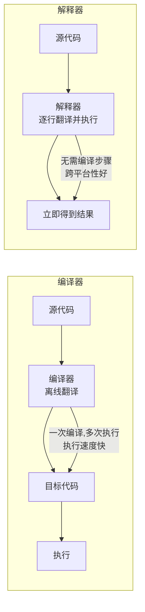
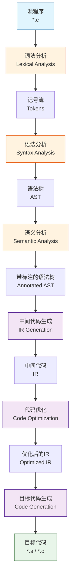
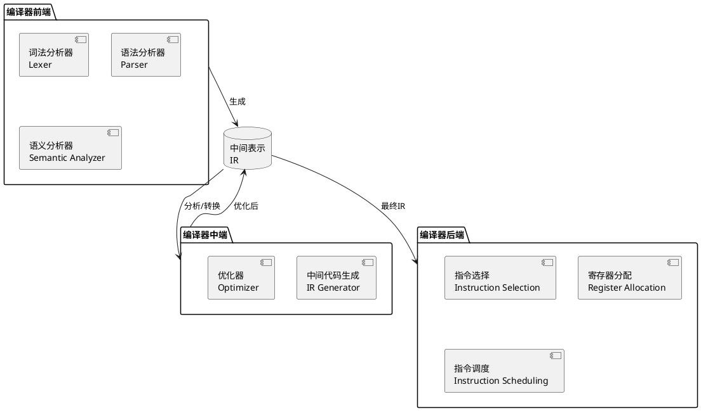
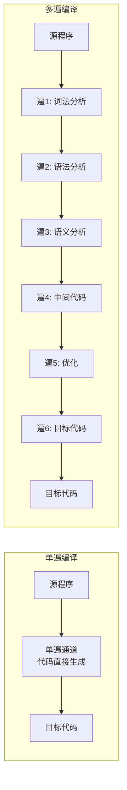
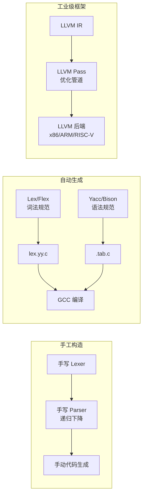
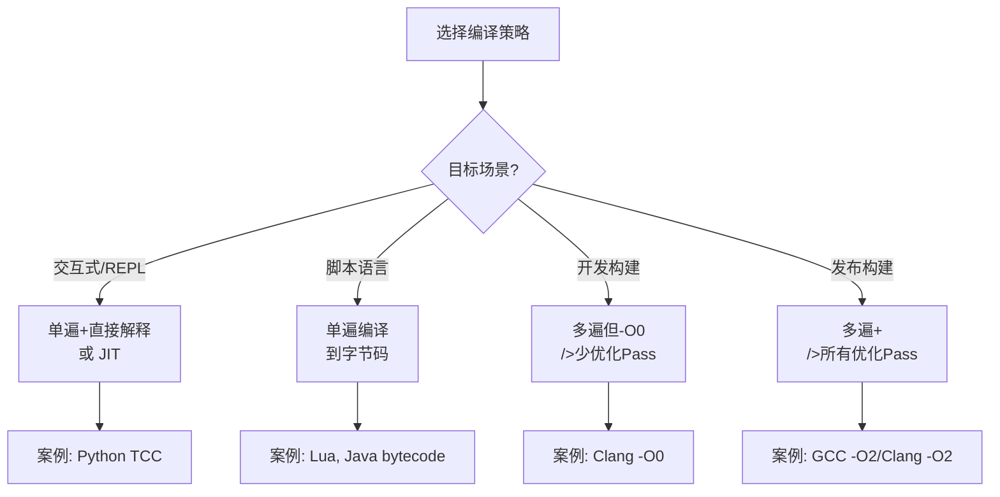

# 第一章：编译器概述与整体架构

## 学习目标

- 理解编译器在整个编程生态系统中的角色
- 掌握编译器与解释器的核心区别
- 理解编译器经典的多阶段流水线架构
- 看懂编译器前端/后端划分的设计思想
- 能用 C 语言实现一个最简单的表达式求值器来体会"编译"本质

## 什么是编译器？

**定义：**编译器是一种将 **高级语言源代码** 翻译为 **目标语言（通常是机器码或汇编）** 的程序，同时能够检测和报告源代码中的错误。

### 核心特性

| 特性 | 说明 |
|------|------|
| **翻译性** | 输入是源程序，输出是等价的目标程序 |
| **离线性** | 翻译发生在执行之前（区别于解释器） |
| **多阶段** | 通常分为前端、中端、后端三个主要阶段 |
| **错误检测** | 在翻译过程中发现并报告语法、语义错误 |

### 编译器 vs 解释器



### 典型编译管线的 6 个阶段

> **源程序** → 词法分析 → 语法分析 → 语义分析 → 中间代码生成 → 代码优化 → 目标代码生成 → **目标程序**



## 前端与后端



**前端** 与语言相关（C、C++、Java 各自独立），**后端** 与目标架构相关（x86、ARM、RISC-V 各自独立）。这种划分使得一个编译器可以支持 $M$ 种语言 x $N$ 种架构，只需实现 $M+N$ 个组件而非 $M \times N$ 个。

## 遍数设计：单遍 vs 多遍编译器



| 特性 | 单遍 | 多遍 |
|------|------|------|
| 内存占用 | 低 | 较高 |
| 编译速度 | 快 | 较慢 |
| 代码质量 | 较差 | 优秀（可反复优化） |
| 复杂度 | 低 | 高 |
| 典型代表 | Pascal 早期编译器 | GCC、LLVM |

## 实战：一个最小化的"编译器"体验

下面我们用纯 C 实现一个简单算术表达式的编译器雏形（支持 `+`、`*`、括号），它输出 x64 汇编代码。这个小示例体现了从 **源程序 → 分析 → 生成代码** 的完整流程。

### 源代码：表达式编译器

保存为 `tiny_expr_compiler.c`：

```c
#include <stdio.h>
#include <stdlib.h>
#include <ctype.h>
#include <string.h>

/*
 * Tiny Expression Compiler
 * 将简单算术表达式编译为 x64 汇编（AT&T 语法）
 * 支持: 数字, +, *, (, ), 如 3+5*2 → 输出汇编计算其结果
 *
 * 文法：
 *   expr  → term { '+' term }
 *   term  → factor { '*' factor }
 *   factor → NUMBER | '(' expr ')'
 */

/* ---- 词法分析器 (Lexer) ---- */
typedef enum {
    TOK_NUMBER, TOK_PLUS, TOK_STAR, TOK_LPAREN, TOK_RPAREN, TOK_EOF, TOK_ERROR
} TokenKind;

typedef struct {
    TokenKind kind;
    int       value;   /* TOK_NUMBER 时有效 */
} Token;

static const char *g_src;   /* 当前输入指针 */
static Token       g_lookahead;  /* 前瞻记号 */
static int         g_reg_count;  /* 寄存器编号计数器 */
static FILE       *g_out;    /* 输出文件（汇编） */

/* 获取下一个记号 */
static Token next_token(void) {
    Token tok = { TOK_ERROR, 0 };
    while (*g_src && isspace((unsigned char)*g_src)) g_src++;
    if (*g_src == '\0') { tok.kind = TOK_EOF; return tok; }
    if (isdigit((unsigned char)*g_src)) {
        tok.kind = TOK_NUMBER;
        tok.value = 0;
        while (isdigit((unsigned char)*g_src))
            tok.value = tok.value * 10 + (*g_src++ - '0');
        return tok;
    }
    switch (*g_src) {
        case '+': tok.kind = TOK_PLUS;   g_src++; break;
        case '*': tok.kind = TOK_STAR;   g_src++; break;
        case '(': tok.kind = TOK_LPAREN; g_src++; break;
        case ')': tok.kind = TOK_RPAREN; g_src++; break;
        default:  tok.kind = TOK_ERROR;  break;
    }
    return tok;
}

/* 前瞻接口 */
static void advance(void) { g_lookahead = next_token(); }
static int  peek(TokenKind k) { return g_lookahead.kind == k; }

/* 报错 */
static void error(const char *msg) {
    fprintf(stderr, "语法错误: %s\n", msg);
    exit(1);
}

/* 生成汇编指令，分配一个"寄存器"（实际使用栈变量模拟）*/
static int alloc_reg(void) {
    return g_reg_count++;  /* 返回寄存器编号 */
}

static void emit_load(int reg, int val) {
    /* 模拟: movl $val, %_reg */
    fprintf(g_out, "    movl    $%d, %%r%d\n", val, reg);
}

static void emit_add(int dst, int src1, int src2) {
    /* src2 暂存方案: 这里简化为两个寄存器相加 */
    fprintf(g_out, "    movl    %%r%d, %%r%d\n", src1, dst);
    fprintf(g_out, "    addl    %%r%d, %%r%d\n", src2, dst);
}

static void emit_mul(int dst, int src1, int src2) {
    fprintf(g_out, "    movl    %%r%d, %%r%d\n", src1, dst);
    fprintf(g_out, "    imull   %%r%d, %%r%d\n", src2, dst);
}

/* ---- 递归下降语法分析 + 代码生成 ---- */

/* 前向声明 */
static int parse_expr(void);
static int parse_term(void);
static int parse_factor(void);

/* expr  → term { '+' term } */
static int parse_expr(void) {
    int reg1 = parse_term();
    while (peek(TOK_PLUS)) {
        advance();
        int reg2 = parse_term();
        int reg_result = alloc_reg();
        emit_add(reg_result, reg1, reg2);
        reg1 = reg_result;
    }
    return reg1;
}

/* term  → factor { '*' factor } */
static int parse_term(void) {
    int reg1 = parse_factor();
    while (peek(TOK_STAR)) {
        advance();
        int reg2 = parse_factor();
        int reg_result = alloc_reg();
        emit_mul(reg_result, reg1, reg2);
        reg1 = reg_result;
    }
    return reg1;
}

/* factor → NUMBER | '(' expr ')' */
static int parse_factor(void) {
    if (peek(TOK_NUMBER)) {
        int reg = alloc_reg();
        emit_load(reg, g_lookahead.value);
        advance();
        return reg;
    }
    if (peek(TOK_LPAREN)) {
        advance();
        int reg = parse_expr();
        if (!peek(TOK_RPAREN)) error("缺少右括号");
        advance();
        return reg;
    }
    error("意外的记号");
    return -1;
}

/* ---- 汇编输出框架 ---- */
static void emit_prologue(void) {
    fprintf(g_out, "# Tiny Expression Compiler 输出\n");
    fprintf(g_out, "# 汇编语法: AT&T\n");
    fprintf(g_out, ".text\n");
    fprintf(g_out, ".globl _start\n");
    fprintf(g_out, "_start:\n");
    /* 保存栈帧 */
    fprintf(g_out, "    pushq   %%rbp\n");
    fprintf(g_out, "    movq    %%rsp, %%rbp\n");
}

static void emit_epilogue(int result_reg) {
    /* 将结果放入 %rdi (用于退出码) */
    fprintf(g_out, "    movl    %%r%d, %%edi\n", result_reg);
    /* 调用 exit */
    fprintf(g_out, "    movl    $60, %%eax\n");   /* SYS_exit (x64 Linux) */
    fprintf(g_out, "    syscall\n");
    fprintf(g_out, ".section .note.GNU-stack,\"\",@progbits\n");
}

int main(int argc, char *argv[]) {
    if (argc < 2) {
        fprintf(stderr, "用法: %s \"算术表达式\" [输出文件.s]\n", argv[0]);
        fprintf(stderr, "示例: %s \"3+5*2\" out.s\n", argv[0]);
        return 1;
    }

    const char *outfile = (argc >= 3) ? argv[2] : "out.s";
    g_out = fopen(outfile, "w");
    if (!g_out) { perror("fopen"); return 1; }

    g_src = argv[1];
    g_reg_count = 0;
    advance();           /* 读入第一个记号 */

    emit_prologue();
    int result_reg = parse_expr();  /* 语法分析 + 代码生成 */
    emit_epilogue(result_reg);

    fclose(g_out);

    printf("编译完成 → %s\n", outfile);
    printf("表达式: %s\n", argv[1]);

    return 0;
}
```

### 编译与运行

```bash
# 编译编译器本身
gcc -o tiny_cc tiny_expr_compiler.c

# 编译表达式 "3+5*2"
./tiny_cc "3+5*2" out.s

# 查看生成的汇编
cat out.s
```

**输出汇编 (out.s)：**

```asm
# Tiny Expression Compiler 输出
# 汇编语法: AT&T
.text
.globl _start
_start:
    pushq   %rbp
    movq    %rsp, %rbp
    movl    $3, %r0        # 加载数字 3
    movl    $5, %r1        # 加载数字 5
    movl    $2, %r2        # 加载数字 2
    movl    %r1, %r3       # r3 = r1 (5)
    imull   %r2, %r3       # r3 = r3 * r2 (5*2=10)
    movl    %r0, %r4       # r4 = r0 (3)
    addl    %r3, %r4       # r4 = r4 + r3 (3+10=13)
    movl    %r4, %edi      # 结果放入 edi（退出码）
    movl    $60, %eax      # sys_exit
    syscall
.section .note.GNU-stack,"",@progbits
```

```bash
# 在 Linux 下可以链接并运行
as out.s -o out.o && ld out.o -o out
./out
echo $?  # 应输出 13
```

## 编译器开发工具链



| 工具 | 用途 | 学习价值 |
|------|------|----------|
| **手工 C 代码** | 理解编译器底层原理 | ★★★★★ |
| **Flex / Bison** | 词法/语法分析器自动生成 | ★★★★ |
| **LLVM** | 工业级编译器基础设施 | ★★★★ |
| **GCC** | 对照参考、`-S` 输出汇编对比 | ★★★★ |

## 小结

本章我们学习了：

1. **编译器的定义**：将高级语言翻译为目标语言的程序
2. **6 阶段流水线**：词法分析 → 语法分析 → 语义分析 → IR 生成 → 优化 → 目标代码
3. **前端/后端划分**：语言相关 vs 架构相关的解耦设计
4. **遍数设计**：单遍（快但代码差）vs 多遍（慢但可优化）
5. **实战体验**：用 200 行 C 代码实现了最简单的表达式→x64 汇编编译器

下一章我们将深入 **词法分析**，学习如何将源代码分解为有意义的记号流。

## 深度扩展：编译器遍数选择的工程决策框架

### 决策树



### 各遍数方案的量化开销

```c
/* 编译过程的开销分布 (测量 GCC 编译中型 C 项目 10000 行) */

// 假设 10000 行 C 代码 (约 300KB)
// CPU: 3.5GHz x86-64
// 编译器: GCC 12 -O2
//
// 阶段                   时间占比    绝对时间
// 词法分析 + 语法分析:     8%         0.04s
// 语义分析 + 符号表:       5%         0.025s
// GIMPLE 生成 + SSA:     7%         0.035s
// 优化 Pass (40+个):      45%        0.23s
// RTL 生成 + 寄存器分配:   20%        0.10s
// 汇编输出:               15%        0.08s
// ─────────────────────────────────────────
// 总计:                              ~0.51s
//
// 如果改为 -O0 (仅必要 Pass):
// 总计:                              ~0.12s
// 其中 50%+ 花在 GIMPLE → RTL → 汇编

/* 单遍编译器 (如 TCC) 的相应时间：
 * 同样 10000 行 C: 约 0.008s
 * 差异原因: 无独立 IR, 无 AST, 无独立优化 Pass
 * 但代价: 生成代码运行速度可达 GCC -O2 的 1/3 到 1/10
 */
```

### 选择指南

| 项目类型 | 推荐编译策略 | 理由 |
|---------|-------------|------|
| 嵌入式固件 | 多遍高优化 | 代码大小和速度直接决定产品成本 |
| Web 应用 | 单遍或 JIT | 启动速度 > 峰值性能 |
| 操作系统内核 | 多遍高度优化 | 关键路径性能决定用户体验 |
| 教学用语言 | 单遍 | 代码可读性 > 性能 |
| 金融交易系统 | 多遍+手工调优 | 纳秒级延迟优化 |
| 移动 App | 混合策略 | 开发用-O0，发布用-Oz(大小优化) |

**练习：**

1. 为本章的表达式编译器增加减法 `-` 和除法 `/` 支持
2. 查看 GCC 输出的汇编：`echo 'int f(int x){return x+2;}' | gcc -S -xc -o - -`
3. 思考：为什么有些语言使用多遍编译，而像 TCC (Tiny C Compiler) 用单遍？
4. **深度练习：** 测量你常用的编译器编译一个 1000 行 C 文件的时间（`time gcc -c file.c` 和 `time gcc -O2 -c file.c`），计算优化 Pass 增加了多少时间
