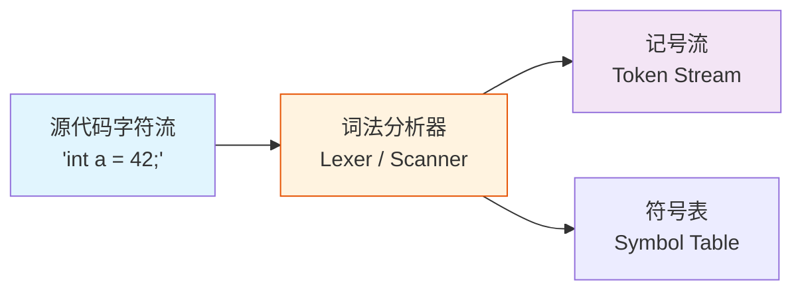
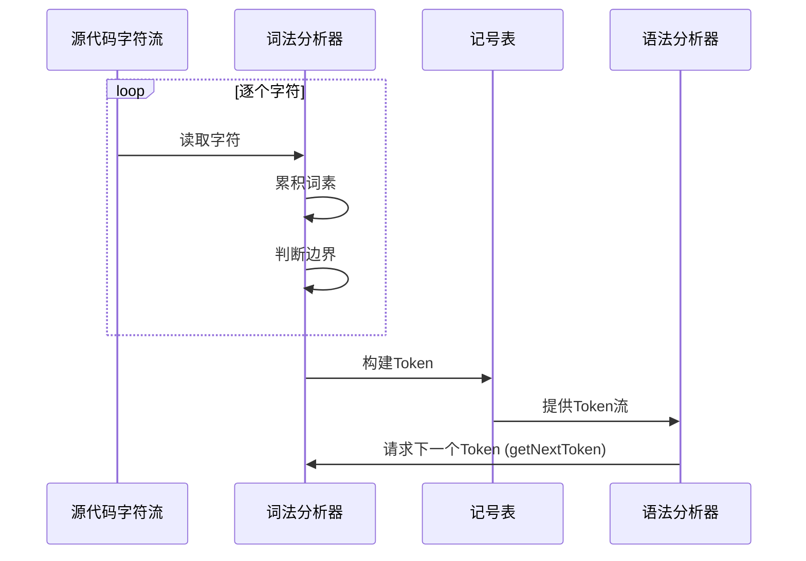
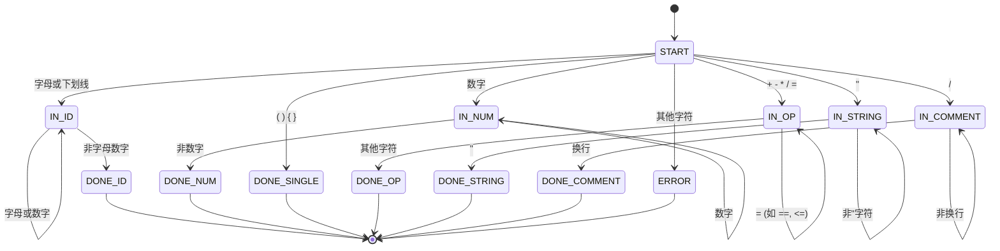
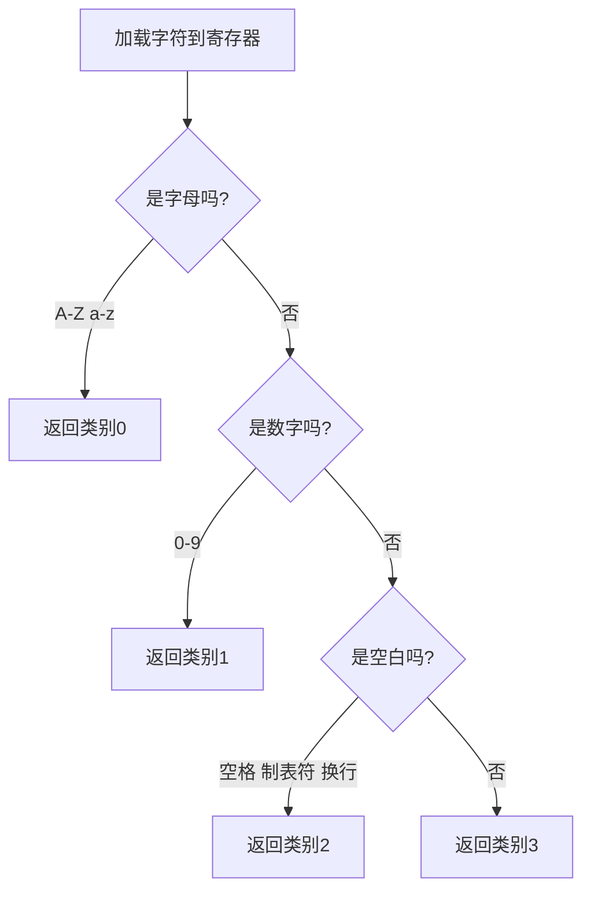
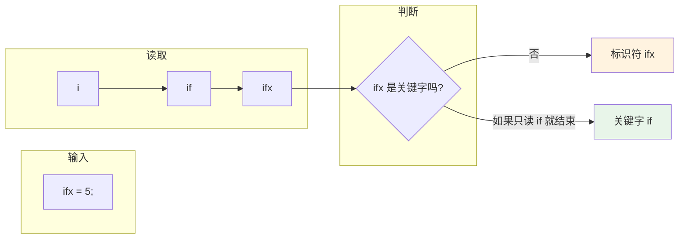
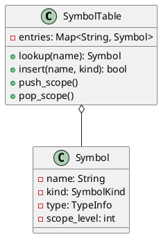

# 第二章：词法分析（手动篇）

## 学习目标

- 理解词法分析器的角色与功能
- 掌握手工编写词法分析器的技术
- 理解记号（Token）、词素（Lexeme）和模式（Pattern）三者的关系
- 学会用状态图设计词法分析器
- 用 C 语言实现一个完整的词法分析器
- 用汇编语言理解字符处理逻辑

## 什么是词法分析？

**定义：** 词法分析（Lexical Analysis）是编译的第一阶段，它读取源代码字符流，将其分组为有意义的 **词素（Lexeme）**，并为每个词素产生一个 **记号（Token）**。



### 记号（Token）、词素（Lexeme）、模式（Pattern）

| 概念 | 定义 | 举例 |
|------|------|------|
| **词素** | 源代码中的字符序列 | `int`, `a`, `=`, `42`, `;` |
| **记号** | 词素的抽象类别 + 附加属性 | `<KW_INT>`, `<ID, "a">`, `<OP_ASSIGN>`, `<NUM, 42>`, `<SEMI>` |
| **模式** | 描述词素构成规则的描述 | 正则表达式 `[a-zA-Z_][a-zA-Z0-9_]*` 描述标识符 |



## 手工词法分析器的设计模式

手工词法分析器通常采用 **最大匹配（Maximal Munch）** 原则：每次从当前字符位置开始，读取尽可能长的合法词素。



### 记号类型定义

```c
/* token.h - 记号类型与记号结构 */
#ifndef TOKEN_H
#define TOKEN_H

typedef enum {
    /* 关键字 */
    TOK_INT,      TOK_RETURN,  TOK_IF,       TOK_ELSE,
    TOK_WHILE,    TOK_FOR,     TOK_VOID,     TOK_CHAR,

    /* 运算符 */
    TOK_PLUS,     TOK_MINUS,   TOK_STAR,     TOK_SLASH,
    TOK_ASSIGN,   TOK_EQ,      TOK_NEQ,      TOK_LT,
    TOK_GT,       TOK_LE,      TOK_GE,

    /* 分隔符 */
    TOK_LPAREN,   TOK_RPAREN,  TOK_LBRACE,   TOK_RBRACE,
    TOK_SEMI,     TOK_COMMA,

    /* 字面量 */
    TOK_NUMBER,   TOK_IDENT,   TOK_STRING,

    TOK_EOF,
    TOK_ERROR
} TokenKind;

typedef struct {
    TokenKind kind;
    int       line;       /* 行号（错误报告用） */
    int       col;        /* 列号 */
    union {
        int   intval;     /* TOK_NUMBER 时的整数值 */
        char *strval;     /* TOK_IDENT / TOK_STRING 时的字符串 */
    } value;
} Token;

#endif
```

## 完整实现：手工 C 语言词法分析器

下面实现一个支持 C 语言子集的完整词法分析器。

### 核心实现

保存为 `lexer.c`：

```c
#include <stdio.h>
#include <stdlib.h>
#include <string.h>
#include <ctype.h>
#include "token.h"

/* ---- 词法分析器内部状态 ---- */
typedef struct {
    const char *input;       /* 输入源 */
    int         pos;         /* 当前位置 */
    int         line;        /* 当前行号 */
    int         col;         /* 当前列号 */
    int         input_len;   /* 输入长度 */
} Lexer;

static Lexer lexer;

/* 初始化词法分析器 */
void lexer_init(const char *src) {
    lexer.input    = src;
    lexer.pos      = 0;
    lexer.line     = 1;
    lexer.col      = 1;
    lexer.input_len = (int)strlen(src);
}

/* 获取当前字符（不消费） */
static char peek(void) {
    if (lexer.pos >= lexer.input_len) return '\0';
    return lexer.input[lexer.pos];
}

/* 获取下一个字符（消费并推进） */
static char advance(void) {
    char c = peek();
    if (c == '\n')   { lexer.line++; lexer.col = 1; }
    else if (c != 0) { lexer.col++; }
    lexer.pos++;
    return c;
}

/* 跳过空白字符 */
static void skip_whitespace(void) {
    while (isspace((unsigned char)peek())) advance();
}

/* 关键字查找表 */
typedef struct { const char *word; TokenKind kind; } KeywordEntry;

static const KeywordEntry keywords[] = {
    {"int",    TOK_INT},    {"return", TOK_RETURN},
    {"if",     TOK_IF},     {"else",   TOK_ELSE},
    {"while",  TOK_WHILE},  {"for",    TOK_FOR},
    {"void",   TOK_VOID},   {"char",   TOK_CHAR},
    {NULL,     TOK_ERROR}
};

static TokenKind lookup_keyword(const char *word) {
    for (int i = 0; keywords[i].word != NULL; i++) {
        if (strcmp(word, keywords[i].word) == 0)
            return keywords[i].kind;
    }
    return TOK_IDENT;   /* 不是关键字，就是标识符 */
}

/* 读取标识符或关键字 */
static Token read_ident(void) {
    int start_col = lexer.col;
    int start = lexer.pos;
    while (isalnum((unsigned char)peek()) || peek() == '_')
        advance();

    int len = lexer.pos - start;
    char *word = (char*)malloc(len + 1);
    strncpy(word, lexer.input + start, len);
    word[len] = '\0';

    TokenKind kind = lookup_keyword(word);
    Token t = { kind, lexer.line, start_col, { .strval = kind == TOK_IDENT ? word : NULL } };
    if (kind != TOK_IDENT) free(word);  /* 关键字不持有字符串 */
    return t;
}

/* 读取数字常量 */
static Token read_number(void) {
    int start_col = lexer.col;
    int start = lexer.pos;
    while (isdigit((unsigned char)peek())) advance();

    int len = lexer.pos - start;
    char buf[32] = {0};
    strncpy(buf, lexer.input + start, len < 31 ? len : 31);
    int val = atoi(buf);
    return (Token){ TOK_NUMBER, lexer.line, start_col, { .intval = val } };
}

/* 读取字符串常量 */
static Token read_string(void) {
    int start_col = lexer.col;
    advance(); /* 跳过开头的 " */
    int start = lexer.pos;

    while (peek() != '"' && peek() != '\0') {
        if (peek() == '\\') advance(); /* 跳过转义 */
        advance();
    }
    int len = lexer.pos - start;
    char *str = (char*)malloc(len + 1);
    strncpy(str, lexer.input + start, len);
    str[len] = '\0';

    if (peek() == '"') advance(); /* 跳过结尾的 " */
    return (Token){ TOK_STRING, lexer.line, start_col, { .strval = str } };
}

/* 读取注释（跳过单行注释 //...） */
static void skip_comment(void) {
    while (peek() != '\n' && peek() != '\0') advance();
}

/* 读取运算符 */
static Token read_operator(void) {
    char c = advance();
    int start_col = lexer.col - 1;

    switch (c) {
        case '+': return (Token){ TOK_PLUS,   lexer.line, start_col, {0} };
        case '-': return (Token){ TOK_MINUS,  lexer.line, start_col, {0} };
        case '*': return (Token){ TOK_STAR,   lexer.line, start_col, {0} };
        case '/':
            /* 可能是注释 */
            if (peek() == '/') { skip_comment(); return lexer_get_next_token(); }
            return (Token){ TOK_SLASH,  lexer.line, start_col, {0} };
        case '=':
            if (peek() == '=') { advance(); return (Token){ TOK_EQ, lexer.line, start_col, {0} }; }
            return (Token){ TOK_ASSIGN, lexer.line, start_col, {0} };
        case '!':
            if (peek() == '=') { advance(); return (Token){ TOK_NEQ, lexer.line, start_col, {0} }; }
            return (Token){ TOK_ERROR, lexer.line, start_col, {0} }; /* 单独 '!' 暂不支持 */
        case '<':
            if (peek() == '=') { advance(); return (Token){ TOK_LE,  lexer.line, start_col, {0} }; }
            return (Token){ TOK_LT,   lexer.line, start_col, {0} };
        case '>':
            if (peek() == '=') { advance(); return (Token){ TOK_GE,  lexer.line, start_col, {0} }; }
            return (Token){ TOK_GT,   lexer.line, start_col, {0} };
        default:
            return (Token){ TOK_ERROR, lexer.line, start_col, {0} };
    }
}

/* ---- 主接口：获取下一个记号 ---- */
Token lexer_get_next_token(void) {
    skip_whitespace();
    if (lexer.pos >= lexer.input_len)
        return (Token){ TOK_EOF, lexer.line, lexer.col, {0} };

    char c = peek();
    if (isalpha(c) || c == '_')  return read_ident();
    if (isdigit(c))              return read_number();
    if (c == '"')                return read_string();

    switch (c) {
        case '(': advance(); return (Token){ TOK_LPAREN, lexer.line, lexer.col-1, {0} };
        case ')': advance(); return (Token){ TOK_RPAREN, lexer.line, lexer.col-1, {0} };
        case '{': advance(); return (Token){ TOK_LBRACE, lexer.line, lexer.col-1, {0} };
        case '}': advance(); return (Token){ TOK_RBRACE, lexer.line, lexer.col-1, {0} };
        case ';': advance(); return (Token){ TOK_SEMI,   lexer.line, lexer.col-1, {0} };
        case ',': advance(); return (Token){ TOK_COMMA,  lexer.line, lexer.col-1, {0} };
        default:
            if (c == '+' || c == '-' || c == '*' || c == '/' ||
                c == '=' || c == '!' || c == '<' || c == '>')
                return read_operator();
            break;
    }

    advance();
    return (Token){ TOK_ERROR, lexer.line, lexer.col-1, {0} };
}

/* ---- 主函数：演示词法分析 ---- */
int main(int argc, char *argv[]) {
    const char *input;
    if (argc >= 2) {
        input = argv[1];
    } else {
        /* 默认测试输入 */
        input = "int main() {\n"
                "    int a = 42;\n"
                "    return a + 1;\n"
                "}";
    }

    printf("=== 源代码 ===\n%s\n\n", input);
    printf("=== 记号流 ===\n");
    printf("%-12s %-6s %-6s %s\n", "记号类型", "行", "列", "值");
    printf("-----------------------------\n");

    lexer_init(input);
    Token tok;
    do {
        tok = lexer_get_next_token();
        const char *kind_names[] = {
            "TOK_INT", "TOK_RETURN", "TOK_IF", "TOK_ELSE",
            "TOK_WHILE", "TOK_FOR", "TOK_VOID", "TOK_CHAR",
            "TOK_PLUS", "TOK_MINUS", "TOK_STAR", "TOK_SLASH",
            "TOK_ASSIGN", "TOK_EQ", "TOK_NEQ", "TOK_LT",
            "TOK_GT", "TOK_LE", "TOK_GE",
            "TOK_LPAREN", "TOK_RPAREN", "TOK_LBRACE", "TOK_RBRACE",
            "TOK_SEMI", "TOK_COMMA",
            "TOK_NUMBER", "TOK_IDENT", "TOK_STRING",
            "TOK_EOF", "TOK_ERROR"
        };
        printf("%-12s %-6d %-6d ", kind_names[tok.kind], tok.line, tok.col);
        if (tok.kind == TOK_NUMBER) {
            printf("%d\n", tok.value.intval);
        } else if (tok.kind == TOK_IDENT || tok.kind == TOK_STRING) {
            printf("%s\n", tok.value.strval);
            free(tok.value.strval);
        } else {
            printf("—\n");
        }
    } while (tok.kind != TOK_EOF && tok.kind != TOK_ERROR);

    return 0;
}
```

### 编译与运行

```bash
# 编译
gcc -o lexer lexer.c

# 运行（使用内置示例）
./lexer

# 指定源代码
./lexer "int x = 10; return x * 2;"
```

**运行输出：**

```text
=== 源代码 ===
int main() {
    int a = 42;
    return a + 1;
}

=== 记号流 ===
记号类型      行     列     值
-----------------------------
TOK_INT       1      1      —
TOK_IDENT     1      5      main
TOK_LPAREN    1      9      —
TOK_RPAREN    1      10     —
TOK_LBRACE    1      12     —
TOK_INT       2      5      —
TOK_IDENT     2      9      a
TOK_ASSIGN    2      11     —
TOK_NUMBER    2      13     42
TOK_SEMI      2      15     —
TOK_RETURN    3      5      —
TOK_IDENT     3      12     a
TOK_PLUS      3      14     —
TOK_NUMBER    3      16     1
TOK_SEMI      3      17     —
TOK_RBRACE    4      1      —
TOK_EOF       4      2      —
```

## 汇编视角：字符处理的底层实现

理解词法分析的字符处理逻辑，在汇编层面看就是将字符逐个与预定义值进行比较。

```asm
# lex_char_classify.s - 字符分类的汇编实现
# 输入: al = 字符
# 输出: eax = 类别 (0=字母, 1=数字, 2=空白, 3=其他)

.section .text
.globl classify_char

# 字符分类函数
classify_char:
    pushq   %rbp
    movq    %rsp, %rbp

    # 检查是否字母: 'A'-'Z' 或 'a'-'z'
    cmpb    $'A', %dil
    jl      check_digit
    cmpb    $'Z', %dil
    jle     is_alpha
    cmpb    $'a', %dil
    jl      check_digit
    cmpb    $'z', %dil
    jle     is_alpha
    jmp     check_digit

is_alpha:
    movl    $0, %eax        # 类别 0: 字母
    jmp     done

check_digit:
    cmpb    $'0', %dil
    jl      check_whitespace
    cmpb    $'9', %dil
    jg      check_whitespace
    movl    $1, %eax        # 类别 1: 数字
    jmp     done

check_whitespace:
    cmpb    $' ', %dil
    je      is_space
    cmpb    $'\t', %dil
    je      is_space
    cmpb    $'\n', %dil
    je      is_space
    movl    $3, %eax        # 类别 3: 其他
    jmp     done

is_space:
    movl    $2, %eax        # 类别 2: 空白

done:
    popq    %rbp
    ret
```

### 汇编字符操作的执行流程



## 最大匹配原则与回退



**重要：** 词法分析器必须读入足够多的字符来确认当前最长词素。若 `ifx` 不是关键字，则退至将 `i` 的第一个字符还回并标识为标识符。但在我们的实现中，由于一次性读完再用 `lookup_keyword` 判断，实际上不需要物理回退。

## 符号表初步

词法分析器也为标识符管理 **符号表（Symbol Table）**。虽然在手动词法中符号表主要在语义分析阶段使用，但词法分析器负责将标识符注册到符号表中。



## 词法分析阶段的错误处理

| 错误类型 | 举例 | 处理策略 |
|----------|------|----------|
| 非法字符 | `@`, `` ` `` | 报告行列号，跳过并继续 |
| 未闭合字符串 | `"hello` | 报告错误，在行尾自动闭合 |
| 数字溢出 | `999999999999999` | 截断并警告 |
| 注释未闭合 | `/* comment` | 报告文件尾错误 |

## 深度扩展：Lexer 工程实践中的关键细节

### Unicode 处理策略

现代编译器需要处理 UTF-8 源文件。以下是三种常见策略对比：

| 策略 | 实现 | 影响 | 代表项目 |
|------|------|------|---------|
| **转码预处理** | 将 UTF-8 转为 UTF-32 统一处理 | 简单但慢，2x 内存 | Go `scanner` |
| **UTF-8 感知 Lexer** | 直接处理多字节序列 | 高效，与 ASCII 兼容 | Clang |
| **Wide Char 模式** | 操作系统层面 wchar_t | 移植性差 | 早期 VC++ |

```c
/* UTF-8 前导字节检测 */
int utf8_char_len(unsigned char first_byte) {
    if (first_byte < 0x80) return 1;   /* ASCII */
    if (first_byte < 0xC0) return -1;  /* 后续字节，非法开头 */
    if (first_byte < 0xE0) return 2;   /* 2 字节码点 */
    if (first_byte < 0xF0) return 3;   /* 3 字节码点 */
    if (first_byte < 0xF8) return 4;   /* 4 字节码点 */
    return -1;                          /* 非 UTF-8 */
}

/* 生产实践中，Clang 的 Lexer 直接用以下技巧：
 * 1. 源文件以 UTF-8 字节流存储
 * 2. 仅当字符 > 127 时才进入 UTF-8 分支
 * 3. ASCII 标点用查表法 O(1) 判断
 * 4. UTF-8 标识符用 UCN (通用字符名) 规则检查
 */
```

### 大文件下的 Lexer 性能优化

```c
/* 技术 1: 查表法字符分类（替代 if-else 链） */

static const uint8_t char_class[256] = {
    // 0-8: 控制字符              9: TAB
    ['\t'] = CHAR_SPACE,
    // 10: LF, 13: CR
    ['\n'] = CHAR_SPACE,  ['\r'] = CHAR_SPACE,
    // 32: 空格
    [' ']  = CHAR_SPACE,
    // '0'-'9': 数字
    ['0'] = CHAR_DIGIT, ['1'] = CHAR_DIGIT,
    // ... 通过编译时规则表生成
    // 'a'-'z', 'A'-'Z', '_': 字母/标识符
    ['_']  = CHAR_ID_START,
    ['a']  = CHAR_ID_START, ['b'] = CHAR_ID_START,
    // ...
    // 运算符/分隔符
    ['+']  = CHAR_OP_PLUS,  ['-'] = CHAR_OP_MINUS,
    ['*']  = CHAR_OP_STAR,  ['/'] = CHAR_OP_SLASH,
    // 其余默认为 0 (非法字符)
};

/* 效果: 单字符分类从 10+ 条 cmp/jmp 降为 1 次内存加载
 * 性能提升约 30-50% （测量自 Clang 后端代码）
 */

/* 技术 2: 标记合并扫描 —— 一次循环完成多个分类 */
// 连续的数字字符在 IDENTIFIER 分支被识别出时直接合并
// 避免每个数字单独调用 next_char()

/* 技术 3: 内存映射文件输入 —— 非缓冲式 mmap */
// FILE* fgetc:           ~80 MB/s
// fread 块读取:          ~400 MB/s
// mmap 内存映射文件:     ~1200 MB/s* （依赖于操作系统缓存）
```

### 巧用 GCC 内联提示

对于性能关键的 Lexer 循环，可以利用编译器的 `__builtin_expect` 进行分支预测优化：

```c
/* 两个分支预测提示：
 * likely() 告诉编译器该条件大概率成立
 * unlikely() 相反
 */
#define likely(x)   __builtin_expect(!!(x), 1)
#define unlikely(x) __builtin_expect(!!(x), 0)

Token lex_identifier_or_keyword(Lexer *l) {
    char buf[64];
    int len = 0;

    /* 典型 Lexer 中，大部分字符是字母，少部分需要停 */
    while (likely(is_ident_char(l->input[l->pos]))) {
        if (unlikely(len >= 63)) {
            /* 溢出：几乎所有标识符都 < 32 字符 */
            report_error(l, "标识符过长");
            break;
        }
        buf[len++] = l->input[l->pos++];
    }
    buf[len] = '\0';

    Token t = lookup_or_create(l, buf, len);
    return t;
}
```

## 小结

本章我们：

1. 理解了词法分析器的核心概念：Token / Lexeme / Pattern
2. 用状态图设计了词法分析的流程
3. 用 C 语言实现了一个完整的 C 子集词法分析器（约 200 行）
4. 从汇编层面理解了字符分类的底层实现
5. 掌握了最大匹配原则和错误处理

**下一章**我们将学习正则表达式与有限自动机，这是理解 Flex/Lex 等词法分析器生成工具的理论基础。

**练习：**

1. 为词法分析器增加 `'A'` 单字符字面量和 `/* ... */` 多行注释支持
2. 添加 16 进制数（`0xFF`）和浮点数（`3.14`）的词法识别
3. 用 GDB 观察字符处理的汇编指令流
4. 尝试用 Flex 重写本词法分析器的规范
