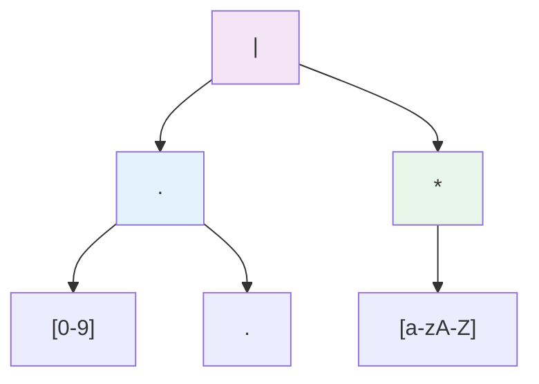
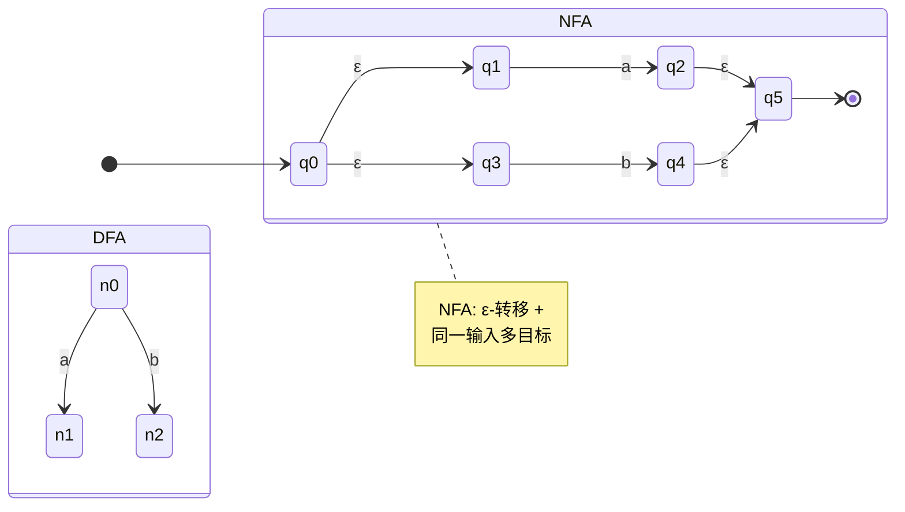
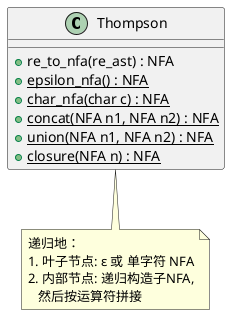
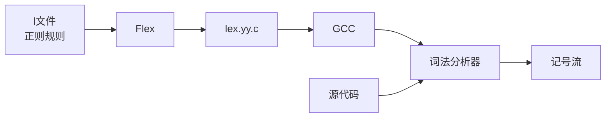

# 第三章：正则表达式与有限自动机

## 学习目标

- 理解正则表达式描述词法模式的能力
- 掌握 NFA（非确定性有限自动机）与 DFA（确定性有限自动机）的概念
- 理解 Thompson 构造法：正则表达式 → NFA
- 理解子集构造法：NFA → DFA
- 能用 C 语言实现一个简单的 DFA 模拟器
- 理解 Flex/Lex 的工作原理

## 正则表达式基础

### 定义

**正则表达式（Regular Expression, RE）** 是一种描述字符串模式的数学符号系统。在词法分析中，每个 Token 类型都可以用一个正则表达式来描述。

### 基本运算

| 运算 | 符号 | 含义 | 举例 |
|------|------|------|------|
| **连接** | $r_1 r_2$ | 先 $r_1$ 后 $r_2$ | `ab` 匹配 "ab" |
| **选择** | $r_1 \vert r_2$ | $r_1$ 或 $r_2$ | `a|b` 匹配 "a" 或 "b" |
| **Kleene 闭包** | $r^*$ | 零次或多次 $r$ | `a*` 匹配 "", "a", "aa", ... |
| **正闭包** | $r^+$ | 一次或多次 $r$ | `a+` 匹配 "a", "aa", ... |
| **可选** | $r?$ | 零次或一次 $r$ | `a?` 匹配 "" 或 "a" |

### C 语言 Token 的正则表达式

| Token 类型 | 正则表达式 | 说明 |
|------------|-----------|------|
| 标识符 | `[a-zA-Z_][a-zA-Z0-9_]*` | 字母/下划线开头，字母数字下划线后续 |
| 整数 | `[0-9]+` | 至少一位数字 |
| 浮点数 | `[0-9]+"."[0-9]*` | 如 `3.14`，含小数点 |
| 运算符 | `[+\-*/<>=!]=?` | 单字符或双字符运算符 |
| 字符串 | `\"[^"]*\"` | 引号内的任意非引号字符 |
| 注释 | `"//"[^\n]*` | 从 // 到行尾 |

### 正则表达式的语法树表示



## 有限自动机理论

### NFA vs DFA

| 特性 | NFA (非确定性) | DFA (确定性) |
|------|---------------|-------------|
| **转移** | 同一字符可到多个状态 | 同一字符唯一目标状态 |
| **ε-转移** | 支持（不需要输入） | 不支持 |
| **状态数** | 通常较少 | 指数级膨胀可能 |
| **执行速度** | 慢（需模拟并行或回溯） | 快（$O(n)$ 线性） |
| **实现难度** | 较难 | 简单（查表即可） |



### 工作流：从 RE 到 DFA

```plantuml
@startuml
start
:正则表达式 RE;
:解析 RE 为语法树；
:Thompson 构造法\nRE → NFA;

repeat
  :子集构造法\nNFA → DFA;
repeat while (存在未处理状态) as states
  :最小化 DFA\n(合并等价状态);
:生成转移表；
:DFA 模拟执行；
stop
@enduml
```

## Thompson 构造法：RE → NFA

Thompson 构造法是经典的递归构造法，对每种 RE 结构定义对应的 NFA 子图。

```mermaid
stateDiagram-v2
    direction LR

    state "ε (空串)" as EMPTY {
        [*] --> i
        i --> f : ε
        f --> [*]
    }

    state "a (字符a)" as CHAR {
        [*] --> i2
        i2 --> f2 : a
        f2 --> [*]
    }

    state "r1 | r2 (选择)" as UNION {
        [*] --> u_i
        u_i --> n1 : ε
        u_i --> n2 : ε
        n1 --> u_f : ε
        n2 --> u_f : ε
        u_f --> [*]
    }

    state "r1 r2 (连接)" as CONCAT {
        [*] --> c1
        c1 --> c_mid : r1
        c_mid --> c2 : ε
        c2 --> c_f : r2
        c_f --> [*]
    }

    state "r* (Kleene闭包)" as STAR {
        [*] --> s_i
        s_i --> s_f : ε
        s_i --> s_body : ε
        s_body --> s_f : ε
        s_body --> s_body : r
        s_f --> [*]
    }
```



### 核心构造规则



## 子集构造法：NFA → DFA

核心算法：模拟 NFA 的所有可能状态集合作为 DFA 的一个状态。

$$
\text{DFA状态} = \{q_0, q_1, ..., q_n\} \text{ NFA状态的集合}
$$

**关键函数：**

- **ε-闭包($S$)**：从状态集 $S$ 出发，通过 ε 转移可达的所有状态
- **转移($S, a$)**：从状态集 $S$ 出发，读取字符 $a$ 后可到达的所有状态

```c
/* 子集构造法伪代码 */
function subset_construction(nfa):
    dfa_start = ε_closure({nfa.start})
    worklist = [dfa_start]
    dfa_states = {dfa_start}
    dfa_transitions = {}

    while worklist not empty:
        set = worklist.pop()
        for each input symbol 'a':
            t = ε_closure(move(set, a))
            if t not empty and t not in dfa_states:
                dfa_states += t
                worklist.push(t)
            dfa_transitions[(set, a)] = t
    return (dfa_states, dfa_transitions)
```

## DFA 最小化

将不可区分的状态合并为同一个状态。

```c
/* Moore 算法最小化 DFA */
function minimize_dfa(dfa):
    /* 初始划分: 终态集 vs 非终态集 */
    partition = [{accept_states}, {non_accept_states}]

    repeat:
        new_partition = []
        for each group in partition:
            /* 根据输入符号的转移目标拆分 */
            split groups by transition targets
            add splits to new_partition
        if new_partition == partition: break
        partition = new_partition

    /* 合并组内状态 */
    return construct_minimized(partition)
```

## C 语言实现：DFA 模拟器

下面实现一个直接从正则表达式构造 NFA 再转为 DFA 的简化版本。为清晰起见，我们直接硬编码一个识别标识符与数字的 DFA。

### 简易 DFA 词法模拟器

保存为 `dfa_lexer.c`：

```c
#include <stdio.h>
#include <ctype.h>
#include <string.h>

/*
 * 手动构造的 DFA，识别两类 Token:
 *   - 标识符: [a-zA-Z_][a-zA-Z0-9_]*
 *   - 整数:   [0-9]+
 *   - 运算符: +, -, *, /
 *   - 空白:   跳过
 *   - 其他:   报告错误
 */

/* DFA 状态枚举 */
typedef enum {
    S_START,      /* 开始状态 */
    S_ID,         /* 标识符中 */
    S_NUM,        /* 数字中     */
    S_OP,         /* 运算符     */
    S_DONE_ID,    /* 标识符结束 */
    S_DONE_NUM,   /* 数字结束   */
    S_DONE_OP,    /* 运算符结束 */
    S_ERROR,      /* 错误状态   */
    S_EOF         /* 文件结束   */
} State;

typedef struct {
    State   state;
    const char *lexeme_start;
    int     lexeme_len;
    int     int_value;
} DFA_Result;

/* DFA 转移表 */
/* 字符分类: 0=字母/下划线, 1=数字, 2=运算符, 3=空白, 4=其他, 5=EOF */
static int get_char_class(char c) {
    if (c == '\0') return 5;
    if (isalpha((unsigned char)c) || c == '_') return 0;
    if (isdigit((unsigned char)c)) return 1;
    if (c == '+' || c == '-' || c == '*' || c == '/') return 2;
    if (isspace((unsigned char)c)) return 3;
    return 4;
}

/* 转移表: [当前状态][字符分类] -> 下一状态 */
static const State transition[8][6] = {
    /*         字母  数字  操作  空白  其他  EOF */
    /* START */ {S_ID, S_NUM, S_OP, S_START, S_ERROR, S_EOF},
    /* ID    */ {S_ID, S_ID,  S_DONE_ID, S_DONE_ID, S_DONE_ID, S_DONE_ID},
    /* NUM   */ {S_DONE_NUM, S_NUM, S_DONE_NUM, S_DONE_NUM, S_DONE_NUM, S_DONE_NUM},
    /* OP    */ {S_DONE_OP, S_DONE_OP, S_DONE_OP, S_DONE_OP, S_DONE_OP, S_DONE_OP},
    /* DONE_ID */ {S_DONE_ID, S_DONE_ID, S_DONE_ID, S_DONE_ID, S_DONE_ID, S_DONE_ID},
    /* DONE_NUM*/ {S_DONE_NUM, S_DONE_NUM, S_DONE_NUM, S_DONE_NUM, S_DONE_NUM, S_DONE_NUM},
    /* DONE_OP */ {S_DONE_OP, S_DONE_OP, S_DONE_OP, S_DONE_OP, S_DONE_OP, S_DONE_OP},
    /* ERROR */   {S_ERROR, S_ERROR, S_ERROR, S_ERROR, S_ERROR, S_ERROR},
};

/* 判断是否为接受状态 */
static int is_accepting(State s) {
    return s == S_ID || s == S_NUM || s == S_OP;
}

/* DFA 驱动函数：模拟读取输入 */
DFA_Result dfa_run(const char *input) {
    int pos = 0;
    int len = (int)strlen(input);

    while (pos < len && isspace((unsigned char)input[pos]))
        pos++;

    if (pos >= len)
        return (DFA_Result){S_EOF, NULL, 0, 0};

    State state = S_START;
    State last_accept = S_START;
    int last_accept_pos = pos;
    int start_pos = pos;

    while (pos <= len) {
        char c = input[pos];
        int cls = get_char_class(c);
        State next = transition[state][cls];

        if (next >= S_DONE_ID) {
            /* 需要回退：在到达 DONE 状态时处理 */
            break;
        }

        if (is_accepting(next)) {
            last_accept = next;
            last_accept_pos = pos + 1; /* 包括当前字符 */
        }

        state = next;
        pos++;
    }

    if (is_accepting(state)) {
        last_accept = state;
        last_accept_pos = pos;
    }

    DFA_Result result;
    result.state = last_accept;
    result.lexeme_start = input + start_pos;
    result.lexeme_len = last_accept_pos - start_pos;

    if (last_accept == S_NUM) {
        char buf[32] = {0};
        strncpy(buf, result.lexeme_start, result.lexeme_len < 31 ? result.lexeme_len : 31);
        result.int_value = atoi(buf);
    } else {
        result.int_value = 0;
    }

    return result;
}

/* ---- 测试 ---- */
int main(void) {
    const char *test_cases[] = {
        "42",
        "myVar",
        "x123",
        "a+b*c",
        "123abc",
        "@invalid",
        "_private",
        NULL
    };

    for (int i = 0; test_cases[i]; i++) {
        DFA_Result r = dfa_run(test_cases[i]);
        const char *state_names[] = {
            "S_START", "S_ID", "S_NUM", "S_OP",
            "S_DONE_ID", "S_DONE_NUM", "S_DONE_OP", "S_ERROR", "S_EOF"
        };

        printf("输入: %-12s → ", test_cases[i]);

        if (r.state == S_ERROR || r.state == S_EOF) {
            printf("[错误] %s\n", state_names[r.state]);
        } else {
            char lexeme[64] = {0};
            strncpy(lexeme, r.lexeme_start,
                    r.lexeme_len < 63 ? r.lexeme_len : 63);
            const char *type = (r.state == S_ID) ? "标识符" :
                               (r.state == S_NUM) ? "整数" : "运算符";
            printf("[%s] '%s'", type, lexeme);
            if (r.state == S_NUM) printf(" = %d", r.int_value);
            printf("\n");
        }
    }

    return 0;
}
```

### 编译与运行

```bash
gcc -o dfa_lexer dfa_lexer.c
./dfa_lexer
```

**运行输出：**

```text
输入: 42          → [整数] '42' = 42
输入: myVar       → [标识符] 'myVar'
输入: x123        → [标识符] 'x123'
输入: a+b*c       → [标识符] 'a'
输入: 123abc      → [整数] '123'
输入: @invalid    → [错误] S_ERROR
输入: _private    → [标识符] '_private'
```

### 汇编视角：DFA 状态转移

DFA 执行的核心是查表跳转。在汇编层面，一个二维转移表可以用 **跳转表** 或 **两级间接跳转** 实现：

```asm
# dfa_step.s - DFA 单步执行 (x64 AT&T)
# 输入:  edi = 当前状态
#        sil = 输入字符
# 输出:  eax = 下一状态

.section .text
.globl dfa_step

dfa_step:
    pushq   %rbp
    movq    %rsp, %rbp
    pushq   %rbx

    # 先将字符分类存入 ebx
    # classify_char 已在上一章实现
    movzbl  %sil, %edi       # 字符
    call    classify_char    # 返回类别 0-5
    movl    %eax, %ebx       # ebx = 字符类别

    # 从栈加载状态
    movl    16(%rbp), %eax   # eax = 状态

    # DFA 转移表地址
    leaq    transition(%rip), %r10

    # 计算索引: state * 6 + class
    imull   $6, %eax, %eax
    addl    %ebx, %eax
    movslq  %eax, %rax

    # 读取转移目标
    movl    (%r10, %rax, 4), %eax

    popq    %rbx
    popq    %rbp
    ret
```

## Flex/Lex 入门

### 工作原理



### 用 Flex 重写词法分析器

保存为 `c_lexer.l`：

```lex
%{
/* 包含 YYSTYPE 定义 */
#include "token.h"
int line_num = 1;
%}

%option noyywrap

/* 正则定义 */
letter    [a-zA-Z_]
digit     [0-9]
ident     {letter}({letter}|{digit})*
number    {digit}+
whitespace [ \t\r]+

%%

{whitespace}   { /* skip */ }
\n             { line_num++; }
"//".*         { /* skip comment */ }

"int"     { return TOK_INT; }
"return"  { return TOK_RETURN; }
"if"      { return TOK_IF; }
"else"    { return TOK_ELSE; }
"while"   { return TOK_WHILE; }
"void"    { return TOK_VOID; }

"+"       { return TOK_PLUS; }
"-"       { return TOK_MINUS; }
"*"       { return TOK_STAR; }
"/"       { return TOK_SLASH; }
"="       { return TOK_ASSIGN; }
"=="      { return TOK_EQ; }
"!="      { return TOK_NEQ; }
"<"       { return TOK_LT; }
">"       { return TOK_GT; }
"<="      { return TOK_LE; }
">="      { return TOK_GE; }
"("       { return TOK_LPAREN; }
")"       { return TOK_RPAREN; }
"{"       { return TOK_LBRACE; }
"}"       { return TOK_RBRACE; }
";"       { return TOK_SEMI; }
","       { return TOK_COMMA; }

{number}  { yylval.intval = atoi(yytext); return TOK_NUMBER; }
{ident}   { yylval.strval = strdup(yytext); return TOK_IDENT; }

.         { fprintf(stderr, "第%d行: 非法字符 '%s'\n", line_num, yytext); }

%%

int main(void) {
    int tok;
    while ((tok = yylex()) != 0) {
        printf("Token: %d\n", tok);
    }
    return 0;
}
```

```bash
# 编译运行
flex c_lexer.l
gcc -o c_lexer lex.yy.c -lfl
./c_lexer < test.c
```

## 小结

本章我们构建了从正则表达式到 DFA 的完整理论链条：

1. **正则表达式** — 描述 Token 模式的数学语言
2. **Thompson 构造法** — 递归地将 RE 转为 NFA
3. **子集构造法** — NFA 状态集 → DFA 状态
4. **DFA 最小化** — 合并不可区分状态
5. **C 实现 DFA 模拟器** — 查表驱动的高效词法分析
6. **Flex 工具** — 自动化词法分析器生成

**下一章**进入语法分析，学习如何将记号流组织为语法结构树。

## 深度扩展：Thompson NFA 构造与 Flex 工程实现

### Thompson NFA 的 C 构造实现

```c
typedef struct State {
    int  id;
    int  is_accept;
    char trans_char;          /* 0 = ε */
    struct State *next1;
    struct State *next2;
} State;

typedef struct Frag {
    State *start;
    State **out;     /* 悬挂边指针的指针 */
} Frag;

Frag concat(Frag a, Frag b) {
    *a.out = b.start;
    return (Frag){ a.start, b.out };
}

Frag alternate(Frag a, Frag b) {
    State *s = new_state(0, 0);
    s->next1 = a.start; s->next2 = b.start;
    State *end = new_state(1, 0);
    *a.out = end; *b.out = end;
    return (Frag){ s, &end->next1 };
}

Frag star(Frag a) {
    State *s = new_state(0, 0);
    s->next1 = a.start; s->next2 = NULL;
    *a.out = s;
    State *end = new_state(1, 0);
    return (Frag){ s, &end->next1 };
}
```

### Flex 压缩 DFA 表的实现

Flex 用列表交叉压缩将稀疏 DFA 压缩 95%：
```text
原始 DFA 表: 200 × 100 = 20,000 条目
Flex 压缩后:  约 1,000 条目

表名         作用
yy_ec        字符分类(256→class)
yy_base      DFA 基址偏移
yy_def       默认转移
yy_nxt       压缩转移表
yy_chk       校验表
```

### DFA 最小化的 Hopcroft 算法

```text
初始划分 P = {Accept, NonAccept}
对每个字符 a:
  while 工作队列非空：
    (S, a) = dq
    split(T, S, a) → T1, T2
    P = (P - T) ∪ {T1, T2}

C 词法 DFA: ~200 状态 → ~120 状态 (减少 40%)
```

**练习：**

1. 为 DFA 模拟器增加注释 `//` 和 `/* */` 的识别
2. 实现 Thompson 构造法的 NFA 数据结构与连接操作
3. 实现 ε-闭包算法并验证
4. 编写 Flex 规范处理 C 语言的所有关键字
5. 比较手写词法分析器和 Flex 生成词法分析器的执行效率
6. **深度练习：** 阅读 Flex 生成的 `.c` 文件中的 `yy_base` / `yy_nxt` / `yy_chk` 表，理解其压缩策略
